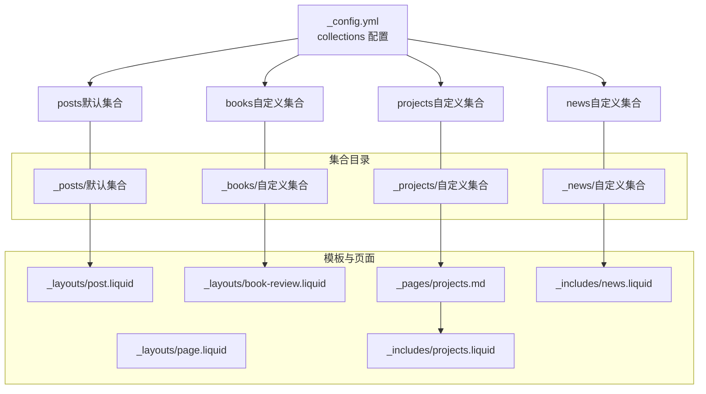
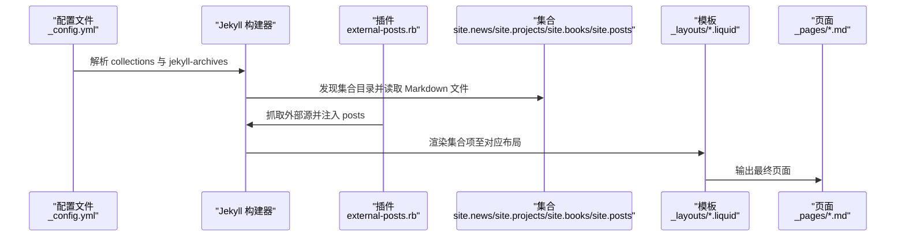
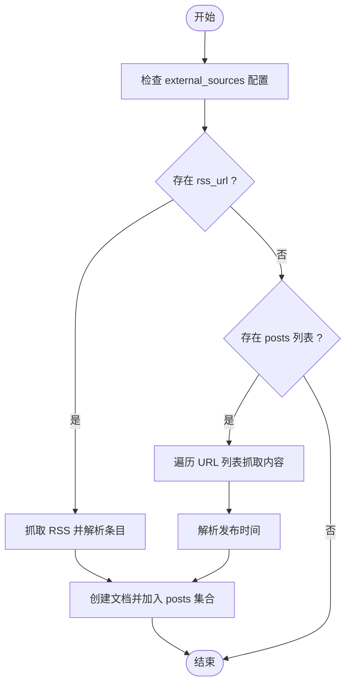
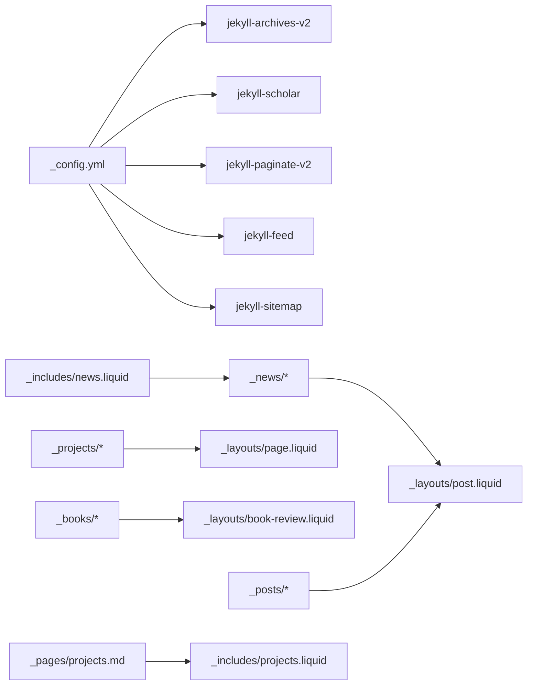

# Jekyll 集合系统

<cite>
**本文引用的文件**
- [_config.yml](file://_config.yml)
- [_posts/2025-03-26-plotly.md](file://_posts/2025-03-26-plotly.md)
- [_books/the_godfather.md](file://_books/the_godfather.md)
- [_news/announcement_1.md](file://_news/announcement_1.md)
- [_projects/1_project.md](file://_projects/1_project.md)
- [_layouts/post.liquid](file://_layouts/post.liquid)
- [_layouts/book-review.liquid](file://_layouts/book-review.liquid)
- [_layouts/page.liquid](file://_layouts/page.liquid)
- [_pages/projects.md](file://_pages/projects.md)
- [_includes/news.liquid](file://_includes/news.liquid)
- [_includes/projects.liquid](file://_includes/projects.liquid)
- [_plugins/external-posts.rb](file://_plugins/external-posts.rb)
- [Gemfile](file://Gemfile)
- [README.md](file://README.md)
- [_layouts/archive.liquid](file://_layouts/archive.liquid)
- [_scripts/search.liquid.js](file://_scripts/search.liquid.js)
</cite>

## 目录
1. [简介](#简介)
2. [项目结构](#项目结构)
3. [核心组件](#核心组件)
4. [架构总览](#架构总览)
5. [详细组件分析](#详细组件分析)
6. [依赖关系分析](#依赖关系分析)
7. [性能考量](#性能考量)
8. [故障排查指南](#故障排查指南)
9. [结论](#结论)
10. [附录](#附录)

## 简介
本文件系统性阐述该 Jekyll 站点的集合（Collections）体系，覆盖以下主题：
- 集合的概念与工作原理
- 在 _config.yml 中的集合配置、默认设置与输出规则
- 内置集合（posts）与自定义集合（news、projects、books）的差异与用途
- 集合文件的组织结构、命名约定与目录布局
- 集合项的 Front Matter 结构、排序与过滤机制
- 集合配置最佳实践与性能优化建议
- 实际配置示例与集合项创建指南

## 项目结构
该站点采用“默认集合 + 自定义集合”的混合模式：
- 默认集合：posts（自动由 Jekyll 创建）
- 自定义集合：news、projects、books（在 _config.yml 中显式声明）

图表来源
- [_config.yml](file://_config.yml)
- [_posts/2025-03-26-plotly.md](file://_posts/2025-03-26-plotly.md)
- [_news/announcement_1.md](file://_news/announcement_1.md)
- [_projects/1_project.md](file://_projects/1_project.md)
- [_books/the_godfather.md](file://_books/the_godfather.md)
- [_layouts/post.liquid](file://_layouts/post.liquid)
- [_layouts/book-review.liquid](file://_layouts/book-review.liquid)
- [_layouts/page.liquid](file://_layouts/page.liquid)
- [_pages/projects.md](file://_pages/projects.md)
- [_includes/news.liquid](file://_includes/news.liquid)
- [_includes/projects.liquid](file://_includes/projects.liquid)

章节来源
- [_config.yml](file://_config.yml)
- [_posts/2025-03-26-plotly.md](file://_posts/2025-03-26-plotly.md)
- [_news/announcement_1.md](file://_news/announcement_1.md)
- [_projects/1_project.md](file://_projects/1_project.md)
- [_books/the_godfather.md](file://_books/the_godfather.md)

## 核心组件
- 集合配置与输出规则
  - 在 _config.yml 的 collections 节点中声明自定义集合，并通过 output: true 启用生成页面。
  - posts 为默认集合，无需在 collections 中声明即可使用。
- 归档与分类支持
  - jekyll-archives-v2 插件启用集合归档（如 books），支持按年、标签、分类归档。
- 外部内容注入
  - external-posts.rb 插件将外部 RSS 或链接抓取为 posts 集合项，便于统一管理。
- 模板与页面
  - news 使用 post 布局；projects 使用 page 布局；books 使用 book-review 布局。
  - projects.md 页面对 projects 进行分组、排序与展示。

章节来源
- [_config.yml](file://_config.yml)
- [_layouts/post.liquid](file://_layouts/post.liquid)
- [_layouts/book-review.liquid](file://_layouts/book-review.liquid)
- [_layouts/page.liquid](file://_layouts/page.liquid)
- [_pages/projects.md](file://_pages/projects.md)
- [_plugins/external-posts.rb](file://_plugins/external-posts.rb)

## 架构总览
下图展示了集合从配置到渲染的关键流程：

图表来源
- [_config.yml](file://_config.yml)
- [_plugins/external-posts.rb](file://_plugins/external-posts.rb)
- [_layouts/post.liquid](file://_layouts/post.liquid)
- [_layouts/book-review.liquid](file://_layouts/book-review.liquid)
- [_layouts/page.liquid](file://_layouts/page.liquid)
- [_pages/projects.md](file://_pages/projects.md)

## 详细组件分析

### posts 默认集合
- 角色与特性
  - 默认集合，自动创建，无需在 _config.yml 显式声明。
  - 支持日期、标签、分类等元数据，用于博客文章。
- 文件组织与命名
  - 目录：_posts/
  - 命名：YYYY-MM-DD-title.md（与日期相关的文件名有助于排序）
- Front Matter 示例要点
  - 必要字段：layout、title、date（用于排序与归档）
  - 可选字段：description、tags、categories、chart.plotly 等
- 排序与过滤
  - 默认按 date 降序排列；可通过 Liquid 过滤器进行排序或分组。
- 模板与归档
  - 使用 post 布局渲染；可结合 jekyll-archives 生成年/标签/分类归档页。

章节来源
- [_config.yml](file://_config.yml)
- [_posts/2025-03-26-plotly.md](file://_posts/2025-03-26-plotly.md)
- [_layouts/post.liquid](file://_layouts/post.liquid)

### news 自定义集合
- 角色与用途
  - 用于公告、新闻等短消息，支持内联显示与跳转详情两种形式。
- 文件组织与命名
  - 目录：_news/
  - 命名：建议使用语义化名称，如 announcement_YYYYMMDD.md
- Front Matter 示例要点
  - 必要字段：layout（通常为 post）、date
  - 可选字段：inline（控制是否内联显示）、related_posts（控制相关推荐）
- 展示与排序
  - 通过 _includes/news.liquid 在页面中逆序展示（最新在前）。
  - 可限制显示数量（limit 参数）。
- 模板与归档
  - 使用 post 布局；若需分类/标签归档，可在 jekyll-archives 中为 news 配置。

章节来源
- [_news/announcement_1.md](file://_news/announcement_1.md)
- [_includes/news.liquid](file://_includes/news.liquid)
- [_layouts/post.liquid](file://_layouts/post.liquid)

### projects 自定义集合
- 角色与用途
  - 项目作品集，支持分类、重要性排序与横向/纵向展示。
- 文件组织与命名
  - 目录：_projects/
  - 命名：建议使用数字前缀或语义化名称，如 1_project.md
- Front Matter 示例要点
  - 必要字段：layout（page）、title、description
  - 关键字段：img（缩略图）、importance（排序权重）、category（分类）、related_publications（关联参考）
- 展示与排序
  - _pages/projects.md 对集合进行分组与排序（按 importance 升序/降序），并选择横向或纵向卡片布局。
  - _includes/projects.liquid/_includes/projects_horizontal.liquid 控制单个项目卡片渲染。
- 模板与归档
  - 使用 page 布局；若需分类/标签归档，可在 jekyll-archives 中为 projects 配置。

章节来源
- [_projects/1_project.md](file://_projects/1_project.md)
- [_pages/projects.md](file://_pages/projects.md)
- [_includes/projects.liquid](file://_includes/projects.liquid)
- [_layouts/page.liquid](file://_layouts/page.liquid)

### books 自定义集合
- 角色与用途
  - 图书阅读记录与评论，支持封面、评分、开始/结束日期、购买链接等。
- 文件组织与命名
  - 目录：_books/
  - 命名：建议使用书名或标识符，如 the_godfather.md
- Front Matter 示例要点
  - 必要字段：layout（book-review）、title、author
  - 关键字段：cover（封面路径或 Open Library ID/ISBN）、isbn、categories、tags、started/finished、stars、buy_link、status
- 展示与排序
  - 使用 book-review 布局渲染封面、评分与时间线信息。
  - 可结合 jekyll-archives 生成按年/标签/分类的归档页。
- 模板与归档
  - 使用 book-review 布局；归档配置参考 jekyll-archives 的 books 节点。

章节来源
- [_books/the_godfather.md](file://_books/the_godfather.md)
- [_layouts/book-review.liquid](file://_layouts/book-review.liquid)
- [_config.yml](file://_config.yml)

### 外部内容注入（posts 集合）
- 功能概述
  - external-posts.rb 插件从 RSS 或指定 URL 抓取内容，动态注入 posts 集合，统一管理外部发布。
- 工作流程
  - 遍历 external_sources 配置，分别处理 RSS 或直接 URL 列表。
  - 解析标题、摘要、正文与发布时间，创建文档并加入 posts 集合。
- 注意事项
  - 生成的文档会带有 external_source、feed_content、redirect 等字段，便于识别与跳转。

图表来源
- [_plugins/external-posts.rb](file://_plugins/external-posts.rb)
- [_config.yml](file://_config.yml)

章节来源
- [_plugins/external-posts.rb](file://_plugins/external-posts.rb)
- [_config.yml](file://_config.yml)

## 依赖关系分析
- 集合与插件
  - jekyll-archives-v2：为集合提供归档功能（如 books）。
  - jekyll-scholar：用于学术出版物管理（与集合协同）。
  - jekyll-paginate-v2、jekyll-feed、jekyll-sitemap 等：影响集合页面的分页、订阅与索引。
- 集合与模板
  - 不同集合使用不同布局（post、page、book-review），以适配各自内容形态。
- 集合与页面
  - projects.md 作为集合落地页，负责分组、排序与卡片渲染。

图表来源
- [_config.yml](file://_config.yml)
- [_layouts/post.liquid](file://_layouts/post.liquid)
- [_layouts/page.liquid](file://_layouts/page.liquid)
- [_layouts/book-review.liquid](file://_layouts/book-review.liquid)
- [_pages/projects.md](file://_pages/projects.md)
- [_includes/news.liquid](file://_includes/news.liquid)
- [_includes/projects.liquid](file://_includes/projects.liquid)

章节来源
- [_config.yml](file://_config.yml)
- [Gemfile](file://Gemfile)

## 性能考量
- 减少不必要的集合输出
  - 仅对需要生成独立页面的集合开启 output: true，避免生成大量中间文件。
- 控制集合规模
  - 将大型集合拆分为多个子集合或使用分页（jekyll-paginate-v2）。
- 优化模板渲染
  - 避免在集合渲染中执行复杂过滤链；必要时在构建阶段预处理数据。
- 外部抓取策略
  - external-posts.rb 抓取频率不宜过高，建议缓存结果或限制抓取范围。
- 资源加载
  - 图片懒加载（lazy_loading_images）与响应式图片（jekyll-imagemagick）可提升页面加载速度。

## 故障排查指南
- 集合未生成页面
  - 检查 _config.yml 中集合是否声明 output: true。
  - 确认集合目录命名正确且文件包含有效的 Front Matter。
- 排序异常
  - 确保集合项的日期字段格式一致（如 posts 的 date）。
  - 检查 Liquid 过滤器（如 sort、where）参数是否正确。
- 归档页缺失
  - 检查 jekyll-archives 配置中是否包含相应集合。
  - 确认 permalinks 设置与实际访问路径一致。
- 外部内容未注入
  - 检查 external_sources 配置与网络连通性。
  - 查看插件日志输出，确认 RSS/URL 是否被成功解析。

章节来源
- [_config.yml](file://_config.yml)
- [_plugins/external-posts.rb](file://_plugins/external-posts.rb)
- [_layouts/archive.liquid](file://_layouts/archive.liquid)

## 结论
该站点通过“默认集合 + 自定义集合”的组合，实现了灵活的内容组织与展示。posts 提供博客能力，news 与 projects 分别承载公告与作品集，books 专注图书阅读记录。配合 jekyll-archives 与自定义插件，系统具备良好的扩展性与可维护性。遵循本文的最佳实践与性能建议，可进一步提升构建效率与用户体验。

## 附录

### 集合配置示例与最佳实践
- 在 _config.yml 中声明集合并开启输出
  - 示例路径：[_config.yml](file://_config.yml)
- 为集合启用归档（如 books）
  - 示例路径：[_config.yml](file://_config.yml)
- 为集合添加默认布局
  - 示例路径：[_config.yml](file://_config.yml)

### 集合项创建指南
- posts
  - 目录：_posts/
  - 命名：YYYY-MM-DD-title.md
  - Front Matter 字段：layout、title、date、description、tags、categories 等
  - 示例路径：[_posts/2025-03-26-plotly.md](file://_posts/2025-03-26-plotly.md)
- news
  - 目录：_news/
  - 命名：announcement_YYYYMMDD.md
  - Front Matter 字段：layout、date、inline、related_posts 等
  - 示例路径：[_news/announcement_1.md](file://_news/announcement_1.md)
- projects
  - 目录：_projects/
  - 命名：数字前缀或语义化名称
  - Front Matter 字段：layout、title、description、img、importance、category、related_publications 等
  - 示例路径：[_projects/1_project.md](file://_projects/1_project.md)
- books
  - 目录：_books/
  - 命名：书名或标识符
  - Front Matter 字段：layout、title、author、cover、isbn、categories、tags、started、finished、stars、buy_link、status 等
  - 示例路径：[_books/the_godfather.md](file://_books/the_godfather.md)

### 集合访问与搜索
- 在模板中访问集合
  - 使用 site.news、site.projects、site.books、site.posts
  - 示例路径：[_pages/projects.md](file://_pages/projects.md)
- 搜索脚本中包含非 posts 集合
  - 示例路径：[_scripts/search.liquid.js](file://_scripts/search.liquid.js)

章节来源
- [_config.yml](file://_config.yml)
- [_posts/2025-03-26-plotly.md](file://_posts/2025-03-26-plotly.md)
- [_news/announcement_1.md](file://_news/announcement_1.md)
- [_projects/1_project.md](file://_projects/1_project.md)
- [_books/the_godfather.md](file://_books/the_godfather.md)
- [_pages/projects.md](file://_pages/projects.md)
- [_scripts/search.liquid.js](file://_scripts/search.liquid.js)