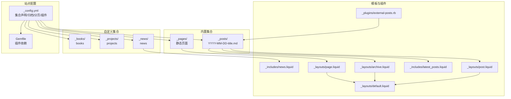
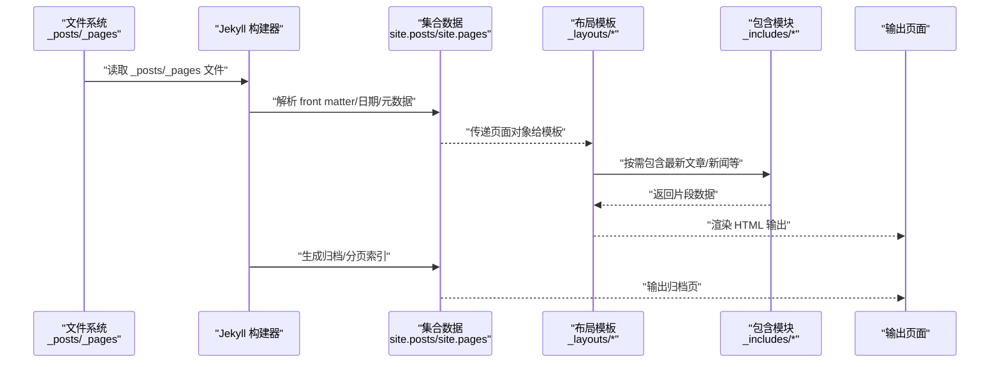
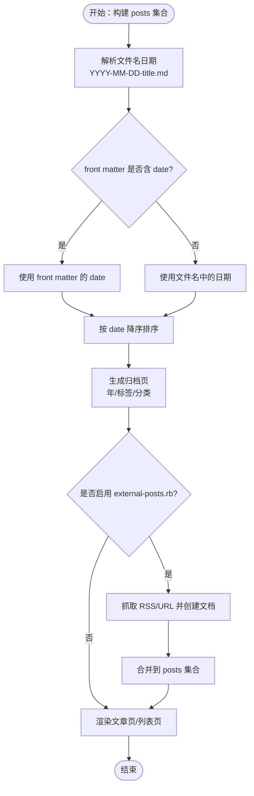
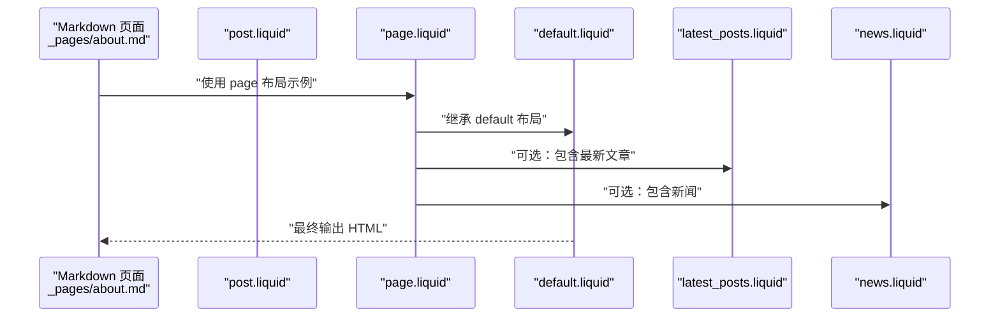
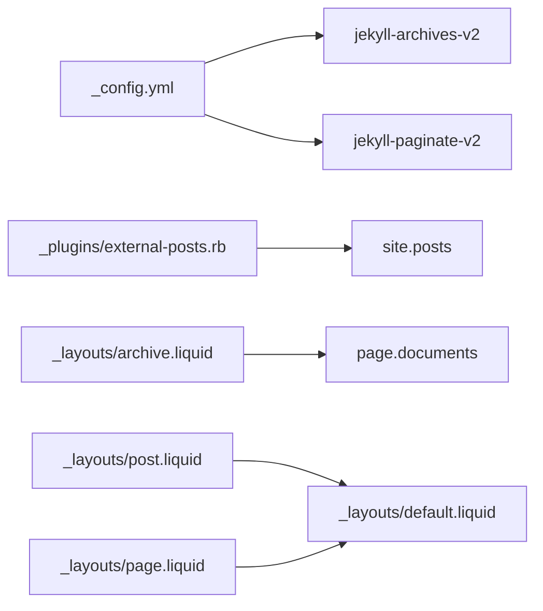

# 内置集合详解

<cite>
**本文引用的文件**
- [_config.yml](file://_config.yml)
- [_posts/2025-03-26-plotly.md](file://_posts/2025-03-26-plotly.md)
- [_pages/about.md](file://_pages/about.md)
- [_layouts/post.liquid](file://_layouts/post.liquid)
- [_layouts/page.liquid](file://_layouts/page.liquid)
- [_layouts/archive.liquid](file://_layouts/archive.liquid)
- [_layouts/default.liquid](file://_layouts/default.liquid)
- [_includes/latest_posts.liquid](file://_includes/latest_posts.liquid)
- [_includes/news.liquid](file://_includes/news.liquid)
- [_plugins/external-posts.rb](file://_plugins/external-posts.rb)
- [Gemfile](file://Gemfile)
- [_news/announcement_1.md](file://_news/announcement_1.md)
- [_books/the_godfather.md](file://_books/the_godfather.md)
- [CUSTOMIZE.md](file://CUSTOMIZE.md)
</cite>

## 目录
1. [简介](#简介)
2. [项目结构](#项目结构)
3. [核心组件](#核心组件)
4. [架构总览](#架构总览)
5. [详细组件分析](#详细组件分析)
6. [依赖关系分析](#依赖关系分析)
7. [性能考量](#性能考量)
8. [故障排查指南](#故障排查指南)
9. [结论](#结论)
10. [附录](#附录)

## 简介
本文件系统性阐述 Jekyll 内置集合 posts 与 pages 的特性、行为与使用方式，并结合本仓库的实际配置与模板进行说明。重点覆盖以下方面：
- posts 集合的自动日期解析、自动排序与归档能力
- pages 集合的静态页面属性与布局继承机制
- 默认配置与文件命名约定（如 YYYY-MM-DD-title.md）
- 内置集合与其他自定义集合（news、projects、books）的差异与优势
- 高级用法：自定义排序、条件过滤、批量处理
- 性能优化建议与最佳实践

## 项目结构
本仓库采用标准 Jekyll 结构，其中：
- posts 集合位于 _posts 目录，遵循 Jekyll 默认命名约定（YYYY-MM-DD-title.md），由 Jekyll 自动识别为内置集合
- pages 集合位于 _pages 目录，每个 Markdown 文件对应一个页面，通过 front matter 指定布局与永久链接
- 自定义集合（news、projects、books）分别位于 _news、_projects、_books，通过 _config.yml 声明启用与输出策略
- 归档与分页由 jekyll-archives-v2 与 jekyll-paginate-v2 插件支持

图表来源
- [_config.yml](file://_config.yml)
- [_posts/2025-03-26-plotly.md](file://_posts/2025-03-26-plotly.md)
- [_pages/about.md](file://_pages/about.md)
- [_layouts/post.liquid](file://_layouts/post.liquid)
- [_layouts/page.liquid](file://_layouts/page.liquid)
- [_layouts/archive.liquid](file://_layouts/archive.liquid)
- [_layouts/default.liquid](file://_layouts/default.liquid)
- [_includes/latest_posts.liquid](file://_includes/latest_posts.liquid)
- [_includes/news.liquid](file://_includes/news.liquid)
- [_plugins/external-posts.rb](file://_plugins/external-posts.rb)

章节来源
- [_config.yml](file://_config.yml)
- [_posts/2025-03-26-plotly.md](file://_posts/2025-03-26-plotly.md)
- [_pages/about.md](file://_pages/about.md)

## 核心组件
- posts 集合（内置）
  - 自动识别：以 _posts 为根目录，文件名遵循 YYYY-MM-DD-title.md 命名约定
  - 自动日期处理：front matter 中的 date 或文件名中的日期被解析为页面的 date 属性
  - 自动排序：默认按日期降序排列（最新在前）
  - 归档：通过 jekyll-archives-v2 提供年/标签/分类归档
  - 外部导入：external-posts.rb 插件可将外部 RSS/URL 文章注入 posts 集合
- pages 集合（内置）
  - 静态页面：每个 Markdown 文件生成独立页面
  - 布局继承：通过 front matter 的 layout 指定布局，布局再继承 default
  - 永久链接：可通过 permalink 控制 URL 路径
- 自定义集合（news、projects、books）
  - 通过 _config.yml 声明，可设置 output、defaults 等
  - 可复用内置集合的排序与遍历能力，但需自行组织归档与分页

章节来源
- [_config.yml](file://_config.yml)
- [_plugins/external-posts.rb](file://_plugins/external-posts.rb)
- [_layouts/post.liquid](file://_layouts/post.liquid)
- [_layouts/page.liquid](file://_layouts/page.liquid)
- [_layouts/archive.liquid](file://_layouts/archive.liquid)
- [_layouts/default.liquid](file://_layouts/default.liquid)
- [_includes/latest_posts.liquid](file://_includes/latest_posts.liquid)
- [_includes/news.liquid](file://_includes/news.liquid)
- [_posts/2025-03-26-plotly.md](file://_posts/2025-03-26-plotly.md)
- [_pages/about.md](file://_pages/about.md)
- [_news/announcement_1.md](file://_news/announcement_1.md)
- [_books/the_godfather.md](file://_books/the_godfather.md)
- [CUSTOMIZE.md](file://CUSTOMIZE.md)

## 架构总览
下图展示 posts 与 pages 在构建期的关键交互流程：从源文件到数据模型，再到模板渲染与归档生成。

图表来源
- [_config.yml](file://_config.yml)
- [_layouts/post.liquid](file://_layouts/post.liquid)
- [_layouts/page.liquid](file://_layouts/page.liquid)
- [_layouts/archive.liquid](file://_layouts/archive.liquid)
- [_includes/latest_posts.liquid](file://_includes/latest_posts.liquid)
- [_includes/news.liquid](file://_includes/news.liquid)
- [_plugins/external-posts.rb](file://_plugins/external-posts.rb)

## 详细组件分析

### posts 集合：自动日期、排序与归档
- 自动日期处理
  - 文件名中的日期（YYYY-MM-DD）会被解析为页面的 date 字段
  - front matter 中的 date 可覆盖或补充文件名日期
  - 示例：_posts/2025-03-26-plotly.md 明确设置了 date，用于控制发布时间
- 自动排序
  - 默认按 date 降序排列，便于首页展示最新文章
  - 可在模板中通过遍历 site.posts 获取有序列表
- 归档功能
  - jekyll-archives-v2 启用后，可生成按年/标签/分类的归档页
  - 归档页模板使用 page.documents 遍历该归档下的文档
- 外部文章注入
  - external-posts.rb 插件从 RSS 或指定 URL 抓取内容，构造文档并加入 posts 集合
  - 注入的文档具备标题、摘要、发布时间与重定向链接等字段

图表来源
- [_posts/2025-03-26-plotly.md](file://_posts/2025-03-26-plotly.md)
- [_plugins/external-posts.rb](file://_plugins/external-posts.rb)
- [_layouts/archive.liquid](file://_layouts/archive.liquid)
- [_config.yml](file://_config.yml)

章节来源
- [_posts/2025-03-26-plotly.md](file://_posts/2025-03-26-plotly.md)
- [_plugins/external-posts.rb](file://_plugins/external-posts.rb)
- [_layouts/archive.liquid](file://_layouts/archive.liquid)
- [_config.yml](file://_config.yml)

### pages 集合：静态页面与布局继承
- 静态页面特性
  - 每个 Markdown 文件对应一个独立页面，路径由 permalink 控制
  - 示例：about.md 使用 permalink: / 将其设为主页
- 布局继承机制
  - 页面通过 layout 指定布局；post/page 布局再继承 default
  - default 布局负责通用头部、导航、脚注与脚本加载
- 模板片段
  - latest_posts.liquid 与 news.liquid 分别用于在页面中展示最新文章与新闻条目

图表来源
- [_pages/about.md](file://_pages/about.md)
- [_layouts/page.liquid](file://_layouts/page.liquid)
- [_layouts/post.liquid](file://_layouts/post.liquid)
- [_layouts/default.liquid](file://_layouts/default.liquid)
- [_includes/latest_posts.liquid](file://_includes/latest_posts.liquid)
- [_includes/news.liquid](file://_includes/news.liquid)

章节来源
- [_pages/about.md](file://_pages/about.md)
- [_layouts/page.liquid](file://_layouts/page.liquid)
- [_layouts/post.liquid](file://_layouts/post.liquid)
- [_layouts/default.liquid](file://_layouts/default.liquid)
- [_includes/latest_posts.liquid](file://_includes/latest_posts.liquid)
- [_includes/news.liquid](file://_includes/news.liquid)

### 自定义集合：news、projects、books
- 集合声明与行为
  - news 集合在 _config.yml 中声明并设置默认布局为 post，支持 inline 新闻与链接新闻
  - projects、books 集合同样声明并开启输出
- 与内置集合的差异
  - 自定义集合不具有 posts 的自动日期与排序能力，需要在模板中显式排序或分组
  - 可通过归档与分页插件实现类似功能，但需额外配置
- 实际使用
  - news 示例：_news/announcement_1.md 使用 inline: true 直接内嵌显示
  - books 示例：_books/the_godfather.md 定义了丰富的元数据（作者、标签、分类等）

章节来源
- [_config.yml](file://_config.yml)
- [_news/announcement_1.md](file://_news/announcement_1.md)
- [_books/the_godfather.md](file://_books/the_godfather.md)
- [CUSTOMIZE.md](file://CUSTOMIZE.md)

### 归档与分页：posts 的年/标签/分类归档
- 归档启用
  - jekyll-archives-v2 在 _config.yml 中启用 posts 的 year/tags/categories 归档
  - 归档页模板使用 page.documents 遍历文档并渲染表格
- 分页
  - jekyll-paginate-v2 启用分页，配合博客主页与归档页实现多页展示

章节来源
- [_config.yml](file://_config.yml)
- [_layouts/archive.liquid](file://_layouts/archive.liquid)
- [Gemfile](file://Gemfile)

## 依赖关系分析
- 插件依赖
  - jekyll-archives-v2：提供 posts 的归档页生成
  - jekyll-paginate-v2：提供分页支持
  - jekyll-scholar、jekyll-feed、jekyll-sitemap 等：增强学术、订阅与 SEO 功能
- 模块耦合
  - 模板层通过 site.posts/site.pages 访问集合数据
  - external-posts.rb 作为 Generator 在构建期向 posts 集合注入文档
  - 归档页模板依赖 page.documents 与 page.type 等变量

图表来源
- [_config.yml](file://_config.yml)
- [_plugins/external-posts.rb](file://_plugins/external-posts.rb)
- [_layouts/archive.liquid](file://_layouts/archive.liquid)
- [_layouts/post.liquid](file://_layouts/post.liquid)
- [_layouts/page.liquid](file://_layouts/page.liquid)
- [_layouts/default.liquid](file://_layouts/default.liquid)

章节来源
- [_config.yml](file://_config.yml)
- [Gemfile](file://Gemfile)
- [_plugins/external-posts.rb](file://_plugins/external-posts.rb)
- [_layouts/archive.liquid](file://_layouts/archive.liquid)
- [_layouts/post.liquid](file://_layouts/post.liquid)
- [_layouts/page.liquid](file://_layouts/page.liquid)
- [_layouts/default.liquid](file://_layouts/default.liquid)

## 性能考量
- 减少不必要的集合与文件
  - 在 _config.yml 中仅启用必要的集合与输出，避免无用文件参与构建
- 控制归档范围
  - 仅启用必要的归档类型（年/标签/分类），减少生成页数量
- 合理使用分页
  - 适当设置分页每页条数，避免过深的分页层级
- 外部数据抓取
  - external-posts.rb 在构建时进行网络请求，建议限制抓取频率与条数，或缓存结果
- 模板渲染开销
  - 避免在模板中进行复杂计算，尽量在生成期完成数据准备

## 故障排查指南
- 归档页空白
  - 检查 jekyll-archives-v2 是否启用及归档类型配置是否正确
  - 确认归档页模板中 page.documents 是否存在数据
- 文章未按预期排序
  - 确认 front matter 中 date 是否正确设置，或文件名是否符合 YYYY-MM-DD 格式
  - 检查是否存在多个日期来源导致冲突
- 外部文章未出现
  - 检查 external_sources 配置与网络访问权限
  - 查看构建日志中 external-posts.rb 的输出信息
- 永久链接异常
  - 检查页面 front matter 中 permalink 设置是否与实际路径一致

章节来源
- [_config.yml](file://_config.yml)
- [_plugins/external-posts.rb](file://_plugins/external-posts.rb)
- [_layouts/archive.liquid](file://_layouts/archive.liquid)
- [_posts/2025-03-26-plotly.md](file://_posts/2025-03-26-plotly.md)
- [_pages/about.md](file://_pages/about.md)

## 结论
- posts 作为 Jekyll 内置集合，天然具备自动日期解析、排序与归档能力，适合博客类内容管理
- pages 集合强调静态页面与布局继承，适合组织关于页、项目页等非时间序列内容
- 自定义集合（news、projects、books）提供了灵活的扩展能力，但需在模板中自行实现排序与分组
- 通过合理的配置与模板设计，可充分发挥内置集合的优势，并结合插件实现更丰富的功能

## 附录
- 默认配置要点
  - posts：启用归档（年/标签/分类），设置 permalink 与分页
  - pages：通过 permalink 控制路径，使用布局继承
  - 自定义集合：collections 中声明，可设置 output 与 defaults
- 文件命名约定
  - posts：YYYY-MM-DD-title.md
  - pages：任意 Markdown 文件，通过 permalink 控制 URL
- 高级用法建议
  - 自定义排序：在模板中使用 sort_by/date 排序（注意性能）
  - 条件过滤：使用 where/where_exp 过滤特定字段
  - 批量处理：利用 Liquid for 循环与切片（limit/offset）实现分页与分组

章节来源
- [_config.yml](file://_config.yml)
- [_posts/2025-03-26-plotly.md](file://_posts/2025-03-26-plotly.md)
- [_pages/about.md](file://_pages/about.md)
- [_layouts/post.liquid](file://_layouts/post.liquid)
- [_layouts/page.liquid](file://_layouts/page.liquid)
- [_layouts/archive.liquid](file://_layouts/archive.liquid)
- [_includes/latest_posts.liquid](file://_includes/latest_posts.liquid)
- [_includes/news.liquid](file://_includes/news.liquid)
- [_plugins/external-posts.rb](file://_plugins/external-posts.rb)
- [Gemfile](file://Gemfile)
- [_news/announcement_1.md](file://_news/announcement_1.md)
- [_books/the_godfather.md](file://_books/the_godfather.md)
- [CUSTOMIZE.md](file://CUSTOMIZE.md)