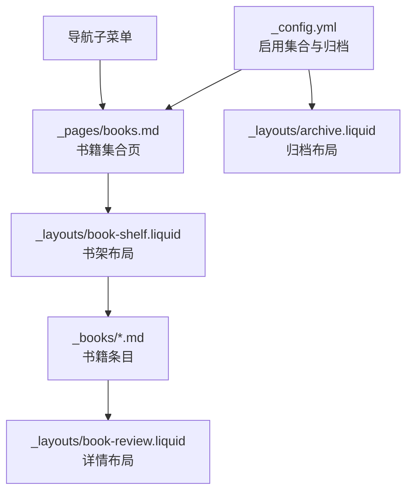
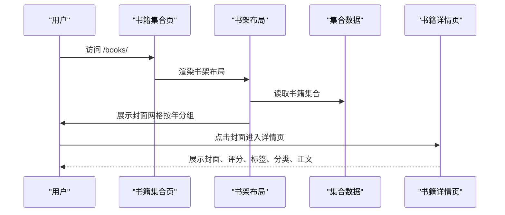
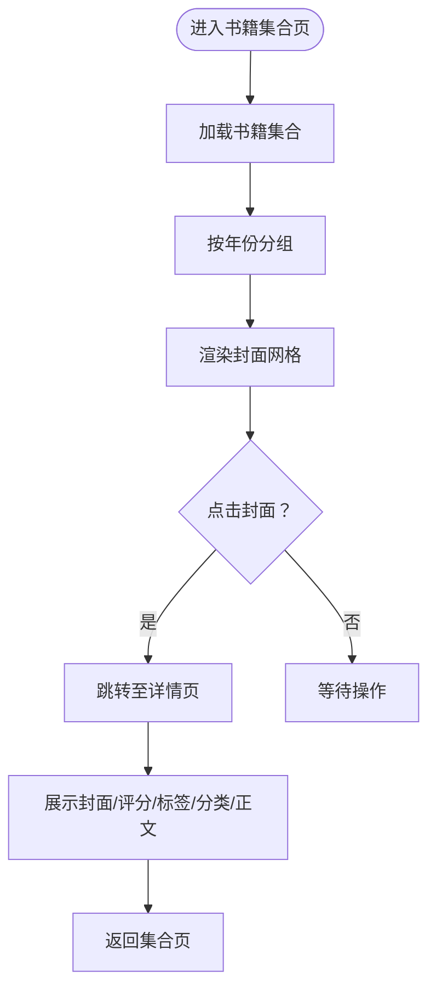
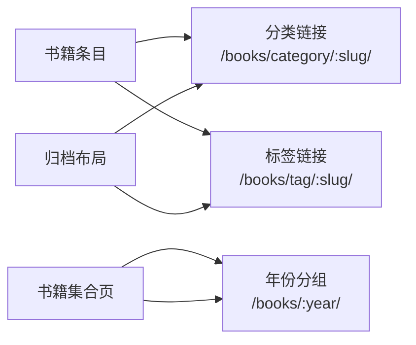
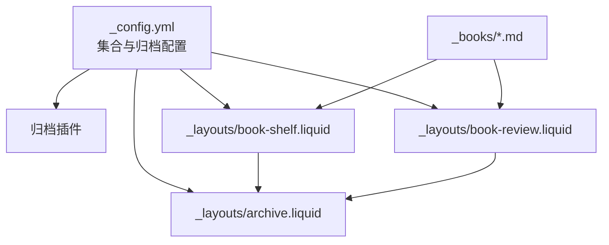

# 书籍集合

<cite>
**本文引用的文件**
- [_config.yml](file://_config.yml)
- [_pages/books.md](file://_pages/books.md)
- [_layouts/book-shelf.liquid](file://_layouts/book-shelf.liquid)
- [_layouts/book-review.liquid](file://_layouts/book-review.liquid)
- [_books/the_godfather.md](file://_books/the_godfather.md)
- [_layouts/archive.liquid](file://_layouts/archive.liquid)
- [Gemfile](file://Gemfile)
- [CUSTOMIZE.md](file://CUSTOMIZE.md)
</cite>

## 目录
1. [简介](#简介)
2. [项目结构](#项目结构)
3. [核心组件](#核心组件)
4. [架构总览](#架构总览)
5. [详细组件分析](#详细组件分析)
6. [依赖关系分析](#依赖关系分析)
7. [性能考量](#性能考量)
8. [故障排查指南](#故障排查指南)
9. [结论](#结论)
10. [附录](#附录)

## 简介
本文件系统性阐述“书籍集合”的设计目标、数据模型、展示布局与交互、分类与标签体系、与“出版物集合”的差异与适用场景，并提供创建示例、内容管理最佳实践以及样式定制与用户体验优化建议。该站点通过 Jekyll 集合（Collection）管理书籍条目，结合自定义布局与归档插件，实现书籍封面网格展示、按年份分组、按标签与分类筛选、以及书籍详情页的丰富信息呈现。

## 项目结构
书籍集合由以下关键要素构成：
- 配置层：在站点配置中启用书籍集合与归档功能，支持按年、标签、分类归档。
- 内容层：书籍条目以 Markdown 文件形式存放在集合目录中，采用统一的 YAML 头部字段。
- 布局层：书籍书架页布局负责封面网格与按年分组；书籍详情页布局负责展示封面、阅读进度、评分、购买链接、标签与分类等。
- 归档层：通过归档布局渲染标签与分类的独立归档页面。
- 导航层：书籍书架页作为子菜单项出现在导航中，便于访问。

图表来源
- [_config.yml:147-261](file://_config.yml#L147-L261)
- [_pages/books.md:1-7](file://_pages/books.md#L1-L7)
- [_layouts/book-shelf.liquid:1-50](file://_layouts/book-shelf.liquid#L1-L50)
- [_layouts/book-review.liquid:1-258](file://_layouts/book-review.liquid#L1-L258)
- [_layouts/archive.liquid:1-38](file://_layouts/archive.liquid#L1-L38)

章节来源
- [_config.yml:147-261](file://_config.yml#L147-L261)
- [_pages/books.md:1-14](file://_pages/books.md#L1-L14)

## 核心组件
- 书籍集合配置与归档
  - 在站点配置中启用书籍集合输出，并开启书籍集合的年、标签、分类归档，使书籍具备按年、标签、分类的独立归档页面。
- 书籍集合页
  - 书籍集合页使用书架布局，读取集合变量并遍历条目，按日期年份分组显示书籍封面网格。
- 书籍条目
  - 条目采用统一的 YAML 头部字段，包括标题、作者、封面、OLID/ISBN、分类、标签、开始/完成日期、状态、评分、购买链接等。
- 书籍详情页
  - 详情页布局负责展示封面、作者与出版年份、阅读起止时间、评分与购买链接、标签与分类导航、正文内容等。
- 归档页面
  - 使用通用归档布局渲染标签与分类的列表页面，支持跳转到具体条目。

章节来源
- [_config.yml:147-261](file://_config.yml#L147-L261)
- [_pages/books.md:1-7](file://_pages/books.md#L1-L7)
- [_layouts/book-shelf.liquid:6-49](file://_layouts/book-shelf.liquid#L6-L49)
- [_layouts/book-review.liquid:15-159](file://_layouts/book-review.liquid#L15-L159)
- [_layouts/archive.liquid:18-37](file://_layouts/archive.liquid#L18-L37)

## 架构总览
书籍集合的前端渲染流程如下：
- Jekyll 构建时读取书籍集合目录中的 Markdown 条目，解析 YAML 头部字段。
- 书籍集合页通过书架布局遍历集合，按年份分组生成封面网格。
- 点击封面进入书籍详情页，详情页布局根据条目字段渲染封面、阅读进度、评分、购买链接、标签与分类。
- 归档布局为标签与分类生成独立页面，便于浏览与筛选。

图表来源
- [_pages/books.md:1-7](file://_pages/books.md#L1-L7)
- [_layouts/book-shelf.liquid:6-49](file://_layouts/book-shelf.liquid#L6-L49)
- [_layouts/book-review.liquid:15-159](file://_layouts/book-review.liquid#L15-L159)

## 详细组件分析

### 数据模型与字段定义
书籍条目的 YAML 头部字段用于驱动展示与归档：
- 必填/常用字段
  - title：书名
  - author：作者
  - cover：本地封面图片路径（相对站点根）
  - olid：Open Library ID（用于自动拉取封面）
  - isbn：ISBN（用于自动拉取封面）
  - categories：分类数组（用于分类归档）
  - tags：标签数组（用于标签归档）
  - started/finished：阅读起始与完成日期
  - released：出版年份
  - stars：评分（支持半星）
  - status：阅读状态（如 finished、reading 等）
  - buy_link：购买链接
  - goodreads_review：Goodreads 评论链接标识
- 内容字段
  - 页面正文：用于书籍评述或摘录

字段来源与用法参考：
- 书籍条目示例：[the_godfather.md:1-28](file://_books/the_godfather.md#L1-L28)
- 详情页字段渲染：[_layouts/book-review.liquid:18-100](file://_layouts/book-review.liquid#L18-L100)
- 封面图优先级与尺寸控制：[_layouts/book-shelf.liquid:22-30](file://_layouts/book-shelf.liquid#L22-L30)

章节来源
- [_books/the_godfather.md:1-28](file://_books/the_godfather.md#L1-L28)
- [_layouts/book-review.liquid:18-100](file://_layouts/book-review.liquid#L18-L100)
- [_layouts/book-shelf.liquid:22-30](file://_layouts/book-shelf.liquid#L22-L30)

### 展示布局与交互
- 书籍书架布局
  - 读取集合变量，按条目日期年份分组，生成年份标题与封面网格。
  - 封面图优先级：本地 cover > OLID > ISBN；默认高度固定。
  - 状态徽标：根据预定义状态集合渲染对应状态标签。
- 书籍详情布局
  - 标题与副标题（作者/出版年份）。
  - 阅读时间线与评分（支持半星）。
  - 购买链接与 Goodreads 链接识别。
  - 标签与分类导航，点击可跳转至归档页。
  - 正文内容区域，支持富文本与媒体元素。

图表来源
- [_layouts/book-shelf.liquid:6-49](file://_layouts/book-shelf.liquid#L6-L49)
- [_layouts/book-review.liquid:15-159](file://_layouts/book-review.liquid#L15-L159)

章节来源
- [_layouts/book-shelf.liquid:6-49](file://_layouts/book-shelf.liquid#L6-L49)
- [_layouts/book-review.liquid:15-159](file://_layouts/book-review.liquid#L15-L159)

### 分类与标签系统
- 分类（categories）
  - 支持多分类，渲染为分类链接，点击跳转至分类归档页。
- 标签（tags）
  - 支持多标签，渲染为标签链接，点击跳转至标签归档页。
- 年份归档
  - 书籍集合页按年份分组，点击年份标题可跳转至年份归档页。

图表来源
- [_layouts/book-review.liquid:83-99](file://_layouts/book-review.liquid#L83-L99)
- [_layouts/book-shelf.liquid:15-17](file://_layouts/book-shelf.liquid#L15-L17)
- [_layouts/archive.liquid:1-38](file://_layouts/archive.liquid#L1-L38)

章节来源
- [_layouts/book-review.liquid:83-99](file://_layouts/book-review.liquid#L83-L99)
- [_layouts/book-shelf.liquid:15-17](file://_layouts/book-shelf.liquid#L15-L17)
- [_layouts/archive.liquid:1-38](file://_layouts/archive.liquid#L1-L38)

### 与出版物集合的区别与适用场景
- 书籍集合
  - 适用于个人阅读记录、书评与收藏展示，强调封面可视化、阅读状态与评分。
  - 提供按年、标签、分类的归档与导航。
- 出版物集合（参考出版物页面与相关布局）
  - 更偏向学术论文、报告等正式出版物的索引与检索，强调引用格式、DOI、PDF 等学术元信息。
  - 通常由专门的文献管理工具（如 BibTeX）驱动，侧重引用与链接而非视觉封面。

章节来源
- [CUSTOMIZE.md:80-88](file://CUSTOMIZE.md#L80-L88)

### 创建示例与内容管理最佳实践
- 创建书籍条目
  - 在书籍集合目录中新增 Markdown 文件，设置必要的 YAML 头部字段（标题、作者、封面/OLID/ISBN、分类、标签、日期、状态、评分、购买链接等）。
  - 示例参考：[the_godfather.md:1-28](file://_books/the_godfather.md#L1-L28)
- 统一字段规范
  - 保持字段命名一致，避免大小写与空格差异导致的归档异常。
- 封面与尺寸
  - 优先使用本地封面图片，确保尺寸与高度一致以获得稳定网格效果。
- 状态与评分
  - 使用预定义状态值，确保状态徽标正确渲染；评分支持半星，便于直观表达偏好。
- 标签与分类
  - 合理使用标签与分类，避免过长或重复，提升归档可读性。
- 导航与归档
  - 书籍集合页作为导航子菜单项，便于访问；归档页为标签与分类提供独立入口。

章节来源
- [_books/the_godfather.md:1-28](file://_books/the_godfather.md#L1-L28)
- [_layouts/book-shelf.liquid:22-41](file://_layouts/book-shelf.liquid#L22-L41)
- [_layouts/book-review.liquid:48-76](file://_layouts/book-review.liquid#L48-L76)

### 样式定制与用户体验优化
- 封面网格
  - 固定高度与间距，保证网格对齐；可调整封面尺寸以适配不同设备。
- 状态徽标
  - 为不同状态设置语义化样式，提升可读性与一致性。
- 详情页排版
  - 图片与正文的响应式布局，移动端断点优化；标签与分类导航清晰可见。
- 交互提示
  - 购买链接与 Goodreads 链接的图标区分，增强识别度。
- 可访问性
  - 为封面图提供替代文本；为链接提供明确的可读名称。

章节来源
- [_layouts/book-shelf.liquid:22-41](file://_layouts/book-shelf.liquid#L22-L41)
- [_layouts/book-review.liquid:161-258](file://_layouts/book-review.liquid#L161-L258)

## 依赖关系分析
- 集合与归档
  - 书籍集合在站点配置中启用输出与归档，归档类型包含年、标签、分类。
- 插件支持
  - 使用归档插件生成书籍集合的归档页面。
- 布局依赖
  - 书籍集合页依赖书架布局；详情页依赖详情布局；归档页依赖通用归档布局。

图表来源
- [_config.yml:147-261](file://_config.yml#L147-L261)
- [Gemfile:6-26](file://Gemfile#L6-L26)
- [_layouts/book-shelf.liquid:1-50](file://_layouts/book-shelf.liquid#L1-L50)
- [_layouts/book-review.liquid:1-258](file://_layouts/book-review.liquid#L1-L258)
- [_layouts/archive.liquid:1-38](file://_layouts/archive.liquid#L1-L38)

章节来源
- [_config.yml:147-261](file://_config.yml#L147-L261)
- [Gemfile:6-26](file://Gemfile#L6-L26)

## 性能考量
- 静态生成
  - 书籍集合在构建阶段完成渲染，运行时无需动态查询，加载速度快。
- 图片优化
  - 建议压缩封面图片，合理设置尺寸，减少带宽占用。
- 归档规模
  - 当书籍数量较多时，归档页面可能较长；可通过合理的分类与标签组织降低单页压力。
- 响应式设计
  - 确保在小屏设备上封面网格与文字仍具可读性。

## 故障排查指南
- 封面未显示
  - 检查封面路径是否正确；若使用 OLID/ISBN，请确认网络可达且 ID 有效。
- 状态徽标不显示
  - 确认状态值在预定义集合内，注意大小写与空白字符。
- 归档链接无效
  - 确认归档插件已启用，且归档类型在配置中开启。
- 书籍集合页无内容
  - 确认集合目录存在条目，且集合已在配置中启用输出。

章节来源
- [_layouts/book-shelf.liquid:22-41](file://_layouts/book-shelf.liquid#L22-L41)
- [_layouts/book-review.liquid:32-41](file://_layouts/book-review.liquid#L32-L41)
- [_config.yml:257-258](file://_config.yml#L257-L258)

## 结论
书籍集合通过 Jekyll 集合与归档机制，实现了以封面为中心的阅读记录展示，配合标签与分类归档，提供了良好的浏览与检索体验。其设计兼顾了视觉呈现与信息组织，适合个人书单、读书笔记与阅读回顾场景。通过统一字段规范、合理的内容组织与样式定制，可进一步提升可用性与可维护性。

## 附录
- 书籍集合页示例：[_pages/books.md:1-14](file://_pages/books.md#L1-L14)
- 书籍条目示例：[_books/the_godfather.md:1-28](file://_books/the_godfather.md#L1-L28)
- 详情布局参考：[_layouts/book-review.liquid:1-258](file://_layouts/book-review.liquid#L1-L258)
- 书架布局参考：[_layouts/book-shelf.liquid:1-50](file://_layouts/book-shelf.liquid#L1-L50)
- 归档布局参考：[_layouts/archive.liquid:1-38](file://_layouts/archive.liquid#L1-L38)
- 配置与插件：[_config.yml:147-261](file://_config.yml#L147-L261)、[Gemfile:6-26](file://Gemfile#L6-L26)