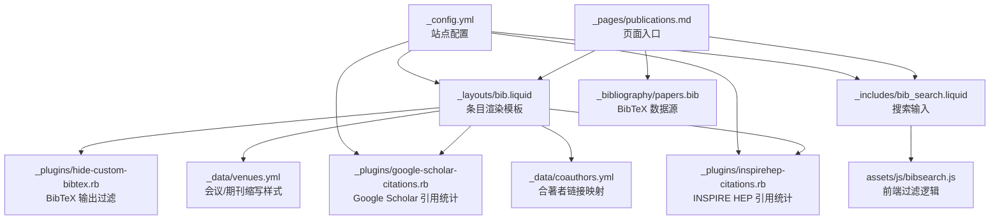
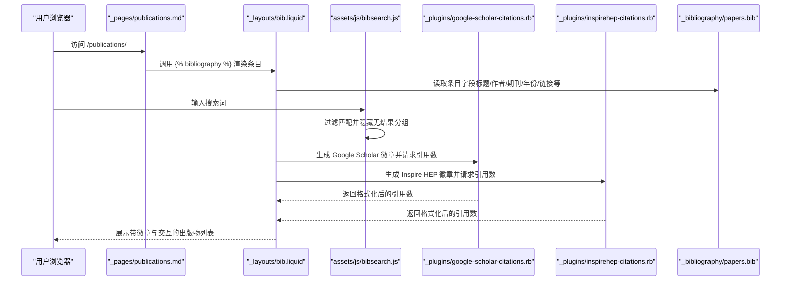
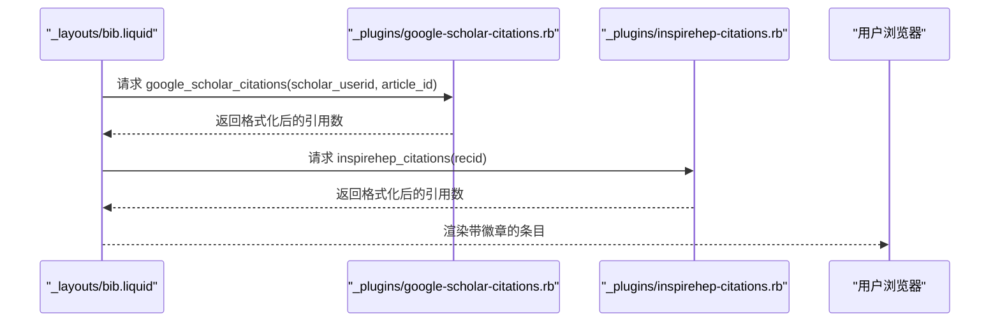
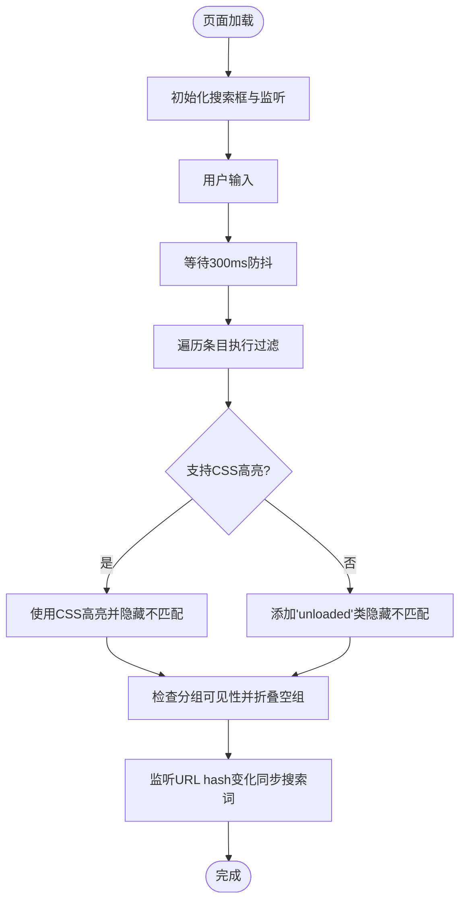
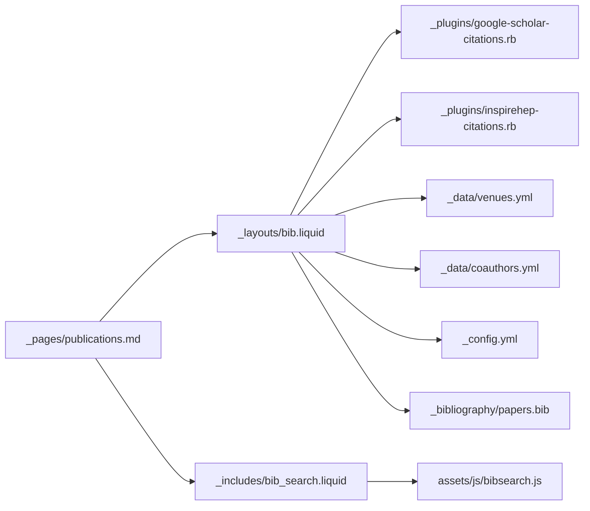

# 出版物集合

<cite>
**本文档引用的文件**
- [_pages/publications.md](file://_pages/publications.md)
- [_layouts/bib.liquid](file://_layouts/bib.liquid)
- [_includes/bib_search.liquid](file://_includes/bib_search.liquid)
- [_plugins/google-scholar-citations.rb](file://_plugins/google-scholar-citations.rb)
- [_plugins/inspirehep-citations.rb](file://_plugins/inspirehep-citations.rb)
- [_plugins/hide-custom-bibtex.rb](file://_plugins/hide-custom-bibtex.rb)
- [_config.yml](file://_config.yml)
- [_bibliography/papers.bib](file://_bibliography/papers.bib)
- [_data/venues.yml](file://_data/venues.yml)
- [_data/coauthors.yml](file://_data/coauthors.yml)
- [_includes/citation.liquid](file://_includes/citation.liquid)
- [assets/js/bibsearch.js](file://assets/js/bibsearch.js)
</cite>

## 目录
1. [简介](#简介)
2. [项目结构](#项目结构)
3. [核心组件](#核心组件)
4. [架构总览](#架构总览)
5. [详细组件分析](#详细组件分析)
6. [依赖关系分析](#依赖关系分析)
7. [性能考量](#性能考量)
8. [故障排查指南](#故障排查指南)
9. [结论](#结论)
10. [附录](#附录)

## 简介
本文件系统性阐述该个人主页中“出版物集合”的设计目标、数据结构、前端渲染与交互、引用统计与徽章集成（Google Scholar、INSPIRE HEP）、BibTeX 文件格式与管理规范、搜索与筛选能力，以及样式定制与学术展示的最佳实践。其核心目标是：以简洁一致的方式呈现论文列表，支持本地检索、自动抓取引用统计、按会议/期刊缩写进行视觉标识，并提供可维护的 BibTeX 数据源。

## 项目结构
围绕出版物集合的关键目录与文件如下：
- 页面入口：[_pages/publications.md](file://_pages/publications.md)
- 渲染模板：[_layouts/bib.liquid](file://_layouts/bib.liquid)
- 搜索组件：[_includes/bib_search.liquid](file://_includes/bib_search.liquid)、[assets/js/bibsearch.js](file://assets/js/bibsearch.js)
- 引用统计插件：[_plugins/google-scholar-citations.rb](file://_plugins/google-scholar-citations.rb)、[_plugins/inspirehep-citations.rb](file://_plugins/inspirehep-citations.rb)
- BibTeX 过滤器：[_plugins/hide-custom-bibtex.rb](file://_plugins/hide-custom-bibtex.rb)
- 配置项：[_config.yml](file://_config.yml)
- 数据源：[_bibliography/papers.bib](file://_bibliography/papers.bib)、[_data/venues.yml](file://_data/venues.yml)、[_data/coauthors.yml](file://_data/coauthors.yml)
- 引用示例：[_includes/citation.liquid](file://_includes/citation.liquid)

图表来源
- [_pages/publications.md:1-21](file://_pages/publications.md#L1-L21)
- [_layouts/bib.liquid:1-373](file://_layouts/bib.liquid#L1-L373)
- [_includes/bib_search.liquid:1-5](file://_includes/bib_search.liquid#L1-L5)
- [assets/js/bibsearch.js:1-71](file://assets/js/bibsearch.js#L1-L71)
- [_plugins/hide-custom-bibtex.rb:1-19](file://_plugins/hide-custom-bibtex.rb#L1-L19)
- [_plugins/google-scholar-citations.rb:1-86](file://_plugins/google-scholar-citations.rb#L1-L86)
- [_plugins/inspirehep-citations.rb:1-58](file://_plugins/inspirehep-citations.rb#L1-L58)
- [_data/venues.yml:1-64](file://_data/venues.yml#L1-L64)
- [_data/coauthors.yml:1-35](file://_data/coauthors.yml#L1-L35)
- [_config.yml:264-332](file://_config.yml#L264-L332)
- [_bibliography/papers.bib:1-75](file://_bibliography/papers.bib#L1-L75)

章节来源
- [_pages/publications.md:1-21](file://_pages/publications.md#L1-L21)
- [_config.yml:264-332](file://_config.yml#L264-L332)

## 核心组件
- 页面与入口
  - 公开页面通过 [_pages/publications.md](file://_pages/publications.md) 提供导航入口，内嵌搜索组件并调用 Jekyll Scholar 的  输出。
- 条目渲染模板
  - [_layouts/bib.liquid](file://_layouts/bib.liquid) 负责单篇出版物的标题、作者、期刊/会议信息、链接按钮、徽章、摘要与 BibTeX 块等的渲染。
- 搜索与筛选
  - 模板 [_includes/bib_search.liquid](file://_includes/bib_search.liquid) 注入搜索框；[assets/js/bibsearch.js](file://assets/js/bibsearch.js) 实现前端实时过滤与分组隐藏。
- 引用统计与徽章
  - 插件 [_plugins/google-scholar-citations.rb](file://_plugins/google-scholar-citations.rb) 与 [_plugins/inspirehep-citations.rb](file://_plugins/inspirehep-citations.rb) 分别抓取 Google Scholar 与 INSPIRE HEP 的引用计数，并在模板中以徽章形式展示。
- BibTeX 数据与输出
  - 数据源 [_bibliography/papers.bib](file://_bibliography/papers.bib) 提供条目；过滤器 [_plugins/hide-custom-bibtex.rb](file://_plugins/hide-custom-bibtex.rb) 控制输出字段；配置项 [_config.yml](file://_config.yml) 定义样式、分组与关键词过滤。
- 视觉与交互增强
  - 会议/期刊缩写样式由 [_data/venues.yml](file://_data/venues.yml) 提供；合著者链接映射由 [_data/coauthors.yml](file://_data/coauthors.yml) 提供；最大作者数限制与动画延迟由 [_config.yml](file://_config.yml) 控制。

章节来源
- [_pages/publications.md:1-21](file://_pages/publications.md#L1-L21)
- [_layouts/bib.liquid:1-373](file://_layouts/bib.liquid#L1-L373)
- [_includes/bib_search.liquid:1-5](file://_includes/bib_search.liquid#L1-L5)
- [assets/js/bibsearch.js:1-71](file://assets/js/bibsearch.js#L1-L71)
- [_plugins/google-scholar-citations.rb:1-86](file://_plugins/google-scholar-citations.rb#L1-L86)
- [_plugins/inspirehep-citations.rb:1-58](file://_plugins/inspirehep-citations.rb#L1-L58)
- [_plugins/hide-custom-bibtex.rb:1-19](file://_plugins/hide-custom-bibtex.rb#L1-L19)
- [_config.yml:264-332](file://_config.yml#L264-L332)
- [_data/venues.yml:1-64](file://_data/venues.yml#L1-L64)
- [_data/coauthors.yml:1-35](file://_data/coauthors.yml#L1-L35)

## 架构总览
下图展示了从页面到数据、再到渲染与外部服务的整体流程：

图表来源
- [_pages/publications.md:14-20](file://_pages/publications.md#L14-L20)
- [_layouts/bib.liquid:257-340](file://_layouts/bib.liquid#L257-L340)
- [assets/js/bibsearch.js:3-71](file://assets/js/bibsearch.js#L3-L71)
- [_plugins/google-scholar-citations.rb:28-82](file://_plugins/google-scholar-citations.rb#L28-L82)
- [_plugins/inspirehep-citations.rb:19-53](file://_plugins/inspirehep-citations.rb#L19-L53)
- [_bibliography/papers.bib:6-75](file://_bibliography/papers.bib#L6-L75)

## 详细组件分析

### 数据结构与字段定义
- 数据源：BibTeX 条目位于 [_bibliography/papers.bib](file://_bibliography/papers.bib)，示例包含以下常用字段：
  - 必填/通用：author、title、year
  - 会议/期刊：booktitle、journal、abbr（用于缩写徽章与样式）
  - 在线资源：html、pdf、arxiv、doi、code、slides、poster、video、website、blog、supp
  - 辅助信息：abstract、annotation、additional_info、note、month、location、school、website
  - 内部控制：selected、bibtex_show、preview、award、award_name、annotation
  - 引用统计集成：google_scholar_id、inspirehep_id、altmetric、dimensions
- 字段标准化建议
  - 年份使用四位数字；月份使用英文缩写或完整名称；作者名保留排序一致性；arxiv 使用预印本编号；DOI 使用标准前缀；链接统一为绝对或相对路径。
  - 使用 abbr 对会议/期刊进行统一缩写，以便与 [_data/venues.yml](file://_data/venues.yml) 匹配并应用颜色与跳转。
- 输出过滤
  - 配置项 [_config.yml](file://_config.yml) 中的 filtered_bibtex_keywords 控制输出时隐藏的自定义字段，确保最终显示的 BibTeX 更加整洁。

章节来源
- [_bibliography/papers.bib:6-75](file://_bibliography/papers.bib#L6-L75)
- [_config.yml:300-325](file://_config.yml#L300-L325)

### 渲染与样式定制
- 渲染模板 [_layouts/bib.liquid](file://_layouts/bib.liquid) 负责：
  - 作者列表：支持自我标注、合著者链接、超长作者展开动画与省略号提示。
  - 会议/期刊/论文集：根据条目类型动态拼接显示文本。
  - 链接按钮：按存在性显示 HTML、PDF、arXiv、DOI、BibTeX、视频、代码、海报、幻灯片、网站等。
  - 徽章：Altmetric、Dimensions、Google Scholar、Inspire HEP，按配置开关与条目字段决定是否显示。
  - 缩略图：当启用时，基于 abbr 或 preview 字段展示徽标或预览图。
- 样式与主题
  - 会议/期刊缩写样式：通过 [_data/venues.yml](file://_data/venues.yml) 设置颜色与跳转链接，模板中读取并注入样式。
  - 合著者链接：通过 [_data/coauthors.yml](file://_data/coauthors.yml) 将作者姓氏映射到 URL，提升可发现性。
  - 作者上限与动画：[_config.yml](file://_config.yml) 的 max_author_limit 与 more_authors_animation_delay 控制长列表的可读性与交互体验。

章节来源
- [_layouts/bib.liquid:1-373](file://_layouts/bib.liquid#L1-L373)
- [_data/venues.yml:1-64](file://_data/venues.yml#L1-L64)
- [_data/coauthors.yml:1-35](file://_data/coauthors.yml#L1-L35)
- [_config.yml:294-329](file://_config.yml#L294-L329)

### 引用统计与徽章显示
- Google Scholar 徽章
  - 模板中通过占位符生成徽章图片链接，实际数值由 [_plugins/google-scholar-citations.rb](file://_plugins/google-scholar-citations.rb) 动态抓取。
  - 抓取策略：解析页面 meta 标签中的“被引次数”字符串，支持千/百万单位的人类可读格式化；对重复请求进行缓存，避免重复抓取。
- Inspire HEP 徽章
  - 模板中通过占位符生成徽章图片链接，实际数值由 [_plugins/inspirehep-citations.rb](file://_plugins/inspirehep-citations.rb) 通过 API 获取。
  - 抓取策略：调用 Inspire HEP API 查询 citation_count，返回后进行人类可读格式化；同样具备缓存与错误兜底。
- 配置开关
  - 是否启用各徽章由 [_config.yml](file://_config.yml) 的 enable_publication_badges 控制。

图表来源
- [_layouts/bib.liquid:314-337](file://_layouts/bib.liquid#L314-L337)
- [_plugins/google-scholar-citations.rb:28-82](file://_plugins/google-scholar-citations.rb#L28-L82)
- [_plugins/inspirehep-citations.rb:19-53](file://_plugins/inspirehep-citations.rb#L19-L53)

章节来源
- [_layouts/bib.liquid:257-340](file://_layouts/bib.liquid#L257-L340)
- [_plugins/google-scholar-citations.rb:1-86](file://_plugins/google-scholar-citations.rb#L1-L86)
- [_plugins/inspirehep-citations.rb:1-58](file://_plugins/inspirehep-citations.rb#L1-L58)
- [_config.yml:294-298](file://_config.yml#L294-L298)

### 搜索与筛选功能
- 搜索组件
  - 模板 [_includes/bib_search.liquid](file://_includes/bib_search.liquid) 注入搜索框；页面 [_pages/publications.md](file://_pages/publications.md) 开启站点级搜索开关。
- 前端过滤逻辑
  - [assets/js/bibsearch.js](file://assets/js/bibsearch.js) 实现：
    - 输入防抖（300ms）以降低频繁重排。
    - 高亮匹配文本（优先使用 CSS.highlights），否则回退为添加“unloaded”类隐藏不匹配条目。
    - 自动折叠无可见子项的分组标题（如年份分组）。
    - 支持 URL hash 变更时同步搜索词。
- 使用建议
  - 搜索词大小写不敏感；匹配范围覆盖条目文本（标题、作者、摘要等）。
  - 与分组隐藏配合，保持界面整洁与可读性。

图表来源
- [_includes/bib_search.liquid:1-5](file://_includes/bib_search.liquid#L1-L5)
- [assets/js/bibsearch.js:3-71](file://assets/js/bibsearch.js#L3-L71)
- [_pages/publications.md:14-20](file://_pages/publications.md#L14-L20)

章节来源
- [_includes/bib_search.liquid:1-5](file://_includes/bib_search.liquid#L1-L5)
- [assets/js/bibsearch.js:1-71](file://assets/js/bibsearch.js#L1-L71)
- [_pages/publications.md:1-21](file://_pages/publications.md#L1-L21)

### BibTeX 创建与管理指南
- 字段标准化
  - 统一作者顺序与署名标注（如通讯作者、项目负责人）；使用 abbr 统一会议/期刊缩写；为每条目设置明确的 year 与 month。
  - 在需要时提供 arxiv、html、pdf、doi 等链接；必要时保留 abstract 以支持搜索与摘要展开。
- 数据验证
  - 使用 filtered_bibtex_keywords 在输出阶段剔除内部控制字段，避免泄露缩略图、徽章等元信息。
  - 通过 hideCustomBibtex 过滤器进一步清理作者标注符号与冗余关键字。
- 输出控制
  - 在条目中设置 bibtex_show 以控制是否显示 BibTeX 块；通过模板中的“Bib”按钮触发显示/隐藏。
- 引用统计集成
  - 为 Google Scholar/Inspire HEP 提供唯一标识：google_scholar_id 与 inspirehep_id；模板会据此生成徽章链接与计数。
- 示例参考
  - 参考 [_bibliography/papers.bib](file://_bibliography/papers.bib) 中的条目组织方式，确保字段齐全且命名一致。

章节来源
- [_plugins/hide-custom-bibtex.rb:1-19](file://_plugins/hide-custom-bibtex.rb#L1-L19)
- [_layouts/bib.liquid:356-363](file://_layouts/bib.liquid#L356-L363)
- [_config.yml:300-325](file://_config.yml#L300-L325)
- [_bibliography/papers.bib:6-75](file://_bibliography/papers.bib#L6-L75)

### 学术展示最佳实践
- 可读性
  - 控制作者列表长度（max_author_limit），长列表使用展开动画；为自我作者与合著者分别提供强调与链接。
- 可发现性
  - 使用 abbr 与 venues.yml 配置统一的会议/期刊缩写与颜色；为常见会议/期刊提供跳转链接。
- 可访问性
  - 为按钮与链接提供语义化角色与可读性标签；确保键盘可操作与屏幕阅读器友好。
- 可维护性
  - 将会议/期刊样式与合著者映射集中于 YAML 数据文件；BibTeX 条目尽量遵循统一命名与注释规范。
- 引用与分享
  - 提供一键复制的引用格式与 BibTeX 片段，便于他人引用与二次使用。

章节来源
- [_config.yml:294-329](file://_config.yml#L294-L329)
- [_data/venues.yml:1-64](file://_data/venues.yml#L1-L64)
- [_data/coauthors.yml:1-35](file://_data/coauthors.yml#L1-L35)
- [_includes/citation.liquid:1-27](file://_includes/citation.liquid#L1-L27)

## 依赖关系分析
- 组件耦合
  - 页面与布局：[_pages/publications.md](file://_pages/publications.md) 依赖 Jekyll Scholar 的  与模板 [_layouts/bib.liquid](file://_layouts/bib.liquid)。
  - 搜索：模板 [_includes/bib_search.liquid](file://_includes/bib_search.liquid) 与前端脚本 [assets/js/bibsearch.js](file://assets/js/bibsearch.js) 协作。
  - 引用统计：模板依赖两个插件 [_plugins/google-scholar-citations.rb](file://_plugins/google-scholar-citations.rb) 与 [_plugins/inspirehep-citations.rb](file://_plugins/inspirehep-citations.rb)。
  - 数据与样式：模板读取 [_data/venues.yml](file://_data/venues.yml) 与 [_data/coauthors.yml](file://_data/coauthors.yml)；配置项 [_config.yml](file://_config.yml) 控制整体行为。
- 外部依赖
  - Google Scholar 与 Inspire HEP 的网页结构与 API 变更可能影响抓取稳定性；当前实现已内置缓存与错误兜底。
- 潜在循环依赖
  - 当前结构为单向依赖（页面→模板→数据/插件），未见循环。

图表来源
- [_pages/publications.md:14-20](file://_pages/publications.md#L14-L20)
- [_layouts/bib.liquid:1-373](file://_layouts/bib.liquid#L1-L373)
- [_includes/bib_search.liquid:1-5](file://_includes/bib_search.liquid#L1-L5)
- [assets/js/bibsearch.js:1-71](file://assets/js/bibsearch.js#L1-L71)
- [_plugins/google-scholar-citations.rb:1-86](file://_plugins/google-scholar-citations.rb#L1-L86)
- [_plugins/inspirehep-citations.rb:1-58](file://_plugins/inspirehep-citations.rb#L1-L58)
- [_data/venues.yml:1-64](file://_data/venues.yml#L1-L64)
- [_data/coauthors.yml:1-35](file://_data/coauthors.yml#L1-L35)
- [_config.yml:264-332](file://_config.yml#L264-L332)
- [_bibliography/papers.bib:6-75](file://_bibliography/papers.bib#L6-L75)

章节来源
- [_pages/publications.md:1-21](file://_pages/publications.md#L1-L21)
- [_layouts/bib.liquid:1-373](file://_layouts/bib.liquid#L1-L373)
- [_includes/bib_search.liquid:1-5](file://_includes/bib_search.liquid#L1-L5)
- [assets/js/bibsearch.js:1-71](file://assets/js/bibsearch.js#L1-L71)
- [_plugins/google-scholar-citations.rb:1-86](file://_plugins/google-scholar-citations.rb#L1-L86)
- [_plugins/inspirehep-citations.rb:1-58](file://_plugins/inspirehep-citations.rb#L1-L58)
- [_data/venues.yml:1-64](file://_data/venues.yml#L1-L64)
- [_data/coauthors.yml:1-35](file://_data/coauthors.yml#L1-L35)
- [_config.yml:264-332](file://_config.yml#L264-L332)
- [_bibliography/papers.bib:6-75](file://_bibliography/papers.bib#L6-L75)

## 性能考量
- 抓取节流与缓存
  - Google Scholar 抓取前加入随机延时，减少被限速风险；引用计数结果缓存于内存，避免重复请求。
- 前端渲染优化
  - 搜索采用防抖与批量 DOM 操作，减少重绘；仅对可见条目进行高亮，隐藏不匹配项。
- 资源加载
  - 按需加载搜索脚本；模板中仅在启用时渲染搜索框与徽章，避免不必要的网络请求。
- 建议
  - 若条目数量增长，可考虑服务端分页或懒加载；对高频抓取场景可引入服务端缓存层。

章节来源
- [_plugins/google-scholar-citations.rb:39-40](file://_plugins/google-scholar-citations.rb#L39-L40)
- [assets/js/bibsearch.js:61-65](file://assets/js/bibsearch.js#L61-L65)
- [_config.yml:380-394](file://_config.yml#L380-L394)

## 故障排查指南
- 引用统计显示为 N/A
  - 检查 google_scholar_id/inspirehep_id 是否正确填写；确认网络可达与第三方服务状态；查看控制台错误日志。
- 搜索无效或过滤异常
  - 确认站点配置中开启 bib_search；检查浏览器是否支持 CSS.highlights；核对搜索框事件绑定是否生效。
- 徽章未显示
  - 检查 enable_publication_badges 开关；确认条目中存在对应字段（如 google_scholar_id、inspirehep_id）。
- BibTeX 输出包含内部字段
  - 检查 filtered_bibtex_keywords 与 hideCustomBibtex 过滤器是否正确配置；确认条目中未误用受保护字段。
- 作者列表显示异常
  - 检查 max_author_limit 与 more_authors_animation_delay；核对作者名与 coauthors 映射是否正确。

章节来源
- [_plugins/google-scholar-citations.rb:71-77](file://_plugins/google-scholar-citations.rb#L71-L77)
- [_plugins/inspirehep-citations.rb:43-49](file://_plugins/inspirehep-citations.rb#L43-L49)
- [assets/js/bibsearch.js:3-71](file://assets/js/bibsearch.js#L3-L71)
- [_config.yml:294-325](file://_config.yml#L294-L325)
- [_layouts/bib.liquid:356-363](file://_layouts/bib.liquid#L356-L363)

## 结论
该出版物集合系统以 Jekyll Scholar 为核心，结合自定义模板与插件，实现了从 BibTeX 数据到可视化展示、从本地搜索到外部引用统计的完整闭环。通过统一的字段规范、样式与数据映射，以及稳健的前端交互与抓取策略，既保证了学术展示的专业性，也兼顾了可维护性与可扩展性。建议在持续演进中关注第三方服务的稳定性与性能优化，并逐步引入更完善的缓存与分页机制。

## 附录
- 快速参考
  - 页面入口：[_pages/publications.md](file://_pages/publications.md)
  - 渲染模板：[_layouts/bib.liquid](file://_layouts/bib.liquid)
  - 搜索组件：[_includes/bib_search.liquid](file://_includes/bib_search.liquid)、[assets/js/bibsearch.js](file://assets/js/bibsearch.js)
  - 引用统计：[_plugins/google-scholar-citations.rb](file://_plugins/google-scholar-citations.rb)、[_plugins/inspirehep-citations.rb](file://_plugins/inspirehep-citations.rb)
  - 数据与样式：[_data/venues.yml](file://_data/venues.yml)、[_data/coauthors.yml](file://_data/coauthors.yml)
  - 配置项：[_config.yml](file://_config.yml)
  - 数据源：[_bibliography/papers.bib](file://_bibliography/papers.bib)