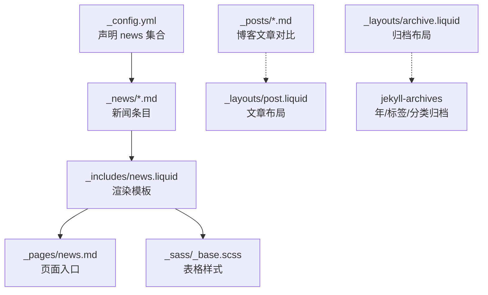
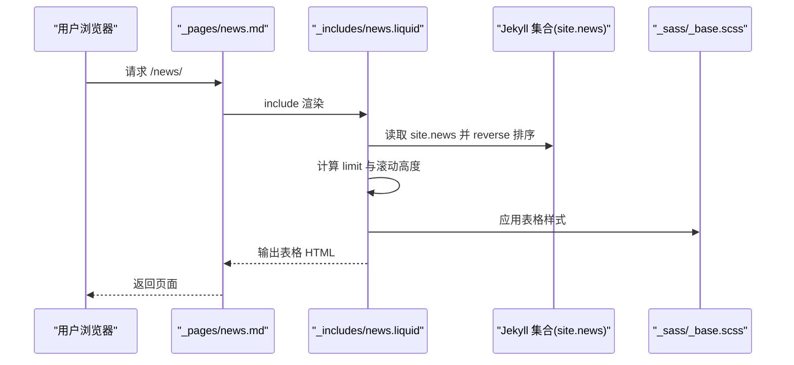
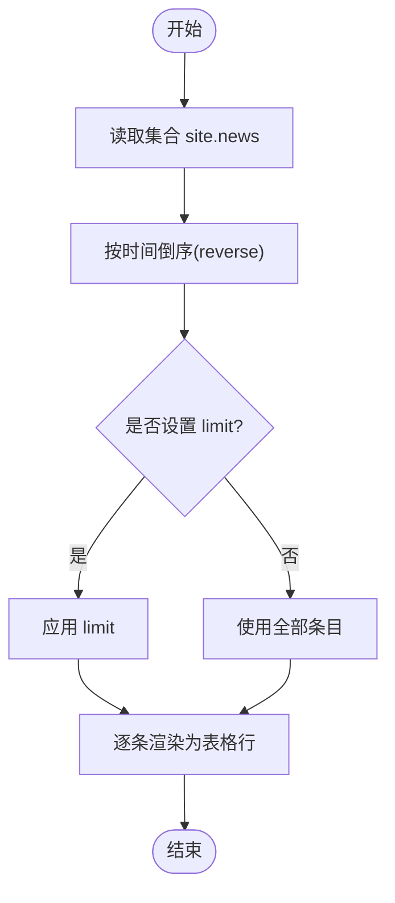
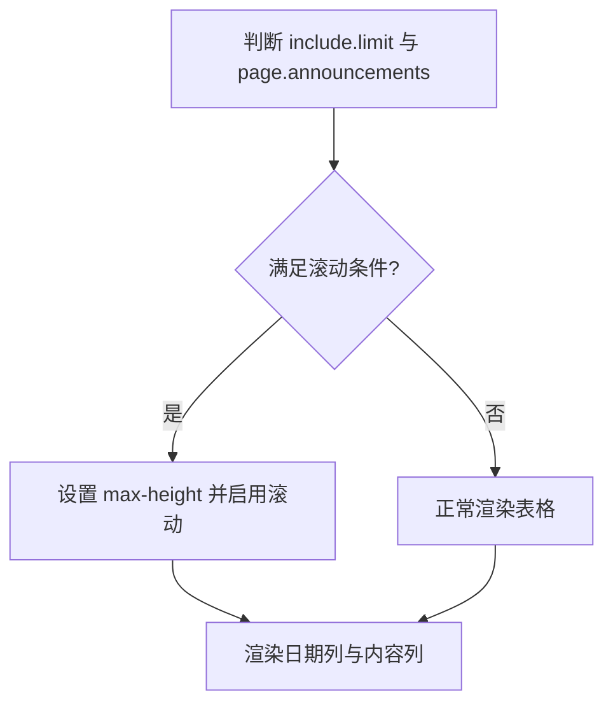
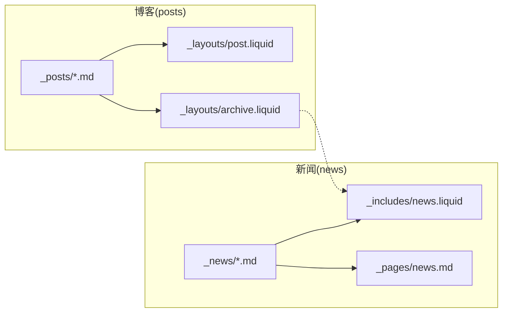
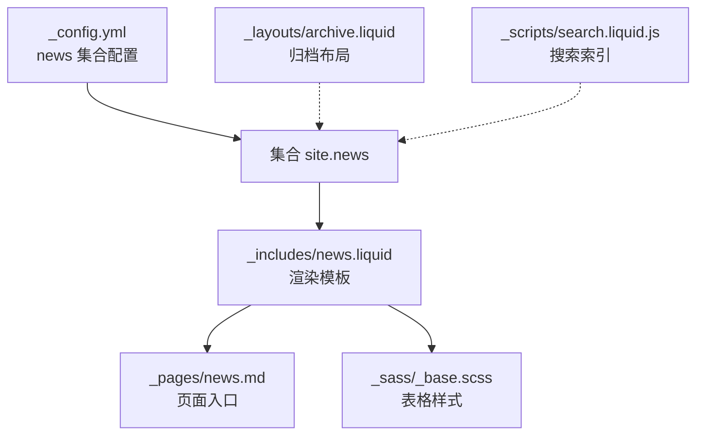

# 新闻集合

<cite>
**本文引用的文件**
- [_news/announcement_1.md](file://_news/announcement_1.md)
- [_news/announcement_2.md](file://_news/announcement_2.md)
- [_includes/news.liquid](file://_includes/news.liquid)
- [_pages/news.md](file://_pages/news.md)
- [_config.yml](file://_config.yml)
- [_layouts/archive.liquid](file://_layouts/archive.liquid)
- [_sass/_base.scss](file://_sass/_base.scss)
- [_posts/2015-03-15-formatting-and-links.md](file://_posts/2015-03-15-formatting-and-links.md)
- [_layouts/post.liquid](file://_layouts/post.liquid)
- [_pages/blog.md](file://_pages/blog.md)
- [_includes/pagination.liquid](file://_includes/pagination.liquid)
- [CUSTOMIZE.md](file://CUSTOMIZE.md)
- [_scripts/search.liquid.js](file://_scripts/search.liquid.js)
</cite>

## 目录
1. [简介](#简介)
2. [项目结构](#项目结构)
3. [核心组件](#核心组件)
4. [架构总览](#架构总览)
5. [详细组件分析](#详细组件分析)
6. [依赖关系分析](#依赖关系分析)
7. [性能考量](#性能考量)
8. [故障排查指南](#故障排查指南)
9. [结论](#结论)
10. [附录](#附录)

## 简介
本节面向“新闻集合”的设计目标与使用场景，帮助读者理解该功能在个人主页中的定位：以简洁、可滚动的时间线方式呈现重要动态或公告类内容，强调“即时性”和“可读性”。新闻集合通过 Jekyll 集合（Collection）机制组织 Markdown 条目，结合 Liquid 模板渲染为表格化时间线，支持限制显示数量与滚动容器高度，便于在页面侧边栏或首页区域进行展示。

## 项目结构
新闻集合由以下关键部分组成：
- 配置层：在站点配置中声明 news 集合并设置默认布局与输出规则
- 数据层：Markdown 文件位于 _news/ 目录，采用统一 Front Matter 字段（如 date、inline、related_posts 等）
- 视图层：通过 include 的 news.liquid 模板渲染为表格；页面 news.md 引入该模板
- 样式层：基于 SCSS 变量与表格样式控制外观
- 对比参考：博客 posts 集合用于区分“长文阅读型内容”与“短消息型新闻”

**图表来源**
- [_config.yml:147-156](file://_config.yml#L147-L156)
- [_news/announcement_1.md:1-9](file://_news/announcement_1.md#L1-L9)
- [_includes/news.liquid:1-35](file://_includes/news.liquid#L1-L35)
- [_pages/news.md:1-8](file://_pages/news.md#L1-L8)
- [_sass/_base.scss:26-36](file://_sass/_base.scss#L26-L36)
- [_posts/2015-03-15-formatting-and-links.md:1-37](file://_posts/2015-03-15-formatting-and-links.md#L1-L37)
- [_layouts/post.liquid:1-97](file://_layouts/post.liquid#L1-L97)
- [_layouts/archive.liquid:1-39](file://_layouts/archive.liquid#L1-L39)

**章节来源**
- [_config.yml:147-156](file://_config.yml#L147-L156)
- [_pages/news.md:1-8](file://_pages/news.md#L1-L8)
- [_includes/news.liquid:1-35](file://_includes/news.liquid#L1-L35)
- [_sass/_base.scss:26-36](file://_sass/_base.scss#L26-L36)

## 核心组件
- 新闻集合配置
  - 在配置中启用 news 集合，并指定默认布局为 post，允许输出静态页面
  - 该集合与 posts 集合并列存在，但渲染与展示策略不同
- 新闻条目字段
  - 必填：date（用于排序与时间线显示）
  - 布尔：inline（控制是否内联显示内容片段）
  - 其他：related_posts（影响相关文章模块行为）
- 渲染模板
  - news.liquid 将按时间倒序排列，支持限制显示数量与滚动容器高度
  - 表格列包含日期与标题/内容（根据 inline 决定）
- 页面入口
  - news.md 仅包含一个 include 调用，用于在指定位置插入新闻时间线
- 样式控制
  - 使用 SCSS 中的表格样式变量与尺寸控制，确保在不同屏幕下的可读性

**章节来源**
- [_config.yml:147-156](file://_config.yml#L147-L156)
- [_news/announcement_1.md:1-9](file://_news/announcement_1.md#L1-L9)
- [_news/announcement_2.md:1-8](file://_news/announcement_2.md#L1-L8)
- [_includes/news.liquid:1-35](file://_includes/news.liquid#L1-L35)
- [_pages/news.md:1-8](file://_pages/news.md#L1-L8)
- [_sass/_base.scss:26-36](file://_sass/_base.scss#L26-L36)

## 架构总览
新闻集合的前端渲染流程如下：

**图表来源**
- [_pages/news.md:1-8](file://_pages/news.md#L1-L8)
- [_includes/news.liquid:1-35](file://_includes/news.liquid#L1-L35)
- [_sass/_base.scss:26-36](file://_sass/_base.scss#L26-L36)

## 详细组件分析

### 组件一：新闻集合数据模型与字段定义
- 字段说明
  - date：用于时间线排序与显示，格式为时间戳
  - inline：布尔值，决定内容是直接内联显示还是跳转到独立页面
  - related_posts：布尔值，影响相关文章模块是否启用
- 示例条目
  - 提供了两条示例新闻条目，展示了最小化的 Front Matter 结构
- 复杂度与性能
  - 渲染时对集合进行一次反向排序与有限制的遍历，时间复杂度 O(n)，空间复杂度 O(n)

**图表来源**
- [_includes/news.liquid:11-28](file://_includes/news.liquid#L11-L28)

**章节来源**
- [_news/announcement_1.md:1-9](file://_news/announcement_1.md#L1-L9)
- [_news/announcement_2.md:1-8](file://_news/announcement_2.md#L1-L8)
- [_includes/news.liquid:1-35](file://_includes/news.liquid#L1-L35)

### 组件二：滚动展示与时间线布局
- 滚动容器
  - 当启用 limit 且页面声明 announcements.scrollable 且条目数超过阈值时，为表格容器设置最大高度并启用滚动
- 时间线布局
  - 使用无边框小号表格，左侧列显示日期，右侧列显示标题或内联内容
  - 日期格式为“月 日, 年”，便于快速识别
- 交互提示
  - 内联新闻去除段落包裹，直接显示文本片段
  - 非内联新闻提供链接跳转至独立页面

**图表来源**
- [_includes/news.liquid:4-8](file://_includes/news.liquid#L4-L8)
- [_includes/news.liquid:19-26](file://_includes/news.liquid#L19-L26)

**章节来源**
- [_includes/news.liquid:1-35](file://_includes/news.liquid#L1-L35)

### 组件三：分类与标签系统（与博客对比）
- 博客 posts 集合
  - 支持 tags 与 categories，具备完整的年/标签/分类归档页
  - 文章布局包含标题、元信息、标签/分类导航与目录等
- 新闻集合 news
  - 默认不启用分类/标签归档（未在 jekyll-archives 中声明）
  - 若需分类/标签归档，可在配置中为 news 集合添加相应开关
- 差异总结
  - 博客：长文阅读、深度内容、丰富元数据与导航
  - 新闻：短消息、时间线、简洁列表、快速浏览

**图表来源**
- [_posts/2015-03-15-formatting-and-links.md:1-37](file://_posts/2015-03-15-formatting-and-links.md#L1-L37)
- [_layouts/post.liquid:1-97](file://_layouts/post.liquid#L1-L97)
- [_layouts/archive.liquid:1-39](file://_layouts/archive.liquid#L1-L39)
- [_news/announcement_1.md:1-9](file://_news/announcement_1.md#L1-L9)
- [_includes/news.liquid:1-35](file://_includes/news.liquid#L1-L35)
- [_pages/news.md:1-8](file://_pages/news.md#L1-L8)

**章节来源**
- [_layouts/archive.liquid:1-39](file://_layouts/archive.liquid#L1-L39)
- [_layouts/post.liquid:1-97](file://_layouts/post.liquid#L1-L97)
- [_posts/2015-03-15-formatting-and-links.md:1-37](file://_posts/2015-03-15-formatting-and-links.md#L1-L37)
- [_pages/blog.md:1-197](file://_pages/blog.md#L1-L197)

### 组件四：与博客系统的区别与联系
- 区别
  - 内容形态：博客为长文，新闻为短消息
  - 导航与归档：博客支持年/标签/分类归档；新闻默认不启用
  - 布局差异：博客有详细的文章头信息与标签导航，新闻为简洁表格
- 联系
  - 均基于 Jekyll 集合与 Liquid 模板
  - 可共享站点配置与主题样式
  - 可在同一页面中并存展示

**章节来源**
- [_config.yml:147-156](file://_config.yml#L147-L156)
- [_layouts/post.liquid:1-97](file://_layouts/post.liquid#L1-L97)
- [_includes/news.liquid:1-35](file://_includes/news.liquid#L1-L35)

### 组件五：创建示例与内容管理最佳实践
- 创建步骤
  - 在 _news/ 目录新增 Markdown 文件，填写 Front Matter（至少包含 date）
  - 设置 inline 控制是否内联显示
  - 在需要展示的位置 include news.liquid 或在页面中引入 news.md
- 最佳实践
  - 保持标题简洁、日期准确
  - 合理使用 inline 与跳转页面，平衡信息密度与可读性
  - 如需分页或限制数量，通过 include 参数与页面变量控制
  - 使用相对路径与本地资源，避免外部依赖导致加载失败

**章节来源**
- [_pages/news.md:1-8](file://_pages/news.md#L1-L8)
- [_includes/news.liquid:1-35](file://_includes/news.liquid#L1-L35)
- [CUSTOMIZE.md:76-84](file://CUSTOMIZE.md#L76-L84)

### 组件六：样式定制与用户体验优化
- 样式定制
  - 表格尺寸与间距：通过 SCSS 中的表格规则控制字体大小与单元格间距
  - 主题色彩：利用全局颜色变量统一风格
- 用户体验优化
  - 为长列表设置滚动容器高度，避免页面过长
  - 日期格式统一，提升可读性
  - 内联新闻去除多余段落标签，减少视觉噪音

**章节来源**
- [_sass/_base.scss:26-36](file://_sass/_base.scss#L26-L36)
- [_includes/news.liquid:4-8](file://_includes/news.liquid#L4-L8)

## 依赖关系分析
- 配置依赖
  - news 集合在配置中启用并设置默认布局
- 模板依赖
  - news.md 依赖 news.liquid 模板
  - news.liquid 依赖集合数据 site.news 与页面上下文变量
- 样式依赖
  - 表格样式依赖 SCSS 变量与基础样式规则
- 归档与搜索
  - 归档页使用通用 archive 布局，适用于 posts 等集合
  - 搜索脚本会索引除 posts 外的集合项，news 亦会被纳入搜索结果

**图表来源**
- [_config.yml:147-156](file://_config.yml#L147-L156)
- [_includes/news.liquid:1-35](file://_includes/news.liquid#L1-L35)
- [_pages/news.md:1-8](file://_pages/news.md#L1-L8)
- [_sass/_base.scss:26-36](file://_sass/_base.scss#L26-L36)
- [_layouts/archive.liquid:1-39](file://_layouts/archive.liquid#L1-L39)
- [_scripts/search.liquid.js:81-92](file://_scripts/search.liquid.js#L81-L92)

**章节来源**
- [_config.yml:147-156](file://_config.yml#L147-L156)
- [_layouts/archive.liquid:1-39](file://_layouts/archive.liquid#L1-L39)
- [_scripts/search.liquid.js:81-92](file://_scripts/search.liquid.js#L81-L92)

## 性能考量
- 渲染复杂度
  - 新闻集合渲染为表格，涉及一次集合反向与有限制的循环，整体为 O(n)
- 分页与滚动
  - 通过 limit 与滚动容器高度控制长列表渲染成本
- 资源加载
  - 建议使用本地资源与压缩后的静态文件，减少外部依赖

[本节为通用指导，无需特定文件引用]

## 故障排查指南
- 新闻未显示
  - 检查 news 集合是否在配置中启用
  - 确认 _news/ 目录下存在有效 Markdown 文件
- 日期显示异常
  - 确保 Front Matter 中 date 字段格式正确
- 滚动无效
  - 检查 include.limit 与 page.announcements.scrollable 是否同时满足
  - 确认条目数量超过阈值
- 样式错乱
  - 检查表格相关 SCSS 变量是否被覆盖
- 与博客混淆
  - 新闻默认不启用分类/标签归档；如需，请在配置中为 news 集合添加相应开关

**章节来源**
- [_config.yml:147-156](file://_config.yml#L147-L156)
- [_includes/news.liquid:1-35](file://_includes/news.liquid#L1-L35)
- [_sass/_base.scss:26-36](file://_sass/_base.scss#L26-L36)

## 结论
新闻集合以简洁的时间线形式承载短消息与公告，适合在主页或侧边栏进行高频次更新的展示。其设计强调可读性与易维护性：通过统一的集合配置、简化的模板与可控的滚动展示，能够在不牺牲性能的前提下提供良好的用户体验。若未来需要更丰富的分类/标签能力，可参考博客集合的归档机制，在配置中为 news 集合开启相应功能。

[本节为总结性内容，无需特定文件引用]

## 附录
- 相关页面与模板
  - 新闻页面入口：[_pages/news.md:1-8](file://_pages/news.md#L1-L8)
  - 新闻渲染模板：[_includes/news.liquid:1-35](file://_includes/news.liquid#L1-L35)
  - 博客文章布局：[_layouts/post.liquid:1-97](file://_layouts/post.liquid#L1-L97)
  - 博客归档布局：[_layouts/archive.liquid:1-39](file://_layouts/archive.liquid#L1-L39)
  - 博客列表页：[_pages/blog.md:1-197](file://_pages/blog.md#L1-L197)
  - 分页组件：[_includes/pagination.liquid:1-22](file://_includes/pagination.liquid#L1-L22)
  - 搜索脚本（含 news 集合索引）：[_scripts/search.liquid.js:81-92](file://_scripts/search.liquid.js#L81-L92)
  - 配置说明（新增集合与新闻）：[CUSTOMIZE.md:76-84](file://CUSTOMIZE.md#L76-L84)

[本节为补充材料，无需特定文件引用]