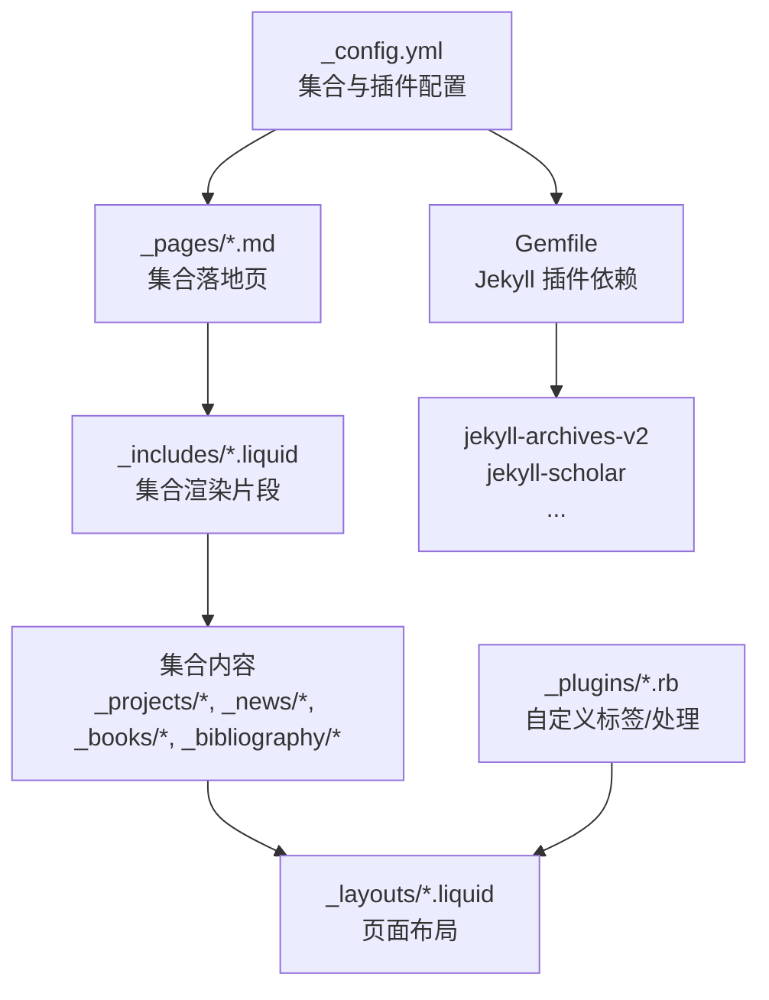
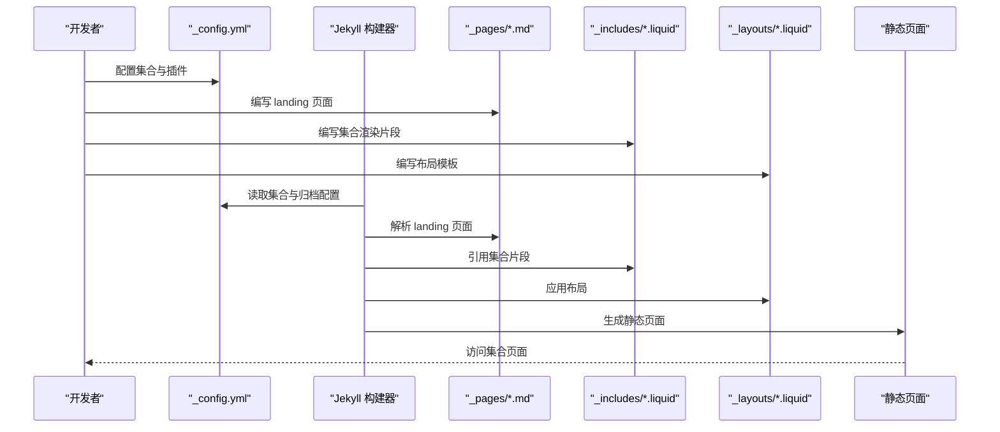
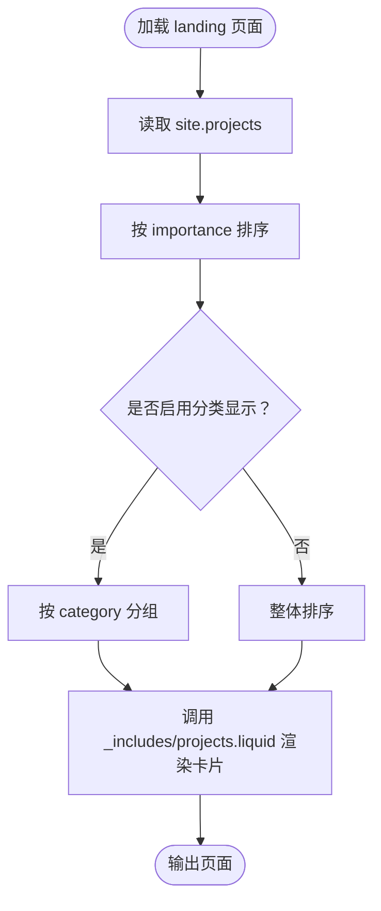
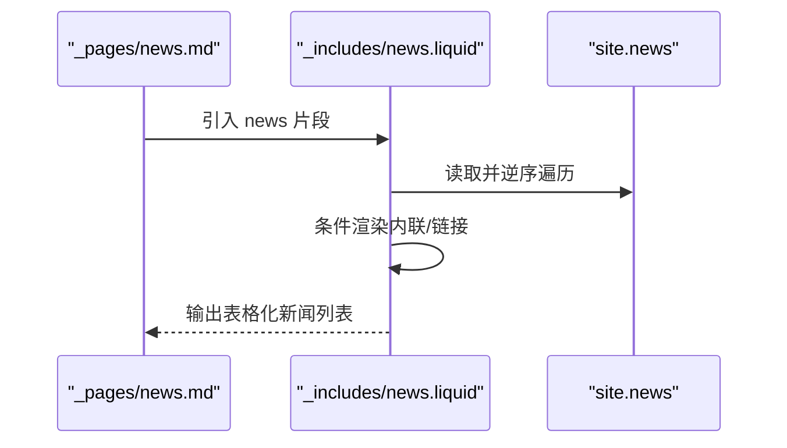
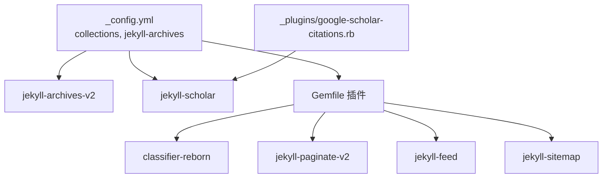

# 自定义集合详解

<cite>
**本文档引用的文件**
- [_config.yml](file://_config.yml)
- [CUSTOMIZE.md](file://CUSTOMIZE.md)
- [Gemfile](file://Gemfile)
- [README.md](file://README.md)
- [_pages/projects.md](file://_pages/projects.md)
- [_pages/news.md](file://_pages/news.md)
- [_books/the_godfather.md](file://_books/the_godfather.md)
- [_projects/1_project.md](file://_projects/1_project.md)
- [_news/announcement_1.md](file://_news/announcement_1.md)
- [_layouts/page.liquid](file://_layouts/page.liquid)
- [_layouts/post.liquid](file://_layouts/post.liquid)
- [_includes/projects.liquid](file://_includes/projects.liquid)
- [_includes/news.liquid](file://_includes/news.liquid)
- [_plugins/google-scholar-citations.rb](file://_plugins/google-scholar-citations.rb)
</cite>

## 目录
1. [简介](#简介)
2. [项目结构](#项目结构)
3. [核心组件](#核心组件)
4. [架构总览](#架构总览)
5. [详细组件分析](#详细组件分析)
6. [依赖关系分析](#依赖关系分析)
7. [性能考量](#性能考量)
8. [故障排查指南](#故障排查指南)
9. [结论](#结论)
10. [附录](#附录)

## 简介
本文件系统性阐述该 Jekyll 主题中“自定义集合（collections）”的设计与使用，重点覆盖以下集合：projects、news、bibliography、books，并扩展到可扩展的自定义集合能力。内容涵盖：
- 集合的启用与配置
- 数据结构与字段定义
- 布局定制与模板渲染机制
- 输出规则与页面生成
- 高级功能：集合间关联、交叉引用、数据转换
- 扩展开发与插件集成

## 项目结构
该站点通过 Jekyll 的 collections 功能组织内容，核心目录与文件如下：
- 配置层：_config.yml 定义集合、归档、插件等
- 内容层：_projects、_news、_books、_bibliography 等集合目录
- 页面层：_pages 下的 landing 页面，驱动集合展示
- 模板层：_layouts 与 _includes 提供渲染与复用
- 插件层：_plugins 提供扩展标签与处理逻辑

图表来源
- [_config.yml](file://_config.yml)
- [_pages/projects.md](file://_pages/projects.md)
- [_pages/news.md](file://_pages/news.md)
- [_includes/projects.liquid](file://_includes/projects.liquid)
- [_includes/news.liquid](file://_includes/news.liquid)
- [Gemfile](file://Gemfile)

章节来源
- [_config.yml](file://_config.yml)
- [CUSTOMIZE.md](file://CUSTOMIZE.md)
- [README.md](file://README.md)

## 核心组件
- 集合定义与输出
  - 在配置中启用集合并设置默认布局与输出开关
  - 通过 jekyll-archives-v2 支持按年/标签/分类归档（书籍集合已启用）
- 内容组织
  - 每个集合由独立目录管理，条目以 Markdown + Front Matter 组织
- 页面与模板
  - landing 页面负责遍历集合、排序与分组
  - _includes 片段复用卡片/表格等 UI 结构
  - _layouts 提供通用布局与元信息渲染

章节来源
- [_config.yml](file://_config.yml)
- [_pages/projects.md](file://_pages/projects.md)
- [_pages/news.md](file://_pages/news.md)
- [_includes/projects.liquid](file://_includes/projects.liquid)
- [_includes/news.liquid](file://_includes/news.liquid)

## 架构总览
下图展示了从配置到页面渲染的关键流程：配置声明集合 → 内容写入 → Jekyll 构建 → 模板渲染 → 输出静态页面。

图表来源
- [_config.yml](file://_config.yml)
- [_pages/projects.md](file://_pages/projects.md)
- [_pages/news.md](file://_pages/news.md)
- [_includes/projects.liquid](file://_includes/projects.liquid)
- [_includes/news.liquid](file://_includes/news.liquid)
- [_layouts/page.liquid](file://_layouts/page.liquid)
- [_layouts/post.liquid](file://_layouts/post.liquid)

## 详细组件分析

### 项目集合 projects
- 启用与输出
  - 在配置中启用 projects 集合并允许输出
- 数据结构与字段
  - 常用字段示例：title、description、img（缩略图）、importance（重要性排序）、category（分类）、github、github_stars、redirect（重定向链接）
  - 参考条目：[1_project.md](file://_projects/1_project.md)
- 布局与渲染
  - landing 页面按 importance 排序，支持按分类分组显示
  - 使用 _includes/projects.liquid 渲染卡片，支持 GitHub 图标与星标
- 输出规则
  - 每个项目条目生成独立页面；landing 页面聚合展示

图表来源
- [_pages/projects.md](file://_pages/projects.md)
- [_includes/projects.liquid](file://_includes/projects.liquid)

章节来源
- [_config.yml](file://_config.yml)
- [_projects/1_project.md](file://_projects/1_project.md)
- [_pages/projects.md](file://_pages/projects.md)
- [_includes/projects.liquid](file://_includes/projects.liquid)

### 新闻集合 news
- 启用与输出
  - 在配置中启用 news 集合，默认布局为 post，允许输出
- 数据结构与字段
  - 常用字段示例：title、date（时间戳）、inline（内联显示）、related_posts（相关文章控制）
  - 参考条目：[announcement_1.md](file://_news/announcement_1.md)
- 布局与渲染
  - landing 页面直接包含 _includes/news.liquid
  - _includes/news.liquid 逆序展示新闻，支持限制数量与滚动容器
- 输出规则
  - 新闻条目生成独立页面或内联在 landing 页面

图表来源
- [_pages/news.md](file://_pages/news.md)
- [_includes/news.liquid](file://_includes/news.liquid)
- [_news/announcement_1.md](file://_news/announcement_1.md)

章节来源
- [_config.yml](file://_config.yml)
- [_news/announcement_1.md](file://_news/announcement_1.md)
- [_pages/news.md](file://_pages/news.md)
- [_includes/news.liquid](file://_includes/news.liquid)

### 书籍集合 books
- 启用与输出
  - 在配置中启用 books 集合并允许输出
- 数据结构与字段
  - 常用字段示例：title、author、cover（封面）、olid/isbn（Open Library/ISBN 获取封面）、categories/tags（分类/标签）、buy_link（购买链接）、started/finished（阅读起止日期）、released（出版年份）、stars（评分）、goodreads_review（Goodreads 评论）、status（状态）
  - 参考条目：[the_godfather.md](file://_books/the_godfather.md)
- 布局与渲染
  - 书籍集合通常配合书籍书架页面展示，条目具备丰富的元数据用于展示与筛选
- 输出规则
  - 每本书生成独立详情页，支持按年/标签/分类归档（已在配置中启用）

章节来源
- [_config.yml](file://_config.yml)
- [_books/the_godfather.md](file://_books/the_godfather.md)

### 公文集 bibliography（学术文献）
- 启用与输出
  - 通过 jekyll-scholar 与 _bibliography 目录中的 .bib 文件驱动
- 数据结构与字段
  - BibTeX 字段：author、title、year、journal、volume、pages、doi、pdf、code、website 等
  - 参考配置：scholar 段落、details_dir、details_link、过滤关键词等
- 布局与渲染
  - 使用 _layouts/bib.liquid 或相关片段渲染条目与按钮
  - 可通过自定义标签/插件实现动态数据（如谷歌学术引用数）
- 输出规则
  - 自动生成详情页与分组归档

章节来源
- [_config.yml](file://_config.yml)
- [Gemfile](file://Gemfile)
- [_plugins/google-scholar-citations.rb](file://_plugins/google-scholar-citations.rb)

## 依赖关系分析
- 集合与归档
  - jekyll-archives-v2：为 posts 与 books 启用年/标签/分类归档
- 学术文献
  - jekyll-scholar：解析 .bib 并生成详情页与分组
- 插件生态
  - classifier-reborn：用于内容分类
  - jekyll-paginate-v2、jekyll-feed、jekyll-sitemap 等：辅助分页、订阅与索引
- 自定义标签
  - _plugins/google-scholar-citations.rb：提供 google_scholar_citations 标签，用于动态抓取引用数

图表来源
- [_config.yml](file://_config.yml)
- [Gemfile](file://Gemfile)
- [_plugins/google-scholar-citations.rb](file://_plugins/google-scholar-citations.rb)

章节来源
- [_config.yml](file://_config.yml)
- [Gemfile](file://Gemfile)

## 性能考量
- 集合规模与渲染
  - 大型集合建议在 landing 页面进行分页或懒加载，避免一次性渲染过多节点
- 资源优化
  - 使用响应式图片与懒加载策略（如配置中启用懒加载），减少首屏压力
- 构建时长
  - 合理拆分集合与页面，避免复杂嵌套循环导致构建时间过长
- 插件开销
  - 动态抓取外部数据（如引用数）会增加构建时间，建议缓存结果或降低抓取频率

## 故障排查指南
- 集合未显示
  - 检查 _config.yml 中集合是否启用且 output: true
  - 确认 landing 页面正确引用 _includes 片段
- 归档页面缺失
  - 检查 jekyll-archives-v2 是否安装与启用，确认归档类型是否开启
- 学术文献不显示
  - 确认 jekyll-scholar 已安装并在 Gemfile 中声明
  - 检查 _bibliography 目录与 papers.bib 路径与权限
- 自定义标签报错
  - 检查 _plugins 中标签注册是否正确，确保依赖库（如 nokogiri）可用

章节来源
- [_config.yml](file://_config.yml)
- [Gemfile](file://Gemfile)
- [_plugins/google-scholar-citations.rb](file://_plugins/google-scholar-citations.rb)

## 结论
该主题通过清晰的集合配置、可复用的模板片段与完善的插件体系，提供了灵活而强大的内容组织能力。开发者只需在 _config.yml 中声明集合，在对应目录中编写条目，并在 landing 页面中调用 _includes 片段，即可快速生成高质量的集合页面。对于高级需求，可借助 jekyll-archives-v2 与 jekyll-scholar 实现归档与学术文献管理，并通过自定义插件扩展更多能力。

## 附录

### 自定义集合最佳实践
- 命名规范
  - 集合目录与名称保持一致，便于维护与检索
- 字段设计
  - 明确核心字段（如 title、date、description），并为 UI 展示预留占位字段
- 模板复用
  - 将通用 UI 抽象为 _includes 片段，减少重复代码
- 输出规则
  - 为每个集合提供 landing 页面与详情页模板，统一风格
- 归档与搜索
  - 为集合启用归档与分类/标签，提升可发现性

### 集合间关联与交叉引用
- 关联方式
  - 在条目的 Front Matter 中添加关联字段（如 related_publications、related_projects），在模板中按需渲染
- 交叉引用
  - 使用 Liquid 过滤器对集合进行过滤与拼接，实现跨集合的推荐或导航
- 数据转换
  - 利用插件或自定义标签对字段进行格式化（如日期、评分、引用数）

### 扩展开发与插件集成
- 新增集合
  - 在 _config.yml 中新增集合项，创建对应目录与 landing 页面
- 插件集成
  - 在 Gemfile 中添加新插件，于 _plugins 中实现自定义标签或过滤器
- 钩子与事件
  - 通过 Jekyll 生命周期钩子（如生成前/后）扩展构建流程（需在插件中实现）

章节来源
- [_config.yml](file://_config.yml)
- [CUSTOMIZE.md](file://CUSTOMIZE.md)
- [README.md](file://README.md)