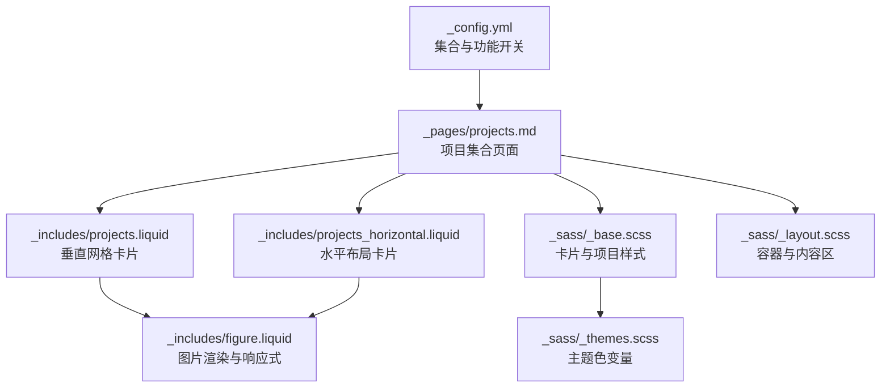
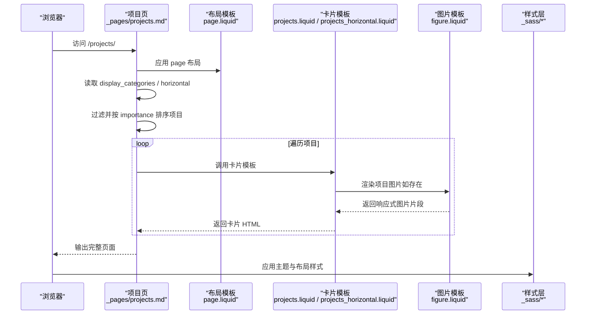
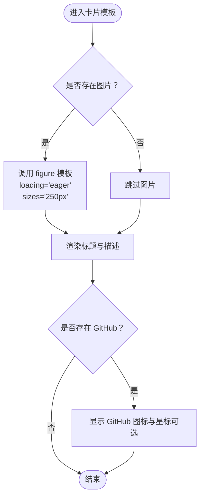
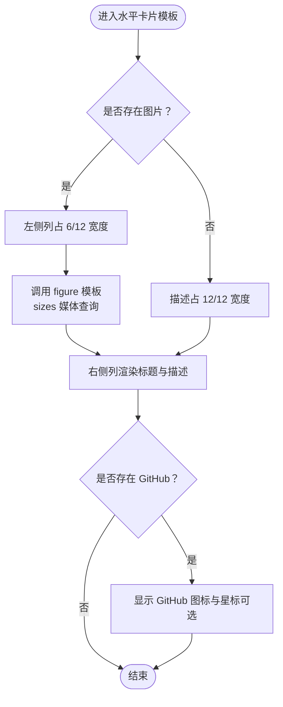
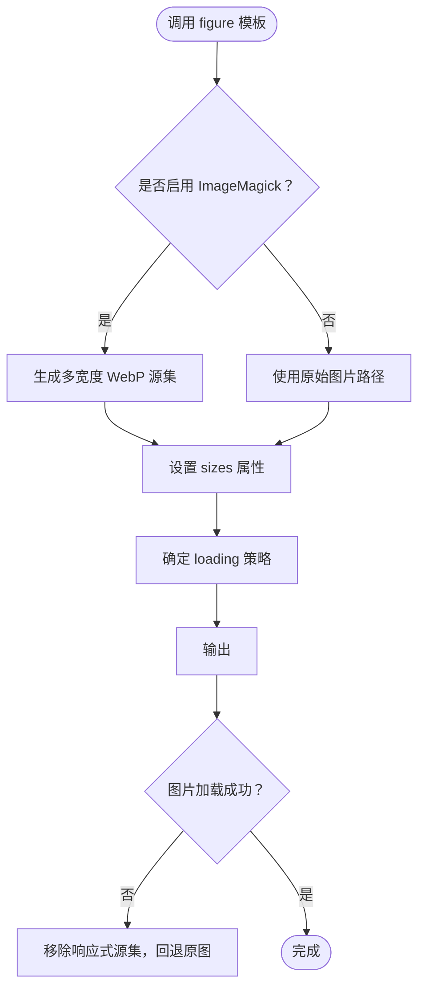
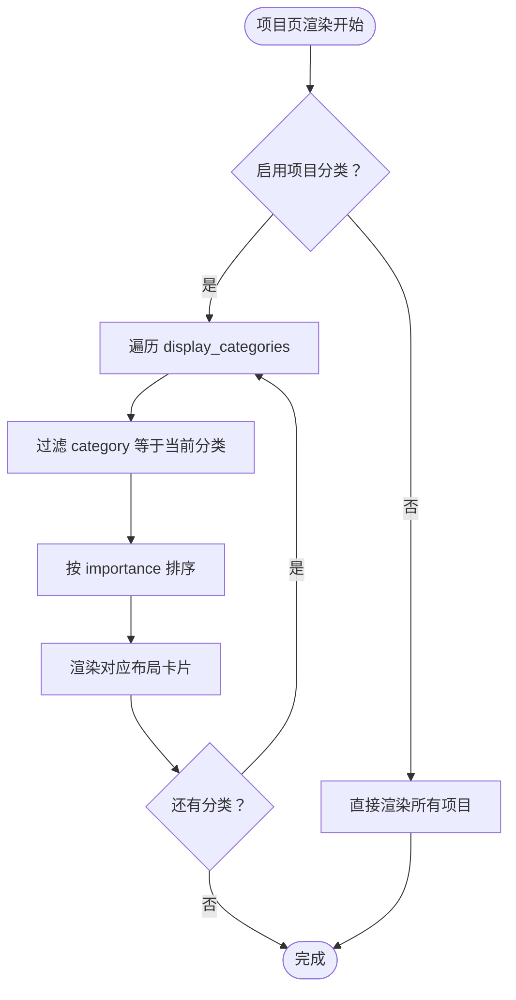
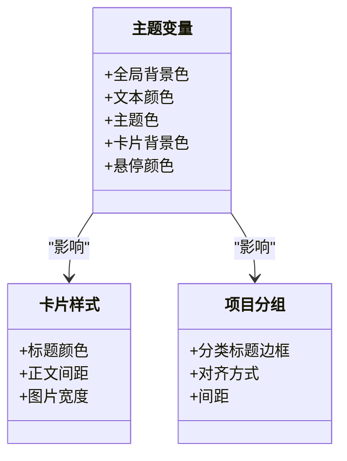
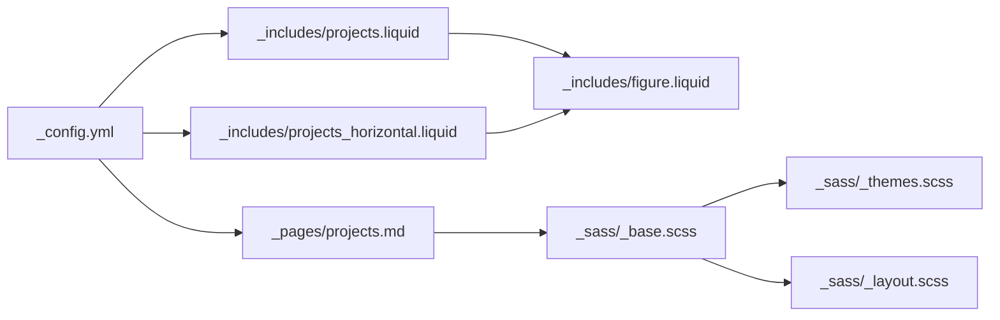

# 项目集合

<cite>
**本文引用的文件**
- [_pages/projects.md](file://_pages/projects.md)
- [_includes/projects.liquid](file://_includes/projects.liquid)
- [_includes/projects_horizontal.liquid](file://_includes/projects_horizontal.liquid)
- [_includes/figure.liquid](file://_includes/figure.liquid)
- [_sass/_base.scss](file://_sass/_base.scss)
- [_sass/_layout.scss](file://_sass/_layout.scss)
- [_sass/_themes.scss](file://_sass/_themes.scss)
- [_config.yml](file://_config.yml)
- [_projects/1_project.md](file://_projects/1_project.md)
- [_projects/2_project.md](file://_projects/2_project.md)
- [_projects/3_project.md](file://_projects/3_project.md)
</cite>

## 目录
1. [简介](#简介)
2. [项目结构](#项目结构)
3. [核心组件](#核心组件)
4. [架构总览](#架构总览)
5. [详细组件分析](#详细组件分析)
6. [依赖关系分析](#依赖关系分析)
7. [性能考量](#性能考量)
8. [故障排查指南](#故障排查指南)
9. [结论](#结论)
10. [附录](#附录)

## 简介
本文件系统性阐述“项目集合”的设计与实现，覆盖以下方面：
- 设计目的：以卡片化方式集中展示个人项目，支持分类、排序、链接跳转与代码仓库入口。
- 数据结构：项目条目在 Front Matter 中声明标题、描述、图片、链接、分类、重要度等字段。
- 布局模板：提供垂直网格布局（每行多列）与水平布局（左右图文）两种展示形态。
- 分类与标签：通过配置启用多类别展示，按重要度排序，支持锚点定位到各分类区块。
- 图片处理与响应式：基于内置 figure 模板与 ImageMagick 响应式图片生成，结合 sizes 与 srcset 实现自适应显示。
- 创建示例与最佳实践：如何编写项目条目、设置分类与链接、管理状态与优先级。
- 样式定制与交互：主题色、卡片样式、悬停效果、GitHub 星标提示等。

## 项目结构
项目集合由页面模板、包含模板与样式三部分协作完成：
- 页面模板负责组织与渲染：在项目页中按分类遍历项目集合，选择垂直或水平布局模板进行渲染。
- 包含模板负责单个项目卡片的结构与内容：分别提供垂直网格卡片与水平图文卡片。
- 样式层负责视觉与交互：卡片、悬停、主题色、容器宽度、项目分组标题等。

**图表来源**
- [_pages/projects.md:12-66](file://_pages/projects.md#L12-L66)
- [_includes/projects.liquid:1-36](file://_includes/projects.liquid#L1-L36)
- [_includes/projects_horizontal.liquid:1-35](file://_includes/projects_horizontal.liquid#L1-L35)
- [_includes/figure.liquid:1-87](file://_includes/figure.liquid#L1-L87)
- [_sass/_base.scss:656-693](file://_sass/_base.scss#L656-L693)
- [_sass/_themes.scss:7-77](file://_sass/_themes.scss#L7-L77)
- [_sass/_layout.scss:30-32](file://_sass/_layout.scss#L30-L32)
- [_config.yml:147-155](file://_config.yml#L147-L155)

**章节来源**
- [_pages/projects.md:1-66](file://_pages/projects.md#L1-L66)
- [_includes/projects.liquid:1-36](file://_includes/projects.liquid#L1-L36)
- [_includes/projects_horizontal.liquid:1-35](file://_includes/projects_horizontal.liquid#L1-L35)
- [_includes/figure.liquid:1-87](file://_includes/figure.liquid#L1-L87)
- [_sass/_base.scss:656-693](file://_sass/_base.scss#L656-L693)
- [_sass/_layout.scss:30-32](file://_sass/_layout.scss#L30-L32)
- [_sass/_themes.scss:7-77](file://_sass/_themes.scss#L7-L77)
- [_config.yml:147-155](file://_config.yml#L147-L155)

## 核心组件
- 项目集合页面模板：负责读取站点项目集合、按分类筛选、按重要度排序、选择布局模板并渲染。
- 垂直网格卡片模板：紧凑型卡片，适合密集展示；支持图片、标题、描述与 GitHub 链接。
- 水平布局卡片模板：图文左右分栏，适合强调图片与简要描述；支持图片、标题、描述与 GitHub 链接。
- 图片渲染模板：统一处理图片路径、懒加载、响应式尺寸与格式转换，支持 WebP 与 sizes/srcset。
- 样式层：定义卡片外观、悬停效果、主题色、容器宽度与项目分组标题样式。

**章节来源**
- [_pages/projects.md:12-66](file://_pages/projects.md#L12-L66)
- [_includes/projects.liquid:1-36](file://_includes/projects.liquid#L1-L36)
- [_includes/projects_horizontal.liquid:1-35](file://_includes/projects_horizontal.liquid#L1-L35)
- [_includes/figure.liquid:1-87](file://_includes/figure.liquid#L1-L87)
- [_sass/_base.scss:656-693](file://_sass/_base.scss#L656-L693)

## 架构总览
项目集合的运行时流程如下：
- Jekyll 构建阶段：读取 _config.yml 中的 projects 集合配置，扫描 _projects 下的项目条目。
- 渲染阶段：项目页根据 Front Matter 的 display_categories 与 horizontal 参数，选择布局；对每个项目条目调用对应卡片模板。
- 卡片模板内部：若存在图片则通过 figure 模板输出响应式图片；若存在 GitHub 地址则显示图标与可选星标提示。
- 样式阶段：CSS 根据主题变量与容器规则控制整体外观与交互。

**图表来源**
- [_pages/projects.md:12-66](file://_pages/projects.md#L12-L66)
- [_includes/projects.liquid:1-36](file://_includes/projects.liquid#L1-L36)
- [_includes/projects_horizontal.liquid:1-35](file://_includes/projects_horizontal.liquid#L1-L35)
- [_includes/figure.liquid:1-87](file://_includes/figure.liquid#L1-L87)
- [_sass/_base.scss:656-693](file://_sass/_base.scss#L656-L693)

## 详细组件分析

### 数据模型与字段定义
- 必填字段
  - title：项目标题
  - description：项目描述
- 可选字段
  - img：项目缩略图路径（用于卡片顶部图片）
  - url：项目详情页链接（相对路径）
  - redirect：重定向链接（优先于 url）
  - github：代码仓库地址（显示 GitHub 图标）
  - github_stars：GitHub 仓库标识（用于显示星标提示）
  - category：项目分类（用于按分类展示）
  - importance：整数，用于排序（数值越小越靠前）
- 示例参考
  - [1_project.md:1-22](file://_projects/1_project.md#L1-L22)
  - [2_project.md:1-22](file://_projects/2_project.md#L1-L22)
  - [3_project.md:1-22](file://_projects/3_project.md#L1-L22)

**章节来源**
- [_projects/1_project.md:1-22](file://_projects/1_project.md#L1-L22)
- [_projects/2_project.md:1-22](file://_projects/2_project.md#L1-L22)
- [_projects/3_project.md:1-22](file://_projects/3_project.md#L1-L22)

### 垂直网格布局模板
- 结构要点
  - 外层卡片容器，支持悬停效果
  - 若存在图片，使用 figure 模板输出，设置 sizes 为固定像素值，适配网格列宽
  - 卡片主体包含标题与描述
  - GitHub 图标与星标提示（可选）
- 关键行为
  - 图片懒加载策略：卡片模板内显式设置 loading="eager"，确保首屏可见
  - 响应式尺寸：sizes 固定像素，便于网格对齐
  - 链接优先级：优先使用 redirect，否则使用 url

**图表来源**
- [_includes/projects.liquid:1-36](file://_includes/projects.liquid#L1-L36)
- [_includes/figure.liquid:1-87](file://_includes/figure.liquid#L1-L87)

**章节来源**
- [_includes/projects.liquid:1-36](file://_includes/projects.liquid#L1-L36)

### 水平布局模板
- 结构要点
  - 使用 Bootstrap 行布局，左图右文
  - 图片区域占一半宽度（移动端自动堆叠）
  - 描述区域与垂直布局一致
  - GitHub 图标与星标提示（可选）
- 关键行为
  - 图片响应式 sizes 使用媒体查询表达式，兼顾桌面与移动端
  - 当无图片时，描述区域占满全宽

**图表来源**
- [_includes/projects_horizontal.liquid:1-35](file://_includes/projects_horizontal.liquid#L1-L35)
- [_includes/figure.liquid:1-87](file://_includes/figure.liquid#L1-L87)

**章节来源**
- [_includes/projects_horizontal.liquid:1-35](file://_includes/projects_horizontal.liquid#L1-L35)

### 图片处理与响应式显示机制
- 统一入口：所有项目图片均通过 figure 模板输出
- 响应式生成：当启用 ImageMagick 时，模板会为指定宽度列表生成 WebP 源集，并设置 sizes 属性
- 懒加载策略：未显式传入 loading 时，默认使用站点配置的懒加载策略
- 错误回退：图片加载失败时移除响应式源集，回退到原始路径
- 尺寸策略：垂直网格使用固定像素 sizes，水平布局使用媒体查询 sizes

**图表来源**
- [_includes/figure.liquid:1-87](file://_includes/figure.liquid#L1-L87)
- [_config.yml:351-374](file://_config.yml#L351-L374)

**章节来源**
- [_includes/figure.liquid:1-87](file://_includes/figure.liquid#L1-L87)
- [_config.yml:351-374](file://_config.yml#L351-L374)

### 分类系统与标签管理
- 启用条件：站点配置中开启项目分类功能
- 页面参数：项目页 Front Matter 支持 display_categories 指定要展示的分类列表
- 渲染逻辑：按分类循环，过滤该项目集合中 category 等于当前分类的条目，再按 importance 排序后渲染
- 锚点定位：为每个分类块添加锚点，便于快速跳转

**图表来源**
- [_pages/projects.md:14-38](file://_pages/projects.md#L14-L38)
- [_config.yml:391-391](file://_config.yml#L391-L391)

**章节来源**
- [_pages/projects.md:14-38](file://_pages/projects.md#L14-L38)
- [_config.yml:391-391](file://_config.yml#L391-L391)

### 样式定制与交互
- 主题色：通过主题变量控制全局主题色、卡片背景、悬停颜色等
- 卡片样式：卡片标题、正文间距、图片占位等细节样式
- 项目分组标题：分类标题的边框、对齐与间距
- 容器宽度：限制最大内容宽度，保证在大屏下的可读性
- 交互：卡片悬停时标题颜色变化，增强可点击反馈

**图表来源**
- [_sass/_themes.scss:7-77](file://_sass/_themes.scss#L7-L77)
- [_sass/_base.scss:656-693](file://_sass/_base.scss#L656-L693)
- [_sass/_layout.scss:30-32](file://_sass/_layout.scss#L30-L32)

**章节来源**
- [_sass/_themes.scss:7-77](file://_sass/_themes.scss#L7-L77)
- [_sass/_base.scss:656-693](file://_sass/_base.scss#L656-L693)
- [_sass/_layout.scss:30-32](file://_sass/_layout.scss#L30-L32)

## 依赖关系分析
- 配置依赖：项目集合的可用性与功能开关由站点配置决定（集合声明、分类开关、图片懒加载、ImageMagick）
- 页面依赖：项目页依赖集合数据与布局参数（display_categories、horizontal）
- 模板依赖：卡片模板依赖图片模板提供的响应式能力
- 样式依赖：卡片与布局样式依赖主题变量与容器规则

**图表来源**
- [_config.yml:147-155](file://_config.yml#L147-L155)
- [_pages/projects.md:12-66](file://_pages/projects.md#L12-L66)
- [_includes/projects.liquid:1-36](file://_includes/projects.liquid#L1-L36)
- [_includes/projects_horizontal.liquid:1-35](file://_includes/projects_horizontal.liquid#L1-L35)
- [_includes/figure.liquid:1-87](file://_includes/figure.liquid#L1-L87)
- [_sass/_base.scss:656-693](file://_sass/_base.scss#L656-L693)
- [_sass/_themes.scss:7-77](file://_sass/_themes.scss#L7-L77)
- [_sass/_layout.scss:30-32](file://_sass/_layout.scss#L30-L32)

**章节来源**
- [_config.yml:147-155](file://_config.yml#L147-L155)
- [_pages/projects.md:12-66](file://_pages/projects.md#L12-L66)
- [_includes/projects.liquid:1-36](file://_includes/projects.liquid#L1-L36)
- [_includes/projects_horizontal.liquid:1-35](file://_includes/projects_horizontal.liquid#L1-L35)
- [_includes/figure.liquid:1-87](file://_includes/figure.liquid#L1-L87)
- [_sass/_base.scss:656-693](file://_sass/_base.scss#L656-L693)
- [_sass/_themes.scss:7-77](file://_sass/_themes.scss#L7-L77)
- [_sass/_layout.scss:30-32](file://_sass/_layout.scss#L30-L32)

## 性能考量
- 图片懒加载：默认启用懒加载，减少首屏资源压力；卡片图片显式设置 eager，确保首屏可见性与体验
- 响应式图片：通过 ImageMagick 生成多宽度 WebP，配合 sizes/srcset 在不同设备与 DPR 下选择合适尺寸，降低带宽占用
- 排序与过滤：按 importance 排序与按分类过滤均为内存操作，建议控制项目数量在合理范围
- 样式体积：主题变量集中管理，避免重复定义；容器宽度限制提升大屏阅读体验

[本节为通用指导，不直接分析具体文件]

## 故障排查指南
- 图片不显示
  - 检查图片路径是否正确且存在于 assets 中
  - 确认已启用 ImageMagick 并正确配置宽度列表与输入目录
  - 若加载失败，模板会移除响应式源集回退原图，检查网络与缓存
- 响应式效果异常
  - 确认 sizes 表达式符合规范，媒体查询语法正确
  - 检查浏览器对 WebP 的支持情况
- 链接无效
  - 优先使用 redirect 字段进行外部跳转；否则使用 url
  - 确保链接为绝对或相对有效路径
- 分类未显示
  - 确认站点配置已启用项目分类功能
  - 确认项目条目设置了正确的 category 字段
  - 确认项目页 Front Matter 的 display_categories 列表包含该分类

**章节来源**
- [_includes/figure.liquid:16-33](file://_includes/figure.liquid#L16-L33)
- [_includes/projects.liquid:2-2](file://_includes/projects.liquid#L2-L2)
- [_includes/projects_horizontal.liquid:2-2](file://_includes/projects_horizontal.liquid#L2-L2)
- [_pages/projects.md:14-18](file://_pages/projects.md#L14-L18)
- [_config.yml:391-391](file://_config.yml#L391-L391)

## 结论
项目集合通过清晰的数据模型、灵活的布局模板与完善的图片响应式机制，实现了美观且高效的项目展示。借助分类与排序能力，用户可以按需组织与呈现项目；通过主题变量与样式层，可轻松定制风格与交互。建议在实际使用中遵循字段规范、合理设置图片与链接、利用分类与排序提升可发现性，并关注图片性能与懒加载策略以优化加载体验。

[本节为总结性内容，不直接分析具体文件]

## 附录

### 创建示例与最佳实践
- 新建项目条目
  - 在 _projects 目录下新增 Markdown 文件，设置 Front Matter 字段（title、description、img、url/redirect、github、github_stars、category、importance）
  - 示例参考：
    - [1_project.md:1-22](file://_projects/1_project.md#L1-L22)
    - [2_project.md:1-22](file://_projects/2_project.md#L1-L22)
    - [3_project.md:1-22](file://_projects/3_project.md#L1-L22)
- 设置分类与布局
  - 在项目页 Front Matter 中设置 display_categories 与 horizontal 参数
  - 垂直网格：每行多列，适合密集展示
  - 水平布局：左右图文，适合强调图片
- 状态管理与优先级
  - 使用 importance 数值控制排序（数值越小越靠前）
  - 使用 category 字段进行分类归档
  - 使用 redirect 与 url 区分外链与站内详情页
- 样式定制
  - 修改主题变量以切换主题色与卡片风格
  - 调整容器最大宽度与卡片间距以适配不同屏幕
- 交互功能
  - 启用 GitHub 图标与星标提示，增强项目关联性
  - 利用悬停效果提升交互反馈

**章节来源**
- [_pages/projects.md:8-9](file://_pages/projects.md#L8-L9)
- [_projects/1_project.md:1-22](file://_projects/1_project.md#L1-L22)
- [_projects/2_project.md:1-22](file://_projects/2_project.md#L1-L22)
- [_projects/3_project.md:1-22](file://_projects/3_project.md#L1-L22)
- [_sass/_themes.scss:7-77](file://_sass/_themes.scss#L7-L77)
- [_sass/_layout.scss:30-32](file://_sass/_layout.scss#L30-L32)
- [_sass/_base.scss:656-693](file://_sass/_base.scss#L656-L693)