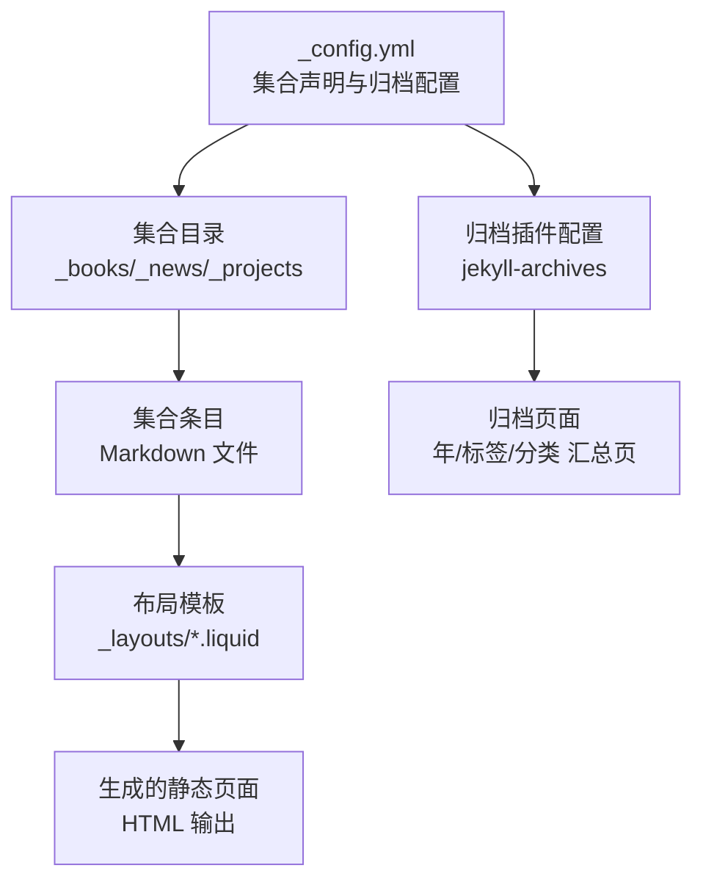
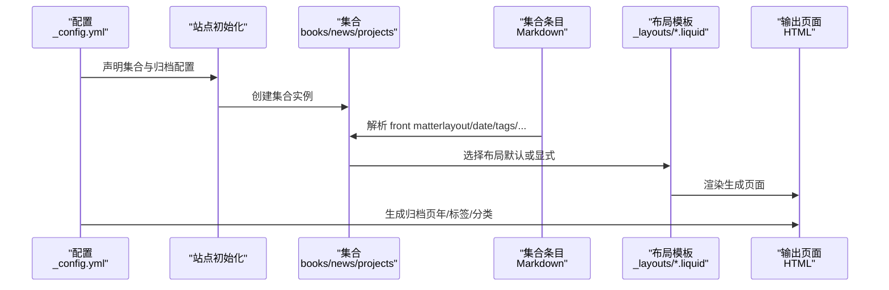
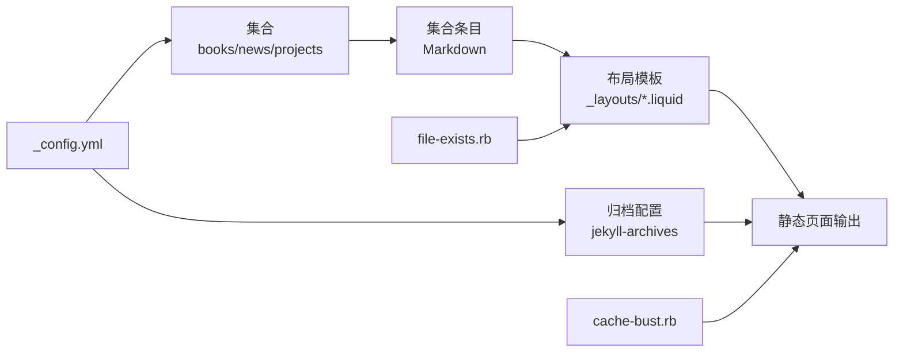

# 集合输出规则

<cite>
**本文引用的文件**
- [_config.yml](file://_config.yml)
- [_books/the_godfather.md](file://_books/the_godfather.md)
- [_news/announcement_1.md](file://_news/announcement_1.md)
- [_projects/1_project.md](file://_projects/1_project.md)
- [_layouts/book-review.liquid](file://_layouts/book-review.liquid)
- [_layouts/post.liquid](file://_layouts/post.liquid)
- [_layouts/page.liquid](file://_layouts/page.liquid)
- [_layouts/archive.liquid](file://_layouts/archive.liquid)
- [_layouts/book-shelf.liquid](file://_layouts/book-shelf.liquid)
- [_pages/dropdown.md](file://_pages/dropdown.md)
- [_plugins/cache-bust.rb](file://_plugins/cache-bust.rb)
- [_plugins/file-exists.rb](file://_plugins/file-exists.rb)
- [_plugins/external-posts.rb](file://_plugins/external-posts.rb)
- [CUSTOMIZE.md](file://CUSTOMIZE.md)
</cite>

## 目录
1. [简介](#简介)
2. [项目结构](#项目结构)
3. [核心组件](#核心组件)
4. [架构总览](#架构总览)
5. [组件详解](#组件详解)
6. [依赖关系分析](#依赖关系分析)
7. [性能考量](#性能考量)
8. [故障排除指南](#故障排除指南)
9. [结论](#结论)
10. [附录](#附录)

## 简介
本文件系统性阐述该 Jekyll 站点中“集合（Collections）”的输出规则与工作机制，覆盖以下主题：
- 集合在配置中的声明、输出开关与默认布局
- 单个条目页面与集合列表页面的生成机制
- 输出文件命名与路径控制（含 permalink）
- URL 生成与归档页（jekyll-archives）联动
- 布局系统与集合输出的关系（如何为不同集合指定不同布局）
- 性能优化策略（增量构建、缓存、资源指纹）
- 调试与故障排除方法

## 项目结构
该站点使用标准 Jekyll 结构，并通过配置启用多个自定义集合：books、news、projects。集合条目位于各自目录下，每个条目以 YAML 头信息（front matter）声明布局、日期、标签、分类等元数据；对应的布局模板位于 _layouts 中。

图表来源
- [_config.yml:147-156](file://_config.yml#L147-L156)
- [_config.yml:250-259](file://_config.yml#L250-L259)

章节来源
- [_config.yml:147-156](file://_config.yml#L147-L156)
- [_config.yml:250-259](file://_config.yml#L250-L259)

## 核心组件
- 集合声明与输出开关
  - 在配置中声明集合并设置 output: true，即可让 Jekyll 将集合条目渲染为独立页面。
  - 可通过 defaults 为集合条目设置默认布局（如 news 使用 post 布局）。
- 条目元数据
  - 条目 front matter 支持 layout、date、tags、categories、permalink 等字段，用于控制页面布局与 URL。
- 布局系统
  - 不同集合可绑定不同布局（如书籍 review 使用 book-review，新闻使用 post），也可统一使用 page 或 default。
- 归档与 URL
  - jekyll-archives 配置可为集合开启年/标签/分类归档页，配合 permalink 生成规范化的 URL。
- 插件与工具
  - 自定义插件用于外部文章导入、文件存在性判断、缓存破坏等。

章节来源
- [_config.yml:147-156](file://_config.yml#L147-L156)
- [_config.yml:250-259](file://_config.yml#L250-L259)
- [_layouts/book-review.liquid:1-20](file://_layouts/book-review.liquid#L1-L20)
- [_layouts/post.liquid:1-20](file://_layouts/post.liquid#L1-L20)
- [_layouts/page.liquid:1-20](file://_layouts/page.liquid#L1-L20)

## 架构总览
下图展示从集合条目到最终页面输出的关键流程：配置驱动集合创建 → 条目解析 front matter → 选择布局 → 渲染 HTML → 生成归档页（可选）。

图表来源
- [_config.yml:147-156](file://_config.yml#L147-L156)
- [_config.yml:250-259](file://_config.yml#L250-L259)
- [_layouts/book-review.liquid:1-20](file://_layouts/book-review.liquid#L1-L20)
- [_layouts/post.liquid:1-20](file://_layouts/post.liquid#L1-L20)
- [_layouts/page.liquid:1-20](file://_layouts/page.liquid#L1-L20)

## 组件详解

### 集合声明与输出开关
- books、news、projects 在配置中声明并开启 output: true，表示将集合条目作为独立页面输出。
- news 通过 defaults 设置默认布局为 post，避免每个条目重复声明 layout。
- jekyll-archives 为 books 启用年/标签/分类归档页，实现按维度浏览。

章节来源
- [_config.yml:147-156](file://_config.yml#L147-L156)
- [_config.yml:250-259](file://_config.yml#L250-L259)

### 单个条目页面生成机制
- 条目文件位于对应集合目录（如 _books、_news、_projects），文件名不强制日期前缀，但建议遵循约定以便排序与归档。
- front matter 决定页面布局（layout）、日期（date）、标签（tags）、分类（categories）、URL（permalink）等。
- 布局模板负责渲染内容区、标题、元信息、导航链接等。

示例要点（路径引用）
- 书籍条目布局：[_layouts/book-review.liquid:1-20](file://_layouts/book-review.liquid#L1-L20)
- 新闻条目 front matter：[_news/announcement_1.md:1-9](file://_news/announcement_1.md#L1-L9)
- 项目条目 front matter：[_projects/1_project.md:1-9](file://_projects/1_project.md#L1-L9)

章节来源
- [_layouts/book-review.liquid:1-20](file://_layouts/book-review.liquid#L1-L20)
- [_news/announcement_1.md:1-9](file://_news/announcement_1.md#L1-L9)
- [_projects/1_project.md:1-9](file://_projects/1_project.md#L1-L9)

### 集合列表页面与归档页
- 列表页面通常由集合 landing 页面（如 _pages 下的对应页面）或归档页（jekyll-archives）生成。
- 归档页模板（_layouts/archive.liquid）遍历 page.documents 并生成表格链接，支持按年、标签、分类查看。
- jekyll-archives 的 permalinks 定义了归档页的 URL 规则（如 /books/:year/、/books/:type/:name/）。

章节来源
- [_layouts/archive.liquid:1-38](file://_layouts/archive.liquid#L1-L38)
- [_config.yml:250-259](file://_config.yml#L250-L259)

### permalink 与 URL 生成规则
- permalink 可在条目 front matter 中显式指定，覆盖默认规则。
- 对于集合归档页，jekyll-archives 提供统一的 permalink 模板，确保 URL 结构一致。
- 示例：书籍归档页 URL 采用 /books/:year/、/books/tag/:slug/、/books/category/:slug/ 等模式。

章节来源
- [_config.yml:250-259](file://_config.yml#L250-L259)

### 布局系统与集合输出的关系
- 不同集合可绑定不同布局：
  - books 使用 book-review 布局，适合书籍阅读与评分展示。
  - news 使用 post 布局，便于统一博客风格。
  - projects 使用 page 布局，适配项目展示与网格布局。
- landing 页面可通过 page.collection 引用集合数据，实现分组展示（如书籍按年份分组）。

章节来源
- [_layouts/book-review.liquid:1-20](file://_layouts/book-review.liquid#L1-L20)
- [_layouts/post.liquid:1-20](file://_layouts/post.liquid#L1-L20)
- [_layouts/page.liquid:1-20](file://_layouts/page.liquid#L1-L20)
- [_layouts/book-shelf.liquid:1-20](file://_layouts/book-shelf.liquid#L1-L20)
- [_pages/dropdown.md:1-14](file://_pages/dropdown.md#L1-L14)

### 输出命名与路径控制
- output: true 时，Jekyll 会为集合条目生成独立页面；文件名与 permalink 共同决定最终 URL。
- 若未设置 permalink，Jekyll 默认基于文件名与集合目录生成 URL。
- landing 页面与归档页的 permalink 可在页面 front matter 或配置中设定，确保路径一致性。

章节来源
- [_config.yml:147-156](file://_config.yml#L147-L156)
- [_pages/dropdown.md:1-14](file://_pages/dropdown.md#L1-L14)

### 外部内容集成与动态输出
- external-posts.rb 插件可将外部源（如 RSS）的文章导入为集合条目，自动填充标题、摘要、日期与重定向链接，便于统一管理与输出。

章节来源
- [_plugins/external-posts.rb:44-67](file://_plugins/external-posts.rb#L44-L67)

## 依赖关系分析
- 配置层：_config.yml 声明集合、归档与插件，是集合输出的总控。
- 数据层：集合目录中的 Markdown 条目提供内容与元数据。
- 渲染层：布局模板根据 page 变量渲染 HTML。
- 输出层：生成静态页面与归档页；插件提供缓存破坏与文件存在性判断等辅助能力。

图表来源
- [_config.yml:147-156](file://_config.yml#L147-L156)
- [_config.yml:250-259](file://_config.yml#L250-L259)
- [_plugins/cache-bust.rb:1-51](file://_plugins/cache-bust.rb#L1-L51)
- [_plugins/file-exists.rb:1-22](file://_plugins/file-exists.rb#L1-L22)

章节来源
- [_config.yml:147-156](file://_config.yml#L147-L156)
- [_config.yml:250-259](file://_config.yml#L250-L259)
- [_plugins/cache-bust.rb:1-51](file://_plugins/cache-bust.rb#L1-L51)
- [_plugins/file-exists.rb:1-22](file://_plugins/file-exists.rb#L1-L22)

## 性能考量
- 增量构建
  - 使用 jekyll-archives 与归档页可减少首页与列表页的计算负担，按需生成年/标签/分类页。
  - 将大型集合拆分为多个子集合或分页，降低单次渲染压力。
- 缓存与指纹
  - 使用 cache-bust.rb 为静态资源生成带指纹的 URL，提升浏览器缓存命中率与更新效率。
  - 配合 keep_files 与排除项（exclude/include）控制输出文件集，减少不必要的重建。
- 资源优化
  - 合理使用压缩与最小化插件，避免重复处理已压缩资源。
  - 图片响应式与懒加载策略可降低首屏加载时间。

章节来源
- [_plugins/cache-bust.rb:1-51](file://_plugins/cache-bust.rb#L1-L51)
- [_config.yml:174-198](file://_config.yml#L174-L198)
- [_config.yml:234-245](file://_config.yml#L234-L245)

## 故障排除指南
- 条目未生成页面
  - 检查集合是否在 _config.yml 中声明且 output: true。
  - 确认条目 front matter 中 layout 是否正确，或是否被 defaults 覆盖。
- URL 与归档页异常
  - 核对 jekyll-archives 的 permalinks 配置是否与 landing 页面一致。
  - 若使用自定义 landing 页面，确认 page.collection 指向正确的集合变量。
- 外部内容未显示
  - 检查 external-posts.rb 插件是否启用，RSS 源是否可达，导入逻辑是否成功写入集合。
- 资源缓存问题
  - 使用 cache-bust.rb 重新生成带指纹的资源链接，清理浏览器缓存后重试。
- 文件存在性检查
  - 使用 file-exists.rb 标签在模板中判断资源是否存在，避免 404。

章节来源
- [_config.yml:147-156](file://_config.yml#L147-L156)
- [_config.yml:250-259](file://_config.yml#L250-L259)
- [_plugins/external-posts.rb:44-67](file://_plugins/external-posts.rb#L44-L67)
- [_plugins/cache-bust.rb:1-51](file://_plugins/cache-bust.rb#L1-L51)
- [_plugins/file-exists.rb:1-22](file://_plugins/file-exists.rb#L1-L22)

## 结论
该站点通过清晰的集合配置与布局体系，实现了书籍、新闻、项目等多类内容的模块化输出。结合 jekyll-archives 的归档机制与自定义插件，既能保证 URL 的一致性与可维护性，也能在性能上进行有效优化。建议在新增集合时遵循现有命名与布局约定，并充分利用归档页与缓存策略提升用户体验与构建效率。

## 附录
- 集合与布局对照参考
  - books → book-review
  - news → post
  - projects → page
- 关键配置位置
  - 集合与归档：[_config.yml:147-156](file://_config.yml#L147-L156), [_config.yml:250-259](file://_config.yml#L250-L259)
  - 插件与缓存：[_plugins/cache-bust.rb:1-51](file://_plugins/cache-bust.rb#L1-L51), [_plugins/file-exists.rb:1-22](file://_plugins/file-exists.rb#L1-L22)
  - 外部导入：[_plugins/external-posts.rb:44-67](file://_plugins/external-posts.rb#L44-L67)
  - 使用说明与定制：[CUSTOMIZE.md:80-94](file://CUSTOMIZE.md#L80-L94)