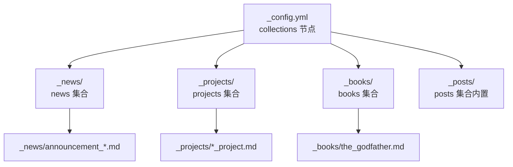
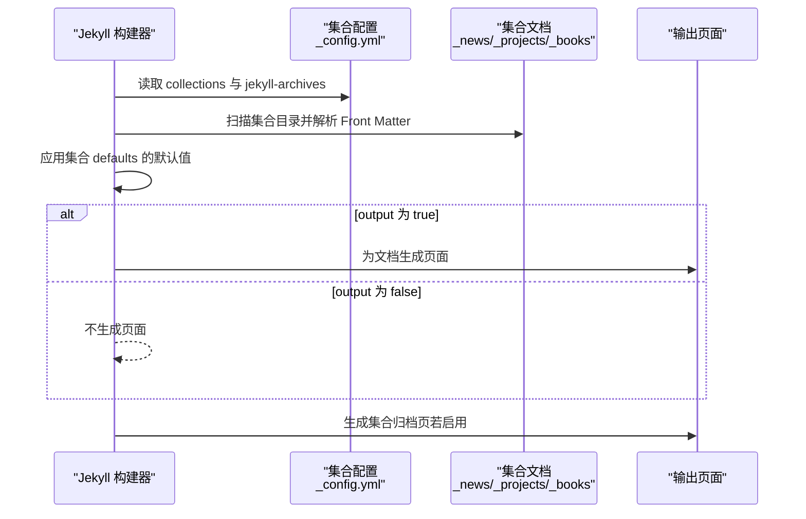
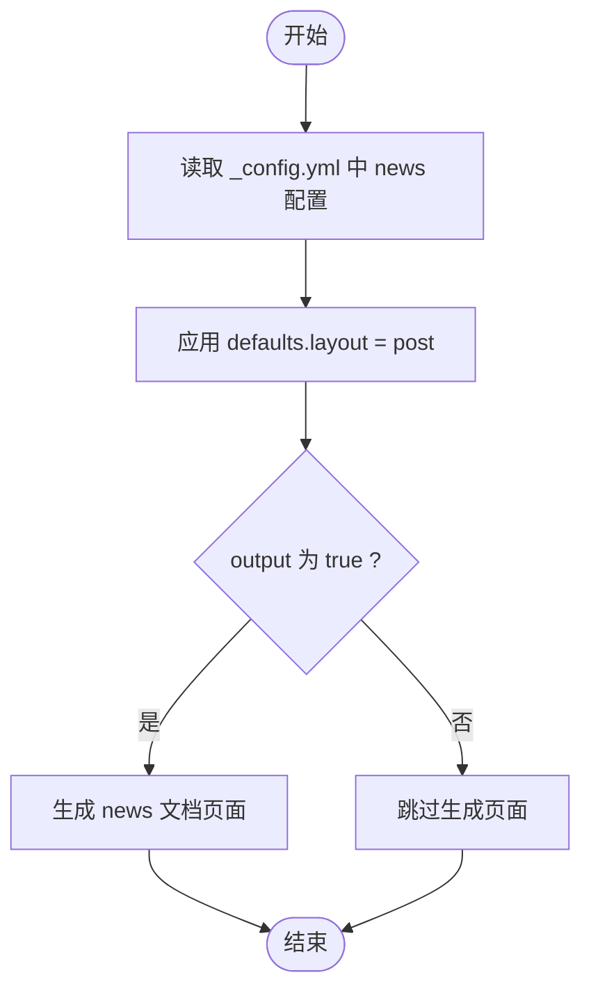
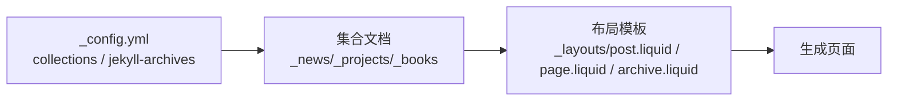

# 集合配置和设置

<cite>
**本文引用的文件**
- [_config.yml](file://_config.yml)
- [CUSTOMIZE.md](file://CUSTOMIZE.md)
- [_posts 目录](file://_posts)
- [_news 目录](file://_news)
- [_projects 目录](file://_projects)
- [_books 目录](file://_books)
- [_layouts/post.liquid](file://_layouts/post.liquid)
- [_layouts/page.liquid](file://_layouts/page.liquid)
- [_layouts/archive.liquid](file://_layouts/archive.liquid)
- [_news/announcement_1.md](file://_news/announcement_1.md)
- [_projects/1_project.md](file://_projects/1_project.md)
- [_books/the_godfather.md](file://_books/the_godfather.md)
</cite>

## 目录
1. [简介](#简介)
2. [项目结构](#项目结构)
3. [核心组件](#核心组件)
4. [架构总览](#架构总览)
5. [详细组件分析](#详细组件分析)
6. [依赖关系分析](#依赖关系分析)
7. [性能考量](#性能考量)
8. [故障排查指南](#故障排查指南)
9. [结论](#结论)
10. [附录](#附录)

## 简介
本文件系统性阐述 Jekyll 集合（Collections）在站点中的配置与使用方式，结合仓库中实际的集合配置与内容组织，解释集合字段的语法、基本配置项（如 output、defaults）、命名约定与目录结构要求，并说明集合与全局设置的关系及不同集合的差异化输出规则。文末提供完整配置示例与验证、排错建议。

## 项目结构
该站点采用标准 Jekyll 结构，集合通过在配置文件中声明并在根目录下创建对应前缀为下划线的目录来实现。当前已启用的集合包括：
- posts：内置集合，自动由 Jekyll 创建，无需在配置中显式声明；用于博客文章。
- news：自定义集合，启用输出并设置默认布局为 post。
- projects：自定义集合，启用输出。
- books：自定义集合，启用输出并配置归档（年份、标签、分类）。

图表来源
- [_config.yml](file://_config.yml)
- [_news 目录](file://_news)
- [_projects 目录](file://_projects)
- [_books 目录](file://_books)
- [_posts 目录](file://_posts)

章节来源
- [_config.yml](file://_config.yml)
- [CUSTOMIZE.md](file://CUSTOMIZE.md)

## 核心组件
- 集合配置入口：在站点配置文件的 collections 节点下声明集合名称及其选项。
- 输出控制：每个集合可独立设置 output 为布尔值以决定是否生成集合页面。
- 默认属性：通过 defaults 为集合内的文档设置默认布局等属性，避免在每个文档中重复声明。
- 归档支持：对需要按年、标签、分类浏览的集合，在 jekyll-archives 中开启相应功能。
- 内置集合：posts 为 Jekyll 内置集合，无需在 collections 中声明即可使用。

章节来源
- [_config.yml](file://_config.yml)
- [CUSTOMIZE.md](file://CUSTOMIZE.md)

## 架构总览
集合在构建时的工作流如下：
- Jekyll 扫描配置中声明的集合目录，读取各文档的 Front Matter。
- 应用集合级 defaults 设置的默认值。
- 若 output 为 true，则为集合文档生成页面。
- 若集合在 jekyll-archives 中启用，则生成对应的归档页（年、标签、分类）。

图表来源
- [_config.yml](file://_config.yml)
- [_news/announcement_1.md](file://_news/announcement_1.md)
- [_projects/1_project.md](file://_projects/1_project.md)
- [_books/the_godfather.md](file://_books/the_godfather.md)

## 详细组件分析

### 集合配置语法与参数
- collections：顶层节点，键名为集合名称，值为对象，包含：
  - output：布尔值，控制是否为该集合生成页面。
  - defaults：对象，包含 scope 与 values，用于为集合内文档设置默认属性（如 layout）。
- jekyll-archives：顶层节点，为指定集合启用年、标签、分类归档，并可自定义永久链接。

章节来源
- [_config.yml](file://_config.yml)

### news 集合
- 配置要点：启用输出；通过 defaults 将默认布局设为 post，使 news 文档继承博客类布局。
- 使用场景：在首页“新闻”区域展示公告，支持 inline 模式直接嵌入或跳转到详情页。
- 示例文档：包含日期、inline 开关、related_posts 控制等 Front Matter 字段。

图表来源
- [_config.yml](file://_config.yml)
- [_news/announcement_1.md](file://_news/announcement_1.md)

章节来源
- [_config.yml](file://_config.yml)
- [_news/announcement_1.md](file://_news/announcement_1.md)

### projects 集合
- 配置要点：启用输出。
- 使用场景：项目作品集页面以响应式网格展示，支持图片、描述、重要性排序等字段。
- 示例文档：包含标题、描述、图片路径、重要性、分类等 Front Matter 字段。

章节来源
- [_config.yml](file://_config.yml)
- [_projects/1_project.md](file://_projects/1_project.md)

### books 集合
- 配置要点：启用输出；在 jekyll-archives 中启用年、标签、分类归档，并自定义归档永久链接。
- 使用场景：书籍书架页面，支持书籍封面、评分、阅读状态、标签、分类等字段。
- 示例文档：包含布局、标题、作者、封面、ISBN/OLID、标签、分类、购买链接、阅读时间等 Front Matter 字段。

章节来源
- [_config.yml](file://_config.yml)
- [_books/the_godfather.md](file://_books/the_godfather.md)

### posts 集合（内置）
- 配置要点：无需在 collections 中声明；遵循 Jekyll 默认规则（文件名格式 YYYY-MM-DD-title.md）。
- 使用场景：博客文章列表、归档、相关文章推荐等。
- 与 news 的差异：news 通过 defaults 指定布局为 post，posts 为 Jekyll 内置集合，使用默认布局逻辑。

章节来源
- [CUSTOMIZE.md](file://CUSTOMIZE.md)
- [_posts 目录](file://_posts)

### 布局与模板
- post 布局：适用于博客风格内容，包含标题、元信息（日期、作者、更新时间）、标签与分类导航、目录、评论区等。
- page 布局：适用于静态页面，包含标题、描述、正文内容、相关出版物、评论区等。
- archive 布局：用于集合归档页，按年/标签/分类列出文档列表。

章节来源
- [_layouts/post.liquid](file://_layouts/post.liquid)
- [_layouts/page.liquid](file://_layouts/page.liquid)
- [_layouts/archive.liquid](file://_layouts/archive.liquid)

## 依赖关系分析
- 集合配置依赖于 Jekyll 的构建流程：collections 与 jekyll-archives 共同决定集合页面与归档页面的生成。
- 文档 Front Matter 依赖于集合 defaults：未在文档中显式声明的字段会从集合 defaults 中继承。
- 布局依赖于集合文档的 Front Matter：例如 news 文档的 inline、date 等字段会影响页面渲染与导航行为。

图表来源
- [_config.yml](file://_config.yml)
- [_layouts/post.liquid](file://_layouts/post.liquid)
- [_layouts/page.liquid](file://_layouts/page.liquid)
- [_layouts/archive.liquid](file://_layouts/archive.liquid)

章节来源
- [_config.yml](file://_config.yml)
- [_layouts/post.liquid](file://_layouts/post.liquid)
- [_layouts/page.liquid](file://_layouts/page.liquid)
- [_layouts/archive.liquid](file://_layouts/archive.liquid)

## 性能考量
- 合理设置 output：仅对需要生成页面的集合开启 output，减少不必要的页面生成与构建时间。
- 控制归档范围：在 jekyll-archives 中仅启用必要的归档类型（年/标签/分类），避免生成过多归档页导致构建膨胀。
- 使用 include/exclude：通过 include/exclude 与 keep_files 精准控制构建产物，提升构建效率。
- 布局与数据量匹配：大型集合建议配合分页或筛选逻辑，避免单页内容过大影响加载性能。

## 故障排查指南
- 症状：集合文档未生成页面
  - 排查：确认集合在 collections 中声明且 output 为 true；检查集合目录命名是否正确（以下划线开头）。
  - 参考：集合配置与输出开关。
- 症状：集合归档页缺失或链接异常
  - 排查：确认 jekyll-archives 中已为该集合启用相应归档类型，并检查归档永久链接配置。
  - 参考：归档配置与布局模板。
- 症状：集合文档样式或导航不一致
  - 排查：确认集合 defaults 是否正确设置默认布局；检查文档 Front Matter 是否覆盖了默认值。
  - 参考：defaults 与布局模板。
- 症状：posts 集合未生效
  - 排查：posts 为内置集合，无需在 collections 中声明；确保文件名符合 Jekyll 规范（YYYY-MM-DD-title.md）。
  - 参考：内置集合说明。

章节来源
- [_config.yml](file://_config.yml)
- [CUSTOMIZE.md](file://CUSTOMIZE.md)

## 结论
通过在 _config.yml 中声明集合、设置 output 与 defaults，并在 jekyll-archives 中启用归档，可以灵活地为不同类型的创作内容（新闻、项目、书籍等）建立统一的组织与展示机制。结合合理的命名约定与目录结构，能够显著提升站点的可维护性与扩展性。

## 附录

### 配置示例与最佳实践
- 基本集合配置（示例路径）
  - 集合声明与输出：参考集合配置位置。
  - 默认布局设置：参考 news 集合的 defaults。
  - 归档启用与链接：参考 books 集合的归档配置。
- 内置集合（posts）
  - 文件命名规范：参考内置集合说明。
  - 访问方式：通过模板变量访问集合内容。
- 自定义集合（news、projects、books）
  - 目录命名：集合目录需以“_集合名”形式放置于站点根目录。
  - 文档 Front Matter：根据集合用途设置布局、日期、标签、分类等字段。
  - 页面生成：确保 output 为 true，否则不会生成集合页面。
- 差异化输出规则
  - news：通过 defaults 指定布局为 post，适合博客风格展示。
  - projects：启用输出，适合作品集页面。
  - books：启用输出并开启归档，适合书架与分类浏览。
- 验证清单
  - 集合目录存在且命名正确。
  - _config.yml 中集合声明完整，output 与 defaults 正确。
  - jekyll-archives 中为需要归档的集合启用相应类型。
  - 文档 Front Matter 字段齐全，无拼写错误。
  - 构建后页面可正常访问，归档链接有效。

章节来源
- [_config.yml](file://_config.yml)
- [CUSTOMIZE.md](file://CUSTOMIZE.md)
- [_news/announcement_1.md](file://_news/announcement_1.md)
- [_projects/1_project.md](file://_projects/1_project.md)
- [_books/the_godfather.md](file://_books/the_godfather.md)