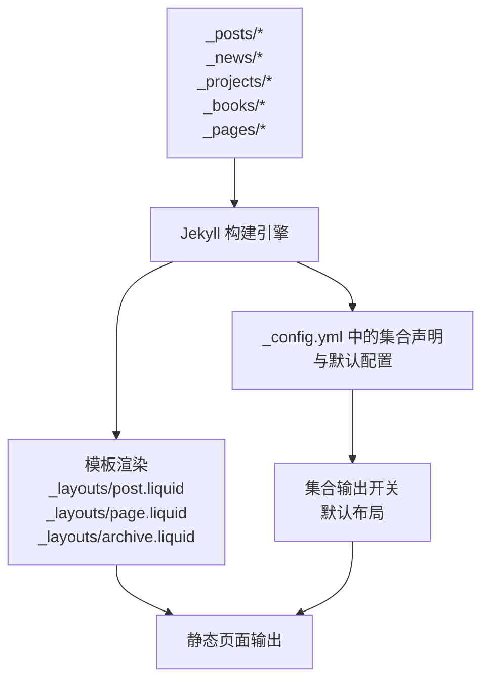
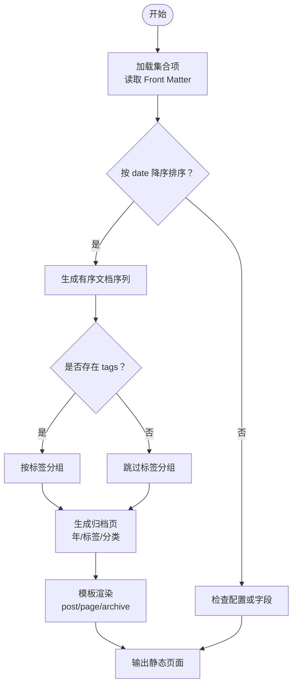
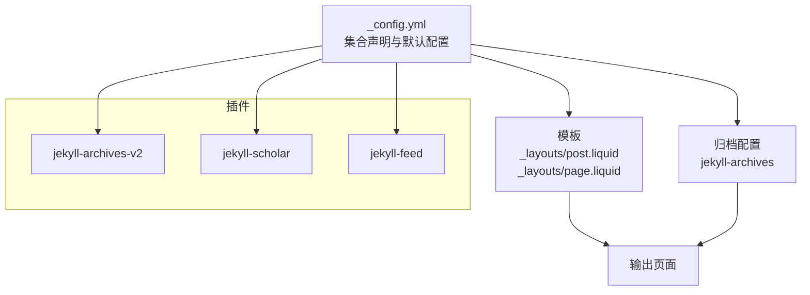

# 集合项管理

<cite>
**本文引用的文件**
- [_config.yml](file://_config.yml)
- [_posts/2015-03-15-formatting-and-links.md](file://_posts/2015-03-15-formatting-and-links.md)
- [_news/announcement_1.md](file://_news/announcement_1.md)
- [_projects/1_project.md](file://_projects/1_project.md)
- [_books/the_godfather.md](file://_books/the_godfather.md)
- [_pages/about.md](file://_pages/about.md)
- [_layouts/post.liquid](file://_layouts/post.liquid)
- [_layouts/page.liquid](file://_layouts/page.liquid)
- [_layouts/archive.liquid](file://_layouts/archive.liquid)
- [Gemfile](file://Gemfile)
</cite>

## 目录
1. [简介](#简介)
2. [项目结构](#项目结构)
3. [核心组件](#核心组件)
4. [架构总览](#架构总览)
5. [详细组件分析](#详细组件分析)
6. [依赖分析](#依赖分析)
7. [性能考虑](#性能考虑)
8. [故障排查指南](#故障排查指南)
9. [结论](#结论)
10. [附录](#附录)

## 简介
本文件系统性阐述该 Jekyll 站点中的“集合项管理”实践，涵盖集合项的文件组织与命名规范、Front Matter 结构与字段语义、排序与过滤机制、元数据管理策略，以及面向不同集合类型的创建示例与最佳实践。读者无需深入技术背景即可理解并应用这些规则。

## 项目结构
该站点采用 Jekyll 标准的集合目录组织方式，常见集合包括：
- 博文集合：_posts
- 新闻公告集合：_news
- 项目集合：_projects
- 图书集合：_books
- 页面集合：_pages

集合项通常以 Markdown 文件形式存在，文件名遵循“日期-标题”或“序号-描述”的约定，便于自动排序与归档。例如：
- 博文集合：_posts/2015-03-15-formatting-and-links.md
- 新闻集合：_news/announcement_1.md、_news/announcement_20250821.md
- 项目集合：_projects/1_project.md、_projects/2_project.md
- 图书集合：_books/the_godfather.md
- 页面集合：_pages/about.md

集合项的输出控制由配置文件统一管理，集合默认布局、输出开关、归档页等均在配置中声明。

章节来源
- [_config.yml:147-156](file://_config.yml#L147-L156)
- [_posts/2015-03-15-formatting-and-links.md:1-37](file://_posts/2015-03-15-formatting-and-links.md#L1-L37)
- [_news/announcement_1.md:1-9](file://_news/announcement_1.md#L1-L9)
- [_projects/1_project.md:1-82](file://_projects/1_project.md#L1-L82)
- [_books/the_godfather.md:1-28](file://_books/the_godfather.md#L1-L28)
- [_pages/about.md:1-37](file://_pages/about.md#L1-L37)

## 核心组件
- 集合声明与默认行为
  - 在配置中声明集合，并为集合设置默认布局与输出开关，确保集合项生成独立页面并使用统一模板。
  - 示例路径：[_config.yml:147-156](file://_config.yml#L147-L156)

- Front Matter 字段体系
  - 布局字段：layout 指定页面模板（如 post、page、about 等）。
  - 发布时间：date 控制排序与归档。
  - 标签与分类：tags、categories 用于内容分组与导航。
  - 其他常用字段：title、description、permalink、img、importance、category、inline、related_posts 等。
  - 示例路径：
    - 博文集合：[_posts/2015-03-15-formatting-and-links.md:1-8](file://_posts/2015-03-15-formatting-and-links.md#L1-L8)
    - 新闻公告：[_news/announcement_1.md:1-6](file://_news/announcement_1.md#L1-L6)
    - 项目展示：[_projects/1_project.md:1-9](file://_projects/1_project.md#L1-L9)
    - 图书集合：[_books/the_godfather.md:1-17](file://_books/the_godfather.md#L1-L17)
    - 页面集合：[_pages/about.md:1-28](file://_pages/about.md#L1-L28)

- 模板与渲染
  - post 模板负责博文类页面的标题、日期、标签、分类、目录、评论等渲染。
  - page 模板负责页面类内容的标题、描述、正文渲染。
  - archive 模板用于按年/标签/分类归档列表的展示。
  - 示例路径：
    - [_layouts/post.liquid:1-97](file://_layouts/post.liquid#L1-L97)
    - [_layouts/page.liquid:1-32](file://_layouts/page.liquid#L1-L32)
    - [_layouts/archive.liquid:1-38](file://_layouts/archive.liquid#L1-L38)

- 排序与过滤
  - 默认按 date 字段降序排列；也可通过 tags、categories 等字段进行过滤与分组。
  - 归档页支持按年/标签/分类维度浏览。
  - 示例路径：
    - [_config.yml:250-257](file://_config.yml#L250-L257)
    - [_layouts/archive.liquid:21-35](file://_layouts/archive.liquid#L21-L35)

- 元数据管理
  - 发布状态：通过日期字段与模板逻辑控制是否展示。
  - 分类标签：tags、categories 用于导航与筛选。
  - 草稿模式：未公开日期或未启用输出的集合项不会出现在最终页面中。
  - 示例路径：
    - [_posts/2015-03-15-formatting-and-links.md:1-8](file://_posts/2015-03-15-formatting-and-links.md#L1-L8)
    - [_news/announcement_1.md:1-6](file://_news/announcement_1.md#L1-L6)

章节来源
- [_config.yml:147-156](file://_config.yml#L147-L156)
- [_config.yml:250-257](file://_config.yml#L250-L257)
- [_posts/2015-03-15-formatting-and-links.md:1-8](file://_posts/2015-03-15-formatting-and-links.md#L1-L8)
- [_news/announcement_1.md:1-6](file://_news/announcement_1.md#L1-L6)
- [_projects/1_project.md:1-9](file://_projects/1_project.md#L1-L9)
- [_books/the_godfather.md:1-17](file://_books/the_godfather.md#L1-L17)
- [_pages/about.md:1-28](file://_pages/about.md#L1-L28)
- [_layouts/post.liquid:1-97](file://_layouts/post.liquid#L1-L97)
- [_layouts/page.liquid:1-32](file://_layouts/page.liquid#L1-L32)
- [_layouts/archive.liquid:1-38](file://_layouts/archive.liquid#L1-L38)

## 架构总览
下图展示了集合项从文件到页面的构建流程：集合项（Markdown + Front Matter）经由 Jekyll 构建引擎处理，结合集合默认配置与模板，生成静态页面；归档页根据配置开启相应维度的归档功能。

图表来源
- [_config.yml:147-156](file://_config.yml#L147-L156)
- [_layouts/post.liquid:1-97](file://_layouts/post.liquid#L1-L97)
- [_layouts/page.liquid:1-32](file://_layouts/page.liquid#L1-L32)
- [_layouts/archive.liquid:1-38](file://_layouts/archive.liquid#L1-L38)

## 详细组件分析

### 文件组织与命名规范
- 统一使用 Markdown 扩展名（.md），不使用 .markdown 或 .html。
- 命名建议：
  - 博文集合：YYYY-MM-DD-title.md，便于按日期排序与归档。
  - 新闻公告：announcement_YYYYMMDD.md 或 announcement_1.md，既可按日期也可用序号。
  - 项目集合：序号+描述.md，如 1_project.md。
  - 图书集合：书名或标识.md，如 the_godfather.md。
  - 页面集合：语义化名称.md，如 about.md、projects.md。
- 说明：仓库中未见 .html 集合项，推荐保持一致的 .md 格式以简化维护。

章节来源
- [_posts/2015-03-15-formatting-and-links.md:1-37](file://_posts/2015-03-15-formatting-and-links.md#L1-L37)
- [_news/announcement_1.md:1-9](file://_news/announcement_1.md#L1-L9)
- [_projects/1_project.md:1-82](file://_projects/1_project.md#L1-L82)
- [_books/the_godfather.md:1-28](file://_books/the_godfather.md#L1-L28)
- [_pages/about.md:1-37](file://_pages/about.md#L1-L37)

### Front Matter 结构与字段语义
- 必需字段
  - layout：指定页面模板（如 post、page、about）。
  - date：用于排序与归档（博文集合常用）。
- 常用字段
  - title、description：标题与摘要。
  - tags、categories：标签与分类，用于导航与筛选。
  - permalink：自定义链接格式（页面集合常用）。
  - img、importance、category：项目集合的图片与优先级。
  - inline：新闻公告集合的内联显示标记。
  - related_posts、related_publications：关联内容开关。
- 字段示例路径：
  - 博文集合：[_posts/2015-03-15-formatting-and-links.md:1-8](file://_posts/2015-03-15-formatting-and-links.md#L1-L8)
  - 新闻公告：[_news/announcement_1.md:1-6](file://_news/announcement_1.md#L1-L6)
  - 项目集合：[_projects/1_project.md:1-9](file://_projects/1_project.md#L1-L9)
  - 图书集合：[_books/the_godfather.md:1-17](file://_books/the_godfather.md#L1-L17)
  - 页面集合：[_pages/about.md:1-28](file://_pages/about.md#L1-L28)

章节来源
- [_posts/2015-03-15-formatting-and-links.md:1-8](file://_posts/2015-03-15-formatting-and-links.md#L1-L8)
- [_news/announcement_1.md:1-6](file://_news/announcement_1.md#L1-L6)
- [_projects/1_project.md:1-9](file://_projects/1_project.md#L1-L9)
- [_books/the_godfather.md:1-17](file://_books/the_godfather.md#L1-L17)
- [_pages/about.md:1-28](file://_pages/about.md#L1-L28)

### 排序规则与过滤机制
- 默认排序
  - 按 date 字段降序排列，适用于博文与新闻公告集合。
- 过滤与分组
  - 通过 tags 与 categories 字段实现内容分组与导航。
  - 归档页支持按年/标签/分类维度浏览。
- 模板中的排序与过滤
  - 归档模板遍历 page.documents 输出列表。
- 示例路径：
  - [_config.yml:250-257](file://_config.yml#L250-L257)
  - [_layouts/archive.liquid:21-35](file://_layouts/archive.liquid#L21-L35)

图表来源
- [_config.yml:250-257](file://_config.yml#L250-L257)
- [_layouts/archive.liquid:21-35](file://_layouts/archive.liquid#L21-L35)

章节来源
- [_config.yml:250-257](file://_config.yml#L250-L257)
- [_layouts/archive.liquid:21-35](file://_layouts/archive.liquid#L21-L35)

### 元数据管理
- 发布状态
  - 通过 date 字段控制发布时间；未到达时间的内容在默认模板中可能不展示。
- 分类与标签
  - tags、categories 字段用于内容分组与导航。
- 草稿与隐藏
  - 未启用输出或未满足日期条件的集合项不会出现在最终页面中。
- 示例路径：
  - 博文集合：[_posts/2015-03-15-formatting-and-links.md:1-8](file://_posts/2015-03-15-formatting-and-links.md#L1-L8)
  - 新闻公告：[_news/announcement_1.md:1-6](file://_news/announcement_1.md#L1-L6)

章节来源
- [_posts/2015-03-15-formatting-and-links.md:1-8](file://_posts/2015-03-15-formatting-and-links.md#L1-L8)
- [_news/announcement_1.md:1-6](file://_news/announcement_1.md#L1-L6)

### 集合类型创建示例
- 博客文章
  - 使用 _posts 目录，文件名采用 YYYY-MM-DD-title.md。
  - Front Matter 包含 layout: post、date、title、description、tags、categories。
  - 示例路径：[_posts/2015-03-15-formatting-and-links.md:1-8](file://_posts/2015-03-15-formatting-and-links.md#L1-L8)
- 项目展示
  - 使用 _projects 目录，文件名采用序号+描述.md。
  - Front Matter 包含 layout: page、title、description、img、importance、category。
  - 示例路径：[_projects/1_project.md:1-9](file://_projects/1_project.md#L1-L9)
- 新闻公告
  - 使用 _news 目录，文件名可采用 announcement_YYYYMMDD.md 或 announcement_序号.md。
  - Front Matter 包含 layout: post、date、inline 等。
  - 示例路径：[_news/announcement_1.md:1-6](file://_news/announcement_1.md#L1-L6)
- 页面内容
  - 使用 _pages 目录，文件名采用语义化名称.md。
  - Front Matter 包含 layout、title、permalink、subtitle、profile 等。
  - 示例路径：[_pages/about.md:1-28](file://_pages/about.md#L1-L28)
- 图书集合
  - 使用 _books 目录，文件名采用书名或标识.md。
  - Front Matter 包含 layout: book-review、title、author、cover、categories、tags、buy_link、started、finished、released、stars、goodreads_review、status 等。
  - 示例路径：[_books/the_godfather.md:1-17](file://_books/the_godfather.md#L1-L17)

章节来源
- [_posts/2015-03-15-formatting-and-links.md:1-8](file://_posts/2015-03-15-formatting-and-links.md#L1-L8)
- [_projects/1_project.md:1-9](file://_projects/1_project.md#L1-L9)
- [_news/announcement_1.md:1-6](file://_news/announcement_1.md#L1-L6)
- [_pages/about.md:1-28](file://_pages/about.md#L1-L28)
- [_books/the_godfather.md:1-17](file://_books/the_godfather.md#L1-L17)

### 批量管理与组织最佳实践
- 规范化命名
  - 博文：YYYY-MM-DD-title.md；新闻：announcement_YYYYMMDD.md；项目：序号+描述.md。
- 统一 Front Matter 字段
  - 为每类集合制定字段清单，避免遗漏关键字段（如 date、title、layout）。
- 模板复用
  - 使用 post/page 模板统一渲染风格，减少重复配置。
- 归档与导航
  - 启用 jekyll-archives 对应维度，提升内容可发现性。
- 版本与备份
  - 新增集合项时保留历史版本（如 _news_bk），便于回滚与对比。
- 示例路径：
  - [_config.yml:147-156](file://_config.yml#L147-L156)
  - [_config.yml:250-257](file://_config.yml#L250-L257)
  - [_pages/about.md:19-27](file://_pages/about.md#L19-L27)

章节来源
- [_config.yml:147-156](file://_config.yml#L147-L156)
- [_config.yml:250-257](file://_config.yml#L250-L257)
- [_pages/about.md:19-27](file://_pages/about.md#L19-L27)

## 依赖分析
- 集合配置依赖
  - 集合声明与默认配置决定集合项的输出与模板选择。
- 模板依赖
  - post/page 模板依赖 Front Matter 字段与内容区段。
- 插件依赖
  - jekyll-archives-v2 提供归档页能力；jekyll-scholar、jekyll-feed 等插件影响内容与订阅。
- 示例路径：
  - [_config.yml:147-156](file://_config.yml#L147-L156)
  - [_config.yml:200-219](file://_config.yml#L200-L219)
  - [Gemfile:6-26](file://Gemfile#L6-L26)

图表来源
- [_config.yml:147-156](file://_config.yml#L147-L156)
- [_config.yml:200-219](file://_config.yml#L200-L219)
- [Gemfile:6-26](file://Gemfile#L6-L26)

章节来源
- [_config.yml:147-156](file://_config.yml#L147-L156)
- [_config.yml:200-219](file://_config.yml#L200-L219)
- [Gemfile:6-26](file://Gemfile#L6-L26)

## 性能考虑
- 减少不必要的 Front Matter 字段，降低模板渲染开销。
- 合理使用归档页维度，避免过度嵌套与复杂查询。
- 将大图与媒体资源放置于静态资源目录，配合懒加载与响应式图片优化加载速度。
- 使用压缩与缓存策略（如 jekyll-minifier、terser）减少体积。

## 故障排查指南
- 集合项未生成页面
  - 检查集合声明与输出开关：[_config.yml:147-156](file://_config.yml#L147-L156)
  - 确认 Front Matter 中 layout 是否正确：[_posts/2015-03-15-formatting-and-links.md:1-3](file://_posts/2015-03-15-formatting-and-links.md#L1-L3)
- 排序异常
  - 检查 date 字段格式与值：[_posts/2015-03-15-formatting-and-links.md:4](file://_posts/2015-03-15-formatting-and-links.md#L4)
  - 确认归档配置是否启用对应维度：[_config.yml:250-257](file://_config.yml#L250-L257)
- 归档页空白
  - 检查归档模板对 page.documents 的遍历逻辑：[_layouts/archive.liquid:21-35](file://_layouts/archive.liquid#L21-L35)
- 插件冲突
  - 核对已安装插件列表：[Gemfile:6-26](file://Gemfile#L6-L26)

章节来源
- [_config.yml:147-156](file://_config.yml#L147-L156)
- [_config.yml:250-257](file://_config.yml#L250-L257)
- [_posts/2015-03-15-formatting-and-links.md:1-8](file://_posts/2015-03-15-formatting-and-links.md#L1-L8)
- [_layouts/archive.liquid:21-35](file://_layouts/archive.liquid#L21-L35)
- [Gemfile:6-26](file://Gemfile#L6-L26)

## 结论
通过统一的集合命名规范、标准化的 Front Matter 字段、清晰的排序与过滤机制，以及模板化的渲染流程，该站点实现了高质量的集合项管理。遵循本文的最佳实践，可在保证一致性的同时提升内容创作与维护效率。

## 附录
- 关键文件索引
  - 配置与集合声明：[_config.yml:147-156](file://_config.yml#L147-L156)
  - 归档配置：[_config.yml:250-257](file://_config.yml#L250-L257)
  - 插件列表：[Gemfile:6-26](file://Gemfile#L6-L26)
  - 模板示例：[_layouts/post.liquid:1-97](file://_layouts/post.liquid#L1-L97)、[_layouts/page.liquid:1-32](file://_layouts/page.liquid#L1-L32)、[_layouts/archive.liquid:1-38](file://_layouts/archive.liquid#L1-L38)
  - 集合项示例：[_posts/2015-03-15-formatting-and-links.md:1-37](file://_posts/2015-03-15-formatting-and-links.md#L1-L37)、[_news/announcement_1.md:1-9](file://_news/announcement_1.md#L1-L9)、[_projects/1_project.md:1-82](file://_projects/1_project.md#L1-L82)、[_books/the_godfather.md:1-28](file://_books/the_godfather.md#L1-L28)、[_pages/about.md:1-37](file://_pages/about.md#L1-L37)