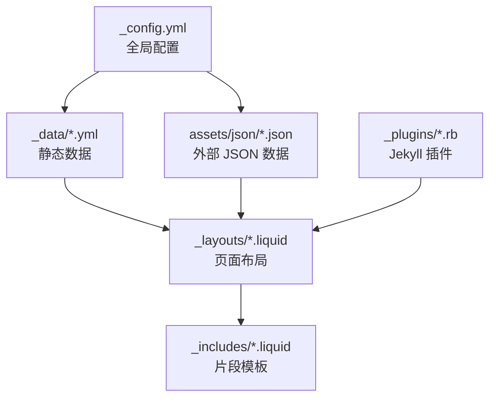
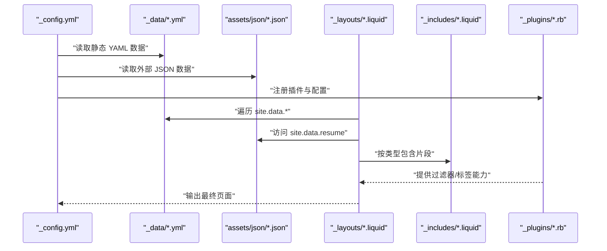
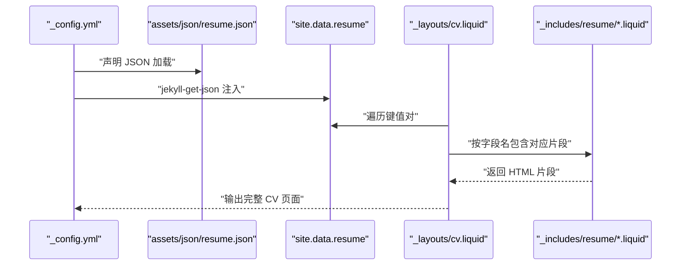
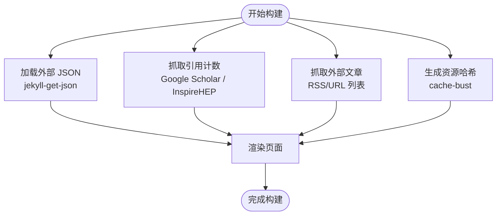
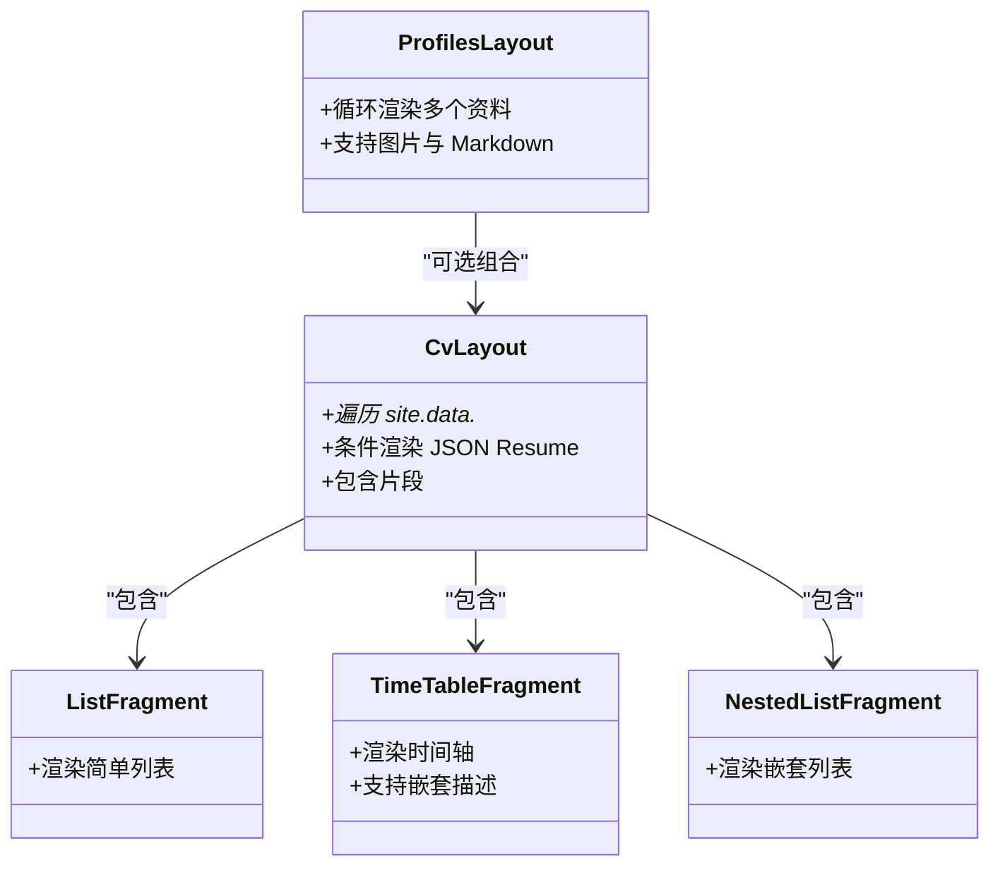
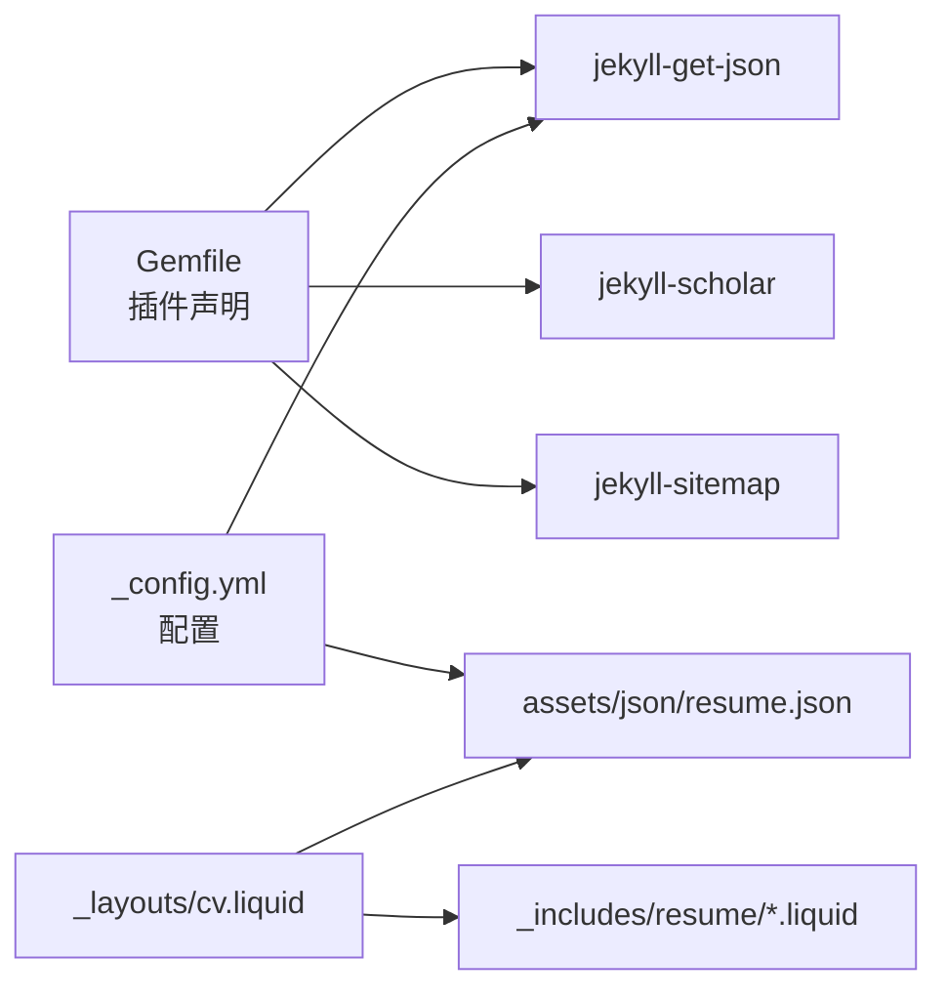

# 内容数据管理

<cite>
**本文引用的文件**
- [_config.yml](file://_config.yml)
- [_data/coauthors.yml](file://_data/coauthors.yml)
- [_data/cv.yml](file://_data/cv.yml)
- [_data/repositories.yml](file://_data/repositories.yml)
- [_data/socials.yml](file://_data/socials.yml)
- [_data/venues.yml](file://_data/venues.yml)
- [assets/json/resume.json](file://assets/json/resume.json)
- [_layouts/cv.liquid](file://_layouts/cv.liquid)
- [_layouts/profiles.liquid](file://_layouts/profiles.liquid)
- [_includes/cv/list.liquid](file://_includes/cv/list.liquid)
- [_includes/cv/time_table.liquid](file://_includes/cv/time_table.liquid)
- [_includes/cv/nested_list.liquid](file://_includes/cv/nested_list.liquid)
- [_plugins/google-scholar-citations.rb](file://_plugins/google-scholar-citations.rb)
- [_plugins/inspirehep-citations.rb](file://_plugins/inspirehep-citations.rb)
- [_plugins/cache-bust.rb](file://_plugins/cache-bust.rb)
- [_plugins/external-posts.rb](file://_plugins/external-posts.rb)
- [Gemfile](file://Gemfile)
</cite>

## 目录
1. [简介](#简介)
2. [项目结构](#项目结构)
3. [核心组件](#核心组件)
4. [架构总览](#架构总览)
5. [详细组件分析](#详细组件分析)
6. [依赖关系分析](#依赖关系分析)
7. [性能考量](#性能考量)
8. [故障排查指南](#故障排查指南)
9. [结论](#结论)
10. [附录](#附录)

## 简介
本文件系统性阐述该内容数据管理系统的组织与实现方式，重点覆盖以下方面：
- _data 目录的作用与数据文件组织（YAML、JSON、CSV 的支持现状）
- 配置数据的使用方法（作者信息、社交链接、仓库信息等）
- JSON Resume 数据的集成与展示（字段映射与页面渲染）
- 动态数据加载机制与缓存策略
- 数据管理最佳实践（验证、版本控制、备份）

## 项目结构
该站点采用 Jekyll 静态生成框架，数据主要来源于 _data 目录与外部 JSON 文件，通过 Liquid 模板在构建期注入到页面中。核心路径如下：
- _data：存放 YAML 格式的静态数据（如作者合著者、CV 结构、社交链接、会议/期刊信息、仓库列表）
- assets/json：存放 JSON 格式的外部数据（如 JSON Resume）
- _layouts 与 _includes：定义页面布局与可复用片段，用于渲染数据
- _plugins：扩展 Jekyll 能力（如外部 RSS 获取、缓存破坏、引用计数抓取等）
- _config.yml：全局配置，含 JSON Resume 字段白名单、外部 JSON 加载等

图表来源
- [_config.yml](file://_config.yml)
- [_data/coauthors.yml](file://_data/coauthors.yml)
- [assets/json/resume.json](file://assets/json/resume.json)
- [_layouts/cv.liquid](file://_layouts/cv.liquid)
- [_includes/cv/list.liquid](file://_includes/cv/list.liquid)

章节来源
- [_config.yml](file://_config.yml)
- [_data/coauthors.yml](file://_data/coauthors.yml)
- [_data/cv.yml](file://_data/cv.yml)
- [_data/repositories.yml](file://_data/repositories.yml)
- [_data/socials.yml](file://_data/socials.yml)
- [_data/venues.yml](file://_data/venues.yml)
- [assets/json/resume.json](file://assets/json/resume.json)
- [_layouts/cv.liquid](file://_layouts/cv.liquid)
- [_layouts/profiles.liquid](file://_layouts/profiles.liquid)
- [_includes/cv/list.liquid](file://_includes/cv/list.liquid)
- [_includes/cv/time_table.liquid](file://_includes/cv/time_table.liquid)
- [_includes/cv/nested_list.liquid](file://_includes/cv/nested_list.liquid)
- [_plugins/google-scholar-citations.rb](file://_plugins/google-scholar-citations.rb)
- [_plugins/inspirehep-citations.rb](file://_plugins/inspirehep-citations.rb)
- [_plugins/cache-bust.rb](file://_plugins/cache-bust.rb)
- [_plugins/external-posts.rb](file://_plugins/external-posts.rb)
- [Gemfile](file://Gemfile)

## 核心组件
- 静态数据层（_data）：以 YAML 组织作者合著者、CV 结构、社交链接、仓库与会议/期刊信息
- 外部 JSON 层（assets/json）：以 JSON 组织 JSON Resume 数据
- 渲染层（_layouts 与 _includes）：根据数据类型选择对应片段进行渲染
- 扩展层（_plugins）：负责外部数据抓取、缓存破坏、引用计数抓取等
- 构建配置（_config.yml）：声明 JSON Resume 字段白名单、外部 JSON 加载、Jekyll 插件等

章节来源
- [_data/coauthors.yml](file://_data/coauthors.yml)
- [_data/cv.yml](file://_data/cv.yml)
- [_data/repositories.yml](file://_data/repositories.yml)
- [_data/socials.yml](file://_data/socials.yml)
- [_data/venues.yml](file://_data/venues.yml)
- [assets/json/resume.json](file://assets/json/resume.json)
- [_layouts/cv.liquid](file://_layouts/cv.liquid)
- [_plugins/external-posts.rb](file://_plugins/external-posts.rb)
- [_plugins/cache-bust.rb](file://_plugins/cache-bust.rb)
- [_plugins/google-scholar-citations.rb](file://_plugins/google-scholar-citations.rb)
- [_plugins/inspirehep-citations.rb](file://_plugins/inspirehep-citations.rb)
- [_config.yml](file://_config.yml)
- [Gemfile](file://Gemfile)

## 架构总览
下图展示了从数据源到页面渲染的整体流程，以及关键交互点。

图表来源
- [_config.yml](file://_config.yml)
- [_data/coauthors.yml](file://_data/coauthors.yml)
- [assets/json/resume.json](file://assets/json/resume.json)
- [_layouts/cv.liquid](file://_layouts/cv.liquid)
- [_includes/cv/list.liquid](file://_includes/cv/list.liquid)
- [_plugins/cache-bust.rb](file://_plugins/cache-bust.rb)
- [_plugins/external-posts.rb](file://_plugins/external-posts.rb)

## 详细组件分析

### _data 目录与数据文件组织
- YAML 支持：_data 下的 .yml 文件会被 Jekyll 自动解析为 site.data.*，供 Liquid 模板直接访问
- JSON 支持：通过 jekyll-get-json 插件将指定 JSON 文件加载为 site.data.<key>
- CSV 支持：Jekyll 官方未内置 CSV 解析；若需使用 CSV，建议转换为 YAML 或在自定义插件中处理

数据文件职责概览：
- coauthors.yml：作者合著者姓名别名与链接
- cv.yml：CV 结构化条目（标题、类型、内容），用于生成时间轴、列表等
- repositories.yml：GitHub 用户与仓库列表、描述行数限制
- socials.yml：社交账号与链接（邮箱、GitHub、Google Scholar 等）
- venues.yml：会议/期刊简称、URL、颜色等元信息

章节来源
- [_data/coauthors.yml](file://_data/coauthors.yml)
- [_data/cv.yml](file://_data/cv.yml)
- [_data/repositories.yml](file://_data/repositories.yml)
- [_data/socials.yml](file://_data/socials.yml)
- [_data/venues.yml](file://_data/venues.yml)

### 配置数据使用方法
- 作者信息与社交链接：socials.yml 提供统一入口，可在页面中通过 site.data.socials 访问
- 仓库信息：repositories.yml 提供用户与仓库清单，配合仓库相关片段渲染
- 会议/期刊信息：venues.yml 为出版物展示提供颜色与链接等元数据
- 其他：_config.yml 中的 scholar、third_party_libraries、jekyll_get_json 等配置影响数据加载与渲染

章节来源
- [_data/socials.yml](file://_data/socials.yml)
- [_data/repositories.yml](file://_data/repositories.yml)
- [_data/venues.yml](file://_data/venues.yml)
- [_config.yml](file://_config.yml)

### JSON Resume 数据集成与展示
- 数据来源：assets/json/resume.json
- 加载机制：_config.yml 中通过 jekyll_get_json 将其加载为 site.data.resume
- 字段白名单：_config.yml 中的 jsonresume 列表限定仅渲染白名单内的字段
- 渲染流程：_layouts/cv.liquid 在存在 site.data.resume 时，按字段名匹配对应 _includes/resume/*.liquid 片段进行渲染

图表来源
- [_config.yml](file://_config.yml)
- [assets/json/resume.json](file://assets/json/resume.json)
- [_layouts/cv.liquid](file://_layouts/cv.liquid)

章节来源
- [_config.yml](file://_config.yml)
- [assets/json/resume.json](file://assets/json/resume.json)
- [_layouts/cv.liquid](file://_layouts/cv.liquid)

### 动态数据加载与缓存策略
- 外部 JSON 加载：jekyll-get-json 插件在构建期拉取或读取本地 JSON 并注入 site.data
- 引用计数抓取：google-scholar-citations 与 inspirehep-citations 插件在构建期抓取外部数据并缓存于内存哈希中，避免重复请求
- 缓存破坏：cache-bust 插件为静态资源生成带哈希的 URL，便于浏览器缓存更新
- 外部文章聚合：external-posts 插件从 RSS 或 URL 列表抓取外部内容，写入站点集合

图表来源
- [_plugins/external-posts.rb](file://_plugins/external-posts.rb)
- [_plugins/google-scholar-citations.rb](file://_plugins/google-scholar-citations.rb)
- [_plugins/inspirehep-citations.rb](file://_plugins/inspirehep-citations.rb)
- [_plugins/cache-bust.rb](file://_plugins/cache-bust.rb)
- [_config.yml](file://_config.yml)

章节来源
- [_plugins/external-posts.rb](file://_plugins/external-posts.rb)
- [_plugins/google-scholar-citations.rb](file://_plugins/google-scholar-citations.rb)
- [_plugins/inspirehep-citations.rb](file://_plugins/inspirehep-citations.rb)
- [_plugins/cache-bust.rb](file://_plugins/cache-bust.rb)
- [_config.yml](file://_config.yml)
- [Gemfile](file://Gemfile)

### 数据渲染与片段模板
- CV 页面：_layouts/cv.liquid 根据是否存在 site.data.resume 决定走 JSON Resume 流程还是本地 YAML 结构流程
- 片段模板：
  - 列表：_includes/cv/list.liquid
  - 时间轴：_includes/cv/time_table.liquid
  - 嵌套列表：_includes/cv/nested_list.liquid
- 个人资料页：_layouts/profiles.liquid 支持多份资料的循环渲染与图片插入

图表来源
- [_layouts/cv.liquid](file://_layouts/cv.liquid)
- [_includes/cv/list.liquid](file://_includes/cv/list.liquid)
- [_includes/cv/time_table.liquid](file://_includes/cv/time_table.liquid)
- [_includes/cv/nested_list.liquid](file://_includes/cv/nested_list.liquid)
- [_layouts/profiles.liquid](file://_layouts/profiles.liquid)

章节来源
- [_layouts/cv.liquid](file://_layouts/cv.liquid)
- [_includes/cv/list.liquid](file://_includes/cv/list.liquid)
- [_includes/cv/time_table.liquid](file://_includes/cv/time_table.liquid)
- [_includes/cv/nested_list.liquid](file://_includes/cv/nested_list.liquid)
- [_layouts/profiles.liquid](file://_layouts/profiles.liquid)

## 依赖关系分析
- 插件生态：Gemfile 声明了 jekyll-get-json、jekyll-scholar、jekyll-sitemap 等插件，支撑数据加载与 SEO
- 配置耦合：_config.yml 同时驱动 jekyll-get-json 的数据键与 jsonresume 白名单，决定渲染范围
- 数据耦合：_layouts/cv.liquid 依赖 site.data.resume 的键集合，与 _config.yml 的白名单保持一致

图表来源
- [Gemfile](file://Gemfile)
- [_config.yml](file://_config.yml)
- [assets/json/resume.json](file://assets/json/resume.json)
- [_layouts/cv.liquid](file://_layouts/cv.liquid)

章节来源
- [Gemfile](file://Gemfile)
- [_config.yml](file://_config.yml)
- [_layouts/cv.liquid](file://_layouts/cv.liquid)

## 性能考量
- 构建期抓取：引用计数抓取与外部文章聚合在构建期执行，避免运行时网络开销
- 缓存策略：cache-bust 通过资源哈希实现强缓存失效；内存缓存避免重复抓取同一引用
- 渲染优化：按需包含片段，减少不必要的 DOM 结构；合理使用 CSS 压缩与懒加载

## 故障排查指南
- JSON Resume 未显示
  - 检查 _config.yml 中 jekyll_get_json 的键与路径是否正确
  - 确认 jsonresume 白名单包含所需字段
  - 参考：[_config.yml](file://_config.yml)
- 引用计数抓取失败
  - 查看控制台输出的错误信息，确认网络连通与目标站点可用性
  - 参考：[_plugins/google-scholar-citations.rb](file://_plugins/google-scholar-citations.rb)，[_plugins/inspirehep-citations.rb](file://_plugins/inspirehep-citations.rb)
- 外部文章未聚合
  - 检查 _config.yml 中 external_sources 的 RSS/URL 列表是否有效
  - 参考：[_plugins/external-posts.rb](file://_plugins/external-posts.rb)，[_config.yml](file://_config.yml)
- 资源缓存问题
  - 使用 cache-bust 生成的新 URL 替换旧链接，确保浏览器获取最新资源
  - 参考：[_plugins/cache-bust.rb](file://_plugins/cache-bust.rb)

章节来源
- [_config.yml](file://_config.yml)
- [_plugins/google-scholar-citations.rb](file://_plugins/google-scholar-citations.rb)
- [_plugins/inspirehep-citations.rb](file://_plugins/inspirehep-citations.rb)
- [_plugins/external-posts.rb](file://_plugins/external-posts.rb)
- [_plugins/cache-bust.rb](file://_plugins/cache-bust.rb)

## 结论
该系统通过 _data 与 assets/json 的双通道数据模型，结合 Jekyll 插件生态，在构建期完成数据加载、抓取与渲染，形成稳定高效的内容数据管理体系。遵循本文的最佳实践与排障建议，可进一步提升数据一致性、可维护性与性能表现。

## 附录

### 数据字段映射与页面渲染对照
- basics → _includes/resume/basics.liquid
- work → _includes/resume/work.liquid
- education → _includes/resume/education.liquid
- publications → _includes/resume/publications.liquid
- projects → _includes/resume/projects.liquid
- volunteer → _includes/resume/volunteer.liquid
- awards → _includes/resume/awards.liquid
- certificates → _includes/resume/certificates.liquid
- skills → _includes/resume/skills.liquid
- languages → _includes/resume/languages.liquid
- interests → _includes/resume/interests.liquid
- references → _includes/resume/references.liquid

章节来源
- [_layouts/cv.liquid](file://_layouts/cv.liquid)

### 实际数据文件示例与使用场景
- 社交链接示例：参见 [_data/socials.yml](file://_data/socials.yml)，可用于导航栏或页脚展示
- 仓库列表示例：参见 [_data/repositories.yml](file://_data/repositories.yml)，用于“Repositories”页面
- JSON Resume 示例：参见 [assets/json/resume.json](file://assets/json/resume.json)，用于“CV”页面
- 合著者示例：参见 [_data/coauthors.yml](file://_data/coauthors.yml)，用于学术合作展示
- 会议/期刊示例：参见 [_data/venues.yml](file://_data/venues.yml)，用于论文出处标识

章节来源
- [_data/socials.yml](file://_data/socials.yml)
- [_data/repositories.yml](file://_data/repositories.yml)
- [assets/json/resume.json](file://assets/json/resume.json)
- [_data/coauthors.yml](file://_data/coauthors.yml)
- [_data/venues.yml](file://_data/venues.yml)