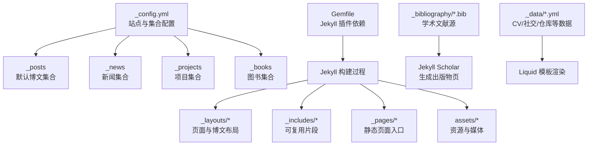
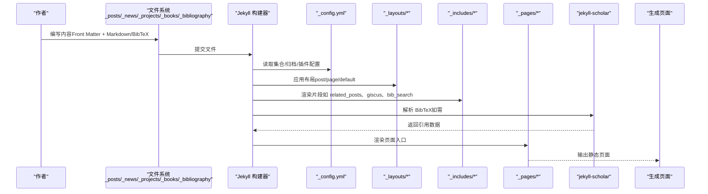
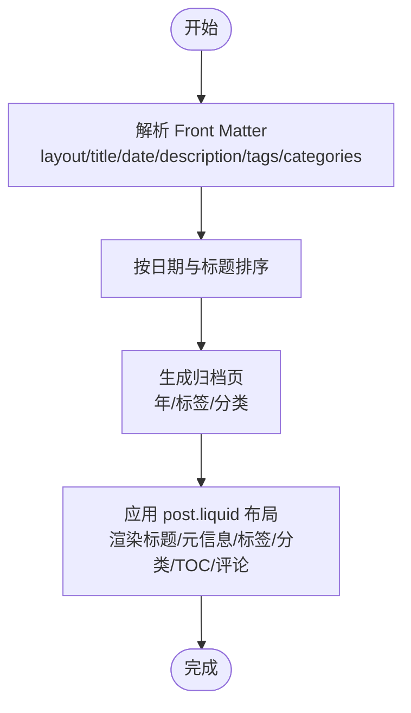
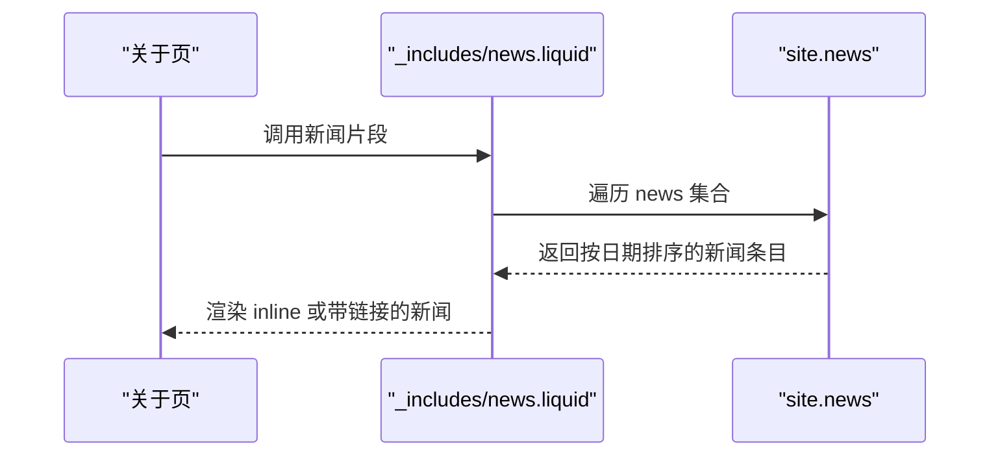
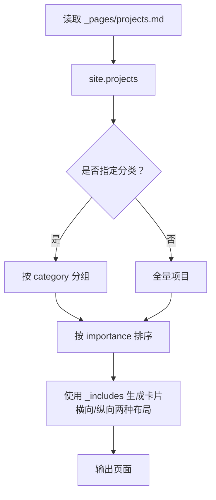
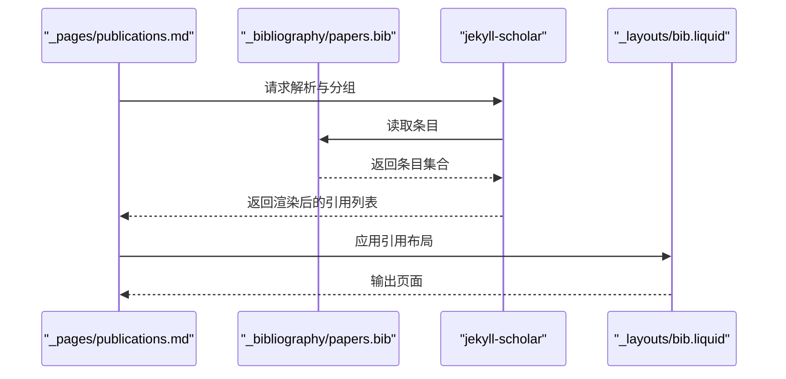
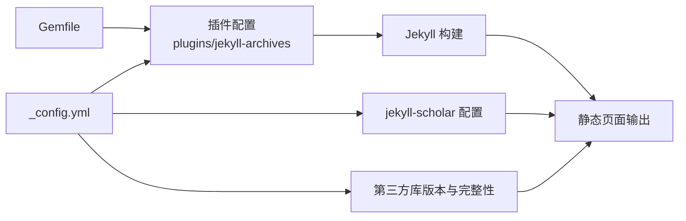

# 内容管理系统

<cite>
**本文档引用的文件**
- [_config.yml](file://_config.yml)
- [Gemfile](file://Gemfile)
- [README.md](file://README.md)
- [INSTALL.md](file://INSTALL.md)
- [CUSTOMIZE.md](file://CUSTOMIZE.md)
- [_posts/2015-03-15-formatting-and-links.md](file://_posts/2015-03-15-formatting-and-links.md)
- [_news/announcement_1.md](file://_news/announcement_1.md)
- [_projects/1_project.md](file://_projects/1_project.md)
- [_books/the_godfather.md](file://_books/the_godfather.md)
- [_bibliography/papers.bib](file://_bibliography/papers.bib)
- [_layouts/post.liquid](file://_layouts/post.liquid)
- [_layouts/page.liquid](file://_layouts/page.liquid)
- [_pages/projects.md](file://_pages/projects.md)
- [_pages/publications.md](file://_pages/publications.md)
- [_data/cv.yml](file://_data/cv.yml)
</cite>

## 目录
1. [简介](#简介)
2. [项目结构](#项目结构)
3. [核心组件](#核心组件)
4. [架构总览](#架构总览)
5. [详细组件分析](#详细组件分析)
6. [依赖关系分析](#依赖关系分析)
7. [性能考虑](#性能考虑)
8. [故障排查指南](#故障排查指南)
9. [结论](#结论)
10. [附录](#附录)

## 简介
本文件面向使用 al-folio 的内容管理者，系统性讲解 Jekyll 集合（Collections）与内容管理实践，覆盖博客文章、项目展示、新闻公告、学术出版物等模块的创建、管理与最佳实践。文档基于仓库中的真实配置与示例文件，提供可操作的步骤、可视化图示与排错建议，帮助快速上手并稳定维护个人或学术主页。

## 项目结构
al-folio 使用 Jekyll 的集合与默认集合（如 posts）组织内容，结合 Liquid 模板与插件生态实现页面渲染与功能扩展。核心目录与职责如下：
- 根配置：[_config.yml](_config.yml) 定义站点元信息、集合、归档、学术引用、第三方库等
- 内容集合：
  - 博文：_posts（默认集合）
  - 新闻：_news（自定义集合）
  - 项目：_projects（自定义集合）
  - 图书：_books（自定义集合）
- 页面与布局：_pages、_layouts
- 数据与资源：_data、assets
- 插件与构建：Gemfile、GitHub Actions 工作流

图表来源
- [_config.yml](file://_config.yml)
- [Gemfile](file://Gemfile)

章节来源
- [_config.yml](file://_config.yml)
- [CUSTOMIZE.md](file://CUSTOMIZE.md)

## 核心组件
- 集合（Collections）
  - 默认集合：posts（博文），由 Jekyll 自动生成，按文件名前缀 YYYY-MM-DD-title.md 规范化排序与归档
  - 自定义集合：news、projects、books，通过 _config.yml 声明并配置输出与默认布局
- 布局（Layouts）
  - post.liquid：用于博文与新闻条目，支持标签、分类、TOC、评论等
  - page.liquid：用于项目、出版物等页面，支持引用显示与评论
- 页面（Pages）
  - 项目页：_pages/projects.md，按类别与重要度排序展示项目卡片
  - 出版物页：_pages/publications.md，集成搜索与引用列表
- 数据（Data）
  - _data/cv.yml：CV 结构化数据，供 CV 页面渲染
- 学术引用（Bibliography）
  - _bibliography/papers.bib：BibTeX 文献源，配合 jekyll-scholar 生成出版物页与引用

章节来源
- [_config.yml](file://_config.yml)
- [_layouts/post.liquid](file://_layouts/post.liquid)
- [_layouts/page.liquid](file://_layouts/page.liquid)
- [_pages/projects.md](file://_pages/projects.md)
- [_pages/publications.md](file://_pages/publications.md)
- [_data/cv.yml](file://_data/cv.yml)

## 架构总览
下图展示了从内容到页面的端到端流程：内容文件（Markdown/BibTeX）经 Jekyll 构建，结合布局与插件生成最终页面；集合与归档规则控制 URL 与索引；学术引用通过 jekyll-scholar 处理并注入页面。

图表来源
- [_config.yml](file://_config.yml)
- [_layouts/post.liquid](file://_layouts/post.liquid)
- [_layouts/page.liquid](file://_layouts/page.liquid)
- [_pages/projects.md](file://_pages/projects.md)
- [_pages/publications.md](file://_pages/publications.md)
- [Gemfile](file://Gemfile)

## 详细组件分析

### 博客文章（Posts）与 Front Matter
- 文件命名规范：YYYY-MM-DD-title.md，确保 Jekyll 正确识别日期与链接
- Front Matter 关键字段
  - layout：post
  - title：文章标题
  - date：发布时间（影响排序与归档）
  - description：摘要（用于列表与 SEO）
  - tags：标签（用于标签归档与筛选）
  - categories：分类（用于分类归档）
  - related_posts：是否显示相关文章（默认启用，可在配置中关闭）
  - giscus_comments/disqus_shortname：评论开关（按配置启用）
- 归档与链接
  - 按年/标签/分类生成归档页（见 jekyll-archives 配置）

图表来源
- [_posts/2015-03-15-formatting-and-links.md](file://_posts/2015-03-15-formatting-and-links.md)
- [_layouts/post.liquid](file://_layouts/post.liquid)
- [_config.yml](file://_config.yml)

章节来源
- [_posts/2015-03-15-formatting-and-links.md](file://_posts/2015-03-15-formatting-and-links.md)
- [_layouts/post.liquid](file://_layouts/post.liquid)
- [_config.yml](file://_config.yml)

### 新闻公告（News）集合
- 集合配置：在 _config.yml 中声明 news 集合并设置默认布局为 post
- Front Matter 关键字段
  - layout：post
  - date：发布时间
  - inline：是否内联显示（在关于页等位置）
  - related_posts：是否显示相关文章（可禁用）
- 展示位置：关于页等位置可通过 include 片段调用新闻集合

图表来源
- [_news/announcement_1.md](file://_news/announcement_1.md)
- [_config.yml](file://_config.yml)

章节来源
- [_news/announcement_1.md](file://_news/announcement_1.md)
- [_config.yml](file://_config.yml)

### 项目展示（Projects）集合
- 集合配置：在 _config.yml 中声明 projects 并开启输出
- Front Matter 关键字段
  - layout：page
  - title/description：标题与描述
  - img：背景图路径
  - importance：重要度（用于排序）
  - category：分类（如 work/fun），支持多分类
  - related_publications：是否显示引用
- 页面渲染：_pages/projects.md 读取 site.projects，按分类与 importance 排序，使用 _includes 生成卡片（支持横向/纵向布局）

图表来源
- [_pages/projects.md](file://_pages/projects.md)
- [_projects/1_project.md](file://_projects/1_project.md)
- [_config.yml](file://_config.yml)

章节来源
- [_pages/projects.md](file://_pages/projects.md)
- [_projects/1_project.md](file://_projects/1_project.md)
- [_config.yml](file://_config.yml)

### 图书书架（Books）集合
- 集合配置：books 在 _config.yml 中声明，支持归档与标签/分类
- Front Matter 关键字段
  - layout：book-review
  - title/author/cover/isbn/olid：封面与元信息
  - categories/tags：便于检索
  - buy_link/started/finished/released/stars/goodreads_review/status：阅读记录与评分
- 页面入口：通过子菜单“Bookshelf”访问书籍列表与详情

章节来源
- [_books/the_godfather.md](file://_books/the_godfather.md)
- [_config.yml](file://_config.yml)

### 学术出版物（Publications）管理
- 数据源：_bibliography/papers.bib
- 关键字段（常用）
  - abbr：会议简称（用于缩略标签）
  - title/author/booktitle/year：标准元信息
  - abstract/arxiv/doi/html/pdf/poster/slides/supp/website：外部资源链接
  - selected：精选条目标记
- 渲染与搜索
  - _pages/publications.md 调用 _includes/bib_search.liquid 实现搜索
  - 使用  渲染引用列表
  - 可通过 scholar 配置控制样式、分组与过滤

图表来源
- [_pages/publications.md](file://_pages/publications.md)
- [_bibliography/papers.bib](file://_bibliography/papers.bib)
- [_config.yml](file://_config.yml)

章节来源
- [_pages/publications.md](file://_pages/publications.md)
- [_bibliography/papers.bib](file://_bibliography/papers.bib)
- [_config.yml](file://_config.yml)

### CV 页面与数据
- 数据来源：assets/json/resume.json（JSON Resume 标准）或 _data/cv.yml（YAML）
- 渲染：CV 页面模板读取数据并按类型（time_table/list/nested_list）渲染
- 切换：若未配置 JSON 数据，则回退到 _data/cv.yml

章节来源
- [_data/cv.yml](file://_data/cv.yml)
- [_config.yml](file://_config.yml)

## 依赖关系分析
- 构建与插件
  - Gemfile 声明了 jekyll-scholar、jekyll-archives-v2、jekyll-paginate-v2 等核心插件
  - _config.yml 的 plugins 与 jekyll-archives 配置共同决定归档与分页行为
- 第三方库与版本
  - _config.yml 的 third_party_libraries 字段集中管理前端库版本与完整性校验
- GitHub Actions 自动部署
  - INSTALL.md 描述了自动部署流程，确保变更即时生效

图表来源
- [_config.yml](file://_config.yml)
- [Gemfile](file://Gemfile)
- [INSTALL.md](file://INSTALL.md)

章节来源
- [_config.yml](file://_config.yml)
- [Gemfile](file://Gemfile)
- [INSTALL.md](file://INSTALL.md)

## 性能考虑
- 图像优化
  - _config.yml 启用 jekyll-imagemagick 与懒加载，建议为项目与博文配图使用响应式 WebP
- 代码压缩与最小化
  - jekyll-minifier 与 terser 配置减少体积
- 归档与分页
  - 合理使用 jekyll-archives 与 jekyll-paginate-v2，避免单页过大
- 评论与外部服务
  - giscus 作为推荐评论方案，注意网络请求与加载时机

章节来源
- [_config.yml](file://_config.yml)

## 故障排查指南
- 发布后页面未更新
  - 确认已启用 GitHub Actions 自动部署（INSTALL.md），等待 gh-pages 分支构建完成
- 归档页 404 或链接异常
  - 检查 jekyll-archives 的 enabled 与 permalinks 设置（_config.yml）
- 出版物页无内容
  - 确认 _bibliography/papers.bib 存在且字段完整；检查 jekyll-scholar 的 source 与 bibliography 配置
- 项目/新闻不显示
  - 检查 _config.yml 中集合声明与 output 设置；确认 Front Matter 的 layout 与分类字段正确
- 本地预览问题
  - 使用 Docker Compose 快速启动（INSTALL.md），查看容器日志定位依赖缺失

章节来源
- [INSTALL.md](file://INSTALL.md)
- [_config.yml](file://_config.yml)
- [_pages/publications.md](file://_pages/publications.md)
- [_bibliography/papers.bib](file://_bibliography/papers.bib)

## 结论
al-folio 以 Jekyll 集合为核心，结合布局、数据与插件，提供了开箱即用的内容管理能力。通过规范的 Front Matter、合理的集合与归档配置、以及清晰的页面入口，用户可以高效地维护博客、项目、新闻与学术出版物等多类内容。建议在团队协作中统一内容格式与命名规范，利用归档与搜索功能提升可发现性，并定期审查第三方库版本以保证安全与性能。

## 附录

### 内容类型与最佳实践清单
- 博文（_posts）
  - 统一使用 YYYY-MM-DD-title.md 命名
  - Front Matter 包含 title/date/description/tags/categories
  - 合理使用 related_posts 控制相关文章数量
- 新闻（_news）
  - inline: true 适合简短公告；需要独立页时移除 inline
  - 使用明确的 date 与简洁文案
- 项目（_projects）
  - 为每个项目设置 importance 与 category，便于排序与分组
  - 使用 img 提升视觉吸引力
- 图书（_books）
  - 填写 olid/isbn 以自动抓取封面
  - 记录 started/finished/status/stars 便于追踪
- 出版物（_bibliography）
  - 使用 abbr/selected/arxiv/doi 等字段完善元信息
  - 将 PDF/Poster/Slides 等资源置于 assets/pdf 并在条目中引用

章节来源
- [_posts/2015-03-15-formatting-and-links.md](file://_posts/2015-03-15-formatting-and-links.md)
- [_news/announcement_1.md](file://_news/announcement_1.md)
- [_projects/1_project.md](file://_projects/1_project.md)
- [_books/the_godfather.md](file://_books/the_godfather.md)
- [_bibliography/papers.bib](file://_bibliography/papers.bib)