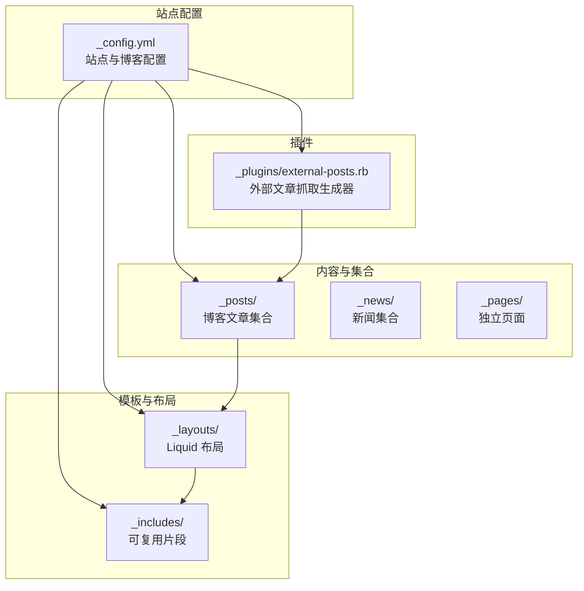
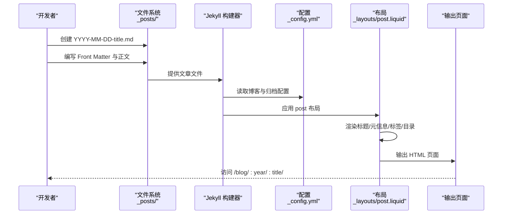
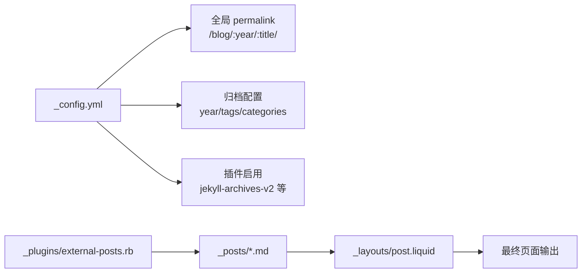

# 博客文章创建

<cite>
**本文档引用的文件**
- [_config.yml](file://_config.yml)
- [CUSTOMIZE.md](file://CUSTOMIZE.md)
- [_posts/2015-03-15-formatting-and-links.md](file://_posts/2015-03-15-formatting-and-links.md)
- [_posts/2023-03-20-table-of-contents.md](file://_posts/2023-03-20-table-of-contents.md)
- [_posts/2024-01-26-chartjs.md](file://_posts/2024-01-26-chartjs.md)
- [_posts/2023-07-04-jupyter-notebook.md](file://_posts/2023-07-04-jupyter-notebook.md)
- [_posts/2023-04-24-videos.md](file://_posts/2023-04-24-videos.md)
- [_posts/2023-04-25-audios.md](file://_posts/2023-04-25-audios.md)
- [_posts/2024-01-27-code-diff.md](file://_posts/2024-01-27-code-diff.md)
- [_layouts/post.liquid](file://_layouts/post.liquid)
- [_plugins/external-posts.rb](file://_plugins/external-posts.rb)
</cite>

## 目录
1. [简介](#简介)
2. [项目结构](#项目结构)
3. [核心组件](#核心组件)
4. [架构总览](#架构总览)
5. [详细组件分析](#详细组件分析)
6. [依赖关系分析](#依赖关系分析)
7. [性能考虑](#性能考虑)
8. [故障排除指南](#故障排除指南)
9. [结论](#结论)
10. [附录](#附录)

## 简介
本文件面向使用 al-folio 主题的用户，系统性讲解如何创建与发布博客文章。内容涵盖：
- 文章文件命名规范（YYYY-MM-DD-title.MARKDOWN）
- Front Matter 配置字段详解（title、author、date、layout、permalink 等）
- Markdown 语法支持与常见元素
- 文章模板与示例（含图表、视频、音频、Jupyter Notebook、代码差异等）
- 发布状态控制与草稿管理
- 实际文件示例与配置模板

## 项目结构
博客文章位于 Jekyll 默认集合目录下，采用统一的命名约定与 Front Matter 规范；主题通过 Liquid 模板渲染页面，并结合插件实现外部源文章抓取与归档功能。

图示来源
- [_config.yml](file://_config.yml)
- [_posts/2015-03-15-formatting-and-links.md](file://_posts/2015-03-15-formatting-and-links.md)
- [_layouts/post.liquid](file://_layouts/post.liquid)
- [_plugins/external-posts.rb](file://_plugins/external-posts.rb)

章节来源
- [_config.yml](file://_config.yml)
- [_posts/2015-03-15-formatting-and-links.md](file://_posts/2015-03-15-formatting-and-links.md)
- [_layouts/post.liquid](file://_layouts/post.liquid)
- [_plugins/external-posts.rb](file://_plugins/external-posts.rb)

## 核心组件
- 文件命名规范：YYYY-MM-DD-title.MARKDOWN
  - 作用：Jekyll 使用文件名中的日期进行排序与归档；title 用于生成 URL 片段与标题显示
- Front Matter 字段
  - 必填：layout（如 post）、title、date
  - 常用：description、tags、categories、permalink（覆盖全局）
  - 可选：author、last_updated、meta、giscus_comments、related_posts、toc、chart、code_diff 等
- Markdown 支持
  - 标准语法：标题、列表、链接、图片、块引用、分隔线等
  - 扩展：表格、任务清单、脚注、数学公式、代码高亮、Mermaid 图表、视频/音频嵌入、Jupyter Notebook 内容嵌入等
- 发布与归档
  - 全局 permalink：/blog/:year/:title/
  - 归档按年/标签/分类生成
- 外部文章抓取
  - 通过插件从 RSS 或指定 URL 抓取内容，自动注入到 posts 集合

章节来源
- [_config.yml](file://_config.yml)
- [_posts/2015-03-15-formatting-and-links.md](file://_posts/2015-03-15-formatting-and-links.md)
- [_posts/2023-03-20-table-of-contents.md](file://_posts/2023-03-20-table-of-contents.md)
- [_posts/2024-01-26-chartjs.md](file://_posts/2024-01-26-chartjs.md)
- [_posts/2023-07-04-jupyter-notebook.md](file://_posts/2023-07-04-jupyter-notebook.md)
- [_posts/2023-04-24-videos.md](file://_posts/2023-04-24-videos.md)
- [_posts/2023-04-25-audios.md](file://_posts/2023-04-25-audios.md)
- [_posts/2024-01-27-code-diff.md](file://_posts/2024-01-27-code-diff.md)
- [_layouts/post.liquid](file://_layouts/post.liquid)
- [_plugins/external-posts.rb](file://_plugins/external-posts.rb)

## 架构总览
下面以“创建文章”为主线，展示从文件命名、Front Matter 到页面渲染的关键流程。

图示来源
- [_config.yml](file://_config.yml)
- [_layouts/post.liquid](file://_layouts/post.liquid)
- [_posts/2015-03-15-formatting-and-links.md](file://_posts/2015-03-15-formatting-and-links.md)

## 详细组件分析

### 文件命名规范与日期/标题作用
- 命名格式：YYYY-MM-DD-title.MARKDOWN
- 日期解析：Jekyll 会从文件名提取日期，作为文章的发布日期参与排序与归档
- 标题作用：用于生成 URL 片段（结合全局 permalink）、页面标题、社交预览等
- 示例参考：多篇示例文章均遵循该命名规范

章节来源
- [_posts/2015-03-15-formatting-and-links.md](file://_posts/2015-03-15-formatting-and-links.md)
- [_posts/2023-03-20-table-of-contents.md](file://_posts/2023-03-20-table-of-contents.md)
- [_posts/2024-01-26-chartjs.md](file://_posts/2024-01-26-chartjs.md)
- [_posts/2023-07-04-jupyter-notebook.md](file://_posts/2023-07-04-jupyter-notebook.md)
- [_posts/2023-04-24-videos.md](file://_posts/2023-04-24-videos.md)
- [_posts/2023-04-25-audios.md](file://_posts/2023-04-25-audios.md)
- [_posts/2024-01-27-code-diff.md](file://_posts/2024-01-27-code-diff.md)

### Front Matter 配置字段详解
- 必填字段
  - layout：post（或其他自定义布局）
  - title：文章标题
  - date：发布时间（支持时区偏移）
- 常用字段
  - description：摘要，用于 SEO 与社交预览
  - tags：标签数组，影响归档与相关推荐
  - categories：分类数组，影响归档与导航
  - permalink：覆盖全局 permalink，定制 URL 结构
- 可选增强字段
  - author：作者名
  - last_updated：最后更新时间
  - meta：额外元信息
  - giscus_comments：启用评论（基于 giscus）
  - related_posts：是否显示相关文章
  - toc：开启文章开头目录
  - chart.chartjs：启用 chart.js 渲染
  - code_diff：启用代码差异渲染
- 示例参考：多篇文章在 Front Matter 中展示了上述字段的实际使用

章节来源
- [_posts/2015-03-15-formatting-and-links.md](file://_posts/2015-03-15-formatting-and-links.md)
- [_posts/2023-03-20-table-of-contents.md](file://_posts/2023-03-20-table-of-contents.md)
- [_posts/2024-01-26-chartjs.md](file://_posts/2024-01-26-chartjs.md)
- [_posts/2023-07-04-jupyter-notebook.md](file://_posts/2023-07-04-jupyter-notebook.md)
- [_posts/2024-01-27-code-diff.md](file://_posts/2024-01-27-code-diff.md)

### Markdown 语法支持与元素
- 标题层级：支持 H1-H6
- 列表：有序、无序、任务清单
- 链接与图片：内链、外链、本地资源
- 引用与分隔线：块引用、水平分割线
- 表格：支持复杂表格
- 数学公式：MathJax 支持
- 代码高亮：Rouge 高亮器
- 扩展能力：Mermaid 图表、视频/音频嵌入、Jupyter Notebook 内容嵌入、代码差异（diff/diff2html）

章节来源
- [_posts/2015-03-15-formatting-and-links.md](file://_posts/2015-03-15-formatting-and-links.md)
- [_posts/2023-03-20-table-of-contents.md](file://_posts/2023-03-20-table-of-contents.md)
- [_posts/2024-01-26-chartjs.md](file://_posts/2024-01-26-chartjs.md)
- [_posts/2023-07-04-jupyter-notebook.md](file://_posts/2023-07-04-jupyter-notebook.md)
- [_posts/2023-04-24-videos.md](file://_posts/2023-04-24-videos.md)
- [_posts/2023-04-25-audios.md](file://_posts/2023-04-25-audios.md)
- [_posts/2024-01-27-code-diff.md](file://_posts/2024-01-27-code-diff.md)

### 文章模板与示例
- 基础模板：包含 layout、title、date、description、tags、categories 等
- 目录模板：添加 toc.beginning 开启文章开头目录
- 图表模板：添加 chart.chartjs 启用 chart.js 渲染
- Notebook 模板：使用 jekyll-jupyter-notebook 插件嵌入 Jupyter Notebook
- 媒体模板：使用 include video.liquid/include audio.liquid 嵌入本地或外链媒体
- 代码差异模板：使用 diff 或 diff2html 语言标识渲染代码差异

章节来源
- [_posts/2015-03-15-formatting-and-links.md](file://_posts/2015-03-15-formatting-and-links.md)
- [_posts/2023-03-20-table-of-contents.md](file://_posts/2023-03-20-table-of-contents.md)
- [_posts/2024-01-26-chartjs.md](file://_posts/2024-01-26-chartjs.md)
- [_posts/2023-07-04-jupyter-notebook.md](file://_posts/2023-07-04-jupyter-notebook.md)
- [_posts/2023-04-24-videos.md](file://_posts/2023-04-24-videos.md)
- [_posts/2023-04-25-audios.md](file://_posts/2023-04-25-audios.md)
- [_posts/2024-01-27-code-diff.md](file://_posts/2024-01-27-code-diff.md)

### 发布状态控制与草稿管理
- 草稿目录：建议使用 _drafts 存放未完成草稿，避免被构建
- 已发布文章：放置于 _posts 目录，遵循 YYYY-MM-DD-title.md 命名
- 定时发布：可通过 GitHub Actions 的调度工作流在指定日期自动移动至 _posts 并发布
- 外部文章：通过 external-posts.rb 插件从 RSS 或 URL 抓取并注入 posts 集合

章节来源
- [CUSTOMIZE.md](file://CUSTOMIZE.md)
- [_plugins/external-posts.rb](file://_plugins/external-posts.rb)

### 页面渲染与布局
- post 布局负责渲染文章标题、元信息（日期、作者、最后更新）、标签/分类链接、目录、内容主体、相关文章、评论区等
- 布局中根据 URL 前缀决定标签/分类链接是否带 /blog/ 前缀
- toc.beginning 控制是否在文章开头插入目录

章节来源
- [_layouts/post.liquid](file://_layouts/post.liquid)

## 依赖关系分析
- 配置依赖：_config.yml 决定全局 permalink、归档策略、评论系统、插件启用等
- 布局依赖：post.liquid 依赖 tags/categories/date 等变量进行渲染
- 插件依赖：external-posts.rb 依赖 feedjira、HTTParty、Nokogiri 进行抓取与解析
- 内容依赖：_posts 下的 Markdown 文件遵循命名与 Front Matter 规范

图示来源
- [_config.yml](file://_config.yml)
- [_layouts/post.liquid](file://_layouts/post.liquid)
- [_plugins/external-posts.rb](file://_plugins/external-posts.rb)

章节来源
- [_config.yml](file://_config.yml)
- [_layouts/post.liquid](file://_layouts/post.liquid)
- [_plugins/external-posts.rb](file://_plugins/external-posts.rb)

## 性能考虑
- 图片懒加载：启用 lazy loading，提升首屏加载速度
- 响应式 WebP 图像：通过 imagemagick 生成多尺寸 WebP，减少带宽占用
- 代码压缩与最小化：启用 jekyll-minifier 与 terser，压缩 JS/CSS
- 分页与归档：合理设置分页与归档，避免单页过大
- 外部资源：尽量使用 CDN 与缓存友好的静态托管

[本节为通用指导，不直接分析具体文件]

## 故障排除指南
- 文章未出现在首页或归档
  - 检查文件名是否符合 YYYY-MM-DD-title.md
  - 确认 Front Matter 中 layout 为 post，date 格式正确
  - 查看 _config.yml 中 jekyll-archives 是否启用 year/tags/categories
- 目录未显示
  - 在 Front Matter 添加 toc.beginning: true
  - 确认 post 布局中 toc 渲染逻辑生效
- 评论未显示
  - 在 Front Matter 设置 giscus_comments: true
  - 确认 _config.yml 中 giscus 配置项完整
- 外部文章未抓取
  - 检查 external_sources 配置与网络连通性
  - 确认 RSS URL 或 URL 列表有效
- Jupyter Notebook 无法嵌入
  - 确保 jekyll-jupyter-notebook 插件已启用
  - 使用 {::nomarkdown} 包裹插件调用，避免 Kramdown 解析冲突

章节来源
- [_config.yml](file://_config.yml)
- [_posts/2023-03-20-table-of-contents.md](file://_posts/2023-03-20-table-of-contents.md)
- [_posts/2023-07-04-jupyter-notebook.md](file://_posts/2023-07-04-jupyter-notebook.md)
- [_plugins/external-posts.rb](file://_plugins/external-posts.rb)

## 结论
通过统一的文件命名规范、标准化的 Front Matter 字段与丰富的 Markdown 扩展能力，al-folio 主题提供了高效、可维护的博客文章创作体验。配合布局渲染、归档与评论系统，以及外部文章抓取与定时发布机制，能够满足从个人博客到学术主页的多样化需求。

[本节为总结性内容，不直接分析具体文件]

## 附录

### 文章创建步骤清单
- 准备文件：在 _posts 目录创建 YYYY-MM-DD-title.md
- 编写 Front Matter：至少包含 layout、title、date；按需添加 description、tags、categories、permalink 等
- 编写正文：使用标准与扩展 Markdown 语法
- 预览与验证：本地构建检查 URL、目录、媒体、评论等
- 发布：推送至仓库或使用定时发布工作流

章节来源
- [CUSTOMIZE.md](file://CUSTOMIZE.md)
- [_posts/2015-03-15-formatting-and-links.md](file://_posts/2015-03-15-formatting-and-links.md)

### 关键配置模板片段
- 全局 permalink 与归档
  - 参考路径：[_config.yml](file://_config.yml)
- 评论系统（giscus）启用
  - 参考路径：[_config.yml](file://_config.yml)
- 相关文章开关
  - 参考路径：[_config.yml](file://_config.yml)
- 外部文章抓取配置
  - 参考路径：[_plugins/external-posts.rb](file://_plugins/external-posts.rb)

章节来源
- [_config.yml](file://_config.yml)
- [_plugins/external-posts.rb](file://_plugins/external-posts.rb)