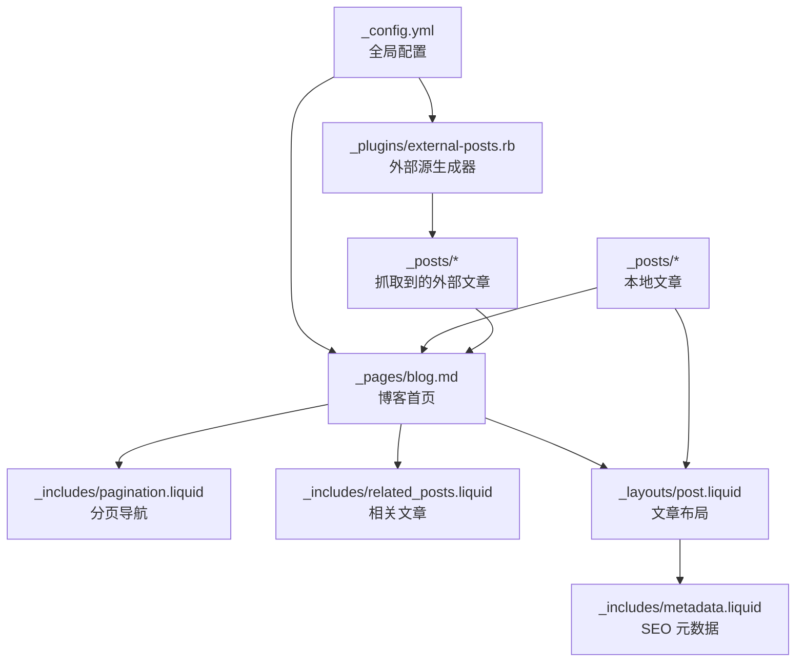
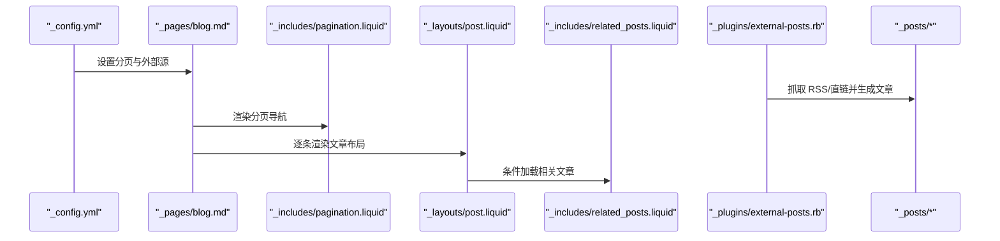
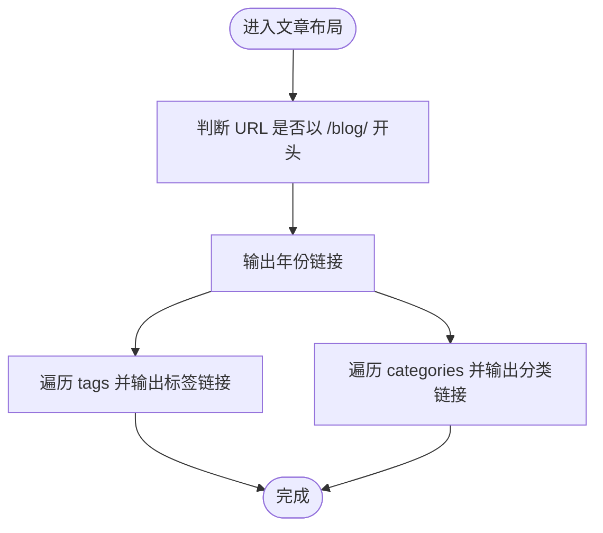
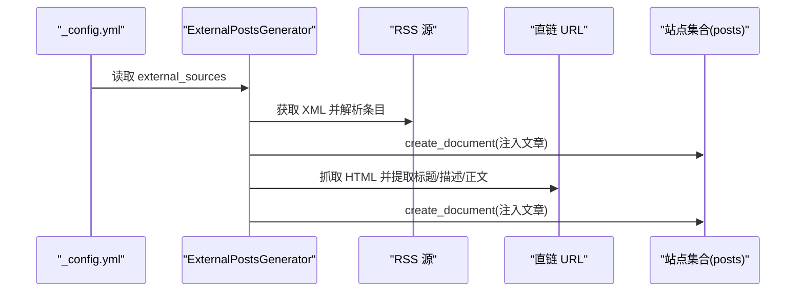
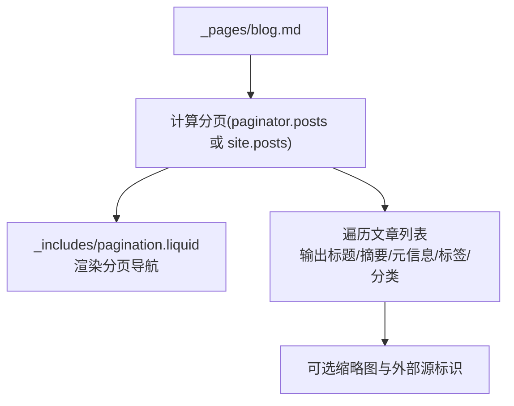
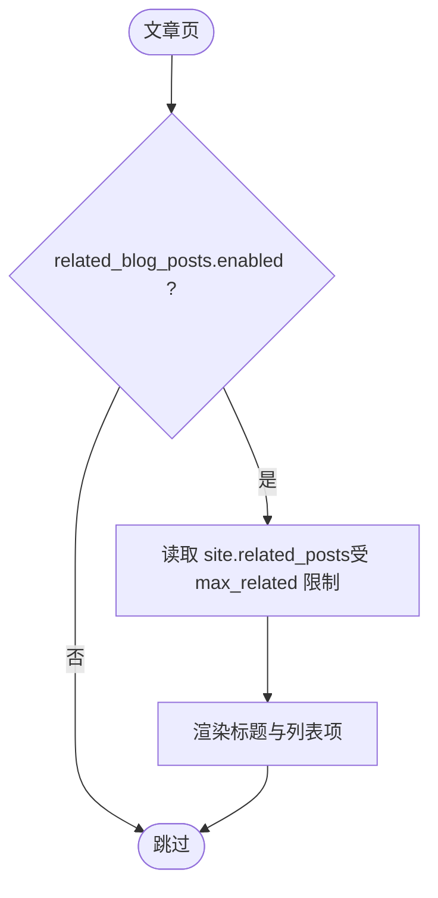
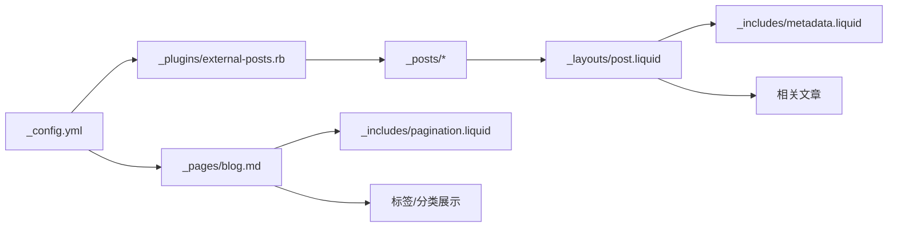

# 博客文章管理

<cite>
**本文引用的文件**
- [_config.yml](file://_config.yml)
- [README.md](file://README.md)
- [_pages/blog.md](file://_pages/blog.md)
- [_layouts/post.liquid](file://_layouts/post.liquid)
- [_includes/pagination.liquid](file://_includes/pagination.liquid)
- [_includes/related_posts.liquid](file://_includes/related_posts.liquid)
- [_plugins/external-posts.rb](file://_plugins/external-posts.rb)
- [_posts/2015-03-15-formatting-and-links.md](file://_posts/2015-03-15-formatting-and-links.md)
- [_posts/2015-05-15-images.md](file://_posts/2015-05-15-images.md)
- [_posts/2015-07-15-code.md](file://_posts/2015-07-15-code.md)
- [_posts/2015-10-20-disqus-comments.md](file://_posts/2015-10-20-disqus-comments.md)
- [_includes/latest_posts.liquid](file://_includes/latest_posts.liquid)
- [_includes/metadata.liquid](file://_includes/metadata.liquid)
</cite>

## 目录
1. [简介](#简介)
2. [项目结构](#项目结构)
3. [核心组件](#核心组件)
4. [架构总览](#架构总览)
5. [详细组件分析](#详细组件分析)
6. [依赖关系分析](#依赖关系分析)
7. [性能考量](#性能考量)
8. [故障排查指南](#故障排查指南)
9. [结论](#结论)
10. [附录](#附录)

## 简介
本文件面向“博客文章管理”主题，基于仓库中的 Jekyll 配置与模板，系统化说明以下方面：
- 文章文件命名规范（YYYY-MM-DD-title.MARKDOWN）
- Front Matter 字段配置与元数据管理
- 标签（tags）与分类（categories）的使用与展示
- 外部源集成（RSS 与直链抓取）配置与使用
- 分页、相关文章推荐与 RSS 订阅
- 内容创作最佳实践（组织、SEO、社交分享）

## 项目结构
该站点采用 Jekyll 标准目录结构，博客文章统一存放于 _posts 目录，页面入口为 _pages/blog.md；布局与包含模板位于 _layouts 与 _includes；全局配置在 _config.yml 中；评论与外部源通过插件实现。

图表来源
- [_config.yml](file://_config.yml)
- [_pages/blog.md](file://_pages/blog.md)
- [_includes/pagination.liquid](file://_includes/pagination.liquid)
- [_includes/related_posts.liquid](file://_includes/related_posts.liquid)
- [_layouts/post.liquid](file://_layouts/post.liquid)
- [_includes/metadata.liquid](file://_includes/metadata.liquid)
- [_plugins/external-posts.rb](file://_plugins/external-posts.rb)

章节来源
- [_config.yml](file://_config.yml)
- [_pages/blog.md](file://_pages/blog.md)

## 核心组件
- 全局配置：控制博客名称、描述、分页、相关文章、外部源、RSS、评论等。
- 布局与包含：post.liquid 负责文章展示与标签/分类链接；pagination.liquid 提供分页；related_posts.liquid 展示相关文章。
- 外部源插件：external-posts.rb 支持 RSS 抓取与直链抓取，注入到 posts 集合。
- 文章集合：_posts 下的 Markdown 文件即文章条目，遵循 YYYY-MM-DD-title.MARKDOWN 命名。
- 页面入口：_pages/blog.md 控制博客首页列表、分页参数与标签/分类展示。

章节来源
- [_config.yml](file://_config.yml)
- [_layouts/post.liquid](file://_layouts/post.liquid)
- [_includes/pagination.liquid](file://_includes/pagination.liquid)
- [_includes/related_posts.liquid](file://_includes/related_posts.liquid)
- [_plugins/external-posts.rb](file://_plugins/external-posts.rb)
- [_pages/blog.md](file://_pages/blog.md)

## 架构总览
下图展示了从配置到页面渲染的关键流程：配置驱动分页与外部源；博客首页读取分页后的文章列表；文章布局负责标签/分类链接与相关文章；外部源通过插件注入到文章集合。

图表来源
- [_config.yml](file://_config.yml)
- [_pages/blog.md](file://_pages/blog.md)
- [_includes/pagination.liquid](file://_includes/pagination.liquid)
- [_layouts/post.liquid](file://_layouts/post.liquid)
- [_includes/related_posts.liquid](file://_includes/related_posts.liquid)
- [_plugins/external-posts.rb](file://_plugins/external-posts.rb)

## 详细组件分析

### 文章命名规范与 Front Matter
- 命名规范：YYYY-MM-DD-title.MARKDOWN（示例见 _posts 下多篇文章）。
- Front Matter 字段示例：
  - 必填：layout、title、date
  - 常用：description、tags、categories、thumbnail、featured、redirect、disqus_comments、giscus_comments、related_posts 等
- 示例参考：
  - [2015-03-15-formatting-and-links.md](file://_posts/2015-03-15-formatting-and-links.md)
  - [2015-05-15-images.md](file://_posts/2015-05-15-images.md)
  - [2015-07-15-code.md](file://_posts/2015-07-15-code.md)
  - [2015-10-20-disqus-comments.md](file://_posts/2015-10-20-disqus-comments.md)

章节来源
- [_posts/2015-03-15-formatting-and-links.md](file://_posts/2015-03-15-formatting-and-links.md)
- [_posts/2015-05-15-images.md](file://_posts/2015-05-15-images.md)
- [_posts/2015-07-15-code.md](file://_posts/2015-07-15-code.md)
- [_posts/2015-10-20-disqus-comments.md](file://_posts/2015-10-20-disqus-comments.md)

### 标签与分类系统
- 使用方式：在 Front Matter 中设置 tags 与 categories 数组。
- 展示逻辑：
  - 博客首页与文章页均会输出年份、标签与分类链接。
  - 标签/分类链接会根据当前 URL 是否为 /blog/ 添加前缀路径。
- 显示控制：通过 _config.yml 的 display_tags 与 display_categories 在首页顶部展示精选标签/分类。

图表来源
- [_layouts/post.liquid](file://_layouts/post.liquid)
- [_pages/blog.md](file://_pages/blog.md)

章节来源
- [_layouts/post.liquid](file://_layouts/post.liquid)
- [_pages/blog.md](file://_pages/blog.md)
- [_config.yml](file://_config.yml)

### 外部源集成（RSS 与直链）
- 配置位置：_config.yml 的 external_sources 段落。
- 支持两种模式：
  - RSS：通过 rss_url 指定 RSS 地址，插件解析并注入文章。
  - 直链：通过 posts 列表指定 URL 与发布日期，插件抓取标题/摘要/正文并注入。
- 插件行为：
  - 生成 slug：优先使用标题，否则回退为“源名-URL尾部”。
  - 注入字段：external_source、title、feed_content、description、date、redirect。
  - 将生成的文档加入 posts 集合，参与分页与首页渲染。

图表来源
- [_config.yml](file://_config.yml)
- [_plugins/external-posts.rb](file://_plugins/external-posts.rb)

章节来源
- [_config.yml](file://_config.yml)
- [_plugins/external-posts.rb](file://_plugins/external-posts.rb)

### 分页与博客首页
- 分页配置：_pages/blog.md 的 pagination 段落定义每页数量、排序与分页链接。
- 分页渲染：_includes/pagination.liquid 输出上一页/下一页与页码导航。
- 首页列表：_pages/blog.md 读取分页结果或全量文章，输出标题、摘要、阅读时长、标签/分类链接与缩略图（可选）。

图表来源
- [_pages/blog.md](file://_pages/blog.md)
- [_includes/pagination.liquid](file://_includes/pagination.liquid)

章节来源
- [_pages/blog.md](file://_pages/blog.md)
- [_includes/pagination.liquid](file://_includes/pagination.liquid)

### 相关文章推荐
- 启用方式：_config.yml 的 related_blog_posts.enabled。
- 推荐算法：基于 LSI（隐性语义索引）选择与当前文章共享至少若干标签的最近文章。
- 渲染：_includes/related_posts.liquid 输出标题与链接，支持外链与站内跳转。

图表来源
- [_config.yml](file://_config.yml)
- [_includes/related_posts.liquid](file://_includes/related_posts.liquid)

章节来源
- [_config.yml](file://_config.yml)
- [_includes/related_posts.liquid](file://_includes/related_posts.liquid)

### RSS 订阅与 SEO 元数据
- RSS 订阅：启用 jekyll-feed 插件后，站点自动生成 feed.xml。
- SEO 元数据：_includes/metadata.liquid 输出标准 meta、OpenGraph 与 Schema.org 结构化数据，支持站点验证与社交预览。

章节来源
- [_config.yml](file://_config.yml)
- [_includes/metadata.liquid](file://_includes/metadata.liquid)
- [README.md](file://README.md)

## 依赖关系分析
- 配置依赖：_config.yml 决定分页、相关文章、外部源、RSS、评论与插件启用。
- 页面依赖：_pages/blog.md 依赖分页与标签/分类展示；文章布局依赖标签/分类与相关文章包含。
- 插件依赖：external-posts.rb 依赖 feedjira、HTTParty、Nokogiri 解析与抓取。
- 数据依赖：_posts 与外部注入文章共同构成 posts 集合，参与分页与首页渲染。

图表来源
- [_config.yml](file://_config.yml)
- [_pages/blog.md](file://_pages/blog.md)
- [_plugins/external-posts.rb](file://_plugins/external-posts.rb)
- [_posts](file://_posts)
- [_includes/pagination.liquid](file://_includes/pagination.liquid)
- [_layouts/post.liquid](file://_layouts/post.liquid)
- [_includes/metadata.liquid](file://_includes/metadata.liquid)
- [_includes/related_posts.liquid](file://_includes/related_posts.liquid)

章节来源
- [_config.yml](file://_config.yml)
- [_pages/blog.md](file://_pages/blog.md)
- [_plugins/external-posts.rb](file://_plugins/external-posts.rb)

## 性能考量
- 图片懒加载：_config.yml 中启用懒加载，提升首屏性能。
- 响应式图片：开启 imagemagick 宽度与 WebP 输出，降低带宽占用。
- 代码压缩：启用 jekyll-minifier 与 terser，减少 JS/CSS 体积。
- 分页与裁剪：合理设置每页数量与相关文章上限，避免一次性渲染过多内容。

章节来源
- [_config.yml](file://_config.yml)

## 故障排查指南
- 外部源未生效
  - 检查 _config.yml 的 external_sources 配置是否正确，RSS 地址或直链 URL 是否可达。
  - 查看生成日志中是否输出“Fetching external posts from ...”。
  - 参考：[_plugins/external-posts.rb](file://_plugins/external-posts.rb)
- 分页不显示
  - 确认 _pages/blog.md 的 pagination.enabled 与 per_page 设置。
  - 参考：[_pages/blog.md](file://_pages/blog.md)，[_includes/pagination.liquid](file://_includes/pagination.liquid)
- 相关文章不显示
  - 检查 _config.yml 的 related_blog_posts.enabled 与 max_related。
  - 参考：[_config.yml](file://_config.yml)，[_includes/related_posts.liquid](file://_includes/related_posts.liquid)
- 标签/分类链接异常
  - 确认文章 Front Matter 的 tags/categories 是否存在且非空。
  - 参考：[_layouts/post.liquid](file://_layouts/post.liquid)，[_pages/blog.md](file://_pages/blog.md)
- RSS 订阅不可用
  - 确认已启用 jekyll-feed 插件并部署至支持静态托管的平台。
  - 参考：[_config.yml](file://_config.yml)，[README.md](file://README.md)

章节来源
- [_plugins/external-posts.rb](file://_plugins/external-posts.rb)
- [_pages/blog.md](file://_pages/blog.md)
- [_includes/pagination.liquid](file://_includes/pagination.liquid)
- [_includes/related_posts.liquid](file://_includes/related_posts.liquid)
- [_layouts/post.liquid](file://_layouts/post.liquid)
- [_config.yml](file://_config.yml)
- [README.md](file://README.md)

## 结论
本博客系统通过清晰的命名规范、完善的 Front Matter 字段、灵活的标签/分类与外部源集成，结合分页、相关文章与 RSS 订阅，构建了完整的文章管理体系。配合 SEO 元数据与性能优化策略，可在保证可维护性的同时获得良好的用户体验与可发现性。

## 附录

### 最佳实践清单
- 内容组织
  - 使用 YYYY-MM-DD-title.MARKDOWN 命名，确保时间顺序与可读性。
  - 在 Front Matter 中明确 description、tags、categories、thumbnail 等字段。
- SEO 优化
  - 在页面或站点级设置 description 与 keywords；必要时启用 serve_og_meta 与 serve_schema_org。
  - 使用 _includes/metadata.liquid 的 meta 与结构化数据输出。
- 社交分享
  - 配置 og_image 与 x_username，提升社交预览质量。
- 外部源
  - 优先使用 RSS；若为直链，确保标题/描述可被正确提取。
- 分页与推荐
  - 合理设置每页数量与相关文章上限，避免过度渲染。
- 评论与互动
  - 推荐使用 giscus；如需保留 disqus，注意其弃用状态。

章节来源
- [_config.yml](file://_config.yml)
- [_includes/metadata.liquid](file://_includes/metadata.liquid)
- [_pages/blog.md](file://_pages/blog.md)
- [_includes/related_posts.liquid](file://_includes/related_posts.liquid)
- [_layouts/post.liquid](file://_layouts/post.liquid)