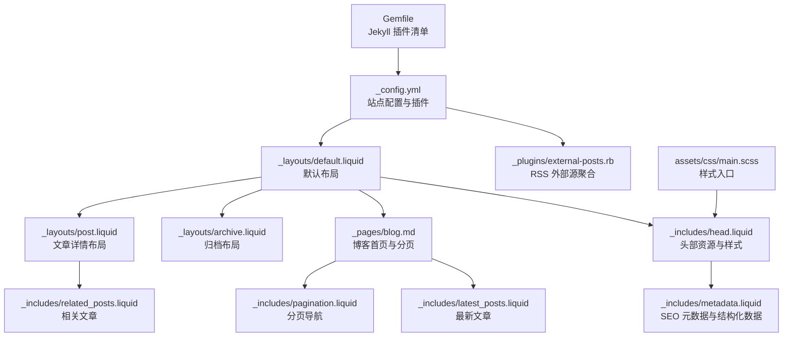
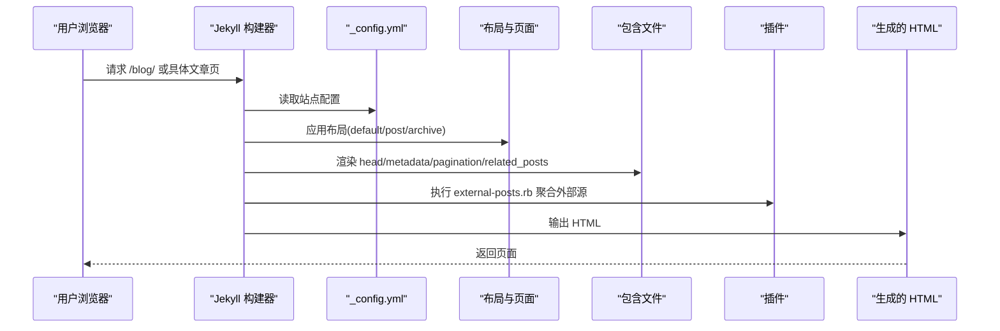
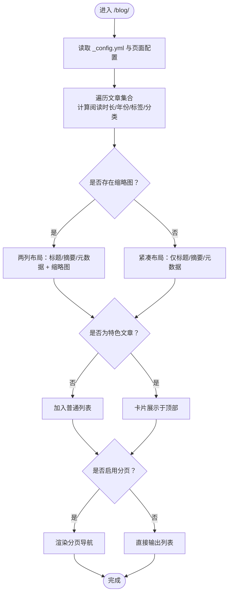
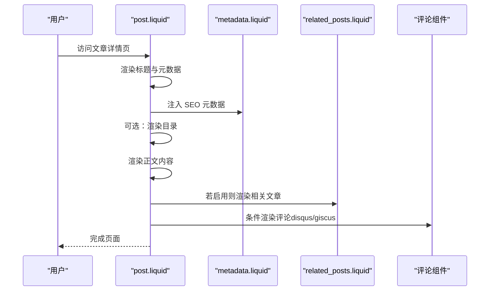
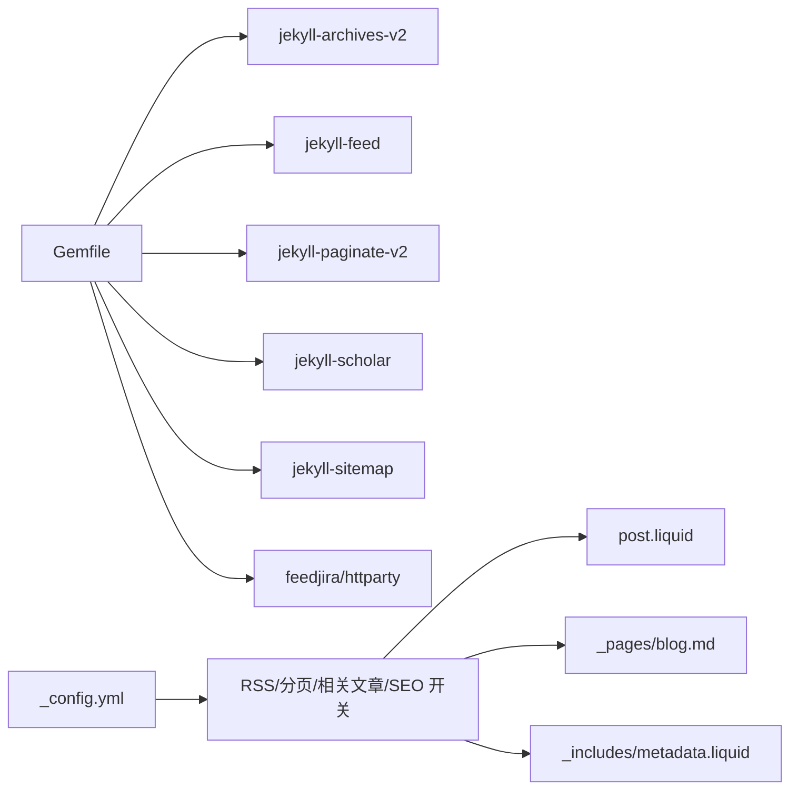

# 博客显示功能

<cite>
**本文档引用的文件**
- [_config.yml](file://_config.yml)
- [_layouts/post.liquid](file://_layouts/post.liquid)
- [_layouts/archive.liquid](file://_layouts/archive.liquid)
- [_layouts/default.liquid](file://_layouts/default.liquid)
- [_pages/blog.md](file://_pages/blog.md)
- [_includes/pagination.liquid](file://_includes/pagination.liquid)
- [_includes/related_posts.liquid](file://_includes/related_posts.liquid)
- [_includes/latest_posts.liquid](file://_includes/latest_posts.liquid)
- [_includes/head.liquid](file://_includes/head.liquid)
- [_includes/metadata.liquid](file://_includes/metadata.liquid)
- [_plugins/external-posts.rb](file://_plugins/external-posts.rb)
- [Gemfile](file://Gemfile)
- [assets/css/main.scss](file://assets/css/main.scss)
</cite>

## 目录
1. [简介](#简介)
2. [项目结构](#项目结构)
3. [核心组件](#核心组件)
4. [架构总览](#架构总览)
5. [详细组件分析](#详细组件分析)
6. [依赖关系分析](#依赖关系分析)
7. [性能考虑](#性能考虑)
8. [故障排除指南](#故障排除指南)
9. [结论](#结论)
10. [附录](#附录)

## 简介
本文件系统性阐述该 Jekyll 主题博客的显示功能与配置，覆盖以下方面：
- 文章列表页与详情页的布局与样式定制（含头图、摘要、完整内容切换）
- 文章元数据展示（发布时间、作者、阅读时长、字数统计等）
- 相关文章推荐机制与实现
- 分页功能配置（每页数量、导航样式）
- RSS 订阅启用与配置
- SEO 最佳实践（meta 标签、OpenGraph、Schema.org 结构化数据）
- 实际显示效果示例与配置模板

## 项目结构
该博客采用 Jekyll 模板与 Liquid 模板引擎，通过配置文件控制站点行为，通过布局与包含文件组织页面结构与样式。

**图表来源**
- [_config.yml](file://_config.yml)
- [_layouts/default.liquid](file://_layouts/default.liquid)
- [_layouts/post.liquid](file://_layouts/post.liquid)
- [_layouts/archive.liquid](file://_layouts/archive.liquid)
- [_pages/blog.md](file://_pages/blog.md)
- [_includes/pagination.liquid](file://_includes/pagination.liquid)
- [_includes/related_posts.liquid](file://_includes/related_posts.liquid)
- [_includes/latest_posts.liquid](file://_includes/latest_posts.liquid)
- [_includes/head.liquid](file://_includes/head.liquid)
- [_includes/metadata.liquid](file://_includes/metadata.liquid)
- [_plugins/external-posts.rb](file://_plugins/external-posts.rb)
- [Gemfile](file://Gemfile)
- [assets/css/main.scss](file://assets/css/main.scss)

**章节来源**
- [_config.yml](file://_config.yml)
- [_layouts/default.liquid](file://_layouts/default.liquid)
- [_pages/blog.md](file://_pages/blog.md)

## 核心组件
- 布局层：default、post、archive 三类布局分别负责通用页面骨架、文章详情与归档页面。
- 包含层：head 负责引入样式与第三方库；metadata 负责生成 SEO 元数据与结构化数据；pagination 提供分页导航；related_posts 与 latest_posts 提供相关内容与最新文章。
- 页面层：blog.md 作为博客首页，承载列表、分页与标签/分类筛选入口。
- 配置层：_config.yml 控制博客名称、永久链接、分页、相关文章、评论系统、外部源、RSS、SEO 开关等。
- 插件层：Gemfile 声明 Jekyll 核心插件；external-posts.rb 将外部 RSS 源聚合为本地文章。

**章节来源**
- [_layouts/default.liquid](file://_layouts/default.liquid)
- [_layouts/post.liquid](file://_layouts/post.liquid)
- [_layouts/archive.liquid](file://_layouts/archive.liquid)
- [_pages/blog.md](file://_pages/blog.md)
- [_includes/head.liquid](file://_includes/head.liquid)
- [_includes/metadata.liquid](file://_includes/metadata.liquid)
- [_includes/pagination.liquid](file://_includes/pagination.liquid)
- [_includes/related_posts.liquid](file://_includes/related_posts.liquid)
- [_includes/latest_posts.liquid](file://_includes/latest_posts.liquid)
- [_plugins/external-posts.rb](file://_plugins/external-posts.rb)
- [Gemfile](file://Gemfile)

## 架构总览
博客渲染流程从配置开始，Jekyll 使用布局与包含文件组合页面内容，最终输出静态 HTML。SEO 与结构化数据在 head 中注入，分页与相关推荐由 Liquid 逻辑与插件共同完成。

**图表来源**
- [_config.yml](file://_config.yml)
- [_layouts/default.liquid](file://_layouts/default.liquid)
- [_layouts/post.liquid](file://_layouts/post.liquid)
- [_layouts/archive.liquid](file://_layouts/archive.liquid)
- [_includes/head.liquid](file://_includes/head.liquid)
- [_includes/metadata.liquid](file://_includes/metadata.liquid)
- [_includes/pagination.liquid](file://_includes/pagination.liquid)
- [_includes/related_posts.liquid](file://_includes/related_posts.liquid)
- [_plugins/external-posts.rb](file://_plugins/external-posts.rb)

## 详细组件分析

### 文章列表页（博客首页）
- 列表项包含标题、摘要、元数据（阅读时长、发布日期、标签/分类链接）与可选缩略图（thumbnail）。
- 阅读时长计算：基于文章内容字数除以 180 并向上取整，外部源文章使用 feed_content 字段。
- 分页：通过 page.pagination 配置启用，per_page 控制每页数量，sort_field/sort_reverse 控制排序。
- 标签/分类入口：顶部展示 site.display_tags 与 site.display_categories 的可点击链接。
- 特色文章：若存在带 featured 标记的文章，会以卡片形式优先展示。

**图表来源**
- [_pages/blog.md](file://_pages/blog.md)
- [_includes/pagination.liquid](file://_includes/pagination.liquid)

**章节来源**
- [_pages/blog.md](file://_pages/blog.md)
- [_includes/pagination.liquid](file://_includes/pagination.liquid)

### 文章详情页
- 布局：default + post 组合，提供标题、元数据（创建时间、作者、最后更新、自定义 meta）、目录（可选）、正文内容。
- 元数据：支持作者、最后更新时间、自定义元信息；标签与分类以链接形式展示，自动根据当前路径决定链接前缀。
- 目录：当页面开启 toc 且包含 beginning 时，插入目录并分隔线。
- 引用与参考文献：当存在 citation 或 related_publications 时，渲染参考模块。
- 相关文章：当启用 related_blog_posts 且页面未显式禁用时，加载 related_posts.liquid。
- 评论系统：支持 disqus 与 giscus，按配置与页面开关启用。

**图表来源**
- [_layouts/post.liquid](file://_layouts/post.liquid)
- [_includes/metadata.liquid](file://_includes/metadata.liquid)
- [_includes/related_posts.liquid](file://_includes/related_posts.liquid)

**章节来源**
- [_layouts/post.liquid](file://_layouts/post.liquid)
- [_includes/metadata.liquid](file://_includes/metadata.liquid)
- [_includes/related_posts.liquid](file://_includes/related_posts.liquid)

### 归档页
- 支持按年、标签、分类归档，表格展示日期与标题，支持外链重定向。

**章节来源**
- [_layouts/archive.liquid](file://_layouts/archive.liquid)

### 分页导航
- 当 paginator.total_pages > 1 时渲染分页条，包含上一页、页码序列与下一页；当前页高亮；移除链接中的 index.html。

**章节来源**
- [_includes/pagination.liquid](file://_includes/pagination.liquid)
- [_pages/blog.md](file://_pages/blog.md)

### 相关文章推荐
- 基于 jekyll-archives 的 lsi（最近邻搜索）生成相关文章，数量由 site.related_blog_posts.max_related 控制。
- 推荐列表前有引导语句，支持在启用 newsletter 且页脚固定时附加订阅提示。

**章节来源**
- [_includes/related_posts.liquid](file://_includes/related_posts.liquid)
- [_config.yml](file://_config.yml)

### 外部源与 RSS 聚合
- external-posts.rb 插件扫描 _config.yml 中 external_sources，支持 RSS 与直链文章两种方式，将外部内容转换为本地文章，包含标题、摘要、发布时间与重定向链接。

**章节来源**
- [_plugins/external-posts.rb](file://_plugins/external-posts.rb)
- [_config.yml](file://_config.yml)

### SEO 与结构化数据
- metadata.liquid 动态生成标准 meta 标签（title、author、description、keywords），并按需注入 OpenGraph 与 Twitter Card。
- 当 serve_schema_org 启用时，生成 JSON-LD 结构化数据，包含作者、URL、类型、描述、标题与社交链接 sameAs。
- head.liquid 在页面中按需引入第三方库与样式，并输出 canonical 链接。

**章节来源**
- [_includes/metadata.liquid](file://_includes/metadata.liquid)
- [_includes/head.liquid](file://_includes/head.liquid)
- [_config.yml](file://_config.yml)

## 依赖关系分析
- Jekyll 核心插件：jekyll-archives-v2、jekyll-feed、jekyll-paginate-v2、jekyll-scholar、jekyll-sitemap 等。
- 外部源聚合：feedjira、httparty。
- 样式入口：main.scss 导入主题与变量。

**图表来源**
- [Gemfile](file://Gemfile)
- [_config.yml](file://_config.yml)

**章节来源**
- [Gemfile](file://Gemfile)
- [_config.yml](file://_config.yml)

## 性能考虑
- 图像懒加载：lazy_loading_images 启用，减少首屏加载压力。
- 响应式 WebP：imagemagick 宽度配置与 WebP 输出，降低带宽占用。
- 资源压缩：jekyll-minifier 与 terser 配置，避免重复压缩。
- 目录与高亮：按需加载，仅在页面声明 toc 或使用特定语法时引入。

**章节来源**
- [_config.yml](file://_config.yml)

## 故障排除指南
- RSS 订阅无效：确认 _config.yml 中 url、baseurl 正确设置，确保 title、url、description、author 填写完整。
- 外部源不显示：检查 external_sources 配置与网络连通性，确认插件已安装并启用。
- 分页不生效：确认 _pages/blog.md 的 pagination 配置与 jekyll-paginate-v2 插件版本兼容。

**章节来源**
- [_config.yml](file://_config.yml)
- [_plugins/external-posts.rb](file://_plugins/external-posts.rb)
- [FAQ.md](file://FAQ.md)

## 结论
该博客系统通过清晰的布局与包含结构、完善的分页与相关推荐机制、以及可配置的 SEO 与 RSS 能力，提供了良好的文章展示体验。结合性能优化选项，可在保证可访问性的同时提升加载效率。

## 附录

### 显示效果示例与配置模板

- 文章列表页（博客首页）
  - 展示要点：标题、摘要、阅读时长、发布日期、标签/分类链接、可选缩略图、分页导航。
  - 关键配置：_pages/blog.md 的 pagination、display_tags、display_categories、featured。
  - 参考路径：[_pages/blog.md](file://_pages/blog.md)

- 文章详情页
  - 展示要点：标题、元数据（作者、创建/更新时间、自定义元信息）、目录（可选）、正文、相关文章、评论。
  - 关键配置：_layouts/post.liquid、_includes/metadata.liquid、_includes/related_posts.liquid。
  - 参考路径：[_layouts/post.liquid](file://_layouts/post.liquid)

- 分页导航
  - 展示要点：上一页、页码序列、下一页，当前页高亮。
  - 关键配置：_includes/pagination.liquid、_pages/blog.md。
  - 参考路径：[_includes/pagination.liquid](file://_includes/pagination.liquid)

- 相关文章推荐
  - 展示要点：基于 LSI 的相关文章列表，支持外部源文章。
  - 关键配置：_includes/related_posts.liquid、_config.yml 的 related_blog_posts。
  - 参考路径：[_includes/related_posts.liquid](file://_includes/related_posts.liquid)

- RSS 订阅
  - 启用方式：启用 jekyll-feed 插件并正确配置 _config.yml 的 url、title、description。
  - 外部源：通过 external-posts.rb 聚合 RSS。
  - 参考路径：[Gemfile](file://Gemfile)、[_plugins/external-posts.rb](file://_plugins/external-posts.rb)

- SEO 最佳实践
  - 标准 meta：title、author、description、keywords。
  - OpenGraph/Twitter Card：按需启用 serve_og_meta。
  - 结构化数据：按需启用 serve_schema_org，配置社交账号以生成 sameAs。
  - 参考路径：[_includes/metadata.liquid](file://_includes/metadata.liquid)

- 样式与主题
  - 样式入口：assets/css/main.scss。
  - 参考路径：[assets/css/main.scss](file://assets/css/main.scss)