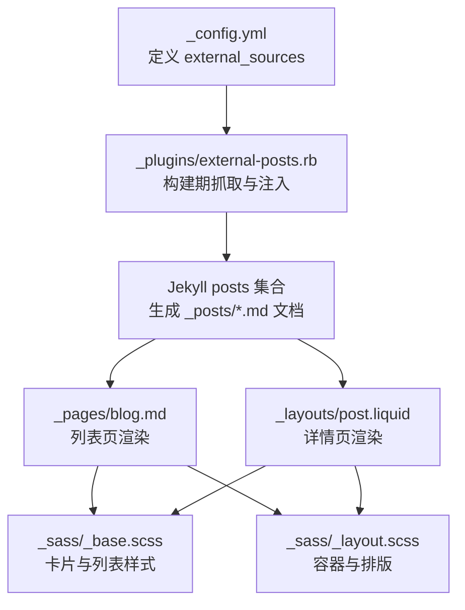
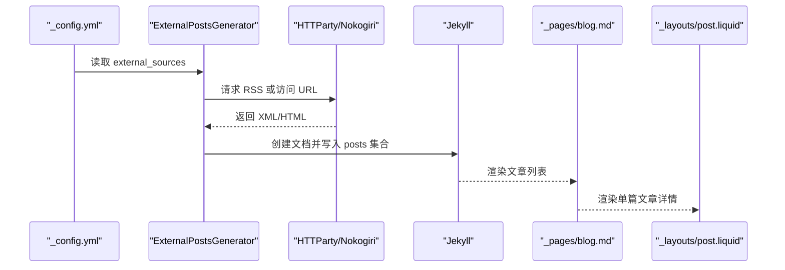
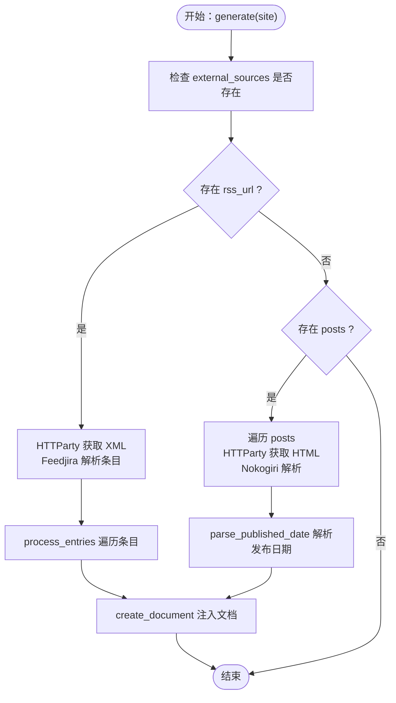
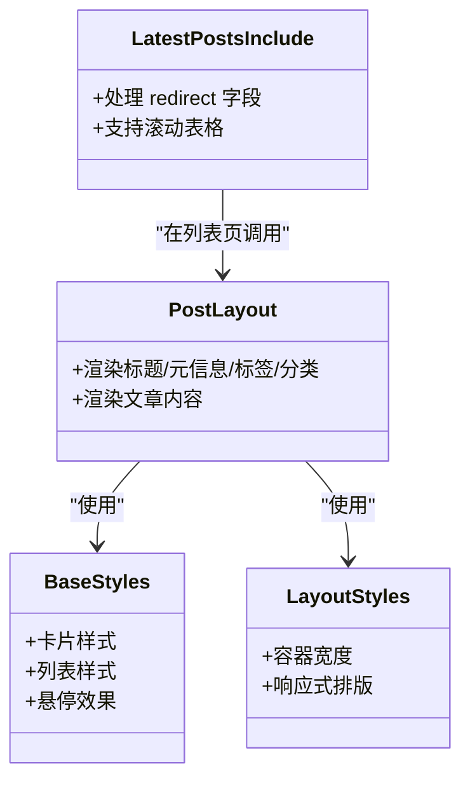
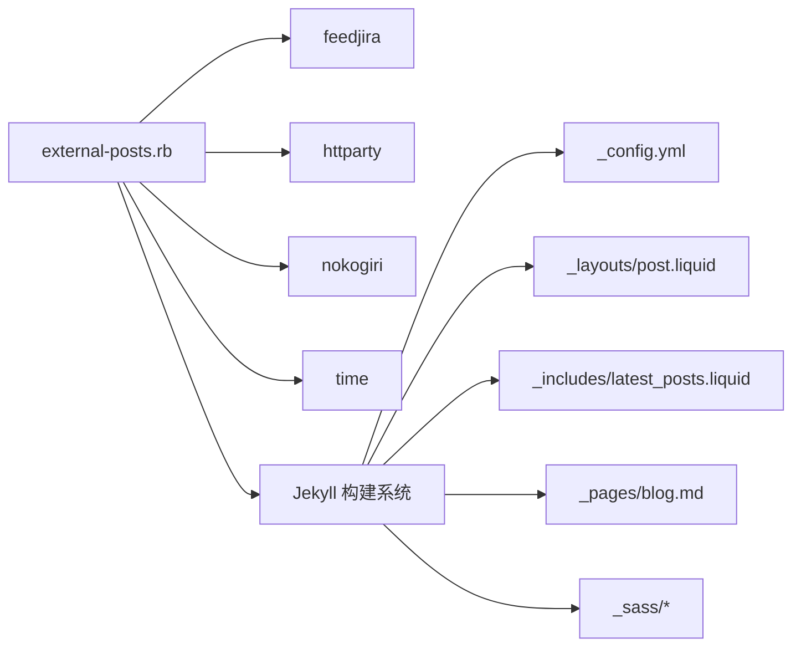
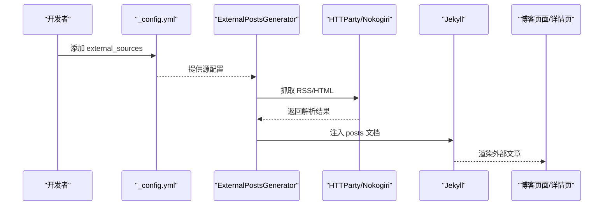

# 外部源集成

<cite>
**本文引用的文件**
- [_plugins/external-posts.rb](file://_plugins/external-posts.rb)
- [_config.yml](file://_config.yml)
- [Gemfile](file://Gemfile)
- [_layouts/post.liquid](file://_layouts/post.liquid)
- [_includes/latest_posts.liquid](file://_includes/latest_posts.liquid)
- [_pages/blog.md](file://_pages/blog.md)
- [_sass/_base.scss](file://_sass/_base.scss)
- [_sass/_layout.scss](file://_sass/_layout.scss)
</cite>

## 目录
1. [简介](#简介)
2. [项目结构](#项目结构)
3. [核心组件](#核心组件)
4. [架构总览](#架构总览)
5. [详细组件分析](#详细组件分析)
6. [依赖关系分析](#依赖关系分析)
7. [性能考量](#性能考量)
8. [故障排除指南](#故障排除指南)
9. [结论](#结论)
10. [附录](#附录)

## 简介
本文件系统性阐述本 Jekyll 站点的“外部源集成”能力，重点围绕 external-posts 插件的工作机制与配置方式，说明如何从外部博客源（如 RSS 源或指定 URL）抓取文章并注入到站点的 posts 集合中，使这些外部文章在博客页面中与本地文章一致地展示。文档覆盖以下主题：
- 外部源配置项与可选参数
- external-posts 插件的工作原理与数据流
- 同步策略与频率控制建议
- 内容过滤与显示样式定制
- 常见问题与故障排除
- 完整配置示例与集成步骤

## 项目结构
与外部源集成直接相关的核心文件与职责如下：
- 配置层：通过站点配置文件定义外部源列表与基础行为
- 插件层：external-posts 插件在构建阶段读取配置并抓取内容
- 展示层：博客页面与布局通过统一的数据字段渲染外部文章
- 样式层：通过 SCSS 控制外部文章的展示样式与交互

图表来源
- [_config.yml:123-133](file://_config.yml#L123-L133)
- [_plugins/external-posts.rb:12-23](file://_plugins/external-posts.rb#L12-L23)
- [_pages/blog.md:104-125](file://_pages/blog.md#L104-L125)
- [_layouts/post.liquid:1-97](file://_layouts/post.liquid#L1-L97)
- [_sass/_base.scss:586-623](file://_sass/_base.scss#L586-L623)
- [_sass/_layout.scss:30-32](file://_sass/_layout.scss#L30-L32)

章节来源
- [_config.yml:123-133](file://_config.yml#L123-L133)
- [_plugins/external-posts.rb:12-23](file://_plugins/external-posts.rb#L12-L23)
- [_pages/blog.md:104-125](file://_pages/blog.md#L104-L125)
- [_layouts/post.liquid:1-97](file://_layouts/post.liquid#L1-L97)
- [_sass/_base.scss:586-623](file://_sass/_base.scss#L586-L623)
- [_sass/_layout.scss:30-32](file://_sass/_layout.scss#L30-L32)

## 核心组件
- 外部源配置（external_sources）
  - 支持两种抓取模式：
    - RSS 模式：通过 rss_url 指定 RSS 源，插件解析条目并注入
    - URL 模式：通过 posts 列表指定具体文章 URL，并提供 published_date 用于时间标注
- external-posts 插件
  - 在 Jekyll 构建阶段运行，读取 external_sources 并抓取内容
  - 将抓取到的文章转换为 Jekyll 文档，写入 posts 集合
  - 为每篇文章注入统一的 front matter 字段，便于模板渲染与样式控制
- 展示与样式
  - 列表页与详情页均使用统一字段渲染外部文章
  - SCSS 提供卡片、列表与容器等样式支持

章节来源
- [_config.yml:123-133](file://_config.yml#L123-L133)
- [_plugins/external-posts.rb:12-23](file://_plugins/external-posts.rb#L12-L23)
- [_plugins/external-posts.rb:44-67](file://_plugins/external-posts.rb#L44-L67)
- [_pages/blog.md:104-125](file://_pages/blog.md#L104-L125)
- [_layouts/post.liquid:1-97](file://_layouts/post.liquid#L1-L97)

## 架构总览
下图展示了从配置到渲染的完整流程，包括抓取、注入与展示三个阶段。

图表来源
- [_config.yml:123-133](file://_config.yml#L123-L133)
- [_plugins/external-posts.rb:12-23](file://_plugins/external-posts.rb#L12-L23)
- [_plugins/external-posts.rb:25-30](file://_plugins/external-posts.rb#L25-L30)
- [_plugins/external-posts.rb:69-76](file://_plugins/external-posts.rb#L69-L76)
- [_pages/blog.md:104-125](file://_pages/blog.md#L104-L125)
- [_layouts/post.liquid:1-97](file://_layouts/post.liquid#L1-L97)

## 详细组件分析

### external-posts 插件工作原理
- 入口与调度
  - 插件在 Jekyll 构建阶段执行，遍历 external_sources 中的每个源
  - 若存在 rss_url，则走 RSS 抓取；若存在 posts，则走 URL 抓取
- RSS 抓取
  - 使用 HTTParty 获取 XML，Feedjira 解析为条目集合
  - 对每个条目调用 create_document 注入到 posts 集合
- URL 抓取
  - 遍历 posts 列表，对每个 URL 使用 HTTParty 获取 HTML，Nokogiri 解析标题、描述与正文
  - 使用 published_date 解析发布时间（字符串或日期对象）
  - 调用 create_document 注入到 posts 集合
- 文档注入
  - 生成唯一 slug（优先使用标题，否则回退到源名+URL 片段）
  - 设置统一 front matter 字段：external_source、title、feed_content、description、date、redirect
  - 将内容写入 posts 集合，供后续模板渲染

图表来源
- [_plugins/external-posts.rb:12-23](file://_plugins/external-posts.rb#L12-L23)
- [_plugins/external-posts.rb:25-30](file://_plugins/external-posts.rb#L25-L30)
- [_plugins/external-posts.rb:32-42](file://_plugins/external-posts.rb#L32-L42)
- [_plugins/external-posts.rb:69-76](file://_plugins/external-posts.rb#L69-L76)
- [_plugins/external-posts.rb:78-87](file://_plugins/external-posts.rb#L78-L87)
- [_plugins/external-posts.rb:89-107](file://_plugins/external-posts.rb#L89-L107)
- [_plugins/external-posts.rb:44-67](file://_plugins/external-posts.rb#L44-L67)

章节来源
- [_plugins/external-posts.rb:12-23](file://_plugins/external-posts.rb#L12-L23)
- [_plugins/external-posts.rb:25-30](file://_plugins/external-posts.rb#L25-L30)
- [_plugins/external-posts.rb:32-42](file://_plugins/external-posts.rb#L32-L42)
- [_plugins/external-posts.rb:69-76](file://_plugins/external-posts.rb#L69-L76)
- [_plugins/external-posts.rb:78-87](file://_plugins/external-posts.rb#L78-L87)
- [_plugins/external-posts.rb:89-107](file://_plugins/external-posts.rb#L89-L107)
- [_plugins/external-posts.rb:44-67](file://_plugins/external-posts.rb#L44-L67)

### 外部源配置与选项
- external_sources 数组中的每个元素支持以下键：
  - name：源名称（用于 slug 前缀与标识）
  - rss_url：RSS 源地址（二选一）
  - posts：URL 列表（二选一），其中每个条目包含：
    - url：目标文章 URL
    - published_date：发布日期（字符串或 Date 对象）

章节来源
- [_config.yml:123-133](file://_config.yml#L123-L133)

### 外部文章的显示与样式定制
- 列表页渲染
  - 博客列表页根据是否为外部源设置不同的阅读时长计算逻辑
  - 外部源文章通过 redirect 字段决定链接打开方式（站内相对路径、外链新窗口等）
- 详情页渲染
  - 统一使用 post 布局渲染，front matter 字段由插件注入
- 样式支持
  - 卡片与列表样式由 SCSS 控制，支持悬停、颜色与排版
  - 容器宽度与响应式布局由布局样式控制

图表来源
- [_layouts/post.liquid:1-97](file://_layouts/post.liquid#L1-L97)
- [_includes/latest_posts.liquid:1-49](file://_includes/latest_posts.liquid#L1-L49)
- [_sass/_base.scss:586-623](file://_sass/_base.scss#L586-L623)
- [_sass/_layout.scss:30-32](file://_sass/_layout.scss#L30-L32)

章节来源
- [_pages/blog.md:104-125](file://_pages/blog.md#L104-L125)
- [_includes/latest_posts.liquid:1-49](file://_includes/latest_posts.liquid#L1-L49)
- [_layouts/post.liquid:1-97](file://_layouts/post.liquid#L1-L97)
- [_sass/_base.scss:586-623](file://_sass/_base.scss#L586-L623)
- [_sass/_layout.scss:30-32](file://_sass/_layout.scss#L30-L32)

## 依赖关系分析
- Ruby 依赖
  - feedjira：解析 RSS/XML
  - httparty：HTTP 请求
  - nokogiri：解析 HTML/元信息
  - time：日期解析
- Jekyll 插件生态
  - external-posts 作为自定义生成器，在构建期注入文档
  - 与站点的 posts 集合、模板与样式系统无缝衔接

图表来源
- [_plugins/external-posts.rb:1-5](file://_plugins/external-posts.rb#L1-L5)
- [_plugins/external-posts.rb:12-23](file://_plugins/external-posts.rb#L12-L23)
- [_config.yml:123-133](file://_config.yml#L123-L133)
- [_layouts/post.liquid:1-97](file://_layouts/post.liquid#L1-L97)
- [_includes/latest_posts.liquid:1-49](file://_includes/latest_posts.liquid#L1-L49)
- [_pages/blog.md:104-125](file://_pages/blog.md#L104-L125)
- [_sass/_base.scss:586-623](file://_sass/_base.scss#L586-L623)
- [_sass/_layout.scss:30-32](file://_sass/_layout.scss#L30-L32)

章节来源
- [_plugins/external-posts.rb:1-5](file://_plugins/external-posts.rb#L1-L5)
- [_config.yml:123-133](file://_config.yml#L123-L133)

## 性能考量
- 抓取频率
  - 插件在每次构建时抓取一次，无法自动定时同步
  - 建议通过 CI/CD 或本地构建周期控制同步频率（例如每日/每周构建）
- 网络与超时
  - HTTP 请求可能受网络波动影响，建议在 CI 环境中增加重试与超时配置
- 内容体积
  - 外部文章内容会写入 posts 集合，长期积累可能导致站点体积增大
  - 可结合分页与归档功能控制列表规模

[本节为通用指导，不直接分析具体文件]

## 故障排除指南
- 认证与密钥
  - 当前 external-posts 插件未内置 API 密钥或认证参数
  - 若外部源需要鉴权，请在部署环境通过代理或前置服务处理
- 网络连接问题
  - RSS/URL 访问失败时，插件不会抛出异常，仅跳过该条目
  - 建议在 CI 日志中观察抓取输出，定位失败源
- 标题为空或不可用
  - 插件会检测标题有效性并回退到“源名+URL 片段”的 slug
  - 如需更稳定的标题，建议在 URL 模式下确保目标页面包含有效的标题与描述元信息
- 发布日期解析错误
  - published_date 必须为字符串或 Date 对象，否则会触发日期解析异常
  - 请确保日期格式正确且可被解析
- 显示异常
  - 外部文章通过 redirect 字段控制链接行为，若链接无效或被重定向，需在配置中修正
  - 阅读时长在外部文章场景使用 feed_content 计算，确保内容可解析

章节来源
- [_plugins/external-posts.rb:44-53](file://_plugins/external-posts.rb#L44-L53)
- [_plugins/external-posts.rb:78-87](file://_plugins/external-posts.rb#L78-L87)
- [_plugins/external-posts.rb:89-107](file://_plugins/external-posts.rb#L89-L107)
- [_pages/blog.md:114-118](file://_pages/blog.md#L114-L118)

## 结论
external-posts 插件提供了灵活的外部源集成能力，既支持 RSS 自动抓取，也支持指定 URL 的精准抓取。通过统一的 front matter 字段与 Jekyll 的模板系统，外部文章可以与本地文章无差别地展示。实际使用中，建议结合 CI/CD 控制同步频率，并关注网络稳定性与内容质量，以获得最佳体验。

[本节为总结性内容，不直接分析具体文件]

## 附录

### 配置示例与集成步骤
- 步骤
  1) 在站点配置中添加 external_sources 数组，选择 RSS 或 URL 模式之一
  2) 若使用 RSS 模式，填写 name 与 rss_url
  3) 若使用 URL 模式，填写 name 与 posts 列表，每个条目包含 url 与 published_date
  4) 保存后重新构建站点，插件会在构建期抓取并注入文章
  5) 在博客页面与详情页即可看到外部文章
- 示例参考
  - RSS 模式示例：参见配置文件中的 external_sources 条目
  - URL 模式示例：参见配置文件中的 posts 列表条目

章节来源
- [_config.yml:123-133](file://_config.yml#L123-L133)

### 外部源集成的完整流程（代码级）

图表来源
- [_config.yml:123-133](file://_config.yml#L123-L133)
- [_plugins/external-posts.rb:12-23](file://_plugins/external-posts.rb#L12-L23)
- [_plugins/external-posts.rb:25-30](file://_plugins/external-posts.rb#L25-L30)
- [_plugins/external-posts.rb:69-76](file://_plugins/external-posts.rb#L69-L76)
- [_pages/blog.md:104-125](file://_pages/blog.md#L104-L125)
- [_layouts/post.liquid:1-97](file://_layouts/post.liquid#L1-L97)