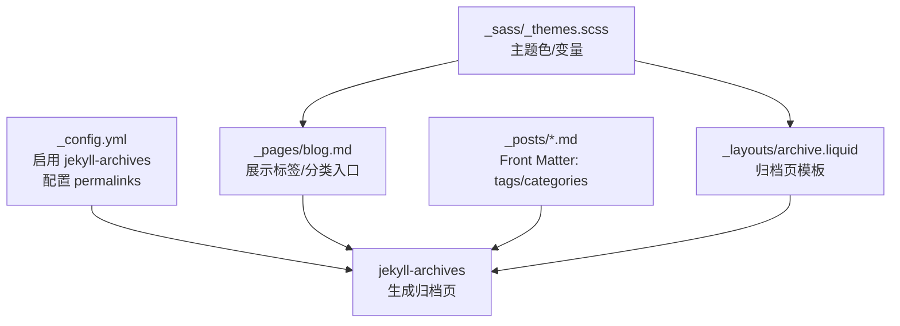
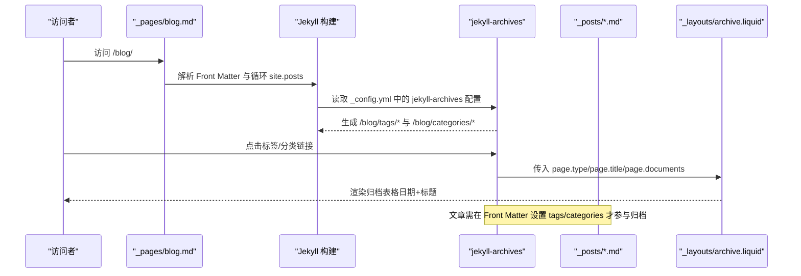
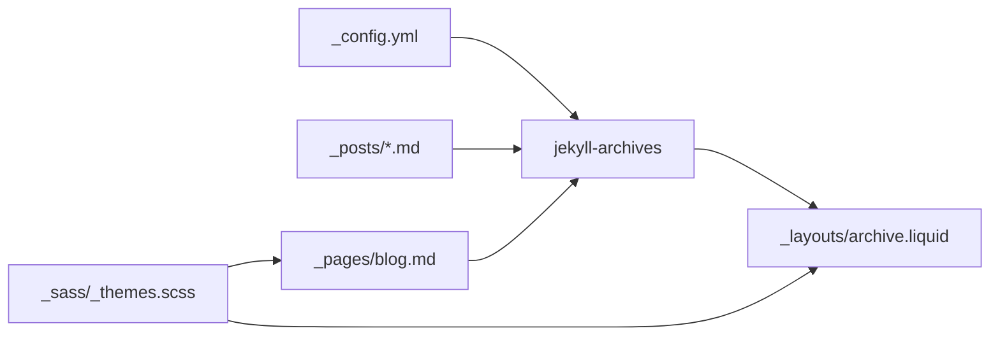

# 标签和分类系统

<cite>
**本文档引用的文件**
- [_config.yml](file://_config.yml)
- [_pages/blog.md](file://_pages/blog.md)
- [_layouts/archive.liquid](file://_layouts/archive.liquid)
- [_posts/2015-03-15-formatting-and-links.md](file://_posts/2015-03-15-formatting-and-links.md)
- [_posts/2015-05-15-images.md](file://_posts/2015-05-15-images.md)
- [_posts/2023-03-20-table-of-contents.md](file://_posts/2023-03-20-table-of-contents.md)
- [CUSTOMIZE.md](file://CUSTOMIZE.md)
- [_sass/_themes.scss](file://_sass/_themes.scss)
- [_sass/_base.scss](file://_sass/_base.scss)
</cite>

## 目录
1. [简介](#简介)
2. [项目结构](#项目结构)
3. [核心组件](#核心组件)
4. [架构总览](#架构总览)
5. [详细组件分析](#详细组件分析)
6. [依赖关系分析](#依赖关系分析)
7. [性能考虑](#性能考虑)
8. [故障排除指南](#故障排除指南)
9. [结论](#结论)
10. [附录](#附录)

## 简介
本文件系统性地阐述该 Jekyll 博客项目的标签与分类体系，覆盖以下方面：
- 在 Front Matter 中配置标签与分类字段的方法
- 基于 jekyll-archives 的标签云与分类导航生成机制
- 分类页面的自动生成与列表展示
- 按标签或分类进行内容筛选的实现思路
- 最佳实践：命名规范、使用策略与可扩展建议
- 实际配置示例与使用效果说明

## 项目结构
该项目采用标准 Jekyll 结构，标签与分类相关的核心位置如下：
- 配置与归档规则：_config.yml
- 博客首页与标签/分类展示：_pages/blog.md
- 归档页布局模板：_layouts/archive.liquid
- 示例文章（含标签/分类）：_posts 下多篇示例
- 自定义指南与扩展说明：CUSTOMIZE.md
- 样式与主题变量：_sass/_themes.scss、_sass/_base.scss

图表来源
- [_config.yml](file://_config.yml)
- [_pages/blog.md](file://_pages/blog.md)
- [_layouts/archive.liquid](file://_layouts/archive.liquid)
- [_sass/_themes.scss](file://_sass/_themes.scss)

章节来源
- [_config.yml](file://_config.yml)
- [_pages/blog.md](file://_pages/blog.md)
- [_layouts/archive.liquid](file://_layouts/archive.liquid)
- [_sass/_themes.scss](file://_sass/_themes.scss)

## 核心组件
- 配置层（_config.yml）
  - 启用 jekyll-archives 并声明支持 year/tags/categories
  - 定义归档链接前缀（permalinks），如 /blog/:type/:name/
  - 控制首页展示的标签与分类（display_tags/display_categories）
- 页面层（_pages/blog.md）
  - 展示站点级标签/分类入口列表，通过 slugify 生成归档链接
- 模板层（_layouts/archive.liquid）
  - 渲染归档页标题与文档列表，区分 tags 与 categories
- 数据层（_posts/*.md）
  - 文章 Front Matter 中设置 tags 与 categories 字段
- 样式层（_sass）
  - 主题色与通用样式为标签/分类入口提供视觉一致性

章节来源
- [_config.yml](file://_config.yml)
- [_pages/blog.md](file://_pages/blog.md)
- [_layouts/archive.liquid](file://_layouts/archive.liquid)
- [_posts/2015-03-15-formatting-and-links.md](file://_posts/2015-03-15-formatting-and-links.md)
- [_posts/2015-05-15-images.md](file://_posts/2015-05-15-images.md)
- [_posts/2023-03-20-table-of-contents.md](file://_posts/2023-03-20-table-of-contents.md)

## 架构总览
下图展示了从配置到页面渲染的端到端流程：

图表来源
- [_config.yml](file://_config.yml)
- [_pages/blog.md](file://_pages/blog.md)
- [_layouts/archive.liquid](file://_layouts/archive.liquid)
- [_posts/2015-03-15-formatting-and-links.md](file://_posts/2015-03-15-formatting-and-links.md)

## 详细组件分析

### 配置与归档规则（_config.yml）
- 启用归档类型
  - posts: [year, tags, categories]
  - books: [year, tags, categories]
- 归档链接前缀
  - tags: /blog/:type/:name/
  - categories: /blog/:type/:name/
- 首页展示控制
  - display_tags: 在首页展示的标签集合
  - display_categories: 在首页展示的分类集合

章节来源
- [_config.yml](file://_config.yml)

### 博客首页标签/分类入口（_pages/blog.md）
- 使用 Liquid 循环 site.display_tags 与 site.display_categories
- 对每个标签/分类执行 slugify 并拼接 /blog/:type/ 前缀
- 输出带图标与链接的列表项，便于快速跳转至对应归档页

章节来源
- [_pages/blog.md](file://_pages/blog.md)

### 归档页模板（_layouts/archive.liquid）
- 根据 page.type 渲染标题与描述
  - type == 'tags': 显示“# 标签”
  - type == 'categories': 显示“标签”图标
- 遍历 page.documents 输出日期与标题的表格
- 支持外链重定向（redirect）与相对路径跳转

章节来源
- [_layouts/archive.liquid](file://_layouts/archive.liquid)

### 文章 Front Matter 中的标签与分类
- 示例文章均在 Front Matter 中设置 tags 与 categories
- 典型字段值：
  - tags: formatting, images, links, toc 等
  - categories: sample-posts 等
- 这些字段由 jekyll-archives 读取并生成对应的归档页

章节来源
- [_posts/2015-03-15-formatting-and-links.md](file://_posts/2015-03-15-formatting-and-links.md)
- [_posts/2015-05-15-images.md](file://_posts/2015-05-15-images.md)
- [_posts/2023-03-20-table-of-contents.md](file://_posts/2023-03-20-table-of-contents.md)

### 标签云生成与显示机制
- 仓库未内置标签云生成器；当前实现为“标签入口列表”
  - 在首页通过 site.display_tags 与 site.display_categories 输出静态链接
  - 每个标签/分类链接指向 /blog/:type/:name/ 对应归档页
- 若需实现“标签云”，可在现有基础上扩展：
  - 使用 Liquid 统计各标签出现频次
  - 基于频次计算字号或权重，动态渲染不同样式的标签元素
  - 可结合 _sass/_themes.scss 中的主题色变量统一风格

章节来源
- [_pages/blog.md](file://_pages/blog.md)
- [_config.yml](file://_config.yml)
- [_sass/_themes.scss](file://_sass/_themes.scss)

### 分类导航与页面生成
- 分类导航由首页循环 site.display_categories 生成
- 归档页面由 jekyll-archives 自动生成，模板为 _layouts/archive.liquid
- 导航与归档页面的链接结构一致，确保用户路径清晰

章节来源
- [_pages/blog.md](file://_pages/blog.md)
- [_layouts/archive.liquid](file://_layouts/archive.liquid)
- [_config.yml](file://_config.yml)

### 过滤功能实现思路
- 当前系统通过归档页实现“按标签/分类筛选”
  - 用户点击标签/分类 → 跳转至对应归档页 → 列表仅显示匹配内容
- 如需在单页内实现“前端筛选”，可参考以下思路：
  - 在页面中收集所有文章的 tags/categories 信息
  - 使用 JavaScript 过滤并重新渲染文章列表
  - 保持 URL 与锚点同步，提升可分享性

章节来源
- [_layouts/archive.liquid](file://_layouts/archive.liquid)
- [_pages/blog.md](file://_pages/blog.md)

### 样式与主题定制
- 主题色变量集中于 _sass/_themes.scss，可统一调整标签/分类入口的配色
- 通用样式（链接颜色、表格等）位于 _sass/_base.scss，保证归档页表格与链接的一致性

章节来源
- [_sass/_themes.scss](file://_sass/_themes.scss)
- [_sass/_base.scss](file://_sass/_base.scss)

## 依赖关系分析
- 配置依赖：_config.yml 决定归档类型与链接前缀
- 模板依赖：_layouts/archive.liquid 依赖 page.type 与 page.documents
- 数据依赖：_posts/*.md 的 Front Matter 提供 tags/categories
- 页面依赖：_pages/blog.md 依赖 site.display_tags/display_categories

图表来源
- [_config.yml](file://_config.yml)
- [_pages/blog.md](file://_pages/blog.md)
- [_layouts/archive.liquid](file://_layouts/archive.liquid)
- [_sass/_themes.scss](file://_sass/_themes.scss)

章节来源
- [_config.yml](file://_config.yml)
- [_pages/blog.md](file://_pages/blog.md)
- [_layouts/archive.liquid](file://_layouts/archive.liquid)
- [_sass/_themes.scss](file://_sass/_themes.scss)

## 性能考虑
- 归档页基于构建期生成，运行时无需额外计算，加载速度快
- 若引入前端筛选，建议：
  - 将数据预处理为轻量 JSON，减少 DOM 查询开销
  - 使用虚拟滚动或分页，避免一次性渲染过多节点
- 样式层面：
  - 复用 _sass/_themes.scss 中的主题变量，减少重复样式定义

## 故障排除指南
- 归档页 404 或链接无效
  - 检查 _config.yml 中 jekyll-archives 是否启用且包含 tags/categories
  - 确认文章 Front Matter 包含 tags/categories 字段
  - 确认链接前缀与 permalinks 配置一致
- 首页未显示标签/分类入口
  - 检查 _pages/blog.md 中是否正确循环 site.display_tags/site.display_categories
  - 确认 _config.yml 中 display_tags/display_categories 已配置
- 样式不一致
  - 检查 _sass/_themes.scss 中主题色变量是否被正确引用
  - 确认 _sass/_base.scss 中链接与表格样式未被覆盖

章节来源
- [_config.yml](file://_config.yml)
- [_pages/blog.md](file://_pages/blog.md)
- [_layouts/archive.liquid](file://_layouts/archive.liquid)
- [_sass/_themes.scss](file://_sass/_themes.scss)
- [_sass/_base.scss](file://_sass/_base.scss)

## 结论
该系统以 jekyll-archives 为核心，通过简洁的配置与模板实现了稳定的标签与分类归档能力。首页提供入口，归档页提供列表，满足基础筛选需求。若需增强交互体验（如标签云、前端筛选），可在现有基础上扩展，同时保持与主题样式的统一。

## 附录

### 配置示例与使用效果
- 在文章 Front Matter 中添加标签与分类字段
  - 示例字段：tags: formatting, images, links
  - 示例字段：categories: sample-posts
- 在首页展示标签/分类入口
  - 通过 site.display_tags 与 site.display_categories 输出链接
  - 链接格式：/blog/tag/{slug}/ 或 /blog/category/{slug}/
- 归档页展示
  - 按标签或分类聚合的文章列表，包含发布日期与标题

章节来源
- [_posts/2015-03-15-formatting-and-links.md](file://_posts/2015-03-15-formatting-and-links.md)
- [_posts/2015-05-15-images.md](file://_posts/2015-05-15-images.md)
- [_posts/2023-03-20-table-of-contents.md](file://_posts/2023-03-20-table-of-contents.md)
- [_pages/blog.md](file://_pages/blog.md)
- [_layouts/archive.liquid](file://_layouts/archive.liquid)
- [_config.yml](file://_config.yml)

### 最佳实践
- 命名规范
  - tags/categories 使用短横线连接的小写字符串，便于 slugify 与 URL 友好
- 使用策略
  - 优先使用 display_tags/display_categories 控制首页入口数量
  - 为常用标签/分类设计稳定语义，避免频繁变更
- 可扩展建议
  - 引入标签云：统计频次并动态渲染字号
  - 引入前端筛选：在单页内按标签/分类即时过滤
  - 统一样式：复用 _sass/_themes.scss 主题变量

章节来源
- [_config.yml](file://_config.yml)
- [_pages/blog.md](file://_pages/blog.md)
- [_sass/_themes.scss](file://_sass/_themes.scss)
- [CUSTOMIZE.md](file://CUSTOMIZE.md)