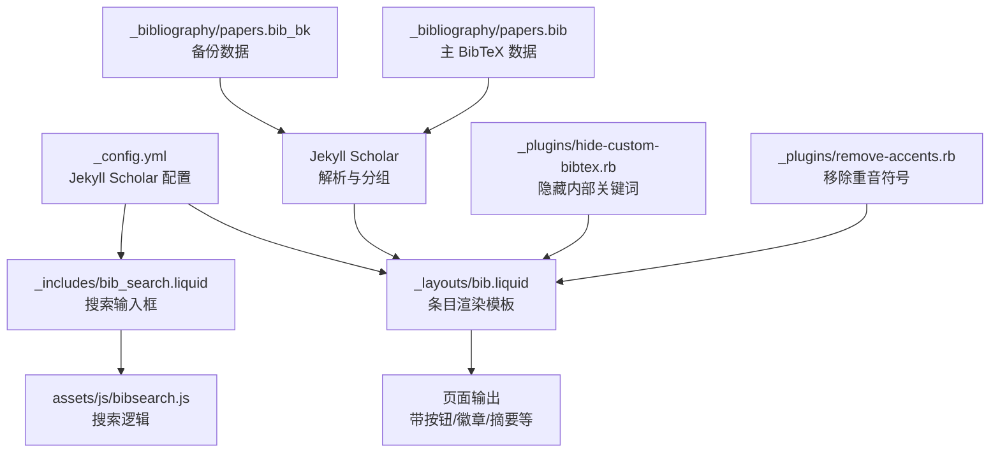
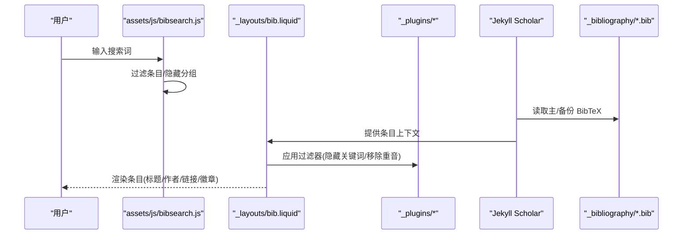
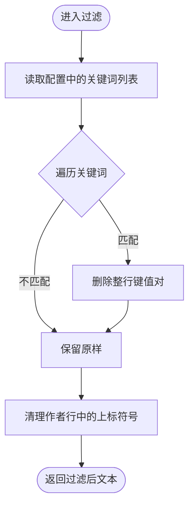
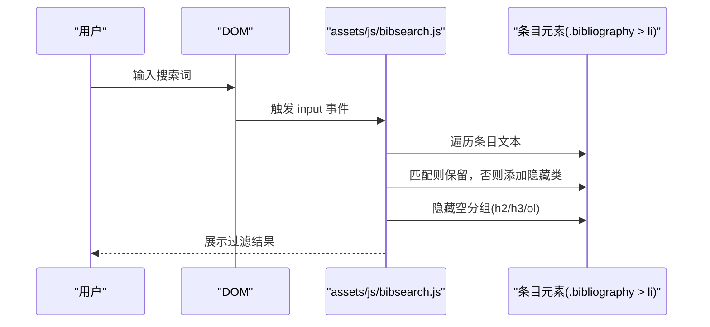
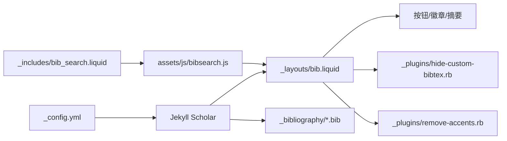

# BibTeX 文件管理

<cite>
**本文引用的文件**
- [_config.yml](file://_config.yml)
- [_layouts/bib.liquid](file://_layouts/bib.liquid)
- [_includes/bib_search.liquid](file://_includes/bib_search.liquid)
- [_includes/citation.liquid](file://_includes/citation.liquid)
- [_plugins/hide-custom-bibtex.rb](file://_plugins/hide-custom-bibtex.rb)
- [_plugins/remove-accents.rb](file://_plugins/remove-accents.rb)
- [_bibliography/papers.bib](file://_bibliography/papers.bib)
- [_bibliography/papers.bib_bk](file://_bibliography/papers.bib_bk)
- [assets/js/bibsearch.js](file://assets/js/bibsearch.js)
- [CUSTOMIZE.md](file://CUSTOMIZE.md)
</cite>

## 目录
1. [简介](#简介)
2. [项目结构](#项目结构)
3. [核心组件](#核心组件)
4. [架构总览](#架构总览)
5. [详细组件分析](#详细组件分析)
6. [依赖关系分析](#依赖关系分析)
7. [性能考量](#性能考量)
8. [故障排查指南](#故障排查指南)
9. [结论](#结论)
10. [附录](#附录)

## 简介
本文件系统性梳理该 Jekyll 项目中的 BibTeX 文件管理机制，覆盖以下方面：
- BibTeX 基本结构与条目类型选择
- 必填字段与可选字段的配置与展示
- 备份文件的作用与管理策略
- 国际化与特殊字符处理
- 搜索过滤与可视化交互
- 常见错误与解决方案

## 项目结构
该项目通过 Jekyll Scholar 集成 BibTeX 数据，配合自定义 Liquid 模板与前端脚本实现条目的渲染、筛选与交互。

**图表来源**
- [_config.yml:267-291](file://_config.yml#L267-L291)
- [_layouts/bib.liquid:1-373](file://_layouts/bib.liquid#L1-L373)
- [_includes/bib_search.liquid:1-5](file://_includes/bib_search.liquid#L1-L5)
- [assets/js/bibsearch.js:1-71](file://assets/js/bibsearch.js#L1-L71)
- [_bibliography/papers.bib:1-75](file://_bibliography/papers.bib#L1-L75)
- [_bibliography/papers.bib_bk:1-126](file://_bibliography/papers.bib_bk#L1-L126)
- [_plugins/hide-custom-bibtex.rb:1-19](file://_plugins/hide-custom-bibtex.rb#L1-L19)
- [_plugins/remove-accents.rb:1-32](file://_plugins/remove-accents.rb#L1-L32)

**章节来源**
- [_config.yml:267-291](file://_config.yml#L267-L291)
- [_layouts/bib.liquid:1-373](file://_layouts/bib.liquid#L1-L373)
- [_includes/bib_search.liquid:1-5](file://_includes/bib_search.liquid#L1-L5)
- [assets/js/bibsearch.js:1-71](file://assets/js/bibsearch.js#L1-L71)
- [_bibliography/papers.bib:1-75](file://_bibliography/papers.bib#L1-L75)
- [_bibliography/papers.bib_bk:1-126](file://_bibliography/papers.bib_bk#L1-L126)
- [_plugins/hide-custom-bibtex.rb:1-19](file://_plugins/hide-custom-bibtex.rb#L1-L19)
- [_plugins/remove-accents.rb:1-32](file://_plugins/remove-accents.rb#L1-L32)

## 核心组件
- Jekyll Scholar 配置：指定源目录、主文件、模板、分组方式与过滤器。
- 条目渲染模板：根据条目类型动态生成期刊/会议信息、作者高亮、按钮与徽章。
- 自定义过滤器：隐藏内部关键词、移除重音符号；用于 BibTeX 输出与显示。
- 搜索组件：基于前端 JS 的实时过滤与分组隐藏。
- BibTeX 数据：主数据与备份数据，支持多种条目类型与自定义字段。

**章节来源**
- [_config.yml:267-291](file://_config.yml#L267-L291)
- [_layouts/bib.liquid:151-186](file://_layouts/bib.liquid#L151-L186)
- [_plugins/hide-custom-bibtex.rb:1-19](file://_plugins/hide-custom-bibtex.rb#L1-L19)
- [_plugins/remove-accents.rb:1-32](file://_plugins/remove-accents.rb#L1-L32)
- [_includes/bib_search.liquid:1-5](file://_includes/bib_search.liquid#L1-L5)
- [assets/js/bibsearch.js:1-71](file://assets/js/bibsearch.js#L1-L71)

## 架构总览
下图展示从 BibTeX 到页面渲染的关键流程：

**图表来源**
- [assets/js/bibsearch.js:1-71](file://assets/js/bibsearch.js#L1-L71)
- [_layouts/bib.liquid:1-373](file://_layouts/bib.liquid#L1-L373)
- [_plugins/hide-custom-bibtex.rb:1-19](file://_plugins/hide-custom-bibtex.rb#L1-L19)
- [_plugins/remove-accents.rb:1-32](file://_plugins/remove-accents.rb#L1-L32)
- [_bibliography/papers.bib:1-75](file://_bibliography/papers.bib#L1-L75)
- [_bibliography/papers.bib_bk:1-126](file://_bibliography/papers.bib_bk#L1-L126)

## 详细组件分析

### Jekyll Scholar 配置与条目类型
- 源目录与主文件：在配置中指定源目录与主 BibTeX 文件名，模板为自定义 bib.liquid。
- 分组与排序：按年分组并降序排列。
- 字符串替换：开启字符串替换与连接，便于统一格式。
- 过滤器链：启用 latex、smallcaps、superscript 等过滤器以美化显示。

条目类型映射与展示要点：
- article：展示期刊名称与卷期页码。
- inproceedings/incollection：展示书名或会议论文集。
- thesis/mastersthesis/phdthesis：展示学校信息。
- 其他类型：按默认处理。

**章节来源**
- [_config.yml:267-291](file://_config.yml#L267-L291)
- [_layouts/bib.liquid:151-186](file://_layouts/bib.liquid#L151-L186)

### 字段与按钮映射
- 必填字段：title、author、year 在多数条目中出现；具体是否必须取决于样式与条目类型。
- 可选字段：journal、volume、pages、doi、abstract、html、pdf、arxiv、award、video、code、slides、poster、supp、website、blog、preview、abbr、annotation、additional_info、dimensions、altmetric、google_scholar_id、inspirehep_id、selected 等。
- 自定义按钮：通过上述字段控制“摘要”“DOI”“arXiv”“Bib”“HTML/PDF/Code/Slides/Poster/Supp/Video/Website/Blog”等按钮的显示与跳转。

**章节来源**
- [_layouts/bib.liquid:188-256](file://_layouts/bib.liquid#L188-L256)
- [CUSTOMIZE.md:131-149](file://CUSTOMIZE.md#L131-L149)

### 自定义过滤器
- 隐藏内部关键词：根据配置列表批量移除特定键值对，避免在页面输出中暴露内部元信息。
- 移除重音符号：对作者姓名进行转写，便于索引与显示。
- 清理作者标注：去除作者列表中的上标星号等标记。

**图表来源**
- [_plugins/hide-custom-bibtex.rb:1-19](file://_plugins/hide-custom-bibtex.rb#L1-L19)
- [_plugins/remove-accents.rb:1-32](file://_plugins/remove-accents.rb#L1-L32)
- [_config.yml:300-325](file://_config.yml#L300-L325)

**章节来源**
- [_plugins/hide-custom-bibtex.rb:1-19](file://_plugins/hide-custom-bibtex.rb#L1-L19)
- [_plugins/remove-accents.rb:1-32](file://_plugins/remove-accents.rb#L1-L32)
- [_config.yml:300-325](file://_config.yml#L300-L325)

### 搜索与交互
- 搜索输入框：在启用了搜索时显示输入框，绑定前端脚本。
- 过滤逻辑：对条目文本进行大小写无关匹配，未匹配项添加隐藏类；同时隐藏空的分组标题与列表。
- URL 同步：支持通过 URL hash 初始化搜索词并触发过滤。

**图表来源**
- [_includes/bib_search.liquid:1-5](file://_includes/bib_search.liquid#L1-L5)
- [assets/js/bibsearch.js:1-71](file://assets/js/bibsearch.js#L1-L71)

**章节来源**
- [_includes/bib_search.liquid:1-5](file://_includes/bib_search.liquid#L1-L5)
- [assets/js/bibsearch.js:1-71](file://assets/js/bibsearch.js#L1-L71)

### BibTeX 示例与最佳实践
- 示例来源：主数据与备份数据均包含多种条目类型与字段组合，可作为参考模板。
- 最佳实践：
  - 使用稳定的条目标识符（citation key），避免空格与特殊字符。
  - 统一作者格式，必要时使用 LaTeX 转义或过滤器处理。
  - 对于会议论文，优先提供 booktitle；对于期刊文章，提供 journal、volume、pages。
  - 使用 arxiv、doi 等链接字段提升可发现性。
  - 使用自定义字段（如 abbr、selected、preview、video 等）增强页面展示。

**章节来源**
- [_bibliography/papers.bib:1-75](file://_bibliography/papers.bib#L1-L75)
- [_bibliography/papers.bib_bk:1-126](file://_bibliography/papers.bib_bk#L1-L126)
- [CUSTOMIZE.md:131-149](file://CUSTOMIZE.md#L131-L149)

### 备份文件的作用与管理策略
- 作用：备份数据文件用于离线或临时切换，确保主数据损坏时仍可正常构建。
- 策略：
  - 在配置中仅指向主数据文件；备份文件可作为历史版本或对比参考。
  - 构建前核对主数据完整性；如需回滚，可临时切换到备份文件并重新构建。
  - 推荐在版本控制中保留主数据与备份文件的历史提交记录，以便审计与恢复。

**章节来源**
- [_config.yml:274-276](file://_config.yml#L274-L276)
- [_bibliography/papers.bib:1-75](file://_bibliography/papers.bib#L1-L75)
- [_bibliography/papers.bib_bk:1-126](file://_bibliography/papers.bib_bk#L1-L126)

### 国际化与特殊字符编码
- 重音转写：通过过滤器对作者姓名进行转写，减少非 ASCII 字符带来的显示问题。
- 字体与渲染：Jekyll Scholar 的过滤器链包含 latex、smallcaps、superscript 等，有助于正确渲染数学与格式化内容。
- 建议：在 BibTeX 中使用标准 LaTeX 命令转义特殊字符；必要时结合过滤器与 CSS 字体支持。

**章节来源**
- [_plugins/remove-accents.rb:1-32](file://_plugins/remove-accents.rb#L1-L32)
- [_config.yml:279-280](file://_config.yml#L279-L280)

## 依赖关系分析
- 配置层：_config.yml 决定数据源、模板、分组与过滤器链。
- 渲染层：_layouts/bib.liquid 负责条目渲染、按钮与徽章生成。
- 过滤层：_plugins/hide-custom-bibtex.rb 与 _plugins/remove-accents.rb 提供输出前的文本处理。
- 交互层：_includes/bib_search.liquid 与 assets/js/bibsearch.js 实现搜索与分组隐藏。
- 数据层：_bibliography/*.bib 提供条目数据。

**图表来源**
- [_config.yml:267-291](file://_config.yml#L267-L291)
- [_layouts/bib.liquid:1-373](file://_layouts/bib.liquid#L1-L373)
- [_plugins/hide-custom-bibtex.rb:1-19](file://_plugins/hide-custom-bibtex.rb#L1-L19)
- [_plugins/remove-accents.rb:1-32](file://_plugins/remove-accents.rb#L1-L32)
- [_includes/bib_search.liquid:1-5](file://_includes/bib_search.liquid#L1-L5)
- [assets/js/bibsearch.js:1-71](file://assets/js/bibsearch.js#L1-L71)
- [_bibliography/papers.bib:1-75](file://_bibliography/papers.bib#L1-L75)

**章节来源**
- [_config.yml:267-291](file://_config.yml#L267-L291)
- [_layouts/bib.liquid:1-373](file://_layouts/bib.liquid#L1-L373)
- [_plugins/hide-custom-bibtex.rb:1-19](file://_plugins/hide-custom-bibtex.rb#L1-L19)
- [_plugins/remove-accents.rb:1-32](file://_plugins/remove-accents.rb#L1-L32)
- [_includes/bib_search.liquid:1-5](file://_includes/bib_search.liquid#L1-L5)
- [assets/js/bibsearch.js:1-71](file://assets/js/bibsearch.js#L1-L71)
- [_bibliography/papers.bib:1-75](file://_bibliography/papers.bib#L1-L75)

## 性能考量
- 前端搜索：仅在浏览器侧进行文本匹配与 DOM 类操作，复杂度与条目数量近似线性。
- 过滤器链：Jekyll 构建阶段应用过滤器，建议保持关键词列表简洁，避免过多正则替换。
- 图片与资源：预览图与 PDF 等资源路径需合理组织，避免不必要的网络请求。
- 分组渲染：大量分组时，建议限制初始可见数量或采用懒加载策略。

## 故障排查指南
- 条目未显示或按钮缺失
  - 检查条目字段是否正确拼写（如 html、pdf、arxiv、doi 等）。
  - 确认自定义字段未被过滤器隐藏（例如 abbr、abstract、additional_info 等）。
- 作者标注异常
  - 检查作者字段是否包含上标符号；过滤器会清理作者行中的上标。
- 搜索无响应
  - 确认已启用搜索并在页面中包含搜索输入框。
  - 检查浏览器控制台是否存在脚本错误。
- 构建失败或样式异常
  - 检查 Jekyll Scholar 插件版本与配置是否一致。
  - 确认过滤器链与 MathJAX 等渲染器无冲突。

**章节来源**
- [_plugins/hide-custom-bibtex.rb:1-19](file://_plugins/hide-custom-bibtex.rb#L1-L19)
- [_includes/bib_search.liquid:1-5](file://_includes/bib_search.liquid#L1-L5)
- [assets/js/bibsearch.js:1-71](file://assets/js/bibsearch.js#L1-L71)
- [_config.yml:279-280](file://_config.yml#L279-L280)

## 结论
该系统通过 Jekyll Scholar 将 BibTeX 数据结构化地注入页面，结合自定义模板与过滤器实现丰富的展示与交互能力。主数据与备份数据并存，既保证了可用性也便于版本管理。遵循字段规范与最佳实践，可显著提升条目质量与用户体验。

## 附录

### 常用字段速览
- 必填字段：title、author、year（视条目类型而定）
- 常用字段：journal、volume、pages、doi、abstract、html、pdf、arxiv、booktitle、school、month、location、note、publisher、address、edition、series、chapter、editor、institution、organization、howpublished、type、note、abstract、keywords
- 自定义字段：abbr、selected、preview、award、annotation、additional_info、dimensions、altmetric、google_scholar_id、inspirehep_id、video、code、slides、poster、supp、website、blog

**章节来源**
- [_layouts/bib.liquid:188-256](file://_layouts/bib.liquid#L188-L256)
- [CUSTOMIZE.md:131-149](file://CUSTOMIZE.md#L131-L149)