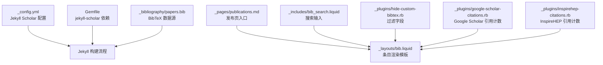
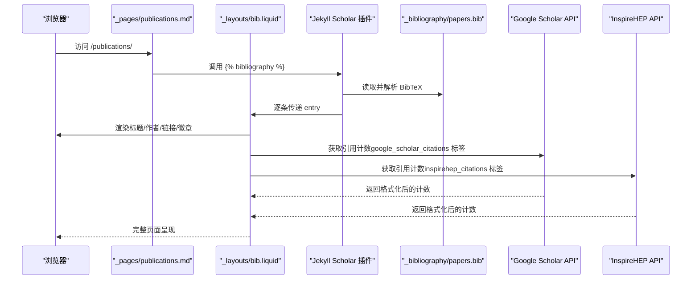
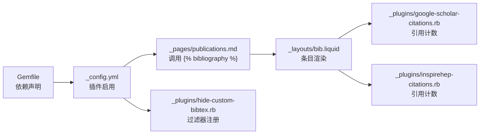

# Jekyll Scholar 插件配置

<cite>
**本文档引用的文件**
- [_config.yml](file://_config.yml)
- [Gemfile](file://Gemfile)
- [papers.bib](file://_bibliography/papers.bib)
- [_layouts/bib.liquid](file://_layouts/bib.liquid)
- [_pages/publications.md](file://_pages/publications.md)
- [_includes/bib_search.liquid](file://_includes/bib_search.liquid)
- [_plugins/hide-custom-bibtex.rb](file://_plugins/hide-custom-bibtex.rb)
- [_plugins/google-scholar-citations.rb](file://_plugins/google-scholar-citations.rb)
- [_plugins/inspirehep-citations.rb](file://_plugins/inspirehep-citations.rb)
- [INSTALL.md](file://INSTALL.md)
- [CUSTOMIZE.md](file://CUSTOMIZE.md)
</cite>

## 目录
1. [简介](#简介)
2. [项目结构](#项目结构)
3. [核心组件](#核心组件)
4. [架构总览](#架构总览)
5. [详细组件分析](#详细组件分析)
6. [依赖关系分析](#依赖关系分析)
7. [性能考虑](#性能考虑)
8. [故障排除指南](#故障排除指南)
9. [结论](#结论)
10. [附录](#附录)

## 简介
本文件面向需要在 Jekyll 站点中启用与管理学术出版物展示的用户，系统性讲解 Jekyll Scholar 插件的安装、启用与配置方法，并结合本仓库的实际实现，详细说明配置项（如 scholar、bibtex_dir、bibliography、sort_by、order、style 等）的作用与取值建议；同时覆盖引用样式自定义、第三方样式库集成、排序规则与过滤条件、完整配置示例、调试方法与常见问题排查，以及与外部学术功能（如 Google Scholar、InspireHEP）的集成方式。

## 项目结构
本仓库采用标准 Jekyll 结构，学术出版物相关的核心位置如下：
- 配置文件：_config.yml（含 Jekyll Scholar 主配置）
- 依赖声明：Gemfile（声明 jekyll-scholar）
- BibTeX 数据：_bibliography/papers.bib
- 页面与布局：_pages/publications.md、_layouts/bib.liquid
- 搜索与过滤：_includes/bib_search.liquid、_plugins/hide-custom-bibtex.rb
- 外部学术集成：_plugins/google-scholar-citations.rb、_plugins/inspirehep-citations.rb
- 安装与部署：INSTALL.md、CUSTOMIZE.md

**图表来源**
- [_config.yml:264-326](file://_config.yml#L264-L326)
- [Gemfile:17-26](file://Gemfile#L17-L26)
- [papers.bib:1-75](file://_bibliography/papers.bib#L1-L75)
- [_pages/publications.md:1-21](file://_pages/publications.md#L1-L21)
- [_layouts/bib.liquid:1-373](file://_layouts/bib.liquid#L1-L373)
- [_includes/bib_search.liquid:1-5](file://_includes/bib_search.liquid#L1-L5)
- [_plugins/hide-custom-bibtex.rb:1-18](file://_plugins/hide-custom-bibtex.rb#L1-L18)
- [_plugins/google-scholar-citations.rb:1-86](file://_plugins/google-scholar-citations.rb#L1-L86)
- [_plugins/inspirehep-citations.rb:1-58](file://_plugins/inspirehep-citations.rb#L1-L58)

**章节来源**
- [_config.yml:264-326](file://_config.yml#L264-L326)
- [Gemfile:17-26](file://Gemfile#L17-L26)
- [papers.bib:1-75](file://_bibliography/papers.bib#L1-L75)
- [_pages/publications.md:1-21](file://_pages/publications.md#L1-L21)
- [_layouts/bib.liquid:1-373](file://_layouts/bib.liquid#L1-L373)
- [_includes/bib_search.liquid:1-5](file://_includes/bib_search.liquid#L1-L5)
- [_plugins/hide-custom-bibtex.rb:1-18](file://_plugins/hide-custom-bibtex.rb#L1-L18)
- [_plugins/google-scholar-citations.rb:1-86](file://_plugins/google-scholar-citations.rb#L1-L86)
- [_plugins/inspirehep-citations.rb:1-58](file://_plugins/inspirehep-citations.rb#L1-L58)

## 核心组件
- Jekyll Scholar 插件：负责从 BibTeX 数据源读取条目、应用样式与过滤、生成页面内容。
- 配置项（scholar 等）：控制作者识别、样式、数据源、分组与排序等行为。
- 布局与页面：通过  调用插件输出条目列表。
- 过滤器与插件：隐藏内部关键字、抓取外部引用计数。
- 搜索与交互：前端搜索框与点击展开作者列表等交互。

**章节来源**
- [_config.yml:264-326](file://_config.yml#L264-L326)
- [_pages/publications.md:16-20](file://_pages/publications.md#L16-L20)
- [_layouts/bib.liquid:1-373](file://_layouts/bib.liquid#L1-L373)
- [_plugins/hide-custom-bibtex.rb:1-18](file://_plugins/hide-custom-bibtex.rb#L1-L18)
- [_plugins/google-scholar-citations.rb:1-86](file://_plugins/google-scholar-citations.rb#L1-L86)
- [_plugins/inspirehep-citations.rb:1-58](file://_plugins/inspirehep-citations.rb#L1-L58)

## 架构总览
下图展示了从配置到页面渲染的关键路径，以及与外部服务的交互。

**图表来源**
- [_pages/publications.md:16-20](file://_pages/publications.md#L16-L20)
- [_layouts/bib.liquid:257-340](file://_layouts/bib.liquid#L257-L340)
- [_plugins/google-scholar-citations.rb:28-81](file://_plugins/google-scholar-citations.rb#L28-L81)
- [_plugins/inspirehep-citations.rb:19-53](file://_plugins/inspirehep-citations.rb#L19-L53)

## 详细组件分析

### 安装与启用
- 在 Gemfile 的 :jekyll_plugins 组中添加 jekyll-scholar 依赖。
- 在 _config.yml 的 plugins 列表中启用 jekyll/scholar。
- 使用 bundle install 或 Docker 环境构建站点以加载插件。

**章节来源**
- [Gemfile:17-26](file://Gemfile#L17-L26)
- [_config.yml:200-219](file://_config.yml#L200-L219)

### 配置项详解（基于本仓库实际配置）
以下为本仓库中 Jekyll Scholar 相关配置项的含义与建议：

- scholar.last_name / first_name
  - 作用：用于高亮与链接“本人”作者名，支持数组匹配。
  - 参考路径：[_config.yml:267-269](file://_config.yml#L267-L269)

- style / locale
  - 作用：控制引用样式（如 apa）与本地化（如 en）。
  - 参考路径：[_config.yml:271-272](file://_config.yml#L271-L272)

- source / bibliography / bibliography_template
  - 作用：指定 BibTeX 数据源目录、主文件名与条目模板布局。
  - 参考路径：[_config.yml:274-276](file://_config.yml#L274-L276)

- bibtex_filters
  - 作用：对 BibTeX 内容进行预处理（如 latex、smallcaps、superscript），避免与 MathJax 冲突时可调整。
  - 参考路径：[_config.yml:277-280](file://_config.yml#L277-L280)

- replace_strings / join_strings
  - 作用：控制字符串替换与拼接行为，便于统一格式。
  - 参考路径：[_config.yml:282-283](file://_config.yml#L282-L283)

- details_dir / details_link
  - 作用：控制详情页目录与链接文本。
  - 参考路径：[_config.yml:285-286](file://_config.yml#L285-L286)

- query / group_by / group_order
  - 作用：筛选与分组显示（如按年份分组、降序排列）。
  - 参考路径：[_config.yml:288-290](file://_config.yml#L288-L290)

- filtered_bibtex_keywords
  - 作用：在输出中过滤内部关键字（如 abbr、pdf、website 等），配合 hideCustomBibtex 过滤器使用。
  - 参考路径：[_config.yml:300-325](file://_config.yml#L300-L325)

- 其他影响展示的全局配置
  - max_author_limit / more_authors_animation_delay：限制作者数量与展开动画延迟。
  - enable_publication_thumbnails：是否显示缩略图。
  - enable_publication_badges：启用 Altmetric、Dimensions、Google Scholar、InspireHEP 徽章。
  - 参考路径：[_config.yml:327-332](file://_config.yml#L327-L332)

**章节来源**
- [_config.yml:267-332](file://_config.yml#L267-L332)
- [_plugins/hide-custom-bibtex.rb:1-18](file://_plugins/hide-custom-bibtex.rb#L1-L18)

### 数据源与页面渲染
- 数据源：_bibliography/papers.bib
  - 示例条目包含作者、会议/期刊、arxiv、链接等字段。
  - 参考路径：[papers.bib:1-75](file://_bibliography/papers.bib#L1-L75)

- 页面入口：_pages/publications.md
  - 通过  调用插件输出条目。
  - 参考路径：[_pages/publications.md:16-20](file://_pages/publications.md#L16-L20)

- 条目渲染：_layouts/bib.liquid
  - 控制标题、作者、链接、徽章、摘要/BibTeX 折叠块等展示逻辑。
  - 支持作者高亮、协作作者链接、视频嵌入开关、徽章显示等。
  - 参考路径：[_layouts/bib.liquid:1-373](file://_layouts/bib.liquid#L1-L373)

**章节来源**
- [papers.bib:1-75](file://_bibliography/papers.bib#L1-L75)
- [_pages/publications.md:16-20](file://_pages/publications.md#L16-L20)
- [_layouts/bib.liquid:1-373](file://_layouts/bib.liquid#L1-L373)

### 引用样式自定义与第三方样式库集成
- 样式选择：通过 style 与 locale 控制输出风格与语言。
  - 参考路径：[_config.yml:271-272](file://_config.yml#L271-L272)

- 第三方徽章集成：
  - Altmetric、Dimensions：由 _layouts/bib.liquid 条目内自动注入徽章。
    - 参考路径：[_layouts/bib.liquid:277-313](file://_layouts/bib.liquid#L277-L313)
  - Google Scholar：通过自定义 Liquid 标签抓取引用计数并以徽章形式显示。
    - 参考路径：[_plugins/google-scholar-citations.rb:1-86](file://_plugins/google-scholar-citations.rb#L1-L86)
  - InspireHEP：通过自定义 Liquid 标签调用 API 获取引用计数。
    - 参考路径：[_plugins/inspirehep-citations.rb:1-58](file://_plugins/inspirehep-citations.rb#L1-L58)

**章节来源**
- [_config.yml:271-272](file://_config.yml#L271-L272)
- [_layouts/bib.liquid:277-313](file://_layouts/bib.liquid#L277-L313)
- [_plugins/google-scholar-citations.rb:1-86](file://_plugins/google-scholar-citations.rb#L1-L86)
- [_plugins/inspirehep-citations.rb:1-58](file://_plugins/inspirehep-citations.rb#L1-L58)

### 排序规则与过滤条件
- 排序与分组：query、group_by、group_order 控制筛选与分组顺序。
  - 参考路径：[_config.yml:288-290](file://_config.yml#L288-L290)

- 字段过滤：filtered_bibtex_keywords 与 hideCustomBibtex 过滤器共同作用，移除内部关键字，保持输出整洁。
  - 参考路径：[_config.yml:300-325](file://_config.yml#L300-L325)，[_plugins/hide-custom-bibtex.rb:1-18](file://_plugins/hide-custom-bibtex.rb#L1-L18)

- 作者数量限制：max_author_limit 与 more_authors_animation_delay 控制作者列表长度与展开动画。
  - 参考路径：[_config.yml:327-329](file://_config.yml#L327-L329)，[_layouts/bib.liquid:54-138](file://_layouts/bib.liquid#L54-L138)

**章节来源**
- [_config.yml:288-329](file://_config.yml#L288-L329)
- [_plugins/hide-custom-bibtex.rb:1-18](file://_plugins/hide-custom-bibtex.rb#L1-L18)
- [_layouts/bib.liquid:54-138](file://_layouts/bib.liquid#L54-L138)

### 完整配置示例与参数说明
- 安装与启用
  - 在 Gemfile 添加 jekyll-scholar 并执行 bundle install。
  - 在 _config.yml 的 plugins 列表启用 jekyll/scholar。
  - 参考路径：[Gemfile:17-26](file://Gemfile#L17-L26)，[_config.yml:200-219](file://_config.yml#L200-L219)

- Scholar 主要配置
  - last_name / first_name：用于识别“本人”作者。
  - style / locale：引用样式与本地化。
  - source / bibliography / bibliography_template：数据源与模板。
  - bibtex_filters：BibTeX 预处理。
  - replace_strings / join_strings：字符串处理。
  - details_dir / details_link：详情页配置。
  - query / group_by / group_order：筛选与分组。
  - 参考路径：[_config.yml:267-290](file://_config.yml#L267-L290)

- 输出过滤与展示
  - filtered_bibtex_keywords：内部关键字过滤。
  - hideCustomBibtex：过滤器注册与使用。
  - max_author_limit / more_authors_animation_delay：作者列表限制与动画。
  - enable_publication_thumbnails / enable_publication_badges：缩略图与徽章。
  - 参考路径：[_config.yml:300-332](file://_config.yml#L300-L332)，[_plugins/hide-custom-bibtex.rb:1-18](file://_plugins/hide-custom-bibtex.rb#L1-L18)

- 页面与搜索
  - _pages/publications.md：页面入口与  调用。
  - _includes/bib_search.liquid：搜索输入框。
  - 参考路径：[_pages/publications.md:16-20](file://_pages/publications.md#L16-L20)，[_includes/bib_search.liquid:1-5](file://_includes/bib_search.liquid#L1-L5)

**章节来源**
- [Gemfile:17-26](file://Gemfile#L17-L26)
- [_config.yml:267-332](file://_config.yml#L267-L332)
- [_plugins/hide-custom-bibtex.rb:1-18](file://_plugins/hide-custom-bibtex.rb#L1-L18)
- [_pages/publications.md:16-20](file://_pages/publications.md#L16-L20)
- [_includes/bib_search.liquid:1-5](file://_includes/bib_search.liquid#L1-L5)

### 调试方法与常见问题排查
- 启动与构建
  - 使用 Docker 快速启动本地环境，访问 http://localhost:8080 查看效果。
  - 参考路径：[INSTALL.md:45-63](file://INSTALL.md#L45-L63)

- 日志与容器调试
  - 查看容器日志定位依赖或脚本问题。
  - 参考路径：[INSTALL.md:81-107](file://INSTALL.md#L81-L107)

- BibTeX 冲突与样式问题
  - 若启用 MathJax，注意 bibtex_filters 中 latex 预处理可能与 MathJax 冲突，可调整或禁用相应过滤器。
  - 参考路径：[_config.yml:277-280](file://_config.yml#L277-L280)

- 引用计数抓取失败
  - Google Scholar 与 InspireHEP 抓取均包含异常处理与重试策略（随机延时、错误输出）。
  - 参考路径：[_plugins/google-scholar-citations.rb:33-77](file://_plugins/google-scholar-citations.rb#L33-L77)，[_plugins/inspirehep-citations.rb:23-49](file://_plugins/inspirehep-citations.rb#L23-L49)

- 作者高亮与协作作者链接
  - 确认 scholar.last_name / first_name 与 _data/coauthors.yml 的键值匹配（小写、无重音）。
  - 参考路径：[CUSTOMIZE.md:96-127](file://CUSTOMIZE.md#L96-L127)

**章节来源**
- [INSTALL.md:45-63](file://INSTALL.md#L45-L63)
- [INSTALL.md:81-107](file://INSTALL.md#L81-L107)
- [_config.yml:277-280](file://_config.yml#L277-L280)
- [_plugins/google-scholar-citations.rb:33-77](file://_plugins/google-scholar-citations.rb#L33-L77)
- [_plugins/inspirehep-citations.rb:23-49](file://_plugins/inspirehep-citations.rb#L23-L49)
- [CUSTOMIZE.md:96-127](file://CUSTOMIZE.md#L96-L127)

### 与其他学术功能的集成
- Google Scholar 引用计数：通过自定义 Liquid 标签抓取并格式化显示。
  - 参考路径：[_plugins/google-scholar-citations.rb:1-86](file://_plugins/google-scholar-citations.rb#L1-L86)，[_layouts/bib.liquid:314-325](file://_layouts/bib.liquid#L314-L325)

- InspireHEP 引用计数：通过 API 获取并格式化显示。
  - 参考路径：[_plugins/inspirehep-citations.rb:1-58](file://_plugins/inspirehep-citations.rb#L1-L58)，[_layouts/bib.liquid:326-337](file://_layouts/bib.liquid#L326-L337)

- Altmetric 与 Dimensions 徽章：由条目内徽章区域直接注入。
  - 参考路径：[_layouts/bib.liquid:277-313](file://_layouts/bib.liquid#L277-L313)

**章节来源**
- [_plugins/google-scholar-citations.rb:1-86](file://_plugins/google-scholar-citations.rb#L1-L86)
- [_plugins/inspirehep-citations.rb:1-58](file://_plugins/inspirehep-citations.rb#L1-L58)
- [_layouts/bib.liquid:277-337](file://_layouts/bib.liquid#L277-L337)

## 依赖关系分析
- Gemfile 声明 jekyll-scholar 作为 Jekyll 插件依赖。
- _config.yml 的 plugins 列表启用 jekyll/scholar。
- _pages/publications.md 通过  触发插件渲染。
- _layouts/bib.liquid 提供条目渲染与外部徽章集成。
- _plugins/hide-custom-bibtex.rb 注册过滤器，配合 filtered_bibtex_keywords 使用。
- _plugins/google-scholar-citations.rb 与 _plugins/inspirehep-citations.rb 提供外部引用计数。

**图表来源**
- [Gemfile:17-26](file://Gemfile#L17-L26)
- [_config.yml:200-219](file://_config.yml#L200-L219)
- [_pages/publications.md:16-20](file://_pages/publications.md#L16-L20)
- [_layouts/bib.liquid:257-340](file://_layouts/bib.liquid#L257-L340)
- [_plugins/hide-custom-bibtex.rb:1-18](file://_plugins/hide-custom-bibtex.rb#L1-L18)
- [_plugins/google-scholar-citations.rb:1-86](file://_plugins/google-scholar-citations.rb#L1-L86)
- [_plugins/inspirehep-citations.rb:1-58](file://_plugins/inspirehep-citations.rb#L1-L58)

**章节来源**
- [Gemfile:17-26](file://Gemfile#L17-L26)
- [_config.yml:200-219](file://_config.yml#L200-L219)
- [_pages/publications.md:16-20](file://_pages/publications.md#L16-L20)
- [_layouts/bib.liquid:257-340](file://_layouts/bib.liquid#L257-L340)
- [_plugins/hide-custom-bibtex.rb:1-18](file://_plugins/hide-custom-bibtex.rb#L1-L18)
- [_plugins/google-scholar-citations.rb:1-86](file://_plugins/google-scholar-citations.rb#L1-L86)
- [_plugins/inspirehep-citations.rb:1-58](file://_plugins/inspirehep-citations.rb#L1-L58)

## 性能考虑
- 引用计数抓取：Google Scholar 与 InspireHEP 抓取包含随机延时与缓存（类变量），减少请求频率与并发压力。
  - 参考路径：[_plugins/google-scholar-citations.rb:39-40](file://_plugins/google-scholar-citations.rb#L39-L40)，[_plugins/google-scholar-citations.rb:35-37](file://_plugins/google-scholar-citations.rb#L35-L37)
- Docker 环境：推荐使用 Docker 本地开发，减少环境差异导致的性能波动。
  - 参考路径：[INSTALL.md:45-63](file://INSTALL.md#L45-L63)

**章节来源**
- [_plugins/google-scholar-citations.rb:35-40](file://_plugins/google-scholar-citations.rb#L35-L40)
- [INSTALL.md:45-63](file://INSTALL.md#L45-L63)

## 故障排除指南
- 无法加载 jekyll-scholar
  - 确认 Gemfile 已添加依赖且执行 bundle install。
  - 确认 _config.yml 的 plugins 列表包含 jekyll/scholar。
  - 参考路径：[Gemfile:17-26](file://Gemfile#L17-L26)，[_config.yml:200-219](file://_config.yml#L200-L219)

- 页面不显示条目
  - 检查 _pages/publications.md 是否正确调用 。
  - 确认 _bibliography/papers.bib 存在且格式正确。
  - 参考路径：[_pages/publications.md:16-20](file://_pages/publications.md#L16-L20)，[papers.bib:1-75](file://_bibliography/papers.bib#L1-L75)

- 引用计数显示 N/A
  - 检查网络连通性与目标站点状态；查看控制台错误输出。
  - 参考路径：[_plugins/google-scholar-citations.rb:71-77](file://_plugins/google-scholar-citations.rb#L71-L77)，[_plugins/inspirehep-citations.rb:43-49](file://_plugins/inspirehep-citations.rb#L43-L49)

- BibTeX 冲突导致数学公式渲染异常
  - 调整 bibtex_filters 中的 latex 预处理，或在启用 MathJax 时谨慎使用。
  - 参考路径：[_config.yml:277-280](file://_config.yml#L277-L280)

**章节来源**
- [Gemfile:17-26](file://Gemfile#L17-L26)
- [_config.yml:200-219](file://_config.yml#L200-L219)
- [_pages/publications.md:16-20](file://_pages/publications.md#L16-L20)
- [papers.bib:1-75](file://_bibliography/papers.bib#L1-L75)
- [_plugins/google-scholar-citations.rb:71-77](file://_plugins/google-scholar-citations.rb#L71-L77)
- [_plugins/inspirehep-citations.rb:43-49](file://_plugins/inspirehep-citations.rb#L43-L49)
- [_config.yml:277-280](file://_config.yml#L277-L280)

## 结论
本仓库已完整启用 Jekyll Scholar 插件，并通过合理的配置实现了：
- 数据源与条目渲染分离（BibTeX + Liquid 模板）
- 引用样式与本地化控制
- 分组与排序规则
- 内部关键字过滤与作者高亮
- 与 Google Scholar、InspireHEP 的外部引用计数集成
- 搜索与交互增强

建议在生产环境中根据自身需求调整样式、过滤与分组策略，并关注外部服务的可用性与稳定性。

## 附录
- 安装与部署参考：[INSTALL.md:45-63](file://INSTALL.md#L45-L63)
- 自定义与移除发布页参考：[CUSTOMIZE.md:90-242](file://CUSTOMIZE.md#L90-L242)