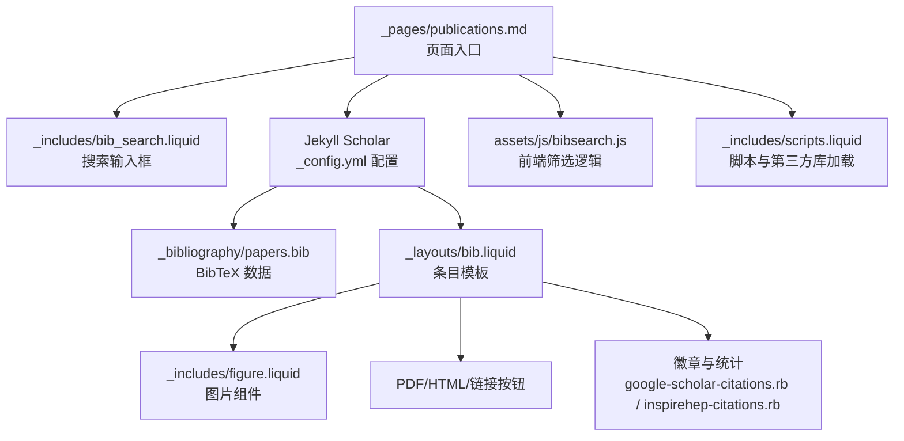
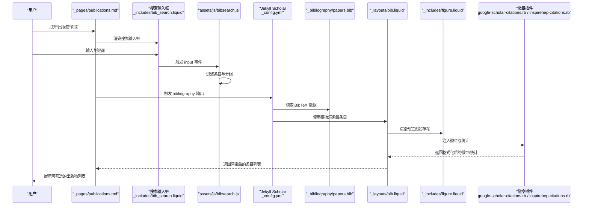
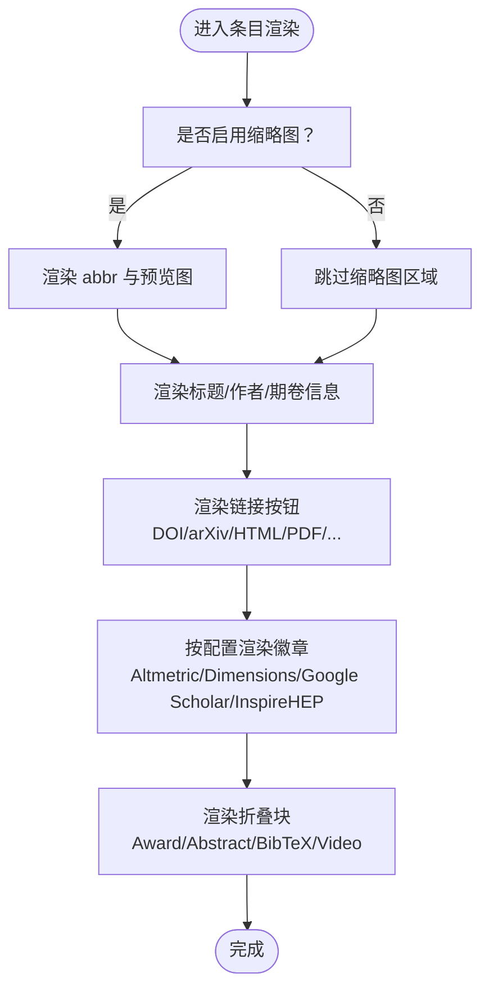
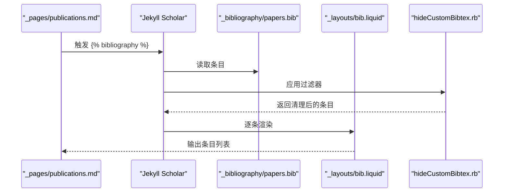
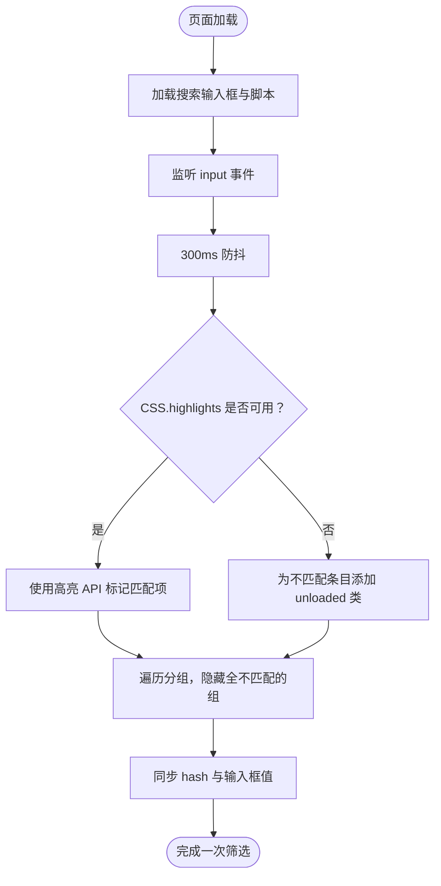
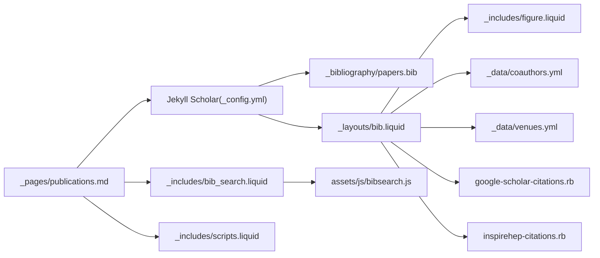

# 出版物展示生成

<cite>
**本文引用的文件**
- [_layouts/bib.liquid](file://_layouts/bib.liquid)
- [_includes/bib_search.liquid](file://_includes/bib_search.liquid)
- [_pages/publications.md](file://_pages/publications.md)
- [_bibliography/papers.bib](file://_bibliography/papers.bib)
- [_config.yml](file://_config.yml)
- [_plugins/google-scholar-citations.rb](file://_plugins/google-scholar-citations.rb)
- [_plugins/inspirehep-citations.rb](file://_plugins/inspirehep-citations.rb)
- [_plugins/hide-custom-bibtex.rb](file://_plugins/hide-custom-bibtex.rb)
- [_includes/figure.liquid](file://_includes/figure.liquid)
- [assets/js/bibsearch.js](file://assets/js/bibsearch.js)
- [_data/venues.yml](file://_data/venues.yml)
- [_data/coauthors.yml](file://_data/coauthors.yml)
- [_includes/scripts.liquid](file://_includes/scripts.liquid)
- [_sass/_base.scss](file://_sass/_base.scss)
- [_sass/_layout.scss](file://_sass/_layout.scss)
</cite>

## 目录
1. [简介](#简介)
2. [项目结构](#项目结构)
3. [核心组件](#核心组件)
4. [架构总览](#架构总览)
5. [组件详解](#组件详解)
6. [依赖关系分析](#依赖关系分析)
7. [性能与可访问性](#性能与可访问性)
8. [故障排查指南](#故障排查指南)
9. [结论](#结论)
10. [附录](#附录)

## 简介
本文件面向需要在 Jekyll 站点中生成与展示学术出版物（论文、报告等）的用户，系统讲解出版物页面的模板结构与渲染逻辑、引用条目生成与格式化规则、搜索功能实现与配置、PDF 文件关联与预览图设置、详情页定制与样式调整、响应式与移动端优化，以及批量处理与自动化工作流。内容基于仓库中的实际实现进行归纳总结，帮助读者快速上手并按需定制。

## 项目结构
围绕“出版物展示”的关键目录与文件如下：
- 布局与页面
  - 布局：_layouts/bib.liquid 负责单条出版物条目的渲染
  - 页面：_pages/publications.md 使用布局 page 并内嵌搜索与 bibliography 输出
- 数据与索引
  - 引文数据：_bibliography/papers.bib
  - 配置：_config.yml 中启用 Jekyll Scholar、搜索开关、缩略图与徽章等
- 搜索与交互
  - 搜索片段：_includes/bib_search.liquid
  - 前端脚本：assets/js/bibsearch.js
- 插件与过滤器
  - 徽章与统计：_plugins/google-scholar-citations.rb、_plugins/inspirehep-citations.rb
  - 过滤器：_plugins/hide-custom-bibtex.rb
- 图片与媒体
  - 图片组件：_includes/figure.liquid
  - 预览图路径约定：assets/img/publication_preview/
  - PDF 路径约定：assets/pdf/
- 样式与主题
  - 全局样式：_sass/_base.scss、_sass/_layout.scss
  - 脚本注入：_includes/scripts.liquid（含搜索、徽章脚本加载）

图表来源
- [_pages/publications.md:1-21](file://_pages/publications.md#L1-L21)
- [_includes/bib_search.liquid:1-5](file://_includes/bib_search.liquid#L1-L5)
- [_config.yml:264-330](file://_config.yml#L264-L330)
- [_layouts/bib.liquid:1-373](file://_layouts/bib.liquid#L1-L373)
- [_includes/figure.liquid:1-87](file://_includes/figure.liquid#L1-L87)
- [assets/js/bibsearch.js:1-71](file://assets/js/bibsearch.js#L1-L71)
- [_plugins/google-scholar-citations.rb:1-86](file://_plugins/google-scholar-citations.rb#L1-L86)
- [_plugins/inspirehep-citations.rb:1-58](file://_plugins/inspirehep-citations.rb#L1-L58)
- [_includes/scripts.liquid:1-337](file://_includes/scripts.liquid#L1-L337)

章节来源
- [_pages/publications.md:1-21](file://_pages/publications.md#L1-L21)
- [_config.yml:264-330](file://_config.yml#L264-L330)

## 核心组件
- 条目模板与渲染
  - _layouts/bib.liquid：负责标题、作者、期刊/会议信息、链接按钮、徽章、摘要/DOI/arXiv/BibTeX 折叠块等的渲染；支持缩略图、作者超链接、更多作者动画、注解气泡等
- 搜索功能
  - _includes/bib_search.liquid：条件加载搜索输入框与脚本
  - assets/js/bibsearch.js：基于 CSS.highlights 或回退策略对条目进行筛选，同时隐藏无匹配的分组标题
- 数据与配置
  - _bibliography/papers.bib：BibTeX 条目集合
  - _config.yml：Jekyll Scholar 开关、模板名、过滤关键词、作者上限、缩略图开关、视频嵌入开关、徽章开关等
- 徽章与统计
  - _plugins/google-scholar-citations.rb：抓取 Google Scholar 引用量并缓存
  - _plugins/inspirehep-citations.rb：抓取 InspireHEP 引用量并缓存
  - _plugins/hide-custom-bibtex.rb：输出前过滤自定义字段，避免泄露内部关键字
- 图片与媒体
  - _includes/figure.liquid：响应式图片与懒加载、WebP 生成、错误回退
  - 预览图路径：assets/img/publication_preview/；PDF 路径：assets/pdf/

章节来源
- [_layouts/bib.liquid:1-373](file://_layouts/bib.liquid#L1-L373)
- [_includes/bib_search.liquid:1-5](file://_includes/bib_search.liquid#L1-L5)
- [assets/js/bibsearch.js:1-71](file://assets/js/bibsearch.js#L1-L71)
- [_config.yml:264-330](file://_config.yml#L264-L330)
- [_plugins/google-scholar-citations.rb:1-86](file://_plugins/google-scholar-citations.rb#L1-L86)
- [_plugins/inspirehep-citations.rb:1-58](file://_plugins/inspirehep-citations.rb#L1-L58)
- [_plugins/hide-custom-bibtex.rb:1-19](file://_plugins/hide-custom-bibtex.rb#L1-L19)
- [_includes/figure.liquid:1-87](file://_includes/figure.liquid#L1-L87)

## 架构总览
下图展示了从页面到数据、模板、脚本与插件的整体调用链路：

图表来源
- [_pages/publications.md:1-21](file://_pages/publications.md#L1-L21)
- [_includes/bib_search.liquid:1-5](file://_includes/bib_search.liquid#L1-L5)
- [assets/js/bibsearch.js:1-71](file://assets/js/bibsearch.js#L1-L71)
- [_config.yml:264-330](file://_config.yml#L264-L330)
- [_layouts/bib.liquid:1-373](file://_layouts/bib.liquid#L1-L373)
- [_includes/figure.liquid:1-87](file://_includes/figure.liquid#L1-L87)
- [_plugins/google-scholar-citations.rb:1-86](file://_plugins/google-scholar-citations.rb#L1-L86)
- [_plugins/inspirehep-citations.rb:1-58](file://_plugins/inspirehep-citations.rb#L1-L58)

## 组件详解

### 模板与条目渲染（_layouts/bib.liquid）
- 结构组成
  - 缩略图区域：abbr、venue 样式、预览图（支持外链或本地 assets/img/publication_preview/）
  - 主体区域：标题、作者列表（含本人高亮、合著者链接）、期卷信息（journal/booktitle/school）、附加信息、注解气泡
  - 链接按钮：DOI、arXiv、BibTeX、HTML、PDF、Supp、Video、Blog、Code、Poster、Slides、Website
  - 徽章：Altmetric、Dimensions、Google Scholar、InspireHEP（按配置开启）
  - 折叠块：Award、Abstract、BibTeX、Video（按配置与字段存在情况显示）
- 关键特性
  - 作者上限与“更多作者”动画：受 max_author_limit 与 more_authors_animation_delay 控制
  - 作者高亮：根据 scholar.last_name 与 scholar.first_name 匹配当前作者
  - 合著者链接：通过 _data/coauthors.yml 映射到外部 URL
  - 期卷信息：根据 entry.type 自动选择 journal/booktitle/school，并拼接 month/year/location/additional_info
  - 预览图：优先使用外链；否则自动拼接 assets/img/publication_preview/ 并通过 _includes/figure.liquid 渲染
  - 视频：当启用视频嵌入时，点击 Video 按钮以弹出隐藏的视频块；否则直接跳转外链
- 可扩展钩子
  - 支持在站点根目录放置 _includes/hook/bib.liquid 作为额外渲染钩子（由模板条件 include）

图表来源
- [_layouts/bib.liquid:1-373](file://_layouts/bib.liquid#L1-L373)
- [_includes/figure.liquid:1-87](file://_includes/figure.liquid#L1-L87)
- [_data/coauthors.yml:1-35](file://_data/coauthors.yml#L1-L35)
- [_data/venues.yml:1-64](file://_data/venues.yml#L1-L64)

章节来源
- [_layouts/bib.liquid:1-373](file://_layouts/bib.liquid#L1-L373)
- [_data/coauthors.yml:1-35](file://_data/coauthors.yml#L1-L35)
- [_data/venues.yml:1-64](file://_data/venues.yml#L1-L64)

### 引用条目生成与格式化（Jekyll Scholar）
- 配置要点
  - 启用 jekyll-scholar 插件，设置 source、bibliography、bibliography_template、details_dir、details_link、query、group_by、group_order 等
  - 设置样式风格（style）、locale、bibtex_filters（如 latex、smallcaps、superscript）
  - filtered_bibtex_keywords：用于 hideCustomBibtex 过滤，避免内部关键字泄露到最终输出
- 渲染流程
  - 在页面中使用  触发输出
  - Jekyll Scholar 读取 _bibliography/papers.bib，按模板 _layouts/bib.liquid 渲染每条目
  - 使用 hideCustomBibtex 过滤器清理自定义字段与作者上标符号
- 作者高亮与合著者链接
  - 通过 _config.yml 的 scholar.last_name/scholar.first_name 判定“本人”
  - 通过 _data/coauthors.yml 将作者映射为外部链接

图表来源
- [_pages/publications.md:18-18](file://_pages/publications.md#L18-L18)
- [_config.yml:264-330](file://_config.yml#L264-L330)
- [_layouts/bib.liquid:1-373](file://_layouts/bib.liquid#L1-L373)
- [_plugins/hide-custom-bibtex.rb:1-19](file://_plugins/hide-custom-bibtex.rb#L1-L19)

章节来源
- [_config.yml:264-330](file://_config.yml#L264-L330)
- [_plugins/hide-custom-bibtex.rb:1-19](file://_plugins/hide-custom-bibtex.rb#L1-L19)

### 搜索功能（_includes/bib_search.liquid 与 assets/js/bibsearch.js）
- 页面集成
  - 在 _pages/publications.md 中引入 ，并在其后放置 
- 前端逻辑
  - 监听 input 事件，300ms 防抖
  - 若浏览器支持 CSS.highlights，则使用高亮 API；否则回退为简单类名切换
  - 对每个条目（li）计算文本匹配，不匹配则添加 “unloaded” 类
  - 遍历分组（h2 下的 ol），若某组全部条目被隐藏，则连同分组标题一并隐藏
  - 支持从 URL hash 初始化搜索词
- 性能与体验
  - 防抖减少频繁 DOM 操作
  - 仅对可见条目进行高亮，降低重绘压力
  - 分组隐藏避免空组导致的视觉混乱

图表来源
- [_includes/bib_search.liquid:1-5](file://_includes/bib_search.liquid#L1-L5)
- [assets/js/bibsearch.js:1-71](file://assets/js/bibsearch.js#L1-L71)

章节来源
- [_includes/bib_search.liquid:1-5](file://_includes/bib_search.liquid#L1-L5)
- [assets/js/bibsearch.js:1-71](file://assets/js/bibsearch.js#L1-L71)

### PDF 文件关联与预览图设置
- PDF 关联
  - 模板中若 entry.pdf 存在，会生成指向 assets/pdf/ 的链接（或外链）
  - 支持 poster、slides、supp 等其他 PDF 资源
- 预览图设置
  - 若 entry.preview 存在，且为外链则直接使用；否则拼接 assets/img/publication_preview/ 并通过 _includes/figure.liquid 渲染
  - figure.liquid 支持响应式 WebP 生成、懒加载、错误回退与可选缩放
- 路径约定
  - PDF：/assets/pdf/<文件名>
  - 预览图：/assets/img/publication_preview/<文件名>

章节来源
- [_layouts/bib.liquid:28-44](file://_layouts/bib.liquid#L28-L44)
- [_includes/figure.liquid:1-87](file://_includes/figure.liquid#L1-L87)

### 出版物详情页面定制与样式调整
- 定制选项
  - 条目模板：_layouts/bib.liquid 中可增删字段、按钮、徽章与折叠块
  - 分组与排序：_config.yml 的 group_by、group_order 控制年份分组与顺序
  - 作者显示：max_author_limit 限制显示数量，“更多作者”动画延迟由 more_authors_animation_delay 控制
  - 缩略图：enable_publication_thumbnails 控制是否显示 abbr 与预览图
  - 视频嵌入：enable_video_embedding 控制 Video 按钮行为
  - 徽章：enable_publication_badges 下各子项控制徽章类型
- 样式调整
  - 全局样式：_sass/_base.scss、_sass/_layout.scss
  - 脚本与第三方库：_includes/scripts.liquid（含徽章脚本异步加载）
  - 响应式图片：_includes/figure.liquid 内部已内置响应式与懒加载策略

章节来源
- [_config.yml:292-330](file://_config.yml#L292-L330)
- [_sass/_base.scss:1-200](file://_sass/_base.scss#L1-L200)
- [_sass/_layout.scss:1-54](file://_sass/_layout.scss#L1-L54)
- [_includes/scripts.liquid:190-196](file://_includes/scripts.liquid#L190-L196)

### 响应式设计与移动端优化
- 媒体与图片
  - _includes/figure.liquid：自动根据 imagick 宽度生成 WebP 源集，支持 sizes 属性与懒加载
  - 预览图与 PDF 资源均走相对路径，确保跨设备一致加载
- 搜索体验
  - 防抖与最小化 DOM 操作，降低移动端卡顿
  - 分组隐藏避免大量空白区块
- 样式基础
  - _sass/_layout.scss 设定容器最大宽度与滚动锚点偏移，提升阅读体验
  - _sass/_base.scss 提供统一色彩变量与基础排版

章节来源
- [_includes/figure.liquid:16-33](file://_includes/figure.liquid#L16-L33)
- [assets/js/bibsearch.js:59-65](file://assets/js/bibsearch.js#L59-L65)
- [_sass/_layout.scss:30-32](file://_sass/_layout.scss#L30-L32)

### 批量处理与自动化工作流
- BibTeX 数据管理
  - 将多篇条目集中于 _bibliography/papers.bib，便于版本控制与批量编辑
  - 使用 filtered_bibtex_keywords 与 hideCustomBibtex 过滤器，确保输出整洁
- 徽章与统计抓取
  - google-scholar-citations.rb 与 inspirehep-citations.rb 会在渲染时抓取并缓存引用量，建议在构建机上运行以避免网络波动
- 构建与部署
  - 使用 Jekyll 插件生态（如 jekyll-scholar、jekyll-minifier、terser 等）在 CI 中自动化构建与压缩
  - 第三方库通过 _includes/scripts.liquid 按需加载，减少首屏负担

章节来源
- [_plugins/google-scholar-citations.rb:1-86](file://_plugins/google-scholar-citations.rb#L1-L86)
- [_plugins/inspirehep-citations.rb:1-58](file://_plugins/inspirehep-citations.rb#L1-L58)
- [_plugins/hide-custom-bibtex.rb:1-19](file://_plugins/hide-custom-bibtex.rb#L1-L19)
- [_includes/scripts.liquid:190-196](file://_includes/scripts.liquid#L190-L196)

## 依赖关系分析
- 模板与数据
  - _pages/publications.md 依赖 Jekyll Scholar 与 _layouts/bib.liquid
  - _layouts/bib.liquid 依赖 _includes/figure.liquid、_data/coauthors.yml、_data/venues.yml
- 搜索与交互
  - _includes/bib_search.liquid 依赖 assets/js/bibsearch.js
  - assets/js/bibsearch.js 依赖页面结构（.bibliography、li、h2、ol）
- 徽章与统计
  - _layouts/bib.liquid 依赖 google-scholar-citations.rb 与 inspirehep-citations.rb
- 样式与脚本
  - _includes/scripts.liquid 统一加载第三方库与徽章脚本

图表来源
- [_pages/publications.md:1-21](file://_pages/publications.md#L1-L21)
- [_config.yml:264-330](file://_config.yml#L264-L330)
- [_layouts/bib.liquid:1-373](file://_layouts/bib.liquid#L1-L373)
- [_includes/figure.liquid:1-87](file://_includes/figure.liquid#L1-L87)
- [_data/coauthors.yml:1-35](file://_data/coauthors.yml#L1-L35)
- [_data/venues.yml:1-64](file://_data/venues.yml#L1-L64)
- [_includes/bib_search.liquid:1-5](file://_includes/bib_search.liquid#L1-L5)
- [assets/js/bibsearch.js:1-71](file://assets/js/bibsearch.js#L1-L71)
- [_plugins/google-scholar-citations.rb:1-86](file://_plugins/google-scholar-citations.rb#L1-L86)
- [_plugins/inspirehep-citations.rb:1-58](file://_plugins/inspirehep-citations.rb#L1-L58)
- [_includes/scripts.liquid:190-196](file://_includes/scripts.liquid#L190-L196)

章节来源
- [_pages/publications.md:1-21](file://_pages/publications.md#L1-L21)
- [_config.yml:264-330](file://_config.yml#L264-L330)

## 性能与可访问性
- 性能
  - 搜索防抖与最小化 DOM 操作，避免频繁重排
  - 图片懒加载与 WebP 生成，降低带宽与首屏时间
  - 分组隐藏减少不可见元素数量
- 可访问性
  - 按钮使用语义 role 与可读标题
  - 折叠块提供隐藏/显示状态，支持键盘操作
  - 图片提供 alt 与可选 caption

[本节为通用指导，无需特定文件引用]

## 故障排查指南
- 搜索框未出现
  - 检查 _config.yml 中 bib_search 是否开启
  - 确认 _pages/publications.md 已包含 
- 搜索无效或卡顿
  - 确认 assets/js/bibsearch.js 已正确加载（type="module"）
  - 检查浏览器是否支持 CSS.highlights；不支持时将回退为类名切换
- PDF/预览图无法显示
  - 确认文件位于 assets/pdf/ 或 assets/img/publication_preview/
  - 外链请检查协议与可访问性
- 徽章不显示
  - 检查 _config.yml 中对应徽章开关是否开启
  - 确认网络可访问徽章服务（Altmetric、Dimensions）
- 引用量抓取失败
  - google-scholar-citations.rb 与 inspirehep-citations.rb 会打印错误日志，可在构建日志中查看
  - 建议在构建机上运行以避免速率限制

章节来源
- [_includes/bib_search.liquid:1-5](file://_includes/bib_search.liquid#L1-L5)
- [assets/js/bibsearch.js:1-71](file://assets/js/bibsearch.js#L1-L71)
- [_config.yml:292-330](file://_config.yml#L292-L330)
- [_plugins/google-scholar-citations.rb:71-77](file://_plugins/google-scholar-citations.rb#L71-L77)
- [_plugins/inspirehep-citations.rb:43-49](file://_plugins/inspirehep-citations.rb#L43-L49)

## 结论
该出版物展示系统以 Jekyll Scholar 为核心，结合自定义模板、搜索脚本与徽章插件，实现了从数据到渲染、从筛选到统计的完整闭环。通过合理的配置与少量扩展，即可满足个人主页的学术出版物展示需求，并具备良好的可维护性与可扩展性。

[本节为总结性内容，无需特定文件引用]

## 附录
- 快速对照表
  - 模板：_layouts/bib.liquid
  - 页面：_pages/publications.md
  - 数据：_bibliography/papers.bib
  - 搜索：_includes/bib_search.liquid、assets/js/bibsearch.js
  - 徽章：_plugins/google-scholar-citations.rb、_plugins/inspirehep-citations.rb
  - 过滤：_plugins/hide-custom-bibtex.rb
  - 图片：_includes/figure.liquid
  - 样式：_sass/_base.scss、_sass/_layout.scss、_includes/scripts.liquid

[本节为辅助信息，无需特定文件引用]