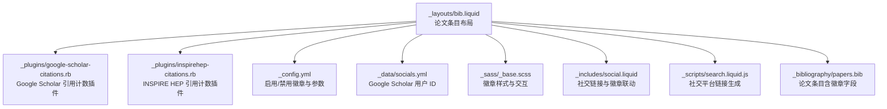
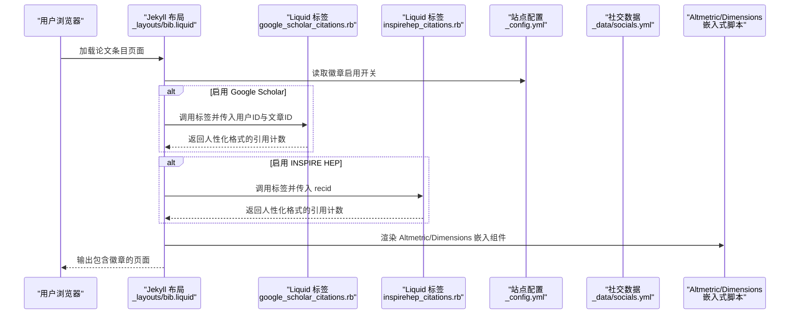
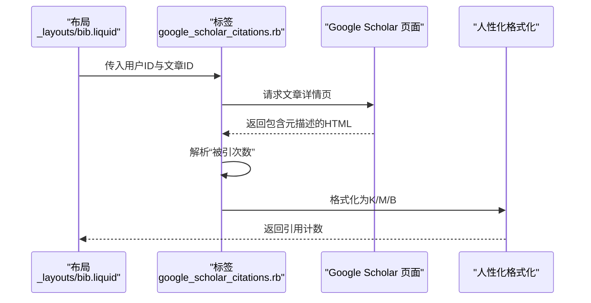
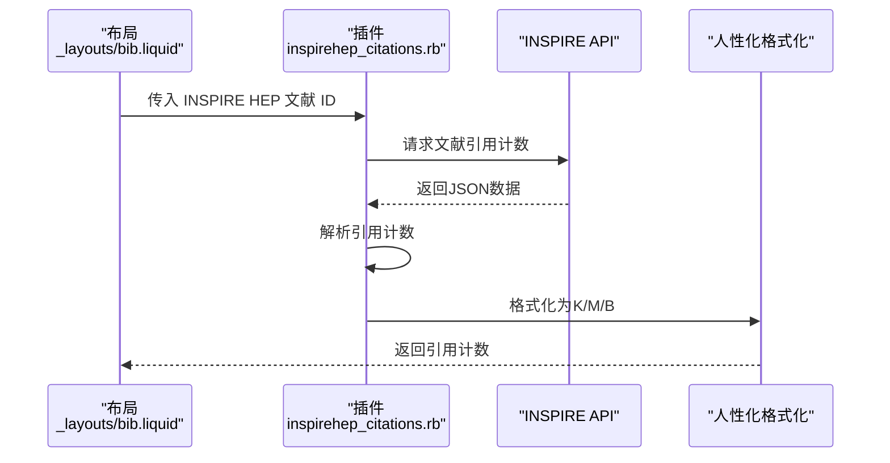
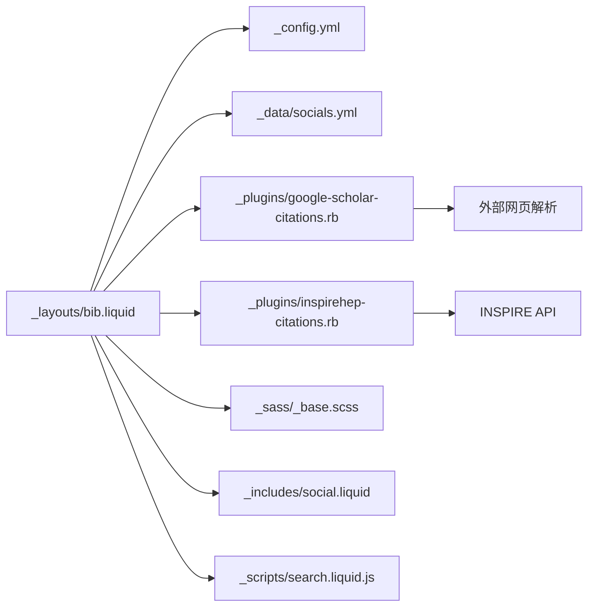

# 出版物徽章系统

<cite>
**本文档引用的文件**
- [_layouts/bib.liquid](file://_layouts/bib.liquid)
- [_plugins/google-scholar-citations.rb](file://_plugins/google-scholar-citations.rb)
- [_plugins/inspirehep-citations.rb](file://_plugins/inspirehep-citations.rb)
- [_config.yml](file://_config.yml)
- [_data/socials.yml](file://_data/socials.yml)
- [_sass/_base.scss](file://_sass/_base.scss)
- [_bibliography/papers.bib](file://_bibliography/papers.bib)
- [_includes/social.liquid](file://_includes/social.liquid)
- [_scripts/search.liquid.js](file://_scripts/search.liquid.js)
</cite>

## 目录
1. [简介](#简介)
2. [项目结构](#项目结构)
3. [核心组件](#核心组件)
4. [架构总览](#架构总览)
5. [详细组件分析](#详细组件分析)
6. [依赖关系分析](#依赖关系分析)
7. [性能考量](#性能考量)
8. [故障排除指南](#故障排除指南)
9. [结论](#结论)
10. [附录](#附录)

## 简介
本文件系统性阐述该个人主页中的“出版物徽章系统”，覆盖以下四类学术徽章：
- Google Scholar 徽章：基于外部服务徽章与自定义 Liquid 标签组合实现的引用计数展示。
- Altmetric 徽章：通过嵌入式 JavaScript 组件在页面中渲染开放科学指标徽章。
- Dimensions 徽章：通过嵌入式 JavaScript 组件在页面中渲染科研指标徽章。
- INSPIRE HEP 徽章：基于 INSPIRE API 的引用计数获取与格式化展示。

文档内容涵盖各徽章的功能与用途、集成方式与配置参数、显示位置与样式定制、数据获取原理与更新机制、第三方 API 密钥配置与安全注意事项、缓存策略与性能优化、故障排除与替代方案，并提供可视化图示帮助理解。

## 项目结构
围绕出版物徽章系统的关键文件与目录如下：
- 布局模板：用于在论文条目中插入徽章区域与控制开关
- 插件：为 Google Scholar 与 INSPIRE HEP 提供动态引用计数
- 配置：启用/禁用各类徽章及默认参数
- 数据：社交账号信息（含 Google Scholar 用户 ID）
- 样式：控制徽章容器与元素的显示与交互
- 资源：徽章所需的第三方脚本与样式资源

图表来源
- [_layouts/bib.liquid:257-340](file://_layouts/bib.liquid#L257-L340)
- [_plugins/google-scholar-citations.rb:10-85](file://_plugins/google-scholar-citations.rb#L10-L85)
- [_plugins/inspirehep-citations.rb:10-57](file://_plugins/inspirehep-citations.rb#L10-L57)
- [_config.yml:292-325](file://_config.yml#L292-L325)
- [_data/socials.yml](file://_data/socials.yml#L34)
- [_sass/_base.scss:810-823](file://_sass/_base.scss#L810-L823)
- [_includes/social.liquid:59-60](file://_includes/social.liquid#L59-L60)
- [_scripts/search.liquid.js:218-221](file://_scripts/search.liquid.js#L218-L221)
- [_bibliography/papers.bib:6-74](file://_bibliography/papers.bib#L6-L74)

章节来源
- [_layouts/bib.liquid:257-340](file://_layouts/bib.liquid#L257-L340)
- [_config.yml:292-325](file://_config.yml#L292-L325)

## 核心组件
- 论文布局与徽章容器
  - 在论文条目布局中，通过条件判断决定是否渲染徽章区域，并为每种徽章设置对应的参数与属性。
  - Altmetric 与 Dimensions 使用嵌入式脚本组件，通过特定类名与数据属性进行初始化。
  - Google Scholar 与 INSPIRE HEP 使用外部徽章图片或嵌入式组件，分别由自定义 Liquid 标签与插件提供数据。
- 自定义 Liquid 标签与插件
  - Google Scholar 引用计数标签：解析文章页面元描述提取“被引次数”，并进行人性化数字格式化；支持缓存避免重复抓取。
  - INSPIRE HEP 引用计数插件：调用 INSPIRE API 获取文献的引用计数，进行人性化数字格式化；同样具备缓存机制。
- 配置与数据
  - 通过站点配置启用/禁用各类徽章，并可设置过滤关键词以隐藏内部字段。
  - 社交账号数据中包含 Google Scholar 用户 ID，用于生成 Google Scholar 链接与徽章图片。
- 样式与交互
  - 徽章容器使用内联样式与类名控制间距与对齐；悬停时提供下划线等交互反馈。
  - Altmetric 与 Dimensions 的弹出提示与图例位置可通过数据属性微调。

章节来源
- [_layouts/bib.liquid:257-340](file://_layouts/bib.liquid#L257-L340)
- [_plugins/google-scholar-citations.rb:10-85](file://_plugins/google-scholar-citations.rb#L10-L85)
- [_plugins/inspirehep-citations.rb:10-57](file://_plugins/inspirehep-citations.rb#L10-L57)
- [_config.yml:292-325](file://_config.yml#L292-L325)
- [_data/socials.yml](file://_data/socials.yml#L34)
- [_sass/_base.scss:810-823](file://_sass/_base.scss#L810-L823)

## 架构总览
下图展示了从论文条目到最终徽章渲染的整体流程，包括数据来源、处理逻辑与第三方服务交互：

图表来源
- [_layouts/bib.liquid:257-340](file://_layouts/bib.liquid#L257-L340)
- [_plugins/google-scholar-citations.rb:10-85](file://_plugins/google-scholar-citations.rb#L10-L85)
- [_plugins/inspirehep-citations.rb:10-57](file://_plugins/inspirehep-citations.rb#L10-L57)
- [_config.yml:292-325](file://_config.yml#L292-L325)
- [_data/socials.yml](file://_data/socials.yml#L34)

## 详细组件分析

### Google Scholar 徽章
- 功能与用途
  - 展示单篇论文在 Google Scholar 中的“被引次数”，并以友好格式显示（如 K/M/B）。
- 集成方法与配置参数
  - 在论文条目中，若存在 Google Scholar 文献 ID，则自动渲染徽章图片链接。
  - 图片地址由外部徽章服务生成，参数包含“引用计数”与“Google Scholar”标识。
  - 引用计数通过自定义 Liquid 标签从目标文章页面解析得到，并进行人性化格式化。
- 显示位置与样式定制
  - 徽章位于论文条目右侧的徽章容器中，采用内联块级元素与垂直对齐，悬停时带下划线。
  - 可通过容器样式调整间距与对齐方式。
- 数据获取原理与更新机制
  - 标签会访问目标文章页面，解析页面元描述中的“被引次数”文本并提取数字。
  - 为避免频繁抓取，实现内置缓存字典；同时引入随机延时降低被反爬虫限制的风险。
- 第三方 API 密钥与安全
  - 本实现不直接调用 Google Scholar 的公开 API，而是解析网页元数据；无需密钥。
  - 注意：网页结构可能变化导致解析失败，建议定期检查。
- 故障排除与替代方案
  - 若解析失败，返回“N/A”；可检查文章页面是否存在预期的元描述标签。
  - 替代方案：若需更稳定的数据，可考虑使用官方 API（需额外开发适配层）。

图表来源
- [_layouts/bib.liquid:314-324](file://_layouts/bib.liquid#L314-L324)
- [_plugins/google-scholar-citations.rb:28-81](file://_plugins/google-scholar-citations.rb#L28-L81)

章节来源
- [_layouts/bib.liquid:314-324](file://_layouts/bib.liquid#L314-L324)
- [_plugins/google-scholar-citations.rb:10-85](file://_plugins/google-scholar-citations.rb#L10-L85)
- [_data/socials.yml](file://_data/socials.yml#L34)

### Altmetric 徽章
- 功能与用途
  - 展示论文在 Altmetric 平台上的综合影响力指标，支持弹出式详情面板。
- 集成方法与配置参数
  - 通过嵌入特定类名与数据属性（如徽章类型、弹出方向、ID 源）实现初始化。
  - 支持多种 ID 源（显式 ID、arXiv、DOI、PMID、ISBN），优先级按顺序选择。
- 显示位置与样式定制
  - 徽章容器内联显示，支持弹出提示与图例位置微调。
- 数据获取原理与更新机制
  - 由第三方脚本负责拉取与渲染，通常具备自动刷新能力。
- 第三方 API 密钥与安全
  - 默认使用公开接口；若需企业级功能，可参考其官方文档配置密钥。
- 故障排除与替代方案
  - 若未显示，检查网络与脚本加载状态；确认论文是否已收录至 Altmetric 数据库。

章节来源
- [_layouts/bib.liquid:279-297](file://_layouts/bib.liquid#L279-L297)

### Dimensions 徽章
- 功能与用途
  - 展示论文在 Dimensions 平台上的科研指标徽章，支持小尺寸矩形样式与悬浮图例。
- 集成方法与配置参数
  - 通过嵌入特定类名与数据属性（如 ID 或 DOI/PMID）实现初始化。
  - 支持指定样式与图例位置，便于与页面风格融合。
- 显示位置与样式定制
  - 徽章容器内联显示，支持底部留白以避免遮挡内容。
- 数据获取原理与更新机制
  - 由第三方脚本负责拉取与渲染，通常具备自动刷新能力。
- 第三方 API 密钥与安全
  - 默认使用公开接口；若需企业级功能，可参考其官方文档配置密钥。
- 故障排除与替代方案
  - 若未显示，检查网络与脚本加载状态；确认论文是否已收录至 Dimensions 数据库。

章节来源
- [_layouts/bib.liquid:299-312](file://_layouts/bib.liquid#L299-L312)

### INSPIRE HEP 徽章
- 功能与用途
  - 展示高能物理领域论文在 INSPIRE HEP 平台上的引用计数，并以友好格式显示。
- 集成方法与配置参数
  - 在论文条目中，若存在 INSPIRE HEP 文献 ID，则自动渲染徽章图片链接。
  - 引用计数通过自定义 Liquid 标签调用 INSPIRE API 获取并进行人性化格式化。
- 显示位置与样式定制
  - 与 Google Scholar 徽章类似，位于徽章容器中，采用内联块级元素与垂直对齐。
- 数据获取原理与更新机制
  - 标签会请求 INSPIRE API，解析返回的 JSON 结构提取引用计数。
  - 实现内置缓存字典与人性化格式化，避免重复请求与提升可读性。
- 第三方 API 密钥与安全
  - 本实现直接调用公开 API，无需密钥。
  - 注意：API 限流或返回结构变化可能导致失败，建议监控与降级策略。
- 故障排除与替代方案
  - 若返回“N/A”，检查文献 ID 是否正确以及 API 可达性；必要时手动验证 API 响应。

图表来源
- [_layouts/bib.liquid:326-336](file://_layouts/bib.liquid#L326-L336)
- [_plugins/inspirehep-citations.rb:19-52](file://_plugins/inspirehep-citations.rb#L19-L52)

章节来源
- [_layouts/bib.liquid:326-336](file://_layouts/bib.liquid#L326-L336)
- [_plugins/inspirehep-citations.rb:10-57](file://_plugins/inspirehep-citations.rb#L10-L57)

### 徽章显示效果与实际案例
- 显示位置
  - 徽章统一放置于论文条目的徽章容器中，位于链接按钮组下方，确保视觉层次清晰。
- 样式与交互
  - 容器内联块级显示，悬停时带下划线；支持弹出提示与图例位置微调。
- 实际案例
  - 论文条目中包含 Google Scholar 与 INSPIRE HEP 徽章图片链接，Altmetric 与 Dimensions 通过嵌入式组件渲染。
  - 社交链接中包含 Google Scholar 主页入口，便于跳转查看作者整体引用情况。

章节来源
- [_layouts/bib.liquid:257-340](file://_layouts/bib.liquid#L257-L340)
- [_includes/social.liquid:59-60](file://_includes/social.liquid#L59-L60)
- [_scripts/search.liquid.js:218-221](file://_scripts/search.liquid.js#L218-L221)

## 依赖关系分析
- 组件耦合与协作
  - 布局模板是中枢，根据站点配置与条目字段决定是否渲染徽章。
  - 自定义标签/插件负责与第三方服务交互并返回格式化后的引用计数。
  - 样式文件提供徽章容器与交互行为，确保跨浏览器一致性。
- 外部依赖
  - Altmetric 与 Dimensions 的嵌入式脚本需要网络可达。
  - Google Scholar 与 INSPIRE HEP 的解析与 API 调用受第三方服务可用性影响。
- 潜在循环依赖
  - 当前结构为单向依赖（布局 → 插件/标签 → 外部服务），无循环依赖风险。

图表来源
- [_layouts/bib.liquid:257-340](file://_layouts/bib.liquid#L257-L340)
- [_config.yml:292-325](file://_config.yml#L292-L325)
- [_data/socials.yml](file://_data/socials.yml#L34)
- [_plugins/google-scholar-citations.rb:10-85](file://_plugins/google-scholar-citations.rb#L10-L85)
- [_plugins/inspirehep-citations.rb:10-57](file://_plugins/inspirehep-citations.rb#L10-L57)
- [_sass/_base.scss:810-823](file://_sass/_base.scss#L810-L823)
- [_includes/social.liquid:59-60](file://_includes/social.liquid#L59-L60)
- [_scripts/search.liquid.js:218-221](file://_scripts/search.liquid.js#L218-L221)

章节来源
- [_layouts/bib.liquid:257-340](file://_layouts/bib.liquid#L257-L340)
- [_plugins/google-scholar-citations.rb:10-85](file://_plugins/google-scholar-citations.rb#L10-L85)
- [_plugins/inspirehep-citations.rb:10-57](file://_plugins/inspirehep-citations.rb#L10-L57)

## 性能考量
- 缓存策略
  - Google Scholar 与 INSPIRE HEP 插件均维护内存级缓存字典，避免重复抓取与 API 调用。
- 网络与并发
  - Google Scholar 插件引入随机延时，降低被反爬虫限制的风险，但会增加构建时间。
- 样式与脚本
  - Altmetric 与 Dimensions 的嵌入式脚本在首屏后异步渲染，避免阻塞页面主线程。
- 建议优化
  - 对于大量论文条目，可考虑将引用计数预计算并写入条目元数据，减少运行时解析成本。
  - 将第三方脚本置于页面底部或使用延迟加载策略，进一步提升首屏性能。

[本节为通用性能讨论，不直接分析具体文件]

## 故障排除指南
- Google Scholar 徽章显示“N/A”
  - 检查文章页面是否存在预期的元描述标签；确认文章 ID 正确且可见。
  - 若网络受限或被临时屏蔽，可稍后重试或调整延时策略。
- INSPIRE HEP 徽章显示“N/A”
  - 检查文献 ID 是否正确；确认 API 可达且返回结构未变更。
  - 如遇限流，可考虑降低请求频率或增加本地缓存周期。
- Altmetric/Dimensions 徽章不显示
  - 检查网络与脚本加载状态；确认论文已被收录至对应数据库。
  - 调整数据属性（如 ID 源、弹出方向、样式）以匹配条目字段。
- 样式异常
  - 检查徽章容器的内联样式与类名；确保未被其他样式覆盖。
  - 调整容器间距与对齐方式，避免遮挡正文或按钮组。

章节来源
- [_plugins/google-scholar-citations.rb:71-77](file://_plugins/google-scholar-citations.rb#L71-L77)
- [_plugins/inspirehep-citations.rb:43-49](file://_plugins/inspirehep-citations.rb#L43-L49)
- [_sass/_base.scss:810-823](file://_sass/_base.scss#L810-L823)

## 结论
该出版物徽章系统通过布局模板、自定义标签/插件与第三方嵌入式组件的协同，实现了对 Google Scholar、Altmetric、Dimensions 与 INSPIRE HEP 的统一展示。系统具备基础缓存与人性化格式化能力，满足日常展示需求。对于高并发与大规模论文集，建议引入预计算与本地缓存策略，以进一步提升性能与稳定性。

[本节为总结性内容，不直接分析具体文件]

## 附录
- 配置项速览
  - 启用/禁用徽章：在站点配置中设置布尔值与过滤关键词。
  - Google Scholar 用户 ID：在社交数据中配置，用于生成链接与徽章图片。
- 论文条目字段
  - Google Scholar 文献 ID、INSPIRE HEP 文献 ID、Altmetric/Dimensions ID 源（可选）。
- 社交链接联动
  - 社交数据中的 Google Scholar 用户 ID 与布局中的链接生成脚本共同作用，形成完整的学术主页导航。

章节来源
- [_config.yml:292-325](file://_config.yml#L292-L325)
- [_data/socials.yml](file://_data/socials.yml#L34)
- [_scripts/search.liquid.js:218-221](file://_scripts/search.liquid.js#L218-L221)
- [_includes/social.liquid:59-60](file://_includes/social.liquid#L59-L60)
- [_bibliography/papers.bib:6-74](file://_bibliography/papers.bib#L6-L74)