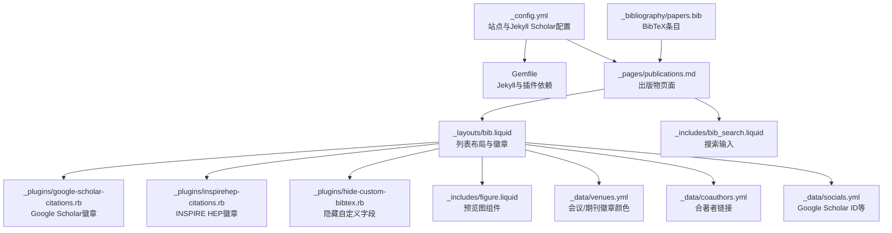
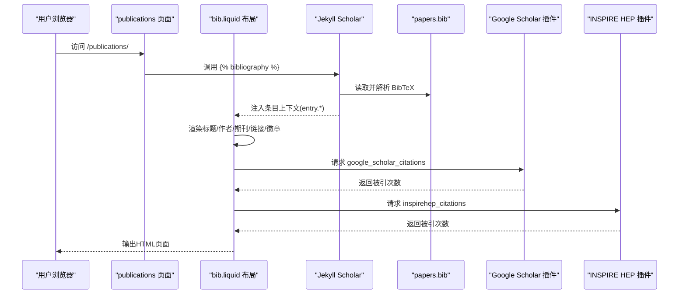
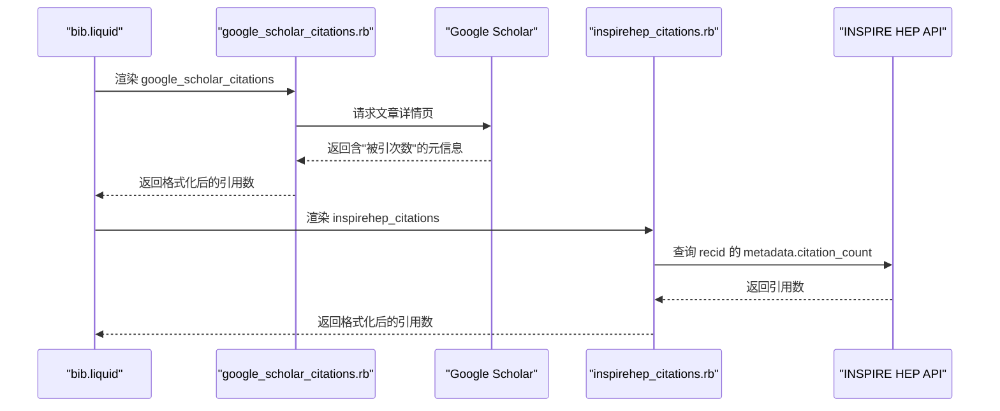
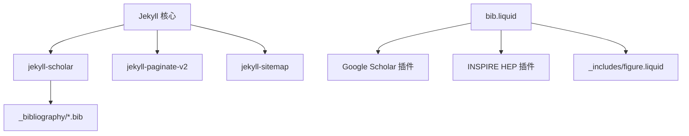

# 学术出版物管理

<cite>
**本文档引用的文件**
- [_config.yml](file://_config.yml)
- [Gemfile](file://Gemfile)
- [_pages/publications.md](file://_pages/publications.md)
- [_layouts/bib.liquid](file://_layouts/bib.liquid)
- [_includes/bib_search.liquid](file://_includes/bib_search.liquid)
- [_includes/figure.liquid](file://_includes/figure.liquid)
- [_includes/citation.liquid](file://_includes/citation.liquid)
- [_plugins/google-scholar-citations.rb](file://_plugins/google-scholar-citations.rb)
- [_plugins/inspirehep-citations.rb](file://_plugins/inspirehep-citations.rb)
- [_plugins/hide-custom-bibtex.rb](file://_plugins/hide-custom-bibtex.rb)
- [_bibliography/papers.bib](file://_bibliography/papers.bib)
- [_data/venues.yml](file://_data/venues.yml)
- [_data/coauthors.yml](file://_data/coauthors.yml)
- [_data/socials.yml](file://_data/socials.yml)
- [README.md](file://README.md)
</cite>

## 目录
1. [简介](#简介)
2. [项目结构](#项目结构)
3. [核心组件](#核心组件)
4. [架构总览](#架构总览)
5. [详细组件分析](#详细组件分析)
6. [依赖关系分析](#依赖关系分析)
7. [性能考量](#性能考量)
8. [故障排查指南](#故障排查指南)
9. [结论](#结论)
10. [附录](#附录)

## 简介
本文件面向学术出版物管理系统，围绕以下目标展开：  
- 解释 BibTeX 文件的编写规范与字段配置（必填与可选字段），以及在本系统中的使用方式  
- 详解 Jekyll Scholar 插件的配置与使用（引用样式、排序规则、过滤条件等）  
- 介绍出版物徽章系统（Altmetric、Dimensions、Google Scholar、INSPIRE HEP）的集成与定制  
- 说明出版物详情页面生成、PDF 关联与预览图设置  
- 提供学术写作最佳实践与引用管理建议  
- 给出 BibTeX 示例与配置模板路径  

该系统基于 Jekyll + Jekyll Scholar 构建，通过 Liquid 模板渲染出版物列表与详情页，并通过自定义插件实现外部引用统计徽章。

## 项目结构
该仓库采用 Jekyll 标准目录组织，关键与出版物相关的目录与文件如下：
- 配置与插件
  - 站点配置：[_config.yml](file://_config.yml)
  - Ruby 依赖：[Gemfile](file://Gemfile)
  - 自定义插件：[_plugins/*.rb](file://_plugins/google-scholar-citations.rb)
- 出版物数据与页面
  - BibTeX 数据：[_bibliography/papers.bib](file://_bibliography/papers.bib)
  - 出版物页面：[_pages/publications.md](file://_pages/publications.md)
  - 列表布局：[_layouts/bib.liquid](file://_layouts/bib.liquid)
  - 搜索输入：[_includes/bib_search.liquid](file://_includes/bib_search.liquid)
- 辅助与数据
  - 图片组件：[_includes/figure.liquid](file://_includes/figure.liquid)
  - 引用模板：[_includes/citation.liquid](file://_includes/citation.liquid)
  - 会议/期刊映射：[_data/venues.yml](file://_data/venues.yml)
  - 合作者信息：[_data/coauthors.yml](file://_data/coauthors.yml)
  - 社交账号与 ID：[_data/socials.yml](file://_data/socials.yml)



图表来源
- [_config.yml](file://_config.yml)
- [Gemfile](file://Gemfile)
- [_pages/publications.md](file://_pages/publications.md)
- [_layouts/bib.liquid](file://_layouts/bib.liquid)
- [_includes/bib_search.liquid](file://_includes/bib_search.liquid)
- [_plugins/google-scholar-citations.rb](file://_plugins/google-scholar-citations.rb)
- [_plugins/inspirehep-citations.rb](file://_plugins/inspirehep-citations.rb)
- [_plugins/hide-custom-bibtex.rb](file://_plugins/hide-custom-bibtex.rb)
- [_includes/figure.liquid](file://_includes/figure.liquid)
- [_data/venues.yml](file://_data/venues.yml)
- [_data/coauthors.yml](file://_data/coauthors.yml)
- [_data/socials.yml](file://_data/socials.yml)
- [_bibliography/papers.bib](file://_bibliography/papers.bib)

章节来源
- [_config.yml](file://_config.yml)
- [Gemfile](file://Gemfile)
- [_pages/publications.md](file://_pages/publications.md)

## 核心组件
- Jekyll Scholar 配置与渲染
  - 在站点配置中启用 scholar 模块，指定作者名、样式、本地化、BibTeX 源、分组与排序等
  - 使用布局模板渲染出版物列表，支持详情页生成与徽章显示
- 自定义插件
  - Google Scholar 徽章：抓取“被引次数”并格式化展示
  - INSPIRE HEP 徽章：调用官方 API 获取引用计数
  - BibTeX 字段过滤：隐藏内部关键字字段，美化作者标注
- 前端交互与媒体
  - 搜索框与脚本加载，支持按关键词筛选
  - 预览图组件，支持响应式 WebP 与懒加载
- 数据与映射
  - 会议/期刊徽章颜色与链接映射
  - 合作者姓名到外部链接的映射
  - 社交账号与 ID（如 Google Scholar 用户 ID）

章节来源
- [_config.yml](file://_config.yml)
- [_layouts/bib.liquid](file://_layouts/bib.liquid)
- [_plugins/google-scholar-citations.rb](file://_plugins/google-scholar-citations.rb)
- [_plugins/inspirehep-citations.rb](file://_plugins/inspirehep-citations.rb)
- [_plugins/hide-custom-bibtex.rb](file://_plugins/hide-custom-bibtex.rb)
- [_includes/bib_search.liquid](file://_includes/bib_search.liquid)
- [_includes/figure.liquid](file://_includes/figure.liquid)
- [_data/venues.yml](file://_data/venues.yml)
- [_data/coauthors.yml](file://_data/coauthors.yml)
- [_data/socials.yml](file://_data/socials.yml)

## 架构总览
下图展示了从数据到页面渲染的关键流程：BibTeX 条目经 Jekyll Scholar 渲染为列表；布局模板负责徽章、按钮与预览图；自定义插件负责外部引用统计；前端脚本提供搜索能力。



图表来源
- [_pages/publications.md](file://_pages/publications.md)
- [_layouts/bib.liquid](file://_layouts/bib.liquid)
- [_plugins/google-scholar-citations.rb](file://_plugins/google-scholar-citations.rb)
- [_plugins/inspirehep-citations.rb](file://_plugins/inspirehep-citations.rb)
- [_bibliography/papers.bib](file://_bibliography/papers.bib)

## 详细组件分析

### Jekyll Scholar 配置与使用
- 作者识别与样式
  - last_name/first_name：用于高亮“本人”作者与合著者链接
  - style：引用样式（如 apa）
  - locale：本地化（如 en）
- 数据源与输出
  - source：BibTeX 源目录
  - bibliography：主文件名
  - bibliography_template：列表布局模板名
  - bibtex_filters：启用 latex/smallcaps/superscript 预处理
- 分组与排序
  - details_dir/details_link：详情页目录与链接文本
  - query：查询表达式（默认匹配所有条目）
  - group_by/group_order：按年份分组并降序排列
- 字段过滤
  - filtered_bibtex_keywords：构建时自动隐藏的内部关键字（如 abbr、pdf、preview、selected 等）

章节来源
- [_config.yml](file://_config.yml)
- [_plugins/hide-custom-bibtex.rb](file://_plugins/hide-custom-bibtex.rb)

### BibTeX 编写规范与字段配置
- 必填字段
  - 通用：author、title、year
  - 会议论文：booktitle（或 incollection 的 booktitle）
  - 期刊文章：journal
- 常用可选字段（在本系统中可用）
  - abbr：会议简称，用于徽章显示与着色
  - pdf/poster/slides/supp/video/blog/code/website/html：资源链接
  - arxiv/eprint/doi：数字对象标识符
  - abstract：摘要
  - selected：是否在精选列表中显示
  - preview：预览图路径（相对 assets/img/publication_preview/ 或绝对 URL）
  - google_scholar_id/inspirehep_id：外部引用统计徽章所需 ID
  - altmetric/dimensions：徽章 ID 或开关
  - annotation：悬停提示信息
  - note/additional_info：附加说明
- 内部关键字（构建时会被过滤）
  - abbr、abstract、additional_info、altmetric、annotation、arxiv、award、award_name、bibtex_show、blog、code、google_scholar_id、html、inspirehep_id、pdf、poster、preview、selected、slides、supp、video、website

章节来源
- [_config.yml](file://_config.yml)
- [_plugins/hide-custom-bibtex.rb](file://_plugins/hide-custom-bibtex.rb)
- [_layouts/bib.liquid](file://_layouts/bib.liquid)
- [_bibliography/papers.bib](file://_bibliography/papers.bib)

### 出版物列表布局与徽章系统
- 布局逻辑
  - 作者高亮与合著者链接：根据 last_name/first_name 与 coauthors 映射
  - 会议/期刊/论文集显示：根据条目类型动态拼接
  - 链接按钮：根据字段存在性显示 PDF、HTML、arXiv、DOI、Blog、Code、Poster、Slides、Video、Website 等
  - 预览图：当启用缩略图且存在 preview 字段时显示
- 徽章系统
  - Altmetric：根据 altmetric 字段或 arxiv/doi/pmid/isbn 推断 ID
  - Dimensions：根据 dimensions 字段或 doi/pmid 推断 ID
  - Google Scholar：根据 google_scholar_id 与 socials 中的 scholar_userid 动态生成徽章
  - INSPIRE HEP：根据 inspirehep_id 调用 API 获取引用数
- 会议/期刊徽章
  - 通过 venues.yml 设置 abbr 对应的颜色与链接，未在映射中的 abbr 将显示为普通徽章

```mermaid
classDiagram
class BibEntry {
+string abbr
+string title
+array author
+string year
+string booktitle
+string journal
+string pdf
+string html
+string arxiv
+string doi
+string google_scholar_id
+string inspirehep_id
+string preview
+boolean selected
}
class VenuesYaml {
+map abbr -> {url,color}
}
class CoauthorsYaml {
+map lastname -> [{firstname,url}]
}
class SocialsYaml {
+string scholar_userid
}
class BibLayout {
+renderAuthors()
+renderLinks()
+renderBadges()
+renderThumbnail()
}
BibEntry --> BibLayout : "被渲染"
VenuesYaml --> BibLayout : "提供徽章样式"
CoauthorsYaml --> BibLayout : "提供合著者链接"
SocialsYaml --> BibLayout : "提供Google Scholar ID"
```

图表来源
- [_layouts/bib.liquid](file://_layouts/bib.liquid)
- [_data/venues.yml](file://_data/venues.yml)
- [_data/coauthors.yml](file://_data/coauthors.yml)
- [_data/socials.yml](file://_data/socials.yml)
- [_bibliography/papers.bib](file://_bibliography/papers.bib)

章节来源
- [_layouts/bib.liquid](file://_layouts/bib.liquid)
- [_data/venues.yml](file://_data/venues.yml)
- [_data/coauthors.yml](file://_data/coauthors.yml)
- [_data/socials.yml](file://_data/socials.yml)

### 外部引用统计徽章实现
- Google Scholar 徽章
  - 插件通过抓取 Google Scholar 页面元描述提取“被引次数”，并进行人性化格式化
  - 支持缓存以避免重复请求
- INSPIRE HEP 徽章
  - 插件调用官方 API 获取 citation_count 并格式化
  - 同样具备缓存机制



图表来源
- [_plugins/google-scholar-citations.rb](file://_plugins/google-scholar-citations.rb)
- [_plugins/inspirehep-citations.rb](file://_plugins/inspirehep-citations.rb)
- [_layouts/bib.liquid](file://_layouts/bib.liquid)

章节来源
- [_plugins/google-scholar-citations.rb](file://_plugins/google-scholar-citations.rb)
- [_plugins/inspirehep-citations.rb](file://_plugins/inspirehep-citations.rb)
- [_layouts/bib.liquid](file://_layouts/bib.liquid)

### 出版物详情页面生成、PDF 关联与预览图
- 详情页面生成
  - 由 Jekyll Scholar 的 details_dir 与 details_link 控制，条目详情页按键名生成
- PDF 关联
  - 当条目包含 pdf 字段时，按钮指向 assets/pdf/ 下的相对路径或绝对 URL
- 预览图设置
  - 当启用缩略图且存在 preview 字段时，若为绝对 URL 直接使用，否则作为 assets/img/publication_preview/ 的相对路径
  - 图片组件支持响应式 WebP 与懒加载，提升性能

章节来源
- [_config.yml](file://_config.yml)
- [_layouts/bib.liquid](file://_layouts/bib.liquid)
- [_includes/figure.liquid](file://_includes/figure.liquid)

### 出版物搜索与过滤
- 搜索输入
  - 在页面中引入搜索框与脚本，启用按关键词过滤
- 过滤条件
  - query 字段控制匹配范围（默认匹配所有条目）
  - 可结合自定义字段（如 selected、abbr）进行二次筛选

章节来源
- [_includes/bib_search.liquid](file://_includes/bib_search.liquid)
- [_config.yml](file://_config.yml)

### 引用模板与最佳实践
- 引用模板
  - 提供页面引用格式与 BibTeX 片段生成，便于复制粘贴
- 最佳实践
  - 保持作者名一致性（含星号标记通讯/共同第一作者）
  - 使用 abbr 统一会议简称，确保徽章颜色与链接一致
  - 优先填写 arxiv/doi 等持久标识，便于外部统计与互操作
  - 合理使用 selected 字段突出重要成果
  - PDF/Poster/Slides 等资源统一存放于 assets/pdf/ 与 assets/img/publication_preview/

章节来源
- [_includes/citation.liquid](file://_includes/citation.liquid)
- [_layouts/bib.liquid](file://_layouts/bib.liquid)
- [_data/venues.yml](file://_data/venues.yml)

## 依赖关系分析
- Jekyll 核心与插件
  - jekyll、jekyll-scholar、jekyll-paginate-v2、jekyll-sitemap 等
- 第三方服务
  - Google Scholar、INSPIRE HEP API、Altmetric、Dimensions
- 前端资源
  - 图片懒加载、响应式 WebP、搜索脚本



图表来源
- [Gemfile](file://Gemfile)
- [_layouts/bib.liquid](file://_layouts/bib.liquid)
- [_plugins/google-scholar-citations.rb](file://_plugins/google-scholar-citations.rb)
- [_plugins/inspirehep-citations.rb](file://_plugins/inspirehep-citations.rb)
- [_includes/figure.liquid](file://_includes/figure.liquid)
- [_bibliography/papers.bib](file://_bibliography/papers.bib)

章节来源
- [Gemfile](file://Gemfile)
- [_layouts/bib.liquid](file://_layouts/bib.liquid)

## 性能考量
- 图片优化
  - 启用 imagemaker 与 WebP 响应式图片，减少带宽占用
  - 默认懒加载提升首屏性能
- 外部请求节流
  - Google Scholar 抓取前随机延时，避免被封禁
  - 引用计数结果缓存，避免重复请求
- 构建期过滤
  - 通过 hide-custom-bibtex 过滤内部关键字，减小输出体积

章节来源
- [_config.yml](file://_config.yml)
- [_plugins/google-scholar-citations.rb](file://_plugins/google-scholar-citations.rb)
- [_plugins/hide-custom-bibtex.rb](file://_plugins/hide-custom-bibtex.rb)

## 故障排查指南
- Google Scholar 徽章显示 N/A
  - 检查条目是否提供 google_scholar_id 或 socials 中的 scholar_userid
  - 确认网络连通与 UA 设置，插件会打印错误日志
- INSPIRE HEP 徽章显示 N/A
  - 检查 inspirehep_id 是否正确，确认 API 可访问
- BibTeX 字段未显示
  - 确认字段名大小写与本系统约定一致
  - 检查 filtered_bibtex_keywords 是否导致字段被过滤
- 预览图不显示
  - 确认启用缩略图且 preview 路径正确
  - 若为相对路径，需位于 assets/img/publication_preview/ 下

章节来源
- [_plugins/google-scholar-citations.rb](file://_plugins/google-scholar-citations.rb)
- [_plugins/inspirehep-citations.rb](file://_plugins/inspirehep-citations.rb)
- [_plugins/hide-custom-bibtex.rb](file://_plugins/hide-custom-bibtex.rb)
- [_layouts/bib.liquid](file://_layouts/bib.liquid)

## 结论
本系统通过 Jekyll Scholar 实现了从 BibTeX 到网页的自动化出版物管理，配合自定义插件与模板，提供了丰富的展示能力与良好的用户体验。遵循本文档的字段规范与最佳实践，可高效维护学术出版物页面，并获得稳定的外部引用统计与可视化徽章。

## 附录

### BibTeX 示例与配置模板
- 示例条目参考
  - [papers.bib](file://_bibliography/papers.bib)
- 配置模板路径
  - 站点与 Scholar 配置：[_config.yml](file://_config.yml)
  - 出版物页面：[_pages/publications.md](file://_pages/publications.md)
  - 列表布局：[_layouts/bib.liquid](file://_layouts/bib.liquid)
  - 搜索输入：[_includes/bib_search.liquid](file://_includes/bib_search.liquid)
  - 图片组件：[_includes/figure.liquid](file://_includes/figure.liquid)
  - 引用模板：[_includes/citation.liquid](file://_includes/citation.liquid)
  - 会议/期刊映射：[_data/venues.yml](file://_data/venues.yml)
  - 合作者映射：[_data/coauthors.yml](file://_data/coauthors.yml)
  - 社交账号与 ID：[_data/socials.yml](file://_data/socials.yml)
  - 插件：Google Scholar 徽章与 INSPIRE HEP 徽章、BibTeX 字段过滤

章节来源
- [_bibliography/papers.bib](file://_bibliography/papers.bib)
- [_config.yml](file://_config.yml)
- [_pages/publications.md](file://_pages/publications.md)
- [_layouts/bib.liquid](file://_layouts/bib.liquid)
- [_includes/bib_search.liquid](file://_includes/bib_search.liquid)
- [_includes/figure.liquid](file://_includes/figure.liquid)
- [_includes/citation.liquid](file://_includes/citation.liquid)
- [_data/venues.yml](file://_data/venues.yml)
- [_data/coauthors.yml](file://_data/coauthors.yml)
- [_data/socials.yml](file://_data/socials.yml)
- [_plugins/google-scholar-citations.rb](file://_plugins/google-scholar-citations.rb)
- [_plugins/inspirehep-citations.rb](file://_plugins/inspirehep-citations.rb)
- [_plugins/hide-custom-bibtex.rb](file://_plugins/hide-custom-bibtex.rb)