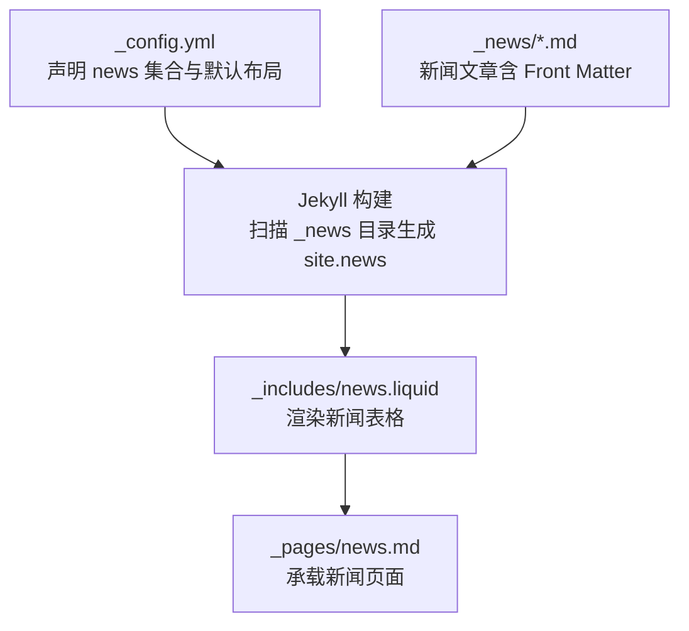
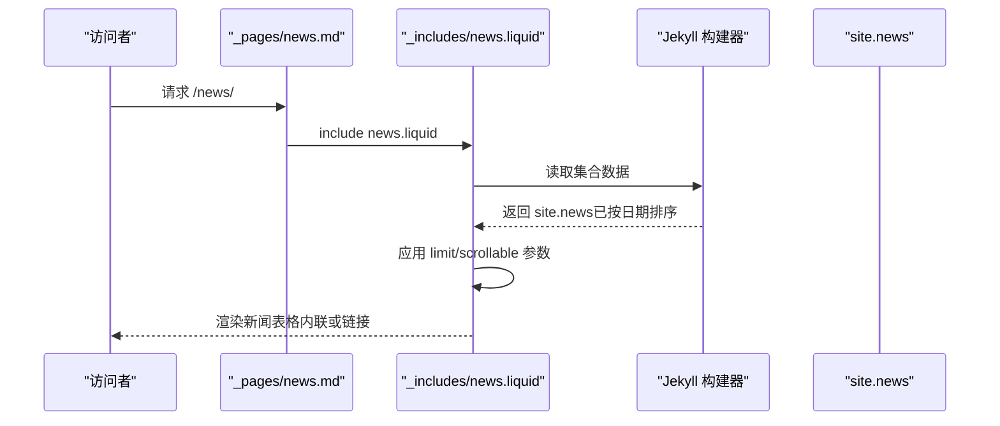
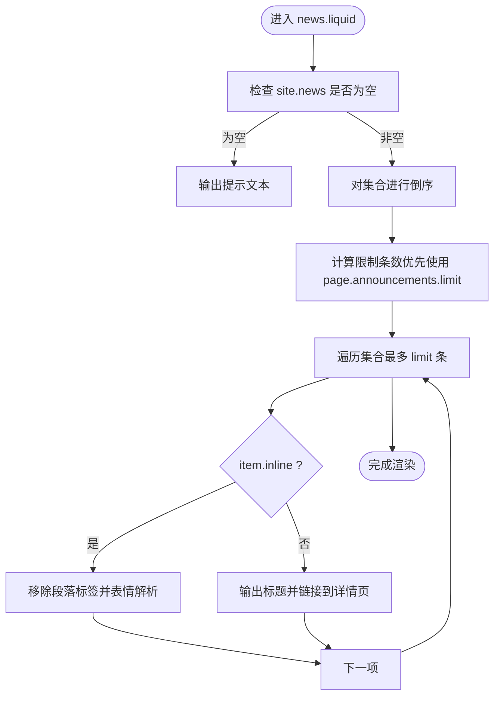

# 新闻公告系统

<cite>
**本文引用的文件**
- [_config.yml](file://_config.yml)
- [_includes/news.liquid](file://_includes/news.liquid)
- [_pages/news.md](file://_pages/news.md)
- [_layouts/post.liquid](file://_layouts/post.liquid)
- [_news/announcement_1.md](file://_news/announcement_1.md)
- [_news/announcement_20250821.md](file://_news/announcement_20250821.md)
- [_news/announcement_20250919.md](file://_news/announcement_20250919.md)
- [_news_bk/announcement_1.md](file://_news_bk/announcement_1.md)
- [_news_bk/announcement_2.md](file://_news_bk/announcement_2.md)
- [_includes/latest_posts.liquid](file://_includes/latest_posts.liquid)
</cite>

## 目录
1. [简介](#简介)
2. [项目结构](#项目结构)
3. [核心组件](#核心组件)
4. [架构总览](#架构总览)
5. [详细组件分析](#详细组件分析)
6. [依赖关系分析](#依赖关系分析)
7. [性能考量](#性能考量)
8. [故障排查指南](#故障排查指南)
9. [结论](#结论)
10. [附录](#附录)

## 简介
本文件系统性阐述该个人网站中的“新闻公告”子系统，涵盖以下方面：
- 新闻集合的配置与管理：包括集合声明、布局默认值、输出控制等。
- 新闻文章的文件命名规范与 Front Matter 配置要点（如日期、内联显示、相关文章开关等）。
- 新闻滚动展示功能的实现与可调参数（如限制条数、是否可滚动、日期格式化等）。
- 新闻与博客的区别及适用场景：基于布局、集合与页面组织方式的差异。
- 内容创作最佳实践：时效性处理、内容组织、标题与正文结构建议。
- 实际示例与展示效果定制：通过示例文件与模板参数进行演示。

## 项目结构
新闻公告系统由三部分组成：
- 配置层：在站点配置中声明新闻集合及其默认行为。
- 数据层：以 Markdown 文件形式存放于 _news 目录，采用统一的 Front Matter 字段。
- 展示层：通过 Liquid 模板在页面中渲染新闻列表，支持内联与链接两种模式。

图表来源
- [_config.yml:147-156](file://_config.yml#L147-L156)
- [_includes/news.liquid:1-35](file://_includes/news.liquid#L1-L35)
- [_pages/news.md:1-8](file://_pages/news.md#L1-L8)

章节来源
- [_config.yml:147-156](file://_config.yml#L147-L156)
- [_pages/news.md:1-8](file://_pages/news.md#L1-L8)

## 核心组件
- 新闻集合配置：在站点配置中定义 news 集合，设置默认布局为 post，并开启输出，使 Markdown 文档被编译为独立页面。
- 新闻模板：news.liquid 负责从 site.news 中读取数据，按日期倒序排列，支持限制条数与滚动容器高度。
- 新闻页面：news.md 作为承载页面，直接 include news.liquid，形成“新闻页”。
- 文章 Front Matter：每篇新闻需设置 layout、date、inline、related_posts 等字段；可选 title、tags、categories 等。

章节来源
- [_config.yml:147-156](file://_config.yml#L147-L156)
- [_includes/news.liquid:1-35](file://_includes/news.liquid#L1-L35)
- [_pages/news.md:1-8](file://_pages/news.md#L1-L8)

## 架构总览
新闻系统遵循 Jekyll 的集合（Collection）机制：站点配置声明集合 → Markdown 文档作为集合项 → Liquid 模板渲染 → 页面输出。

图表来源
- [_pages/news.md:7](file://_pages/news.md#L7)
- [_includes/news.liquid:11-28](file://_includes/news.liquid#L11-L28)
- [_config.yml:147-156](file://_config.yml#L147-L156)

## 详细组件分析

### 新闻集合与配置
- 集合声明：在站点配置中启用 news 集合并设置默认布局为 post，同时开启输出，确保每个新闻文章生成独立页面。
- 默认行为：所有 news 集合项默认使用 post 布局，便于复用博客类页面的样式与元信息展示逻辑。

章节来源
- [_config.yml:147-156](file://_config.yml#L147-L156)

### 新闻模板与滚动展示
- 数据来源：模板从 site.news 获取集合项，先进行倒序（最近的在前），再根据页面传入的 limit 或 announcements.limit 进行截断。
- 展示模式：
  - 内联模式（inline: true）：移除段落标签并应用表情解析，适合简短、强调性的公告。
  - 链接模式（inline: false）：显示标题并跳转到文章详情页，适合较长内容或需要独立页面的文章。
- 可滚动容器：当满足条件时，模板会为表格容器设置最大高度，超出部分自动滚动。
- 日期格式：使用 Liquid 过滤器对日期进行本地化格式化。

图表来源
- [_includes/news.liquid:2-34](file://_includes/news.liquid#L2-L34)

章节来源
- [_includes/news.liquid:1-35](file://_includes/news.liquid#L1-L35)

### 新闻页面组织
- 页面入口：news.md 使用 page 布局，设置固定永久链接 /news/，并在内容区 include news.liquid。
- 与博客的区别：博客使用 post 布局，通常用于长文与深度内容；新闻使用 post 布局但通过集合与模板实现“滚动公告”的轻量展示。

章节来源
- [_pages/news.md:1-8](file://_pages/news.md#L1-L8)
- [_layouts/post.liquid:1-97](file://_layouts/post.liquid#L1-L97)

### 文章 Front Matter 与命名规范
- 文件命名：推荐使用 announcement_YYYYMMDD.md 的格式，便于按日期排序与检索。
- 必填字段：
  - layout：固定为 post。
  - date：精确到秒的时间戳，影响排序与展示。
  - inline：true 表示内联展示，false 表示链接到详情页。
  - related_posts：false 关闭相关文章模块（新闻页通常不需要）。
- 可选字段：title、tags、categories 等，可用于进一步分类与归档（尽管新闻页主要通过集合渲染）。

章节来源
- [_news/announcement_1.md:1-9](file://_news/announcement_1.md#L1-L9)
- [_news/announcement_20250821.md:1-9](file://_news/announcement_20250821.md#L1-L9)
- [_news/announcement_20250919.md:1-9](file://_news/announcement_20250919.md#L1-L9)

### 示例与展示效果定制
- 简短内联公告：参考 announcement_1.md，适合快速发布、强调性的消息。
- 长文公告：参考 _news_bk/announcement_2.md，展示可包含多段落、列表、引用等内容的完整文章。
- 定制展示参数：
  - 在页面上下文中设置 announcements.limit 与 announcements.scrollable，即可控制新闻列表的显示数量与滚动行为。
  - 日期格式化由模板负责，无需手动修改。

章节来源
- [_news/announcement_1.md:1-9](file://_news/announcement_1.md#L1-L9)
- [_news_bk/announcement_2.md:1-34](file://_news_bk/announcement_2.md#L1-L34)
- [_includes/news.liquid:6-8](file://_includes/news.liquid#L6-L8)
- [_includes/news.liquid:12-16](file://_includes/news.liquid#L12-L16)

### 新闻与博客的区别与使用场景
- 共同点：两者均使用 post 布局，具备相似的元信息展示能力（日期、标签、分类链接等）。
- 差异点：
  - 新闻：通过 news 集合与专用模板渲染为滚动公告，强调时效性与简洁展示；适合发布短期、高频的动态。
  - 博客：通过 posts 集合与博客页面组织，适合深度内容、知识沉淀与长期价值。
- 选择建议：若内容偏动态、短小精悍，优先使用新闻；若内容偏学术、技术或长文，优先使用博客。

章节来源
- [_config.yml:147-156](file://_config.yml#L147-L156)
- [_layouts/post.liquid:1-97](file://_layouts/post.liquid#L1-L97)
- [_includes/latest_posts.liquid:1-49](file://_includes/latest_posts.liquid#L1-L49)

## 依赖关系分析
- 配置依赖：news 集合必须在站点配置中声明并设置默认布局为 post，否则模板无法正确渲染。
- 模板依赖：news.liquid 依赖 site.news 集合数据与页面传入的 limit/scrollable 参数。
- 数据依赖：新闻文章必须遵循命名与 Front Matter 规范，否则会影响排序与展示。

图表来源
- [_config.yml:147-156](file://_config.yml#L147-L156)
- [_includes/news.liquid:11-28](file://_includes/news.liquid#L11-L28)
- [_pages/news.md:7](file://_pages/news.md#L7)

章节来源
- [_config.yml:147-156](file://_config.yml#L147-L156)
- [_includes/news.liquid:1-35](file://_includes/news.liquid#L1-L35)
- [_pages/news.md:1-8](file://_pages/news.md#L1-L8)

## 性能考量
- 列表截断：通过 limit 控制渲染条目数量，避免过长列表导致的渲染压力。
- 滚动容器：在条目较多时启用最大高度限制，减少页面高度与滚动开销。
- 内容简化：内联模式移除段落标签并进行表情解析，降低 DOM 复杂度与渲染成本。

## 故障排查指南
- 新闻不显示：
  - 检查站点配置中是否声明 news 集合并设置默认布局为 post。
  - 确认新闻文件位于 _news 目录且 Front Matter 包含 layout 与 date。
- 排序异常：
  - 确保 date 字段格式正确，且包含时区偏移。
- 展示不符合预期：
  - 若希望内联显示，请设置 inline: true；若希望链接到详情页，请设置 inline: false。
  - 若希望限制显示条数或启用滚动，请在页面上下文中设置 announcements.limit 与 announcements.scrollable。

章节来源
- [_config.yml:147-156](file://_config.yml#L147-L156)
- [_includes/news.liquid:11-28](file://_includes/news.liquid#L11-L28)
- [_news/announcement_1.md:1-9](file://_news/announcement_1.md#L1-L9)

## 结论
该新闻公告系统通过 Jekyll 集合与自定义模板实现了“滚动公告”的高效展示。其优势在于：
- 配置简单：仅需在站点配置中声明集合与默认布局。
- 使用灵活：支持内联与链接两种展示模式，可按需限制条数与启用滚动。
- 维护便捷：采用 Markdown 编写，Front Matter 字段标准化，便于团队协作与版本管理。

## 附录
- 实际示例参考：
  - 简短内联公告：[_news/announcement_1.md](file://_news/announcement_1.md)
  - 长文公告示例：[_news_bk/announcement_2.md](file://_news_bk/announcement_2.md)
- 页面入口：[_pages/news.md](file://_pages/news.md)
- 模板实现：[_includes/news.liquid](file://_includes/news.liquid)
- 集合配置：[_config.yml](file://_config.yml)