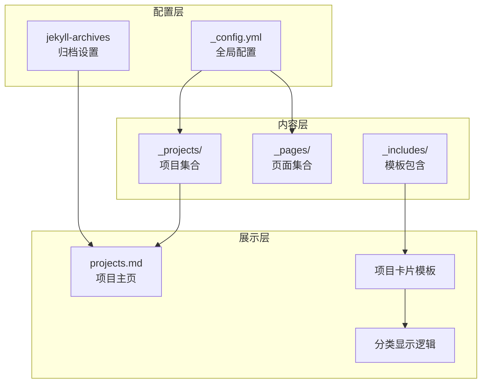
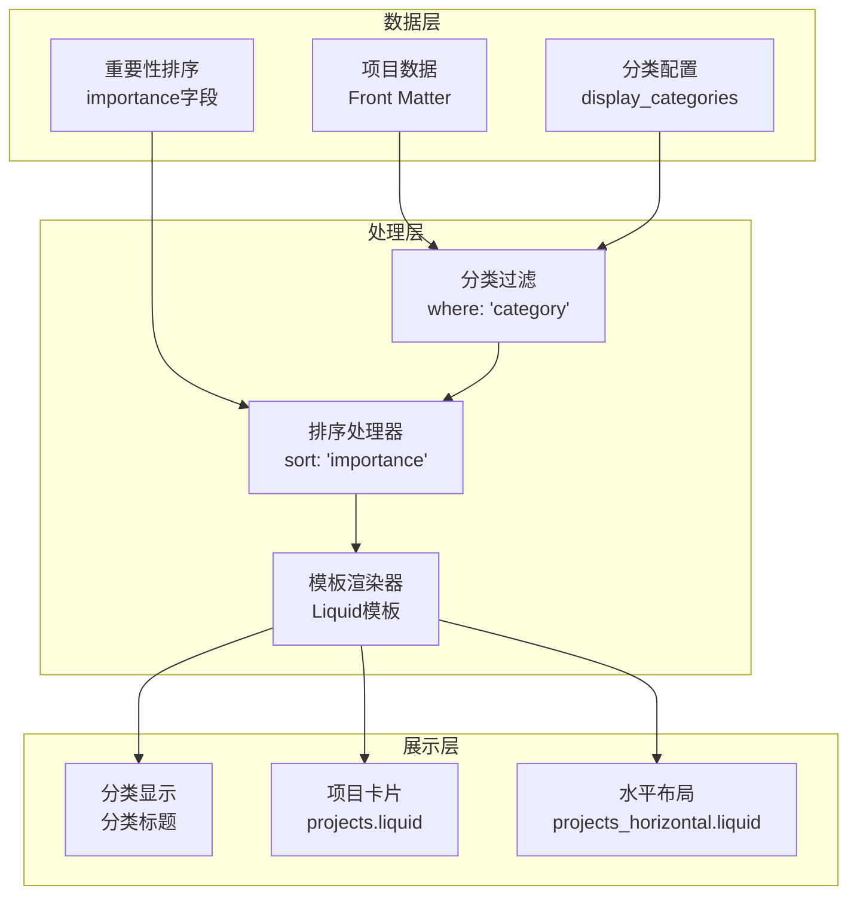
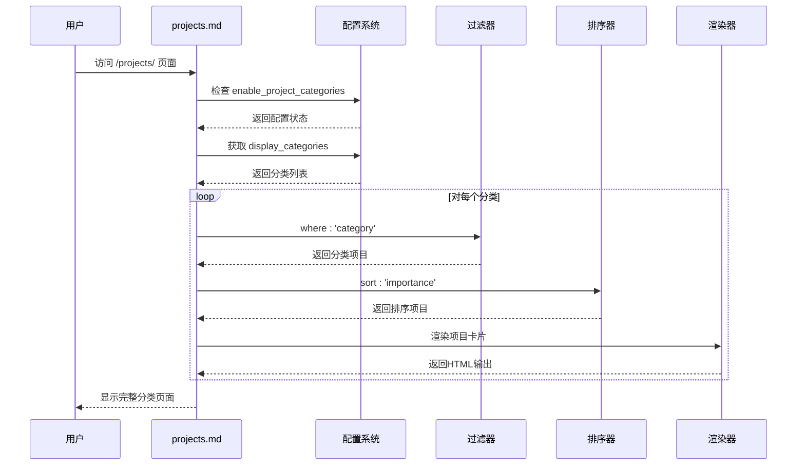
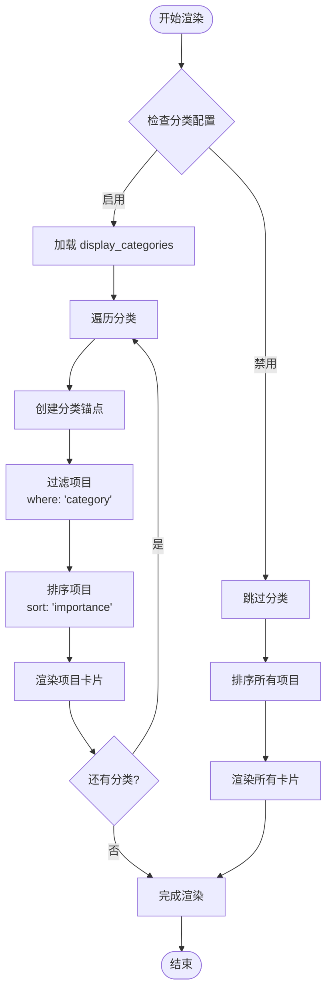
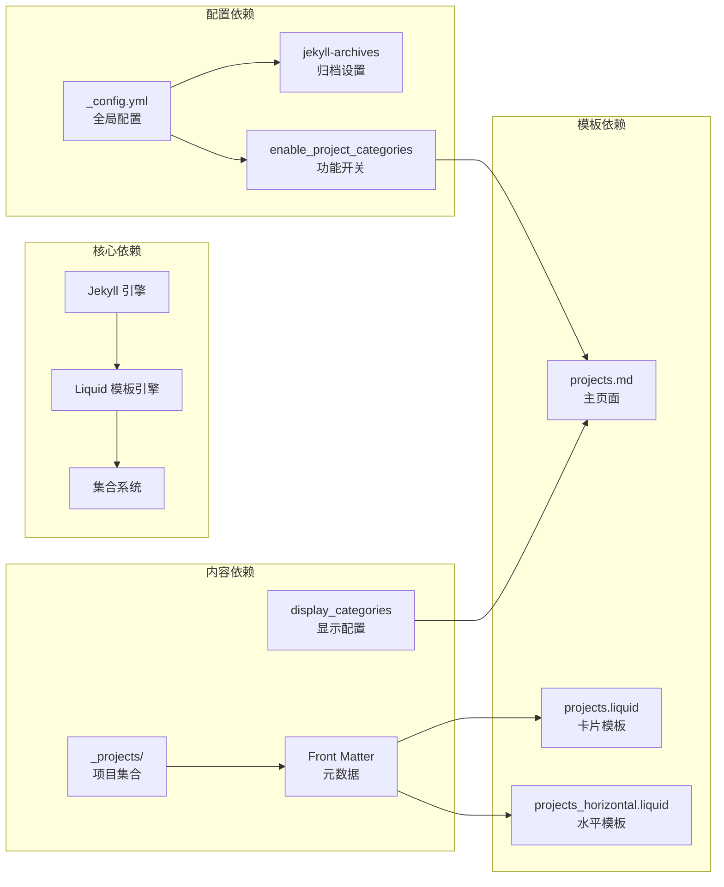

# 项目分类和标签系统

<cite>
**本文档引用的文件**
- [_config.yml](_config.yml)
- [projects.md](_pages/projects.md)
- [1_project.md](_projects/1_project.md)
- [2_project.md](_projects/2_project.md)
- [3_project.md](_projects/3_project.md)
- [4_project.md](_projects/4_project.md)
- [5_project.md](_projects/5_project.md)
- [projects.liquid](_includes/projects.liquid)
- [projects_horizontal.liquid](_includes/projects_horizontal.liquid)
- [CUSTOMIZE.md](CUSTOMIZE.md)
- [FAQ.md](FAQ.md)
</cite>

## 目录
1. [简介](#简介)
2. [项目结构](#项目结构)
3. [核心组件](#核心组件)
4. [架构概览](#架构概览)
5. [详细组件分析](#详细组件分析)
6. [依赖关系分析](#依赖关系分析)
7. [性能考虑](#性能考虑)
8. [故障排除指南](#故障排除指南)
9. [结论](#结论)

## 简介

本项目分类和标签系统是基于 Jekyll 静态站点生成器构建的个人作品集网站的重要组成部分。该系统通过三个核心字段实现项目的分类管理：`category`（分类）、`importance`（重要性）和 `related_publications`（相关出版物）。系统支持多分类管理、智能排序和灵活的页面展示方式。

该系统的核心目标是为用户提供一个直观、可扩展的项目管理解决方案，允许用户根据不同的维度对项目进行组织和展示，同时保持良好的用户体验和性能表现。

## 项目结构

项目采用标准的 Jekyll 项目结构，专门针对项目分类和标签系统进行了优化：



**图表来源**
- [_config.yml](_config.yml)
- [projects.md](_pages/projects.md)

**章节来源**
- [_config.yml](_config.yml)
- [CUSTOMIZE.md](CUSTOMIZE.md)

## 核心组件

### 分类字段 (category)

`category` 字段是项目分类系统的核心标识符，用于将项目分配到不同的分类中。每个项目可以属于一个或多个分类，系统通过这个字段实现项目的分组管理。

**分类字段特性：**
- 支持多值分类（通过数组形式）
- 与 `display_categories` 配置配合使用
- 影响项目在分类页面中的显示位置
- 参与项目的排序和过滤逻辑

### 重要性字段 (importance)

`importance` 字段是一个数值型指标，用于控制项目在页面中的排序优先级和重要性展示。数值越大，项目在列表中的排序越靠前。

**重要性字段规则：**
- 数值越高，项目排序越靠前
- 默认情况下按降序排列
- 支持混合排序场景
- 可与其他排序条件结合使用

### 相关出版物字段 (related_publications)

`related_publications` 字段用于建立项目与学术出版物之间的关联关系。当设置为 `true` 时，系统会自动关联相关的学术论文和研究成果。

**相关出版物功能：**
- 自动关联学术出版物
- 提供跨媒体内容整合
- 增强项目的学术价值展示
- 支持多维度内容管理

**章节来源**
- [1_project.md](_projects/1_project.md)
- [2_project.md](_projects/2_project.md)
- [3_project.md](_projects/3_project.md)
- [4_project.md](_projects/4_project.md)
- [5_project.md](_projects/5_project.md)

## 架构概览

项目分类系统采用分层架构设计，确保了良好的可维护性和扩展性：



**图表来源**
- [projects.md](_pages/projects.md)
- [projects.liquid](_includes/projects.liquid)
- [projects_horizontal.liquid](_includes/projects_horizontal.liquid)

## 详细组件分析

### 项目分类页面 (projects.md)

项目分类页面是分类系统的核心入口点，负责协调所有分类相关的展示逻辑：



**图表来源**
- [projects.md](_pages/projects.md)

**章节来源**
- [projects.md](_pages/projects.md)

### 项目卡片组件

系统提供了两种项目卡片展示模式，适应不同的布局需求：

#### 标准项目卡片 (projects.liquid)
- 采用垂直布局设计
- 支持图片、标题、描述的完整展示
- 包含 GitHub 仓库链接和星标显示
- 适用于密集型项目展示

#### 水平项目卡片 (projects_horizontal.liquid)
- 采用左右分栏布局
- 图片在左侧，内容在右侧
- 更适合长描述项目的展示
- 提供更好的阅读体验

**章节来源**
- [projects.liquid](_includes/projects.liquid)
- [projects_horizontal.liquid](_includes/projects_horizontal.liquid)

### 分类显示逻辑

分类显示逻辑实现了智能的分类管理和动态展示：



**图表来源**
- [projects.md](_pages/projects.md)

**章节来源**
- [projects.md](_pages/projects.md)

### 实际使用示例

#### 多分类项目管理

系统支持单个项目属于多个分类的情况。例如，一个项目可以同时出现在工作项目和学习项目两个分类中：

**配置示例：**
```yaml
# 在项目文件中设置多个分类
category: [work, learning]
importance: 2
```

#### 分类页面生成

系统会自动为每个分类生成对应的页面内容，包括分类标题、项目列表和导航链接。

**章节来源**
- [1_project.md](_projects/1_project.md)
- [2_project.md](_projects/2_project.md)
- [3_project.md](_projects/3_project.md)
- [4_project.md](_projects/4_project.md)
- [5_project.md](_projects/5_project.md)

## 依赖关系分析

项目分类系统依赖于多个核心组件的协同工作：



**图表来源**
- [_config.yml](_config.yml)
- [projects.md](_pages/projects.md)

**章节来源**
- [_config.yml](_config.yml)
- [CUSTOMIZE.md](CUSTOMIZE.md)

## 性能考虑

### 排序性能优化

系统采用高效的排序算法处理大量项目数据：

- **时间复杂度**: O(n log n) 对于每个分类的排序操作
- **内存使用**: 原地排序减少额外内存占用
- **缓存策略**: 利用 Jekyll 的静态生成特性避免运行时计算

### 渲染性能优化

- **模板复用**: 通过 include 机制减少模板重复代码
- **条件渲染**: 仅在需要时执行分类相关的处理逻辑
- **懒加载**: 图片资源采用懒加载提升初始渲染速度

## 故障排除指南

### 常见问题及解决方案

#### 分类不显示问题

**症状**: 设置了 `display_categories` 但页面不显示任何分类

**可能原因**:
1. `enable_project_categories` 配置为 `false`
2. 项目文件中缺少 `category` 字段
3. 分类名称大小写不匹配

**解决步骤**:
1. 检查 `_config.yml` 中的 `enable_project_categories` 设置
2. 确认项目文件包含正确的 `category` 字段
3. 验证分类名称与配置完全一致

#### 排序异常问题

**症状**: 项目没有按照预期的重要性顺序排列

**可能原因**:
1. `importance` 字段类型错误（非数值型）
2. 缺少 `importance` 字段的项目影响排序
3. 模板中排序逻辑被覆盖

**解决步骤**:
1. 确保 `importance` 字段为数值类型
2. 为所有项目添加 `importance` 字段
3. 检查模板中的排序逻辑是否正确

#### 性能问题

**症状**: 页面加载缓慢，特别是项目数量较多时

**优化建议**:
1. 考虑分页显示大量项目
2. 减少不必要的模板渲染
3. 优化图片资源大小

**章节来源**
- [FAQ.md](FAQ.md)

## 结论

项目分类和标签系统为个人作品集网站提供了强大而灵活的内容管理能力。通过 `category`、`importance` 和 `related_publications` 三个核心字段的协同工作，系统实现了：

- **多维度分类管理**: 支持复杂的项目分类和子分类
- **智能排序机制**: 基于重要性指数的动态排序
- **灵活展示方式**: 支持多种布局和显示模式
- **高性能渲染**: 优化的模板处理和资源管理

该系统的设计充分考虑了可扩展性和易用性，为用户提供了专业的项目管理解决方案。通过合理的配置和使用，用户可以轻松构建和维护高质量的个人作品集网站。