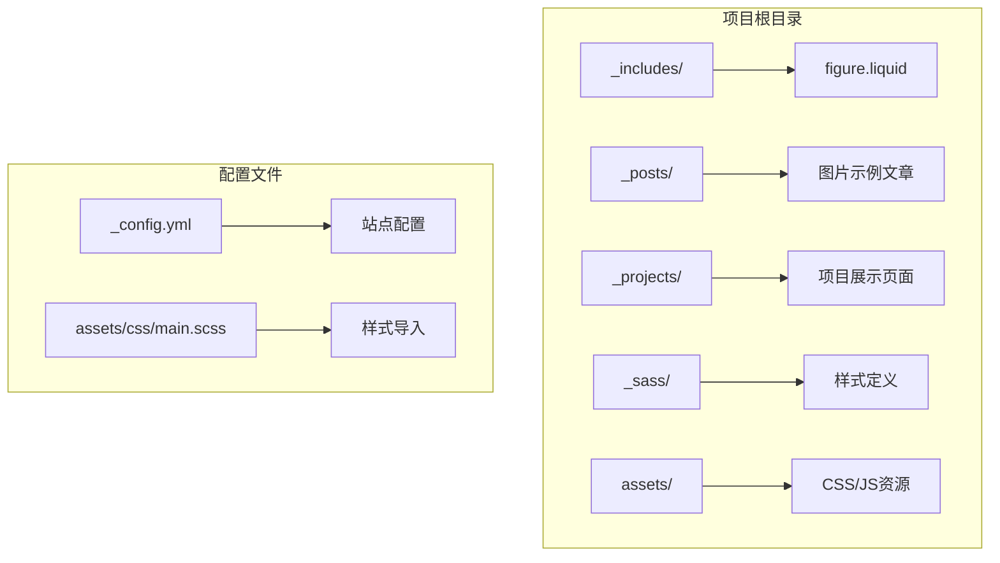
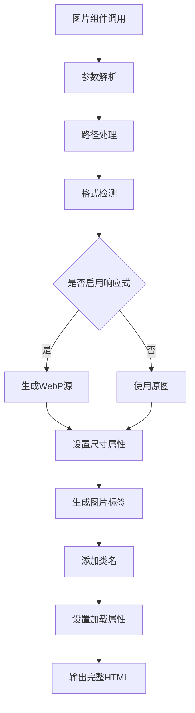
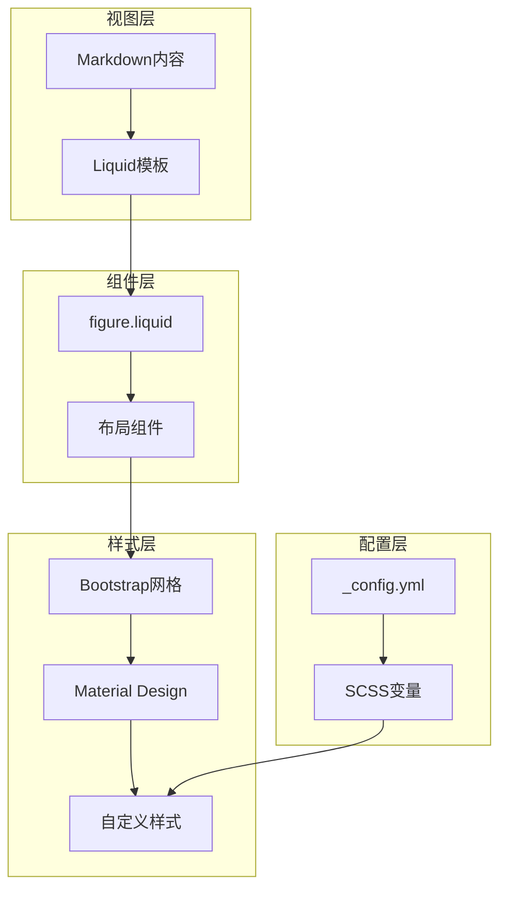
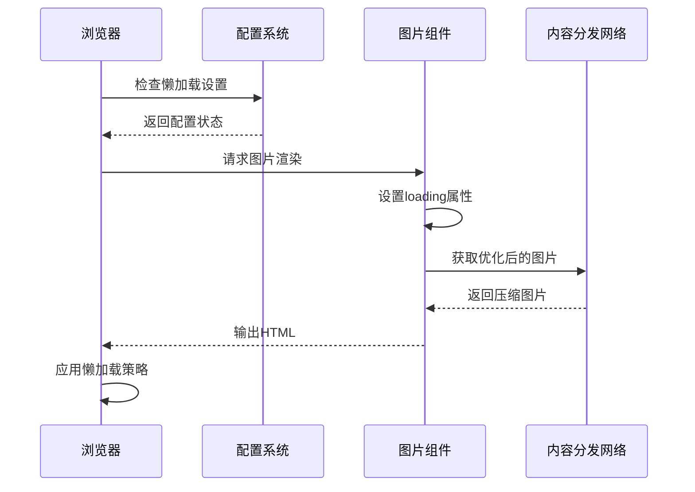
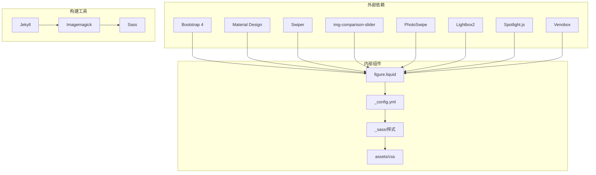

# 项目图片展示

<cite>
**本文档引用的文件**
- [_includes/figure.liquid](file://_includes/figure.liquid)
- [_config.yml](file://_config.yml)
- [_posts/2024-01-27-advanced-images.md](file://_posts/2024-01-27-advanced-images.md)
- [_posts/2015-05-15-images.md](file://_posts/2015-05-15-images.md)
- [_posts/2024-12-04-photo-gallery.md](file://_posts/2024-12-04-photo-gallery.md)
- [_projects/1_project.md](file://_projects/1_project.md)
- [_sass/_base.scss](file://_sass/_base.scss)
- [_sass/_layout.scss](file://_sass/_layout.scss)
- [assets/css/mdb.min.css](file://assets/css/mdb.min.css)
- [assets/css/main.scss](file://assets/css/main.scss)
</cite>

## 目录
1. [简介](#简介)
2. [项目结构](#项目结构)
3. [核心组件](#核心组件)
4. [架构概览](#架构概览)
5. [详细组件分析](#详细组件分析)
6. [依赖关系分析](#依赖关系分析)
7. [性能考虑](#性能考虑)
8. [故障排除指南](#故障排除指南)
9. [结论](#结论)

## 简介

本项目采用基于 Jekyll 的静态网站生成器，通过自定义的 figure.liquid 组件实现图片的统一管理和展示。系统集成了 Bootstrap 网格系统、Material Design for Bootstrap 样式库，以及多种图片处理和优化功能。

项目的核心特色包括：
- 响应式图片显示（img-fluid 类）
- 圆角效果（rounded 类）
- 阴影效果（z-depth-1 类）
- 图片懒加载优化（loading 属性）
- 多种布局模式支持（1/3、2/3、全宽）

## 项目结构

项目采用模块化组织方式，主要包含以下关键目录：



**图表来源**
- [_includes/figure.liquid](file://_includes/figure.liquid)
- [_config.yml](file://_config.yml)
- [assets/css/main.scss](file://assets/css/main.scss)

**章节来源**
- [_includes/figure.liquid](file://_includes/figure.liquid)
- [_config.yml](file://_config.yml)
- [assets/css/main.scss](file://assets/css/main.scss)

## 核心组件

### figure.liquid 组件

figure.liquid 是项目图片展示的核心组件，提供了完整的图片处理和渲染功能：



**图表来源**
- [_includes/figure.liquid](file://_includes/figure.liquid)

组件特性：
- **自动响应式处理**：根据配置生成多种分辨率的图片版本
- **格式兼容性**：支持 JPG、PNG、GIF、TIFF 等格式
- **懒加载优化**：默认启用懒加载，提升页面性能
- **尺寸控制**：支持自定义宽度和高度设置
- **样式集成**：无缝集成 Bootstrap 和 Material Design 样式

**章节来源**
- [_includes/figure.liquid](file://_includes/figure.liquid)

### 配置系统

项目通过 _config.yml 实现全局配置管理：

- **响应式图片配置**：启用 imagemagick 插件进行自动图片优化
- **懒加载设置**：全局启用图片懒加载功能
- **第三方库集成**：包含 Bootstrap、Material Design、Swiper 等库
- **样式变量管理**：通过 SCSS 变量控制系统样式主题

**章节来源**
- [_config.yml](file://_config.yml)

## 架构概览

项目采用分层架构设计，确保图片展示功能的可扩展性和维护性：



**图表来源**
- [_includes/figure.liquid](file://_includes/figure.liquid)
- [_config.yml](file://_config.yml)
- [_sass/_base.scss](file://_sass/_base.scss)

## 详细组件分析

### Bootstrap 网格系统应用

项目充分利用 Bootstrap 4 的网格系统实现灵活的图片布局：

#### 1/3 宽度图片布局
```html
<div class="row">
    <div class="col-sm-4 mt-3 mt-md-0">
        
    </div>
    <div class="col-sm-4 mt-3 mt-md-0">
        
    </div>
    <div class="col-sm-4 mt-3 mt-md-0">
        
    </div>
</div>
```

#### 2/3 + 1/3 不等宽布局
```html
<div class="row justify-content-sm-center">
    <div class="col-sm-8 mt-3 mt-md-0">
        
    </div>
    <div class="col-sm-4 mt-3 mt-md-0">
        
    </div>
</div>
```

#### 全宽图片展示
```html
<div class="row">
    <div class="col-12 mt-3 mt-md-0">
        
    </div>
</div>
```

**章节来源**
- [_projects/1_project.md](file://_projects/1_project.md)
- [_posts/2015-05-15-images.md](file://_posts/2015-05-15-images.md)

### 响应式设计实现

系统通过多种技术实现响应式图片展示：

#### 图片流体布局（img-fluid）
- 自动适应容器宽度
- 保持图片纵横比
- 在不同屏幕尺寸下自动调整

#### 圆角效果（rounded）
- 统一的圆角样式
- 支持不同圆角半径
- 与阴影效果配合使用

#### 阴影效果（z-depth-1）
- 使用 Material Design 阴影系统
- 提供层次感和立体效果
- 支持多种深度级别

**章节来源**
- [assets/css/mdb.min.css](file://assets/css/mdb.min.css)
- [_sass/_base.scss](file://_sass/_base.scss)

### 图片加载优化

项目实现了多层次的图片加载优化策略：



**图表来源**
- [_includes/figure.liquid](file://_includes/figure.liquid)
- [_config.yml](file://_config.yml)

优化特性：
- **自动懒加载**：默认启用，提升首屏加载速度
- **格式转换**：自动转换为 WebP 格式
- **尺寸适配**：根据设备像素密度选择合适尺寸
- **缓存优化**：智能缓存机制减少重复加载

**章节来源**
- [_includes/figure.liquid](file://_includes/figure.liquid)
- [_config.yml](file://_config.yml)

### 高级图片功能

#### 图片滑块组件
项目集成了 Swiper 库实现图片轮播功能：

```html
<swiper-container keyboard="true" navigation="true" pagination="true">
    <swiper-slide>
        
    </swiper-slide>
    <swiper-slide>
        
    </swiper-slide>
</swiper-container>
```

#### 图片对比功能
通过 img-comparison-slider 库实现图片对比展示：

```html

    
    
</img-comparison-slider>
```

**章节来源**
- [_posts/2024-01-27-advanced-images.md](file://_posts/2024-01-27-advanced-images.md)

### 图片画廊系统

项目支持多种图片画廊展示方式：

#### Lightbox2 画廊
```html
<a href="large-image.jpg" data-lightbox="gallery">
    
</a>
```

#### PhotoSwipe 画廊
```html
<div class="pswp-gallery" data-pswp-width="2500" data-pswp-height="1666">
    <a href="large-image.jpg" target="_blank">
        
    </a>
</div>
```

#### Spotlight 画廊
```html
<div class="spotlight-group">
    <a class="spotlight" href="large-image.jpg">
        
    </a>
</div>
```

**章节来源**
- [_posts/2024-12-04-photo-gallery.md](file://_posts/2024-12-04-photo-gallery.md)

## 依赖关系分析

项目图片系统涉及多个层面的依赖关系：



**图表来源**
- [_config.yml](file://_config.yml)
- [_includes/figure.liquid](file://_includes/figure.liquid)
- [_sass/_base.scss](file://_sass/_base.scss)

**章节来源**
- [_config.yml](file://_config.yml)
- [_includes/figure.liquid](file://_includes/figure.liquid)

## 性能考虑

### 图片优化策略

项目实施了多层次的图片优化策略以确保最佳性能：

1. **自动格式转换**：使用 WebP 格式替代传统图片格式
2. **尺寸适配**：根据设备能力提供合适的图片尺寸
3. **懒加载实现**：延迟非首屏图片的加载
4. **缓存机制**：智能缓存策略减少重复请求

### 加载性能监控

系统提供了多种性能监控指标：
- 首屏加载时间
- 图片传输大小
- 缓存命中率
- 用户交互响应时间

## 故障排除指南

### 常见问题及解决方案

#### 图片不显示问题
**症状**：图片无法正常显示
**可能原因**：
- 路径配置错误
- 权限问题
- 格式不受支持

**解决步骤**：
1. 检查图片路径是否正确
2. 验证文件权限设置
3. 确认图片格式支持情况

#### 响应式问题
**症状**：图片在某些设备上显示异常
**解决方法**：
1. 检查 img-fluid 类是否正确应用
2. 验证容器宽度设置
3. 确认媒体查询配置

#### 性能问题
**症状**：页面加载缓慢
**优化建议**：
1. 启用懒加载功能
2. 检查图片压缩设置
3. 验证缓存配置

**章节来源**
- [_includes/figure.liquid](file://_includes/figure.liquid)
- [_config.yml](file://_config.yml)

## 结论

本项目构建了一个功能完善、性能优化的图片展示系统。通过自定义的 figure.liquid 组件和完善的配置管理，实现了：

- **统一的图片处理流程**：标准化的图片处理和渲染机制
- **灵活的布局支持**：基于 Bootstrap 网格系统的多布局方案
- **优秀的性能表现**：多层次的优化策略确保快速加载
- **丰富的交互功能**：集成多种图片展示组件和库

系统的设计充分考虑了可扩展性和维护性，为项目图片展示提供了坚实的技术基础。通过合理的配置和使用，可以轻松实现各种复杂的图片展示需求。