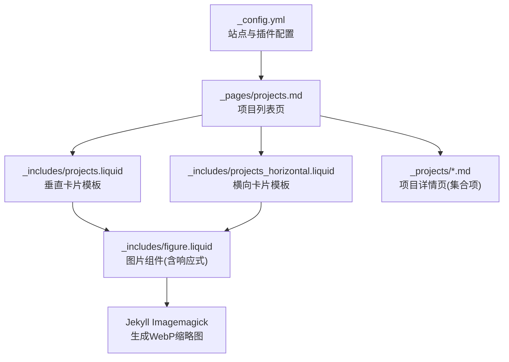
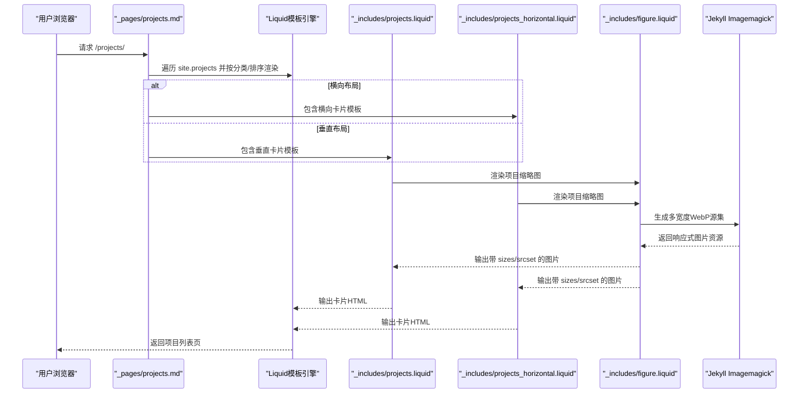
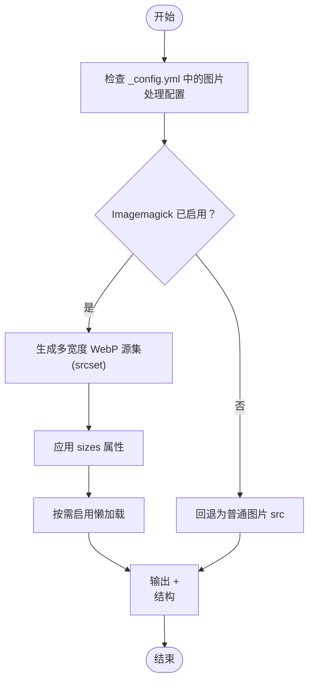
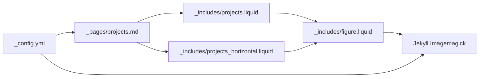

# 项目展示系统

<cite>
**本文档引用的文件**
- [_config.yml](_config.yml)
- [_pages/projects.md](_pages/projects.md)
- [_includes/projects.liquid](_includes/projects.liquid)
- [_includes/projects_horizontal.liquid](_includes/projects_horizontal.liquid)
- [_includes/figure.liquid](_includes/figure.liquid)
- [_projects/1_project.md](_projects/1_project.md)
- [_projects/2_project.md](_projects/2_project.md)
- [_sass/_layout.scss](_sass/_layout.scss)
- [_plugins/cache-bust.rb](_plugins/cache-bust.rb)
- [CUSTOMIZE.md](_config.yml)
</cite>

## 目录
1. [简介](#简介)
2. [项目结构](#项目结构)
3. [核心组件](#核心组件)
4. [架构总览](#架构总览)
5. [详细组件分析](#详细组件分析)
6. [依赖关系分析](#依赖关系分析)
7. [性能考虑](#性能考虑)
8. [故障排除指南](#故障排除指南)
9. [结论](#结论)
10. [附录](#附录)

## 简介
本文件面向项目展示系统的使用者与维护者，系统性阐述如何创建与管理项目集合、配置 Front Matter 字段、上传与处理项目图片、生成缩略图与响应式布局、使用项目分类与标签、生成项目详情页、配置项目链接与 PDF 关联，以及设计与体验优化建议。文档同时提供可操作的示例与布局定制方法，帮助快速上手并扩展功能。

## 项目结构
项目采用 Jekyll 静态站点生成框架，项目集合位于 _projects 目录，项目列表页位于 _pages/projects.md，卡片渲染通过 Liquid 模板在 _includes 中实现；图片处理由 Jekyll Imagemagick 插件与自定义 figure.liquid 组件配合完成；响应式图片与懒加载在配置中统一开启。

图表来源
- [_config.yml](_config.yml)
- [_pages/projects.md](_pages/projects.md)
- [_includes/projects.liquid](_includes/projects.liquid)
- [_includes/projects_horizontal.liquid](_includes/projects_horizontal.liquid)
- [_includes/figure.liquid](_includes/figure.liquid)

章节来源
- [_config.yml](_config.yml)
- [_pages/projects.md](_pages/projects.md)

## 核心组件
- 项目集合与页面
  - 项目集合：在配置中声明 projects 集合并启用输出，使 _projects 下的 Markdown 成为可索引的集合项。
  - 列表页：_pages/projects.md 负责渲染项目卡片，支持按分类显示与排序。
- 卡片模板
  - 垂直卡片：_includes/projects.liquid，适合网格布局，支持项目图片、标题、描述与 GitHub 链接。
  - 横向卡片：_includes/projects_horizontal.liquid，适合宽屏展示，支持左右分栏与图片尺寸控制。
- 图片组件
  - _includes/figure.liquid 提供响应式图片与懒加载能力，自动根据配置生成多宽度 WebP 源集。
- 配置开关
  - _config.yml 中的 enable_project_categories、enable_masonry、enable_medium_zoom、lazy_loading_images 等选项控制项目展示行为。

章节来源
- [_pages/projects.md](_pages/projects.md)
- [_includes/projects.liquid](_includes/projects.liquid)
- [_includes/projects_horizontal.liquid](_includes/projects_horizontal.liquid)
- [_includes/figure.liquid](_includes/figure.liquid)
- [_config.yml](_config.yml)

## 架构总览
项目从集合项到页面渲染的关键流程如下：

图表来源
- [_pages/projects.md](_pages/projects.md)
- [_includes/projects.liquid](_includes/projects.liquid)
- [_includes/projects_horizontal.liquid](_includes/projects_horizontal.liquid)
- [_includes/figure.liquid](_includes/figure.liquid)
- [_config.yml](_config.yml)

## 详细组件分析

### 项目集合与 Front Matter 字段
- 集合声明与输出
  - 在配置中声明 projects 集合并启用输出，使 _projects 下的 Markdown 成为集合项，可在页面中通过 site.projects 访问。
- 常用 Front Matter 字段
  - layout：页面布局，如 page。
  - title：项目标题。
  - description：项目描述，用于卡片与 SEO。
  - img：项目缩略图路径，将作为卡片顶部图片显示。
  - importance：整数，用于排序（数值越小优先级越高）。
  - category：项目分类，用于按分类筛选展示。
  - github / github_stars：GitHub 仓库链接与星标展示。
  - redirect：外部重定向链接，优先于内部项目链接。
  - giscus_comments：是否启用评论区（适用于支持评论的布局）。
  - related_publications：是否关联相关论文（与学术主题相关时使用）。
- 示例参考
  - 基础项目示例：[_projects/1_project.md](_projects/1_project.md)
  - 启用评论的项目示例：[_projects/2_project.md](_projects/2_project.md)

章节来源
- [_config.yml](_config.yml)
- [_projects/1_project.md](_projects/1_project.md)
- [_projects/2_project.md](_projects/2_project.md)

### 项目图片上传、缩略图生成与响应式布局
- 图片上传与命名规范
  - 将图片放入 assets/img/ 或子目录，Front Matter 中使用相对路径引用（如 assets/img/xxx.jpg）。
  - 支持 GIF/JPEG/PNG/TIFF/GIF 格式，系统会自动生成对应宽度的 WebP 缩略图。
- 缩略图生成机制
  - 通过 Jekyll Imagemagick 插件与 _includes/figure.liquid 配合，自动为指定宽度生成 WebP 源集，并在 <picture> 标签中以 srcset 形式输出。
  - sizes 属性用于指示不同视口下的目标宽度，提升加载性能与清晰度。
- 响应式布局设置
  - figure.liquid 默认启用懒加载（若全局开启），并在图片错误时回退为普通 src。
  - 卡片模板中为图片设置合适的 sizes 与类名，确保在不同屏幕尺寸下正确缩放。
- 缓存破坏
  - 使用 _plugins/cache-bust.rb 提供的过滤器为静态资源添加哈希后缀，避免缓存问题。

图表来源
- [_includes/figure.liquid](_includes/figure.liquid)
- [_config.yml](_config.yml)
- [_plugins/cache-bust.rb](_plugins/cache-bust.rb)

章节来源
- [_includes/figure.liquid](_includes/figure.liquid)
- [_config.yml](_config.yml)
- [_plugins/cache-bust.rb](_plugins/cache-bust.rb)

### 项目分类系统与标签使用
- 分类开关与展示
  - enable_project_categories 控制是否启用项目分类功能。
  - 页面 Front Matter 中的 display_categories 决定在项目页上按哪些分类分组展示。
- 排序规则
  - 项目按 importance 字段升序排列，数值越小越靠前。
- 标签系统
  - 项目集合默认不启用标签归档；如需标签支持，需在 jekyll-archives 中为 projects 集合添加标签归档配置（参考 CUSTOMIZE 文档说明）。

章节来源
- [_config.yml](_config.yml)
- [_pages/projects.md](_pages/projects.md)
- [CUSTOMIZE.md](_config.yml)

### 项目详情页面生成与链接配置
- 详情页生成
  - 每个 _projects/*.md 即为一个独立的项目详情页，使用 page 布局并通过 permalink 控制访问路径。
- 链接优先级
  - 若 Front Matter 中存在 redirect，则卡片点击跳转至该外部链接；否则跳转至项目自身的 URL。
- PDF 文件关联
  - 项目详情页中可通过 Markdown 链接或按钮形式指向 PDF 文件，路径建议放置在 assets/pdf/ 下并在链接中直接引用。

章节来源
- [_pages/projects.md](_pages/projects.md)
- [_projects/1_project.md](_projects/1_project.md)
- [_projects/2_project.md](_projects/2_project.md)

### 布局定制与设计指南
- 布局选择
  - 垂直布局：适合密集展示，使用 _includes/projects.liquid，卡片列数由 Bootstrap 网格控制。
  - 横向布局：适合图文并茂的展示，使用 _includes/projects_horizontal.liquid，左侧图片右侧文字。
- 尺寸与间距
  - 卡片图片的 sizes 属性在模板中已预设，可根据需要调整以适配不同断点。
  - Masonry 自动排列由 _sass/_layout.scss 中的 TODO 注释提示，可结合 JavaScript 初始化实现瀑布流效果。
- 设计建议
  - 保持缩略图比例一致，提升视觉统一性。
  - 合理使用 importance 控制首页推荐位，突出重点作品。
  - 为重要项目提供 GitHub 链接与 star 数展示，增强可信度与互动性。

章节来源
- [_includes/projects.liquid](_includes/projects.liquid)
- [_includes/projects_horizontal.liquid](_includes/projects_horizontal.liquid)
- [_sass/_layout.scss](_sass/_layout.scss)

## 依赖关系分析
- 配置依赖
  - _pages/projects.md 依赖 _config.yml 中的集合与展示开关。
  - 卡片模板依赖 _includes/figure.liquid 的图片处理能力。
- 运行时依赖
  - Jekyll Imagemagick 插件负责生成 WebP 缩略图。
  - 懒加载与图片回退逻辑由 figure.liquid 实现。
- 外部库
  - medium-zoom、masonry 等第三方库通过配置注入，用于增强交互与布局。

图表来源
- [_config.yml](_config.yml)
- [_pages/projects.md](_pages/projects.md)
- [_includes/projects.liquid](_includes/projects.liquid)
- [_includes/projects_horizontal.liquid](_includes/projects_horizontal.liquid)
- [_includes/figure.liquid](_includes/figure.liquid)

章节来源
- [_config.yml](_config.yml)
- [_pages/projects.md](_pages/projects.md)

## 性能考虑
- 图片优化
  - 启用 Imagemagick 自动生成多宽度 WebP 缩略图，减少带宽占用并提升加载速度。
  - 合理设置 sizes 属性，使浏览器选择最接近视口宽度的图片版本。
- 懒加载
  - 全局开启懒加载可显著降低首屏资源消耗，提升页面感知性能。
- 缓存策略
  - 使用缓存破坏过滤器为静态资源附加哈希，避免浏览器缓存导致的样式/脚本未更新问题。
- 布局性能
  - Masonry 等布局在图片加载完成后重新计算位置，建议在图片较多场景下谨慎使用，或仅在必要时初始化。

章节来源
- [_includes/figure.liquid](_includes/figure.liquid)
- [_plugins/cache-bust.rb](_plugins/cache-bust.rb)
- [_config.yml](_config.yml)

## 故障排除指南
- 项目未出现在列表页
  - 检查 _config.yml 中 projects 集合是否启用输出。
  - 确认项目 Front Matter 中包含 title、description 等关键字段。
- 图片不显示或加载失败
  - 确认图片路径正确且存在于 assets/img/。
  - 若 Imagemagick 未安装或未启用，系统会回退为普通 src，但仍需保证路径有效。
- 缩略图未生成
  - 检查 _config.yml 中 imagemagick.enabled 是否为 true，输入目录与格式是否包含目标图片类型。
- 布局错乱
  - 确认 Bootstrap 网格类名使用正确，卡片数量与列数匹配。
  - 如使用 Masonry，请确认相关脚本已加载且初始化成功。

章节来源
- [_config.yml](_config.yml)
- [_includes/figure.liquid](_includes/figure.liquid)
- [_pages/projects.md](_pages/projects.md)

## 结论
本系统通过集合、模板与图片处理插件的协同，提供了灵活而高性能的项目展示方案。遵循本文档的命名规范、Front Matter 字段配置与布局选择建议，即可快速搭建美观、易维护的项目展示页面，并根据实际需求进一步扩展分类、标签与交互功能。

## 附录
- 快速创建新项目步骤
  - 在 _projects/ 下新建 Markdown 文件，填写 Front Matter 字段（至少包含 title、description、img、importance）。
  - 在项目内容中插入图片，使用 _includes/figure.liquid 包裹以获得响应式与懒加载能力。
  - 在 _pages/projects.md 中设置 display_categories 与 horizontal 布局，决定展示方式。
- 参考示例
  - 基础项目示例：[_projects/1_project.md](_projects/1_project.md)
  - 启用评论的项目示例：[_projects/2_project.md](_projects/2_project.md)

章节来源
- [_pages/projects.md](_pages/projects.md)
- [_projects/1_project.md](_projects/1_project.md)
- [_projects/2_project.md](_projects/2_project.md)