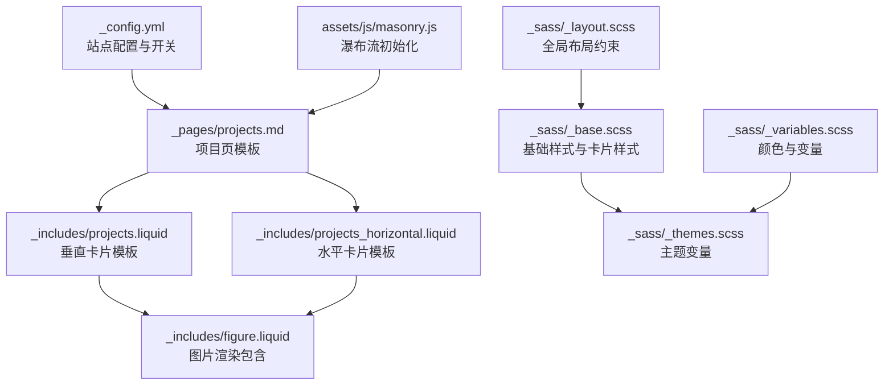
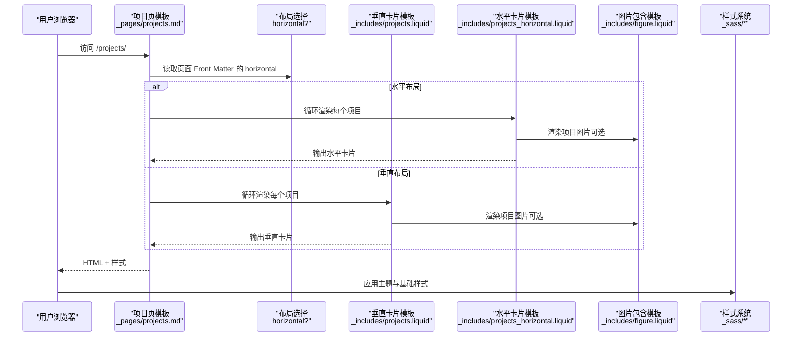
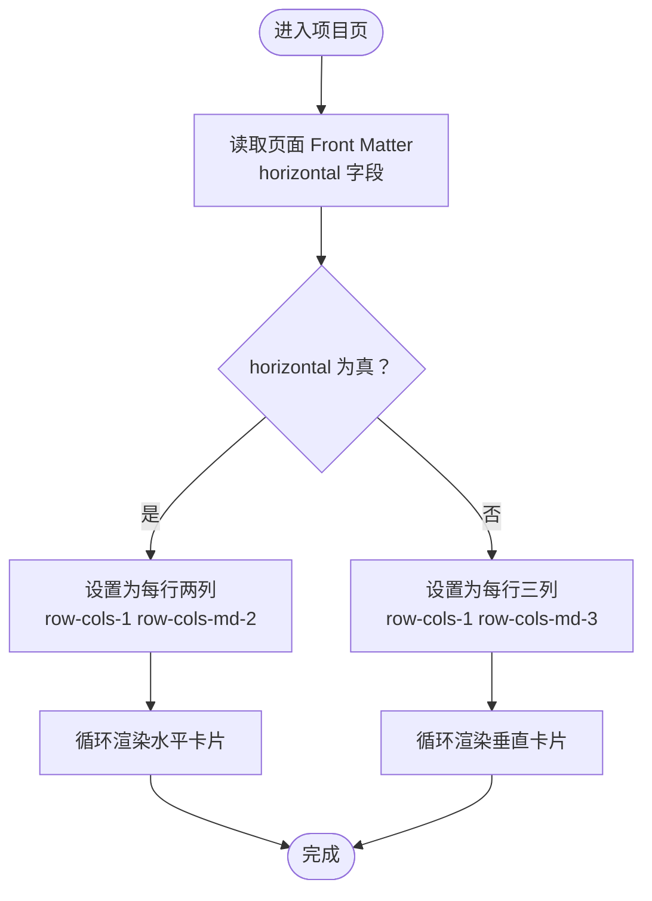
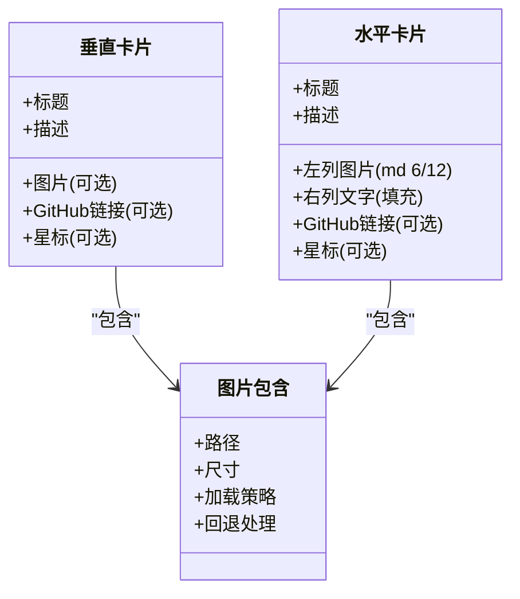
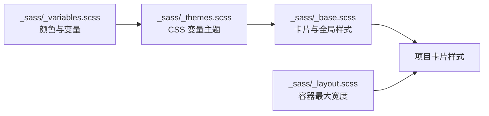
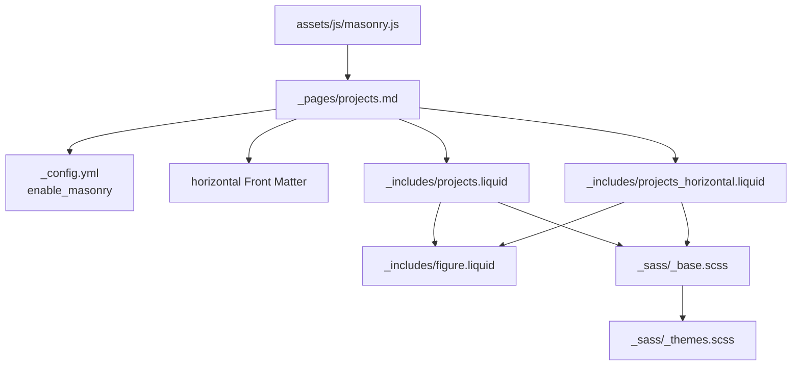

# 项目布局定制

<cite>
**本文引用的文件**
- [_pages/projects.md](file://_pages/projects.md)
- [_includes/projects.liquid](file://_includes/projects.liquid)
- [_includes/projects_horizontal.liquid](file://_includes/projects_horizontal.liquid)
- [_includes/figure.liquid](file://_includes/figure.liquid)
- [_sass/_base.scss](file://_sass/_base.scss)
- [_sass/_layout.scss](file://_sass/_layout.scss)
- [_sass/_themes.scss](file://_sass/_themes.scss)
- [_sass/_variables.scss](file://_sass/_variables.scss)
- [_config.yml](file://_config.yml)
- [assets/js/masonry.js](file://assets/js/masonry.js)
</cite>

## 目录
1. [简介](#简介)
2. [项目结构](#项目结构)
3. [核心组件](#核心组件)
4. [架构总览](#架构总览)
5. [详细组件分析](#详细组件分析)
6. [依赖关系分析](#依赖关系分析)
7. [性能考量](#性能考量)
8. [故障排查指南](#故障排查指南)
9. [结论](#结论)
10. [附录](#附录)

## 简介
本文件面向需要深度定制“项目”页面展示样式的开发者与内容维护者，系统性阐述以下主题：
- 垂直布局（projects.liquid）与水平布局（projects_horizontal.liquid）的差异、适用场景与切换机制
- 如何通过页面 Front Matter 与配置项控制项目网格列数、间距与响应式断点
- 项目卡片的设计元素：背景图、标题、描述、链接、GitHub 图标与星标等
- CSS 样式定制方法：颜色主题、字体与卡片样式、动画效果
- 实际示例：自定义样式类应用、响应式最佳实践
- 与整体网站设计风格的协调策略

## 项目结构
项目布局系统围绕“页面模板 + 包含模板 + 样式变量”的模式组织：
- 页面模板：在项目页中根据配置选择垂直或水平布局
- 包含模板：负责渲染单个项目的卡片，分别用于垂直与水平两种排版
- 样式层：通过 SCSS 变量与主题系统统一管理颜色、间距与卡片外观
- 配置层：通过站点配置与页面 Front Matter 控制布局行为

图表来源
- [_pages/projects.md:13-65](file://_pages/projects.md#L13-L65)
- [_includes/projects.liquid:1-36](file://_includes/projects.liquid#L1-L36)
- [_includes/projects_horizontal.liquid:1-35](file://_includes/projects_horizontal.liquid#L1-L35)
- [_includes/figure.liquid:36-86](file://_includes/figure.liquid#L36-L86)
- [_sass/_base.scss:169-184](file://_sass/_base.scss#L169-L184)
- [_sass/_themes.scss:7-32](file://_sass/_themes.scss#L7-L32)
- [_sass/_variables.scss:8-31](file://_sass/_variables.scss#L8-L31)
- [_sass/_layout.scss:30-32](file://_sass/_layout.scss#L30-L32)
- [_config.yml:386-391](file://_config.yml#L386-L391)
- [assets/js/masonry.js:1-12](file://assets/js/masonry.js#L1-L12)

章节来源
- [_pages/projects.md:1-66](file://_pages/projects.md#L1-L66)
- [_includes/projects.liquid:1-36](file://_includes/projects.liquid#L1-L36)
- [_includes/projects_horizontal.liquid:1-35](file://_includes/projects_horizontal.liquid#L1-L35)
- [_includes/figure.liquid:36-86](file://_includes/figure.liquid#L36-L86)
- [_sass/_base.scss:169-184](file://_sass/_base.scss#L169-L184)
- [_sass/_layout.scss:30-32](file://_sass/_layout.scss#L30-L32)
- [_sass/_themes.scss:7-32](file://_sass/_themes.scss#L7-L32)
- [_sass/_variables.scss:8-31](file://_sass/_variables.scss#L8-L31)
- [_config.yml:386-391](file://_config.yml#L386-L391)
- [assets/js/masonry.js:1-12](file://assets/js/masonry.js#L1-L12)

## 核心组件
- 项目页模板：根据页面 Front Matter 的 horizontal 字段决定使用垂直或水平卡片模板，并按 importance 排序输出
- 垂直卡片模板：每列三栏（md ≥ 768px 时），支持图片、标题、描述与 GitHub 信息
- 水平卡片模板：左右分栏，左侧为图片，右侧为文字，适合强调视觉素材
- 图片包含模板：统一处理图片加载、懒加载、尺寸与回退逻辑
- 样式系统：卡片背景、边框、悬停主题色、间距等由 SCSS 主题变量与基础样式控制
- 配置系统：启用瀑布流、项目分类、GitHub 星标等由站点配置与页面 Front Matter 共同决定

章节来源
- [_pages/projects.md:13-65](file://_pages/projects.md#L13-L65)
- [_includes/projects.liquid:1-36](file://_includes/projects.liquid#L1-L36)
- [_includes/projects_horizontal.liquid:1-35](file://_includes/projects_horizontal.liquid#L1-L35)
- [_includes/figure.liquid:36-86](file://_includes/figure.liquid#L36-L86)
- [_sass/_base.scss:169-184](file://_sass/_base.scss#L169-L184)
- [_sass/_themes.scss:7-32](file://_sass/_themes.scss#L7-L32)
- [_config.yml:386-391](file://_config.yml#L386-L391)

## 架构总览
下图展示了从页面到卡片再到样式的端到端流程：

图表来源
- [_pages/projects.md:23-37](file://_pages/projects.md#L23-L37)
- [_includes/projects.liquid:1-36](file://_includes/projects.liquid#L1-L36)
- [_includes/projects_horizontal.liquid:1-35](file://_includes/projects_horizontal.liquid#L1-L35)
- [_includes/figure.liquid:36-86](file://_includes/figure.liquid#L36-L86)
- [_sass/_base.scss:169-184](file://_sass/_base.scss#L169-L184)
- [_sass/_themes.scss:7-32](file://_sass/_themes.scss#L7-L32)

## 详细组件分析

### 布局模板与切换机制
- 垂直布局（默认）：md 屏幕下每行三列，适合密集展示与卡片高度一致的场景
- 水平布局：md 屏幕下每行两列，左右分栏突出图片与文字对比
- 切换依据：页面 Front Matter 中的 horizontal 字段；同时支持按类别分组展示

图表来源
- [_pages/projects.md:23-37](file://_pages/projects.md#L23-L37)
- [_pages/projects.md:48-63](file://_pages/projects.md#L48-L63)

章节来源
- [_pages/projects.md:13-65](file://_pages/projects.md#L13-L65)

### 卡片模板差异与设计元素
- 垂直卡片模板
  - 支持项目图片、标题、描述与 GitHub 链接及星标展示
  - 图片通过包含模板统一渲染，支持加载策略与尺寸参数
- 水平卡片模板
  - 左右分栏：左列固定宽度（md 下 6/12），右列填充剩余空间
  - 图片与文字并列，适合强调视觉素材与简洁文字
- 公共元素
  - 标题与描述来自项目数据
  - GitHub 图标与星标仅在存在对应字段时显示

图表来源
- [_includes/projects.liquid:1-36](file://_includes/projects.liquid#L1-L36)
- [_includes/projects_horizontal.liquid:1-35](file://_includes/projects_horizontal.liquid#L1-L35)
- [_includes/figure.liquid:36-86](file://_includes/figure.liquid#L36-L86)

章节来源
- [_includes/projects.liquid:1-36](file://_includes/projects.liquid#L1-L36)
- [_includes/projects_horizontal.liquid:1-35](file://_includes/projects_horizontal.liquid#L1-L35)
- [_includes/figure.liquid:36-86](file://_includes/figure.liquid#L36-L86)

### 样式系统与主题定制
- 主题变量：通过 CSS 变量集中定义全局文本、背景、主题色、卡片色等
- 基础卡片样式：卡片背景、内边距、标题颜色、图片占位等
- 响应式断点：基于 Bootstrap 断点（如 md），控制列数与布局密度
- 动画与交互：悬停主题色、卡片标题颜色变化等

图表来源
- [_sass/_variables.scss:8-31](file://_sass/_variables.scss#L8-L31)
- [_sass/_themes.scss:7-32](file://_sass/_themes.scss#L7-L32)
- [_sass/_base.scss:169-184](file://_sass/_base.scss#L169-L184)
- [_sass/_layout.scss:30-32](file://_sass/_layout.scss#L30-L32)

章节来源
- [_sass/_themes.scss:7-32](file://_sass/_themes.scss#L7-L32)
- [_sass/_base.scss:169-184](file://_sass/_base.scss#L169-L184)
- [_sass/_layout.scss:30-32](file://_sass/_layout.scss#L30-L32)
- [_sass/_variables.scss:8-31](file://_sass/_variables.scss#L8-L31)

### 网格列数、间距与响应式断点
- 列数控制：通过 Bootstrap 类 row-cols-* 在不同断点设置列数
  - 垂直布局：md ≥ 768px 时为每行三列
  - 水平布局：md ≥ 768px 时为每行两列
- 间距与对齐：卡片容器使用容器类与行类，确保在不同屏幕下的间距与对齐一致
- 响应式断点：利用 md 断点适配桌面端与移动端的展示密度

章节来源
- [_pages/projects.md:23-37](file://_pages/projects.md#L23-L37)
- [_pages/projects.md:48-63](file://_pages/projects.md#L48-L63)

### 自定义样式类与扩展点
- 卡片容器：可在项目页中添加自定义样式类以覆盖默认间距或对齐
- 图片样式：通过包含模板传入自定义类名，实现圆角、阴影、流式等效果
- 主题色系：通过主题变量统一替换全局主题色，保持与整体风格一致

章节来源
- [_includes/figure.liquid:36-86](file://_includes/figure.liquid#L36-L86)
- [_sass/_themes.scss:7-32](file://_sass/_themes.scss#L7-L32)
- [_sass/_base.scss:169-184](file://_sass/_base.scss#L169-L184)

### 布局系统与整体网站设计风格的协调
- 统一色彩体系：通过主题变量与颜色变量确保项目卡片与导航、页脚等模块色彩一致
- 字体与字号：遵循全局排版规范，避免卡片内部字体与整体不协调
- 动效与交互：卡片悬停主题色与整体交互风格保持一致，避免突兀

章节来源
- [_sass/_themes.scss:7-32](file://_sass/_themes.scss#L7-L32)
- [_sass/_base.scss:169-184](file://_sass/_base.scss#L169-L184)
- [_sass/_layout.scss:30-32](file://_sass/_layout.scss#L30-L32)

## 依赖关系分析
- 项目页模板依赖页面 Front Matter 的 horizontal 字段与站点配置
- 卡片模板依赖包含模板进行图片渲染
- 样式系统依赖主题变量与基础样式
- 瀑布流功能依赖外部库与初始化脚本

图表来源
- [_pages/projects.md:13-65](file://_pages/projects.md#L13-L65)
- [_includes/projects.liquid:1-36](file://_includes/projects.liquid#L1-L36)
- [_includes/projects_horizontal.liquid:1-35](file://_includes/projects_horizontal.liquid#L1-L35)
- [_includes/figure.liquid:36-86](file://_includes/figure.liquid#L36-L86)
- [_sass/_base.scss:169-184](file://_sass/_base.scss#L169-L184)
- [_sass/_themes.scss:7-32](file://_sass/_themes.scss#L7-L32)
- [_config.yml:386-391](file://_config.yml#L386-L391)
- [assets/js/masonry.js:1-12](file://assets/js/masonry.js#L1-L12)

章节来源
- [_pages/projects.md:13-65](file://_pages/projects.md#L13-L65)
- [_includes/projects.liquid:1-36](file://_includes/projects.liquid#L1-L36)
- [_includes/projects_horizontal.liquid:1-35](file://_includes/projects_horizontal.liquid#L1-L35)
- [_includes/figure.liquid:36-86](file://_includes/figure.liquid#L36-L86)
- [_sass/_base.scss:169-184](file://_sass/_base.scss#L169-L184)
- [_sass/_themes.scss:7-32](file://_sass/_themes.scss#L7-L32)
- [_config.yml:386-391](file://_config.yml#L386-L391)
- [assets/js/masonry.js:1-12](file://assets/js/masonry.js#L1-L12)

## 性能考量
- 图片懒加载：通过包含模板自动注入懒加载属性，减少首屏资源压力
- 响应式图片：结合站点配置与包含模板参数，优化移动端图片体积
- 瀑布流布局：启用瀑布流时需等待图片加载完成再布局，避免重排抖动

章节来源
- [_includes/figure.liquid:74-78](file://_includes/figure.liquid#L74-L78)
- [assets/js/masonry.js:1-12](file://assets/js/masonry.js#L1-L12)
- [_config.yml:374-375](file://_config.yml#L374-L375)

## 故障排查指南
- 卡片未按预期换列
  - 检查页面 Front Matter 的 horizontal 字段是否正确
  - 确认容器类与行类是否完整（row 与 row-cols-*）
- 图片不显示或加载失败
  - 检查项目 Front Matter 中的图片路径是否正确
  - 确认包含模板的路径与尺寸参数
- 瀑布流布局错乱
  - 确认已启用瀑布流相关配置
  - 检查图片加载完成事件是否触发

章节来源
- [_pages/projects.md:23-37](file://_pages/projects.md#L23-L37)
- [_includes/figure.liquid:36-86](file://_includes/figure.liquid#L36-L86)
- [assets/js/masonry.js:1-12](file://assets/js/masonry.js#L1-L12)
- [_config.yml:386-391](file://_config.yml#L386-L391)

## 结论
本布局系统通过“页面模板 + 包含模板 + 样式变量”的分层设计，提供了灵活且可扩展的项目展示能力。通过 Front Matter 与站点配置即可快速切换布局、控制网格密度与响应式表现；通过主题变量与基础样式实现风格统一与细节定制。建议在实际使用中优先遵循整体设计风格，合理运用响应式断点与图片优化策略，以获得更佳的用户体验。

## 附录
- 实用清单
  - 切换布局：在项目页 Front Matter 设置 horizontal
  - 控制列数：修改行类中的列数断点
  - 定制卡片：通过包含模板传入自定义类名
  - 主题统一：通过主题变量与颜色变量集中管理
  - 性能优化：启用懒加载与响应式图片，谨慎使用瀑布流