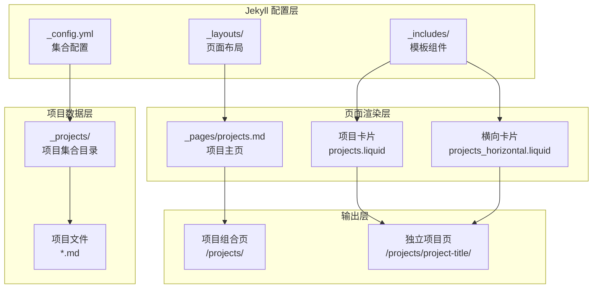
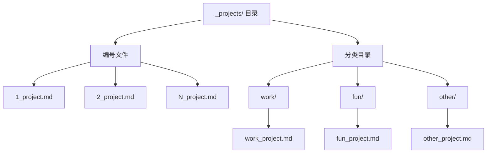
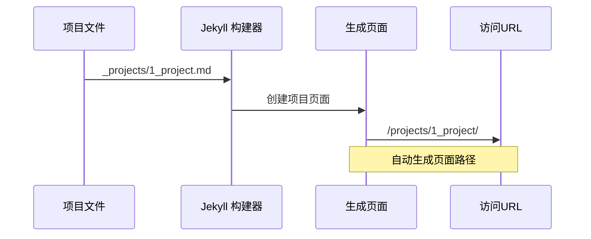
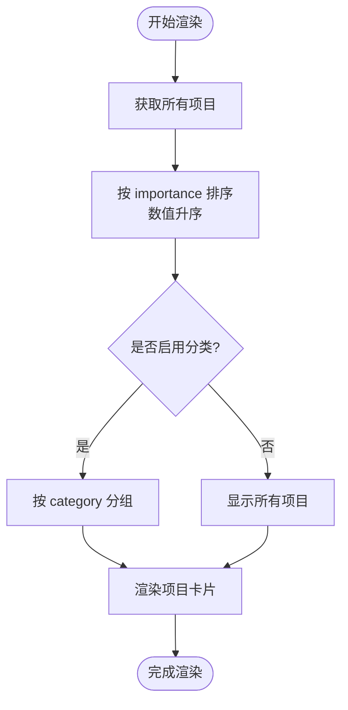
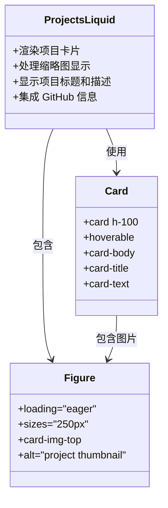
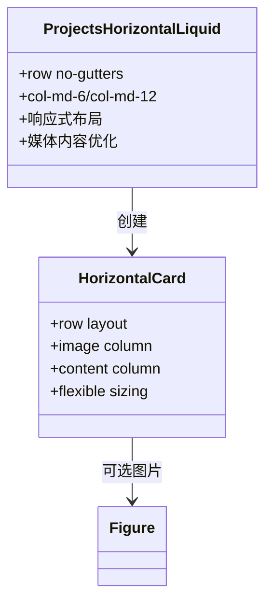
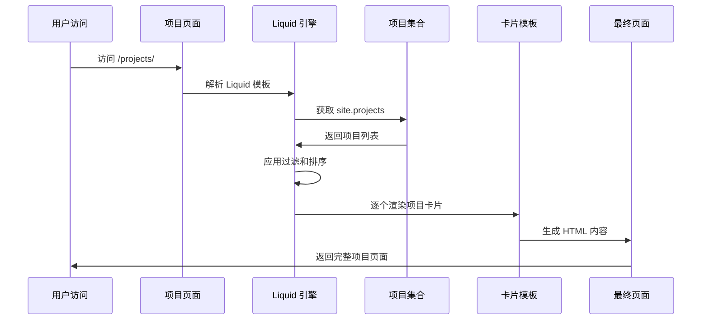
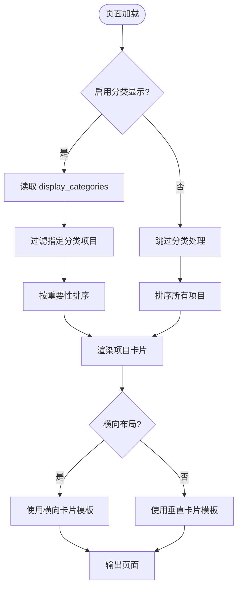

# 项目集合管理

<cite>
**本文档引用的文件**
- [_config.yml](file://_config.yml)
- [_pages/projects.md](file://_pages/projects.md)
- [_includes/projects.liquid](file://_includes/projects.liquid)
- [_includes/projects_horizontal.liquid](file://_includes/projects_horizontal.liquid)
- [_layouts/page.liquid](file://_layouts/page.liquid)
- [_projects/1_project.md](file://_projects/1_project.md)
- [_projects/2_project.md](file://_projects/2_project.md)
- [_projects/3_project.md](file://_projects/3_project.md)
- [_projects/4_project.md](file://_projects/4_project.md)
- [_projects/5_project.md](file://_projects/5_project.md)
- [_projects/6_project.md](file://_projects/6_project.md)
</cite>

## 目录
1. [简介](#简介)
2. [项目集合架构概览](#项目集合架构概览)
3. [项目文件命名规范](#项目文件命名规范)
4. [Front Matter 字段配置](#front-matter-字段配置)
5. [项目组织结构与页面映射](#项目组织结构与页面映射)
6. [显示顺序与分类逻辑](#显示顺序与分类逻辑)
7. [创建新项目示例](#创建新项目示例)
8. [项目卡片组件分析](#项目卡片组件分析)
9. [项目页面渲染流程](#项目页面渲染流程)
10. [最佳实践与注意事项](#最佳实践与注意事项)

## 简介

本项目集合管理系统基于 Jekyll 框架构建，专门用于管理和展示个人项目作品集。系统通过集合（Collections）机制对项目进行统一管理，支持多分类展示、自定义排序和灵活的布局选项。

项目集合管理的核心优势包括：
- 结构化的项目文件组织
- 灵活的分类和排序机制
- 响应式项目卡片展示
- 支持多种项目类型（工作项目、个人项目等）
- 自动化的内容生成和页面渲染

## 项目集合架构概览



**图表来源**
- [_config.yml:147-155](file://_config.yml#L147-L155)
- [_pages/projects.md:1-10](file://_pages/projects.md#L1-L10)

## 项目文件命名规范

### 文件命名规则

项目文件采用数字前缀加项目标识的命名模式：

```
[序号]_[项目名称].md
```

**有效示例：**
- `1_project.md` - 第一个项目
- `2_project.md` - 第二个项目  
- `10_my_awesome_project.md` - 序号为10的项目

### 目录组织结构



**图表来源**
- [_projects/1_project.md](file://_projects/1_project.md)
- [_projects/2_project.md](file://_projects/2_project.md)

**章节来源**
- [_projects/1_project.md:1-82](file://_projects/1_project.md#L1-L82)
- [_projects/2_project.md:1-82](file://_projects/2_project.md#L1-L82)

## Front Matter 字段配置

### 核心字段定义

| 字段名 | 类型 | 必需 | 描述 | 默认值 |
|--------|------|------|------|--------|
| `layout` | 字符串 | 是 | 页面布局类型 | `page` |
| `title` | 字符串 | 是 | 项目标题 | - |
| `description` | 字符串 | 是 | 项目描述 | - |
| `img` | 字符串 | 否 | 项目缩略图路径 | - |
| `importance` | 整数 | 否 | 项目重要性排序 | 1 |
| `category` | 字符串 | 否 | 项目分类标签 | `work` |
| `redirect` | 字符串 | 否 | 外部重定向链接 | - |
| `github` | 字符串 | 否 | GitHub 仓库链接 | - |
| `github_stars` | 字符串 | 否 | GitHub 星标统计 ID | - |
| `related_publications` | 布尔值 | 否 | 是否显示相关出版物 | `false` |
| `giscus_comments` | 布尔值 | 否 | 是否启用评论功能 | `false` |

### 字段配置示例

```yaml
---
layout: page
title: "机器学习项目"
description: "基于深度学习的图像识别系统"
img: assets/img/ml_project.jpg
importance: 1
category: work
redirect: https://github.com/example/ml-project
github: https://github.com/example/ml-project
github_stars: project-stars
related_publications: true
giscus_comments: true
---
```

**章节来源**
- [_projects/1_project.md:1-9](file://_projects/1_project.md#L1-L9)
- [_projects/2_project.md:1-9](file://_projects/2_project.md#L1-L9)
- [_projects/3_project.md:1-9](file://_projects/3_project.md#L1-L9)
- [_projects/4_project.md:1-8](file://_projects/4_project.md#L1-L8)

## 项目组织结构与页面映射

### 集合配置

项目集合在配置文件中定义：

```yaml
collections:
  projects:
    output: true
```

### 项目页面映射

每个项目文件自动映射到对应的页面路径：



**图表来源**
- [_config.yml:154-155](file://_config.yml#L154-L155)
- [_pages/projects.md:1-10](file://_pages/projects.md#L1-L10)

**章节来源**
- [_config.yml:147-155](file://_config.yml#L147-L155)
- [_pages/projects.md:1-10](file://_pages/projects.md#L1-L10)

## 显示顺序与分类逻辑

### 排序机制

项目按照 `importance` 字段进行升序排序，数值越小优先级越高：



**图表来源**
- [_pages/projects.md:20-21](file://_pages/projects.md#L20-L21)
- [_pages/projects.md:44](file://_pages/projects.md#L44)

### 分类显示控制

分类显示通过 `display_categories` 前言字段控制：

```yaml
display_categories: [work, fun]
```

系统会：
1. 获取配置的分类列表
2. 过滤对应分类的项目
3. 按重要性排序
4. 渲染分类标题和项目卡片

**章节来源**
- [_pages/projects.md:8](file://_pages/projects.md#L8)
- [_pages/projects.md:14-38](file://_pages/projects.md#L14-L38)
- [_pages/projects.md:40-64](file://_pages/projects.md#L40-L64)

## 创建新项目示例

### 基础项目模板

```yaml
---
layout: page
title: "项目标题"
description: "项目详细描述"
img: assets/img/project-image.jpg
importance: 1
category: work
---

项目内容区域
```

### 完整示例配置

以第7个项目的完整配置为例：

**文件路径：** `_projects/7_project.md`

```mermaid
graph LR
subgraph "Front Matter 配置"
FM[Front Matter]
Title[title: project 7]
Desc[description: a project with no image]
Img[img: (空)]
Imp[importance: 4]
Cat[category: fun]
end
subgraph "页面内容"
Content[Markdown 内容]
Media[图片和媒体]
Text[项目描述]
end
FM --> Content
Title --> Content
Desc --> Content
Img --> Content
Imp --> Content
Cat --> Content
Content --> Media
Content --> Text
```

**图表来源**
- [_projects/6_project.md:1-81](file://_projects/6_project.md#L1-L81)

### 项目类型示例

#### 工作项目示例
- 特点：包含缩略图、GitHub 链接
- 适用场景：专业技能展示
- 关键字段：`img`, `github`, `importance: 1`

#### 个人项目示例  
- 特点：简洁描述、无外部链接
- 适用场景：兴趣爱好展示
- 关键字段：`category: fun`, `importance: 3`

**章节来源**
- [_projects/5_project.md:1-81](file://_projects/5_project.md#L1-L81)
- [_projects/6_project.md:1-81](file://_projects/6_project.md#L1-L81)

## 项目卡片组件分析

### 垂直项目卡片

垂直布局的项目卡片组件负责渲染标准的项目展示：



**图表来源**
- [_includes/projects.liquid:1-36](file://_includes/projects.liquid#L1-L36)

### 横向项目卡片

横向布局支持更宽的项目展示，适合包含丰富媒体内容的项目：



**图表来源**
- [_includes/projects_horizontal.liquid:1-35](file://_includes/projects_horizontal.liquid#L1-L35)

**章节来源**
- [_includes/projects.liquid:1-36](file://_includes/projects.liquid#L1-L36)
- [_includes/projects_horizontal.liquid:1-35](file://_includes/projects_horizontal.liquid#L1-L35)

## 项目页面渲染流程

### 完整渲染序列



**图表来源**
- [_pages/projects.md:13-65](file://_pages/projects.md#L13-L65)

### 条件渲染逻辑



**图表来源**
- [_pages/projects.md:14-38](file://_pages/projects.md#L14-L38)
- [_pages/projects.md:40-64](file://_pages/projects.md#L40-L64)

**章节来源**
- [_pages/projects.md:13-65](file://_pages/projects.md#L13-L65)

## 最佳实践与注意事项

### 命名规范建议

1. **序号连续性**：确保项目序号连续，避免跳号
2. **文件名简洁**：使用下划线分隔，避免特殊字符
3. **语义化命名**：项目名称应清晰表达项目内容

### Front Matter 配置最佳实践

1. **重要性排序**：
   - 1-3：核心项目（高优先级）
   - 4-6：重要项目（中优先级）  
   - 7+：一般项目（低优先级）

2. **分类策略**：
   - `work`：专业技能相关项目
   - `fun`：个人兴趣项目
   - 可根据需要扩展自定义分类

3. **图片资源**：
   - 建议使用统一尺寸的缩略图
   - 图片路径使用相对路径
   - 提供合适的 alt 文本

### 性能优化建议

1. **图片优化**：压缩项目展示图片，提升页面加载速度
2. **懒加载**：利用现有懒加载机制减少初始加载时间
3. **缓存策略**：合理设置浏览器缓存头

### 维护注意事项

1. **定期更新**：保持项目信息的时效性
2. **分类一致性**：遵循既定的分类标准
3. **链接有效性**：定期检查外部链接的有效性
4. **SEO 优化**：确保标题和描述的准确性

通过遵循这些规范和最佳实践，可以确保项目集合管理系统的稳定运行和良好的用户体验。