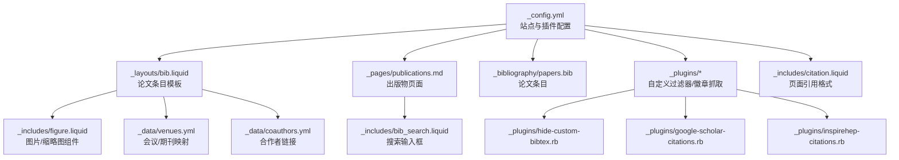
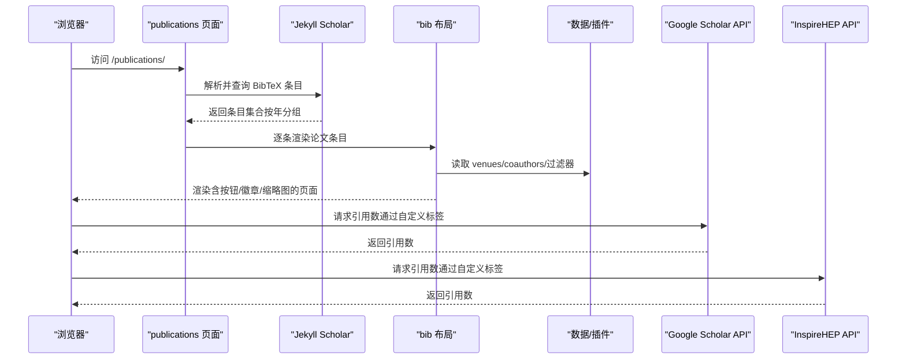
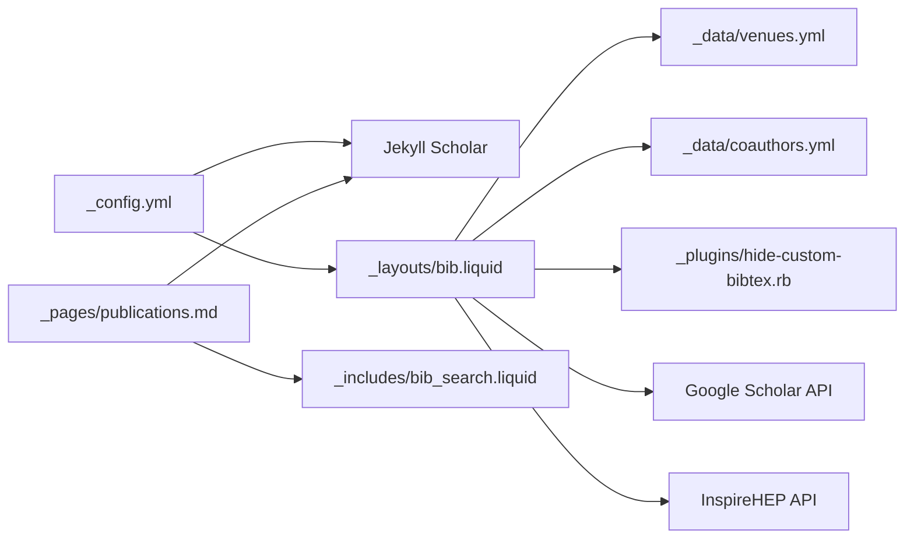

# 出版物管理系统

<cite>
**本文档引用的文件**
- [_config.yml](file://_config.yml)
- [_layouts/bib.liquid](file://_layouts/bib.liquid)
- [_pages/publications.md](file://_pages/publications.md)
- [_includes/bib_search.liquid](file://_includes/bib_search.liquid)
- [_includes/figure.liquid](file://_includes/figure.liquid)
- [_plugins/hide-custom-bibtex.rb](file://_plugins/hide-custom-bibtex.rb)
- [_plugins/google-scholar-citations.rb](file://_plugins/google-scholar-citations.rb)
- [_plugins/inspirehep-citations.rb](file://_plugins/inspirehep-citations.rb)
- [_data/venues.yml](file://_data/venues.yml)
- [_data/coauthors.yml](file://_data/coauthors.yml)
- [_bibliography/papers.bib](file://_bibliography/papers.bib)
- [_includes/citation.liquid](file://_includes/citation.liquid)
- [_plugins/cache-bust.rb](file://_plugins/cache-bust.rb)
</cite>

## 目录
1. [简介](#简介)
2. [项目结构](#项目结构)
3. [核心组件](#核心组件)
4. [架构总览](#架构总览)
5. [详细组件分析](#详细组件分析)
6. [依赖关系分析](#依赖关系分析)
7. [性能考量](#性能考量)
8. [故障排查指南](#故障排查指南)
9. [结论](#结论)
10. [附录](#附录)

## 简介
本系统是一个基于 Jekyll 的学术出版物管理与展示平台，围绕 BibTeX 数据组织、Jekyll Scholar 插件渲染、自定义模板与前端交互展开。其目标是帮助用户以最小成本维护高质量的论文列表，支持作者姓名匹配、引用样式、分组排序、缩略图与 PDF/链接关联、搜索过滤、外部引用统计徽章等能力。

## 项目结构
该站点采用 Jekyll 标准目录组织，关键出版物相关文件分布如下：
- 配置：根目录下站点与插件配置
- 数据：会议/期刊映射与合作者信息
- 模板：论文条目渲染布局
- 页面：公开出版物页面与搜索入口
- 插件：自定义过滤器与徽章抓取
- BibTeX：论文条目集合

图表来源
- [_config.yml:264-330](file://_config.yml#L264-L330)
- [_layouts/bib.liquid:1-373](file://_layouts/bib.liquid#L1-L373)
- [_pages/publications.md:1-21](file://_pages/publications.md#L1-L21)
- [_includes/bib_search.liquid:1-5](file://_includes/bib_search.liquid#L1-L5)
- [_includes/figure.liquid:1-87](file://_includes/figure.liquid#L1-L87)
- [_data/venues.yml:1-64](file://_data/venues.yml#L1-L64)
- [_data/coauthors.yml:1-35](file://_data/coauthors.yml#L1-L35)
- [_bibliography/papers.bib:1-75](file://_bibliography/papers.bib#L1-L75)
- [_plugins/hide-custom-bibtex.rb:1-19](file://_plugins/hide-custom-bibtex.rb#L1-L19)
- [_plugins/google-scholar-citations.rb:1-86](file://_plugins/google-scholar-citations.rb#L1-L86)
- [_plugins/inspirehep-citations.rb:1-58](file://_plugins/inspirehep-citations.rb#L1-L58)
- [_includes/citation.liquid:1-27](file://_includes/citation.liquid#L1-L27)

章节来源
- [_config.yml:264-330](file://_config.yml#L264-L330)
- [_pages/publications.md:1-21](file://_pages/publications.md#L1-L21)

## 核心组件
- Jekyll Scholar 配置与渲染
  - 通过配置项指定作者名、样式、源目录、条目模板、分组方式等，控制论文列表的呈现与排序。
  - 论文条目在页面中由布局模板统一渲染，支持作者高亮、缩略图、按钮区（PDF/HTML/arXiv/DOI/视频/代码等）与外部徽章。
- BibTeX 组织与字段
  - 使用标准条目类型与字段；同时支持扩展字段（如 abbr、selected、award、preview、poster、slides、video、code、website 等），用于增强展示与功能。
- 搜索与过滤
  - 提供前端搜索输入框与脚本，按标题/作者/年份等关键词过滤显示。
- 缩略图与媒体
  - 支持本地或外链预览图，自动响应式图片与懒加载；可选视频内嵌播放。
- 外部引用统计
  - 通过自定义 Liquid 标签抓取 Google Scholar 与 InspireHEP 的引用次数，动态显示徽章。

章节来源
- [_config.yml:264-330](file://_config.yml#L264-L330)
- [_layouts/bib.liquid:1-373](file://_layouts/bib.liquid#L1-L373)
- [_includes/bib_search.liquid:1-5](file://_includes/bib_search.liquid#L1-L5)
- [_plugins/hide-custom-bibtex.rb:1-19](file://_plugins/hide-custom-bibtex.rb#L1-L19)
- [_plugins/google-scholar-citations.rb:1-86](file://_plugins/google-scholar-citations.rb#L1-L86)
- [_plugins/inspirehep-citations.rb:1-58](file://_plugins/inspirehep-citations.rb#L1-L58)

## 架构总览
下图展示了从页面请求到最终渲染的端到端流程，以及与外部服务的交互。

图表来源
- [_pages/publications.md:1-21](file://_pages/publications.md#L1-L21)
- [_layouts/bib.liquid:1-373](file://_layouts/bib.liquid#L1-L373)
- [_plugins/google-scholar-citations.rb:1-86](file://_plugins/google-scholar-citations.rb#L1-L86)
- [_plugins/inspirehep-citations.rb:1-58](file://_plugins/inspirehep-citations.rb#L1-L58)

## 详细组件分析

### Jekyll Scholar 配置与使用
- 关键配置项
  - 作者匹配：通过 last_name 与 first_name 列表进行姓名识别，用于高亮“自己”的作者。
  - 引用样式：style 指定样式风格；locale 指定语言环境。
  - 数据源：source 指向 BibTeX 目录；bibliography 指定主文件；bibliography_template 指定渲染模板。
  - 过滤策略：replace_strings、join_strings 控制字符串处理；bibtex_filters 可启用 LaTeX/小写/上标等预处理。
  - 分组与排序：group_by 按年分组；group_order 控制顺序。
  - 输出细节页：details_dir 与 details_link 控制详情页路径与链接文本。
  - 关键词过滤：filtered_bibtex_keywords 定义内部关键字，避免输出到最终显示。
- 渲染行为
  - 模板通过 entry 对象访问字段，结合配置项决定是否显示缩略图、作者上限、徽章等。

章节来源
- [_config.yml:264-330](file://_config.yml#L264-L330)
- [_layouts/bib.liquid:1-373](file://_layouts/bib.liquid#L1-L373)

### BibTeX 条目组织与字段定义
- 标准字段
  - 必填：author、title、year；常见：journal/booktitle/venue、pages、volume、number、doi、url、note 等。
- 扩展字段（系统已使用）
  - abbr：会议/期刊简称，用于缩略徽章与颜色标识。
  - selected：标记精选条目，便于筛选或样式区分。
  - preview/poster/slides/video/code/website/html/pdf/supp：资源链接或本地路径，自动解析为按钮。
  - arxiv/eprint：预印本链接。
  - award/award_name：奖项信息与名称。
  - annotation：悬停提示信息。
  - google_scholar_id/inspirehep_id：外部引用统计所需标识。
  - additional_info：附加说明文本。
- 示例条目
  - 包含会议、期刊、arXiv、海报、精选标记等字段，展示完整用法。

章节来源
- [_layouts/bib.liquid:188-256](file://_layouts/bib.liquid#L188-L256)
- [_bibliography/papers.bib:1-75](file://_bibliography/papers.bib#L1-L75)

### 出版物模板与自定义
- 年份分组
  - 由 Scholar 配置的 group_by/year 控制；模板按分组渲染标题与条目。
- 作者列表限制
  - 通过 max_author_limit 控制默认显示数量；超出部分以“更多作者”形式点击展开。
- 缩略图显示
  - 启用 enable_publication_thumbnails 后，左侧显示 abbr 徽章与 preview 图片；支持本地路径与外链。
- 按钮区与资源关联
  - 模板根据字段自动渲染 PDF、HTML、arXiv、DOI、视频、代码、海报、幻灯片、网站等按钮；本地路径会自动拼接 assets/pdf 或 assets/img/publication_preview。
- 外部徽章
  - Altmetric/Dimensions/Google Scholar/InspireHEP 徽章按配置与条目字段条件显示；Google Scholar 通过自定义标签抓取引用数。
- 作者姓名匹配
  - 模板根据 last_name/first_name 列表高亮“自己”的作者；同时支持 coauthors.yml 中的合著者链接跳转。

章节来源
- [_config.yml:292-330](file://_config.yml#L292-L330)
- [_layouts/bib.liquid:1-373](file://_layouts/bib.liquid#L1-L373)
- [_data/venues.yml:1-64](file://_data/venues.yml#L1-L64)
- [_data/coauthors.yml:1-35](file://_data/coauthors.yml#L1-L35)

### 搜索与过滤
- 前端搜索
  - 在页面中引入搜索输入框与脚本；输入时实时过滤显示的论文条目。
- 过滤器
  - hide-custom-bibtex 过滤器移除内部关键字，清理作者标注，确保输出干净。

章节来源
- [_includes/bib_search.liquid:1-5](file://_includes/bib_search.liquid#L1-L5)
- [_plugins/hide-custom-bibtex.rb:1-19](file://_plugins/hide-custom-bibtex.rb#L1-L19)

### 缩略图与媒体处理
- 图片组件
  - figure.liquid 支持响应式 WebP 源集、懒加载、错误回退与缩放；可选自动尺寸 sizes。
- 预览图
  - preview 字段支持外链或本地路径；本地路径会自动拼接 assets/img/publication_preview 并调用图片组件。

章节来源
- [_includes/figure.liquid:1-87](file://_includes/figure.liquid#L1-L87)
- [_layouts/bib.liquid:28-44](file://_layouts/bib.liquid#L28-L44)

### 外部引用统计与徽章
- Google Scholar 引用
  - 自定义 Liquid 标签抓取文章页面元信息中的“被引次数”，带缓存与随机延时防封。
- InspireHEP 引用
  - 通过 API 获取文献的 citation_count，格式化为易读数字。
- 徽章显示
  - 模板根据配置与条目字段条件渲染徽章区域；支持 Altmetric/Dimensions/Google Scholar/InspireHEP。

章节来源
- [_plugins/google-scholar-citations.rb:1-86](file://_plugins/google-scholar-citations.rb#L1-L86)
- [_plugins/inspirehep-citations.rb:1-58](file://_plugins/inspirehep-citations.rb#L1-L58)
- [_layouts/bib.liquid:257-340](file://_layouts/bib.liquid#L257-L340)

### 页面引用格式
- 页面引用块
  - 自动生成页面引用文案与 BibTeX 片段，便于他人引用。

章节来源
- [_includes/citation.liquid:1-27](file://_includes/citation.liquid#L1-L27)

### 资源缓存与版本控制
- 缓存破坏
  - 提供缓存破坏过滤器，确保静态资源更新后能及时生效。

章节来源
- [_plugins/cache-bust.rb:1-51](file://_plugins/cache-bust.rb#L1-L51)

## 依赖关系分析
- 配置依赖
  - _config.yml 决定 Scholar 行为、徽章开关、作者上限、缩略图开关、bibtex 过滤关键字等。
- 模板依赖
  - _layouts/bib.liquid 依赖 _data/venues.yml、_data/coauthors.yml、hide-custom-bibtex 过滤器。
- 外部服务
  - Google Scholar 与 InspireHEP API 通过自定义标签抓取数据。
- 页面与搜索
  - _pages/publications.md 通过 _includes/bib_search.liquid 引入搜索输入框，再调用 Scholar 渲染条目。

图表来源
- [_config.yml:264-330](file://_config.yml#L264-L330)
- [_layouts/bib.liquid:1-373](file://_layouts/bib.liquid#L1-L373)
- [_data/venues.yml:1-64](file://_data/venues.yml#L1-L64)
- [_data/coauthors.yml:1-35](file://_data/coauthors.yml#L1-L35)
- [_plugins/hide-custom-bibtex.rb:1-19](file://_plugins/hide-custom-bibtex.rb#L1-L19)
- [_pages/publications.md:1-21](file://_pages/publications.md#L1-L21)
- [_includes/bib_search.liquid:1-5](file://_includes/bib_search.liquid#L1-L5)

## 性能考量
- 搜索性能
  - 前端过滤在客户端执行，建议控制条目数量或增加索引优化。
- 外部抓取
  - Google Scholar 抓取包含随机延时与缓存，避免频繁请求导致失败；建议合理设置刷新频率。
- 图片与懒加载
  - 启用懒加载与响应式 WebP 可显著降低首屏加载时间。
- 缓存破坏
  - 使用缓存破坏过滤器确保资源更新，避免浏览器缓存导致的样式/脚本不一致。

## 故障排查指南
- Scholar 未显示条目
  - 检查 source 与 bibliography 路径是否正确；确认文件存在且语法无误。
- 作者未高亮
  - 确认 _config.yml 中 last_name/first_name 与条目作者名一致（含星号/上下标需清理）。
- 缩略图不显示
  - 检查 preview 字段路径与 enable_publication_thumbnails 开关；本地路径需位于 assets/img/publication_preview。
- PDF/链接无法打开
  - 确认 pdf/poster/slides 等字段路径拼接正确；外链需包含协议头。
- 引用统计异常
  - Google Scholar 抓取可能受网络/反爬影响，检查返回值与缓存；InspireHEP API 返回为空时检查 recid。
- 搜索无效
  - 确认 _includes/bib_search.liquid 已引入且脚本加载成功。

章节来源
- [_config.yml:264-330](file://_config.yml#L264-L330)
- [_layouts/bib.liquid:188-256](file://_layouts/bib.liquid#L188-L256)
- [_plugins/google-scholar-citations.rb:1-86](file://_plugins/google-scholar-citations.rb#L1-L86)
- [_plugins/inspirehep-citations.rb:1-58](file://_plugins/inspirehep-citations.rb#L1-L58)

## 结论
本系统通过 Jekyll Scholar 与自定义模板、数据与插件的协同，实现了从 BibTeX 组织到页面渲染、搜索过滤与外部统计的一体化方案。遵循本文档的配置与使用规范，可高效维护高质量的学术出版物页面，并灵活扩展展示与交互能力。

## 附录

### 实际 BibTeX 条目示例与字段说明
- 示例条目
  - 会议论文：包含 abbr、title、author、booktitle、year、arxiv、selected、poster 等字段。
  - 期刊论文：包含 journal、html、arxiv、selected 等字段。
- 字段速查
  - 标准：author/title/year/journal/booktitle/venue/pages/volume/number/doi/url/note
  - 扩展：abbr/selected/preview/poster/slides/video/code/website/html/pdf/supp/arxiv/eprint/award/award_name/annotation/google_scholar_id/inspirehep_id/additional_info

章节来源
- [_bibliography/papers.bib:1-75](file://_bibliography/papers.bib#L1-L75)

### 配置案例要点
- Scholar 基础
  - 设置作者名、样式、源目录、主文件、模板、分组与过滤关键字。
- 展示定制
  - 控制作者上限、缩略图开关、视频内嵌开关、徽章开关与颜色主题。
- 数据映射
  - venues.yml 用于会议/期刊简称与颜色；coauthors.yml 用于合著者链接。

章节来源
- [_config.yml:264-330](file://_config.yml#L264-L330)
- [_data/venues.yml:1-64](file://_data/venues.yml#L1-L64)
- [_data/coauthors.yml:1-35](file://_data/coauthors.yml#L1-L35)