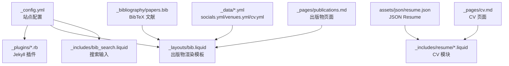
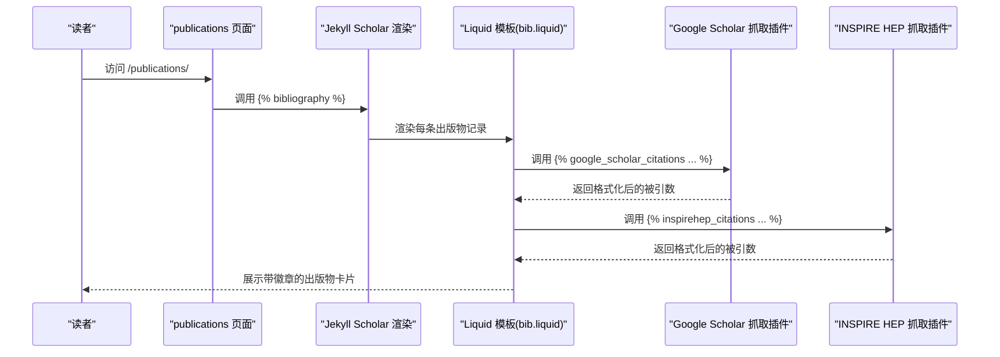
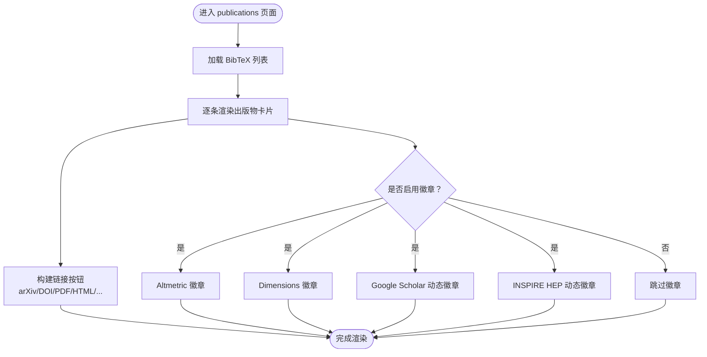
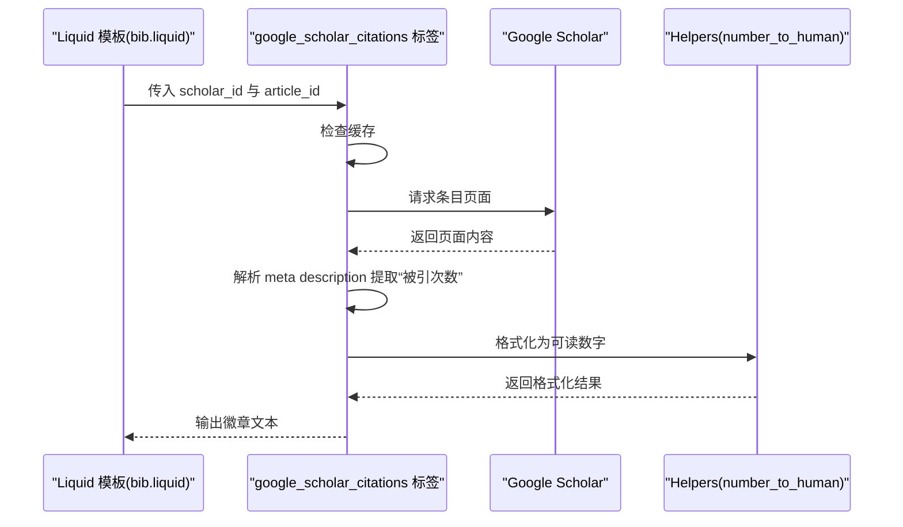
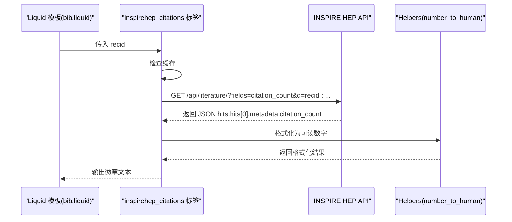
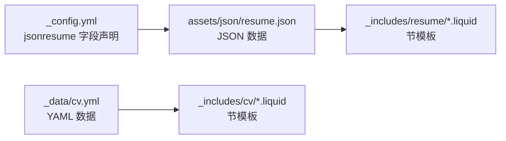
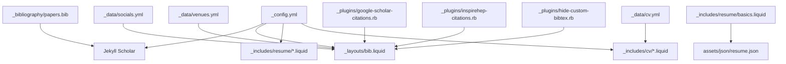

# 学术功能模块

<cite>
**本文档引用的文件**
- [_config.yml](file://_config.yml)
- [_plugins/google-scholar-citations.rb](file://_plugins/google-scholar-citations.rb)
- [_plugins/inspirehep-citations.rb](file://_plugins/inspirehep-citations.rb)
- [_plugins/hide-custom-bibtex.rb](file://_plugins/hide-custom-bibtex.rb)
- [_layouts/bib.liquid](file://_layouts/bib.liquid)
- [_includes/bib_search.liquid](file://_includes/bib_search.liquid)
- [_pages/publications.md](file://_pages/publications.md)
- [_pages/cv.md](file://_pages/cv.md)
- [_data/cv.yml](file://_data/cv.yml)
- [_data/socials.yml](file://_data/socials.yml)
- [_data/venues.yml](file://_data/venues.yml)
- [_includes/citation.liquid](file://_includes/citation.liquid)
- [_includes/resume/basics.liquid](file://_includes/resume/basics.liquid)
- [papers.bib](file://_bibliography/papers.bib)
- [resume.json](file://assets/json/resume.json)
</cite>

## 目录
1. [简介](#简介)
2. [项目结构](#项目结构)
3. [核心组件](#核心组件)
4. [架构总览](#架构总览)
5. [详细组件分析](#详细组件分析)
6. [依赖关系分析](#依赖关系分析)
7. [性能考量](#性能考量)
8. [故障排查指南](#故障排查指南)
9. [结论](#结论)
10. [附录](#附录)

## 简介
本文件面向使用 al-folio 的学术型站点维护者，系统性梳理“学术功能模块”的实现与最佳实践，覆盖以下主题：
- 出版物管理系统：BibTeX 文件组织、引用字段扩展、PDF/链接关联、搜索过滤
- Google Scholar 集成：统计获取与展示（含动态抓取）
- 学术徽章系统：Altmetric、Dimensions、Google Scholar、INSPIRE HEP
- INSPIRE HEP 集成与其他学术数据库连接
- CV 生成系统：JSON Resume 与 YAML 两种模式
- 内容组织与工作流建议
- 实际配置示例与使用场景

## 项目结构
al-folio 将学术功能以“配置 + 数据 + 模板 + 插件”的方式组织：
- 配置层：通过站点配置控制 Jekyll Scholar、徽章开关、作者信息等
- 数据层：BibTeX 文献、社交与会议信息、CV 结构化数据
- 模板层：Jekyll Scholar 渲染模板、出版物卡片布局、搜索输入
- 插件层：自定义 Liquid 标签与过滤器，实现外部统计抓取与字段清理

图表来源
- [_config.yml](file://_config.yml)
- [_layouts/bib.liquid](file://_layouts/bib.liquid)
- [_includes/bib_search.liquid](file://_includes/bib_search.liquid)
- [_pages/publications.md](file://_pages/publications.md)
- [_pages/cv.md](file://_pages/cv.md)
- [_data/socials.yml](file://_data/socials.yml)
- [_data/venues.yml](file://_data/venues.yml)
- [_data/cv.yml](file://_data/cv.yml)
- [papers.bib](file://_bibliography/papers.bib)
- [resume.json](file://assets/json/resume.json)

章节来源
- [_config.yml](file://_config.yml)
- [_pages/publications.md](file://_pages/publications.md)
- [_pages/cv.md](file://_pages/cv.md)

## 核心组件
- 出版物系统
  - BibTeX 来源与样式：通过 Jekyll Scholar 配置指定源目录、主文件、模板与分组规则
  - 字段扩展：支持 arXiv、DOI、HTML、PDF、视频、代码、海报、幻灯片、网站等
  - 徽章系统：可按配置启用 Altmetric、Dimensions、Google Scholar、INSPIRE HEP
  - 搜索与筛选：页面内提供搜索框，结合 JS 过滤显示
- 引用统计抓取
  - Google Scholar：通过自定义 Liquid 标签动态抓取“被引次数”，带缓存与随机延时
  - INSPIRE HEP：通过 API 获取引用计数，格式化为可读数字
- 学术徽章
  - Altmetric/Dimensions：基于 entry 字段或 arXiv/DOI/PMID/ISBN 自动注入徽章
  - Google Scholar/INSPIRE HEP：在卡片上显示动态徽章与链接
- INSPIRE HEP 集成
  - 通过 API 查询文献引用计数，支持字段映射与错误处理
- CV 生成
  - JSON Resume：从 JSON 数据渲染多板块 CV
  - YAML：通过结构化 YAML 驱动模板渲染时间线、列表等
- 数据与配置
  - 社交账号与 Scholar ID：用于徽章链接与统计抓取
  - 会议简称与颜色：用于出版物缩写徽章样式

章节来源
- [_config.yml](file://_config.yml)
- [_layouts/bib.liquid](file://_layouts/bib.liquid)
- [_plugins/google-scholar-citations.rb](file://_plugins/google-scholar-citations.rb)
- [_plugins/inspirehep-citations.rb](file://_plugins/inspirehep-citations.rb)
- [_plugins/hide-custom-bibtex.rb](file://_plugins/hide-custom-bibtex.rb)
- [_data/socials.yml](file://_data/socials.yml)
- [_data/venues.yml](file://_data/venues.yml)
- [papers.bib](file://_bibliography/papers.bib)
- [resume.json](file://assets/json/resume.json)
- [_data/cv.yml](file://_data/cv.yml)

## 架构总览
下图展示了从配置到页面渲染的关键路径，以及插件如何在构建期注入外部统计。

图表来源
- [_pages/publications.md](file://_pages/publications.md)
- [_layouts/bib.liquid](file://_layouts/bib.liquid)
- [_plugins/google-scholar-citations.rb](file://_plugins/google-scholar-citations.rb)
- [_plugins/inspirehep-citations.rb](file://_plugins/inspirehep-citations.rb)

## 详细组件分析

### 出版物管理系统（BibTeX 与渲染）
- BibTeX 来源与样式
  - 指定源目录、主文件、模板、分组与排序规则
  - 启用字符串替换与过滤，确保输出整洁
- 字段扩展与按钮
  - 支持 arXiv、DOI、HTML、PDF、Supp、Video、Blog、Code、Poster、Slides、Website 等
  - 可根据配置启用视频嵌入或外链
- 缩略图与会议徽章
  - 通过会议简称映射颜色与链接，增强识别度
- 搜索与筛选
  - 页面内提供搜索框，加载脚本后实时过滤

图表来源
- [_pages/publications.md](file://_pages/publications.md)
- [_layouts/bib.liquid](file://_layouts/bib.liquid)
- [_includes/bib_search.liquid](file://_includes/bib_search.liquid)
- [_data/venues.yml](file://_data/venues.yml)

章节来源
- [_config.yml](file://_config.yml)
- [_layouts/bib.liquid](file://_layouts/bib.liquid)
- [_includes/bib_search.liquid](file://_includes/bib_search.liquid)
- [_data/venues.yml](file://_data/venues.yml)
- [papers.bib](file://_bibliography/papers.bib)

### Google Scholar 集成（统计抓取与展示）
- 统计来源
  - 使用自定义 Liquid 标签调用 Google Scholar 页面，解析 meta 描述中的“被引次数”
  - 对同一文章的多次请求进行缓存，避免重复抓取
  - 抓取前加入随机延时，降低被反爬虫拦截的风险
- 展示方式
  - 在出版物卡片中以徽章形式显示，点击可跳转至对应条目页面
  - 使用人性化数字格式（K/M/B）

图表来源
- [_layouts/bib.liquid](file://_layouts/bib.liquid)
- [_plugins/google-scholar-citations.rb](file://_plugins/google-scholar-citations.rb)
- [_data/socials.yml](file://_data/socials.yml)

章节来源
- [_plugins/google-scholar-citations.rb](file://_plugins/google-scholar-citations.rb)
- [_layouts/bib.liquid](file://_layouts/bib.liquid)
- [_data/socials.yml](file://_data/socials.yml)

### INSPIRE HEP 集成（统计抓取与展示）
- 统计来源
  - 通过 API 查询文献引用计数，解析 JSON 响应
  - 对同一 recid 的多次请求进行缓存
- 展示方式
  - 在出版物卡片中以徽章形式显示，点击可跳转至 INSPIRE HEP 文献页

图表来源
- [_layouts/bib.liquid](file://_layouts/bib.liquid)
- [_plugins/inspirehep-citations.rb](file://_plugins/inspirehep-citations.rb)

章节来源
- [_plugins/inspirehep-citations.rb](file://_plugins/inspirehep-citations.rb)
- [_layouts/bib.liquid](file://_layouts/bib.liquid)

### 学术徽章系统（Altmetric、Dimensions、Google Scholar、INSPIRE HEP）
- Altmetric
  - 可通过 entry 的 altmetric 字段或自动推断 arXiv/DOI/PMID/ISBN 注入徽章
- Dimensions
  - 可通过 entry 的 dimensions 字段或自动推断 DOI/PMID 注入徽章
- Google Scholar
  - 通过 entry 的 google_scholar_id 与站点配置的 Scholar 用户 ID，动态抓取并展示
- INSPIRE HEP
  - 通过 entry 的 inspirehep_id，动态抓取并展示

章节来源
- [_layouts/bib.liquid](file://_layouts/bib.liquid)
- [_data/socials.yml](file://_data/socials.yml)

### BibTeX 字段清理与过滤
- 过滤关键词
  - 通过配置项定义内部关键词列表，构建正则批量移除
- 作者标注清理
  - 清理作者列表中的特殊标记符号，保证输出整洁

章节来源
- [_plugins/hide-custom-bibtex.rb](file://_plugins/hide-custom-bibtex.rb)
- [_config.yml](file://_config.yml)

### CV 生成系统（JSON Resume 与 YAML）
- JSON Resume 模式
  - 通过站点配置声明需要的节，模板按节渲染
  - 数据来自 JSON 文件，适合自动化导出与版本管理
- YAML 模式
  - 通过结构化 YAML 定义各板块类型（map、time_table、nested_list、list），模板按类型渲染
  - 适合手写与可视化编辑

图表来源
- [_config.yml](file://_config.yml)
- [resume.json](file://assets/json/resume.json)
- [_data/cv.yml](file://_data/cv.yml)

章节来源
- [_config.yml](file://_config.yml)
- [_pages/cv.md](file://_pages/cv.md)
- [_includes/resume/basics.liquid](file://_includes/resume/basics.liquid)
- [_data/cv.yml](file://_data/cv.yml)
- [resume.json](file://assets/json/resume.json)

## 依赖关系分析
- 配置驱动
  - 站点配置决定 Jekyll Scholar 行为、徽章开关、作者与会议信息
- 模板耦合
  - 出版物模板依赖社交与会议数据，以及插件提供的统计值
- 插件耦合
  - Google Scholar 与 INSPIRE HEP 插件分别依赖网络访问与第三方 API
- 数据耦合
  - JSON Resume 与 YAML CV 分别依赖对应的模板与数据文件

图表来源
- [_config.yml](file://_config.yml)
- [_layouts/bib.liquid](file://_layouts/bib.liquid)
- [_plugins/google-scholar-citations.rb](file://_plugins/google-scholar-citations.rb)
- [_plugins/inspirehep-citations.rb](file://_plugins/inspirehep-citations.rb)
- [_plugins/hide-custom-bibtex.rb](file://_plugins/hide-custom-bibtex.rb)
- [_data/socials.yml](file://_data/socials.yml)
- [_data/venues.yml](file://_data/venues.yml)
- [papers.bib](file://_bibliography/papers.bib)
- [resume.json](file://assets/json/resume.json)
- [_data/cv.yml](file://_data/cv.yml)

章节来源
- [_config.yml](file://_config.yml)
- [_layouts/bib.liquid](file://_layouts/bib.liquid)
- [_plugins/google-scholar-citations.rb](file://_plugins/google-scholar-citations.rb)
- [_plugins/inspirehep-citations.rb](file://_plugins/inspirehep-citations.rb)
- [_plugins/hide-custom-bibtex.rb](file://_plugins/hide-custom-bibtex.rb)
- [_data/socials.yml](file://_data/socials.yml)
- [_data/venues.yml](file://_data/venues.yml)
- [papers.bib](file://_bibliography/papers.bib)
- [resume.json](file://assets/json/resume.json)
- [_data/cv.yml](file://_data/cv.yml)

## 性能考量
- 抓取频率与缓存
  - Google Scholar 与 INSPIRE HEP 插件已内置缓存，避免重复请求
  - 建议在本地开发时开启缓存，生产构建时保持稳定
- 网络与超时
  - 抓取前的随机延时有助于规避限流；若网络不稳定，建议增加重试策略
- 模板渲染
  - 大量徽章与链接会增加 DOM 体积，建议仅启用必要的徽章
- 搜索性能
  - 前端搜索在小规模数据集表现良好；大规模文献建议考虑服务端过滤或分页

## 故障排查指南
- Google Scholar 抓取失败
  - 现象：徽章显示为“N/A”，控制台打印异常信息
  - 排查：检查 Scholar 用户 ID 与条目 ID 是否正确；确认网络可达；适当延长等待时间
- INSPIRE HEP 抓取失败
  - 现象：徽章显示为“N/A”，控制台打印异常信息
  - 排查：确认 recid 正确；检查 API 可达性；查看响应结构是否变化
- BibTeX 字段未生效
  - 现象：某些字段（如 arXiv/DOI/HTML）未显示
  - 排查：确认字段名大小写与模板匹配；检查过滤关键词是否误删
- 会议徽章样式缺失
  - 现象：会议简称未着色或无链接
  - 排查：确认 venues.yml 中是否存在该简称及其 url/color

章节来源
- [_plugins/google-scholar-citations.rb](file://_plugins/google-scholar-citations.rb)
- [_plugins/inspirehep-citations.rb](file://_plugins/inspirehep-citations.rb)
- [_plugins/hide-custom-bibtex.rb](file://_plugins/hide-custom-bibtex.rb)
- [_layouts/bib.liquid](file://_layouts/bib.liquid)
- [_data/venues.yml](file://_data/venues.yml)

## 结论
al-folio 的学术功能模块以配置为中心、以模板为载体、以插件为扩展，实现了从文献组织、统计抓取到展示呈现的完整闭环。通过合理配置与数据维护，可以高效地构建专业的学术主页与 CV。建议在团队协作中统一 BibTeX 字段规范与徽章策略，并定期校验外部服务的可用性与稳定性。

## 附录

### 配置示例与使用场景
- 启用/禁用徽章
  - 在站点配置中设置徽章开关，控制 Altmetric、Dimensions、Google Scholar、INSPIRE HEP 的显示
- 添加会议徽章
  - 在 venues.yml 中为常用会议添加颜色与链接，提升识别度
- 设置 Google Scholar ID
  - 在社交数据中填入 Scholar 用户 ID，用于动态徽章与统计抓取
- 控制作者显示
  - 通过最大作者数量限制与动画延迟，平衡信息密度与交互体验
- BibTeX 字段建议
  - 常用字段：abbr、arxiv、doi、html、pdf、supp、video、code、poster、slides、website
  - 内部字段：用于过滤与标注（如 selected、award 等）

章节来源
- [_config.yml](file://_config.yml)
- [_data/venues.yml](file://_data/venues.yml)
- [_data/socials.yml](file://_data/socials.yml)
- [papers.bib](file://_bibliography/papers.bib)