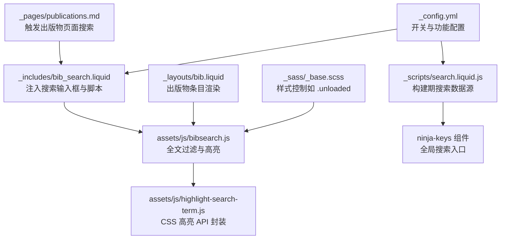
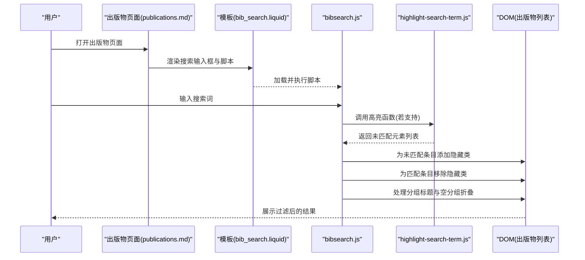
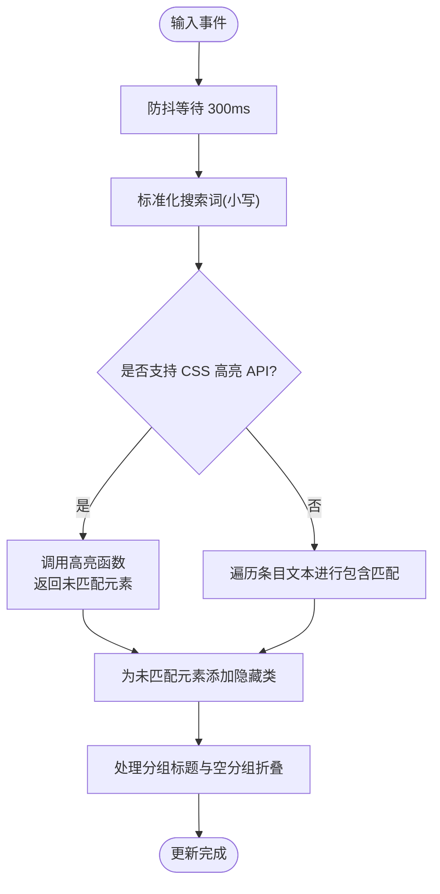
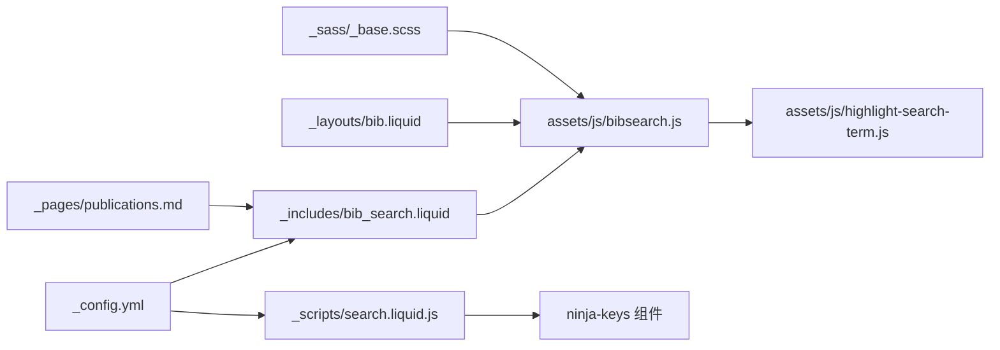

# 学术搜索功能

<cite>
**本文档引用的文件**
- [_includes/bib_search.liquid](file://_includes/bib_search.liquid)
- [_pages/publications.md](file://_pages/publications.md)
- [assets/js/bibsearch.js](file://assets/js/bibsearch.js)
- [assets/js/highlight-search-term.js](file://assets/js/highlight-search-term.js)
- [assets/js/search-setup.js](file://assets/js/search-setup.js)
- [_scripts/search.liquid.js](file://_scripts/search.liquid.js)
- [_layouts/bib.liquid](file://_layouts/bib.liquid)
- [_config.yml](file://_config.yml)
- [_plugins/google-scholar-citations.rb](file://_plugins/google-scholar-citations.rb)
- [_plugins/inspirehep-citations.rb](file://_plugins/inspirehep-citations.rb)
- [_sass/_base.scss](file://_sass/_base.scss)
</cite>

## 目录
1. [简介](#简介)
2. [项目结构](#项目结构)
3. [核心组件](#核心组件)
4. [架构总览](#架构总览)
5. [详细组件分析](#详细组件分析)
6. [依赖关系分析](#依赖关系分析)
7. [性能考虑](#性能考虑)
8. [故障排除指南](#故障排除指南)
9. [结论](#结论)
10. [附录](#附录)

## 简介
本文件系统化梳理了该学术网站中的“出版物搜索”功能，覆盖以下方面：
- 全文索引与关键词匹配的实现原理
- 搜索界面设计与交互逻辑（搜索框布局、结果展示、分组折叠）
- 性能优化策略（防抖、懒加载、CSS 高亮）
- 排序与相关性优化（基于页面内容构建搜索索引）
- 配置项与可定制点（站点配置、主题切换、搜索范围）

## 项目结构
该搜索功能由前端 JavaScript 与 Jekyll 构建时的数据生成共同组成：
- 前端搜索逻辑：在页面加载后对 DOM 进行实时过滤与高亮
- 构建期数据：通过 Liquid 脚本在构建阶段生成可搜索的数据源
- 样式支持：通过 CSS 类控制可见性与高亮显示

图表来源
- [_includes/bib_search.liquid:1-5](file://_includes/bib_search.liquid#L1-L5)
- [assets/js/bibsearch.js:1-71](file://assets/js/bibsearch.js#L1-L71)
- [assets/js/highlight-search-term.js:1-111](file://assets/js/highlight-search-term.js#L1-L111)
- [_scripts/search.liquid.js:1-330](file://_scripts/search.liquid.js#L1-L330)
- [_pages/publications.md:1-21](file://_pages/publications.md#L1-L21)
- [_layouts/bib.liquid:1-373](file://_layouts/bib.liquid#L1-L373)
- [_config.yml:53-56](file://_config.yml#L53-L56)
- [_sass/_base.scss:1130-1135](file://_sass/_base.scss#L1130-L1135)

章节来源
- [_includes/bib_search.liquid:1-5](file://_includes/bib_search.liquid#L1-L5)
- [_pages/publications.md:1-21](file://_pages/publications.md#L1-L21)
- [_config.yml:53-56](file://_config.yml#L53-L56)

## 核心组件
- 出版物搜索输入框与脚本注入
  - 在页面中按需引入搜索脚本与输入框，仅在启用时生效
- 出版物列表过滤与高亮
  - 对出版物条目进行实时过滤，支持 CSS 高亮 API 或降级方案
- 全局搜索数据源
  - 构建期扫描页面、文章、集合与社交链接，生成统一搜索索引
- 主题与快捷键集成
  - 与站点主题切换联动，提供快捷键打开全局搜索

章节来源
- [_includes/bib_search.liquid:1-5](file://_includes/bib_search.liquid#L1-L5)
- [assets/js/bibsearch.js:1-71](file://assets/js/bibsearch.js#L1-L71)
- [_scripts/search.liquid.js:1-330](file://_scripts/search.liquid.js#L1-L330)
- [assets/js/search-setup.js:1-18](file://assets/js/search-setup.js#L1-L18)

## 架构总览
下图展示了从用户输入到结果呈现的关键流程：

图表来源
- [_pages/publications.md:1-21](file://_pages/publications.md#L1-L21)
- [_includes/bib_search.liquid:1-5](file://_includes/bib_search.liquid#L1-L5)
- [assets/js/bibsearch.js:1-71](file://assets/js/bibsearch.js#L1-L71)
- [assets/js/highlight-search-term.js:1-111](file://assets/js/highlight-search-term.js#L1-L111)

## 详细组件分析

### 出版物搜索输入框与页面集成
- 页面通过 include 引入搜索输入框与脚本，仅当站点配置开启时生效
- 输入框具备自动完成关闭与拼写检查禁用，提升输入体验
- 页面加载完成后，脚本会读取 URL hash 并同步到搜索框，支持直接分享带查询的链接

章节来源
- [_pages/publications.md:1-21](file://_pages/publications.md#L1-L21)
- [_includes/bib_search.liquid:1-5](file://_includes/bib_search.liquid#L1-L5)
- [assets/js/bibsearch.js:53-69](file://assets/js/bibsearch.js#L53-L69)

### 过滤与高亮算法
- 防抖处理：输入事件在 300ms 内无新输入才开始过滤，降低频繁重绘
- 匹配策略：
  - 若浏览器支持 CSS 高亮 API，则使用高亮 API 计算匹配范围并高亮
  - 否则回退到遍历条目文本进行包含匹配
- 可见性控制：
  - 未匹配条目添加隐藏类，匹配条目移除隐藏类
  - 分组标题（如年份）在组内全部隐藏时也会被隐藏，避免空分组显示

图表来源
- [assets/js/bibsearch.js:5-70](file://assets/js/bibsearch.js#L5-L70)
- [assets/js/highlight-search-term.js:42-79](file://assets/js/highlight-search-term.js#L42-L79)

章节来源
- [assets/js/bibsearch.js:5-70](file://assets/js/bibsearch.js#L5-L70)
- [assets/js/highlight-search-term.js:42-79](file://assets/js/highlight-search-term.js#L42-L79)

### 全局搜索数据源与入口
- 构建期数据源：
  - 导航页、下拉菜单、文章、集合文档、社交链接等均参与搜索索引
  - 支持描述字段、标题截断与特殊处理（如外部跳转）
- 全局入口：
  - 通过快捷键打开全局搜索面板，支持主题切换按钮

章节来源
- [_scripts/search.liquid.js:1-330](file://_scripts/search.liquid.js#L1-L330)
- [assets/js/search-setup.js:1-18](file://assets/js/search-setup.js#L1-L18)

### 出版物条目渲染与链接
- 条目渲染由布局模板负责，包含作者、期刊/会议、链接按钮等
- 模板中可嵌入引用计数徽章（通过插件获取），用于增强相关性参考

章节来源
- [_layouts/bib.liquid:1-373](file://_layouts/bib.liquid#L1-L373)
- [_plugins/google-scholar-citations.rb:1-86](file://_plugins/google-scholar-citations.rb#L1-L86)
- [_plugins/inspirehep-citations.rb:1-58](file://_plugins/inspirehep-citations.rb#L1-L58)

## 依赖关系分析
- 组件耦合
  - 出版物搜索依赖 DOM 结构（列表项与分组标题）
  - 高亮功能依赖浏览器特性（CSS 高亮 API）
- 外部依赖
  - 全局搜索依赖 ninja-keys 组件与构建期数据脚本
  - 引用计数徽章依赖网络请求与缓存

图表来源
- [_config.yml:53-56](file://_config.yml#L53-L56)
- [_includes/bib_search.liquid:1-5](file://_includes/bib_search.liquid#L1-L5)
- [assets/js/bibsearch.js:1-71](file://assets/js/bibsearch.js#L1-L71)
- [assets/js/highlight-search-term.js:1-111](file://assets/js/highlight-search-term.js#L1-L111)
- [_pages/publications.md:1-21](file://_pages/publications.md#L1-L21)
- [_layouts/bib.liquid:1-373](file://_layouts/bib.liquid#L1-L373)
- [_scripts/search.liquid.js:1-330](file://_scripts/search.liquid.js#L1-L330)
- [_sass/_base.scss:1130-1135](file://_sass/_base.scss#L1130-L1135)

章节来源
- [_config.yml:53-56](file://_config.yml#L53-L56)
- [_includes/bib_search.liquid:1-5](file://_includes/bib_search.liquid#L1-L5)
- [assets/js/bibsearch.js:1-71](file://assets/js/bibsearch.js#L1-L71)
- [_scripts/search.liquid.js:1-330](file://_scripts/search.liquid.js#L1-L330)

## 性能考虑
- 防抖优化
  - 输入事件延迟 300ms 触发过滤，减少高频输入导致的重排与重绘
- 懒加载与可见性控制
  - 使用隐藏类而非删除节点，避免 DOM 结构频繁变动
- CSS 高亮 API
  - 利用浏览器原生高亮能力，减少手动 DOM 操作与字符串替换成本
- 构建期数据聚合
  - 将多来源数据在构建阶段整合，运行时只需消费数据，降低前端负担

章节来源
- [assets/js/bibsearch.js:59-65](file://assets/js/bibsearch.js#L59-L65)
- [assets/js/highlight-search-term.js:47-79](file://assets/js/highlight-search-term.js#L47-L79)
- [_sass/_base.scss:1130-1135](file://_sass/_base.scss#L1130-L1135)
- [_scripts/search.liquid.js:1-330](file://_scripts/search.liquid.js#L1-L330)

## 故障排除指南
- 搜索框不出现
  - 检查站点配置中是否启用出版物搜索
- 高亮无效或报错
  - 浏览器可能不支持 CSS 高亮 API；脚本已内置降级逻辑，但高亮效果会受限
- 过滤不生效
  - 确认 DOM 中存在对应的选择器（出版物列表项与分组标题）
  - 检查隐藏类是否被其他样式覆盖
- 全局搜索无数据
  - 确认构建期数据脚本已生成并注入 ninja-keys 数据
  - 检查站点配置中是否启用了相应搜索范围（文章、社交等）

章节来源
- [_config.yml:53-56](file://_config.yml#L53-L56)
- [assets/js/bibsearch.js:9-25](file://assets/js/bibsearch.js#L9-L25)
- [_sass/_base.scss:1130-1135](file://_sass/_base.scss#L1130-L1135)
- [_scripts/search.liquid.js:1-330](file://_scripts/search.liquid.js#L1-L330)

## 结论
该学术搜索功能以“构建期聚合 + 运行时过滤”的方式实现了轻量高效的全文检索体验。出版物搜索通过防抖与 CSS 高亮 API 提升交互流畅度，同时保留降级路径确保兼容性。全局搜索则通过构建期数据脚本将多来源内容统一纳入索引，配合快捷键与主题联动，形成一致的站点内导航体验。

## 附录

### 配置选项与自定义方法
- 开关与范围
  - 启用站点内搜索、文章搜索、社交搜索、出版物搜索
- 主题联动
  - 根据当前主题动态设置全局搜索面板样式
- 自定义搜索范围
  - 在构建期脚本中增删参与搜索的数据源（页面、文章、集合、社交等）
- 样式定制
  - 通过隐藏类控制条目可见性，结合站点主题变量实现视觉一致性

章节来源
- [_config.yml:53-56](file://_config.yml#L53-L56)
- [assets/js/search-setup.js:1-18](file://assets/js/search-setup.js#L1-L18)
- [_scripts/search.liquid.js:1-330](file://_scripts/search.liquid.js#L1-L330)
- [_sass/_base.scss:1130-1135](file://_sass/_base.scss#L1130-L1135)