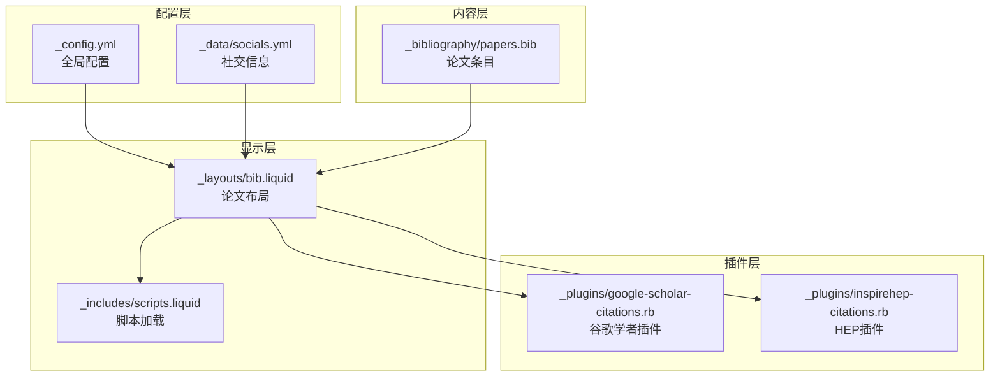
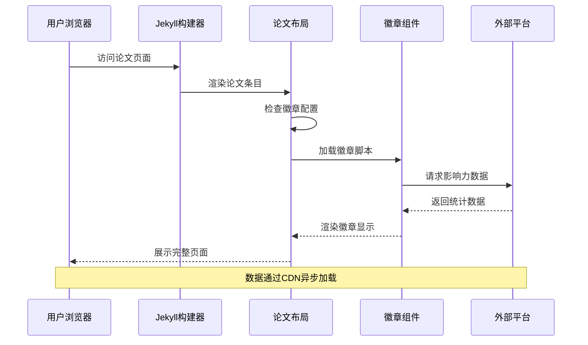
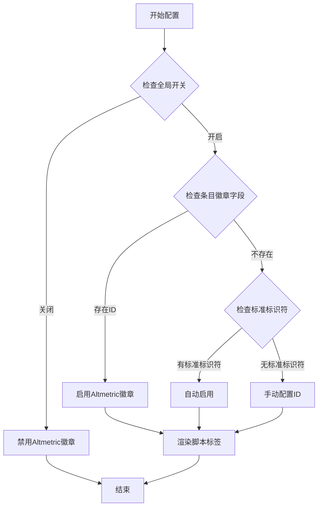
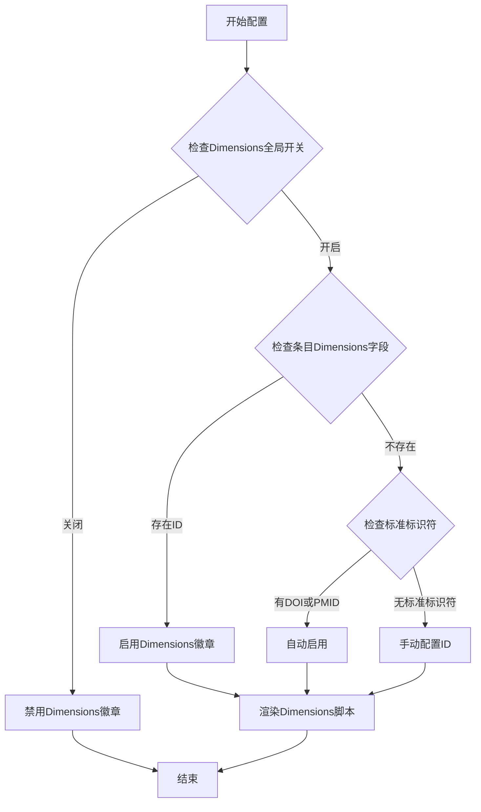
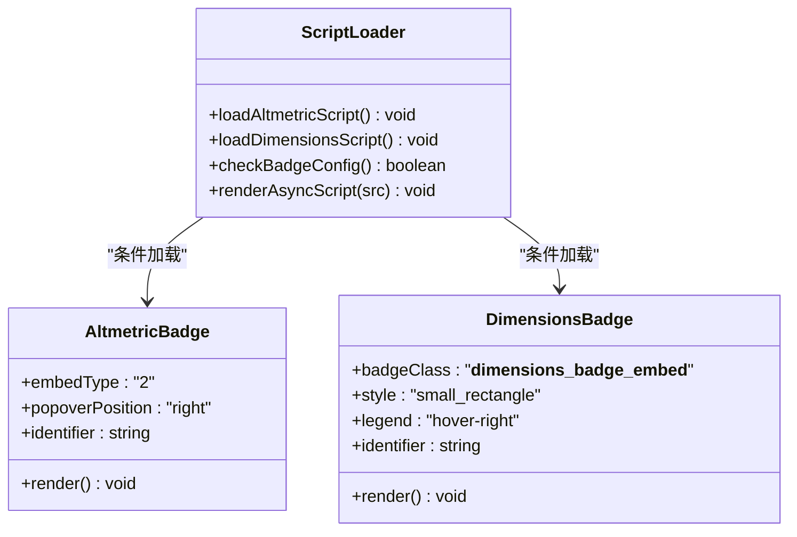
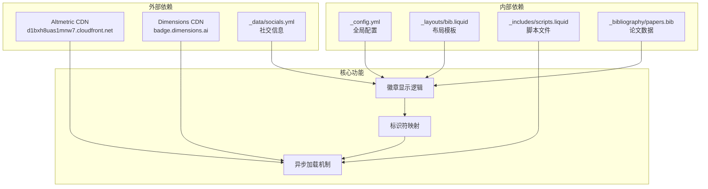

# Altmetric 和 Dimensions 集成

<cite>
**本文档引用的文件**
- [_config.yml](file://_config.yml)
- [_layouts/bib.liquid](file://_layouts/bib.liquid)
- [_includes/scripts.liquid](file://_includes/scripts.liquid)
- [_plugins/google-scholar-citations.rb](file://_plugins/google-scholar-citations.rb)
- [_plugins/inspirehep-citations.rb](file://_plugins/inspirehep-citations.rb)
- [_data/socials.yml](file://_data/socials.yml)
- [CUSTOMIZE.md](file://CUSTOMIZE.md)
- [_bibliography/papers.bib](file://_bibliography/papers.bib)
</cite>

## 目录
1. [简介](#简介)
2. [项目结构](#项目结构)
3. [核心组件](#核心组件)
4. [架构概览](#架构概览)
5. [详细组件分析](#详细组件分析)
6. [依赖关系分析](#依赖关系分析)
7. [性能考虑](#性能考虑)
8. [故障排除指南](#故障排除指南)
9. [结论](#结论)

## 简介

本文件详细介绍该学术个人网站项目中 Altmetric 和 Dimensions 学术徽章的集成方案。Altmetric 和 Dimensions 是两个主流的学术影响力评估平台，能够为论文提供社交媒体影响力、新闻报道情况、下载量统计等多维度指标。

该项目通过 Jekyll 模板系统，在论文条目的显示层实现了对这两个平台徽章的自动集成，无需额外的 API 密钥配置即可在学术页面中展示论文的综合影响力数据。

## 项目结构

该项目采用 Jekyll 静态站点生成器架构，主要涉及以下与徽章集成相关的文件结构：

**图表来源**
- [_config.yml:292-326](file://_config.yml#L292-L326)
- [_layouts/bib.liquid:257-340](file://_layouts/bib.liquid#L257-L340)
- [_includes/scripts.liquid:190-196](file://_includes/scripts.liquid#L190-L196)

**章节来源**
- [_config.yml:292-326](file://_config.yml#L292-L326)
- [_layouts/bib.liquid:1-50](file://_layouts/bib.liquid#L1-L50)

## 核心组件

### 配置管理组件

项目通过 `_config.yml` 文件集中管理徽章功能的启用状态和行为配置：

- **全局开关控制**：`enable_publication_badges` 字段控制是否显示各类学术徽章
- **平台特定配置**：分别针对 Altmetric 和 Dimensions 设置独立的启用标志
- **默认值设置**：项目默认启用了 Altmetric 和 Dimensions 徽章功能

### 论文条目组件

论文条目通过 BibTeX 格式存储在 `_bibliography/papers.bib` 文件中，支持多种标识符用于徽章识别：

- **标准标识符**：DOI、PMID、arXiv ID、ISBN 等
- **自定义标识符**：Altmetric 和 Dimensions 平台的专用 ID
- **自动识别机制**：当标准标识符存在时可简化配置

### 显示布局组件

`_layouts/bib.liquid` 文件负责论文条目的最终渲染，包含徽章显示的核心逻辑：

- **条件判断**：根据论文条目中的徽章标识符决定是否显示对应徽章
- **参数传递**：将合适的标识符传递给对应的徽章嵌入脚本
- **样式控制**：统一的徽章样式和间距设置

**章节来源**
- [_config.yml:292-326](file://_config.yml#L292-L326)
- [_layouts/bib.liquid:257-340](file://_layouts/bib.liquid#L257-L340)
- [_bibliography/papers.bib:1-75](file://_bibliography/papers.bib#L1-L75)

## 架构概览

整个徽章集成系统采用分层架构设计，确保了良好的可维护性和扩展性：

**图表来源**
- [_includes/scripts.liquid:190-196](file://_includes/scripts.liquid#L190-L196)
- [_layouts/bib.liquid:278-340](file://_layouts/bib.liquid#L278-L340)

系统架构的关键特点：

1. **异步加载**：徽章脚本采用异步加载方式，不影响页面初始渲染速度
2. **条件显示**：仅在论文条目具备相应标识符时才加载对应徽章
3. **CDN 分发**：外部平台脚本通过 CDN 提供，确保全球访问速度
4. **缓存优化**：浏览器自动缓存徽章脚本，减少重复请求

## 详细组件分析

### Altmetric 徽章集成

Altmetric 徽章提供论文在社交媒体和新闻媒体中的影响力统计：

#### 配置与启用

**图表来源**
- [_layouts/bib.liquid:279-297](file://_layouts/bib.liquid#L279-L297)
- [_includes/scripts.liquid:191-192](file://_includes/scripts.liquid#L191-L192)

#### 数据源识别逻辑

Altmetric 支持多种数据源识别方式，按优先级排序：

1. **自定义 ID**：论文条目中的 `altmetric` 字段
2. **arXiv ID**：支持 `arxiv` 和 `eprint` 字段
3. **DOI 标识符**：支持 `doi` 字段
4. **PMID 标识符**：支持 `pmid` 字段
5. **ISBN 标识符**：支持 `isbn` 字段

#### 显示特性

- **弹出窗口**：支持右侧弹出式详细信息展示
- **图标类型**：使用 2 号徽章类型
- **响应式设计**：适配不同屏幕尺寸

**章节来源**
- [_layouts/bib.liquid:279-297](file://_layouts/bib.liquid#L279-L297)
- [_includes/scripts.liquid:191-192](file://_includes/scripts.liquid#L191-L192)

### Dimensions 徽章集成

Dimensions 徽章提供更全面的学术影响力分析，包括引用次数、新闻报道等：

#### 配置与启用

**图表来源**
- [_layouts/bib.liquid:299-312](file://_layouts/bib.liquid#L299-L312)
- [_includes/scripts.liquid:194-195](file://_includes/scripts.liquid#L194-L195)

#### 数据源识别逻辑

Dimensions 的数据源识别规则：

1. **自定义 ID**：论文条目中的 `dimensions` 字段
2. **DOI 标识符**：优先使用 `doi` 字段
3. **PMID 标识符**：作为备选方案

#### 显示特性

- **徽章样式**：使用 `small_rectangle` 小型矩形样式
- **图例位置**：悬停时显示右侧图例
- **间距控制**：底部边距设置为 3px
- **类名标识**：使用 `__dimensions_badge_embed__` 类名

**章节来源**
- [_layouts/bib.liquid:299-312](file://_layouts/bib.liquid#L299-L312)
- [_includes/scripts.liquid:194-195](file://_includes/scripts.liquid#L194-L195)

### 脚本加载机制

系统通过 `_includes/scripts.liquid` 文件智能加载所需的徽章脚本：

**图表来源**
- [_includes/scripts.liquid:190-196](file://_includes/scripts.liquid#L190-L196)
- [_layouts/bib.liquid:278-312](file://_layouts/bib.liquid#L278-L312)

**章节来源**
- [_includes/scripts.liquid:190-196](file://_includes/scripts.liquid#L190-L196)

## 依赖关系分析

徽章系统的依赖关系呈现清晰的层次化结构：

**图表来源**
- [_config.yml:292-326](file://_config.yml#L292-L326)
- [_layouts/bib.liquid:257-340](file://_layouts/bib.liquid#L257-L340)
- [_includes/scripts.liquid:190-196](file://_includes/scripts.liquid#L190-L196)

**章节来源**
- [_config.yml:292-326](file://_config.yml#L292-L326)
- [_layouts/bib.liquid:257-340](file://_layouts/bib.liquid#L257-L340)
- [_includes/scripts.liquid:190-196](file://_includes/scripts.liquid#L190-L196)

## 性能考虑

### 异步加载策略

系统采用异步加载机制确保页面性能：

- **非阻塞加载**：徽章脚本使用 `async` 属性，不阻塞页面渲染
- **CDN 优化**：通过 CDN 分发脚本，利用全球网络加速
- **条件加载**：仅在需要时加载对应平台的脚本

### 缓存机制

**图表来源**
- [_includes/scripts.liquid:190-196](file://_includes/scripts.liquid#L190-L196)

### 内存管理

- **按需渲染**：仅在可见区域内渲染徽章
- **事件解绑**：页面切换时自动清理相关事件监听
- **资源释放**：离开页面时释放相关资源占用

## 故障排除指南

### 常见问题及解决方案

#### 徽章不显示

**可能原因**：
1. 全局徽章功能被禁用
2. 论文条目缺少必要的标识符
3. 网络连接异常

**解决步骤**：
1. 检查 `_config.yml` 中的 `enable_publication_badges` 配置
2. 确认论文条目包含有效的 DOI、PMID 或自定义 ID
3. 在浏览器开发者工具中检查网络请求状态

#### 数据更新延迟

**现象**：徽章显示的数据与预期不符

**原因分析**：
- 外部平台数据更新存在延迟
- 浏览器缓存导致数据未及时刷新

**处理建议**：
- 等待 24-48 小时让平台完成数据同步
- 清除浏览器缓存后重新加载页面
- 检查论文条目中的标识符是否正确

#### 显示样式异常

**问题表现**：徽章显示位置或样式不符合预期

**解决方案**：
- 检查 CSS 样式表中相关的徽章样式定义
- 确认容器元素的宽度和间距设置
- 验证响应式断点设置是否正确

**章节来源**
- [_config.yml:292-326](file://_config.yml#L292-L326)
- [_layouts/bib.liquid:278-340](file://_layouts/bib.liquid#L278-L340)

## 结论

该学术个人网站项目成功集成了 Altmetric 和 Dimensions 两大影响力评估平台，实现了以下关键功能：

### 技术优势

1. **零配置集成**：无需额外 API 密钥，通过标准标识符自动识别
2. **智能选择机制**：支持多种数据源，自动选择最优匹配
3. **性能优化**：异步加载和 CDN 分发确保快速响应
4. **扩展性强**：模块化设计便于添加新的影响力评估平台

### 最佳实践建议

1. **标识符完整性**：尽量为每篇论文提供完整的 DOI 或 PMID
2. **定期维护**：定期检查徽章显示效果和数据准确性
3. **性能监控**：关注页面加载时间和用户体验指标
4. **备份策略**：保留原始数据源，防止平台服务中断影响展示

### 未来发展

- **多平台扩展**：可轻松集成其他学术影响力评估平台
- **个性化定制**：支持用户自定义徽章样式和显示逻辑
- **数据分析**：提供影响力数据的统计分析功能

通过这套完整的集成方案，用户可以有效地展示论文的综合学术影响力，提升个人学术声誉和研究成果的可见度。