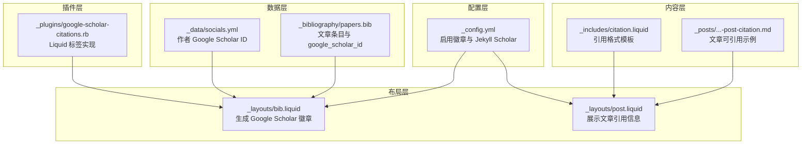
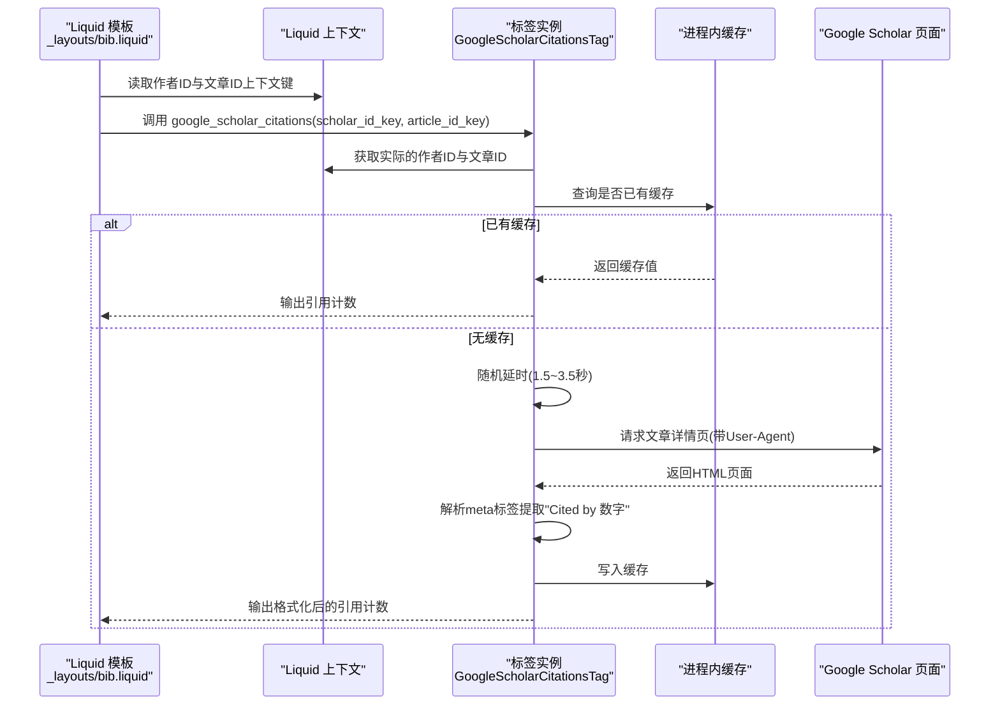
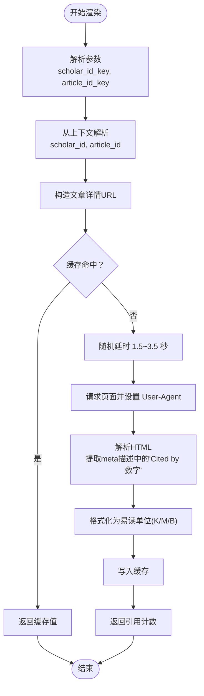
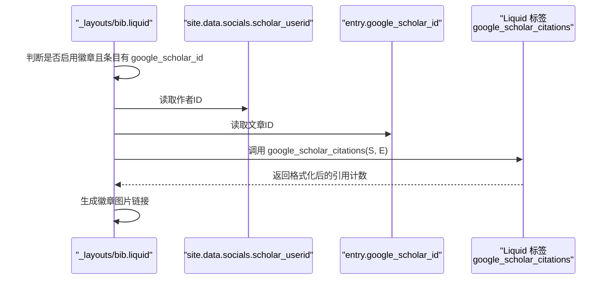
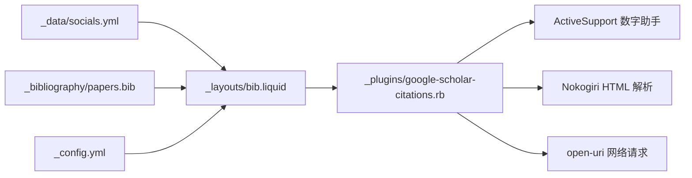

# Google Scholar 集成

<cite>
**本文档引用的文件**
- [google-scholar-citations.rb](file://_plugins/google-scholar-citations.rb)
- [_layouts/bib.liquid](file://_layouts/bib.liquid)
- [_data/socials.yml](file://_data/socials.yml)
- [_config.yml](file://_config.yml)
- [_includes/citation.liquid](file://_includes/citation.liquid)
- [_layouts/post.liquid](file://_layouts/post.liquid)
- [_posts/2024-04-28-post-citation.md](file://_posts/2024-04-28-post-citation.md)
- [_bibliography/papers.bib](file://_bibliography/papers.bib)
</cite>

## 目录
1. [简介](#简介)
2. [项目结构](#项目结构)
3. [核心组件](#核心组件)
4. [架构总览](#架构总览)
5. [详细组件分析](#详细组件分析)
6. [依赖关系分析](#依赖关系分析)
7. [性能考量](#性能考量)
8. [故障排除指南](#故障排除指南)
9. [结论](#结论)
10. [附录](#附录)

## 简介
本文件面向需要在 Jekyll 网站中集成 Google Scholar 引用统计的用户与开发者，系统性阐述 google_scholar_citations Liquid 标签的实现原理、使用方法与最佳实践。内容涵盖：
- 标签参数与上下文变量传递机制
- 作者 ID 与文章 ID 的配置方式（来自站点配置与 BibTeX 条目）
- 引用计数抓取流程与 HTML 解析逻辑
- 缓存机制与错误处理策略
- 反爬虫策略（随机延时、User-Agent 设置）
- 在页面中的使用示例与常见问题解决

## 项目结构
围绕 Google Scholar 集成的相关文件分布如下：
- 插件层：_plugins/google-scholar-citations.rb 提供 Liquid 标签实现
- 布局层：_layouts/bib.liquid 使用标签生成引用徽章
- 数据层：_data/socials.yml 提供作者 Google Scholar ID；_bibliography/papers.bib 提供文章条目与 google_scholar_id 字段
- 配置层：_config.yml 控制是否启用 Google Scholar 徽章与 Jekyll Scholar 行为
- 内容层：_includes/citation.liquid 用于生成引用格式；_layouts/post.liquid 展示文章级引用信息；_posts/...-post-citation.md 展示文章可引用的用法

**图表来源**
- [google-scholar-citations.rb:1-86](file://_plugins/google-scholar-citations.rb#L1-L86)
- [_layouts/bib.liquid:314-325](file://_layouts/bib.liquid#L314-L325)
- [_data/socials.yml:34-34](file://_data/socials.yml#L34-L34)
- [_bibliography/papers.bib:1-75](file://_bibliography/papers.bib#L1-L75)
- [_config.yml:294-299](file://_config.yml#L294-L299)
- [_includes/citation.liquid:1-27](file://_includes/citation.liquid#L1-L27)
- [_layouts/post.liquid:73-75](file://_layouts/post.liquid#L73-L75)
- [_posts/2024-04-28-post-citation.md:8-8](file://_posts/2024-04-28-post-citation.md#L8-L8)

**章节来源**
- [google-scholar-citations.rb:1-86](file://_plugins/google-scholar-citations.rb#L1-L86)
- [_layouts/bib.liquid:314-325](file://_layouts/bib.liquid#L314-L325)
- [_data/socials.yml:34-34](file://_data/socials.yml#L34-L34)
- [_bibliography/papers.bib:1-75](file://_bibliography/papers.bib#L1-L75)
- [_config.yml:294-299](file://_config.yml#L294-L299)
- [_includes/citation.liquid:1-27](file://_includes/citation.liquid#L1-L27)
- [_layouts/post.liquid:73-75](file://_layouts/post.liquid#L73-L75)
- [_posts/2024-04-28-post-citation.md:8-8](file://_posts/2024-04-28-post-citation.md#L8-L8)

## 核心组件
- google_scholar_citations Liquid 标签：负责从 Google Scholar 页面解析引用计数，支持缓存与错误兜底。
- 布局与模板：在论文列表页通过徽章链接到 Google Scholar，并在文章页展示引用格式。
- 数据与配置：作者 ID 来自 _data/socials.yml，文章 ID 来自 _bibliography/papers.bib；是否显示徽章由 _config.yml 控制。

关键点：
- 标签参数：第一个参数为作者 ID 上下文键，第二个参数为文章 ID 上下文键
- 缓存：进程内哈希表缓存已抓取的引用计数
- 错误处理：异常捕获并返回固定占位符，同时输出错误日志
- 反爬虫：随机延时与设置 User-Agent

**章节来源**
- [google-scholar-citations.rb:13-26](file://_plugins/google-scholar-citations.rb#L13-L26)
- [google-scholar-citations.rb:28-81](file://_plugins/google-scholar-citations.rb#L28-L81)
- [_layouts/bib.liquid:314-325](file://_layouts/bib.liquid#L314-L325)
- [_data/socials.yml:34-34](file://_data/socials.yml#L34-L34)
- [_bibliography/papers.bib:1-75](file://_bibliography/papers.bib#L1-L75)
- [_config.yml:294-299](file://_config.yml#L294-L299)

## 架构总览
下面的序列图展示了在论文列表页中，Liquid 模板调用 google_scholar_citations 标签的完整流程。

**图表来源**
- [_layouts/bib.liquid:314-325](file://_layouts/bib.liquid#L314-L325)
- [google-scholar-citations.rb:28-81](file://_plugins/google-scholar-citations.rb#L28-L81)

**章节来源**
- [_layouts/bib.liquid:314-325](file://_layouts/bib.liquid#L314-L325)
- [google-scholar-citations.rb:28-81](file://_plugins/google-scholar-citations.rb#L28-L81)

## 详细组件分析

### Liquid 标签实现（google_scholar_citations）
- 参数解析：标签初始化时按空格分割参数，分别作为作者 ID 与文章 ID 的上下文键名
- 渲染流程：
  - 从 Liquid 上下文解析出真实 ID
  - 构造 Google Scholar 文章详情 URL
  - 若缓存命中则直接返回
  - 随机延时后发起请求，设置 User-Agent
  - 使用 Nokogiri 解析 HTML，优先查找 meta[name="description"]，其次 meta[property="og:description"]，匹配 "Cited by 数字" 并清洗千分位逗号
  - 使用数字助手格式化为易读单位（K/M/B）
  - 异常捕获并记录错误，返回固定占位符
  - 将结果写入缓存并返回

**图表来源**
- [google-scholar-citations.rb:28-81](file://_plugins/google-scholar-citations.rb#L28-L81)

**章节来源**
- [google-scholar-citations.rb:13-26](file://_plugins/google-scholar-citations.rb#L13-L26)
- [google-scholar-citations.rb:28-81](file://_plugins/google-scholar-citations.rb#L28-L81)

### 在论文列表页使用（_layouts/bib.liquid）
- 条件判断：根据配置开关与条目是否存在 google_scholar_id 决定是否渲染徽章
- 链接构造：使用站点配置中的作者 ID 与条目的 google_scholar_id 组合链接
- 图片徽章：通过第三方徽章服务生成带引用计数的图片，内部调用 google_scholar_citations 标签

**图表来源**
- [_layouts/bib.liquid:314-325](file://_layouts/bib.liquid#L314-L325)
- [_data/socials.yml:34-34](file://_data/socials.yml#L34-L34)
- [_bibliography/papers.bib:1-75](file://_bibliography/papers.bib#L1-L75)

**章节来源**
- [_layouts/bib.liquid:314-325](file://_layouts/bib.liquid#L314-L325)
- [_data/socials.yml:34-34](file://_data/socials.yml#L34-L34)
- [_bibliography/papers.bib:1-75](file://_bibliography/papers.bib#L1-L75)

### 在文章页展示引用信息（_layouts/post.liquid 与 _includes/citation.liquid）
- 当文章 Front Matter 启用 citation 时，布局会包含引用模板
- 模板根据站点与页面元信息生成标准引用格式或 BibTeX 片段

**章节来源**
- [_layouts/post.liquid:73-75](file://_layouts/post.liquid#L73-L75)
- [_includes/citation.liquid:1-27](file://_includes/citation.liquid#L1-L27)
- [_posts/2024-04-28-post-citation.md:8-8](file://_posts/2024-04-28-post-citation.md#L8-L8)

## 依赖关系分析
- 插件依赖：ActiveSupport 数字助手、Nokogiri HTML 解析、open-uri 发起 HTTP 请求
- 模板依赖：Liquid 上下文变量（来自 _data 与 _bibliography）、站点配置开关
- 运行时依赖：网络访问 Google Scholar，受网络与反爬虫策略影响

**图表来源**
- [google-scholar-citations.rb:1-3](file://_plugins/google-scholar-citations.rb#L1-L3)
- [_layouts/bib.liquid:314-325](file://_layouts/bib.liquid#L314-L325)
- [_data/socials.yml:34-34](file://_data/socials.yml#L34-L34)
- [_bibliography/papers.bib:1-75](file://_bibliography/papers.bib#L1-L75)
- [_config.yml:294-299](file://_config.yml#L294-L299)

**章节来源**
- [google-scholar-citations.rb:1-3](file://_plugins/google-scholar-citations.rb#L1-L3)
- [_layouts/bib.liquid:314-325](file://_layouts/bib.liquid#L314-L325)
- [_data/socials.yml:34-34](file://_data/socials.yml#L34-L34)
- [_bibliography/papers.bib:1-75](file://_bibliography/papers.bib#L1-L75)
- [_config.yml:294-299](file://_config.yml#L294-L299)

## 性能考量
- 缓存策略：进程内哈希表缓存已抓取的引用计数，避免重复请求同一文章 ID
- 网络延迟：随机延时降低被限流或封禁风险，但会增加构建时间
- 解析成本：每次请求后进行 HTML 解析与正则匹配，建议控制并发与频率
- 建议：
  - 在本地开发时可考虑减少延时或禁用标签
  - 生产构建前可预热缓存，减少线上首次请求
  - 对于大量条目，评估是否需要外部缓存（如数据库）持久化

[本节为通用指导，不涉及具体文件分析]

## 故障排除指南
- 标签报错或输出固定占位符
  - 检查作者 ID 与文章 ID 是否正确传入上下文
  - 查看构建日志中的错误输出，定位具体异常类型与消息
- 引用计数始终为 N/A
  - 确认 Google Scholar 页面可正常访问
  - 确认 meta 标签中存在 "Cited by 数字" 描述
- 徽章未显示
  - 检查 _config.yml 中是否启用 Google Scholar 徽章
  - 确认条目包含 google_scholar_id 字段
- 反爬虫导致失败
  - 随机延时与 User-Agent 已内置，若仍被限制，建议降低请求频率或使用代理

**章节来源**
- [google-scholar-citations.rb:71-77](file://_plugins/google-scholar-citations.rb#L71-L77)
- [_layouts/bib.liquid:314-325](file://_layouts/bib.liquid#L314-L325)
- [_config.yml:294-299](file://_config.yml#L294-L299)
- [_bibliography/papers.bib:1-75](file://_bibliography/papers.bib#L1-L75)

## 结论
google_scholar_citations Liquid 标签通过解析 Google Scholar 页面的 meta 描述提取引用计数，并结合缓存与反爬虫策略，在 Jekyll 中实现了稳定可靠的引用统计展示。配合布局与配置，可在论文列表页以徽章形式直观呈现引用次数，同时在文章页提供标准引用格式与 BibTeX 片段，满足学术展示需求。

[本节为总结性内容，不涉及具体文件分析]

## 附录

### 使用步骤与参数说明
- 在论文条目中添加 google_scholar_id 字段，值为对应文章在 Google Scholar 中的条目 ID
- 在站点配置中启用 Google Scholar 徽章显示
- 在论文列表页布局中，使用 google_scholar_citations 标签生成徽章图片，参数为作者 ID 上下文键与文章 ID 上下文键

**章节来源**
- [_layouts/bib.liquid:314-325](file://_layouts/bib.liquid#L314-L325)
- [_data/socials.yml:34-34](file://_data/socials.yml#L34-L34)
- [_bibliography/papers.bib:1-75](file://_bibliography/papers.bib#L1-L75)
- [_config.yml:294-299](file://_config.yml#L294-L299)

### 配置示例要点
- 启用徽章显示：在站点配置中开启相应开关
- 作者 ID 来源：使用 _data/socials.yml 中的作者 ID
- 文章 ID 来源：使用 _bibliography/papers.bib 中条目的 google_scholar_id 字段

**章节来源**
- [_config.yml:294-299](file://_config.yml#L294-L299)
- [_data/socials.yml:34-34](file://_data/socials.yml#L34-L34)
- [_bibliography/papers.bib:1-75](file://_bibliography/papers.bib#L1-L75)