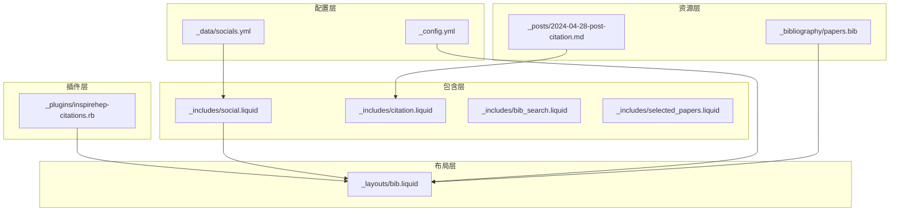
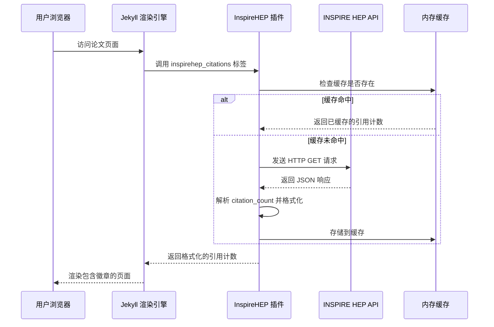
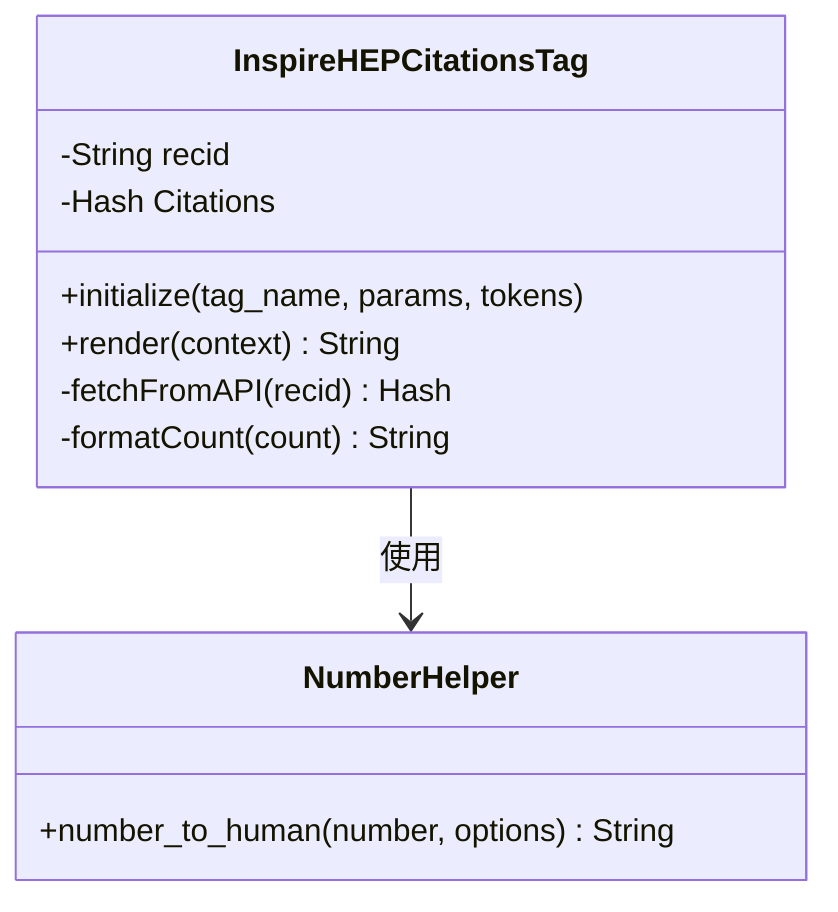
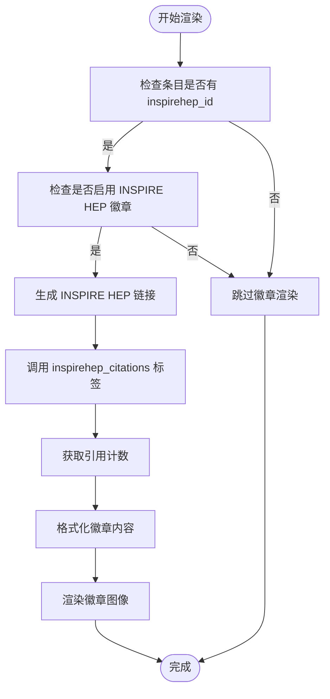
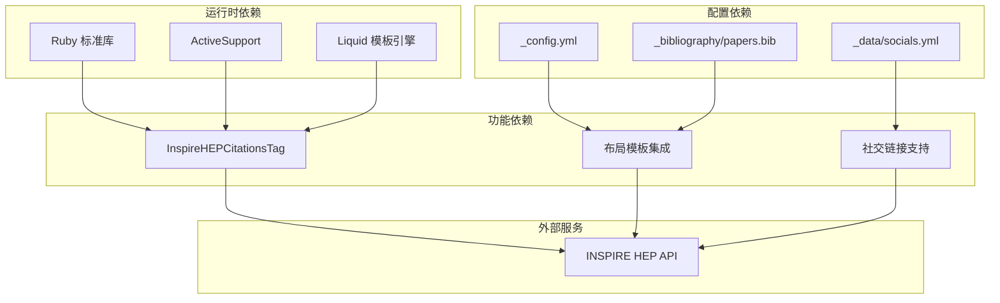

# INSPIRE HEP 集成

<cite>
**本文档引用的文件**
- [_plugins/inspirehep-citations.rb](file://_plugins/inspirehep-citations.rb)
- [_layouts/bib.liquid](file://_layouts/bib.liquid)
- [_includes/social.liquid](file://_includes/social.liquid)
- [_data/socials.yml](file://_data/socials.yml)
- [_config.yml](file://_config.yml)
- [_posts/2024-04-28-post-citation.md](file://_posts/2024-04-28-post-citation.md)
- [_includes/citation.liquid](file://_includes/citation.liquid)
- [_includes/bib_search.liquid](file://_includes/bib_search.liquid)
- [_includes/selected_papers.liquid](file://_includes/selected_papers.liquid)
- [_bibliography/papers.bib](file://_bibliography/papers.bib)
</cite>

## 目录
1. [简介](#简介)
2. [项目结构](#项目结构)
3. [核心组件](#核心组件)
4. [架构概览](#架构概览)
5. [详细组件分析](#详细组件分析)
6. [依赖关系分析](#依赖关系分析)
7. [性能考虑](#性能考虑)
8. [故障排除指南](#故障排除指南)
9. [结论](#结论)
10. [附录](#附录)

## 简介
本文件详细介绍该 Jekyll 博客项目中 INSPIRE HEP（高能物理文献数据库）的集成实现。INSPIRE HEP 是高能物理领域的权威文献数据库，提供论文元数据、引用统计和作者信息等资源。该项目通过自定义 Liquid 标签和模板系统，实现了以下功能：
- 在学术页面中显示论文的 INSPIRE HEP 引用计数徽章
- 为作者个人资料页提供 INSPIRE HEP 作者档案链接
- 支持在 BibTeX 条目中使用 `inspirehep_id` 字段进行关联
- 提供可配置的参数以控制 INSPIRE HEP 功能的行为

该集成采用轻量级设计：通过自定义 Liquid 标签调用 INSPIRE HEP API 获取引用计数，并将其缓存到内存中以避免重复请求。

## 项目结构
该项目基于 Jekyll 框架构建，采用模块化组织方式。与 INSPIRE HEP 集成相关的核心文件分布如下：
- 插件层：自定义 Liquid 标签用于 API 调用和数据处理
- 布局层：论文列表和详情页面的模板，包含徽章渲染逻辑
- 包含层：社交链接模板，支持 INSPIRE HEP 作者档案链接
- 配置层：站点配置文件，启用 INSPIRE HEP 徽章功能
- 数据层：作者社交账号配置，包含 INSPIRE HEP ID
- 资源层：BibTeX 文献库和相关页面



**图表来源**
- [_plugins/inspirehep-citations.rb:1-58](file://_plugins/inspirehep-citations.rb#L1-L58)
- [_layouts/bib.liquid:1-373](file://_layouts/bib.liquid#L1-L373)
- [_includes/social.liquid:1-111](file://_includes/social.liquid#L1-L111)
- [_config.yml:292-326](file://_config.yml#L292-L326)
- [_data/socials.yml:17-17](file://_data/socials.yml#L17-L17)

**章节来源**
- [_plugins/inspirehep-citations.rb:1-58](file://_plugins/inspirehep-citations.rb#L1-L58)
- [_layouts/bib.liquid:1-373](file://_layouts/bib.liquid#L1-L373)
- [_includes/social.liquid:1-111](file://_includes/social.liquid#L1-L111)
- [_config.yml:292-326](file://_config.yml#L292-L326)
- [_data/socials.yml:17-17](file://_data/socials.yml#L17-L17)

## 核心组件
本节深入分析 INSPIRE HEP 集成的关键组件及其技术细节。

### 自定义 Liquid 标签
项目实现了名为 `inspirehep_citations` 的自定义 Liquid 标签，用于动态获取和显示论文的引用计数。该标签具有以下特性：
- 接收 INSPIRE HEP 记录 ID（recid）作为参数
- 使用 HTTP GET 请求访问 INSPIRE HEP API
- 解析 JSON 响应提取 citation_count 字段
- 应用数字格式化以提高可读性
- 实现内存缓存机制避免重复请求

### 布局模板集成
在论文布局模板中，通过条件判断和徽章渲染逻辑实现 INSPIRE HEP 功能：
- 检测条目是否包含 `inspirehep_id` 字段
- 生成指向 INSPIRE HEP 文献页面的链接
- 渲染包含引用计数的徽章图像
- 支持用户点击跳转到对应的 INSPIRE HEP 页面

### 社交链接支持
社交链接模板提供了 INSPIRE HEP 作者档案的直接链接，便于访问作者的完整学术档案。

**章节来源**
- [_plugins/inspirehep-citations.rb:10-55](file://_plugins/inspirehep-citations.rb#L10-L55)
- [_layouts/bib.liquid:272-338](file://_layouts/bib.liquid#L272-L338)
- [_includes/social.liquid:25-26](file://_includes/social.liquid#L25-L26)

## 架构概览
INSPIRE HEP 集成采用分层架构设计，确保功能模块的职责分离和可维护性。



**图表来源**
- [_plugins/inspirehep-citations.rb:19-52](file://_plugins/inspirehep-citations.rb#L19-L52)
- [_layouts/bib.liquid:326-336](file://_layouts/bib.liquid#L326-L336)

该架构具有以下优势：
- **低耦合**：插件层与模板层分离，便于独立维护
- **高性能**：内存缓存减少 API 调用频率
- **可扩展**：易于添加新的 INSPIRE HEP 功能
- **容错性**：异常处理确保页面渲染的稳定性

## 详细组件分析

### InspireHEPCitationsTag 类分析
该类实现了 INSPIRE HEP 引用计数获取的核心逻辑。



**图表来源**
- [_plugins/inspirehep-citations.rb:11-54](file://_plugins/inspirehep-citations.rb#L11-L54)

#### 关键实现细节
1. **API 调用策略**：使用标准库进行 HTTP 请求，URL 构建遵循 INSPIRE HEP API 规范
2. **数据解析**：严格解析 JSON 结构，提取 `metadata.citation_count` 字段
3. **错误处理**：捕获所有异常并返回 "N/A"，同时输出调试信息
4. **缓存机制**：使用类变量实现进程内缓存，避免重复请求

### 布局模板集成分析
论文布局模板通过条件逻辑实现 INSPIRE HEP 功能的无缝集成。



**图表来源**
- [_layouts/bib.liquid:272-338](file://_layouts/bib.liquid#L272-L338)

#### 配置选项分析
布局模板支持多种配置选项：
- `site.enable_publication_badges.inspirehep`：全局启用/禁用 INSPIRE HEP 徽章
- `entry.inspirehep_id`：单个条目的 INSPIRE HEP ID
- 徽章样式：使用 GitHub Shields API 生成美观的徽章图像

**章节来源**
- [_plugins/inspirehep-citations.rb:11-55](file://_plugins/inspirehep-citations.rb#L11-L55)
- [_layouts/bib.liquid:272-338](file://_layouts/bib.liquid#L272-L338)

### 社交链接集成
社交链接模板提供了 INSPIRE HEP 作者档案的便捷访问入口。


**图表来源**
- [_includes/social.liquid:25-26](file://_includes/social.liquid#L25-L26)
- [_data/socials.yml:17-17](file://_data/socials.yml#L17-L17)

**章节来源**
- [_includes/social.liquid:25-26](file://_includes/social.liquid#L25-L26)
- [_data/socials.yml:17-17](file://_data/socials.yml#L17-L17)

## 依赖关系分析
INSPIRE HEP 集成涉及多个层面的依赖关系，形成了完整的功能链路。



**图表来源**
- [_plugins/inspirehep-citations.rb:1-4](file://_plugins/inspirehep-citations.rb#L1-L4)
- [_config.yml:292-326](file://_config.yml#L292-L326)
- [_data/socials.yml:17-17](file://_data/socials.yml#L17-L17)

### 外部依赖分析
- **INSPIRE HEP API**：提供论文元数据和引用统计
- **GitHub Shields API**：生成美观的徽章图像
- **Liquid 模板引擎**：处理动态内容渲染

### 内部依赖分析
- **插件与布局**：通过 Liquid 标签接口进行通信
- **配置与功能**：通过 YAML 配置文件传递参数
- **数据与模板**：通过 BibTeX 条目传递 INSPIRE HEP ID

**章节来源**
- [_plugins/inspirehep-citations.rb:1-58](file://_plugins/inspirehep-citations.rb#L1-L58)
- [_config.yml:292-326](file://_config.yml#L292-L326)
- [_data/socials.yml:17-17](file://_data/socials.yml#L17-L17)

## 性能考虑
本节分析 INSPIRE HEP 集成的性能特性和优化建议。

### 缓存策略
当前实现采用进程内内存缓存，具有以下特点：
- **优点**：避免重复 API 调用，提升页面加载速度
- **限制**：仅在单进程环境中有效，多进程部署时需要共享缓存
- **适用场景**：单用户或小规模访问的博客环境

### API 调用优化
- **批量请求**：可考虑合并多个请求以减少网络开销
- **异步处理**：使用异步请求避免阻塞页面渲染
- **超时控制**：设置合理的请求超时时间防止长时间等待

### 内存管理
- **缓存清理**：定期清理过期的缓存条目
- **内存监控**：监控缓存大小防止内存泄漏
- **持久化存储**：考虑使用 Redis 等外部缓存存储

## 故障排除指南
本节提供常见问题的诊断和解决方案。

### API 调用失败
**症状**：页面显示 "N/A" 或引用计数不更新
**可能原因**：
- INSPIRE HEP API 临时不可用
- 网络连接问题
- 错误的 INSPIRE HEP ID

**解决步骤**：
1. 检查 INSPIRE HEP API 状态
2. 验证网络连接
3. 确认 `inspirehep_id` 的正确性
4. 查看服务器端错误日志

### 缓存问题
**症状**：引用计数长时间不更新
**解决方法**：
1. 重启 Jekyll 开发服务器
2. 清除浏览器缓存
3. 检查内存缓存状态

### 格式化问题
**症状**：数字显示格式不符合预期
**解决方法**：
1. 检查数字格式化配置
2. 验证单位映射（K/M/B）
3. 确认精度设置

**章节来源**
- [_plugins/inspirehep-citations.rb:43-49](file://_plugins/inspirehep-citations.rb#L43-L49)

## 结论
该 INSPIRE HEP 集成方案成功地将高能物理领域的学术资源与个人博客平台相结合，实现了以下目标：
- **功能完整性**：提供了从数据获取到页面展示的完整链路
- **用户体验**：通过徽章直观展示论文影响力
- **技术简洁**：采用最小化设计，易于理解和维护
- **可扩展性**：为未来功能增强预留了空间

该实现为其他学术博客平台集成 INSPIRE HEP 提供了良好的参考模式，特别是在小规模部署场景下表现优异。

## 附录

### 配置示例
以下配置项控制 INSPIRE HEP 功能的行为：

**站点配置**：
```yaml
enable_publication_badges:
  inspirehep: true  # 启用 INSPIRE HEP 徽章
filtered_bibtex_keywords:
  - inspirehep_id   # 过滤掉内部使用的字段
```

**作者配置**：
```yaml
inspirehep_id: 1010907  # INSPIRE HEP 作者 ID
```

**BibTeX 条目**：
```bibtex
@article{example2024,
  title = {Example Paper},
  author = {Shen, Chen},
  inspirehep_id = {2024567}  # 论文的 INSPIRE HEP ID
}
```

### 集成步骤
1. **启用功能**：在 `_config.yml` 中设置 `enable_publication_badges.inspirehep: true`
2. **配置作者**：在 `_data/socials.yml` 中添加 `inspirehep_id`
3. **添加条目**：在 BibTeX 文件中为每篇论文添加 `inspirehep_id`
4. **验证集成**：检查论文页面是否显示 INSPIRE HEP 徽章

### 最佳实践
- **ID 管理**：确保每个论文都有有效的 INSPIRE HEP ID
- **缓存监控**：定期检查缓存命中率和内存使用情况
- **错误处理**：保持完善的日志记录以便问题诊断
- **性能优化**：根据访问量调整缓存策略和 API 调用频率