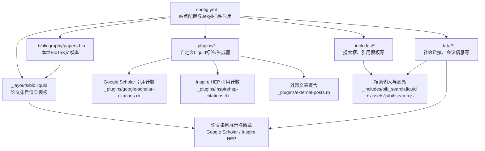
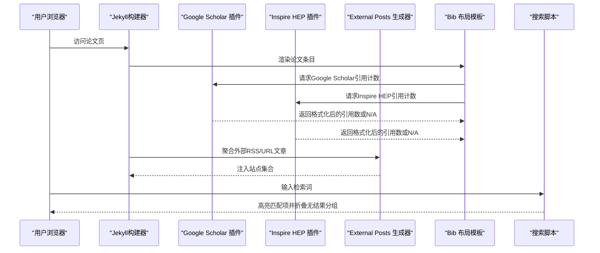
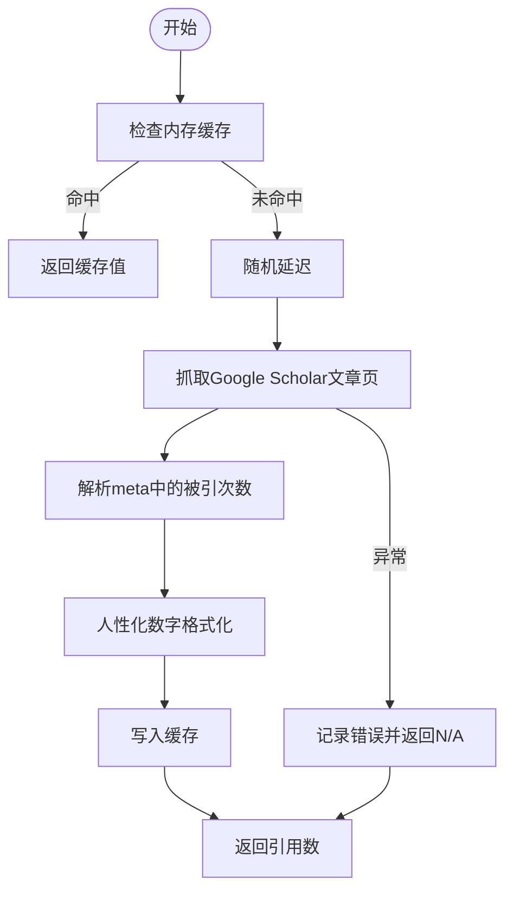
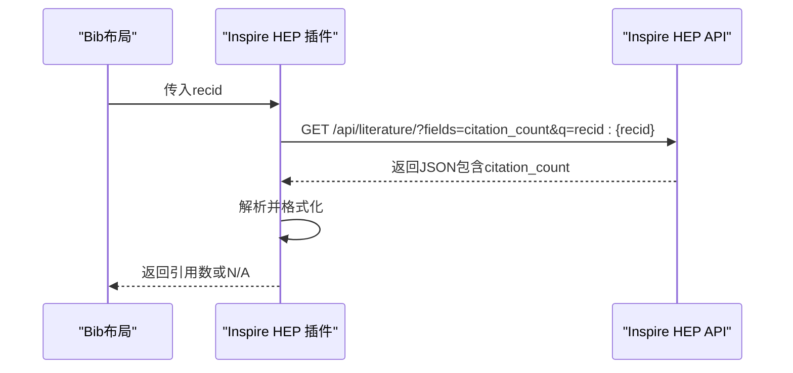
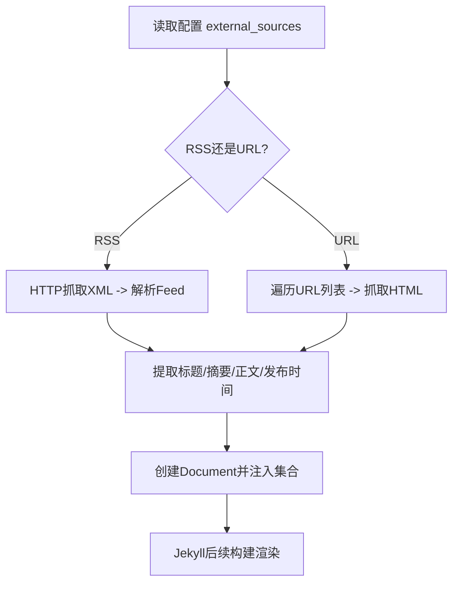
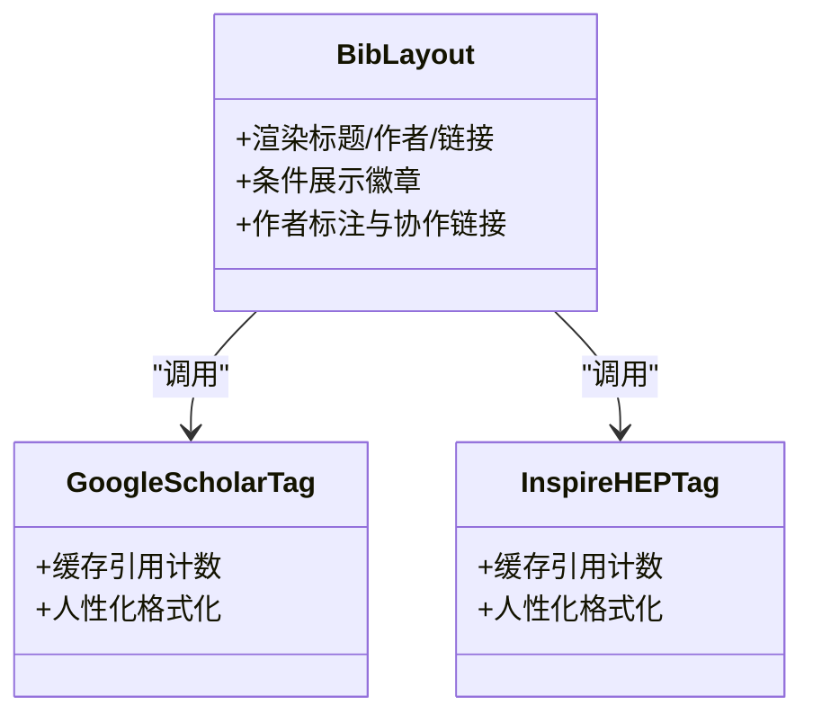
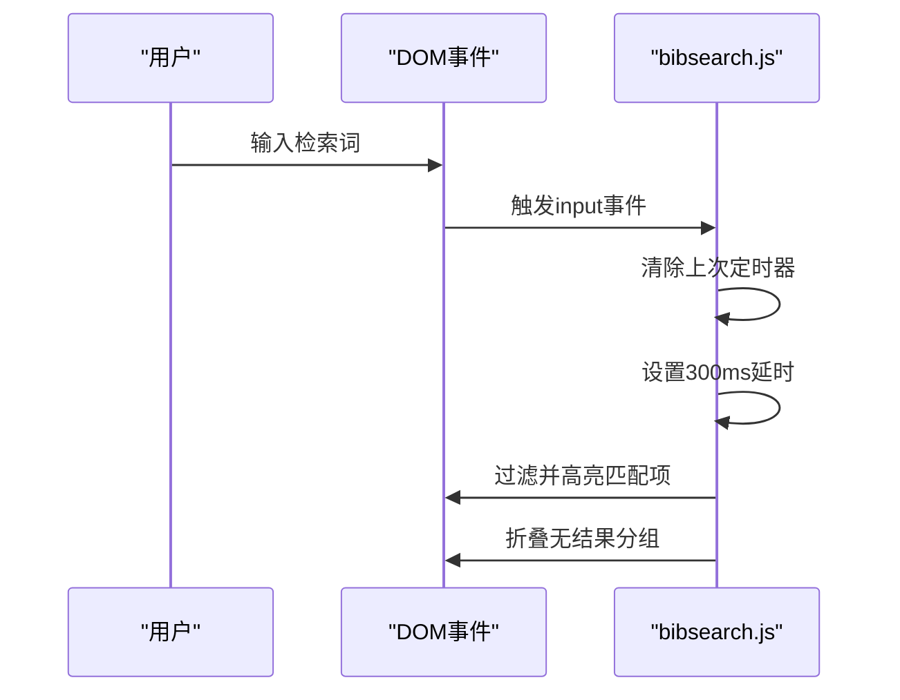
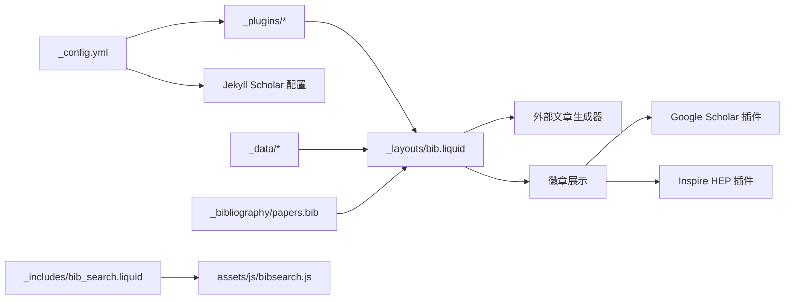

# 学术数据同步

<cite>
**本文引用的文件**
- [_config.yml](file://_config.yml)
- [_plugins/google-scholar-citations.rb](file://_plugins/google-scholar-citations.rb)
- [_plugins/inspirehep-citations.rb](file://_plugins/inspirehep-citations.rb)
- [_plugins/external-posts.rb](file://_plugins/external-posts.rb)
- [_plugins/cache-bust.rb](file://_plugins/cache-bust.rb)
- [_plugins/remove-accents.rb](file://_plugins/remove-accents.rb)
- [_plugins/hide-custom-bibtex.rb](file://_plugins/hide-custom-bibtex.rb)
- [_layouts/bib.liquid](file://_layouts/bib.liquid)
- [_includes/bib_search.liquid](file://_includes/bib_search.liquid)
- [_includes/citation.liquid](file://_includes/citation.liquid)
- [_scripts/search.liquid.js](file://_scripts/search.liquid.js)
- [_data/socials.yml](file://_data/socials.yml)
- [_data/venues.yml](file://_data/venues.yml)
- [_bibliography/papers.bib](file://_bibliography/papers.bib)
</cite>

## 目录
1. [简介](#简介)
2. [项目结构](#项目结构)
3. [核心组件](#核心组件)
4. [架构总览](#架构总览)
5. [详细组件分析](#详细组件分析)
6. [依赖关系分析](#依赖关系分析)
7. [性能考量](#性能考量)
8. [故障排查指南](#故障排查指南)
9. [结论](#结论)
10. [附录](#附录)

## 简介
本文件系统化梳理该学术网站在“数据来源—缓存—同步—冲突处理—质量保障—性能优化”方面的机制与实践，重点覆盖以下方面：
- 多学术服务数据来源与优先级：Google Scholar、InspireHEP、外部RSS/网页聚合等
- 缓存与去抖策略：内存缓存、静态资源缓存破坏、前端搜索防抖
- 更新策略：增量（按需）抓取、页面构建时抓取、前端动态加载
- 冲突处理：引用计数差异、文献信息不一致、作者标注一致性
- 时间安排与批量更新：定时任务建议、增量更新策略
- 数据质量与错误恢复：过滤与清洗、降级显示、容错输出
- 性能优化：并发节流、请求延迟、缓存命中、前端渲染优化

## 项目结构
该项目基于 Jekyll 静态站点生成器，通过插件扩展学术数据抓取与展示能力；数据源主要来自本地 BibTeX 文件与第三方学术服务，前端通过 JavaScript 提供搜索与高亮体验。

图表来源
- [_config.yml:200-219](file://_config.yml#L200-L219)
- [_plugins/google-scholar-citations.rb:10-82](file://_plugins/google-scholar-citations.rb#L10-L82)
- [_plugins/inspirehep-citations.rb:10-54](file://_plugins/inspirehep-citations.rb#L10-L54)
- [_plugins/external-posts.rb:7-111](file://_plugins/external-posts.rb#L7-L111)
- [_layouts/bib.liquid:257-340](file://_layouts/bib.liquid#L257-L340)
- [_includes/bib_search.liquid:1-5](file://_includes/bib_search.liquid#L1-L5)

章节来源
- [_config.yml:200-219](file://_config.yml#L200-L219)
- [_plugins/google-scholar-citations.rb:10-82](file://_plugins/google-scholar-citations.rb#L10-L82)
- [_plugins/inspirehep-citations.rb:10-54](file://_plugins/inspirehep-citations.rb#L10-L54)
- [_plugins/external-posts.rb:7-111](file://_plugins/external-posts.rb#L7-L111)
- [_layouts/bib.liquid:257-340](file://_layouts/bib.liquid#L257-L340)
- [_includes/bib_search.liquid:1-5](file://_includes/bib_search.liquid#L1-L5)

## 核心组件
- 论文条目渲染与徽章展示：通过 Jekyll Scholar 读取本地 BibTeX，结合 Liquid 模板渲染标题、作者、链接、徽章（Altmetric、Dimensions、Google Scholar、Inspire HEP）。
- 引用计数抓取：通过自定义 Liquid 标签从 Google Scholar 和 Inspire HEP 获取“被引次数”，并进行人性化数字格式化与缓存。
- 外部内容聚合：通过生成器从 RSS 或指定 URL 抓取外部文章，注入到站点集合中，统一渲染为博客文章。
- 前端搜索与高亮：提供检索框，支持关键词高亮与分组折叠隐藏，提升浏览体验。
- 数据清洗与过滤：提供过滤器用于去除自定义字段、移除作者星号标注、字符串转写等。

章节来源
- [_layouts/bib.liquid:257-340](file://_layouts/bib.liquid#L257-L340)
- [_plugins/google-scholar-citations.rb:10-82](file://_plugins/google-scholar-citations.rb#L10-L82)
- [_plugins/inspirehep-citations.rb:10-54](file://_plugins/inspirehep-citations.rb#L10-L54)
- [_plugins/external-posts.rb:7-111](file://_plugins/external-posts.rb#L7-L111)
- [_includes/bib_search.liquid:1-5](file://_includes/bib_search.liquid#L1-L5)
- [_plugins/hide-custom-bibtex.rb:1-19](file://_plugins/hide-custom-bibtex.rb#L1-L19)
- [_plugins/remove-accents.rb:1-32](file://_plugins/remove-accents.rb#L1-L32)

## 架构总览
下图展示了“数据来源—构建期抓取—运行期展示”的整体流程，以及各组件间的交互关系。

图表来源
- [_layouts/bib.liquid:314-337](file://_layouts/bib.liquid#L314-L337)
- [_plugins/google-scholar-citations.rb:28-81](file://_plugins/google-scholar-citations.rb#L28-L81)
- [_plugins/inspirehep-citations.rb:19-53](file://_plugins/inspirehep-citations.rb#L19-L53)
- [_plugins/external-posts.rb:12-76](file://_plugins/external-posts.rb#L12-L76)
- [_includes/bib_search.liquid:1-5](file://_includes/bib_search.liquid#L1-L5)
- [_scripts/search.liquid.js:3-71](file://_scripts/search.liquid.js#L3-L71)

## 详细组件分析

### 组件A：Google Scholar 引用计数抓取
- 功能要点
  - 使用内存哈希表缓存已抓取的引用计数，避免重复请求
  - 对目标页面进行随机延迟，降低被反爬虫拦截的风险
  - 从 meta 标签中解析“被引次数”，并进行人性化数字格式化
  - 发生异常时返回占位值并打印错误日志
- 冲突与一致性
  - 不同来源的引用计数可能不一致，应以“本地BibTeX为主，外部计数为辅”的策略展示
  - 可在布局中对计数差异进行提示或标注来源

图表来源
- [_plugins/google-scholar-citations.rb:28-81](file://_plugins/google-scholar-citations.rb#L28-L81)

章节来源
- [_plugins/google-scholar-citations.rb:10-82](file://_plugins/google-scholar-citations.rb#L10-L82)

### 组件B：Inspire HEP 引用计数抓取
- 功能要点
  - 通过API查询文献的引用计数，解析JSON响应
  - 同样采用内存缓存与人性化数字格式化
  - 异常时返回占位值并打印错误日志
- 冲突与一致性
  - 与Google Scholar计数并列展示，便于交叉验证
  - 若存在显著差异，可在布局中增加差异提示或来源标注

图表来源
- [_plugins/inspirehep-citations.rb:19-53](file://_plugins/inspirehep-citations.rb#L19-L53)
- [_layouts/bib.liquid:326-337](file://_layouts/bib.liquid#L326-L337)

章节来源
- [_plugins/inspirehep-citations.rb:10-54](file://_plugins/inspirehep-citations.rb#L10-L54)

### 组件C：外部文章聚合（RSS/URL）
- 功能要点
  - 支持两类来源：RSS订阅与直接URL列表
  - 解析HTML标题、描述与正文片段，生成站点文档并注入集合
  - 支持日期解析与重定向字段，便于后续展示
- 同步策略
  - 建议在构建前或定时触发构建，确保外部内容及时更新
  - 可结合缓存策略减少重复抓取

图表来源
- [_plugins/external-posts.rb:12-76](file://_plugins/external-posts.rb#L12-L76)

章节来源
- [_plugins/external-posts.rb:7-111](file://_plugins/external-posts.rb#L7-L111)

### 组件D：论文条目渲染与徽章
- 功能要点
  - 读取本地 BibTeX 条目，渲染标题、作者、期刊/会议、链接按钮
  - 条件性展示徽章：Altmetric、Dimensions、Google Scholar、Inspire HEP
  - 作者标注与协作链接：根据数据文件映射作者主页
- 冲突处理
  - 当多来源计数不一致时，可保留本地计数为主，外部计数作为补充
  - 对作者标注中的特殊符号进行清理，避免影响展示

图表来源
- [_layouts/bib.liquid:257-340](file://_layouts/bib.liquid#L257-L340)
- [_plugins/google-scholar-citations.rb:10-82](file://_plugins/google-scholar-citations.rb#L10-L82)
- [_plugins/inspirehep-citations.rb:10-54](file://_plugins/inspirehep-citations.rb#L10-L54)

章节来源
- [_layouts/bib.liquid:1-373](file://_layouts/bib.liquid#L1-L373)

### 组件E：前端搜索与高亮
- 功能要点
  - 支持URL哈希驱动的初始搜索词
  - 输入防抖（300ms），提升交互流畅度
  - 使用CSS高亮或降级方案，隐藏不匹配条目
  - 自动折叠无可见条目的分组标题
- 性能与体验
  - 防抖减少DOM操作频率
  - 分组折叠避免空区块占用空间

图表来源
- [_includes/bib_search.liquid:1-5](file://_includes/bib_search.liquid#L1-L5)
- [_scripts/search.liquid.js:3-71](file://_scripts/search.liquid.js#L3-L71)

章节来源
- [_includes/bib_search.liquid:1-5](file://_includes/bib_search.liquid#L1-L5)
- [_scripts/search.liquid.js:1-330](file://_scripts/search.liquid.js#L1-L330)

### 组件F：数据清洗与过滤
- 功能要点
  - 过滤自定义BibTeX关键字，隐藏内部字段
  - 移除作者标注中的星号等特殊字符
  - 字符串转写（去重音），提升搜索一致性
- 作用
  - 减少冗余字段对展示与搜索的干扰
  - 统一作者名格式，提高匹配准确率

章节来源
- [_plugins/hide-custom-bibtex.rb:1-19](file://_plugins/hide-custom-bibtex.rb#L1-L19)
- [_plugins/remove-accents.rb:1-32](file://_plugins/remove-accents.rb#L1-L32)

## 依赖关系分析
- 插件与配置
  - Jekyll 插件启用顺序与安全级别影响构建稳定性
  - Scholar 配置决定BibTeX读取路径、模板与分组方式
- 模板与数据
  - 布局依赖数据文件（社交账号、会议颜色）与BibTeX条目
  - 搜索功能依赖前端脚本与样式资源
- 外部依赖
  - Google Scholar 与 Inspire HEP 的可用性直接影响徽章展示
  - RSS/URL抓取受网络与目标站点稳定性影响

图表来源
- [_config.yml:267-291](file://_config.yml#L267-L291)
- [_layouts/bib.liquid:257-340](file://_layouts/bib.liquid#L257-L340)
- [_plugins/google-scholar-citations.rb:10-82](file://_plugins/google-scholar-citations.rb#L10-L82)
- [_plugins/inspirehep-citations.rb:10-54](file://_plugins/inspirehep-citations.rb#L10-L54)
- [_plugins/external-posts.rb:12-76](file://_plugins/external-posts.rb#L12-L76)
- [_includes/bib_search.liquid:1-5](file://_includes/bib_search.liquid#L1-L5)

章节来源
- [_config.yml:200-219](file://_config.yml#L200-L219)
- [_config.yml:267-291](file://_config.yml#L267-L291)
- [_layouts/bib.liquid:257-340](file://_layouts/bib.liquid#L257-L340)

## 性能考量
- 并发与节流
  - Google Scholar 插件使用随机延迟，避免被限速或封禁
  - 前端搜索输入采用防抖，减少频繁DOM操作
- 缓存策略
  - 内存缓存：引用计数插件缓存已抓取结果
  - 静态资源缓存破坏：通过MD5戳避免浏览器缓存旧版本资源
- 渲染优化
  - 搜索高亮优先使用CSS高亮，不支持时回退到类名控制
  - 分组折叠隐藏空分组，减少视觉噪音
- 构建期抓取
  - 外部文章聚合在构建阶段完成，避免运行期开销

章节来源
- [_plugins/google-scholar-citations.rb:39-40](file://_plugins/google-scholar-citations.rb#L39-L40)
- [_scripts/search.liquid.js:59-65](file://_scripts/search.liquid.js#L59-L65)
- [_plugins/cache-bust.rb:16-18](file://_plugins/cache-bust.rb#L16-L18)
- [_includes/bib_search.liquid:1-5](file://_includes/bib_search.liquid#L1-L5)

## 故障排查指南
- 引用计数显示为N/A
  - 检查目标站点是否可访问、网络是否稳定
  - 查看构建日志中的异常输出，确认参数（Scholar ID、recid）是否正确
  - 确认插件缓存是否命中，必要时清空缓存后重试
- 外部文章未出现
  - 检查RSS地址或URL列表是否有效
  - 确认解析逻辑是否能正确提取标题/描述/正文
- 搜索无结果或高亮异常
  - 确认检索词大小写与文本匹配策略
  - 检查CSS高亮支持情况，必要时使用降级方案
- 作者标注或特殊符号导致显示异常
  - 使用过滤器移除星号等特殊字符
  - 确保字符串转写正常，避免搜索不一致

章节来源
- [_plugins/google-scholar-citations.rb:71-77](file://_plugins/google-scholar-citations.rb#L71-L77)
- [_plugins/inspirehep-citations.rb:43-49](file://_plugins/inspirehep-citations.rb#L43-L49)
- [_plugins/external-posts.rb:25-42](file://_plugins/external-posts.rb#L25-L42)
- [_plugins/hide-custom-bibtex.rb:3-14](file://_plugins/hide-custom-bibtex.rb#L3-L14)
- [_plugins/remove-accents.rb:21-23](file://_plugins/remove-accents.rb#L21-L23)

## 结论
该学术数据同步体系以本地 BibTeX 为核心，结合 Google Scholar 与 Inspire HEP 的外部引用计数，辅以外部RSS/URL聚合，形成“本地权威、外部补充”的数据模型。通过内存缓存、随机延迟、防抖与分组折叠等手段，在保证数据新鲜度的同时兼顾性能与用户体验。建议在实际部署中引入定时构建与监控告警，进一步完善增量同步与错误恢复机制。

## 附录
- 数据来源优先级建议
  - 本地 BibTeX 为权威源，外部计数仅作参考与增强
  - 当外部计数与本地不一致时，优先保留本地信息，并在布局中标注来源
- 批量更新与增量同步
  - 外部文章：建议每日定时构建，或在有新发布时手动触发
  - 引用计数：按需刷新，避免频繁抓取；可设置缓存有效期
- 数据质量与一致性
  - 使用过滤器隐藏内部字段，统一作者标注与转写
  - 在布局中对计数差异进行可视化提示，便于人工核验
- 错误恢复与降级
  - 插件异常时返回占位值并记录日志
  - 前端高亮不可用时回退到类名控制，确保基本可用性