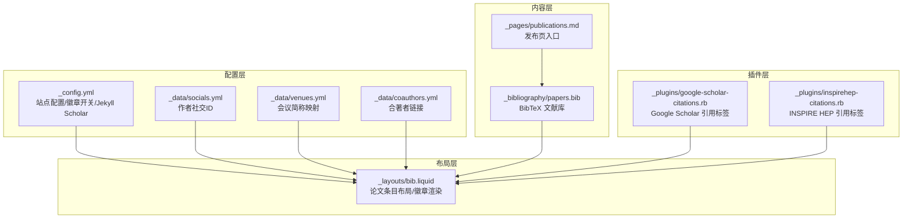
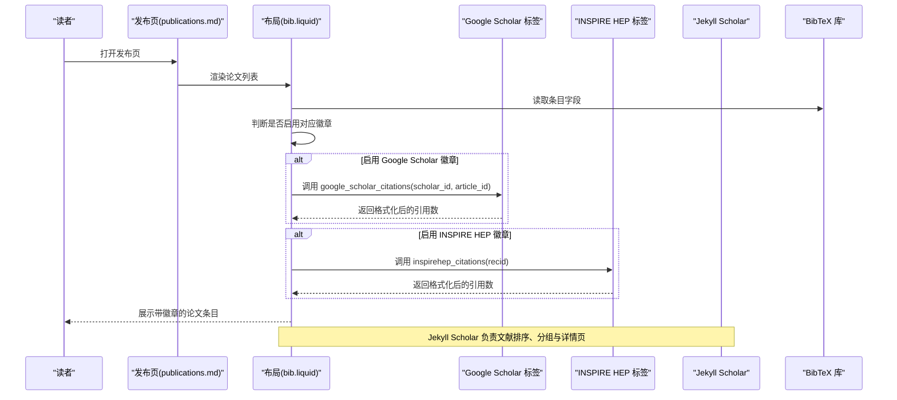
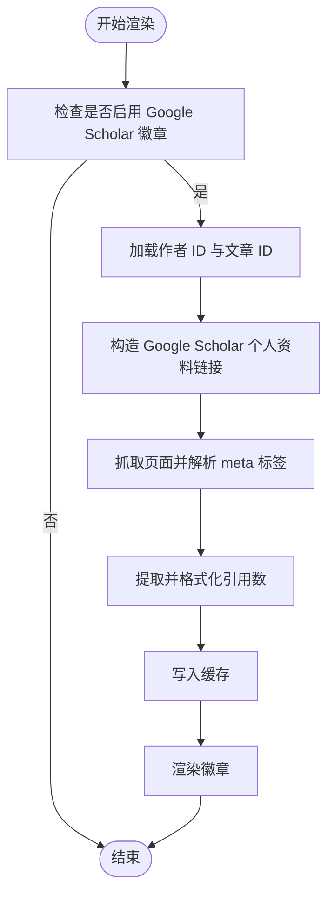
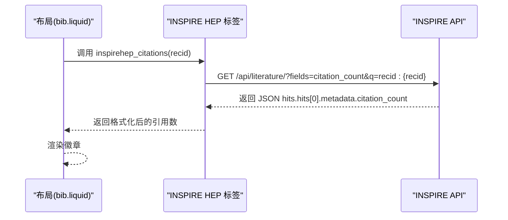
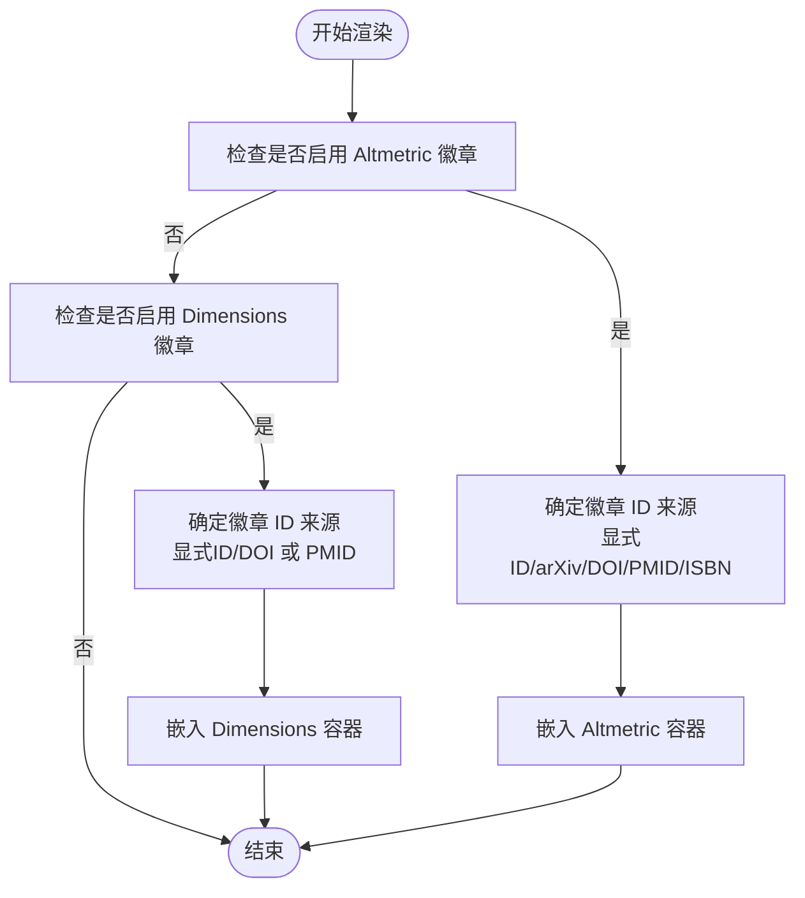
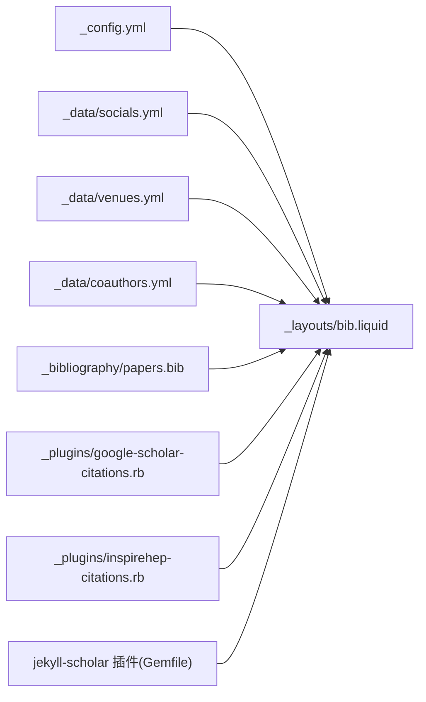

# 学术服务集成

<cite>
**本文档引用的文件**
- [_config.yml](file://_config.yml)
- [_plugins/google-scholar-citations.rb](file://_plugins/google-scholar-citations.rb)
- [_plugins/inspirehep-citations.rb](file://_plugins/inspirehep-citations.rb)
- [_layouts/bib.liquid](file://_layouts/bib.liquid)
- [_data/socials.yml](file://_data/socials.yml)
- [_pages/publications.md](file://_pages/publications.md)
- [_bibliography/papers.bib](file://_bibliography/papers.bib)
- [Gemfile](file://Gemfile)
- [_includes/citation.liquid](file://_includes/citation.liquid)
- [CUSTOMIZE.md](file://CUSTOMIZE.md)
- [_data/venues.yml](file://_data/venues.yml)
- [_data/coauthors.yml](file://_data/coauthors.yml)
</cite>

## 目录
1. [简介](#简介)
2. [项目结构](#项目结构)
3. [核心组件](#核心组件)
4. [架构总览](#架构总览)
5. [详细组件分析](#详细组件分析)
6. [依赖关系分析](#依赖关系分析)
7. [性能考量](#性能考量)
8. [故障排除指南](#故障排除指南)
9. [结论](#结论)
10. [附录](#附录)

## 简介
本文件面向需要在个人学术网站中集成多种学术服务的用户与维护者，系统性阐述以下能力与配置方法：
- Google Scholar 引用统计与个人资料链接的集成：包括作者 ID 设置、引用计数抓取、徽章展示与同步策略。
- INSPIRE HEP（高能物理）文献检索与引用统计：基于 API 的引用计数获取与徽章展示。
- 第三方徽章系统：Altmetric、Dimensions 等服务的集成与配置要点。
- 学术数据库连接与数据同步：BibTeX 源管理、Jekyll Scholar 配置、徽章渲染流程。
- 配置示例与故障排除：帮助快速上手并稳定运行。

## 项目结构
该站点采用 Jekyll 静态生成框架，通过插件扩展学术服务能力，并在布局层统一渲染徽章与链接。关键目录与文件如下：
- 配置层：站点配置、作者信息、徽章开关、Jekyll Scholar 设置等。
- 插件层：自定义 Liquid 标签，用于抓取 Google Scholar 与 INSPIRE HEP 的引用统计。
- 数据层：作者社交信息、会议简称映射、合著者链接等。
- 布局层：论文条目布局，负责徽章渲染与按钮生成。
- 内容层：BibTeX 文献库、页面入口等。

图表来源
- [_config.yml](file://_config.yml)
- [_plugins/google-scholar-citations.rb](file://_plugins/google-scholar-citations.rb)
- [_plugins/inspirehep-citations.rb](file://_plugins/inspirehep-citations.rb)
- [_layouts/bib.liquid](file://_layouts/bib.liquid)
- [_data/socials.yml](file://_data/socials.yml)
- [_pages/publications.md](file://_pages/publications.md)
- [_bibliography/papers.bib](file://_bibliography/papers.bib)
- [_data/venues.yml](file://_data/venues.yml)
- [_data/coauthors.yml](file://_data/coauthors.yml)

章节来源
- [_config.yml](file://_config.yml)
- [_plugins/google-scholar-citations.rb](file://_plugins/google-scholar-citations.rb)
- [_plugins/inspirehep-citations.rb](file://_plugins/inspirehep-citations.rb)
- [_layouts/bib.liquid](file://_layouts/bib.liquid)
- [_data/socials.yml](file://_data/socials.yml)
- [_pages/publications.md](file://_pages/publications.md)
- [_bibliography/papers.bib](file://_bibliography/papers.bib)
- [_data/venues.yml](file://_data/venues.yml)
- [_data/coauthors.yml](file://_data/coauthors.yml)

## 核心组件
- Google Scholar 引用统计标签：从 Google Scholar 页面解析“被引次数”，支持人类可读格式化与缓存。
- INSPIRE HEP 引用统计标签：调用 INSPIRE API 获取 citation_count 并格式化显示。
- 论文条目布局：根据 BibTeX 字段与站点配置，动态渲染徽章（Altmetric、Dimensions、Google Scholar、INSPIRE HEP）。
- 站点配置：控制徽章开关、过滤关键词、作者识别、Jekyll Scholar 行为等。
- 社交与作者数据：提供 Google Scholar ID、INSPIRE HEP ID、合著者链接等。

章节来源
- [_plugins/google-scholar-citations.rb](file://_plugins/google-scholar-citations.rb)
- [_plugins/inspirehep-citations.rb](file://_plugins/inspirehep-citations.rb)
- [_layouts/bib.liquid](file://_layouts/bib.liquid)
- [_config.yml](file://_config.yml)
- [_data/socials.yml](file://_data/socials.yml)

## 架构总览
下图展示了从 BibTeX 条目到最终徽章渲染的关键流程，以及各服务的集成位置。

图表来源
- [_pages/publications.md](file://_pages/publications.md)
- [_layouts/bib.liquid](file://_layouts/bib.liquid)
- [_plugins/google-scholar-citations.rb](file://_plugins/google-scholar-citations.rb)
- [_plugins/inspirehep-citations.rb](file://_plugins/inspirehep-citations.rb)
- [_bibliography/papers.bib](file://_bibliography/papers.bib)
- [_config.yml](file://_config.yml)

## 详细组件分析

### Google Scholar 集成
- 作者 ID 设置
  - 在社交数据文件中设置 Google Scholar 用户 ID，作为全局引用徽章的默认作者标识。
  - 在单篇条目中可通过自定义字段提供文章级 ID，用于区分不同论文的引用统计。
- 引用统计获取
  - 自定义 Liquid 标签会访问 Google Scholar 个人资料页面，解析 meta 标签中的“被引次数”文本，进行数字提取与格式化。
  - 为避免频繁请求被限流，实现包含随机延时；同时对已获取结果进行内存缓存，减少重复抓取。
- 徽章展示与同步
  - 布局层根据站点配置与条目字段决定是否渲染 Google Scholar 徽章，并以 Shields 图标形式显示引用数。
  - 若条目未提供文章级 ID，则不会渲染该徽章；若提供 ID 但抓取失败，徽章显示为不可用状态。

图表来源
- [_layouts/bib.liquid](file://_layouts/bib.liquid)
- [_plugins/google-scholar-citations.rb](file://_plugins/google-scholar-citations.rb)
- [_data/socials.yml](file://_data/socials.yml)

章节来源
- [_plugins/google-scholar-citations.rb](file://_plugins/google-scholar-citations.rb)
- [_layouts/bib.liquid](file://_layouts/bib.liquid)
- [_data/socials.yml](file://_data/socials.yml)

### INSPIRE HEP 集成
- 高能物理文献检索与引用统计
  - 自定义 Liquid 标签通过 INSPIRE API 查询指定记录的 citation_count 字段，并进行人类可读格式化。
  - 实现包含异常处理与错误回退，确保页面渲染不中断。
- 徽章展示
  - 布局层根据条目是否存在 INSPIRE HEP ID 决定是否渲染徽章；若存在则以 Shields 形式显示引用数。

图表来源
- [_plugins/inspirehep-citations.rb](file://_plugins/inspirehep-citations.rb)
- [_layouts/bib.liquid](file://_layouts/bib.liquid)

章节来源
- [_plugins/inspirehep-citations.rb](file://_plugins/inspirehep-citations.rb)
- [_layouts/bib.liquid](file://_layouts/bib.liquid)

### 第三方徽章系统（Altmetric、Dimensions）
- Altmetric
  - 支持通过条目字段或 arXiv/DOI/PMID/ISBN 等自动识别资源，嵌入对应的徽章容器。
  - 可在条目中显式提供 ID 以覆盖自动识别逻辑。
- Dimensions
  - 支持通过条目字段或 DOI/PMID 等自动识别资源，嵌入对应的徽章容器。
  - 当未提供显式 ID 时，优先尝试 DOI，否则回退到 PMID。

图表来源
- [_layouts/bib.liquid](file://_layouts/bib.liquid)

章节来源
- [_layouts/bib.liquid](file://_layouts/bib.liquid)

### 学术数据库连接与数据同步
- BibTeX 源管理
  - 使用 Jekyll Scholar 读取 BibTeX 文件，支持样式、本地化、分组与详情页生成。
  - 可配置过滤关键词，避免内部关键字出现在输出中。
- 数据同步策略
  - 引用统计属于运行时抓取，建议结合缓存与合理的请求间隔，避免触发反爬限制。
  - 对于第三方徽章（Altmetric、Dimensions），其容器脚本由外部服务提供，无需本地同步。

章节来源
- [_config.yml](file://_config.yml)
- [_pages/publications.md](file://_pages/publications.md)
- [_bibliography/papers.bib](file://_bibliography/papers.bib)

## 依赖关系分析
- 插件依赖
  - Google Scholar 与 INSPIRE HEP 标签依赖 Ruby 的 HTTP 解析与网络库。
  - 布局层依赖 Liquid 上下文变量（如作者 ID、条目字段）。
- 站点配置依赖
  - 徽章开关、过滤关键词、作者识别规则均来自站点配置文件。
- 数据依赖
  - 社交 ID、会议简称、合著者链接等影响布局渲染与链接生成。

图表来源
- [_config.yml](file://_config.yml)
- [_layouts/bib.liquid](file://_layouts/bib.liquid)
- [_data/socials.yml](file://_data/socials.yml)
- [_data/venues.yml](file://_data/venues.yml)
- [_data/coauthors.yml](file://_data/coauthors.yml)
- [_bibliography/papers.bib](file://_bibliography/papers.bib)
- [_plugins/google-scholar-citations.rb](file://_plugins/google-scholar-citations.rb)
- [_plugins/inspirehep-citations.rb](file://_plugins/inspirehep-citations.rb)
- [Gemfile](file://Gemfile)

章节来源
- [Gemfile](file://Gemfile)
- [_config.yml](file://_config.yml)
- [_layouts/bib.liquid](file://_layouts/bib.liquid)

## 性能考量
- 请求节流与缓存
  - Google Scholar 抓取实现包含随机延时与内存缓存，有助于降低被限流风险并提升重复访问性能。
- 渲染优化
  - 布局层按需渲染徽章，避免不必要的网络请求。
- 外部脚本加载
  - Altmetric、Dimensions 的徽章容器脚本由外部 CDN 提供，建议关注其加载性能与稳定性。

## 故障排除指南
- Google Scholar 引用数显示为不可用
  - 检查条目是否提供文章级 ID，以及作者 ID 是否正确配置。
  - 确认网络连通与反爬策略，必要时调整请求频率或使用代理。
- INSPIRE HEP 引用数显示为不可用
  - 检查条目是否提供正确的 INSPIRE HEP 记录 ID。
  - 确认 API 可达性与返回格式。
- 徽章未显示
  - 检查站点配置中对应徽章开关是否开启。
  - 确认条目字段是否满足渲染条件（如 altmetric、dimensions 的 ID 或 DOI/PMID 等）。
- BibTeX 条目未显示
  - 检查过滤关键词是否误删了必要字段。
  - 确认 Jekyll Scholar 配置与 BibTeX 文件路径一致。

章节来源
- [_plugins/google-scholar-citations.rb](file://_plugins/google-scholar-citations.rb)
- [_plugins/inspirehep-citations.rb](file://_plugins/inspirehep-citations.rb)
- [_layouts/bib.liquid](file://_layouts/bib.liquid)
- [_config.yml](file://_config.yml)

## 结论
通过上述组件与配置，站点实现了对 Google Scholar、INSPIRE HEP 以及第三方徽章系统的完整集成。借助 Jekyll Scholar 的文献管理能力与自定义 Liquid 标签的运行时抓取机制，用户可以便捷地在个人主页中展示权威的学术指标与链接。建议在生产环境中合理设置缓存与请求节流，并持续关注第三方服务的稳定性与接口变化。

## 附录

### 配置示例与最佳实践
- 启用与禁用徽章
  - 在站点配置中设置相应开关，控制是否渲染各徽章。
- 设置作者 ID
  - 在社交数据文件中填写 Google Scholar 用户 ID；在条目中提供文章级 ID 以获取独立引用统计。
- 高能物理条目
  - 在条目中提供 INSPIRE HEP 记录 ID，以便渲染引用徽章。
- 过滤关键词
  - 将内部关键字加入过滤列表，避免出现在最终输出中。

章节来源
- [_config.yml](file://_config.yml)
- [_data/socials.yml](file://_data/socials.yml)
- [_layouts/bib.liquid](file://_layouts/bib.liquid)
- [_plugins/google-scholar-citations.rb](file://_plugins/google-scholar-citations.rb)
- [_plugins/inspirehep-citations.rb](file://_plugins/inspirehep-citations.rb)
- [CUSTOMIZE.md](file://CUSTOMIZE.md)