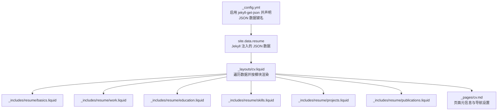
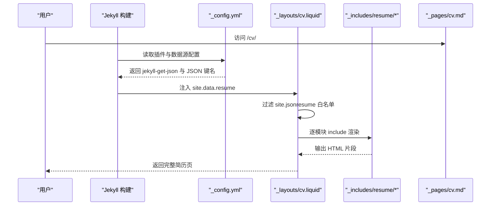
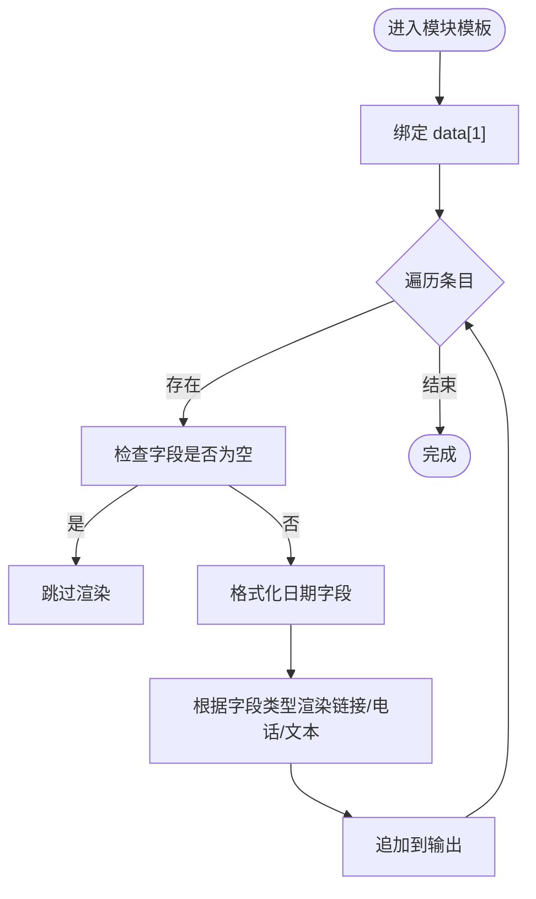
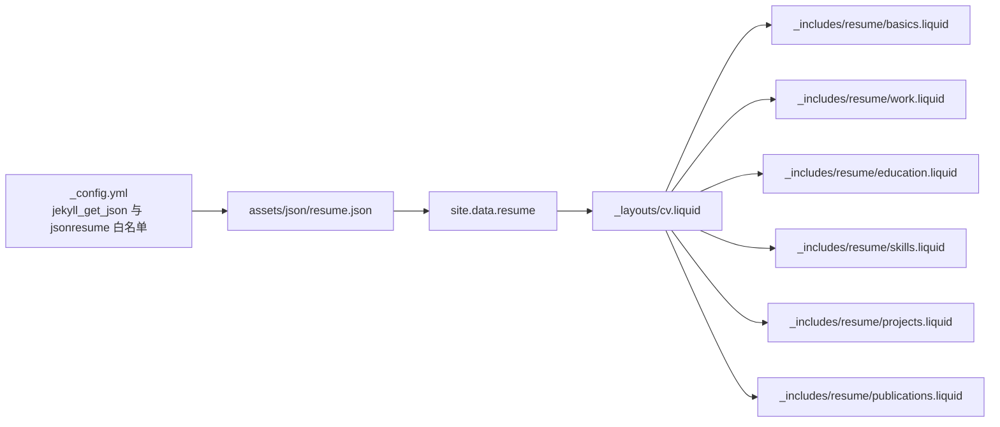

# JSON Resume 格式配置

<cite>
**本文引用的文件**
- [assets/json/resume.json](file://assets/json/resume.json)
- [_layouts/cv.liquid](file://_layouts/cv.liquid)
- [_config.yml](file://_config.yml)
- [_pages/cv.md](file://_pages/cv.md)
- [_includes/resume/basics.liquid](file://_includes/resume/basics.liquid)
- [_includes/resume/work.liquid](file://_includes/resume/work.liquid)
- [_includes/resume/education.liquid](file://_includes/resume/education.liquid)
- [_includes/resume/skills.liquid](file://_includes/resume/skills.liquid)
- [_includes/resume/projects.liquid](file://_includes/resume/projects.liquid)
- [_includes/resume/publications.liquid](file://_includes/resume/publications.liquid)
</cite>

## 目录
1. [简介](#简介)
2. [项目结构](#项目结构)
3. [核心组件](#核心组件)
4. [架构总览](#架构总览)
5. [详细组件分析](#详细组件分析)
6. [依赖分析](#依赖分析)
7. [性能考虑](#性能考虑)
8. [故障排查指南](#故障排查指南)
9. [结论](#结论)
10. [附录](#附录)

## 简介
本文件系统化阐述本仓库中 JSON Resume 格式的配置与实现，涵盖以下内容：
- JSON Resume 标准字段定义与扩展字段支持
- 数据验证规则与约束
- resume.json 的结构组织（基本信息、工作经历、教育背景、技能专长、项目经验、奖项荣誉、证书、出版物、语言能力、兴趣爱好、推荐人等）
- 将 YAML 数据转换为 JSON Resume 的映射关系与转换流程
- 模板如何处理 JSON 数据（数据绑定、条件渲染、样式定制）
- 实际 JSON 配置示例与兼容性说明

## 项目结构
本项目通过 Jekyll 插件加载 JSON 数据，并在 cv 布局中按模块渲染。关键路径如下：
- 配置：站点配置启用 JSON 数据加载与可选字段白名单
- 数据：assets/json/resume.json 提供 JSON Resume 数据源
- 布局：_layouts/cv.liquid 控制页面整体渲染与模块选择
- 模块：_includes/resume/*.liquid 负责各模块的模板渲染

图表来源
- [_config.yml:629-646](file://_config.yml#L629-L646)
- [_layouts/cv.liquid:82-124](file://_layouts/cv.liquid#L82-L124)
- [_pages/cv.md:1-12](file://_pages/cv.md#L1-L12)

章节来源
- [_config.yml:629-646](file://_config.yml#L629-L646)
- [_layouts/cv.liquid:1-128](file://_layouts/cv.liquid#L1-L128)
- [_pages/cv.md:1-12](file://_pages/cv.md#L1-L12)

## 核心组件
- JSON 数据源：assets/json/resume.json，遵循 JSON Resume 标准字段结构
- Jekyll 配置：启用 jekyll-get-json 插件，将 JSON 注入到 site.data.resume
- 页面布局：cv 布局根据 site.jsonresume 白名单控制渲染哪些模块
- 模块模板：各模块 Liquid 模板负责字段提取、日期格式化、链接与图标渲染

章节来源
- [assets/json/resume.json:1-201](file://assets/json/resume.json#L1-L201)
- [_config.yml:629-646](file://_config.yml#L629-L646)
- [_layouts/cv.liquid:82-124](file://_layouts/cv.liquid#L82-L124)

## 架构总览
下图展示从 JSON 数据到页面渲染的关键流程。

图表来源
- [_config.yml:629-646](file://_config.yml#L629-L646)
- [_layouts/cv.liquid:82-124](file://_layouts/cv.liquid#L82-L124)
- [_pages/cv.md:1-12](file://_pages/cv.md#L1-L12)

## 详细组件分析

### JSON 数据结构与字段定义
resume.json 遵循 JSON Resume 标准模块划分，包含以下主要字段（节选）：
- basics：个人信息（姓名、标签、邮箱、电话、URL、摘要、位置、社交资料）
- work：工作经历（公司、职位、起止时间、摘要、高亮条目）
- volunteer：志愿经历（组织、地点、职位、起止时间、摘要、高亮条目）
- education：教育背景（学校、地点、起止时间、专业、学位、成绩、课程）
- awards：奖项荣誉（名称、日期、授予方、URL、摘要）
- certificates：证书（名称、日期、颁发机构、URL、图标）
- publications：出版物（名称、出版社、发布日期、URL、摘要）
- skills：技能（名称、水平、图标、关键词列表）
- languages：语言（语言名、熟练度、图标）
- interests：兴趣（名称、图标、关键词列表）
- references：推荐人（姓名、图标、推荐内容）
- projects：项目（名称、摘要、高亮条目、起止时间、URL）

章节来源
- [assets/json/resume.json:1-201](file://assets/json/resume.json#L1-L201)

### 字段映射与转换规则（YAML → JSON Resume）
本仓库未提供 YAML 到 JSON 的自动转换脚本。建议采用以下映射策略：
- 通用映射：YAML 中的键名与 JSON Resume 字段一一对应（如 name ↔ name、position ↔ position）
- 时间字段：统一为 ISO 8601 格式（YYYY-MM-DD），用于排序与显示
- 数组字段：确保 lists（如 courses、keywords、highlights）为数组类型
- 可选字段：若 YAML 中无对应项，JSON 对应字段可省略或留空字符串
- 扩展字段：可在 JSON 中添加非标准字段（如 icon），但需在模板中显式处理

[本节为通用实践说明，不直接分析具体文件，故无“章节来源”]

### 模板渲染机制（数据绑定、条件渲染、样式定制）
cv 布局通过 site.jsonresume 白名单过滤模块，再按模块 include 渲染。各模块模板负责：
- 数据绑定：直接访问 data[1]（当前模块的数组或对象）
- 条件渲染：对空值跳过；对日期进行格式化；对链接与电话进行协议包装
- 样式定制：使用 Bootstrap 表格与列表类，配合图标库实现视觉层次

图表来源
- [_layouts/cv.liquid:82-124](file://_layouts/cv.liquid#L82-L124)
- [_includes/resume/basics.liquid:1-29](file://_includes/resume/basics.liquid#L1-L29)
- [_includes/resume/work.liquid:1-53](file://_includes/resume/work.liquid#L1-L53)
- [_includes/resume/education.liquid:1-55](file://_includes/resume/education.liquid#L1-L55)
- [_includes/resume/skills.liquid:1-34](file://_includes/resume/skills.liquid#L1-L34)
- [_includes/resume/projects.liquid:1-33](file://_includes/resume/projects.liquid#L1-L33)
- [_includes/resume/publications.liquid:1-29](file://_includes/resume/publications.liquid#L1-L29)

章节来源
- [_layouts/cv.liquid:82-124](file://_layouts/cv.liquid#L82-L124)
- [_includes/resume/basics.liquid:1-29](file://_includes/resume/basics.liquid#L1-L29)
- [_includes/resume/work.liquid:1-53](file://_includes/resume/work.liquid#L1-L53)
- [_includes/resume/education.liquid:1-55](file://_includes/resume/education.liquid#L1-L55)
- [_includes/resume/skills.liquid:1-34](file://_includes/resume/skills.liquid#L1-L34)
- [_includes/resume/projects.liquid:1-33](file://_includes/resume/projects.liquid#L1-L33)
- [_includes/resume/publications.liquid:1-29](file://_includes/resume/publications.liquid#L1-L29)

### 数据验证规则与约束
- 必填字段：不同模块必填字段不同，例如 work/education/publications 等通常需要名称或标题
- 类型约束：日期字段应为字符串且符合 ISO 8601；数组字段应为 JSON 数组
- 排序与呈现：模板会按日期字段进行降序排序（如 work、education、publications）
- 空值处理：模板会跳过空值字段，避免渲染空白
- 白名单控制：仅当模块出现在 site.jsonresume 列表时才会渲染

章节来源
- [_layouts/cv.liquid:82-124](file://_layouts/cv.liquid#L82-L124)
- [_includes/resume/work.liquid:2-2](file://_includes/resume/work.liquid#L2-L2)
- [_includes/resume/education.liquid:2-2](file://_includes/resume/education.liquid#L2-L2)
- [_includes/resume/publications.liquid:2-2](file://_includes/resume/publications.liquid#L2-L2)

### 模块模板详解

#### 基本信息（basics）
- 功能：渲染姓名、标签、邮箱、电话、URL、摘要、位置、社交资料等
- 特性：对 URL、email、phone 字段自动添加协议链接；跳过空字段

章节来源
- [_includes/resume/basics.liquid:1-29](file://_includes/resume/basics.liquid#L1-L29)

#### 工作经历（work）
- 功能：渲染公司、职位、起止时间、摘要、高亮条目
- 特性：日期格式化为“YYYY.MM - YYYY.MM 或 Present”；支持地点显示

章节来源
- [_includes/resume/work.liquid:1-53](file://_includes/resume/work.liquid#L1-L53)

#### 教育背景（education）
- 功能：渲染学校、地点、起止时间、专业、学位、成绩、课程
- 特性：日期格式化；课程以列表形式展示

章节来源
- [_includes/resume/education.liquid:1-55](file://_includes/resume/education.liquid#L1-L55)

#### 技能专长（skills）
- 功能：渲染技能类别、水平、图标与关键词
- 特性：按列分组展示关键词，支持图标

章节来源
- [_includes/resume/skills.liquid:1-34](file://_includes/resume/skills.liquid#L1-L34)

#### 项目经验（projects）
- 功能：渲染项目名称、摘要、高亮条目、起止时间、链接
- 特性：日期格式化；摘要斜体显示

章节来源
- [_includes/resume/projects.liquid:1-33](file://_includes/resume/projects.liquid#L1-L33)

#### 出版物（publications）
- 功能：渲染名称、出版社、发布日期、摘要、链接
- 特性：按发布日期倒序排列

章节来源
- [_includes/resume/publications.liquid:1-29](file://_includes/resume/publications.liquid#L1-L29)

### JSON Schema 定义与验证示例
以下为基于 resume.json 字段的简化 Schema 规则（概念性说明，非完整规范）：
- basics：name、label、email、phone、url、summary、location（address/postalCode/city/countryCode/region）、profiles（network/username/url）
- work：name、position、url、startDate、endDate、summary、highlights（数组）
- volunteer：organization、position、url、startDate、endDate、summary、highlights
- education：institution、location、url、area、studyType、startDate、endDate、score、courses
- awards：title、date、awarder、url、summary
- certificates：name、date、issuer、url、icon
- publications：name、publisher、releaseDate、url、summary
- skills：name、level、icon、keywords（数组）
- languages：language、fluency、icon
- interests：name、icon、keywords（数组）
- references：name、icon、reference
- projects：name、summary、highlights（数组）、startDate、endDate、url

验证建议：
- 使用在线 JSON Schema 校验器（如 ajv、z-schema）对 resume.json 进行校验
- 在 CI 中加入校验步骤，确保每次更新后数据格式正确
- 对日期字段增加正则校验（YYYY-MM-DD）

[本节为通用实践说明，不直接分析具体文件，故无“章节来源”]

## 依赖分析
- 插件依赖：jekyll-get-json 将 assets/json/resume.json 注入 site.data.resume
- 配置依赖：_config.yml 中的 jsonresume 白名单决定渲染模块集合
- 模板依赖：cv 布局依赖各模块 include 模板

图表来源
- [_config.yml:629-646](file://_config.yml#L629-L646)
- [_layouts/cv.liquid:82-124](file://_layouts/cv.liquid#L82-L124)

章节来源
- [_config.yml:629-646](file://_config.yml#L629-L646)
- [_layouts/cv.liquid:82-124](file://_layouts/cv.liquid#L82-L124)

## 性能考虑
- 数据体积：减少不必要的字段与冗余数据，有助于提升构建速度
- 模板复杂度：避免在模板中进行重型计算，尽量在生成阶段完成
- 排序开销：work/education/publications 模块已内置降序排序，注意字段一致性以避免重复排序
- 缓存策略：利用 Jekyll 的增量构建与浏览器缓存优化静态资源

[本节提供一般性指导，不直接分析具体文件，故无“章节来源”]

## 故障排查指南
- 数据未显示
  - 检查 _config.yml 中 jekyll_get_json 是否正确指向 assets/json/resume.json
  - 确认 jsonresume 白名单包含目标模块
- 字段为空导致不显示
  - 模板会跳过空字段，确认 JSON 中对应字段非空
- 日期显示异常
  - 确保日期字段为 ISO 8601 字符串；模板会进行格式化
- 链接无法点击
  - 确认 URL 字段包含协议（http/https）；模板会自动识别并包装

章节来源
- [_config.yml:629-646](file://_config.yml#L629-L646)
- [_layouts/cv.liquid:82-124](file://_layouts/cv.liquid#L82-L124)
- [_includes/resume/basics.liquid:16-24](file://_includes/resume/basics.liquid#L16-L24)

## 结论
本项目通过 Jekyll 插件与 Liquid 模板实现了对 JSON Resume 格式的完整支持。resume.json 提供标准化的数据结构，cv 布局与模块模板负责渲染与样式定制。通过白名单控制与字段验证，可灵活适配不同需求。建议在团队协作中维护一致的字段命名与日期格式，并在 CI 中加入 JSON 校验，以保障数据质量与渲染稳定性。

[本节为总结性内容，不直接分析具体文件，故无“章节来源”]

## 附录

### 实际 JSON 配置示例（字段路径）
- 基本信息：见 [assets/json/resume.json:2-24](file://assets/json/resume.json#L2-L24)
- 工作经历：见 [assets/json/resume.json:25-35](file://assets/json/resume.json#L25-L35)
- 志愿经历：见 [assets/json/resume.json:36-47](file://assets/json/resume.json#L36-L47)
- 教育背景：见 [assets/json/resume.json:48-59](file://assets/json/resume.json#L48-L59)
- 奖项荣誉：见 [assets/json/resume.json:61-69](file://assets/json/resume.json#L61-L69)
- 证书：见 [assets/json/resume.json:70-113](file://assets/json/resume.json#L70-L113)
- 出版物：见 [assets/json/resume.json:114-136](file://assets/json/resume.json#L114-L136)
- 技能：见 [assets/json/resume.json:137-151](file://assets/json/resume.json#L137-L151)
- 语言：见 [assets/json/resume.json:152-163](file://assets/json/resume.json#L152-L163)
- 兴趣：见 [assets/json/resume.json:164-177](file://assets/json/resume.json#L164-L177)
- 推荐人：见 [assets/json/resume.json:178-189](file://assets/json/resume.json#L178-L189)
- 项目：见 [assets/json/resume.json:190-200](file://assets/json/resume.json#L190-L200)

### 兼容性说明
- 浏览器兼容：模板使用标准 HTML/CSS/JS，兼容主流现代浏览器
- 字体图标：依赖 Font Awesome，确保网络可达或本地托管
- 增量构建：Jekyll 支持增量构建，建议开启以提升开发效率

[本节为通用说明，不直接分析具体文件，故无“章节来源”]