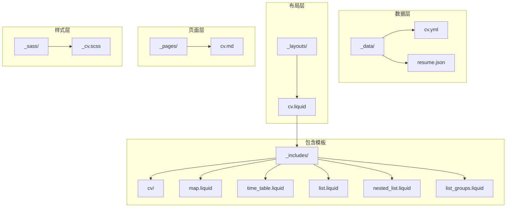
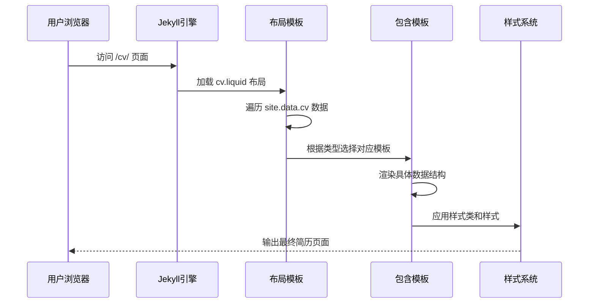
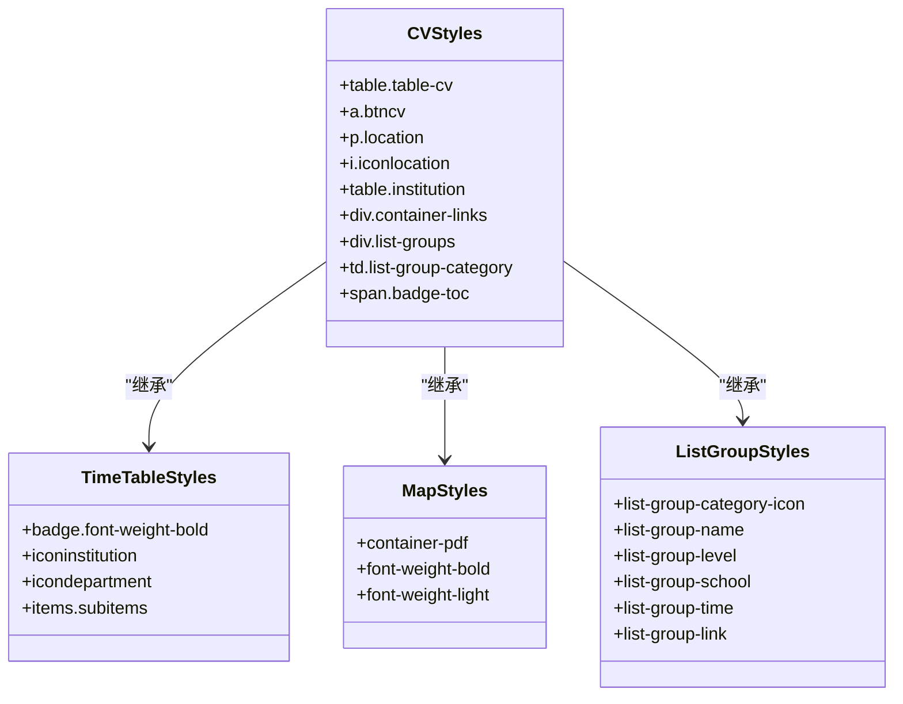
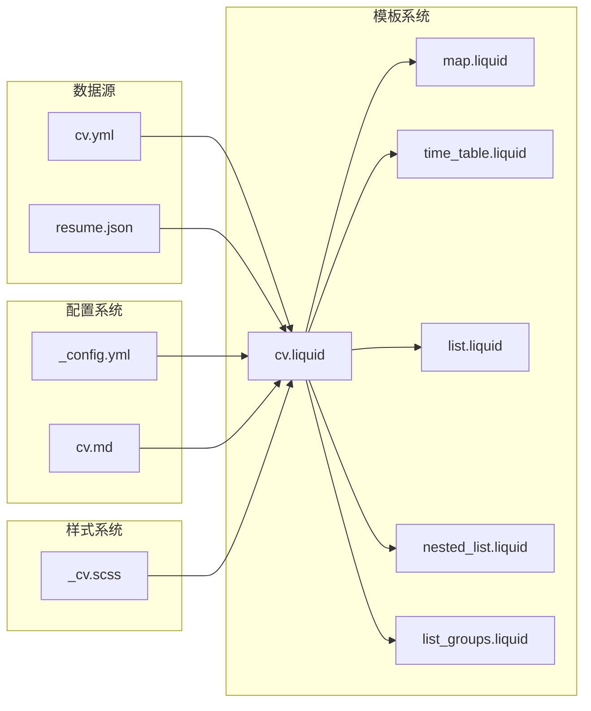

# YAML 格式简历配置

<cite>
**本文档引用的文件**
- [cv.yml](file://_data/cv.yml)
- [cv.liquid](file://_layouts/cv.liquid)
- [map.liquid](file://_includes/cv/map.liquid)
- [time_table.liquid](file://_includes/cv/time_table.liquid)
- [list.liquid](file://_includes/cv/list.liquid)
- [nested_list.liquid](file://_includes/cv/nested_list.liquid)
- [list_groups.liquid](file://_includes/cv/list_groups.liquid)
- [cv.md](file://_pages/cv.md)
- [_cv.scss](file://_sass/_cv.scss)
- [resume.json](file://assets/json/resume.json)
- [_config.yml](file://_config.yml)
</cite>

## 目录
1. [简介](#简介)
2. [项目结构](#项目结构)
3. [核心组件](#核心组件)
4. [架构概览](#架构概览)
5. [详细组件分析](#详细组件分析)
6. [依赖关系分析](#依赖关系分析)
7. [性能考虑](#性能考虑)
8. [故障排除指南](#故障排除指南)
9. [结论](#结论)

## 简介

本项目提供了一个基于 Jekyll 的学术简历系统，支持两种简历数据源：YAML 格式的个人简历配置和 JSON 格式的标准简历格式。该系统通过 Liquid 模板引擎将结构化的数据渲染为美观的简历页面，支持多种数据类型和布局模式。

## 项目结构

该项目采用 Jekyll 主题的标准目录结构，简历功能主要集中在以下关键目录中：



**图表来源**
- [cv.yml:1-98](file://_data/cv.yml#L1-L98)
- [cv.liquid:1-128](file://_layouts/cv.liquid#L1-L128)

**章节来源**
- [cv.yml:1-98](file://_data/cv.yml#L1-L98)
- [cv.liquid:1-128](file://_layouts/cv.liquid#L1-L128)

## 核心组件

### 数据结构设计

简历系统采用统一的条目结构，每个条目包含标题、类型和内容三个核心部分：

| 字段名 | 类型 | 必需 | 描述 |
|--------|------|------|------|
| title | string | 是 | 条目的显示标题 |
| type | string | 是 | 数据类型标识符 |
| contents | array | 是 | 实际内容数组 |

### 支持的数据类型

系统支持以下五种数据类型：

1. **map** - 映射类型，用于基本信息展示
2. **time_table** - 时间表格，用于教育和工作经历
3. **nested_list** - 嵌套列表，用于兴趣爱好分类
4. **list** - 简单列表，用于其他项目
5. **list_groups** - 列表分组，用于技能和证书

**章节来源**
- [cv.yml:1-98](file://_data/cv.yml#L1-L98)
- [cv.liquid:36-48](file://_layouts/cv.liquid#L36-L48)

## 架构概览

简历渲染采用三层架构设计：



**图表来源**
- [cv.liquid:31-51](file://_layouts/cv.liquid#L31-L51)
- [map.liquid:1-30](file://_includes/cv/map.liquid#L1-L30)
- [time_table.liquid:1-119](file://_includes/cv/time_table.liquid#L1-L119)

## 详细组件分析

### YAML 数据配置

#### General Information 模块

General Information 使用 map 类型，适合展示个人信息的基本字段：

```yaml
- title: General Information
  type: map
  contents:
    - name: Full Name
      value: Albert Einstein
    - name: Date of Birth
      value: 14th March 1879
    - name: Languages
      value: English, German
```

#### Education 模块

Education 使用 time_table 类型，专门处理时间线信息：

```yaml
- title: Education
  type: time_table
  contents:
    - title: PhD
      institution: University of Zurich, Zurich, Switzerland
      year: 1905
      description:
        - Description 1.
        - Description 2.
        - title: Description 3.
          contents:
            - Sub-description 1.
            - Sub-description 2.
```

#### Experience 模块

Experience 同样使用 time_table 类型，展示工作经历：

```yaml
- title: Experience
  type: time_table
  contents:
    - title: Professor of Theoretical Physics
      institution: Institute for Advanced Study, Princeton University
      year: 1933 - 1955
      description:
        - Description 1.
        - Description 2.
```

#### Open Source Projects 模块

开源项目使用 time_table 类型，支持链接展示：

```yaml
- title: Open Source Projects
  type: time_table
  contents:
    - title: <a href="https://github.com/alshedivat/al-folio">al-folio</a>
      year: 2015-now
      description: A beautiful, simple, clean, and responsive Jekyll theme for academics.
```

#### Honors and Awards 模块

荣誉奖项使用特殊的 items 结构：

```yaml
- title: Honors and Awards
  type: time_table
  contents:
    - year: 1921
      items:
        - Nobel Prize in Physics
        - Matteucci Medal
```

#### Academic Interests 模块

学术兴趣使用 nested_list 类型：

```yaml
- title: Academic Interests
  type: nested_list
  contents:
    - title: Topic 1.
      items:
        - Description 1.
        - Description 2.
```

#### Other Interests 模块

其他兴趣使用简单的 list 类型：

```yaml
- title: Other Interests
  type: list
  contents:
    - <u>Hobbies:</u> Hobby 1, Hobby 2, etc.
```

**章节来源**
- [cv.yml:1-98](file://_data/cv.yml#L1-L98)

### Liquid 模板渲染机制

#### 主布局模板

主布局模板负责整体页面结构和数据遍历：

```liquid

  <a class="anchor" id="{{ entry.title }}"></a>
  <div class="card mt-3 p-3">
    <h3 class="card-title font-weight-medium">{{ entry.title }}</h3>
    <div>
      
        
      
        
      
        
      
        
      
        
      
        {{ entry.contents }}
      
    </div>
  </div>

```

#### Map 类型模板

Map 类型模板用于渲染键值对信息：

```liquid
<table class="table table-cv table-sm table-borderless table-responsive">
  
    <tr>
      <td class="p-1 pr-2 font-weight-bold">
        <b>{{ content.name }}</b>
      </td>
      
        <td class="p-1 pl-2 font-weight-light text">{{ content.value }}</td>
      
      
        <td class="p-1 pl-2 font-weight-light text">
          <div class="container-pdf">
            
              
                <div class="container-link-button">
                  
                    <a href="{{ item.link }}" target="_blank" class="btncv z-depth-0">{{ item.name }}</a>
                  
                    <a href="{{ item.link }}" target="_blank" class="btncv z-depth-0">doc</a>
                  
                </div>
              
            
          </div>
        </td>
      
    </tr>
  
</table>
```

#### Time Table 类型模板

Time Table 类型模板专门处理时间线数据：

```liquid
<ul class="card-text font-weight-light list-group list-group-flush">
  
    <li class="list-group-item">
      <div class="row">
        
          <div class="col-xs-2 cl-sm-2 col-md-2 text-center" style="width: 75px">
            <table class="table-cv">
              <tbody>
                <tr>
                  <td>
                    <span class="badge font-weight-bold danger-color-dark text-uppercase align-middle" style="min-width: 75px">
                      {{- content.year -}}
                    </span>
                  </td>
                </tr>
                
                  <tr>
                    <td>
                      <p class="location">
                        <i class="fa-solid fa-location-dot iconlocation"></i>
                        {{ content.location }}
                      </p>
                    </td>
                  </tr>
                
              </tbody>
            </table>
          </div>
        
        <div class="col-xs-10 cl-sm-10 col-md-10 mt-2 mt-md-0">
          
            <h6 class="title font-weight-bold ml-1 ml-md-4">{{ content.title }}</h6>
          
          
            <table class="table-cv ml-1 ml-md-4 institution">
              <tbody>
                
                  <tr>
                    <td style="vertical-align: top; text-align: center" class="institution">
                      <i class="fa-solid fa-building-columns iconinstitution"></i>
                    </td>
                    <td class="institution">{{ content.institution }}</td>
                  </tr>
                
                
                  <tr>
                    <td style="vertical-align: top; text-align: center" class="department">
                      <i class="fa-regular fa-circle-dot icondepartment"></i>
                    </td>
                    <td class="department">{{ content.department }}</td>
                  </tr>
                
              </tbody>
            </table>
          
          
            <div class="ml-1 ml-md-4">{{ content.maindescription }}</div>
          
          
            <ul class="items">
              
                <li>
                  
                    <span class="item-title">{{ item.title }}</span>
                    <ul class="subitems">
                      
                        <li>
                          <span class="subitem">{{ subitem }}</span>
                        </li>
                      
                    </ul>
                  
                    <span class="item">{{ item }}</span>
                  
                </li>
              
            </ul>
          
          
            <ul class="items">
              
                <li>
                  
                    <span class="item-title">{{ item.title }}</span>
                    <ul class="subitems">
                      
                        <li>
                          <span class="subitem">{{ subitem }}</span>
                        </li>
                      
                    </ul>
                  
                    <span class="item">{{ item }}</span>
                  
                </li>
              
            </ul>
          
        </div>
      </div>
    </li>
  
</ul>
```

#### List 类型模板

简单列表模板用于基础项目展示：

```liquid
<ul class="card-text font-weight-light list-group list-group-flush">
  
    <li class="list-group-item">{{ content }}</li>
  
</ul>
```

#### Nested List 类型模板

嵌套列表模板用于分类兴趣爱好：

```liquid
<ul class="card-text font-weight-light list-group list-group-flush">
  
    <li class="list-group-item">
      <h5 class="font-italic">{{ content.title }}</h5>
      
        <ul class="subitems">
          
            <li>
              <span class="subitem">{{ subitem }}</span>
            </li>
          
        </ul>
      
    </li>
  
</ul>
```

#### List Groups 类型模板

列表分组模板用于技能和证书展示：

```liquid
<div class="list-groups">
  
    <div class="list-group col-md-6">
      <table class="table-cv list-group-table">
        <tbody>
          <tr>
            
              <td class="list-group-category-icon"><i class="{{ content.icon }}"></i></td>
            
              <td class="list-group-category-icon"></td>
            
            <!-- Calculate colspan number for category title -->
            
            
              
            
            <td colspan="{{ i }}" class="list-group-category">{{ content.category }}</td>
          </tr>
          
            <tr>
              <td></td>
              <td class="list-group-name">
                <b>{{ item.name }}</b>
              </td>
              
                <td class="list-group-level">{{ item.level }}</td>
              
              
                <td class="list-group-school">{{ item.school }}
              
              
                <br>
                <span class="list-group-time">{{ item.time }}</span>
                </td>
              
                </td>
              
              
                <td class="list-group-link">
                  <a href="{{ item.link }}" target="_blank" class="btncv z-depth-0">
                    {{ item.linkname }}DOC
                  </a>
                </td>
              
            </tr>
          
        </tbody>
      </table>
    </div>
  
</div>
```

**章节来源**
- [cv.liquid:31-51](file://_layouts/cv.liquid#L31-L51)
- [map.liquid:1-30](file://_includes/cv/map.liquid#L1-L30)
- [time_table.liquid:1-119](file://_includes/cv/time_table.liquid#L1-L119)
- [list.liquid:1-6](file://_includes/cv/list.liquid#L1-L6)
- [nested_list.liquid:1-17](file://_includes/cv/nested_list.liquid#L1-L17)
- [list_groups.liquid:1-52](file://_includes/cv/list_groups.liquid#L1-L52)

### 样式系统

CV 样式系统采用 SCSS 构建，提供了完整的响应式设计：



**图表来源**
- [_cv.scss:9-33](file://_sass/_cv.scss#L9-L33)
- [_cv.scss:45-83](file://_sass/_cv.scss#L45-L83)
- [_cv.scss:101-151](file://_sass/_cv.scss#L101-L151)

**章节来源**
- [_cv.scss:1-221](file://_sass/_cv.scss#L1-L221)

## 依赖关系分析

### 数据依赖关系



**图表来源**
- [cv.yml:1-98](file://_data/cv.yml#L1-L98)
- [cv.liquid:1-128](file://_layouts/cv.liquid#L1-L128)
- [_config.yml:629-646](file://_config.yml#L629-L646)

### 模板依赖关系

系统采用模块化设计，每个模板都有明确的职责分工：

| 模板文件 | 职责 | 依赖关系 |
|----------|------|----------|
| cv.liquid | 主布局模板 | 所有包含模板 |
| map.liquid | 基本信息展示 | 样式系统 |
| time_table.liquid | 时间线数据 | 样式系统 |
| list.liquid | 简单列表 | 样式系统 |
| nested_list.liquid | 嵌套列表 | 样式系统 |
| list_groups.liquid | 分组列表 | 样式系统 |

**章节来源**
- [cv.liquid:36-48](file://_layouts/cv.liquid#L36-L48)
- [_config.yml:629-646](file://_config.yml#L629-L646)

## 性能考虑

### 渲染优化

1. **延迟加载**：所有图片都启用了懒加载功能
2. **CSS 压缩**：使用压缩模式减少文件大小
3. **JavaScript 优化**：采用 Terser 进行代码压缩
4. **响应式设计**：针对不同设备优化显示效果

### 数据加载优化

1. **缓存策略**：利用 Jekyll 的静态生成特性
2. **按需加载**：只加载必要的模板和样式
3. **资源优化**：第三方库使用 CDN 加速

## 故障排除指南

### 常见问题及解决方案

#### 数据类型错误

**问题**：条目类型不匹配
**解决**：确保每个条目的 `type` 字段与实际数据结构相符

#### 模板渲染异常

**问题**：特定类型的模板无法正确渲染
**解决**：检查对应的 Liquid 模板文件是否存在且语法正确

#### 样式显示问题

**问题**：简历页面样式异常
**解决**：确认 SCSS 编译正常，CSS 类名与模板一致

#### 数据访问错误

**问题**：无法访问 `_data/cv.yml` 文件
**解决**：检查文件路径和权限设置

**章节来源**
- [cv.liquid:4-54](file://_layouts/cv.liquid#L4-L54)
- [_config.yml:200-219](file://_config.yml#L200-L219)

## 结论

本简历系统通过精心设计的数据结构和模板系统，实现了高度可定制的学术简历展示功能。系统的主要优势包括：

1. **灵活的数据模型**：支持多种数据类型，适应不同的简历内容需求
2. **模块化模板设计**：清晰的职责分离，便于维护和扩展
3. **响应式样式系统**：提供良好的跨设备兼容性
4. **标准化配置**：遵循 Jekyll 生态系统的最佳实践

通过合理使用本系统，用户可以轻松创建专业、美观且功能完整的学术简历页面。