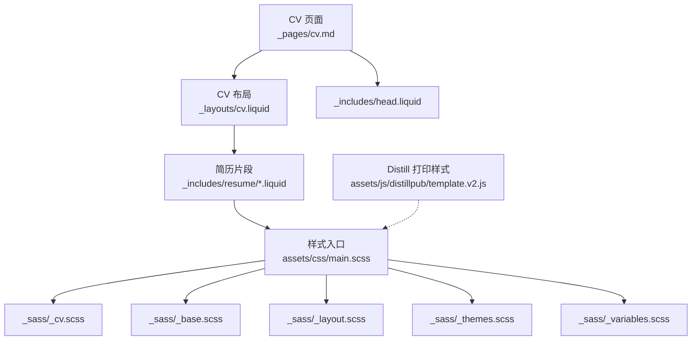
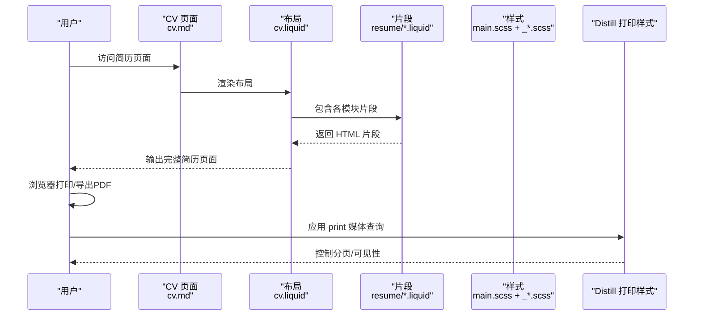
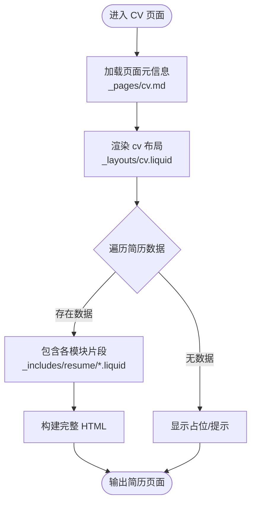
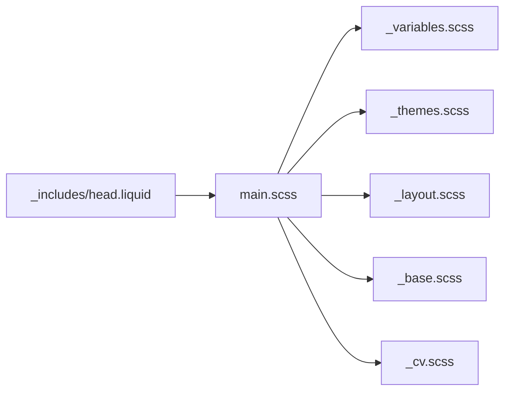
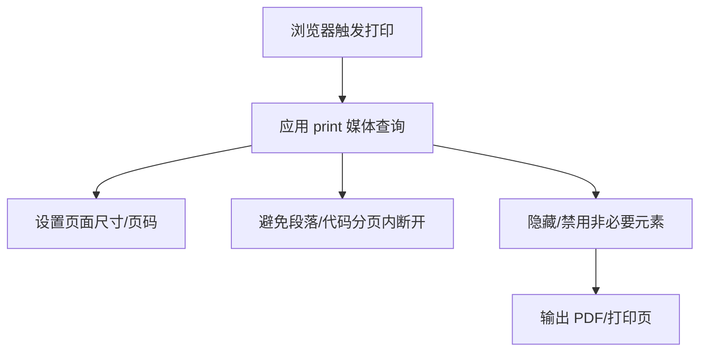
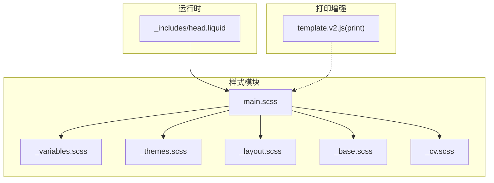

# 简历打印优化

<cite>
**本文引用的文件**
- [main.scss](file://assets/css/main.scss)
- [_cv.scss](file://_sass/_cv.scss)
- [_base.scss](file://_sass/_base.scss)
- [_layout.scss](file://_sass/_layout.scss)
- [_themes.scss](file://_sass/_themes.scss)
- [_variables.scss](file://_sass/_variables.scss)
- [_head.liquid](file://_includes/head.liquid)
- [cv.liquid](file://_layouts/cv.liquid)
- [cv.md](file://_pages/cv.md)
- [basics.liquid](file://_includes/resume/basics.liquid)
- [work.liquid](file://_includes/resume/work.liquid)
- [education.liquid](file://_includes/resume/education.liquid)
- [projects.liquid](file://_includes/resume/projects.liquid)
- [skills.liquid](file://_includes/resume/skills.liquid)
- [template.v2.js](file://assets/js/distillpub/template.v2.js)
- [transforms.v2.js](file://assets/js/distillpub/transforms.v2.js)
</cite>

## 目录
1. [简介](#简介)
2. [项目结构](#项目结构)
3. [核心组件](#核心组件)
4. [架构总览](#架构总览)
5. [详细组件分析](#详细组件分析)
6. [依赖关系分析](#依赖关系分析)
7. [性能考量](#性能考量)
8. [故障排查指南](#故障排查指南)
9. [结论](#结论)
10. [附录](#附录)

## 简介
本文件聚焦于简历在打印场景下的优化策略与实现，涵盖页面布局调整、颜色方案、字体选择、边距设置、CSS 媒体查询（print）、分页控制、元素显隐、响应式设计适配、复杂布局处理（表格换行、图片、链接）以及打印预览测试与常见问题解决。目标是帮助读者在不牺牲网页阅读体验的前提下，获得高质量、可读性强、版式清晰的打印输出。

## 项目结构
该站点基于 Jekyll 构建，简历内容通过 Liquid 模板渲染，样式由 SCSS 编译生成。打印相关能力主要体现在以下方面：
- 样式组织：主入口引入多模块 SCSS，其中包含简历专用样式与基础排版。
- 模板结构：简历页面通过 cv 布局聚合多个简历片段（Liquid includes），形成完整 CV。
- 变量与主题：通过 CSS 自定义属性与 SCSS 变量统一颜色与尺寸，便于在打印场景下保持一致性。
- 打印增强：Distill 发布模板中内置 print 媒体查询，用于 PDF 导出或浏览器打印。



**图表来源**
- [cv.md:1-12](file://_pages/cv.md#L1-L12)
- [cv.liquid:1-128](file://_layouts/cv.liquid#L1-L128)
- [main.scss:1-26](file://assets/css/main.scss#L1-L26)
- [template.v2.js:1331-1332](file://assets/js/distillpub/template.v2.js#L1331-L1332)

**章节来源**
- [cv.md:1-12](file://_pages/cv.md#L1-L12)
- [cv.liquid:1-128](file://_layouts/cv.liquid#L1-L128)
- [main.scss:1-26](file://assets/css/main.scss#L1-L26)

## 核心组件
- 样式入口与模块化
  - 主样式入口引入变量、主题、布局、基础、CV、标签页、图标等模块，确保简历样式与全局风格一致。
- 简历专用样式
  - CV 表格、按钮、时间轴、列表组等针对简历内容的排版与间距进行优化。
- 基础排版与容器
  - 全局文本、标题、表格、卡片等基础元素的默认样式，为打印场景提供稳定基线。
- 主题与变量
  - 使用 CSS 自定义属性与 SCSS 变量统一颜色与尺寸，便于在 print 媒体查询中复用。
- 头部资源加载
  - 通过 head.liquid 动态注入样式与脚本，支持暗色模式与高亮主题的媒体条件加载。
- Distill 打印样式
  - 内置 print 媒体查询，控制页面尺寸、分页、标题栏与页脚的可见性。

**章节来源**
- [main.scss:1-26](file://assets/css/main.scss#L1-L26)
- [_cv.scss:1-221](file://_sass/_cv.scss#L1-L221)
- [_base.scss:1-800](file://_sass/_base.scss#L1-L800)
- [_layout.scss:1-54](file://_sass/_layout.scss#L1-L54)
- [_themes.scss:1-162](file://_sass/_themes.scss#L1-L162)
- [_variables.scss:1-53](file://_sass/_variables.scss#L1-L53)
- [_head.liquid:1-190](file://_includes/head.liquid#L1-L190)
- [template.v2.js:1331-1332](file://assets/js/distillpub/template.v2.js#L1331-L1332)

## 架构总览
简历打印优化的整体流程如下：
- 数据层：通过 JSON 或 YAML 提供简历数据，Liquid 模板按模块渲染。
- 视图层：cv 布局聚合各模块片段，形成完整的简历页面。
- 样式层：SCSS 模块化组织，结合 print 媒体查询与 CSS 自定义属性，确保打印一致性。
- 输出层：浏览器打印或 PDF 导出，Distill 的 print 样式负责分页与元素控制。



**图表来源**
- [cv.md:1-12](file://_pages/cv.md#L1-L12)
- [cv.liquid:1-128](file://_layouts/cv.liquid#L1-L128)
- [basics.liquid:1-29](file://_includes/resume/basics.liquid#L1-L29)
- [work.liquid:1-53](file://_includes/resume/work.liquid#L1-L53)
- [education.liquid:1-55](file://_includes/resume/education.liquid#L1-L55)
- [projects.liquid:1-33](file://_includes/resume/projects.liquid#L1-L33)
- [skills.liquid:1-34](file://_includes/resume/skills.liquid#L1-L34)
- [template.v2.js:1331-1332](file://assets/js/distillpub/template.v2.js#L1331-L1332)

## 详细组件分析

### 组件一：简历页面与布局
- 页面入口：cv.md 定义页面元信息与布局，控制目录位置与 PDF 下载按钮。
- 布局逻辑：cv.liquid 根据数据源动态渲染各模块，如基本信息、工作经历、教育背景、项目、技能等。
- 模块化片段：每个简历模块以独立 Liquid 文件组织，便于维护与扩展。



**图表来源**
- [cv.md:1-12](file://_pages/cv.md#L1-L12)
- [cv.liquid:1-128](file://_layouts/cv.liquid#L1-L128)

**章节来源**
- [cv.md:1-12](file://_pages/cv.md#L1-L12)
- [cv.liquid:1-128](file://_layouts/cv.liquid#L1-L128)

### 组件二：简历片段与表格布局
- 基本信息表：使用紧凑型表格展示联系信息，自动识别邮箱、电话、URL 并生成可点击链接。
- 工作/教育/项目：采用左右分栏 + 时间徽章的方式，左侧日期列固定宽度，右侧内容自适应；支持地点图标与摘要展示。
- 技能：两列列表组，每组一个技能类别与关键词列表，适合在打印时保持紧凑与可读性。

```mermaid
classDiagram
class Basics {
+表格渲染
+链接生成(邮箱/电话/URL)
}
class Work {
+左右分栏
+日期徽章
+地点图标
}
class Education {
+左右分栏
+日期徽章
+地点图标
}
class Projects {
+左右分栏
+日期徽章
}
class Skills {
+两列列表组
+类别标题
+关键词列表
}
Basics --> "_includes/resume/basics.liquid"
Work --> "_includes/resume/work.liquid"
Education --> "_includes/resume/education.liquid"
Projects --> "_includes/resume/projects.liquid"
Skills --> "_includes/resume/skills.liquid"
```

**图表来源**
- [basics.liquid:1-29](file://_includes/resume/basics.liquid#L1-L29)
- [work.liquid:1-53](file://_includes/resume/work.liquid#L1-L53)
- [education.liquid:1-55](file://_includes/resume/education.liquid#L1-L55)
- [projects.liquid:1-33](file://_includes/resume/projects.liquid#L1-L33)
- [skills.liquid:1-34](file://_includes/resume/skills.liquid#L1-L34)

**章节来源**
- [basics.liquid:1-29](file://_includes/resume/basics.liquid#L1-L29)
- [work.liquid:1-53](file://_includes/resume/work.liquid#L1-L53)
- [education.liquid:1-55](file://_includes/resume/education.liquid#L1-L55)
- [projects.liquid:1-33](file://_includes/resume/projects.liquid#L1-L33)
- [skills.liquid:1-34](file://_includes/resume/skills.liquid#L1-L34)

### 组件三：样式系统与打印适配
- 样式入口：main.scss 引入变量、主题、布局、基础、CV、图标等模块，保证简历样式与整体风格一致。
- CV 专用样式：针对简历表格、按钮、时间轴、列表组等进行细粒度排版与间距控制。
- 基础排版：统一文本、标题、表格、卡片等基础元素的默认样式，为打印场景提供稳定基线。
- 主题与变量：通过 CSS 自定义属性与 SCSS 变量统一颜色与尺寸，便于在 print 媒体查询中复用。
- 头部资源：head.liquid 支持按需加载第三方样式与脚本，并对高亮主题与暗色模式进行媒体条件加载。



**图表来源**
- [main.scss:1-26](file://assets/css/main.scss#L1-L26)
- [_variables.scss:1-53](file://_sass/_variables.scss#L1-L53)
- [_themes.scss:1-162](file://_sass/_themes.scss#L1-L162)
- [_layout.scss:1-54](file://_sass/_layout.scss#L1-L54)
- [_base.scss:1-800](file://_sass/_base.scss#L1-L800)
- [_cv.scss:1-221](file://_sass/_cv.scss#L1-L221)
- [_head.liquid:1-190](file://_includes/head.liquid#L1-L190)

**章节来源**
- [main.scss:1-26](file://assets/css/main.scss#L1-L26)
- [_cv.scss:1-221](file://_sass/_cv.scss#L1-L221)
- [_base.scss:1-800](file://_sass/_base.scss#L1-L800)
- [_layout.scss:1-54](file://_sass/_layout.scss#L1-L54)
- [_themes.scss:1-162](file://_sass/_themes.scss#L1-L162)
- [_variables.scss:1-53](file://_sass/_variables.scss#L1-L53)
- [_head.liquid:1-190](file://_includes/head.liquid#L1-L190)

### 组件四：打印媒体查询与分页控制
- Distill 内置 print 样式：控制页面尺寸、页码、避免分页内断开段落与代码块、隐藏头部与底部等。
- 建议扩展：在项目中可新增或覆盖 print 媒体查询，以满足简历特定需求（如表格换行、图片处理、链接显示等）。



**图表来源**
- [template.v2.js:1331-1332](file://assets/js/distillpub/template.v2.js#L1331-L1332)

**章节来源**
- [template.v2.js:1331-1332](file://assets/js/distillpub/template.v2.js#L1331-L1332)

## 依赖关系分析
- 模块依赖：main.scss 作为样式入口，集中导入各 SCSS 模块；_cv.scss 与 _base.scss、_layout.scss 等共同构成简历页面的视觉基础。
- 运行时依赖：head.liquid 在运行时根据页面类型与配置动态注入样式与脚本，支持暗色模式与高亮主题的媒体条件加载。
- 打印依赖：Distill 的 print 样式为 PDF 导出提供基础保障，项目可在此基础上进一步定制。



**图表来源**
- [main.scss:1-26](file://assets/css/main.scss#L1-L26)
- [_variables.scss:1-53](file://_sass/_variables.scss#L1-L53)
- [_themes.scss:1-162](file://_sass/_themes.scss#L1-L162)
- [_layout.scss:1-54](file://_sass/_layout.scss#L1-L54)
- [_base.scss:1-800](file://_sass/_base.scss#L1-L800)
- [_cv.scss:1-221](file://_sass/_cv.scss#L1-L221)
- [_head.liquid:1-190](file://_includes/head.liquid#L1-L190)
- [template.v2.js:1331-1332](file://assets/js/distillpub/template.v2.js#L1331-L1332)

**章节来源**
- [main.scss:1-26](file://assets/css/main.scss#L1-L26)
- [_head.liquid:1-190](file://_includes/head.liquid#L1-L190)
- [template.v2.js:1331-1332](file://assets/js/distillpub/template.v2.js#L1331-L1332)

## 性能考量
- 样式体积：通过压缩与模块化组织减少冗余，避免在 print 场景下加载不必要的样式。
- 资源加载：head.liquid 中的媒体条件加载有助于在不同模式下按需加载高亮主题与第三方样式。
- 渲染效率：简历片段采用轻量级结构（表格、列表），有利于在打印时快速布局与分页。

[本节为通用建议，无需特定文件引用]

## 故障排查指南
- 打印后表格被截断
  - 现象：长表格跨页时被截断。
  - 排查：检查 print 媒体查询中对表格的分页控制规则，确认是否需要允许表格跨页或强制换页。
  - 参考：Distill 的 print 样式中对分页有基础控制，可在项目中扩展。
- 链接未显示或显示不全
  - 现象：打印时链接不可见或被裁剪。
  - 排查：确认 print 媒体查询中对链接样式的可见性与格式控制，确保链接文本在打印时可见。
- 图片无法打印或比例异常
  - 现象：图片在打印时缺失或变形。
  - 排查：检查 print 媒体查询中的图片处理规则，确保图片在打印时正确渲染。
- 分页符不当导致内容断裂
  - 现象：标题或段落在分页处被截断。
  - 排查：在 print 媒体查询中为标题与段落设置合适的分页控制，避免在关键位置断开。
- 暗色模式影响打印效果
  - 现象：深色背景在黑白打印时难以阅读。
  - 排查：在 print 媒体查询中强制使用高对比度的颜色方案，确保可读性。

**章节来源**
- [template.v2.js:1331-1332](file://assets/js/distillpub/template.v2.js#L1331-L1332)

## 结论
本项目在简历打印优化方面具备良好的基础：模块化的样式系统、统一的主题与变量、以及 Distill 的 print 媒体查询支持。通过进一步细化 print 媒体查询、优化表格与图片处理、强化链接与颜色对比度，可以显著提升简历在打印场景下的可读性与专业度。建议在现有基础上持续迭代，结合实际打印反馈不断调优。

[本节为总结，无需特定文件引用]

## 附录

### 打印样式最佳实践清单
- 页面与分页
  - 明确页面尺寸与页边距，避免内容溢出。
  - 对标题与段落设置分页控制，避免在关键位置断开。
- 颜色与对比度
  - 在 print 媒体查询中强制使用高对比度颜色，确保黑白打印时清晰可读。
- 字体与排版
  - 选择易读字体，控制字号与行高，避免过密排版。
  - 表格与列表在打印时保持紧凑但不过度压缩。
- 元素显隐
  - 隐藏非必要元素（如导航、页脚、工具栏），仅保留简历主体。
- 链接与图片
  - 链接在打印时可见且可辨识；图片在打印时保持比例与清晰度。
- 预览与测试
  - 使用浏览器打印预览功能，检查分页、颜色、布局与可读性。
  - 在不同打印机与纸张尺寸下进行测试，确保一致性。

[本节为通用建议，无需特定文件引用]