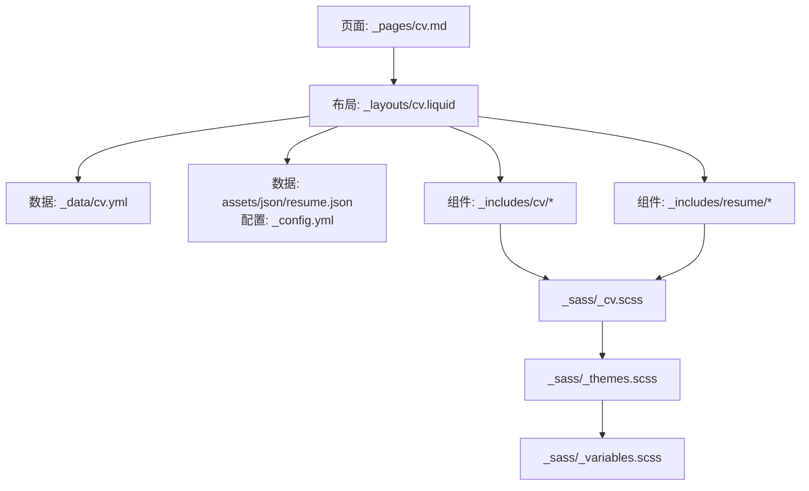
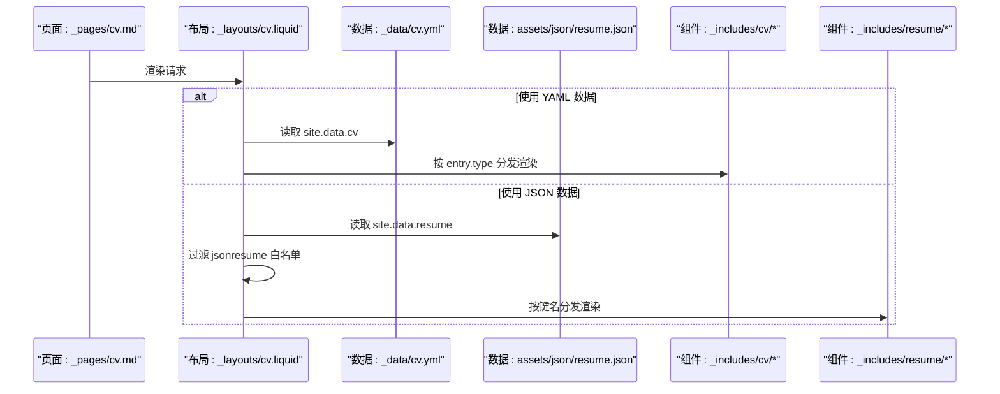
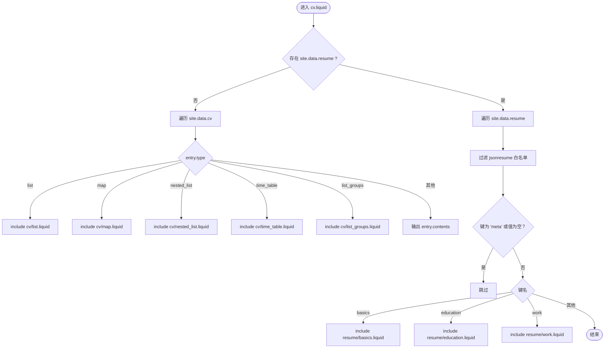
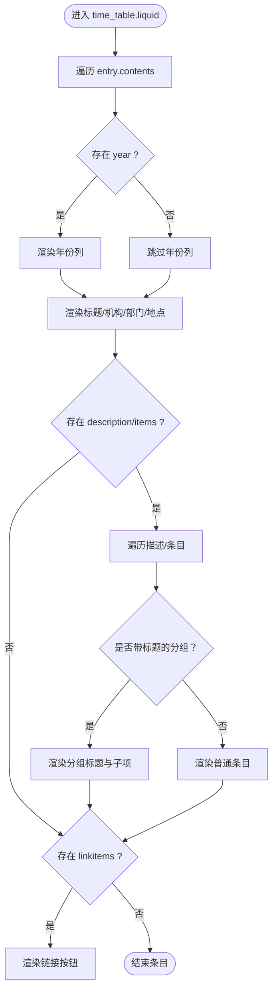
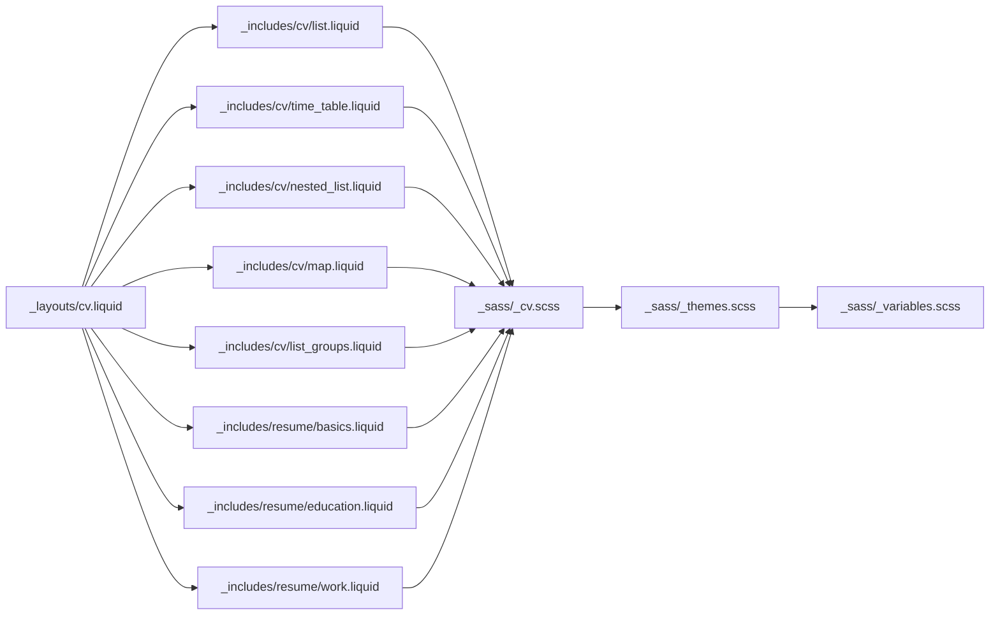

# 简历模板渲染机制

<cite>
**本文档引用的文件**
- [_layouts/cv.liquid](file://_layouts/cv.liquid)
- [_data/cv.yml](file://_data/cv.yml)
- [_includes/cv/list.liquid](file://_includes/cv/list.liquid)
- [_includes/cv/time_table.liquid](file://_includes/cv/time_table.liquid)
- [_includes/cv/nested_list.liquid](file://_includes/cv/nested_list.liquid)
- [_includes/cv/map.liquid](file://_includes/cv/map.liquid)
- [_includes/cv/list_groups.liquid](file://_includes/cv/list_groups.liquid)
- [_includes/resume/basics.liquid](file://_includes/resume/basics.liquid)
- [_includes/resume/education.liquid](file://_includes/resume/education.liquid)
- [_includes/resume/work.liquid](file://_includes/resume/work.liquid)
- [_sass/_cv.scss](file://_sass/_cv.scss)
- [_sass/_themes.scss](file://_sass/_themes.scss)
- [_sass/_variables.scss](file://_sass/_variables.scss)
- [_pages/cv.md](file://_pages/cv.md)
- [_config.yml](file://_config.yml)
</cite>

## 目录
1. [简介](#简介)
2. [项目结构](#项目结构)
3. [核心组件](#核心组件)
4. [架构总览](#架构总览)
5. [详细组件分析](#详细组件分析)
6. [依赖关系分析](#依赖关系分析)
7. [性能考量](#性能考量)
8. [故障排除指南](#故障排除指南)
9. [结论](#结论)
10. [附录](#附录)

## 简介
本文件系统性阐述简历模板的渲染机制，重点解析 cv.liquid 布局如何通过数据驱动的方式组织与渲染各类 CV 组件，涵盖数据获取、模板继承、内容渲染、Liquid 语法应用、样式系统集成与主题定制、以及模板自定义与调试实践。读者无需深厚的前端背景即可理解并高效使用与扩展该简历体系。

## 项目结构
简历渲染涉及以下关键层次：
- 页面入口：_pages/cv.md 定义页面元信息与布局
- 布局层：_layouts/cv.liquid 负责整体骨架与组件调度
- 数据层：_data/cv.yml 提供传统 YAML 结构化数据；_config.yml 中的 jekyll_get_json 与 jsonresume 配置支持外部 JSON 数据源
- 组件层：_includes/cv/* 与 _includes/resume/* 提供具体渲染片段
- 样式层：_sass/_cv.scss、_sass/_themes.scss、_sass/_variables.scss 提供 CV 共享样式、主题变量与响应式设计

图表来源
- [_pages/cv.md:1-12](file://_pages/cv.md#L1-L12)
- [_layouts/cv.liquid:1-128](file://_layouts/cv.liquid#L1-L128)
- [_data/cv.yml:1-98](file://_data/cv.yml#L1-L98)
- [_config.yml:629-646](file://_config.yml#L629-L646)
- [_sass/_cv.scss:1-221](file://_sass/_cv.scss#L1-L221)
- [_sass/_themes.scss:1-162](file://_sass/_themes.scss#L1-L162)
- [_sass/_variables.scss:1-53](file://_sass/_variables.scss#L1-L53)

章节来源
- [_pages/cv.md:1-12](file://_pages/cv.md#L1-L12)
- [_layouts/cv.liquid:1-128](file://_layouts/cv.liquid#L1-L128)
- [_data/cv.yml:1-98](file://_data/cv.yml#L1-L98)
- [_config.yml:629-646](file://_config.yml#L629-L646)

## 核心组件
- 布局与调度：cv.liquid 作为简历主布局，负责根据是否存在 site.data.resume 决定采用 YAML 数据流还是 JSON 数据流进行渲染；同时通过类型分发选择对应组件 include。
- 数据源：YAML 数据来自 _data/cv.yml；JSON 数据来自 assets/json/resume.json，并由 _config.yml 的 jekyll_get_json 与 jsonresume 控制可见字段。
- 组件集合：list、time_table、nested_list、map、list_groups 等组件分别处理不同结构的数据并输出一致的卡片式 UI。
- 样式系统：_sass/_cv.scss 提供 CV 专用样式，_sass/_themes.scss 与 _sass/_variables.scss 提供主题变量与深浅色切换。

章节来源
- [_layouts/cv.liquid:1-128](file://_layouts/cv.liquid#L1-L128)
- [_data/cv.yml:1-98](file://_data/cv.yml#L1-L98)
- [_config.yml:629-646](file://_config.yml#L629-L646)
- [_sass/_cv.scss:1-221](file://_sass/_cv.scss#L1-L221)
- [_sass/_themes.scss:1-162](file://_sass/_themes.scss#L1-L162)
- [_sass/_variables.scss:1-53](file://_sass/_variables.scss#L1-L53)

## 架构总览
cv.liquid 的渲染流程分为两条路径：
- YAML 路径：遍历 site.data.cv，按 entry.type 分派到 cv/* 组件进行渲染
- JSON 路径：遍历 site.data.resume，按数据键名分派到 resume/* 组件进行渲染，并受 jsonresume 白名单限制

图表来源
- [_layouts/cv.liquid:1-128](file://_layouts/cv.liquid#L1-L128)
- [_data/cv.yml:1-98](file://_data/cv.yml#L1-L98)
- [_config.yml:629-646](file://_config.yml#L629-L646)

## 详细组件分析

### 布局与数据流：cv.liquid
- 模板继承：通过 front matter 指定 layout: default，确保通用头部、脚注等基础结构可用
- 条件分支：基于是否存在 site.data.resume 切换渲染路径
- 类型分发：entry.type 为 list、map、nested_list、time_table、list_groups 时分别 include 对应组件；否则直接输出 entry.contents
- JSON 路径增强：对 resume/* 组件渲染前进行 jsonresume 白名单校验与空值跳过

图表来源
- [_layouts/cv.liquid:1-128](file://_layouts/cv.liquid#L1-L128)

章节来源
- [_layouts/cv.liquid:1-128](file://_layouts/cv.liquid#L1-L128)

### 列表组件：list.liquid
- 功能：将 entry.contents 作为简单无序列表渲染
- 适用场景：纯文本列表项，如兴趣爱好、技能要点等
- 复杂度：O(n)，n 为列表项数量

章节来源
- [_includes/cv/list.liquid:1-6](file://_includes/cv/list.liquid#L1-L6)

### 时间表格组件：time_table.liquid
- 功能：以时间轴形式展示教育、工作、荣誉等条目，支持年份、地点、机构/部门、描述、子描述、链接等多维信息
- 特性：
  - 年份区域：居中徽章显示年份或时间段
  - 地点与机构：可选地点与机构/部门信息
  - 描述层级：支持 description 与 items 的嵌套结构，以及带标题的分组项
  - 链接按钮：linkitems 支持外链按钮
- 复杂度：O(n+m)，n 为条目数，m 为描述/子描述总数

图表来源
- [_includes/cv/time_table.liquid:1-119](file://_includes/cv/time_table.liquid#L1-L119)

章节来源
- [_includes/cv/time_table.liquid:1-119](file://_includes/cv/time_table.liquid#L1-L119)

### 嵌套列表组件：nested_list.liquid
- 功能：渲染带标题的分组列表，每组内含若干子项
- 适用场景：学术兴趣、技术栈分类、项目类别等
- 复杂度：O(n+m)，n 为分组数，m 为所有子项总数

章节来源
- [_includes/cv/nested_list.liquid:1-17](file://_includes/cv/nested_list.liquid#L1-L17)

### 映射组件：map.liquid
- 功能：将键值对形式的信息渲染为紧凑表格，支持附加链接按钮
- 适用场景：基本信息（姓名、邮箱、电话、网站等）
- 复杂度：O(n)，n 为映射项数

章节来源
- [_includes/cv/map.liquid:1-30](file://_includes/cv/map.liquid#L1-L30)

### 列表分组组件：list_groups.liquid
- 功能：将同类条目按类别分组，使用表格展示名称、等级、学校、时间与链接
- 适用场景：证书、语言能力、技能等级等
- 复杂度：O(n+m)，n 为类别数，m 为每个类别下的条目数

章节来源
- [_includes/cv/list_groups.liquid:1-52](file://_includes/cv/list_groups.liquid#L1-L52)

### JSON 数据组件：basics.liquid、education.liquid、work.liquid
- basics.liquid：过滤特定字段后渲染基本信息键值对，自动识别 url/email/phone 并生成相应链接
- education.liquid：按开始日期排序并倒序展示教育经历，支持课程列表
- work.liquid：按开始日期排序并倒序展示工作经历，支持高亮描述
- 复杂度：O(n log n)（排序主导），n 为条目数

章节来源
- [_includes/resume/basics.liquid:1-29](file://_includes/resume/basics.liquid#L1-L29)
- [_includes/resume/education.liquid:1-55](file://_includes/resume/education.liquid#L1-L55)
- [_includes/resume/work.liquid:1-53](file://_includes/resume/work.liquid#L1-L53)

## 依赖关系分析
- 数据依赖：cv.liquid 同时依赖 YAML 与 JSON 两种数据源，但同一站点通常只启用其一
- 组件耦合：各 cv/* 组件与 resume/* 组件相对独立，通过布局层统一调度
- 样式依赖：_sass/_cv.scss 为 CV 组件提供共享样式，_sass/_themes.scss 与 _sass/_variables.scss 提供主题变量与深浅色切换

图表来源
- [_layouts/cv.liquid:1-128](file://_layouts/cv.liquid#L1-L128)
- [_sass/_cv.scss:1-221](file://_sass/_cv.scss#L1-L221)
- [_sass/_themes.scss:1-162](file://_sass/_themes.scss#L1-L162)
- [_sass/_variables.scss:1-53](file://_sass/_variables.scss#L1-L53)

章节来源
- [_layouts/cv.liquid:1-128](file://_layouts/cv.liquid#L1-L128)
- [_sass/_cv.scss:1-221](file://_sass/_cv.scss#L1-L221)
- [_sass/_themes.scss:1-162](file://_sass/_themes.scss#L1-L162)
- [_sass/_variables.scss:1-53](file://_sass/_variables.scss#L1-L53)

## 性能考量
- 数据规模：YAML 与 JSON 数据体量较大时，建议在 _config.yml 中仅开启必要的 jsonresume 字段，减少渲染开销
- 排序成本：education.liquid 与 work.liquid 对条目执行排序，条目数较多时注意内存与时间复杂度
- 样式体积：_sass/_cv.scss 包含大量类选择器，建议结合构建工具压缩与按需加载
- 渲染路径：优先使用 YAML 路径以避免 JSON 解析与白名单过滤的额外开销

## 故障排除指南
- PDF 下载按钮不显示
  - 检查 _pages/cv.md 中 cv_pdf 是否设置，以及链接格式是否正确
  - 参考路径：[_pages/cv.md:7-8](file://_pages/cv.md#L7-L8)
- 组件未渲染或空白
  - YAML 路径：确认 _data/cv.yml 中 entry.type 与 include 文件名一致
  - JSON 路径：确认 assets/json/resume.json 键名与 _config.yml 的 jsonresume 白名单匹配
  - 参考路径：[_layouts/cv.liquid:36-48](file://_layouts/cv.liquid#L36-L48)、[_layouts/cv.liquid:93-120](file://_layouts/cv.liquid#L93-L120)
- 样式异常或主题不生效
  - 检查 _sass/_themes.scss 与 _sass/_variables.scss 是否被正确编译
  - 确认深浅色切换开关与主题变量未被覆盖
  - 参考路径：[_sass/_themes.scss:1-162](file://_sass/_themes.scss#L1-L162)、[_sass/_variables.scss:1-53](file://_sass/_variables.scss#L1-L53)
- 时间表格显示错位
  - 检查 entry.contents 结构是否符合 time_table.liquid 的预期字段（year、title、institution、description、items、linkitems 等）
  - 参考路径：[_includes/cv/time_table.liquid:1-119](file://_includes/cv/time_table.liquid#L1-L119)

章节来源
- [_pages/cv.md:1-12](file://_pages/cv.md#L1-L12)
- [_layouts/cv.liquid:1-128](file://_layouts/cv.liquid#L1-L128)
- [_sass/_themes.scss:1-162](file://_sass/_themes.scss#L1-L162)
- [_sass/_variables.scss:1-53](file://_sass/_variables.scss#L1-L53)
- [_includes/cv/time_table.liquid:1-119](file://_includes/cv/time_table.liquid#L1-L119)

## 结论
该简历模板通过 cv.liquid 实现了“数据驱动 + 组件化”的清晰架构：YAML 与 JSON 双通道数据源、统一的布局调度与丰富的 CV 组件，配合 SCSS 主题系统，既保证了易用性，又提供了良好的扩展空间。遵循本文档的自定义与调试建议，可在不破坏整体风格的前提下快速迭代简历内容与样式。

## 附录

### Liquid 模板语法在简历渲染中的应用
- 变量访问：page.title、site.data.cv、site.data.resume、entry.*、data[0]/data[1] 等
- 循环控制：for...endfor 遍历列表与字典项
- 条件判断：unless、elsif、else、case/when、contains、empty 判断
- 过滤器使用：prepend、relative_url、capitalize、sort、reverse、split、slice、join、default 等
- include 机制：按类型或键名动态引入组件文件

参考路径
- [_layouts/cv.liquid:1-128](file://_layouts/cv.liquid#L1-L128)
- [_includes/cv/time_table.liquid:1-119](file://_includes/cv/time_table.liquid#L1-L119)
- [_includes/resume/education.liquid:1-55](file://_includes/resume/education.liquid#L1-L55)
- [_includes/resume/work.liquid:1-53](file://_includes/resume/work.liquid#L1-L53)

### 样式系统与主题定制
- SCSS 变量：颜色、字体、间距等基础变量集中于 _sass/_variables.scss
- 主题变量：_sass/_themes.scss 通过 CSS 自定义属性实现深浅色切换
- CV 专用样式：_sass/_cv.scss 提供卡片、时间轴、链接按钮、列表分组等组件样式
- 响应式设计：组件普遍采用 Bootstrap 列布局与媒体查询适配移动端

参考路径
- [_sass/_variables.scss:1-53](file://_sass/_variables.scss#L1-L53)
- [_sass/_themes.scss:1-162](file://_sass/_themes.scss#L1-L162)
- [_sass/_cv.scss:1-221](file://_sass/_cv.scss#L1-L221)

### 模板自定义指南
- 样式覆盖
  - 在主题样式之后追加自定义 SCSS，或通过 _sass/_custom.scss（如存在）进行覆盖
  - 修改主题变量以统一调整色调与配色
- 组件扩展
  - 新增组件：在 _includes/cv/ 或 _includes/resume/ 下新增 .liquid 文件，并在 cv.liquid 中添加对应的类型或键名分发
  - 扩展字段：在数据源中补充对应字段，确保组件渲染逻辑兼容
- 主题定制
  - 通过 _sass/_themes.scss 的 CSS 自定义属性覆盖默认主题色
  - 使用 _sass/_variables.scss 调整全局颜色与间距

参考路径
- [_layouts/cv.liquid:1-128](file://_layouts/cv.liquid#L1-L128)
- [_sass/_themes.scss:1-162](file://_sass/_themes.scss#L1-L162)
- [_sass/_variables.scss:1-53](file://_sass/_variables.scss#L1-L53)

### 实际模板示例与调试技巧
- 示例数据结构参考
  - YAML 示例：[_data/cv.yml:1-98](file://_data/cv.yml#L1-L98)
  - JSON 示例：assets/json/resume.json（由 _config.yml 配置加载）
- 调试技巧
  - 使用 Liquid 的注释与临时输出定位数据结构问题
  - 在 cv.liquid 中临时输出 data[0]/data[1] 以检查 JSON 键值
  - 逐步注释 include 语句，缩小问题范围
  - 检查浏览器开发者工具中的网络面板，确认 JSON 文件加载成功

参考路径
- [_data/cv.yml:1-98](file://_data/cv.yml#L1-L98)
- [_config.yml:629-646](file://_config.yml#L629-L646)