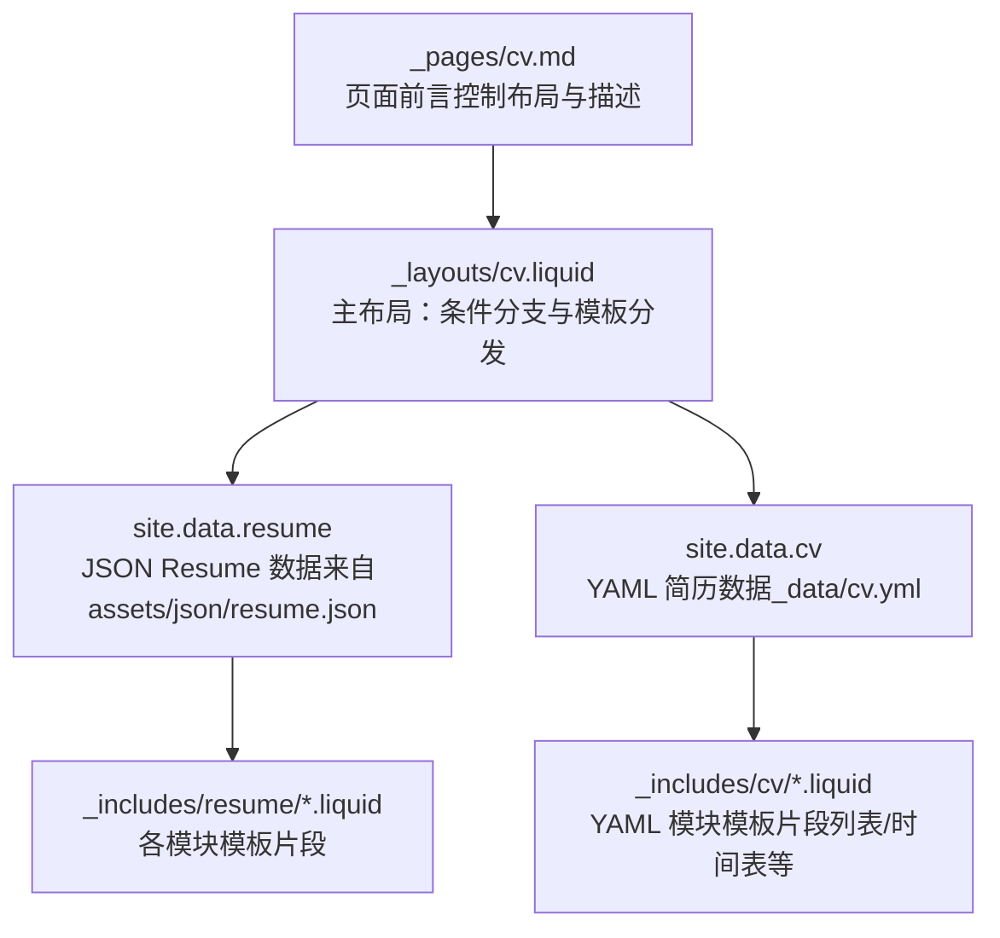
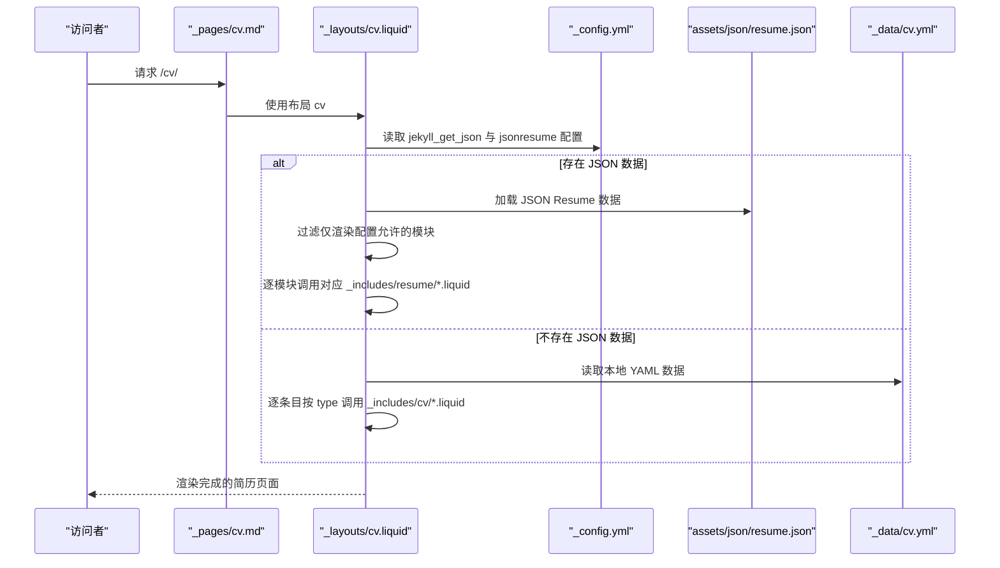
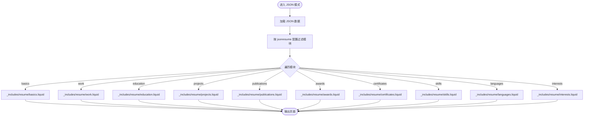
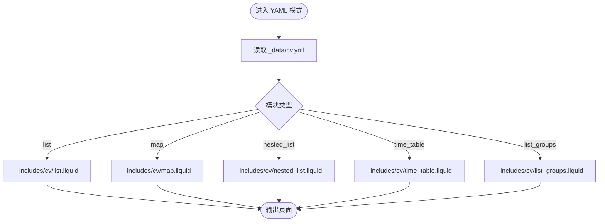
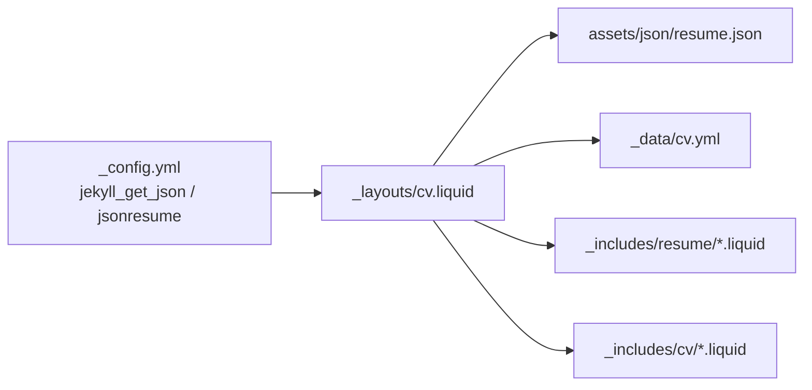

# 简历生成功能

<cite>
**本文引用的文件**
- [_config.yml](file://_config.yml)
- [_layouts/cv.liquid](file://_layouts/cv.liquid)
- [_pages/cv.md](file://_pages/cv.md)
- [_data/cv.yml](file://_data/cv.yml)
- [assets/json/resume.json](file://assets/json/resume.json)
- [_includes/resume/basics.liquid](file://_includes/resume/basics.liquid)
- [_includes/resume/work.liquid](file://_includes/resume/work.liquid)
- [_includes/resume/education.liquid](file://_includes/resume/education.liquid)
- [_includes/resume/projects.liquid](file://_includes/resume/projects.liquid)
- [_includes/resume/publications.liquid](file://_includes/resume/publications.liquid)
- [_includes/resume/awards.liquid](file://_includes/resume/awards.liquid)
- [_includes/resume/certificates.liquid](file://_includes/resume/certificates.liquid)
- [_includes/resume/skills.liquid](file://_includes/resume/skills.liquid)
- [_includes/resume/languages.liquid](file://_includes/resume/languages.liquid)
- [_includes/resume/interests.liquid](file://_includes/resume/interests.liquid)
</cite>

## 目录
1. [简介](#简介)
2. [项目结构](#项目结构)
3. [核心组件](#核心组件)
4. [架构总览](#架构总览)
5. [详细组件分析](#详细组件分析)
6. [依赖关系分析](#依赖关系分析)
7. [性能考虑](#性能考虑)
8. [故障排查指南](#故障排查指南)
9. [结论](#结论)
10. [附录](#附录)

## 简介
本文件系统性阐述该 Jekyll 站点中的“简历生成功能”，覆盖以下要点：
- JSON Resume 格式的数据结构与模板渲染流程
- YAML 格式的简历配置（cv.yml）及其模块化组织方式
- 两种模式的切换与转换机制（基于站点配置与数据源）
- 数据格式校验、样式定制、多语言支持建议
- 简历模板的自定义选项、打印优化与响应式设计实现细节
- 提供完整数据示例与配置案例路径，帮助快速生成专业化在线简历

## 项目结构
简历功能由页面布局、数据源与模板片段三部分协同完成：
- 页面入口：通过页面前言控制布局与导航行为
- 数据源：支持 JSON Resume（外部 JSON 文件）与 YAML（本地数据文件）两种
- 模板渲染：根据数据键名动态选择对应 Liquid 模板片段进行渲染

图表来源
- [_pages/cv.md:1-12](file://_pages/cv.md#L1-L12)
- [_layouts/cv.liquid:1-128](file://_layouts/cv.liquid#L1-L128)
- [_config.yml:629-646](file://_config.yml#L629-L646)
- [assets/json/resume.json:1-201](file://assets/json/resume.json#L1-L201)
- [_data/cv.yml:1-98](file://_data/cv.yml#L1-L98)

章节来源
- [_pages/cv.md:1-12](file://_pages/cv.md#L1-L12)
- [_layouts/cv.liquid:1-128](file://_layouts/cv.liquid#L1-L128)
- [_config.yml:629-646](file://_config.yml#L629-L646)

## 核心组件
- 页面入口与控制
  - 页面前言设置布局为 cv，并可选添加 PDF 下载链接与侧边目录
- 主布局逻辑
  - 当存在 JSON Resume 数据时优先走 JSON 模式；否则回退到 YAML 模式
  - JSON 模式下按配置限定渲染的模块集合
- 数据源
  - JSON Resume：通过插件加载外部 JSON 文件
  - YAML：本地数据文件，用于传统 CV 组织方式
- 模板片段
  - JSON 模式：按模块键名映射到对应 Liquid 片段
  - YAML 模式：按模块类型映射到对应 Liquid 片段

章节来源
- [_pages/cv.md:1-12](file://_pages/cv.md#L1-L12)
- [_layouts/cv.liquid:1-128](file://_layouts/cv.liquid#L1-L128)
- [_config.yml:629-646](file://_config.yml#L629-L646)
- [assets/json/resume.json:1-201](file://assets/json/resume.json#L1-L201)
- [_data/cv.yml:1-98](file://_data/cv.yml#L1-L98)

## 架构总览
简历渲染的整体流程如下：

图表来源
- [_pages/cv.md:1-12](file://_pages/cv.md#L1-L12)
- [_layouts/cv.liquid:1-128](file://_layouts/cv.liquid#L1-L128)
- [_config.yml:629-646](file://_config.yml#L629-L646)
- [assets/json/resume.json:1-201](file://assets/json/resume.json#L1-L201)
- [_data/cv.yml:1-98](file://_data/cv.yml#L1-L98)

## 详细组件分析

### JSON Resume 模式
- 数据结构与字段映射
  - 基础信息（basics）：姓名、标签、邮箱、电话、URL、摘要、位置、社交资料等
  - 工作经历（work）：公司、职位、起止日期、高亮条目等
  - 教育背景（education）：学校、地点、起止日期、课程列表等
  - 项目（projects）：项目名称、起止日期、高亮条目等
  - 出版物（publications）：名称、出版者、发布日期、摘要等
  - 奖项（awards）：奖项名称、颁发日期、颁发机构、摘要等
  - 证书（certificates）：证书名称、颁发日期、颁发机构、图标等
  - 技能（skills）：技能类别、等级、关键词等
  - 语言（languages）：语言名称、熟练度、图标等
  - 兴趣（interests）：兴趣类别、关键词等
  - 参考（references）：参考人、内容等
- 模板渲染
  - 主布局根据模块键名匹配到对应的 Liquid 片段进行渲染
  - 模板片段负责日期格式化、链接处理、列表/表格展示等
- 切换与过滤
  - 通过站点配置限定允许渲染的模块集合，确保只输出所需模块

图表来源
- [_layouts/cv.liquid:83-123](file://_layouts/cv.liquid#L83-L123)
- [_config.yml:633-645](file://_config.yml#L633-L645)
- [assets/json/resume.json:1-201](file://assets/json/resume.json#L1-L201)
- [_includes/resume/*.liquid:1-29](file://_includes/resume/basics.liquid#L1-L29)

章节来源
- [_layouts/cv.liquid:83-123](file://_layouts/cv.liquid#L83-L123)
- [_config.yml:633-645](file://_config.yml#L633-L645)
- [assets/json/resume.json:1-201](file://assets/json/resume.json#L1-L201)
- [_includes/resume/basics.liquid:1-29](file://_includes/resume/basics.liquid#L1-L29)
- [_includes/resume/work.liquid:1-53](file://_includes/resume/work.liquid#L1-L53)
- [_includes/resume/education.liquid:1-55](file://_includes/resume/education.liquid#L1-L55)
- [_includes/resume/projects.liquid:1-33](file://_includes/resume/projects.liquid#L1-L33)
- [_includes/resume/publications.liquid:1-29](file://_includes/resume/publications.liquid#L1-L29)
- [_includes/resume/awards.liquid:1-20](file://_includes/resume/awards.liquid#L1-L20)
- [_includes/resume/certificates.liquid:1-36](file://_includes/resume/certificates.liquid#L1-L36)
- [_includes/resume/skills.liquid:1-34](file://_includes/resume/skills.liquid#L1-L34)
- [_includes/resume/languages.liquid:1-32](file://_includes/resume/languages.liquid#L1-L32)
- [_includes/resume/interests.liquid:1-34](file://_includes/resume/interests.liquid#L1-L34)

### YAML 模式（传统 CV）
- 数据组织
  - 以数组形式组织多个模块，每个模块包含标题、类型与内容
  - 支持多种类型：列表、映射、嵌套列表、时间表、分组列表等
- 模板渲染
  - 主布局根据模块类型选择对应 Liquid 片段进行渲染
  - 适用于不使用 JSON Resume 的场景或迁移过渡期

图表来源
- [_layouts/cv.liquid:36-48](file://_layouts/cv.liquid#L36-L48)
- [_data/cv.yml:1-98](file://_data/cv.yml#L1-L98)

章节来源
- [_layouts/cv.liquid:36-48](file://_layouts/cv.liquid#L36-L48)
- [_data/cv.yml:1-98](file://_data/cv.yml#L1-L98)

### 模块模板片段（JSON 模式）
- 基础信息（basics）
  - 处理跳过字段、自动识别 URL/邮件/电话并生成可点击链接
- 工作经历（work）
  - 日期格式化（年/月）、高亮条目渲染、位置信息展示
- 教育背景（education）
  - 日期格式化、课程列表渲染、地点信息展示
- 项目（projects）
  - 日期格式化、高亮条目渲染
- 出版物（publications）
  - 发布日期格式化、出版者与摘要展示
- 奖项（awards）
  - 颁奖日期格式化、颁发机构与摘要展示
- 证书（certificates）
  - 日期排序、颁发机构与日期展示
- 技能（skills）
  - 技能分类与关键词网格展示
- 语言（languages）
  - 语言分类与熟练度展示
- 兴趣（interests）
  - 兴趣分类与关键词网格展示

章节来源
- [_includes/resume/basics.liquid:1-29](file://_includes/resume/basics.liquid#L1-L29)
- [_includes/resume/work.liquid:1-53](file://_includes/resume/work.liquid#L1-L53)
- [_includes/resume/education.liquid:1-55](file://_includes/resume/education.liquid#L1-L55)
- [_includes/resume/projects.liquid:1-33](file://_includes/resume/projects.liquid#L1-L33)
- [_includes/resume/publications.liquid:1-29](file://_includes/resume/publications.liquid#L1-L29)
- [_includes/resume/awards.liquid:1-20](file://_includes/resume/awards.liquid#L1-L20)
- [_includes/resume/certificates.liquid:1-36](file://_includes/resume/certificates.liquid#L1-L36)
- [_includes/resume/skills.liquid:1-34](file://_includes/resume/skills.liquid#L1-L34)
- [_includes/resume/languages.liquid:1-32](file://_includes/resume/languages.liquid#L1-L32)
- [_includes/resume/interests.liquid:1-34](file://_includes/resume/interests.liquid#L1-L34)

## 依赖关系分析
- 配置驱动
  - jekyll_get_json：指定 JSON 数据源路径
  - jsonresume：限定允许渲染的模块集合
- 数据源耦合
  - JSON 模式强依赖 assets/json/resume.json 的结构一致性
  - YAML 模式强依赖 _data/cv.yml 的模块类型与字段命名
- 模板耦合
  - 主布局与各模块模板之间通过键名/类型进行弱耦合映射
- 外部依赖
  - 插件：jekyll-get-json 用于加载外部 JSON
  - 样式：依赖主题样式类（如卡片、表格、徽章等）

图表来源
- [_config.yml:629-646](file://_config.yml#L629-L646)
- [_layouts/cv.liquid:1-128](file://_layouts/cv.liquid#L1-L128)
- [assets/json/resume.json:1-201](file://assets/json/resume.json#L1-L201)
- [_data/cv.yml:1-98](file://_data/cv.yml#L1-L98)

章节来源
- [_config.yml:629-646](file://_config.yml#L629-L646)
- [_layouts/cv.liquid:1-128](file://_layouts/cv.liquid#L1-L128)

## 性能考虑
- 数据加载
  - JSON 数据通过插件一次性加载，避免重复请求
- 渲染优化
  - 模块级模板独立，便于缓存与增量更新
  - 列表排序（如按日期倒序）在模板中完成，减少前端 JS 依赖
- 样式与资源
  - 使用主题提供的卡片与表格样式，减少自定义样式开销
  - 响应式设计通过 Bootstrap 类实现，适配多端显示

## 故障排查指南
- JSON 数据未生效
  - 检查 jekyll_get_json 是否正确指向 JSON 文件路径
  - 确认 JSON 结构与模块键名一致
- 模块未显示
  - 检查 jsonresume 配置是否包含该模块键名
  - 确认数据中对应模块非空
- 链接无法打开
  - 确认 URL 字段以协议开头（如 https://）
  - 检查模板中对 URL/email/phone 的自动链接处理
- 日期显示异常
  - 确认日期字段格式符合预期（如 YYYY-MM-DD）
  - 检查模板中的日期切片与拼接逻辑
- 打印问题
  - 使用浏览器打印预览检查分页与断行
  - 如需优化，可在主题样式中增加打印媒体查询

章节来源
- [_config.yml:629-646](file://_config.yml#L629-L646)
- [_layouts/cv.liquid:83-123](file://_layouts/cv.liquid#L83-L123)
- [_includes/resume/work.liquid:7-14](file://_includes/resume/work.liquid#L7-L14)
- [_includes/resume/education.liquid:7-14](file://_includes/resume/education.liquid#L7-L14)
- [_includes/resume/publications.liquid:6-7](file://_includes/resume/publications.liquid#L6-L7)

## 结论
该简历生成功能通过“页面前言 + 主布局 + 数据源 + 模块模板”的解耦设计，实现了对 JSON Resume 与 YAML 两种数据格式的统一渲染。借助站点配置可灵活控制模块范围与渲染行为，配合主题样式与响应式布局，能够快速产出专业化的在线简历页面。

## 附录

### JSON Resume 数据结构与字段映射速查
- basics：基础信息（姓名、标签、邮箱、电话、URL、摘要、位置、社交资料）
- work：工作经历（公司、职位、起止日期、高亮条目）
- education：教育背景（学校、地点、起止日期、课程列表）
- projects：项目（名称、起止日期、高亮条目）
- publications：出版物（名称、出版者、发布日期、摘要）
- awards：奖项（名称、颁发日期、颁发机构、摘要）
- certificates：证书（名称、颁发日期、颁发机构、图标）
- skills：技能（类别、等级、关键词）
- languages：语言（语言、熟练度、图标）
- interests：兴趣（类别、关键词）
- references：参考（姓名、内容）

章节来源
- [assets/json/resume.json:1-201](file://assets/json/resume.json#L1-L201)
- [_includes/resume/*.liquid:1-29](file://_includes/resume/basics.liquid#L1-L29)

### YAML 简历配置示例路径
- 模块组织与类型：[_data/cv.yml:1-98](file://_data/cv.yml#L1-L98)
- 页面入口与描述：[_pages/cv.md:1-12](file://_pages/cv.md#L1-L12)

章节来源
- [_data/cv.yml:1-98](file://_data/cv.yml#L1-L98)
- [_pages/cv.md:1-12](file://_pages/cv.md#L1-L12)

### 模式切换与转换方法
- 启用 JSON 模式
  - 在页面前言中使用 cv 布局（已默认）
  - 确保 assets/json/resume.json 存在且结构正确
  - 在站点配置中启用 jekyll_get_json 并指向 JSON 文件
- 降级到 YAML 模式
  - 删除或移除 JSON 数据源
  - 使用 _data/cv.yml 组织模块
- 模块范围控制
  - 通过 jsonresume 配置限定渲染模块集合

章节来源
- [_pages/cv.md:1-12](file://_pages/cv.md#L1-L12)
- [_config.yml:629-646](file://_config.yml#L629-L646)
- [_layouts/cv.liquid:83-123](file://_layouts/cv.liquid#L83-L123)

### 数据格式验证与样式定制
- 数据格式验证
  - 使用 JSON Schema 对 JSON Resume 数据进行校验（建议在构建前执行）
  - 校验字段完整性与类型一致性
- 样式定制
  - 通过主题样式类（卡片、表格、徽章）进行统一风格
  - 自定义 CSS 时注意与现有类名不冲突
- 多语言支持
  - 在站点配置中设置语言（lang），并在模板中按需处理文本方向与日期格式
  - 对于多语言简历，建议在 JSON Resume 中为关键字段提供多语言版本

章节来源
- [_config.yml:20-21](file://_config.yml#L20-L21)
- [_includes/resume/*.liquid:1-29](file://_includes/resume/basics.liquid#L1-L29)

### 打印优化与响应式设计
- 打印优化
  - 使用浏览器打印预览检查布局与分页
  - 在主题样式中增加打印媒体查询，隐藏不必要的元素
- 响应式设计
  - 模板广泛使用 Bootstrap 列与卡片类，自动适配移动端
  - 表格与列表在小屏设备上保持可读性

章节来源
- [_includes/resume/work.liquid:1-53](file://_includes/resume/work.liquid#L1-L53)
- [_includes/resume/education.liquid:1-55](file://_includes/resume/education.liquid#L1-L55)