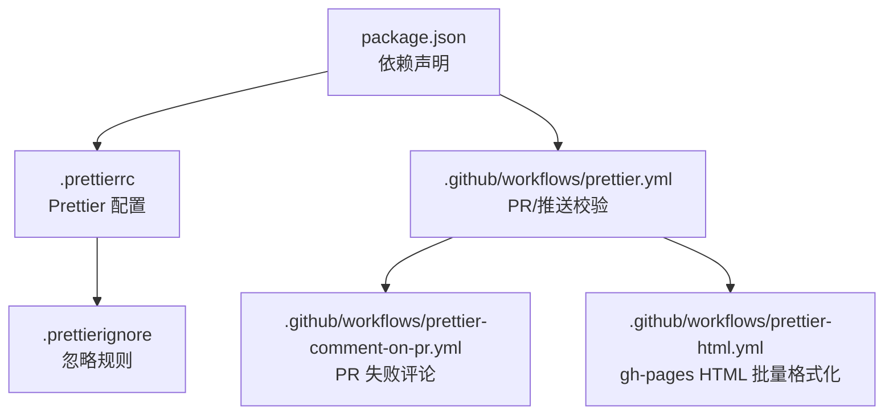
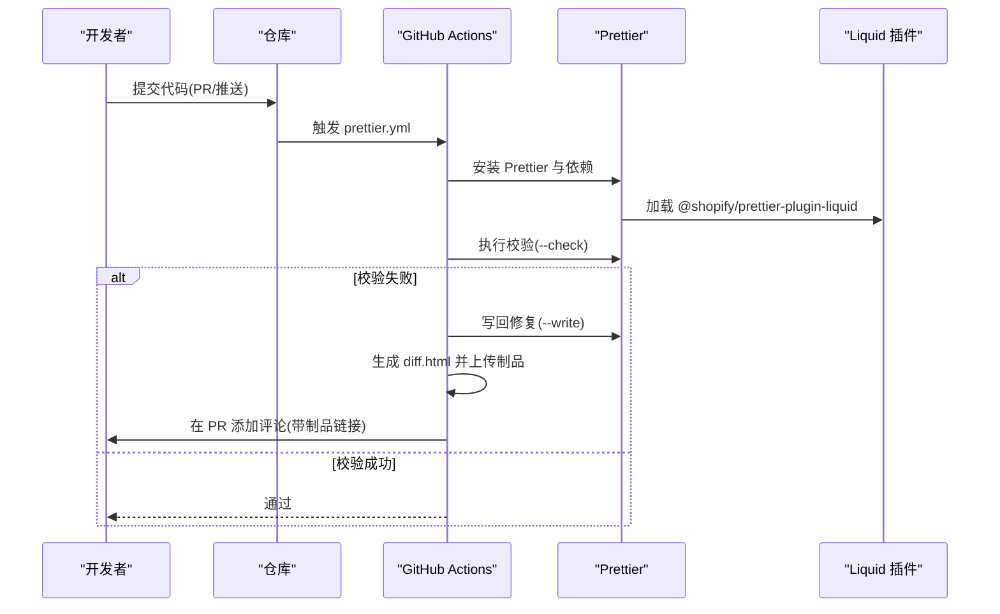
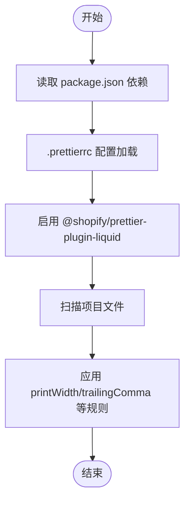
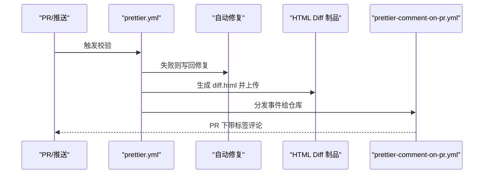
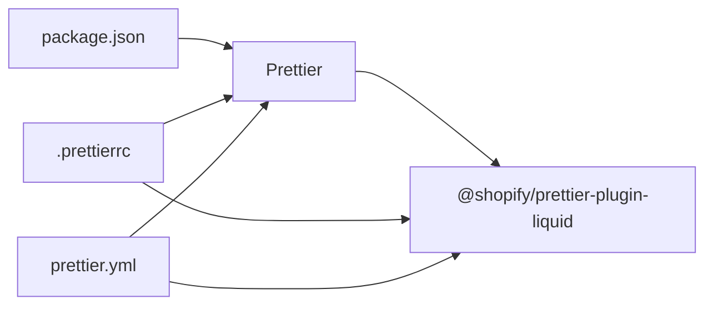

# 代码格式化工具

<cite>
**本文引用的文件**
- [package.json](file://package.json)
- [.prettierrc](file://.prettierrc)
- [.prettierignore](file://.prettierignore)
- [README.md](file://README.md)
- [CONTRIBUTING.md](file://CONTRIBUTING.md)
- [.github/workflows/prettier.yml](file://.github/workflows/prettier.yml)
- [.github/workflows/prettier-comment-on-pr.yml](file://.github/workflows/prettier-comment-on-pr.yml)
- [.github/workflows/prettier-html.yml](file://.github/workflows/prettier-html.yml)
</cite>

## 目录
1. [简介](#简介)
2. [项目结构](#项目结构)
3. [核心组件](#核心组件)
4. [架构总览](#架构总览)
5. [详细组件分析](#详细组件分析)
6. [依赖关系分析](#依赖关系分析)
7. [性能考虑](#性能考虑)
8. [故障排除指南](#故障排除指南)
9. [结论](#结论)
10. [附录](#附录)

## 简介
本文件面向在 Jekyll 项目中使用 Prettier 进行代码格式化的团队与个人开发者，系统性介绍如何在本仓库中安装、配置与使用 Prettier，并结合 Liquid 模板语言进行统一格式化。文档覆盖以下要点：
- 在 package.json 中安装 Prettier 与 Shopify 的 Liquid 插件
- 在 .prettierrc 中配置插件与代码风格参数
- 使用 .prettierignore 忽略不需要格式化的文件或目录
- 在本地与 CI（GitHub Actions）中运行 Prettier 校验与自动修复
- 在开发流程中的集成方式与团队协作建议

## 项目结构
围绕代码格式化与 Liquid 支持的关键文件分布如下：
- 依赖声明：package.json
- Prettier 配置：.prettierrc
- 忽略规则：.prettierignore
- CI 工作流：.github/workflows/prettier*.yml
- 文档与贡献说明：README.md、CONTRIBUTING.md

图表来源
- [package.json](file://package.json)
- [.prettierrc](file://.prettierrc)
- [.prettierignore](file://.prettierignore)
- [.github/workflows/prettier.yml](file://.github/workflows/prettier.yml)
- [.github/workflows/prettier-comment-on-pr.yml](file://.github/workflows/prettier-comment-on-pr.yml)
- [.github/workflows/prettier-html.yml](file://.github/workflows/prettier-html.yml)

章节来源
- [package.json](file://package.json)
- [.prettierrc](file://.prettierrc)
- [.prettierignore](file://.prettierignore)
- [.github/workflows/prettier.yml](file://.github/workflows/prettier.yml)
- [.github/workflows/prettier-comment-on-pr.yml](file://.github/workflows/prettier-comment-on-pr.yml)
- [.github/workflows/prettier-html.yml](file://.github/workflows/prettier-html.yml)

## 核心组件
- Prettier 与 Liquid 插件
  - 通过 package.json 安装 prettier 与 @shopify/prettier-plugin-liquid，使 Prettier 能识别并格式化 Liquid 模板文件（.liquid）。
- Prettier 配置
  - .prettierrc 中启用 Liquid 插件，并设置 printWidth、trailingComma 等风格参数。
- 忽略规则
  - .prettierignore 用于排除不需要格式化的文件或目录，避免误伤生成产物或第三方资源。
- CI 工作流
  - prettier.yml：在 PR 与推送时执行校验；失败时生成 HTML diff 并上传为制品，同时在 PR 上添加评论。
  - prettier-comment-on-pr.yml：接收仓库分发事件，在 PR 上带标签评论提示。
  - prettier-html.yml：手动触发对 gh-pages 分支 HTML 文件进行批量格式化。

章节来源
- [package.json](file://package.json)
- [.prettierrc](file://.prettierrc)
- [.prettierignore](file://.prettierignore)
- [.github/workflows/prettier.yml](file://.github/workflows/prettier.yml)
- [.github/workflows/prettier-comment-on-pr.yml](file://.github/workflows/prettier-comment-on-pr.yml)
- [.github/workflows/prettier-html.yml](file://.github/workflows/prettier-html.yml)

## 架构总览
下图展示 Prettier 在本地与 CI 的整体工作流，以及与 Liquid 插件的交互：

图表来源
- [.github/workflows/prettier.yml](file://.github/workflows/prettier.yml)
- [.github/workflows/prettier-comment-on-pr.yml](file://.github/workflows/prettier-comment-on-pr.yml)

## 详细组件分析

### 组件一：Prettier 与 Liquid 插件配置
- 依赖安装
  - 在 package.json 中声明 devDependencies，包含 prettier 与 @shopify/prettier-plugin-liquid。
- 插件启用
  - 在 .prettierrc 中通过 plugins 字段启用 Liquid 插件，使 Prettier 能处理 .liquid 文件。
- 风格参数
  - printWidth 控制行长；trailingComma 控制尾随逗号策略；可按需扩展其他参数。

图表来源
- [package.json](file://package.json)
- [.prettierrc](file://.prettierrc)

章节来源
- [package.json](file://package.json)
- [.prettierrc](file://.prettierrc)

### 组件二：忽略规则与范围控制
- .prettierignore 的作用
  - 通过该文件指定需要跳过的文件或目录，避免对生成产物、锁定文件、第三方资源等进行格式化。
- 建议忽略项
  - 生成目录（如 _site）、包管理锁定文件、大型二进制文件、第三方库等。

章节来源
- [.prettierignore](file://.prettierignore)

### 组件三：本地格式化与命令行使用
- 常用命令
  - 校验当前目录所有文件是否符合格式规范
  - 对不合规文件执行自动修复
- 推荐实践
  - 在提交前先执行校验，确保本地一致；在 IDE 中配置保存时自动格式化，减少冲突。

章节来源
- [.github/workflows/prettier.yml](file://.github/workflows/prettier.yml)

### 组件四：CI 集成与自动化
- prettier.yml
  - 在 PR 与主分支推送时触发；安装依赖后执行校验；失败时写回修复并生成 HTML diff，上传为制品，必要时向 PR 发送评论。
- prettier-comment-on-pr.yml
  - 作为 prettier.yml 的补充，接收仓库分发事件并在 PR 下带标签评论，便于追踪。
- prettier-html.yml
  - 手动触发，针对 gh-pages 分支的 HTML 文件进行批量格式化，适合一次性整理已生成页面。

图表来源
- [.github/workflows/prettier.yml](file://.github/workflows/prettier.yml)
- [.github/workflows/prettier-comment-on-pr.yml](file://.github/workflows/prettier-comment-on-pr.yml)

章节来源
- [.github/workflows/prettier.yml](file://.github/workflows/prettier.yml)
- [.github/workflows/prettier-comment-on-pr.yml](file://.github/workflows/prettier-comment-on-pr.yml)
- [.github/workflows/prettier-html.yml](file://.github/workflows/prettier-html.yml)

### 组件五：与其他格式化工具的配合
- 本仓库文档明确指出使用 Prettier 进行代码质量检查，同时存在 lychee（链接检查）与 Axe（可访问性测试）等工具。
- 建议在本地与 CI 中保持多工具协同：Prettier 负责风格一致性，其他工具负责链接与可访问性等质量维度。

章节来源
- [README.md](file://README.md)

## 依赖关系分析
- 组件耦合
  - Prettier 与 Liquid 插件通过 .prettierrc 的 plugins 字段耦合；CI 通过安装脚本与工作流耦合。
- 外部依赖
  - Node.js 环境与 npm；GitHub Actions Runner。
- 可能的循环依赖
  - 本项目未见直接循环依赖；Liquid 插件仅作为 Prettier 的解析器扩展。

图表来源
- [package.json](file://package.json)
- [.prettierrc](file://.prettierrc)
- [.github/workflows/prettier.yml](file://.github/workflows/prettier.yml)

章节来源
- [package.json](file://package.json)
- [.prettierrc](file://.prettierrc)
- [.github/workflows/prettier.yml](file://.github/workflows/prettier.yml)

## 性能考虑
- 仅对必要文件集执行格式化，利用 .prettierignore 减少扫描开销。
- 在 CI 中优先使用缓存与最小化安装，避免重复下载依赖。
- 对大型 HTML 或生成产物采用批量处理策略（如 prettier-html.yml），减少频繁改动带来的 CI 压力。

## 故障排除指南
- 校验失败但本地正常
  - 确认本地与 CI 使用的 Node.js 与 Prettier 版本一致；清理缓存后重试安装。
- Liquid 文件未被识别
  - 检查 .prettierrc 是否正确启用插件；确认文件扩展名为 .liquid。
- PR 被评论提示格式问题
  - 查看上传的 HTML Diff 制品，定位具体差异并手动修复；随后重新推送。
- 生成产物被格式化导致构建异常
  - 将生成目录加入 .prettierignore，避免对 _site 等目录生效。

章节来源
- [.github/workflows/prettier.yml](file://.github/workflows/prettier.yml)
- [.github/workflows/prettier-comment-on-pr.yml](file://.github/workflows/prettier-comment-on-pr.yml)
- [.prettierignore](file://.prettierignore)

## 结论
本项目通过在 package.json 中引入 Prettier 与 Liquid 插件，并在 .prettierrc 中完成基础风格配置，结合 .prettierignore 实现精准控制，最终在 CI 中以 prettier.yml 为核心实现自动化校验与反馈。配合 README 与 CONTRIBUTING 的文档说明，团队可在本地与远程保持一致的格式化标准，提升协作效率与代码质量。

## 附录
- 团队协作建议
  - 在团队内统一 .prettierrc 参数，避免风格漂移；在 IDE 中启用保存即格式化，降低 PR 审阅负担。
  - 对于已生成的静态页面，定期使用 prettier-html.yml 进行批量格式化，保持一致性。
- 相关文档与参考
  - README 中关于代码质量检查的说明
  - CONTRIBUTING 中关于 Prettier 使用的约束与 PR 流程

章节来源
- [README.md](file://README.md)
- [CONTRIBUTING.md](file://CONTRIBUTING.md)