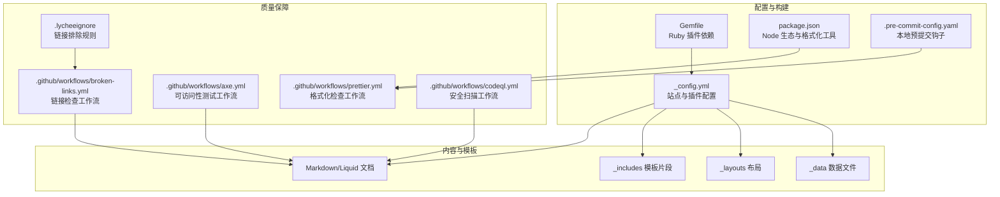
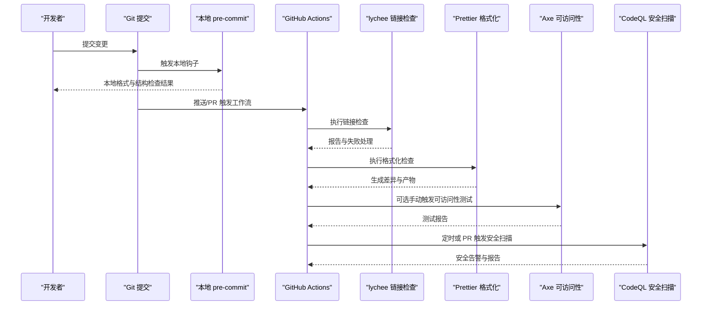
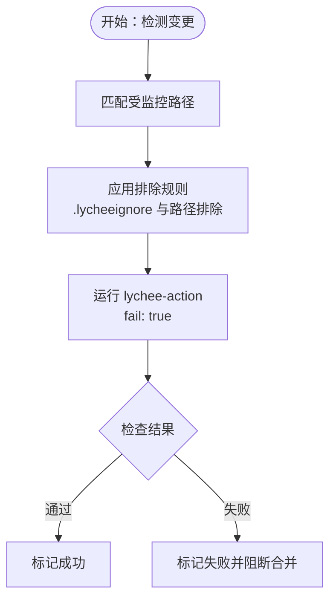
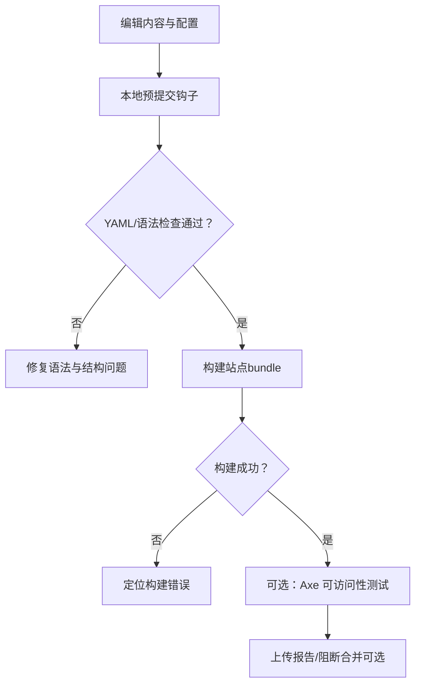
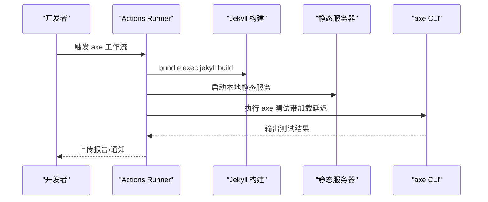
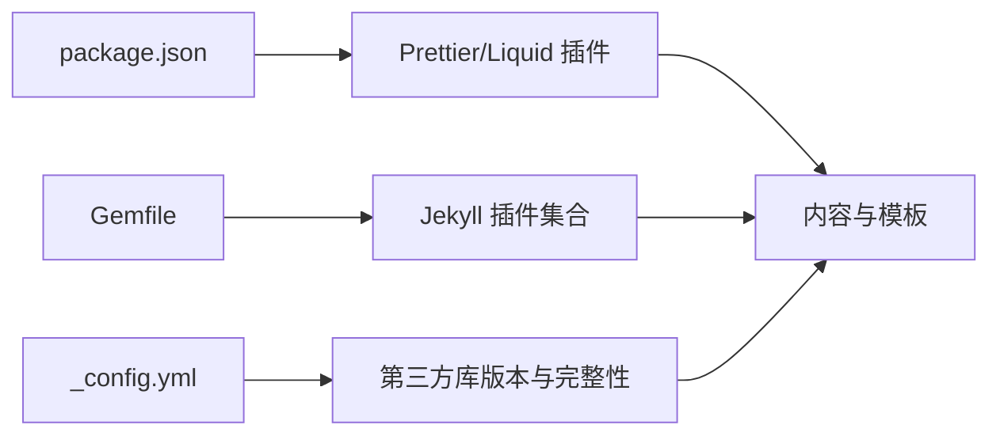

# 代码质量检查

<cite>
**本文引用的文件**
- [.lycheeignore](file://.lycheeignore)
- [_config.yml](file://_config.yml)
- [Gemfile](file://Gemfile)
- [package.json](file://package.json)
- [.pre-commit-config.yaml](file://.pre-commit-config.yaml)
- [.github/workflows/broken-links.yml](file://.github/workflows/broken-links.yml)
- [.github/workflows/axe.yml](file://.github/workflows/axe.yml)
- [.github/workflows/codeql.yml](file://.github/workflows/codeql.yml)
- [.github/workflows/prettier.yml](file://.github/workflows/prettier.yml)
- [README.md](file://README.md)
- [CONTRIBUTING.md](file://CONTRIBUTING.md)
- [.github/release.yml](file://.github/release.yml)
- [.github/stale.yml](file://.github/stale.yml)
</cite>

## 目录
1. [简介](#简介)
2. [项目结构](#项目结构)
3. [核心组件](#核心组件)
4. [架构总览](#架构总览)
5. [详细组件分析](#详细组件分析)
6. [依赖分析](#依赖分析)
7. [性能考虑](#性能考虑)
8. [故障排查指南](#故障排查指南)
9. [结论](#结论)
10. [附录](#附录)

## 简介
本文件系统化梳理本 Jekyll 项目的代码质量检查与保证流程，覆盖以下方面：
- lychee 链接检查工具的配置与使用，含 .lycheeignore 的规则与链接验证策略
- Jekyll 项目的质量检查流程（语法检查、配置验证、布局检查等）
- 第三方服务集成的质量保证（Google Analytics、社交媒体链接有效性）
- 可访问性测试（Axe）的基本方法与工作流集成
- 自动化质量检查工作流（GitHub Actions）的配置与最佳实践
- 常见问题诊断与修复建议，以及质量标准的制定与维护

## 项目结构
本项目采用 Jekyll 主题与多语言生态协作的方式组织内容与质量保障：
- 配置层：Jekyll 核心配置、插件清单、第三方库版本与完整性校验
- 内容层：Markdown/Liquid 页面、数据文件、集合与布局模板
- 质量层：本地预提交钩子、GitHub Actions 工作流（链接检查、格式化、可访问性、安全扫描）

图表来源
- [_config.yml:160-220](file://_config.yml#L160-L220)
- [Gemfile:1-39](file://Gemfile#L1-L39)
- [package.json:1-10](file://package.json#L1-L10)
- [.pre-commit-config.yaml:1-11](file://.pre-commit-config.yaml#L1-L11)
- [.lycheeignore:1-2](file://.lycheeignore#L1-L2)
- [.github/workflows/broken-links.yml:1-55](file://.github/workflows/broken-links.yml#L1-L55)
- [.github/workflows/axe.yml:1-75](file://.github/workflows/axe.yml#L1-L75)
- [.github/workflows/prettier.yml:1-49](file://.github/workflows/prettier.yml#L1-L49)
- [.github/workflows/codeql.yml:1-95](file://.github/workflows/codeql.yml#L1-L95)

章节来源
- [_config.yml:160-220](file://_config.yml#L160-L220)
- [Gemfile:1-39](file://Gemfile#L1-L39)
- [package.json:1-10](file://package.json#L1-L10)
- [.pre-commit-config.yaml:1-11](file://.pre-commit-config.yaml#L1-L11)
- [.lycheeignore:1-2](file://.lycheeignore#L1-L2)
- [.github/workflows/broken-links.yml:1-55](file://.github/workflows/broken-links.yml#L1-L55)
- [.github/workflows/axe.yml:1-75](file://.github/workflows/axe.yml#L1-L75)
- [.github/workflows/prettier.yml:1-49](file://.github/workflows/prettier.yml#L1-L49)
- [.github/workflows/codeql.yml:1-95](file://.github/workflows/codeql.yml#L1-L95)

## 核心组件
- 配置与插件管理
  - Jekyll 核心配置集中于站点信息、插件启用、压缩与最小化、第三方库版本与完整性校验等
  - Ruby 插件通过 Gemfile 管理，确保构建一致性
  - Node 生态用于格式化与前端资源，prettier 与 Liquid 插件在 package.json 中声明
- 本地质量门禁
  - pre-commit 钩子在提交前自动执行空白字符清理、文件结尾修正、YAML 校验与大文件检查
- 自动化质量检查
  - GitHub Actions 覆盖链接检查、格式化检查、可访问性测试与安全扫描

章节来源
- [_config.yml:160-220](file://_config.yml#L160-L220)
- [Gemfile:1-39](file://Gemfile#L1-L39)
- [package.json:1-10](file://package.json#L1-L10)
- [.pre-commit-config.yaml:1-11](file://.pre-commit-config.yaml#L1-L11)
- [.github/workflows/broken-links.yml:1-55](file://.github/workflows/broken-links.yml#L1-L55)
- [.github/workflows/prettier.yml:1-49](file://.github/workflows/prettier.yml#L1-L49)
- [.github/workflows/axe.yml:1-75](file://.github/workflows/axe.yml#L1-L75)
- [.github/workflows/codeql.yml:1-95](file://.github/workflows/codeql.yml#L1-L95)

## 架构总览
下图展示从内容变更到质量检查的端到端流程，包括本地与云端两条路径。

图表来源
- [.github/workflows/broken-links.yml:1-55](file://.github/workflows/broken-links.yml#L1-L55)
- [.github/workflows/prettier.yml:1-49](file://.github/workflows/prettier.yml#L1-L49)
- [.github/workflows/axe.yml:1-75](file://.github/workflows/axe.yml#L1-L75)
- [.github/workflows/codeql.yml:1-95](file://.github/workflows/codeql.yml#L1-L95)
- [.pre-commit-config.yaml:1-11](file://.pre-commit-config.yaml#L1-L11)

## 详细组件分析

### 组件一：Lychee 链接检查与 .lycheeignore 配置
- 功能概述
  - 使用 lychee-action 在 CI 中对 Markdown、HTML、JS、Liquid 与 YAML 等文件进行链接有效性检查
  - 通过 .lycheeignore 排除特定域名（如社交平台），避免误报
- 关键配置点
  - 排除路径与模式：针对包含 Liquid 模板标签的文档进行排除，减少误报
  - 失败即停止：fail: true 使链接错误直接导致工作流失败
  - 用户代理与进度控制：自定义 UA 与关闭进度输出以提升稳定性
- 运行范围
  - 仅在主分支推送与 PR，且限定在静态资源、页面与配置相关文件变更时触发

图表来源
- [.github/workflows/broken-links.yml:1-55](file://.github/workflows/broken-links.yml#L1-L55)
- [.lycheeignore:1-2](file://.lycheeignore#L1-L2)

章节来源
- [.github/workflows/broken-links.yml:1-55](file://.github/workflows/broken-links.yml#L1-L55)
- [.lycheeignore:1-2](file://.lycheeignore#L1-L2)

### 组件二：Jekyll 项目质量检查流程
- 语法与结构检查
  - YAML 校验：pre-commit 的 check-yaml 钩子确保配置文件语法正确
  - Liquid 语法：Prettier 的 Liquid 插件在格式化过程中发现模板语法问题
- 配置验证
  - _config.yml 中的插件启用、压缩与最小化参数、第三方库完整性校验，均在构建阶段被验证
  - 插件清单（Gemfile）与构建环境保持一致，避免“本地可用、CI 失败”的问题
- 布局与模板检查
  - 通过本地构建（bundle exec jekyll build）与 Axe 可访问性测试结合，验证页面渲染与可访问性

图表来源
- [.pre-commit-config.yaml:1-11](file://.pre-commit-config.yaml#L1-L11)
- [package.json:1-10](file://package.json#L1-L10)
- [.github/workflows/axe.yml:1-75](file://.github/workflows/axe.yml#L1-L75)

章节来源
- [.pre-commit-config.yaml:1-11](file://.pre-commit-config.yaml#L1-L11)
- [package.json:1-10](file://package.json#L1-L10)
- [_config.yml:200-245](file://_config.yml#L200-L245)
- [Gemfile:1-39](file://Gemfile#L1-L39)
- [.github/workflows/axe.yml:1-75](file://.github/workflows/axe.yml#L1-L75)

### 组件三：第三方服务集成的质量保证
- Google Analytics 与站点验证
  - 在 _config.yml 中配置 analytics ID 与验证 ID；通过构建后静态站点验证生效
  - 可结合 Axe 工作流中的本地服务器启动与加载延迟，验证 GA 初始化脚本是否正常加载
- 社交媒体链接有效性
  - 使用 .lycheeignore 对高误报率的社交平台进行排除
  - 对外部 RSS/博客源（如外部文章列表）进行定期链接检查，确保聚合内容可用

章节来源
- [_config.yml:74-86](file://_config.yml#L74-L86)
- [_config.yml:123-133](file://_config.yml#L123-L133)
- [.lycheeignore:1-2](file://.lycheeignore#L1-L2)
- [.github/workflows/broken-links.yml:1-55](file://.github/workflows/broken-links.yml#L1-L55)

### 组件四：可访问性测试（Axe）与集成
- 工作流概览
  - 支持手动触发（workflow_dispatch），可指定 URL 子路径
  - 本地构建站点后，使用 http-server 启动静态服务，再调用 axe CLI 进行测试
  - 自动安装 chromedriver 并按 Chromium 版本匹配，确保浏览器驱动兼容
- 最佳实践
  - 在 PR 或发布前手动触发，以便快速定位可访问性问题
  - 将测试报告作为工件保存，便于追溯与复现

图表来源
- [.github/workflows/axe.yml:1-75](file://.github/workflows/axe.yml#L1-L75)

章节来源
- [.github/workflows/axe.yml:1-75](file://.github/workflows/axe.yml#L1-L75)

### 组件五：自动化质量检查工作流配置
- Prettier 格式化检查
  - 在 PR 与推送时触发，检查整个仓库格式一致性
  - 若失败，自动生成差异文件并通过 Artifact 上传，便于审阅
- CodeQL 安全扫描
  - 支持 Ruby 与 JavaScript/TypeScript 语言矩阵，按需选择构建模式
  - 定时扫描与 PR 触发相结合，确保安全问题早发现
- 链接检查与可访问性
  - 链接检查仅在主分支与受控路径变更时触发，fail: true 阻断无效链接
  - 可访问性测试为手动触发，适合在关键页面或发布前执行

章节来源
- [.github/workflows/prettier.yml:1-49](file://.github/workflows/prettier.yml#L1-L49)
- [.github/workflows/codeql.yml:1-95](file://.github/workflows/codeql.yml#L1-L95)
- [.github/workflows/broken-links.yml:1-55](file://.github/workflows/broken-links.yml#L1-L55)
- [.github/workflows/axe.yml:1-75](file://.github/workflows/axe.yml#L1-L75)

## 依赖分析
- Ruby 插件依赖（Gemfile）
  - 核心插件：归档、订阅、JSON 获取、图片处理、Jupyter Notebook、链接属性、压缩、分页、正则替换、学术文献、站点地图、标签、Terser、目录、Twitter 表情等
  - 开发/外部数据：css_parser、feedjira、httparty、observer、ostruct 等
- Node 生态（package.json）
  - Prettier 与 Shopify Liquid 插件，统一模板与代码风格
- 第三方库版本与完整性（_config.yml）
  - 通过 integrity 字段与 CDN URL 管理第三方库版本，降低供应链风险

图表来源
- [Gemfile:1-39](file://Gemfile#L1-L39)
- [package.json:1-10](file://package.json#L1-L10)
- [_config.yml:403-624](file://_config.yml#L403-L624)

章节来源
- [Gemfile:1-39](file://Gemfile#L1-L39)
- [package.json:1-10](file://package.json#L1-L10)
- [_config.yml:403-624](file://_config.yml#L403-L624)

## 性能考虑
- 构建性能
  - 启用压缩与最小化（jekyll-minifier、terser），减少传输体积
  - 图片响应式与懒加载（imagemagick、lazy_loading_images）优化首屏加载
- CI 性能
  - 限制工作流触发范围（paths 与 if 条件），避免不必要的运行
  - 使用缓存与固定版本（如 Ruby Bundler、Node 依赖），缩短安装时间
- 可访问性测试
  - 设置合理的加载延迟（load-delay），确保动态内容完全渲染后再测试

## 故障排查指南
- 链接检查失败
  - 检查 .lycheeignore 是否过度排除目标域名
  - 确认被排除的文档（如包含 Liquid 标签的 Markdown）未被误判
  - 查看工作流日志中的具体错误与超时原因
- Prettier 格式化失败
  - 下载 HTML 差异工件，逐条核对格式化建议
  - 在本地安装相同版本的 Prettier 与 Liquid 插件，复现问题
- 可访问性测试异常
  - 确认本地构建成功且静态服务器已启动
  - 检查 Chromium 与 chromedriver 版本匹配情况
  - 调整加载延迟参数，确保复杂页面渲染完成
- 安全扫描无结果或报错
  - 确认语言矩阵与构建模式匹配当前项目
  - 如需手动构建，请在相应步骤添加构建命令

章节来源
- [.github/workflows/broken-links.yml:1-55](file://.github/workflows/broken-links.yml#L1-L55)
- [.github/workflows/prettier.yml:1-49](file://.github/workflows/prettier.yml#L1-L49)
- [.github/workflows/axe.yml:1-75](file://.github/workflows/axe.yml#L1-L75)
- [.github/workflows/codeql.yml:1-95](file://.github/workflows/codeql.yml#L1-L95)

## 结论
本项目通过“本地预提交 + GitHub Actions 自动化”的双层质量保障体系，实现了对链接有效性、代码格式、可访问性与安全性的全面覆盖。配合清晰的配置与工作流文档，团队可以持续稳定地维护高质量的 Jekyll 站点。

## 附录
- 质量标准建议
  - 强制格式化：所有 PR 必须通过 Prettier 检查
  - 链接健康：主分支合并前必须通过链接检查
  - 可访问性：关键页面在发布前进行 Axe 测试
  - 安全基线：定期运行 CodeQL，及时修复高危告警
- 维护与改进
  - 依据 .github/release.yml 与 .github/stale.yml 维护发布与 Issue 生命周期
  - 通过 CONTRIBUTING.md 明确贡献流程与格式要求

章节来源
- [.github/release.yml:1-15](file://.github/release.yml#L1-L15)
- [.github/stale.yml:1-19](file://.github/stale.yml#L1-L19)
- [CONTRIBUTING.md:1-29](file://CONTRIBUTING.md#L1-L29)
- [README.md:423-432](file://README.md#L423-L432)