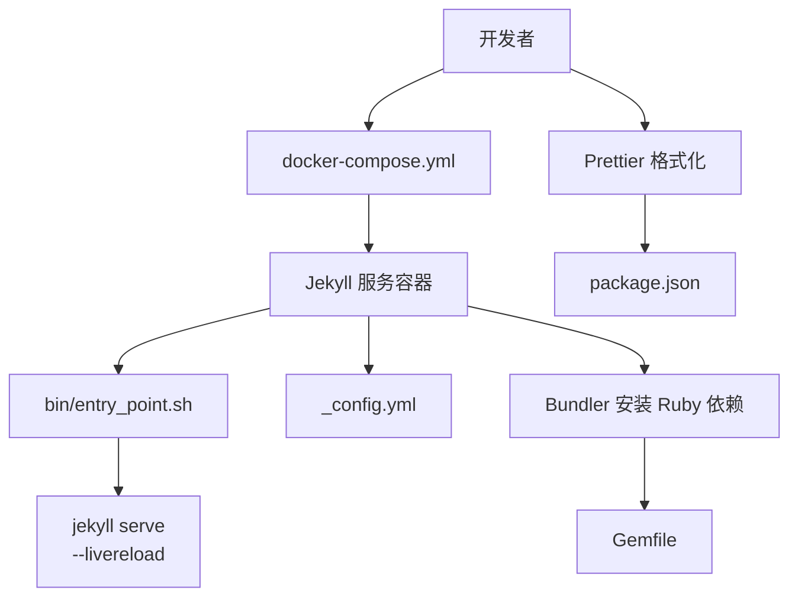
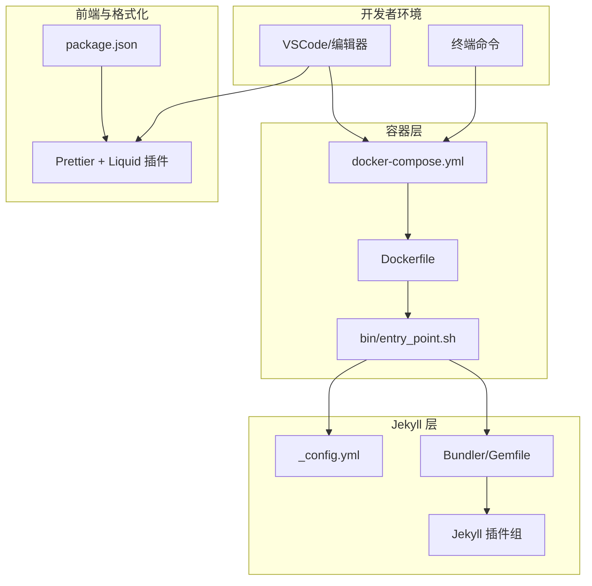
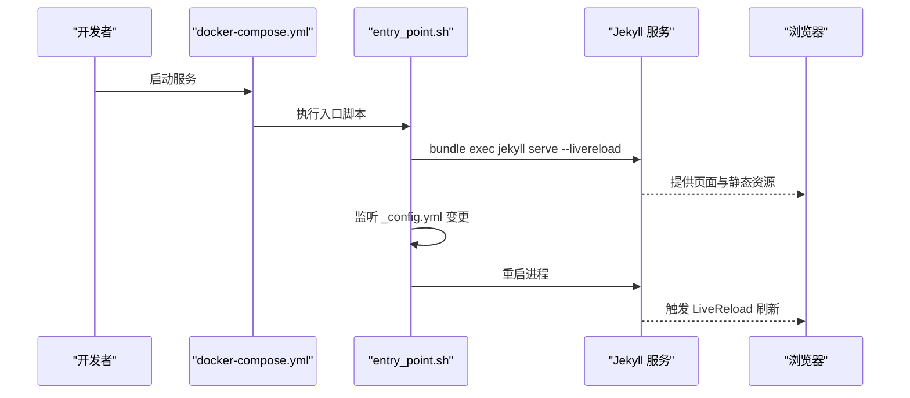
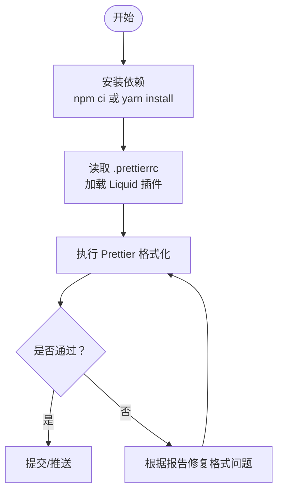
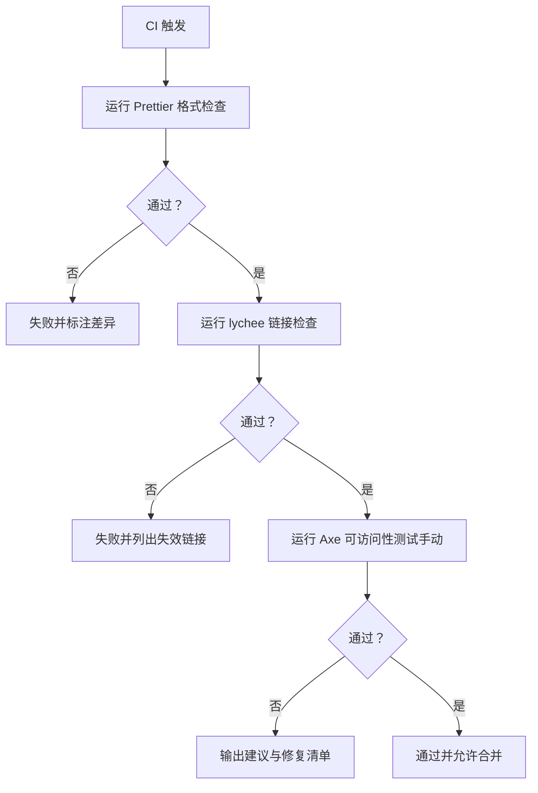
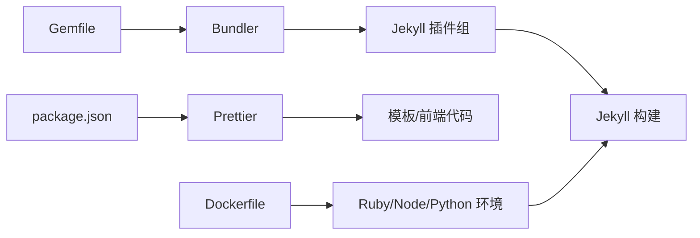

# 开发工具和测试

<cite>
**本文引用的文件**
- [package.json](file://package.json)
- [.prettierrc](file://.prettierrc)
- [.pre-commit-config.yaml](file://.pre-commit-config.yaml)
- [Gemfile](file://Gemfile)
- [Dockerfile](file://Dockerfile)
- [docker-compose.yml](file://docker-compose.yml)
- [bin/entry_point.sh](file://bin/entry_point.sh)
- [_config.yml](file://_config.yml)
- [INSTALL.md](file://INSTALL.md)
- [README.md](file://README.md)
- [CONTRIBUTING.md](file://CONTRIBUTING.md)
</cite>

## 目录
1. [简介](#简介)
2. [项目结构](#项目结构)
3. [核心组件](#核心组件)
4. [架构总览](#架构总览)
5. [详细组件分析](#详细组件分析)
6. [依赖关系分析](#依赖关系分析)
7. [性能考虑](#性能考虑)
8. [故障排查指南](#故障排查指南)
9. [结论](#结论)
10. [附录](#附录)

## 简介
本文件面向 al-folio 项目的开发者与维护者，系统梳理开发工具链与测试流程，覆盖以下主题：
- 开发环境配置与管理：本地开发服务器启动、热重载、容器化运行方式
- 代码格式化：Prettier 配置与集成（含 Liquid 插件）
- 代码质量检查：链接检查（lychee）、可访问性测试（Axe）等
- 版本控制最佳实践：分支策略、提交规范、PR 流程
- 测试策略与自动化：CI 中的格式化、链接检查与可访问性测试
- 调试技巧与开发工具：日志、容器调试、Jekyll 构建参数
- 持续集成与持续部署：GitHub Actions 工作流与自动部署

## 项目结构
该仓库采用 Jekyll 静态站点生成器，结合 Ruby 生态（Bundler）与 Node 生态（Prettier），并通过 Docker 提供一致的开发与构建环境。关键目录与文件职责概览：
- 根目录：站点配置、包管理与容器编排
- _config.yml：Jekyll 主要配置（插件、压缩、分析、第三方库等）
- Gemfile：Ruby 依赖与 Jekyll 插件组
- package.json：Node 依赖（Prettier 及其 Liquid 插件）
- docker-compose.yml：服务编排（Jekyll 容器）
- bin/entry_point.sh：容器内入口脚本，负责监听配置变更并重启 Jekyll
- .prettierrc/.pre-commit-config.yaml：代码格式化与提交前钩子

图表来源
- [docker-compose.yml:1-22](file://docker-compose.yml#L1-L22)
- [bin/entry_point.sh:22-25](file://bin/entry_point.sh#L22-L25)
- [_config.yml:200-218](file://_config.yml#L200-L218)
- [Gemfile:1-39](file://Gemfile#L1-L39)
- [package.json:1-10](file://package.json#L1-L10)

章节来源
- [docker-compose.yml:1-22](file://docker-compose.yml#L1-L22)
- [bin/entry_point.sh:1-38](file://bin/entry_point.sh#L1-L38)
- [_config.yml:1-646](file://_config.yml#L1-L646)
- [Gemfile:1-39](file://Gemfile#L1-L39)
- [package.json:1-10](file://package.json#L1-L10)

## 核心组件
- 容器化开发环境
  - 使用 Dockerfile 安装 Ruby、Node、Python、ImageMagick、inotify-tools 等依赖，设置生产/开发环境变量，暴露端口并以入口脚本启动 Jekyll。
  - docker-compose.yml 将宿主机目录挂载到容器内，映射端口 8080（Jekyll）与 35729（LiveReload），并设置开发环境变量。
- 入口脚本与热重载
  - entry_point.sh 启动 Jekyll 并启用 --livereload；监听 _config.yml 变更后自动重启 Jekyll，实现热重载。
- 代码格式化与提交前检查
  - package.json 声明 Prettier 与 Shopify 的 Liquid 插件；.prettierrc 指定打印宽度、尾随逗号等规则；.pre-commit-config.yaml 配置若干基础钩子（空白字符、文件结尾、YAML、大文件）。
- Jekyll 配置与插件生态
  - _config.yml 定义站点元数据、布局、插件列表、压缩与第三方库版本；Gemfile 管理 Ruby 插件组（核心插件、外部数据插件）。

章节来源
- [Dockerfile:1-77](file://Dockerfile#L1-L77)
- [docker-compose.yml:1-22](file://docker-compose.yml#L1-L22)
- [bin/entry_point.sh:22-37](file://bin/entry_point.sh#L22-L37)
- [package.json:1-10](file://package.json#L1-L10)
- [.prettierrc:1-4](file://.prettierrc#L1-L4)
- [.pre-commit-config.yaml:1-11](file://.pre-commit-config.yaml#L1-L11)
- [_config.yml:200-218](file://_config.yml#L200-L218)
- [Gemfile:6-26](file://Gemfile#L6-L26)

## 架构总览
下图展示从开发者到容器、Jekyll、插件与第三方库的整体交互路径。

图表来源
- [docker-compose.yml:1-22](file://docker-compose.yml#L1-L22)
- [Dockerfile:1-77](file://Dockerfile#L1-L77)
- [bin/entry_point.sh:1-38](file://bin/entry_point.sh#L1-L38)
- [_config.yml:200-218](file://_config.yml#L200-L218)
- [Gemfile:1-39](file://Gemfile#L1-L39)
- [package.json:1-10](file://package.json#L1-L10)

## 详细组件分析

### 组件一：本地开发服务器与热重载
- 启动方式
  - 推荐使用 Docker Compose：拉取镜像并启动服务，浏览器访问 http://localhost:8080 查看站点。
  - 若需自定义镜像，可通过 docker-compose.yml 的 build 字段或 slim 版本进行替换。
- 热重载机制
  - 容器内入口脚本通过 inotify-tools 监听 _config.yml 的修改，一旦检测到变更即终止并重启 Jekyll 进程，从而触发 LiveReload。
- 端口与卷
  - 映射 8080（Jekyll 服务）与 35729（LiveReload），并将当前目录挂载至 /srv/jekyll，实现代码变更即时生效。

图表来源
- [docker-compose.yml:15-21](file://docker-compose.yml#L15-L21)
- [bin/entry_point.sh:22-37](file://bin/entry_point.sh#L22-L37)

章节来源
- [docker-compose.yml:1-22](file://docker-compose.yml#L1-L22)
- [bin/entry_point.sh:1-38](file://bin/entry_point.sh#L1-L38)
- [INSTALL.md:45-63](file://INSTALL.md#L45-L63)

### 组件二：代码格式化工具（Prettier 与 Liquid 插件）
- 配置与安装
  - package.json 声明 prettier 与 @shopify/prettier-plugin-liquid。
  - .prettierrc 指定插件、打印宽度与尾随逗号策略。
- 集成方式
  - 在本地编辑器中启用 Prettier 自动格式化；在 CI 中通过预设动作执行格式检查，确保 PR 提交符合统一风格。
- 适用范围
  - 支持对 Liquid 模板进行格式化，便于维护模板一致性。

图表来源
- [package.json:1-10](file://package.json#L1-L10)
- [.prettierrc:1-4](file://.prettierrc#L1-L4)

章节来源
- [package.json:1-10](file://package.json#L1-L10)
- [.prettierrc:1-4](file://.prettierrc#L1-L4)
- [CONTRIBUTING.md:11-11](file://CONTRIBUTING.md#L11-L11)

### 组件三：代码质量检查（链接检查与可访问性测试）
- 链接检查（lychee）
  - CI 中运行 lychee 对站点内外链进行检查，识别失效链接，保障内容可用性。
- 可访问性测试（Axe）
  - README 文档指出在 CI 中集成 Axe，但需要手动运行，因为修复问题通常需要一定前端知识。
- 提交前检查（pre-commit）
  - .pre-commit-config.yaml 配置了若干基础钩子，如去除尾随空白、文件结尾处理、YAML 语法检查、大文件检查等，有助于在本地尽早发现常见问题。

图表来源
- [README.md:423-432](file://README.md#L423-L432)
- [.pre-commit-config.yaml:1-11](file://.pre-commit-config.yaml#L1-L11)

章节来源
- [README.md:423-432](file://README.md#L423-L432)
- [.pre-commit-config.yaml:1-11](file://.pre-commit-config.yaml#L1-L11)

### 组件四：版本控制最佳实践
- 分支策略
  - README 未强制规定分支模型；建议采用功能分支 + 主干保护的方式，避免直接向主分支推送。
- 提交规范
  - README 强调使用 Prettier 统一格式，PR 中若格式检查失败，可在 CI 失败动作产物中查看 HTML diff 并修正。
- PR 流程
  - 小修小补可直接提交 PR；重大改动建议先开 Issue 讨论，PR 中引用对应 Issue。
  - 保持 PR 内容聚焦，减少不必要的变更，便于审查。

章节来源
- [CONTRIBUTING.md:5-23](file://CONTRIBUTING.md#L5-L23)
- [README.md:423-432](file://README.md#L423-L432)

### 组件五：测试策略与自动化
- 自动化测试
  - CI 中包含 Prettier 格式检查、lychee 链接检查与 Axe 可访问性测试（需手动）。
- 手动测试
  - 可在本地或 CI 中运行 Axe，针对页面进行可访问性评估，修复高优先级问题。
- 本地验证
  - 通过 Docker Compose 启动本地服务，结合 LiveReload 实时验证样式与交互。

章节来源
- [README.md:423-432](file://README.md#L423-L432)
- [INSTALL.md:45-63](file://INSTALL.md#L45-L63)

### 组件六：调试技巧与开发工具
- 容器调试
  - 使用 docker-compose logs 查看容器日志；通过 docker-compose exec -it jekyll /bin/bash 进入容器，手动执行 ./bin/entry_point.sh 或 bundle install 排查依赖问题。
- Jekyll 参数
  - 入口脚本启用了 --watch、--livereload、--verbose、--trace、--force_polling，便于在容器内稳定运行与快速定位问题。
- 配置热更新
  - 监听 _config.yml 的变更并自动重启，适合在调整插件、第三方库版本等配置时快速验证。

章节来源
- [INSTALL.md:83-107](file://INSTALL.md#L83-L107)
- [bin/entry_point.sh:22-37](file://bin/entry_point.sh#L22-L37)

### 组件七：持续集成与持续部署
- 自动部署
  - README 指出从特定版本起，每次向主分支推送会自动重新部署网页；首次部署后会在仓库生成 gh-pages 分支。
- 工作流权限
  - 需要在仓库 Settings -> Actions -> General 中为 GitHub Actions 设置“读写权限”，以允许自动部署。
- 分支触发
  - 如需在其他分支上启用自动部署，需在相应分支的 .github/workflows/deploy.yml 中调整 on->push->branches 与 on->pull_request->branches。
- 手动触发
  - 可在 Actions 页面选择“Deploy”工作流并“运行工作流”进行手动部署。

章节来源
- [INSTALL.md:149-157](file://INSTALL.md#L149-L157)
- [README.md:11-11](file://README.md#L11-L11)

## 依赖关系分析
- Ruby 生态
  - Gemfile 声明 Jekyll 核心插件组与外部数据插件组，_config.yml 的 plugins 列表与之对应，确保构建时加载所需插件。
- Node 生态
  - package.json 声明 Prettier 与 Liquid 插件，用于统一模板与前端代码格式。
- 容器与系统依赖
  - Dockerfile 安装 Ruby、Node、Python、ImageMagick、inotify-tools 等，保证在容器内完成构建与热重载。

图表来源
- [Gemfile:6-26](file://Gemfile#L6-L26)
- [_config.yml:200-218](file://_config.yml#L200-L218)
- [package.json:1-10](file://package.json#L1-L10)
- [Dockerfile:22-40](file://Dockerfile#L22-L40)

章节来源
- [Gemfile:1-39](file://Gemfile#L1-L39)
- [_config.yml:200-218](file://_config.yml#L200-L218)
- [package.json:1-10](file://package.json#L1-L10)
- [Dockerfile:1-77](file://Dockerfile#L1-L77)

## 性能考虑
- 图片优化
  - _config.yml 中启用 jekyll-imagemagick 与响应式 WebP 输出，建议配合懒加载提升首屏性能。
- 资源压缩
  - jekyll-minifier 与 jekyll-terser 配合使用，减少 JS/CSS 体积；terser 压缩选项可按需调整。
- 构建缓存
  - 容器内使用 inotify-tools 实现文件变更监听，避免频繁全量扫描；建议在本地开发时仅编辑必要文件以降低重建频率。

章节来源
- [_config.yml:234-245](file://_config.yml#L234-L245)
- [_config.yml:350-374](file://_config.yml#L350-L374)

## 故障排查指南
- 容器权限问题
  - Dockerfile 注释中提示可能遇到缓存目录权限错误，可通过设置用户/组 ID 或注释掉非必要步骤临时规避。
- 依赖安装失败
  - 使用 docker-compose exec 进入容器后执行 bundle install，确认 Ruby/Gem 依赖安装成功。
- 端口占用
  - 确认宿主机 8080/35729 未被占用；如冲突，可在 docker-compose.yml 中调整映射端口。
- 配置不生效
  - 修改 _config.yml 后由入口脚本自动重启 Jekyll；若未生效，检查脚本是否正常运行与 inotify 是否可用。

章节来源
- [Dockerfile:16-21](file://Dockerfile#L16-L21)
- [INSTALL.md:83-107](file://INSTALL.md#L83-L107)
- [docker-compose.yml:15-21](file://docker-compose.yml#L15-L21)
- [bin/entry_point.sh:29-37](file://bin/entry_point.sh#L29-L37)

## 结论
本文件基于仓库现有配置与文档，总结了 al-folio 的开发工具链与测试流程。通过 Docker 化开发、Prettier 统一格式、CI 中的链接与可访问性检查，以及自动化的部署工作流，能够帮助团队建立高效且稳定的开发与发布节奏。建议在日常工作中坚持：
- 使用 Docker 作为统一开发环境
- 在提交前运行 Prettier 格式化
- 关注 CI 报告，及时修复链接与可访问性问题
- 严格遵循 PR 流程与提交规范

## 附录
- 快速启动
  - 使用 Docker Compose 启动：docker compose pull && docker compose up
  - 首次启动可能需要下载约 400MB 的镜像，随后访问 http://localhost:8080 查看站点
- 常用命令
  - 本地开发：docker compose up
  - 日志查看：docker compose logs
  - 进入容器：docker compose exec -it jekyll /bin/bash
  - 重启入口脚本：./bin/entry_point.sh
- 配置参考
  - Jekyll 插件与压缩：参见 _config.yml 的 plugins 与 jekyll-minifier、terser 配置
  - Ruby 插件组：参见 Gemfile 的 :jekyll_plugins 与 :other_plugins
  - Prettier 配置：参见 .prettierrc 与 package.json

章节来源
- [INSTALL.md:45-63](file://INSTALL.md#L45-L63)
- [bin/entry_point.sh:1-38](file://bin/entry_point.sh#L1-L38)
- [_config.yml:200-245](file://_config.yml#L200-L245)
- [Gemfile:6-38](file://Gemfile#L6-L38)
- [.prettierrc:1-4](file://.prettierrc#L1-L4)
- [package.json:1-10](file://package.json#L1-L10)