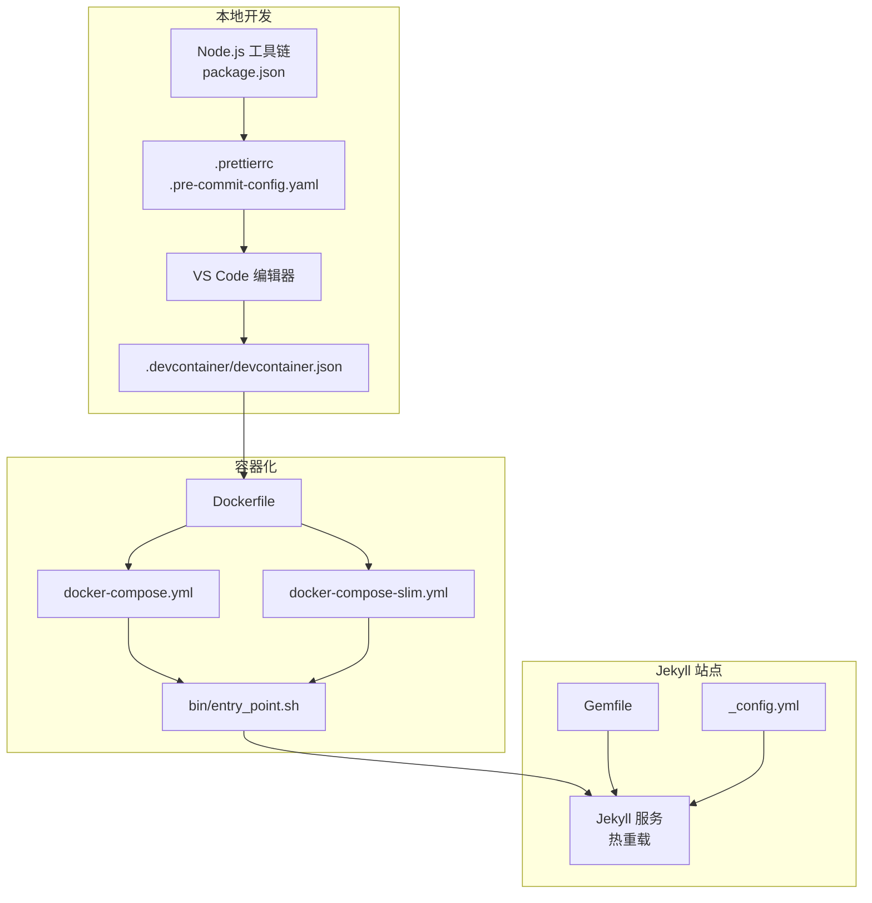
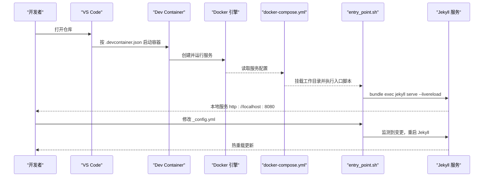
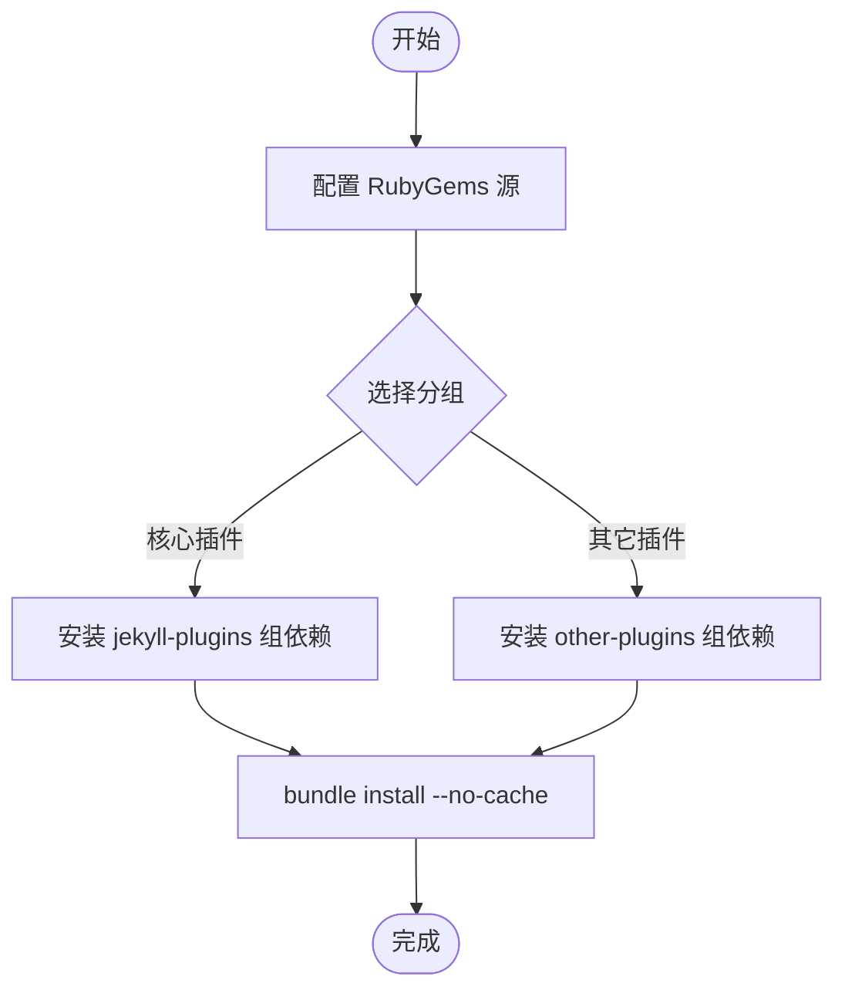
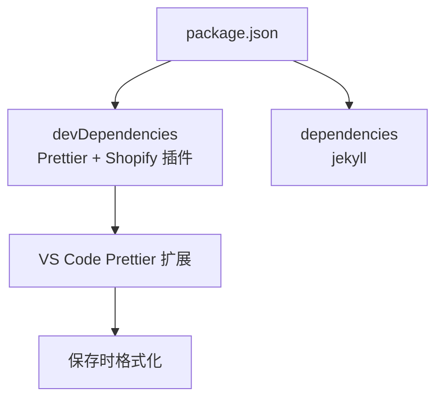
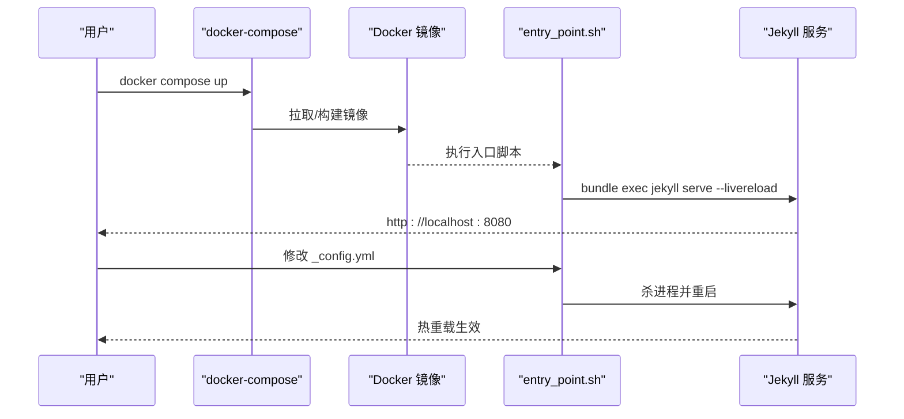
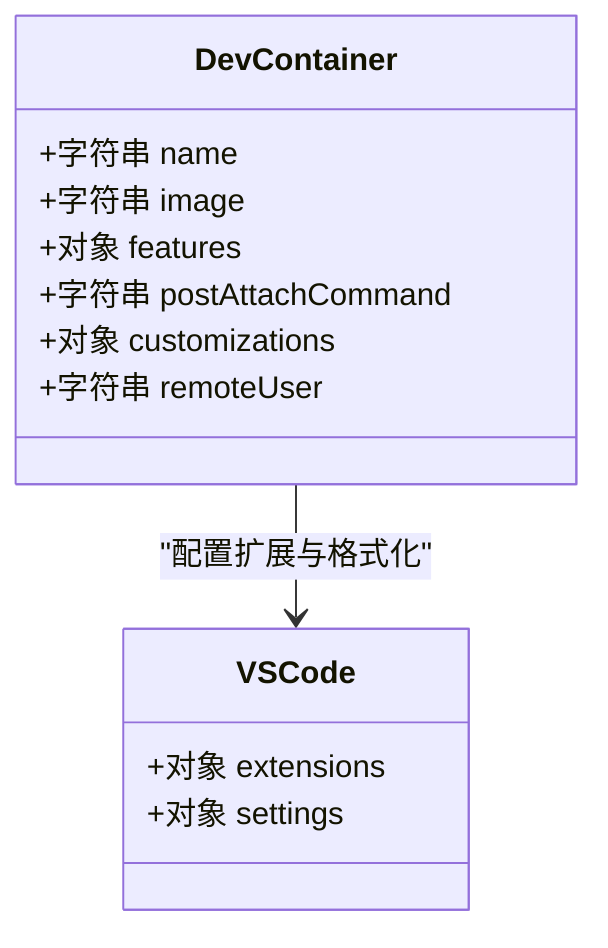
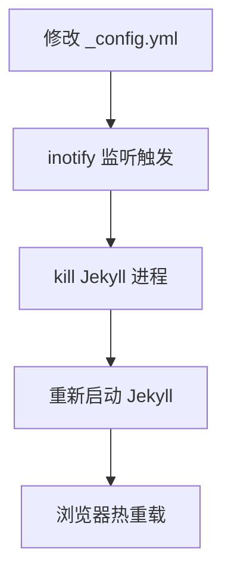
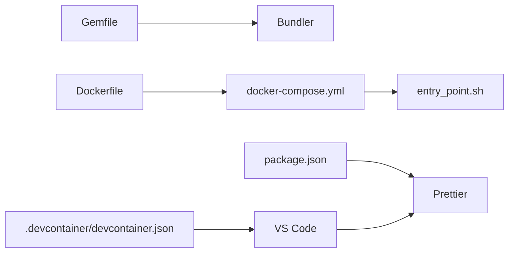

# 开发环境配置

<cite>
**本文档引用的文件**
- [Gemfile](file://Gemfile)
- [package.json](file://package.json)
- [Dockerfile](file://Dockerfile)
- [docker-compose.yml](file://docker-compose.yml)
- [docker-compose-slim.yml](file://docker-compose-slim.yml)
- [.devcontainer/devcontainer.json](file://.devcontainer/devcontainer.json)
- [_config.yml](file://_config.yml)
- [bin/entry_point.sh](file://bin/entry_point.sh)
- [.prettierrc](file://.prettierrc)
- [.pre-commit-config.yaml](file://.pre-commit-config.yaml)
- [INSTALL.md](file://INSTALL.md)
- [README.md](file://README.md)
- [FAQ.md](file://FAQ.md)
</cite>

## 目录
1. [简介](#简介)
2. [项目结构](#项目结构)
3. [核心组件](#核心组件)
4. [架构总览](#架构总览)
5. [详细组件分析](#详细组件分析)
6. [依赖关系分析](#依赖关系分析)
7. [性能考虑](#性能考虑)
8. [故障排除指南](#故障排除指南)
9. [结论](#结论)
10. [附录](#附录)

## 简介
本文件面向需要在本地或容器中搭建与维护该 Jekyll 博客项目的开发者，系统性说明 Ruby 环境与 Jekyll 依赖（Gemfile）的安装与版本管理、Node.js 环境与前端开发依赖（package.json）的配置、Docker 容器化开发环境（Dockerfile 与 docker-compose.yml）的使用方式、VS Code Dev Container 配置（.devcontainer/devcontainer.json）以及本地开发服务器的启动、热重载与调试技巧。同时提供完整的环境搭建步骤与常见问题排查建议。

## 项目结构
该项目采用 Jekyll 主题模板，结合 Ruby + Bundler 管理后端依赖、Node.js 生态管理前端工具与格式化工具，并通过 Docker 与 VS Code Dev Container 提供一致化的开发体验。关键配置文件分布如下：
- Ruby 与 Jekyll：Gemfile、_config.yml
- Node.js 与前端工具：package.json、.prettierrc、.pre-commit-config.yaml
- 容器化：Dockerfile、docker-compose.yml、docker-compose-slim.yml
- VS Code Dev Container：.devcontainer/devcontainer.json
- 启动脚本：bin/entry_point.sh
- 文档与帮助：INSTALL.md、README.md、FAQ.md

图表来源
- [Dockerfile:1-77](file://Dockerfile#L1-L77)
- [docker-compose.yml:1-22](file://docker-compose.yml#L1-L22)
- [docker-compose-slim.yml:1-13](file://docker-compose-slim.yml#L1-L13)
- [.devcontainer/devcontainer.json:1-32](file://.devcontainer/devcontainer.json#L1-L32)
- [bin/entry_point.sh:1-38](file://bin/entry_point.sh#L1-L38)
- [Gemfile:1-39](file://Gemfile#L1-L39)
- [_config.yml:1-646](file://_config.yml#L1-L646)
- [package.json:1-10](file://package.json#L1-L10)
- [.prettierrc:1-4](file://.prettierrc#L1-L4)
- [.pre-commit-config.yaml:1-11](file://.pre-commit-config.yaml#L1-L11)

章节来源
- [README.md:1-487](file://README.md#L1-L487)
- [INSTALL.md:1-252](file://INSTALL.md#L1-L252)

## 核心组件
- Ruby 与 Jekyll 依赖（Gemfile）
  - 使用源地址与分组管理核心插件与外部数据处理依赖，确保构建稳定性与可追踪性。
- Node.js 与前端工具（package.json）
  - 管理 Prettier 与 Shopify Liquid 插件等开发依赖，支持代码格式化与校验。
- 容器化（Dockerfile 与 docker-compose）
  - 提供预构建镜像与自定义镜像构建两种方式；支持开发与生产环境变量与端口映射。
- VS Code Dev Container
  - 自动安装必要系统包与 VS Code 扩展，集成 Prettier 与 Jekyll 启动命令。
- 启动脚本（bin/entry_point.sh）
  - 统一入口脚本，负责 Gemfile.lock 管理、Jekyll 启动与配置变更监听重启。
- 配置中心（_config.yml）
  - Jekyll 构建参数、插件启用、站点元信息、第三方库版本与 CDN 资源等。

章节来源
- [Gemfile:1-39](file://Gemfile#L1-L39)
- [package.json:1-10](file://package.json#L1-L10)
- [Dockerfile:1-77](file://Dockerfile#L1-L77)
- [docker-compose.yml:1-22](file://docker-compose.yml#L1-L22)
- [docker-compose-slim.yml:1-13](file://docker-compose-slim.yml#L1-L13)
- [.devcontainer/devcontainer.json:1-32](file://.devcontainer/devcontainer.json#L1-L32)
- [bin/entry_point.sh:1-38](file://bin/entry_point.sh#L1-L38)
- [_config.yml:1-646](file://_config.yml#L1-L646)

## 架构总览
下图展示从编辑器到容器再到 Jekyll 服务的完整开发流程，以及热重载与自动重启机制：

图表来源
- [.devcontainer/devcontainer.json:1-32](file://.devcontainer/devcontainer.json#L1-L32)
- [docker-compose.yml:1-22](file://docker-compose.yml#L1-L22)
- [bin/entry_point.sh:1-38](file://bin/entry_point.sh#L1-L38)

## 详细组件分析

### Ruby 与 Jekyll 依赖（Gemfile）
- 源与分组
  - 使用公共 RubyGems 源，区分核心插件与其它插件，便于按需管理与升级。
- 核心插件（jekyll_plugins）
  - 包含归档、订阅、JSON 获取、图片处理、Jupyter Notebook、链接属性、压缩、分页、正则替换、学术文献、站点地图、标签页、压缩器、目录、Twitter 插件、Emoji 等。
- 其它插件（other_plugins）
  - 包含 CSS 解析、RSS 抓取、HTTP 请求、观察者与结构体等辅助库。
- 版本控制与缓存
  - 通过 Bundler 管理依赖锁定与缓存，避免环境漂移。

图表来源
- [Gemfile:1-39](file://Gemfile#L1-L39)

章节来源
- [Gemfile:1-39](file://Gemfile#L1-L39)

### Node.js 与前端工具（package.json）
- 开发依赖
  - Prettier 与 Shopify Liquid 插件，用于统一格式化与 Liquid 模板支持。
- 运行时依赖
  - Jekyll 作为运行时依赖，便于在容器或本地直接使用。
- 与 VS Code 集成
  - Dev Container 中已安装 Prettier，编辑器默认格式化器指向 Prettier，提升一致性。

图表来源
- [package.json:1-10](file://package.json#L1-L10)
- [.devcontainer/devcontainer.json:18-28](file://.devcontainer/devcontainer.json#L18-L28)

章节来源
- [package.json:1-10](file://package.json#L1-L10)
- [.devcontainer/devcontainer.json:1-32](file://.devcontainer/devcontainer.json#L1-L32)

### Docker 容器化开发环境
- Dockerfile
  - 基于 Ruby Slim 镜像，安装系统依赖（构建工具、Node.js、Python、ImageMagick、inotify 等），设置语言与运行时环境变量，复制 Gemfile 并安装 Bundler 与依赖，暴露 8080 端口，设置入口脚本。
- docker-compose.yml
  - 使用预构建镜像或本地构建，映射 8080 与 LiveReload 端口，挂载当前目录至 /srv/jekyll，设置开发环境变量。
- docker-compose-slim.yml
  - 使用更小体积的预构建镜像，功能与上述一致，适合资源受限场景。
- 入口脚本 bin/entry_point.sh
  - 管理 Gemfile.lock（Git 目录安全与跟踪状态），启动 Jekyll 并开启热重载；监听 _config.yml 变化自动重启。

图表来源
- [Dockerfile:1-77](file://Dockerfile#L1-L77)
- [docker-compose.yml:1-22](file://docker-compose.yml#L1-L22)
- [docker-compose-slim.yml:1-13](file://docker-compose-slim.yml#L1-L13)
- [bin/entry_point.sh:1-38](file://bin/entry_point.sh#L1-L38)

章节来源
- [Dockerfile:1-77](file://Dockerfile#L1-L77)
- [docker-compose.yml:1-22](file://docker-compose.yml#L1-L22)
- [docker-compose-slim.yml:1-13](file://docker-compose-slim.yml#L1-L13)
- [bin/entry_point.sh:1-38](file://bin/entry_point.sh#L1-L38)

### VS Code Dev Container 配置
- 镜像与特性
  - 使用官方 Jekyll Dev Container 镜像，安装 apt 包（构建工具、ImageMagick、Jupyter nbconvert、Ruby、zlib 等）与 Prettier。
- 自动启动
  - postAttachCommand 指向入口脚本，进入容器即启动 Jekyll 服务。
- VS Code 设置
  - 默认格式化器为 Prettier，启用保存时格式化，加载 .prettierrc 配置。
- 用户与权限
  - remoteUser 设为 vscode，便于与宿主机共享权限。

图表来源
- [.devcontainer/devcontainer.json:1-32](file://.devcontainer/devcontainer.json#L1-L32)

章节来源
- [.devcontainer/devcontainer.json:1-32](file://.devcontainer/devcontainer.json#L1-L32)

### 本地开发服务器与热重载
- 启动方式
  - 推荐使用 Docker Compose 快速启动，或在 Dev Container 内直接运行入口脚本。
- 端口与热重载
  - 8080 端口提供 Jekyll 服务，35729 端口用于 LiveReload；入口脚本以 --livereload 参数启动。
- 配置变更监听
  - 入口脚本监听 _config.yml 变化，自动重启 Jekyll 以应用新配置。

图表来源
- [bin/entry_point.sh:29-37](file://bin/entry_point.sh#L29-L37)
- [docker-compose.yml:15-21](file://docker-compose.yml#L15-L21)

章节来源
- [bin/entry_point.sh:1-38](file://bin/entry_point.sh#L1-L38)
- [docker-compose.yml:1-22](file://docker-compose.yml#L1-L22)

### Jekyll 配置中心（_config.yml）
- 站点元信息与主题
  - 网站标题、作者信息、语言、图标、URL 与基础路径等。
- 插件与功能
  - 启用的 Jekyll 插件列表、归档配置、Scholar 配置、响应式图片、暗色模式、数学公式、提示工具等。
- 第三方库版本与 CDN
  - 统一管理第三方库版本与完整性校验哈希，支持本地下载或 CDN 加载。
- 构建与排除
  - include/exclude/keep_files 控制构建产物范围，避免无关文件进入最终站点。

章节来源
- [_config.yml:1-646](file://_config.yml#L1-L646)

## 依赖关系分析
- Ruby 与 Bundler
  - Gemfile 定义依赖与分组，Bundler 在容器内安装，确保 Ruby 环境稳定。
- Node.js 与 Prettier
  - package.json 管理开发依赖，Dev Container 内置 Prettier，编辑器默认格式化器指向 Prettier。
- Docker 与 Compose
  - Dockerfile 定义镜像与环境，docker-compose.yml 定义服务与卷挂载，entry_point.sh 统一启动与监控。
- VS Code 与 Dev Container
  - .devcontainer/devcontainer.json 定义镜像、特性、扩展与设置，实现一键开发环境。

图表来源
- [Gemfile:1-39](file://Gemfile#L1-L39)
- [package.json:1-10](file://package.json#L1-L10)
- [Dockerfile:1-77](file://Dockerfile#L1-L77)
- [docker-compose.yml:1-22](file://docker-compose.yml#L1-L22)
- [.devcontainer/devcontainer.json:1-32](file://.devcontainer/devcontainer.json#L1-L32)

章节来源
- [Gemfile:1-39](file://Gemfile#L1-L39)
- [package.json:1-10](file://package.json#L1-L10)
- [Dockerfile:1-77](file://Dockerfile#L1-L77)
- [docker-compose.yml:1-22](file://docker-compose.yml#L1-L22)
- [.devcontainer/devcontainer.json:1-32](file://.devcontainer/devcontainer.json#L1-L32)

## 性能考虑
- 图片与静态资源
  - 启用响应式 WebP 图片与懒加载，减少首屏加载时间。
- JavaScript/CSS 压缩
  - 使用 jekyll-minifier 与 terser 压缩策略，合理排除不需要压缩的文件。
- 构建范围控制
  - 通过 include/exclude/keep_files 精准控制构建产物，缩短构建时间。
- 容器体积与启动速度
  - 使用 slim 镜像或预构建镜像，减少拉取与构建时间。

章节来源
- [_config.yml:350-395](file://_config.yml#L350-L395)
- [_config.yml:234-245](file://_config.yml#L234-L245)
- [_config.yml:174-198](file://_config.yml#L174-L198)

## 故障排除指南
- Docker 相关
  - 首次运行镜像较大，耐心等待拉取；如需自定义镜像，使用 --build 重建；出现权限问题可参考注释中的用户/组 ID 配置。
- 端口占用
  - 若 8080/35729 端口被占用，请调整 docker-compose 映射或释放端口。
- 配置错误导致构建失败
  - 检查 _config.yml 中 url/baseurl 是否正确；相关问题可参考 FAQ。
- Prettier 格式化失败
  - 在 Dev Container 或本地安装 Prettier 并执行格式化；或在 VS Code 中启用保存时格式化。
- 依赖冲突或过期
  - 更新至最新版本模板，或手动升级相关依赖；注意 Node.js 与 GitHub Actions 的废弃版本提示。

章节来源
- [INSTALL.md:45-108](file://INSTALL.md#L45-L108)
- [FAQ.md:75-94](file://FAQ.md#L75-L94)
- [FAQ.md:65-73](file://FAQ.md#L65-L73)

## 结论
通过 Gemfile、package.json、Dockerfile、docker-compose.yml、.devcontainer/devcontainer.json 与 _config.yml 的协同，本项目提供了高度一致且可复现的开发环境。容器化与 Dev Container 降低了环境差异带来的问题，入口脚本实现了配置变更的自动重启与热重载，配合 Prettier 与 Git Hooks 可保障代码质量与一致性。建议优先使用 Docker 或 Dev Container 方式进行本地开发，遇到问题时参考本文档与 FAQ。

## 附录

### 环境搭建步骤（推荐）
- 使用 Docker
  - 安装 Docker 与 Docker Compose，执行拉取与启动命令，访问 http://localhost:8080。
- 使用 Dev Container（VS Code）
  - 安装 Dev Containers 扩展，打开仓库后按提示安装并启动容器，VS Code 将自动启动 Jekyll。
- 本地 Ruby/Node 环境（不推荐）
  - 安装 Ruby、Bundler、Node.js、Python 与相关系统依赖，执行 bundle install 与 npm install，再启动 Jekyll。

章节来源
- [INSTALL.md:45-127](file://INSTALL.md#L45-L127)