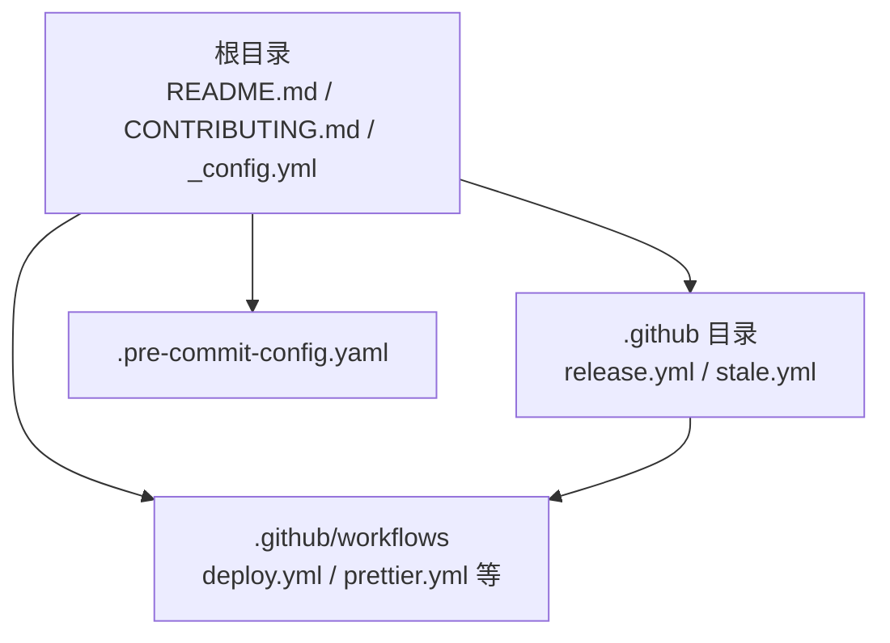
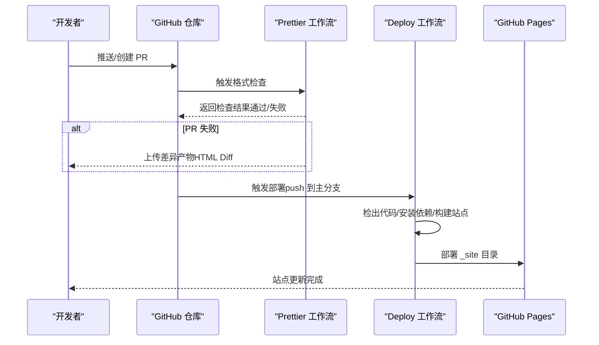
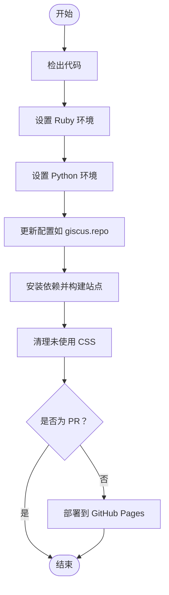
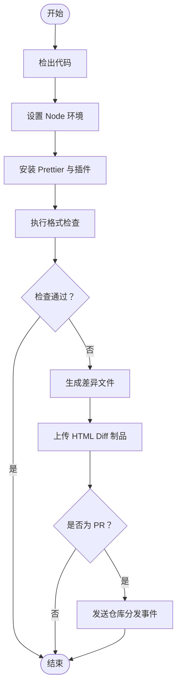
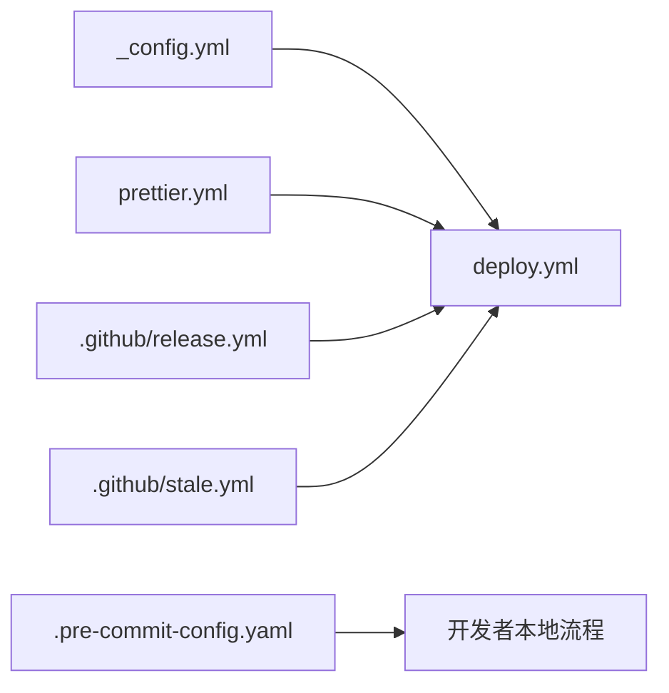

# 版本控制和协作

<cite>
**本文引用的文件**
- [README.md](file://README.md)
- [CONTRIBUTING.md](file://CONTRIBUTING.md)
- [_config.yml](file://_config.yml)
- [.github/workflows/deploy.yml](file://.github/workflows/deploy.yml)
- [.github/workflows/prettier.yml](file://.github/workflows/prettier.yml)
- [.github/release.yml](file://.github/release.yml)
- [.github/stale.yml](file://.github/stale.yml)
- [.pre-commit-config.yaml](file://.pre-commit-config.yaml)
</cite>

## 目录
1. [简介](#简介)
2. [项目结构](#项目结构)
3. [核心组件](#核心组件)
4. [架构总览](#架构总览)
5. [详细组件分析](#详细组件分析)
6. [依赖关系分析](#依赖关系分析)
7. [性能考量](#性能考量)
8. [故障排查指南](#故障排查指南)
9. [结论](#结论)
10. [附录](#附录)

## 简介
本文件面向版本控制与协作开发流程，结合仓库中的实际配置，系统性梳理 Git 工作流最佳实践（分支策略、提交规范、合并策略）、GitHub Actions 自动化（构建、测试、部署）、Issue 与 PR 管理（模板、标签、审查流程）、代码审查标准、持续集成与持续部署（CI/CD）配置与多环境策略，并提供团队协作最佳实践与常见问题解决方案。内容严格基于仓库中现有文件与配置进行归纳总结。

## 项目结构
该站点为基于 Jekyll 的静态网站，采用 GitHub Pages 托管。版本控制与协作相关的关键位置如下：
- 根目录：贡献指南、配置与说明文件
- .github：工作流、发布与维护策略配置
- .github/workflows：CI/CD 工作流定义
- .github/ISSUE_TEMPLATE：Issue 模板（如存在）
- .pre-commit-config.yaml：本地预提交钩子配置

图示来源
- [README.md:1-487](file://README.md#L1-L487)
- [.github/release.yml:1-15](file://.github/release.yml#L1-L15)
- [.github/stale.yml:1-19](file://.github/stale.yml#L1-L19)
- [.github/workflows/deploy.yml:1-106](file://.github/workflows/deploy.yml#L1-L106)
- [.github/workflows/prettier.yml:1-49](file://.github/workflows/prettier.yml#L1-L49)
- [.pre-commit-config.yaml:1-11](file://.pre-commit-config.yaml#L1-L11)

章节来源
- [README.md:1-487](file://README.md#L1-L487)
- [.github/release.yml:1-15](file://.github/release.yml#L1-L15)
- [.github/stale.yml:1-19](file://.github/stale.yml#L1-L19)
- [.github/workflows/deploy.yml:1-106](file://.github/workflows/deploy.yml#L1-L106)
- [.github/workflows/prettier.yml:1-49](file://.github/workflows/prettier.yml#L1-L49)
- [.pre-commit-config.yaml:1-11](file://.pre-commit-config.yaml#L1-L11)

## 核心组件
- 贡献与协作指南：明确 PR 提交、Issue 规范与许可条款，强调格式化工具的使用。
- CI/CD 工作流：包含部署工作流与代码格式化检查工作流；部署工作流在推送至主分支或触发时运行，执行构建与部署；格式化工作流在 PR 或推送时检查代码风格。
- 发布与维护策略：通过 release.yml 定义变更日志分类与标签映射；通过 stale.yml 自动标记与关闭长期不活跃 Issue。
- 预提交钩子：在本地提交前自动清理尾随空白、修复文件末尾换行、校验 YAML、避免大文件入库。

章节来源
- [CONTRIBUTING.md:1-29](file://CONTRIBUTING.md#L1-L29)
- [.github/workflows/deploy.yml:1-106](file://.github/workflows/deploy.yml#L1-L106)
- [.github/workflows/prettier.yml:1-49](file://.github/workflows/prettier.yml#L1-L49)
- [.github/release.yml:1-15](file://.github/release.yml#L1-L15)
- [.github/stale.yml:1-19](file://.github/stale.yml#L1-L19)
- [.pre-commit-config.yaml:1-11](file://.pre-commit-config.yaml#L1-L11)

## 架构总览
下图展示从开发者提交到 GitHub Pages 部署的端到端流程，以及格式化检查在 PR 中的介入方式。

图示来源
- [.github/workflows/prettier.yml:1-49](file://.github/workflows/prettier.yml#L1-L49)
- [.github/workflows/deploy.yml:1-106](file://.github/workflows/deploy.yml#L1-L106)

章节来源
- [.github/workflows/prettier.yml:1-49](file://.github/workflows/prettier.yml#L1-L49)
- [.github/workflows/deploy.yml:1-106](file://.github/workflows/deploy.yml#L1-L106)

## 详细组件分析

### 分支策略与提交规范
- 主分支保护：部署工作流仅在推送至主分支（master/main）时触发，确保只有受控变更进入生产环境。
- 变更范围：工作流对资源路径进行白名单过滤，仅在相关文件变动时触发，减少不必要的构建与部署。
- 提交规范：贡献指南要求使用合适的 Issue 模板，遵循统一的 PR 流程；强调格式化工具（Prettier）以保证一致性。

章节来源
- [.github/workflows/deploy.yml:3-62](file://.github/workflows/deploy.yml#L3-L62)
- [CONTRIBUTING.md:5-24](file://CONTRIBUTING.md#L5-L24)

### 合并策略
- 基于 PR 的审查与合并：贡献指南建议先开 Issue 再提 PR，并在 PR 中关联对应 Issue；PR 通过后方可合并。
- 自动化把关：Prettier 工作流在 PR 中自动检查格式，失败时生成差异产物供审阅者参考，降低人工审查负担。

章节来源
- [CONTRIBUTING.md:5-24](file://CONTRIBUTING.md#L5-L24)
- [.github/workflows/prettier.yml:1-49](file://.github/workflows/prettier.yml#L1-L49)

### GitHub Actions 自动化工作流

#### 部署工作流（deploy.yml）
- 触发条件：推送至主分支或发起 PR；对特定路径集合敏感，避免无关改动触发。
- 步骤概览：检出代码、设置 Ruby/Python 环境、动态更新配置、安装与构建站点、清理未使用 CSS、部署到 GitHub Pages。
- 权限：授予写入权限以完成部署。

图示来源
- [.github/workflows/deploy.yml:67-106](file://.github/workflows/deploy.yml#L67-L106)

章节来源
- [.github/workflows/deploy.yml:1-106](file://.github/workflows/deploy.yml#L1-L106)

#### 代码格式化工作流（prettier.yml）
- 触发条件：PR 或推送至主分支。
- 步骤概览：检出代码、设置 Node 环境、安装 Prettier 及 Liquid 插件、执行格式检查、失败时生成差异文件并上传为制品，必要时向仓库发送分发事件以便通知审阅者。

图示来源
- [.github/workflows/prettier.yml:13-49](file://.github/workflows/prettier.yml#L13-L49)

章节来源
- [.github/workflows/prettier.yml:1-49](file://.github/workflows/prettier.yml#L1-L49)

### Issue 与 PR 管理流程
- Issue 模板：贡献指南要求使用合适模板，便于收集必要信息与统一处理。
- 标签系统：发布配置中定义了按标签分类的变更日志类别（如新特性、缺陷修复、其他），可作为 Issue/PR 标签管理的参考。
- 审查流程：PR 应先通过格式化检查与必要的功能测试，再由维护者审查与合并。
- 长期不活跃处理：stale.yml 将在一定天数无活动后标记 Issue 为“不修复”，并在后续天数内关闭，提高维护效率。

章节来源
- [CONTRIBUTING.md:13-24](file://CONTRIBUTING.md#L13-L24)
- [.github/release.yml:1-15](file://.github/release.yml#L1-L15)
- [.github/stale.yml:1-19](file://.github/stale.yml#L1-L19)

### 代码审查标准与流程
- 审查清单（建议）：
  - 是否符合贡献指南与模板要求
  - 是否通过格式化检查（Prettier）
  - 是否引入新的依赖或破坏兼容性
  - 是否有必要的测试或验证步骤
  - 是否影响性能（如构建时间、包体积）
- 反馈处理：针对 Prettier 生成的差异制品进行逐条确认，必要时要求作者更新后再审。

章节来源
- [CONTRIBUTING.md:5-24](file://CONTRIBUTING.md#L5-L24)
- [.github/workflows/prettier.yml:27-49](file://.github/workflows/prettier.yml#L27-L49)

### 持续集成与持续部署（CI/CD）
- CI：Prettier 工作流负责在 PR 中进行格式检查，保障代码风格一致。
- CD：Deploy 工作流在主分支推送时自动构建并部署到 GitHub Pages。
- 多环境策略（建议）：
  - 开发分支：PR 触发轻量检查（如 Prettier）
  - 预发布分支：在合并前增加构建与链接检查
  - 生产分支（master/main）：完整构建与部署，保留回滚策略

章节来源
- [.github/workflows/prettier.yml:1-49](file://.github/workflows/prettier.yml#L1-L49)
- [.github/workflows/deploy.yml:1-106](file://.github/workflows/deploy.yml#L1-L106)

### 团队协作最佳实践
- 沟通规范：优先在 Issue 讨论需求与问题，PR 关联 Issue，保持讨论可追溯。
- 冲突解决：小步快跑、频繁同步上游；遇到分歧通过评审与讨论达成共识。
- 知识分享：利用贡献指南与发布说明沉淀经验，定期回顾流程并优化。

章节来源
- [CONTRIBUTING.md:5-29](file://CONTRIBUTING.md#L5-L29)

## 依赖关系分析
- 配置驱动：_config.yml 控制站点行为与第三方集成（如评论系统），部署工作流会动态更新部分字段以适配当前仓库。
- 工作流耦合：Prettier 工作流与 Deploy 工作流分别负责“质量门禁”和“交付”，二者独立但共同保障发布质量。
- 维护策略：release.yml 与 stale.yml 协同维护发布节奏与 Issue 健康度。

图示来源
- [_config.yml:1-646](file://_config.yml#L1-L646)
- [.github/workflows/deploy.yml:1-106](file://.github/workflows/deploy.yml#L1-L106)
- [.github/workflows/prettier.yml:1-49](file://.github/workflows/prettier.yml#L1-L49)
- [.github/release.yml:1-15](file://.github/release.yml#L1-L15)
- [.github/stale.yml:1-19](file://.github/stale.yml#L1-L19)
- [.pre-commit-config.yaml:1-11](file://.pre-commit-config.yaml#L1-L11)

章节来源
- [_config.yml:1-646](file://_config.yml#L1-L646)
- [.github/workflows/deploy.yml:1-106](file://.github/workflows/deploy.yml#L1-L106)
- [.github/workflows/prettier.yml:1-49](file://.github/workflows/prettier.yml#L1-L49)
- [.github/release.yml:1-15](file://.github/release.yml#L1-L15)
- [.github/stale.yml:1-19](file://.github/stale.yml#L1-L19)
- [.pre-commit-config.yaml:1-11](file://.pre-commit-config.yaml#L1-L11)

## 性能考量
- 构建阶段：启用压缩与最小化（如 Terser、Jekyll Minifier），并清理未使用 CSS，有助于减小站点体积与提升加载速度。
- 部署阶段：仅在必要路径变动时触发工作流，减少重复构建。
- 第三方资源：通过 CDN 引入库并校验完整性哈希，平衡性能与安全性。

章节来源
- [_config.yml:234-245](file://_config.yml#L234-L245)
- [_config.yml:230-237](file://_config.yml#L230-L237)
- [_config.yml:403-624](file://_config.yml#L403-L624)
- [.github/workflows/deploy.yml:97-100](file://.github/workflows/deploy.yml#L97-L100)

## 故障排查指南
- Prettier 检查失败
  - 现象：PR 触发格式化检查失败，工作流上传 HTML Diff 制品。
  - 处理：根据制品逐条修正；若为本地问题，可在本地运行格式化命令修复。
  - 参考：格式化工作流的差异生成与制品上传逻辑。
- 部署失败
  - 现象：部署工作流在构建或部署阶段报错。
  - 处理：检查构建日志中的依赖安装与环境变量；确认 _config.yml 中第三方集成配置正确；验证路径白名单是否覆盖到变更文件。
- Issue 被自动关闭
  - 现象：长时间无活动的 Issue 被标记并关闭。
  - 处理：重新打开并补充信息，或在讨论中声明仍需关注。

章节来源
- [.github/workflows/prettier.yml:27-49](file://.github/workflows/prettier.yml#L27-L49)
- [.github/workflows/deploy.yml:70-106](file://.github/workflows/deploy.yml#L70-L106)
- [.github/stale.yml:1-19](file://.github/stale.yml#L1-L19)

## 结论
本项目通过贡献指南、Issue/PR 管理、自动化工作流与维护策略，形成了较为完善的版本控制与协作体系。建议在现有基础上进一步完善 Issue 模板与标签体系、扩展测试与可访问性检查、细化多环境部署策略，并持续优化预提交与 CI 流程以提升效率与质量。

## 附录
- 术语
  - PR：Pull Request
  - CI：持续集成
  - CD：持续部署
  - Prettier：代码格式化工具
- 参考文件定位
  - 贡献指南：[CONTRIBUTING.md](file://CONTRIBUTING.md)
  - README：[README.md](file://README.md)
  - 配置：[_config.yml](file://_config.yml)
  - 部署工作流：[deploy.yml](file://.github/workflows/deploy.yml)
  - Prettier 工作流：[prettier.yml](file://.github/workflows/prettier.yml)
  - 发布策略：[release.yml](file://.github/release.yml)
  - 周期性清理策略：[stale.yml](file://.github/stale.yml)
  - 预提交钩子：[pre-commit-config.yaml](file://.pre-commit-config.yaml)