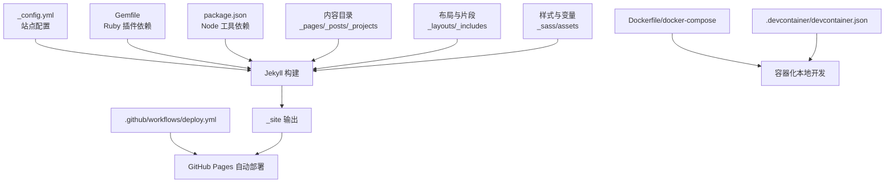
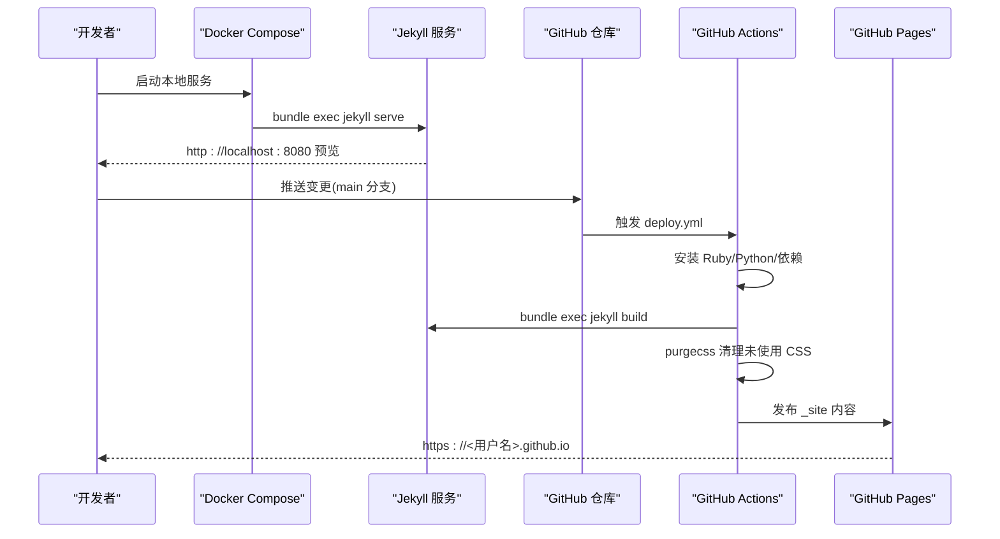
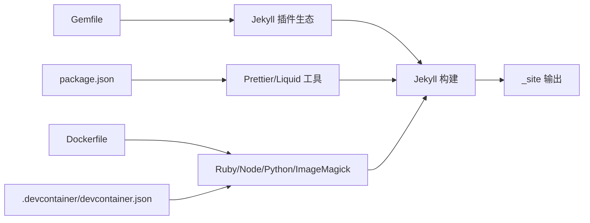

# 快速开始

<cite>
**本文引用的文件**
- [README.md](file://README.md)
- [INSTALL.md](file://INSTALL.md)
- [_config.yml](file://_config.yml)
- [Gemfile](file://Gemfile)
- [package.json](file://package.json)
- [Dockerfile](file://Dockerfile)
- [docker-compose.yml](file://docker-compose.yml)
- [docker-compose-slim.yml](file://docker-compose-slim.yml)
- [.devcontainer/devcontainer.json](file://.devcontainer/devcontainer.json)
- [bin/entry_point.sh](file://bin/entry_point.sh)
- [.github/workflows/deploy.yml](file://.github/workflows/deploy.yml)
- [.github/workflows/prettier.yml](file://.github/workflows/prettier.yml)
- [FAQ.md](file://FAQ.md)
- [_pages/about.md](file://_pages/about.md)
- [_data/socials.yml](file://_data/socials.yml)
- [_posts/2015-03-15-formatting-and-links.md](file://_posts/2015-03-15-formatting-and-links.md)
- [_projects/1_project.md](file://_projects/1_project.md)
</cite>

## 目录
1. [简介](#简介)
2. [项目结构](#项目结构)
3. [核心组件](#核心组件)
4. [架构总览](#架构总览)
5. [详细组件分析](#详细组件分析)
6. [依赖关系分析](#依赖关系分析)
7. [性能与可用性建议](#性能与可用性建议)
8. [故障排除指南](#故障排除指南)
9. [结论](#结论)
10. [附录：命令与截图指引](#附录命令与截图指引)

## 简介
本指南面向希望快速搭建与部署基于 al-folio 的个人学术网站的用户，覆盖从零到上线的完整路径：环境准备（Ruby、Jekyll、Node.js）、本地开发（Docker/Dev Container/传统方式）、自动部署（GitHub Pages）以及常见问题排查。文档同时为初学者与有经验开发者提供分层指导。

## 项目结构
该仓库采用 Jekyll 静态站点生成器组织内容，核心目录与职责概览如下：
- 根配置与主题：_config.yml、Gemfile、package.json
- 内容与布局：_pages、_posts、_projects、_layouts、_includes、_sass
- 数据与资源：_data、assets、_scripts、_bibliography
- 构建与容器：Dockerfile、docker-compose.yml、.devcontainer/devcontainer.json
- 自动化与工作流：.github/workflows/deploy.yml、.github/workflows/prettier.yml
- 文档与帮助：README.md、INSTALL.md、FAQ.md

图表来源
- [_config.yml:1-646](file://_config.yml#L1-L646)
- [Gemfile:1-39](file://Gemfile#L1-L39)
- [package.json:1-7](file://package.json#L1-L7)
- [Dockerfile:1-77](file://Dockerfile#L1-L77)
- [docker-compose.yml:1-22](file://docker-compose.yml#L1-L22)
- [.devcontainer/devcontainer.json:1-32](file://.devcontainer/devcontainer.json#L1-L32)
- [.github/workflows/deploy.yml:1-106](file://.github/workflows/deploy.yml#L1-L106)

章节来源
- [README.md: 262-269:262-269](file://README.md#L262-L269)
- [INSTALL.md: 23-41:23-41](file://INSTALL.md#L23-L41)

## 核心组件
- 站点配置与功能开关：通过 _config.yml 控制站点标题、语言、URL、集合、插件、分析与可选特性（如数学、暗色模式、懒加载等）
- Ruby 生态与 Jekyll 插件：Gemfile 声明核心与扩展插件，用于构建、压缩、归档、学术文献、图片处理等
- Node 生态与格式化：package.json 提供 Prettier 及 Liquid 插件，配合 GitHub Actions 进行代码风格检查
- 容器化本地开发：Dockerfile 与 docker-compose 提供一键拉起 Jekyll + Node + 图像处理工具链；Dev Container 提供 VS Code 即用环境
- 自动部署：GitHub Actions 工作流在推送或手动触发时构建站点并发布至 GitHub Pages

章节来源
- [_config.yml: 1-646:1-646](file://_config.yml#L1-L646)
- [Gemfile: 1-39:1-39](file://Gemfile#L1-L39)
- [package.json: 1-7:1-7](file://package.json#L1-L7)
- [Dockerfile: 1-77:1-77](file://Dockerfile#L1-L77)
- [docker-compose.yml: 1-22:1-22](file://docker-compose.yml#L1-L22)
- [.devcontainer/devcontainer.json: 1-32:1-32](file://.devcontainer/devcontainer.json#L1-L32)
- [.github/workflows/deploy.yml: 1-106:1-106](file://.github/workflows/deploy.yml#L1-L106)

## 架构总览
下图展示从本地开发到 GitHub Pages 的端到端流程，包括容器化开发、Jekyll 构建、CSS 清理与自动部署。

图表来源
- [docker-compose.yml: 15-22:15-22](file://docker-compose.yml#L15-L22)
- [bin/entry_point.sh: 22-27:22-27](file://bin/entry_point.sh#L22-L27)
- [.github/workflows/deploy.yml: 74-106:74-106](file://.github/workflows/deploy.yml#L74-L106)

章节来源
- [INSTALL.md: 129-156:129-156](file://INSTALL.md#L129-L156)
- [.github/workflows/deploy.yml: 1-106:1-106](file://.github/workflows/deploy.yml#L1-L106)

## 详细组件分析

### 环境准备与本地开发
- 方式一：Docker（推荐）
  - 安装 Docker 与 docker-compose
  - 执行拉取与启动命令，浏览器访问 http://localhost:8080
  - 支持 slim 版镜像以减少体积
- 方式二：Dev Container（VS Code）
  - 安装 Dev Containers 扩展后打开仓库，自动按需安装依赖并启动
- 方式三：传统本地安装（不推荐）
  - 需要 Ruby、Bundler、Python、pip、Jupyter 等，随后 bundle install 与 jekyll serve

章节来源
- [INSTALL.md: 45-64:45-64](file://INSTALL.md#L45-L64)
- [INSTALL.md: 109-128:109-128](file://INSTALL.md#L109-L128)
- [.devcontainer/devcontainer.json: 1-32:1-32](file://.devcontainer/devcontainer.json#L1-L32)
- [Dockerfile: 22-41:22-41](file://Dockerfile#L22-L41)
- [docker-compose.yml: 1-22:1-22](file://docker-compose.yml#L1-L22)
- [docker-compose-slim.yml: 1-13:1-13](file://docker-compose-slim.yml#L1-L13)

### 站点配置与个性化
- 基础信息：站点标题、作者名、描述、页脚信息、关键词、图标等
- URL 与子路径：url/baseurl 的正确设置对本地与线上一致显示至关重要
- 功能开关：数学公式、暗色模式、懒加载、项目分类、进度条、Medium Zoom 等
- 学术文献：通过 _bibliography/papers.bib 与 Jekyll Scholar 配置自动生成论文页
- 社交媒体：通过 _data/socials.yml 绑定邮箱、GitHub、Google Scholar 等

章节来源
- [_config.yml: 5-27:5-27](file://_config.yml#L5-L27)
- [_config.yml: 23-25:23-25](file://_config.yml#L23-L25)
- [_config.yml: 380-395:380-395](file://_config.yml#L380-L395)
- [_config.yml: 264-333:264-333](file://_config.yml#L264-L333)
- [_data/socials.yml: 1-53:1-53](file://_data/socials.yml#L1-L53)

### 内容与布局示例
- 关于页：_pages/about.md 展示头像、简介、公告与最新文章等区块
- 博文示例：_posts/... 展示富文本、列表、引用、标签与分类
- 项目页：_projects/... 展示网格布局、图片与说明

章节来源
- [_pages/about.md: 1-37:1-37](file://_pages/about.md#L1-L37)
- [_posts/2015-03-15-formatting-and-links.md: 1-37:1-37](file://_posts/2015-03-15-formatting-and-links.md#L1-L37)
- [_projects/1_project.md: 1-82:1-82](file://_projects/1_project.md#L1-L82)

### 自动部署到 GitHub Pages
- 仓库命名：个人/组织页必须为 <用户名>.github.io 或 <组织名>.github.io
- 配置：_config.yml 中 url 设置为 https://<用户名>.github.io，baseurl 留空
- 权限：启用 GitHub Actions 并授予写权限
- 触发：推送 main 分支或手动运行 Deploy 工作流
- 发布源：在 Pages 设置中选择 gh-pages 分支作为发布源

章节来源
- [INSTALL.md: 134-156:134-156](file://INSTALL.md#L134-L156)
- [.github/workflows/deploy.yml: 64-106:64-106](file://.github/workflows/deploy.yml#L64-L106)

### 代码风格与质量检查
- Prettier：通过 .github/workflows/prettier.yml 在 PR/Push 时检查并生成差异报告
- 本地集成：Dev Container 已内置 Prettier 与格式化设置

章节来源
- [.github/workflows/prettier.yml: 1-49:1-49](file://.github/workflows/prettier.yml#L1-L49)
- [.devcontainer/devcontainer.json: 18-28:18-28](file://.devcontainer/devcontainer.json#L18-L28)

## 依赖关系分析
- Ruby 与 Jekyll 插件：Gemfile 指定核心与扩展插件，确保构建稳定性
- Node 工具：package.json 提供 Prettier 与 Liquid 插件，保障前端与模板一致性
- 容器镜像：Dockerfile 安装 Ruby、Node、Python、ImageMagick、nbconvert 等工具链
- 开发容器：Dev Container 复用官方镜像并注入 apt 包与 VS Code 扩展

图表来源
- [Gemfile: 6-26:6-26](file://Gemfile#L6-L26)
- [package.json: 2-5:2-5](file://package.json#L2-L5)
- [Dockerfile: 22-35:22-35](file://Dockerfile#L22-L35)
- [.devcontainer/devcontainer.json: 8-13:8-13](file://.devcontainer/devcontainer.json#L8-L13)

章节来源
- [Gemfile: 1-39:1-39](file://Gemfile#L1-L39)
- [package.json: 1-7:1-7](file://package.json#L1-L7)
- [Dockerfile: 1-77:1-77](file://Dockerfile#L1-L77)
- [.devcontainer/devcontainer.json: 1-32:1-32](file://.devcontainer/devcontainer.json#L1-L32)

## 性能与可用性建议
- 使用懒加载与响应式图片：开启懒加载与 ImageMagick 生成多尺寸 WebP
- 减少 CSS 体积：构建后执行 purgecss 清理未使用样式
- 本地预览一致性：确保 url/baseurl 与线上一致，避免相对路径问题
- 浏览器缓存：首次加载失败时尝试强制刷新或无痕模式

章节来源
- [_config.yml: 368-375:368-375](file://_config.yml#L368-L375)
- [_config.yml: 349-367:349-367](file://_config.yml#L349-L367)
- [.github/workflows/deploy.yml: 97-101:97-101](file://.github/workflows/deploy.yml#L97-L101)
- [FAQ.md: 37-48:37-48](file://FAQ.md#L37-L48)

## 故障排除指南
- 部署后 404 或样式缺失：检查 url/baseurl 是否正确；必要时强制刷新或更换浏览器
- 自定义域名每次部署后丢失：在 main 分支添加 CNAME 文件
- 本地正常但部署报未知标签 toc：确认发布分支为 gh-pages
- Prettier 格式化失败：在本地安装 Prettier 并执行格式化；或禁用对应工作流
- 依赖版本冲突：升级到最新模板版本，必要时重新初始化仓库并迁移内容
- GitHub 登录凭据错误：将远程 URL 从 https 切换为 ssh
- 相关博文功能异常：检查文章内容长度与停用词，或关闭 LSI

章节来源
- [FAQ.md: 25-28:25-28](file://FAQ.md#L25-L28)
- [FAQ.md: 29-32:29-32](file://FAQ.md#L29-L32)
- [FAQ.md: 33-36:33-36](file://FAQ.md#L33-L36)
- [FAQ.md: 65-74:65-74](file://FAQ.md#L65-L74)
- [FAQ.md: 75-95:75-95](file://FAQ.md#L75-L95)
- [FAQ.md: 57-60:57-60](file://FAQ.md#L57-L60)
- [FAQ.md: 53-56:53-56](file://FAQ.md#L53-L56)

## 结论
通过本指南，您可以在数分钟内完成 al-folio 的本地开发与 GitHub Pages 自动部署。建议优先使用 Docker 或 Dev Container 降低环境差异带来的问题；在生产前完善 url/baseurl、自定义域名与分析配置；遇到问题时参考 FAQ 并结合工作流日志定位根因。

## 附录：命令与截图指引
- 克隆仓库与本地启动（Docker）
  - docker compose pull && docker compose up
  - 访问 http://localhost:8080 查看效果
- 本地启动（传统方式）
  - bundle install
  - bundle exec jekyll serve
  - 访问 http://localhost:4000
- 自动部署（GitHub Pages）
  - 在仓库 Settings -> Pages 中选择 gh-pages 作为发布分支
  - 推送 main 分支或手动运行 Actions -> Deploy
- 截图建议
  - 本地预览：localhost:8080 主页截图
  - GitHub Actions：Actions 标签页中 Deploy 工作流状态截图
  - GitHub Pages：Settings -> Pages 中发布源设置截图
  - 自定义域名：Repository -> Settings -> Pages -> Custom domain 设置截图

章节来源
- [INSTALL.md: 54-64:54-64](file://INSTALL.md#L54-L64)
- [INSTALL.md: 118-128:118-128](file://INSTALL.md#L118-L128)
- [INSTALL.md: 134-156:134-156](file://INSTALL.md#L134-L156)
- [.github/workflows/deploy.yml: 101-106:101-106](file://.github/workflows/deploy.yml#L101-L106)