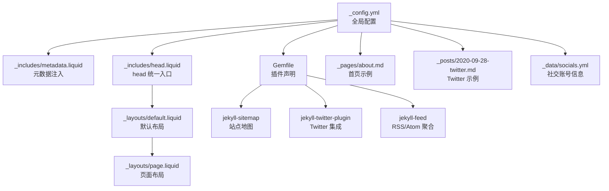
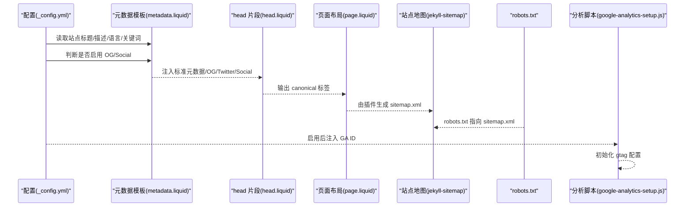
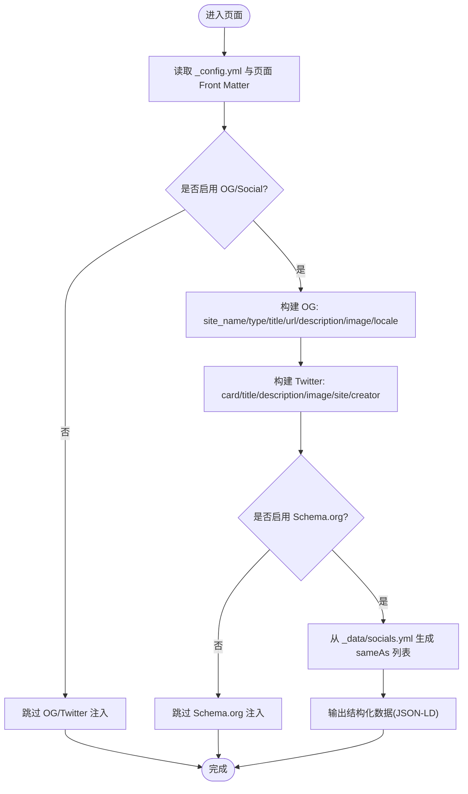
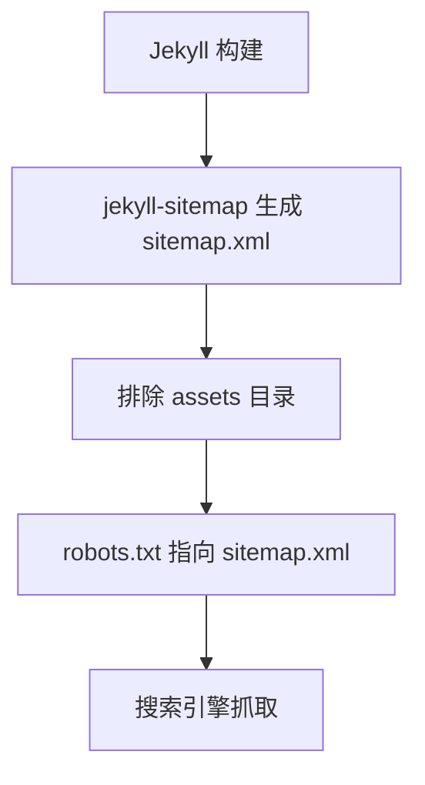
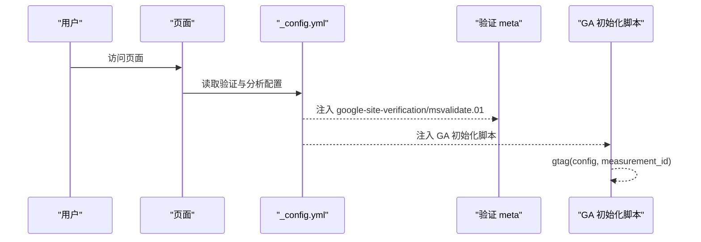
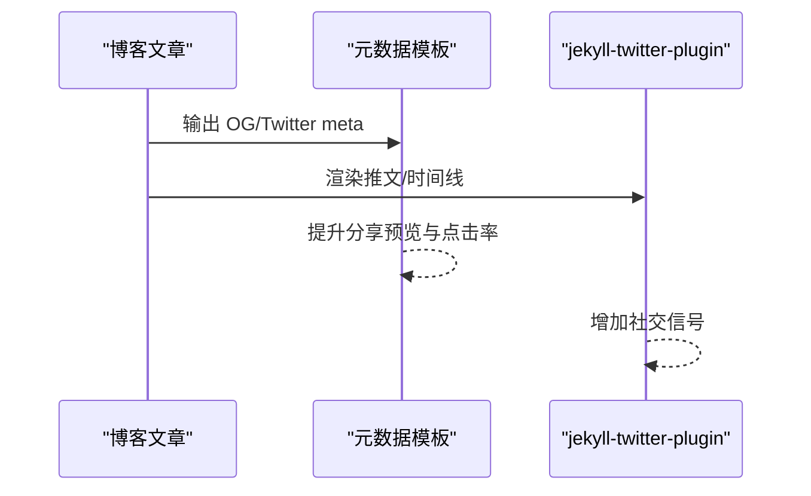
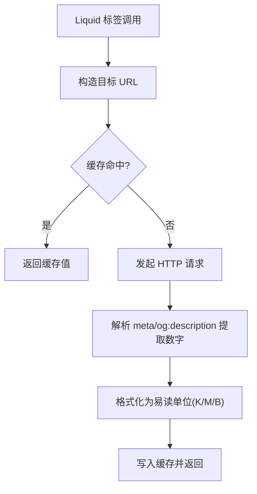
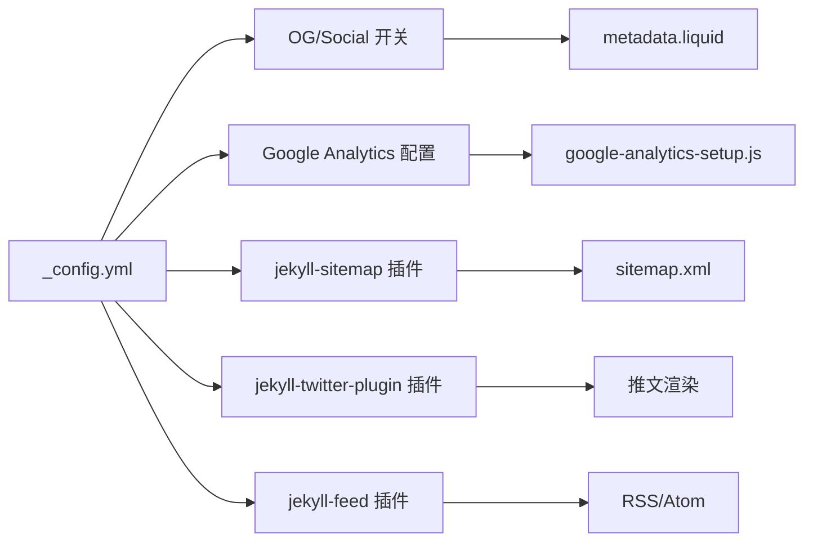

# SEO 优化策略

<cite>
**本文引用的文件**
- [_config.yml](file://_config.yml)
- [robots.txt](file://robots.txt)
- [_includes/metadata.liquid](file://_includes/metadata.liquid)
- [_includes/head.liquid](file://_includes/head.liquid)
- [_layouts/default.liquid](file://_layouts/default.liquid)
- [_layouts/page.liquid](file://_layouts/page.liquid)
- [_pages/about.md](file://_pages/about.md)
- [_posts/2020-09-28-twitter.md](file://_posts/2020-09-28-twitter.md)
- [_data/socials.yml](file://_data/socials.yml)
- [Gemfile](file://Gemfile)
- [_scripts/google-analytics-setup.js](file://_scripts/google-analytics-setup.js)
- [_plugins/google-scholar-citations.rb](file://_plugins/google-scholar-citations.rb)
- [_plugins/inspirehep-citations.rb](file://_plugins/inspirehep-citations.rb)
</cite>

## 目录
1. [简介](#简介)
2. [项目结构](#项目结构)
3. [核心组件](#核心组件)
4. [架构总览](#架构总览)
5. [详细组件分析](#详细组件分析)
6. [依赖关系分析](#依赖关系分析)
7. [性能考量](#性能考量)
8. [故障排查指南](#故障排查指南)
9. [结论](#结论)
10. [附录](#附录)

## 简介
本文件面向 al-folio 主题的 SEO 优化，系统梳理元数据（Open Graph、Twitter Cards、Schema.org）、站点地图与 robots.txt 配置、关键词与内容结构化、社交媒体分享对 SEO 的影响，以及索引状态监控与评估方法。文档基于仓库现有实现进行分析，并给出可操作的改进建议与最佳实践。

## 项目结构
al-folio 使用 Jekyll 构建静态站点，SEO 相关能力主要通过以下模块协同实现：
- 全局配置：站点标题、描述、语言、关键词、基础 URL、验证与分析配置等
- 模板片段：head 中注入标准元数据、Open Graph、Twitter Card、Schema.org 结构化数据
- 布局层：页面默认布局包含 canonical 标签与 head 片段
- 插件生态：sitemap、feed、twitter 插件、自定义引用计数插件等
- 内容层：页面 Front Matter 可覆盖描述、关键词、OG 图片等 SEO 字段

图表来源
- [_config.yml](file://_config.yml)
- [_includes/metadata.liquid](file://_includes/metadata.liquid)
- [_includes/head.liquid](file://_includes/head.liquid)
- [_layouts/default.liquid](file://_layouts/default.liquid)
- [_layouts/page.liquid](file://_layouts/page.liquid)
- [Gemfile](file://Gemfile)
- [_pages/about.md](file://_pages/about.md)
- [_posts/2020-09-28-twitter.md](file://_posts/2020-09-28-twitter.md)
- [_data/socials.yml](file://_data/socials.yml)

章节来源
- [_config.yml](file://_config.yml)
- [_includes/head.liquid](file://_includes/head.liquid)
- [_layouts/default.liquid](file://_layouts/default.liquid)
- [_layouts/page.liquid](file://_layouts/page.liquid)
- [Gemfile](file://Gemfile)

## 核心组件
- 元数据与结构化数据
  - 标准元数据：charset、viewport、X-UA-Compatible、作者、描述、关键词
  - Open Graph：站点名、类型（文章/网站）、标题、URL、描述、图片、语言
  - Twitter Cards：卡片类型、标题、描述、图片、站点与作者账号
  - Schema.org：作者、URL、类型（文章/网站）、描述、标题、sameAs 社交链接
- 站点地图与 robots.txt
  - 通过 jekyll-sitemap 生成 sitemap.xml
  - robots.txt 动态指向 sitemap.xml 并允许所有爬虫抓取
- 分析与验证
  - 支持 Google/Bing 站点验证
  - 支持 Google Analytics（需启用并配置 measurement ID）
- 社交媒体集成
  - Twitter 卡片与嵌入式推文
  - 社交账号在 Schema.org sameAs 中统一呈现

章节来源
- [_includes/metadata.liquid](file://_includes/metadata.liquid)
- [robots.txt](file://robots.txt)
- [_config.yml](file://_config.yml)
- [_posts/2020-09-28-twitter.md](file://_posts/2020-09-28-twitter.md)
- [_data/socials.yml](file://_data/socials.yml)

## 架构总览
下图展示 SEO 相关的关键流程：配置驱动模板注入元数据，布局统一输出 canonical，插件生成 sitemap，robots.txt 指向 sitemap，分析脚本在运行时初始化。

图表来源
- [_config.yml](file://_config.yml)
- [_includes/metadata.liquid](file://_includes/metadata.liquid)
- [_includes/head.liquid](file://_includes/head.liquid)
- [_layouts/page.liquid](file://_layouts/page.liquid)
- [robots.txt](file://robots.txt)
- [_scripts/google-analytics-setup.js](file://_scripts/google-analytics-setup.js)

## 详细组件分析

### 元数据与结构化数据（Open Graph、Twitter Cards、Schema.org）
- 标准元数据
  - 包含字符集、视口、兼容性、作者、描述、关键词等
  - 页面级 Front Matter 可覆盖站点级默认值
- Open Graph
  - 类型根据是否为博客文章自动区分
  - URL 使用绝对路径，避免重复内容问题
  - 图片优先使用页面级 og_image，否则回退到站点级 og_image
- Twitter Cards
  - 卡片类型为 summary，标题与描述继承标准 meta
  - 若配置了 x_username，则输出 twitter:site 与 twitter:creator
- Schema.org
  - 自动生成 author、url、type、description、headline、name
  - sameAs 列表从 _data/socials.yml 中提取多平台链接
  - 仅在开启 serve_schema_org 时输出

图表来源
- [_includes/metadata.liquid](file://_includes/metadata.liquid)
- [_data/socials.yml](file://_data/socials.yml)
- [_config.yml](file://_config.yml)

章节来源
- [_includes/metadata.liquid](file://_includes/metadata.liquid)
- [_data/socials.yml](file://_data/socials.yml)
- [_config.yml](file://_config.yml)

### 站点地图与 robots.txt
- 站点地图
  - 通过 jekyll-sitemap 插件生成 sitemap.xml
  - 默认排除 assets 目录（在 _config.yml 中通过 defaults 设置）
- robots.txt
  - 允许所有爬虫访问
  - 动态指向 sitemap.xml，确保搜索引擎发现

图表来源
- [robots.txt](file://robots.txt)
- [_config.yml](file://_config.yml)

章节来源
- [robots.txt](file://robots.txt)
- [_config.yml](file://_config.yml)

### 分析与验证（Google/Bing）
- 站点验证
  - 在 _config.yml 中启用对应开关并填入验证 ID，模板会注入相应 meta
  - robots.txt 中已包含验证后的站点映射
- 分析脚本
  - 当启用 google_analytics 且配置 measurement ID 时，模板注入 GA 初始化脚本
  - 运行时通过 gtag() 接口上报

图表来源
- [_includes/metadata.liquid](file://_includes/metadata.liquid)
- [_scripts/google-analytics-setup.js](file://_scripts/google-analytics-setup.js)
- [_config.yml](file://_config.yml)
- [robots.txt](file://robots.txt)

章节来源
- [_includes/metadata.liquid](file://_includes/metadata.liquid)
- [_scripts/google-analytics-setup.js](file://_scripts/google-analytics-setup.js)
- [_config.yml](file://_config.yml)
- [robots.txt](file://robots.txt)

### 社交媒体分享与 SEO 影响
- Twitter 集成
  - 支持在文章中嵌入推文与时间线
  - 同时通过 OG/Twitter meta 提升分享预览质量
- 社交账号统一呈现
  - Schema.org sameAs 将多个平台账号集中展示，增强权威性与信任度

图表来源
- [_posts/2020-09-28-twitter.md](file://_posts/2020-09-28-twitter.md)
- [_includes/metadata.liquid](file://_includes/metadata.liquid)
- [Gemfile](file://Gemfile)

章节来源
- [_posts/2020-09-28-twitter.md](file://_posts/2020-09-28-twitter.md)
- [_includes/metadata.liquid](file://_includes/metadata.liquid)
- [Gemfile](file://Gemfile)

### 关键词优化与内容结构化最佳实践
- 关键词与描述
  - 使用页面 Front Matter 的 keywords 与 description 覆盖站点默认值
  - 避免堆砌关键词，保持自然与相关性
- 内容结构化
  - 合理使用标题层级（H1/H2/H3），确保语义清晰
  - 为图片添加 alt 属性（如适用），提升可访问性与 SEO
- Canonical 标签
  - 布局中已输出 canonical，避免重复内容惩罚

章节来源
- [_includes/head.liquid](file://_includes/head.liquid)
- [_layouts/page.liquid](file://_layouts/page.liquid)

### 引用计数与学术内容 SEO
- Google Scholar 引用计数
  - 自定义 Liquid 标签通过抓取页面 meta 或 OG 描述解析“被引用次数”
  - 缓存结果，降低重复请求
- InspireHEP 引用计数
  - 通过 API 获取引用次数并格式化显示

图表来源
- [_plugins/google-scholar-citations.rb](file://_plugins/google-scholar-citations.rb)
- [_plugins/inspirehep-citations.rb](file://_plugins/inspirehep-citations.rb)

章节来源
- [_plugins/google-scholar-citations.rb](file://_plugins/google-scholar-citations.rb)
- [_plugins/inspirehep-citations.rb](file://_plugins/inspirehep-citations.rb)

## 依赖关系分析
- 插件依赖
  - jekyll-sitemap：生成 sitemap.xml
  - jekyll-twitter-plugin：渲染 Twitter 嵌入
  - jekyll-feed：生成 RSS/Atom
  - jekyll-paginate-v2、jekyll-archives-v2：分页与归档
- 配置耦合
  - OG/Social 开关与站点级 og_image、x_username 等字段强相关
  - 分析脚本依赖 google_analytics 配置项

图表来源
- [_config.yml](file://_config.yml)
- [_includes/metadata.liquid](file://_includes/metadata.liquid)
- [_scripts/google-analytics-setup.js](file://_scripts/google-analytics-setup.js)
- [Gemfile](file://Gemfile)

章节来源
- [Gemfile](file://Gemfile)
- [_config.yml](file://_config.yml)

## 性能考量
- 资源加载
  - 头部样式与脚本采用 defer 与相对路径，减少阻塞
  - 图片懒加载与响应式 WebP 已启用，有助于提升 Core Web Vitals
- 构建优化
  - jekyll-minifier 与 jekyll-terser 用于压缩 JS/CSS
  - exclude 配置避免对 robots.txt 与特定脚本进行压缩
- 站点地图与抓取
  - robots.txt 允许抓取，sitemap.xml 动态指向，利于搜索引擎快速收录

章节来源
- [_includes/head.liquid](file://_includes/head.liquid)
- [_config.yml](file://_config.yml)
- [robots.txt](file://robots.txt)

## 故障排查指南
- OG/Twitter/Social 未生效
  - 检查 _config.yml 中 serve_og_meta 与 serve_schema_org 是否开启
  - 确认页面 Front Matter 中是否设置了 og_image、description、keywords
- Canonical 标签异常
  - 确认页面布局是否正确引入 head 片段
  - 检查 _config.yml 中 url/baseurl 配置是否正确
- 站点地图未被发现
  - 确认 jekyll-sitemap 已安装并启用
  - 检查 robots.txt 是否正确指向 sitemap.xml
- 分析脚本未执行
  - 确认 google_analytics 已配置且启用
  - 检查 _scripts/google-analytics-setup.js 是否被正确注入
- 引用计数显示 N/A
  - 网络或目标页面结构变化可能导致解析失败
  - 查看控制台日志定位具体错误

章节来源
- [_includes/metadata.liquid](file://_includes/metadata.liquid)
- [_includes/head.liquid](file://_includes/head.liquid)
- [_config.yml](file://_config.yml)
- [robots.txt](file://robots.txt)
- [_scripts/google-analytics-setup.js](file://_scripts/google-analytics-setup.js)
- [_plugins/google-scholar-citations.rb](file://_plugins/google-scholar-citations.rb)
- [_plugins/inspirehep-citations.rb](file://_plugins/inspirehep-citations.rb)

## 结论
本项目在 SEO 方面具备良好的基础设施：统一的元数据注入、完善的 OG/Twitter/Social 输出、结构化数据支持、sitemap 与 robots.txt 配置、分析与验证集成。建议在现有基础上进一步完善页面级描述与关键词、确保 canonical 正确、持续监控索引状态与性能指标，以获得更佳的搜索可见性与用户体验。

## 附录
- SEO 性能评估与测试方法
  - 使用 Lighthouse Desktop/Mobile 报告对比优化前后指标
  - 在 Google Search Console 与 Bing Webmaster Tools 查看索引状态与抓取错误
  - 使用 Screaming Frog 或 Sitebulb 进行深度爬取与内部链接审计
  - 关注 Core Web Vitals 指标，结合构建优化持续改进

章节来源
- [robots.txt](file://robots.txt)
- [_config.yml](file://_config.yml)