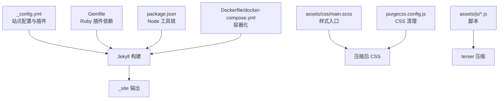
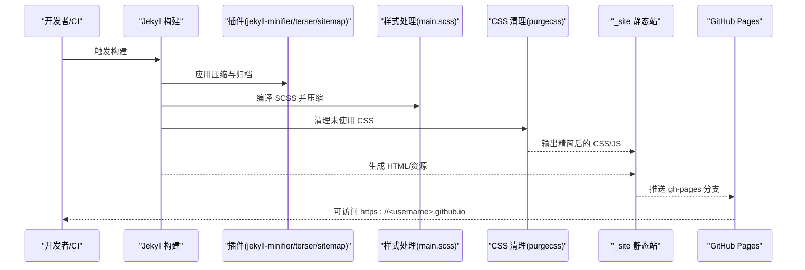
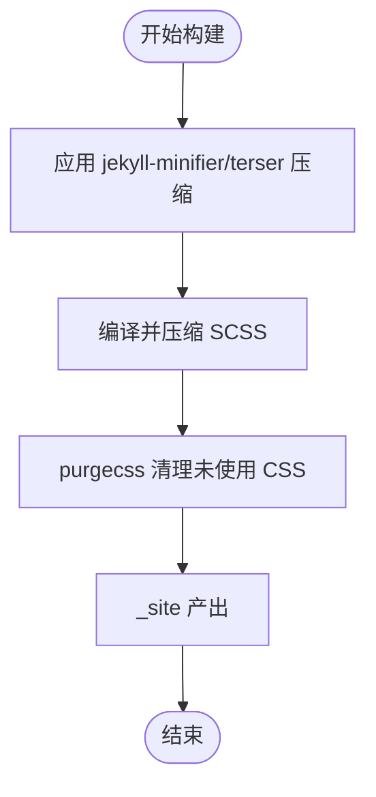
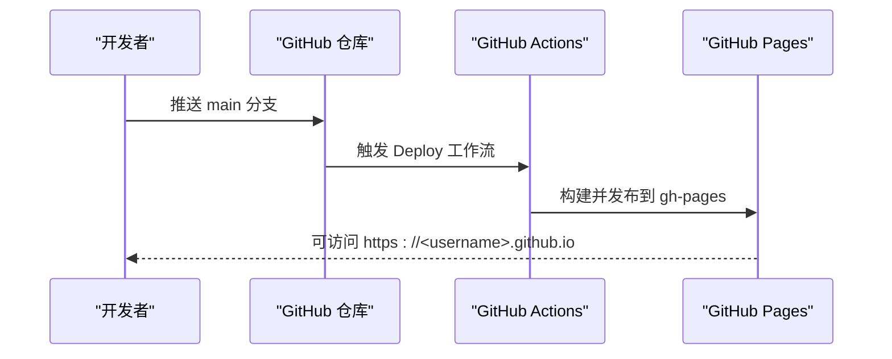
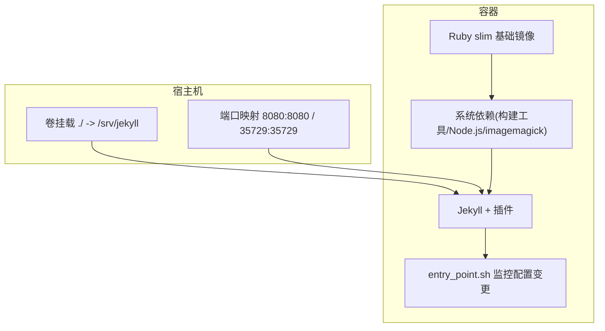
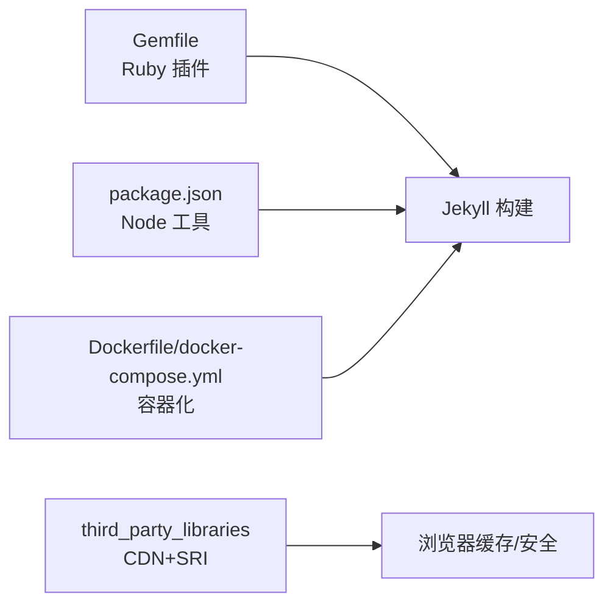

# 性能优化和部署

<cite>
**本文引用的文件**
- [_config.yml](file://_config.yml)
- [Gemfile](file://Gemfile)
- [package.json](file://package.json)
- [Dockerfile](file://Dockerfile)
- [docker-compose.yml](file://docker-compose.yml)
- [bin/entry_point.sh](file://bin/entry_point.sh)
- [purgecss.config.js](file://purgecss.config.js)
- [INSTALL.md](file://INSTALL.md)
- [CUSTOMIZE.md](file://CUSTOMIZE.md)
- [README.md](file://README.md)
- [assets/js/common.js](file://assets/js/common.js)
- [assets/css/main.scss](file://assets/css/main.scss)
- [.github/release.yml](file://.github/release.yml)
- [.github/stale.yml](file://.github/stale.yml)
</cite>

## 目录
1. [简介](#简介)
2. [项目结构](#项目结构)
3. [核心组件](#核心组件)
4. [架构总览](#架构总览)
5. [详细组件分析](#详细组件分析)
6. [依赖关系分析](#依赖关系分析)
7. [性能考量](#性能考量)
8. [故障排除指南](#故障排除指南)
9. [结论](#结论)
10. [附录](#附录)

## 简介
本文件面向 al-folio 主题在个人网站中的性能优化与部署实践，聚焦以下方面：
- 构建优化：资源压缩、CSS 清理、JavaScript 压缩与日志清理
- 缓存与 CDN：通过站点配置与第三方库完整性校验（SRI）提升缓存命中与安全性
- GitHub Pages 自动部署：仓库配置、分支管理、域名与 HTTPS 设置
- Docker 容器化：镜像构建、开发容器与本地预览
- 性能监控与分析：Google Analytics、Lighthouse 报告与持续集成中的度量
- SEO 最佳实践：元数据、结构化数据、站点地图与验证
- 响应式设计与移动端优化：懒加载、图片响应式与主题暗色模式
- 性能测试与基准：桌面/移动 Lighthouse 结果与测试方法
- 故障排除：常见部署问题与解决思路
- 安全与 HTTPS：SRI、CDN 使用与 GitHub Pages 默认 HTTPS

## 项目结构
al-folio 是基于 Jekyll 的静态站点，采用“内容 + 主题样式 + 插件”的分层组织方式。关键目录与职责如下：
- 根配置与构建：_config.yml、Gemfile、package.json
- 容器化：Dockerfile、docker-compose.yml、bin/entry_point.sh
- 资源与样式：assets/css/main.scss、assets/js/*.js
- 清理与优化：purgecss.config.js
- 文档与工作流：INSTALL.md、CUSTOMIZE.md、README.md、.github/release.yml、.github/stale.yml

图表来源
- [_config.yml:200-229](file://_config.yml#L200-L229)
- [Gemfile:6-26](file://Gemfile#L6-L26)
- [package.json:1-10](file://package.json#L1-L10)
- [assets/css/main.scss:1-26](file://assets/css/main.scss#L1-L26)
- [purgecss.config.js:1-7](file://purgecss.config.js#L1-L7)
- [Dockerfile:1-77](file://Dockerfile#L1-L77)
- [docker-compose.yml:1-22](file://docker-compose.yml#L1-L22)

章节来源
- [_config.yml:1-646](file://_config.yml#L1-L646)
- [Gemfile:1-39](file://Gemfile#L1-L39)
- [package.json:1-10](file://package.json#L1-L10)
- [assets/css/main.scss:1-26](file://assets/css/main.scss#L1-L26)
- [purgecss.config.js:1-7](file://purgecss.config.js#L1-L7)
- [Dockerfile:1-77](file://Dockerfile#L1-L77)
- [docker-compose.yml:1-22](file://docker-compose.yml#L1-L22)

## 核心组件
- 站点配置与插件
  - 启用 jekyll-minifier 与 jekyll-terser 进行 HTML/JS 压缩；禁用 jekyll-minifier 的 JS 压缩以避免冲突，改由 terser 执行
  - 启用 jekyll-sitemap、jekyll-feed、jekyll-archives 等 SEO/归档相关插件
  - 启用 jekyll-imagemagick 实现响应式 WebP 图片与懒加载
- 容器化与本地开发
  - Dockerfile 指定 Ruby slim 基础镜像，安装构建依赖与 Node.js，并设置生产环境变量
  - docker-compose.yml 提供开发端口映射与卷挂载，支持热重载
  - entry_point.sh 监控 _config.yml 变更并自动重启 Jekyll
- 样式与脚本
  - main.scss 统一引入主题样式模块
  - common.js 提供交互与主题切换逻辑
- CSS 清理
  - purgecss.config.js 在构建后清理未使用的 CSS 类，减小体积

章节来源
- [_config.yml:200-295](file://_config.yml#L200-L295)
- [Dockerfile:1-77](file://Dockerfile#L1-L77)
- [docker-compose.yml:1-22](file://docker-compose.yml#L1-L22)
- [bin/entry_point.sh:1-38](file://bin/entry_point.sh#L1-L38)
- [assets/css/main.scss:1-26](file://assets/css/main.scss#L1-L26)
- [assets/js/common.js:1-60](file://assets/js/common.js#L1-L60)
- [purgecss.config.js:1-7](file://purgecss.config.js#L1-L7)

## 架构总览
下图展示从源码到最终发布的核心流程：本地或 CI 中运行 Jekyll 构建，应用压缩与清理，生成静态站点，再由 GitHub Pages 发布。

图表来源
- [_config.yml:200-295](file://_config.yml#L200-L295)
- [assets/css/main.scss:1-26](file://assets/css/main.scss#L1-L26)
- [purgecss.config.js:1-7](file://purgecss.config.js#L1-L7)
- [INSTALL.md:129-158](file://INSTALL.md#L129-L158)

章节来源
- [INSTALL.md:129-158](file://INSTALL.md#L129-L158)

## 详细组件分析

### 构建优化策略
- 资源压缩
  - HTML/JS 压缩：启用 jekyll-minifier（排除特定文件），同时启用 jekyll-terser 并配置 drop_console，减少生产包体积与日志输出
  - 样式压缩：SCSS 编译时使用压缩模式
- CSS 清理
  - purgecss 在 _site 上下文扫描 HTML/JS，清理未使用的 CSS 类，显著降低 CSS 体积
- 日志与调试
  - 生产环境关闭 console 日志，减少冗余输出
- 图片优化
  - 启用 jekyll-imagemagick，按宽度生成多尺寸 WebP，结合懒加载提升首屏性能

图表来源
- [_config.yml:234-245](file://_config.yml#L234-L245)
- [assets/css/main.scss:1-26](file://assets/css/main.scss#L1-L26)
- [purgecss.config.js:1-7](file://purgecss.config.js#L1-L7)

章节来源
- [_config.yml:234-245](file://_config.yml#L234-L245)
- [purgecss.config.js:1-7](file://purgecss.config.js#L1-L7)

### 缓存策略与 CDN 集成
- 第三方库完整性校验（SRI）
  - 通过 third_party_libraries 配置 integrity 值，确保 CDN 引入的库未被篡改，同时可利用浏览器缓存
- 图片缓存
  - 响应式 WebP 与懒加载减少带宽占用，提升缓存命中率
- 站点缓存
  - GitHub Pages 默认缓存策略配合 SRI 与版本化资源名可进一步优化缓存效果

章节来源
- [_config.yml:403-624](file://_config.yml#L403-L624)

### GitHub Pages 自动部署流程
- 仓库配置
  - 个人/组织页仓库名需为 <username>.github.io 或 <org>.github.io
  - 在 Settings -> Actions -> General -> Workflow permissions 开启读写权限
- 分支管理
  - 自动部署会生成 gh-pages 分支，发布源选择该分支
- 域名与 HTTPS
  - GitHub Pages 默认启用 HTTPS；自定义域名需在 Pages 设置中配置
- 手动触发
  - 可在 Actions 中手动运行 Deploy 工作流进行重部署

图表来源
- [INSTALL.md:149-157](file://INSTALL.md#L149-L157)

章节来源
- [INSTALL.md:134-157](file://INSTALL.md#L134-L157)

### Docker 容器化部署
- 镜像与依赖
  - Ruby slim 基础镜像，安装 build-essential、curl、git、imagemagick、nodejs 等
  - 生产环境变量设置，确保构建一致性
- 开发体验
  - docker-compose 映射 8080 端口与 LiveReload 端口，挂载当前目录至 /srv/jekyll
  - entry_point.sh 监控 _config.yml 变更并自动重启 Jekyll，提升迭代效率
- 优势
  - 与 CI 环境一致，避免“在我机器上能跑”的问题；便于团队协作与自动化

图表来源
- [Dockerfile:1-77](file://Dockerfile#L1-L77)
- [docker-compose.yml:1-22](file://docker-compose.yml#L1-L22)
- [bin/entry_point.sh:1-38](file://bin/entry_point.sh#L1-L38)

章节来源
- [Dockerfile:1-77](file://Dockerfile#L1-L77)
- [docker-compose.yml:1-22](file://docker-compose.yml#L1-L22)
- [bin/entry_point.sh:1-38](file://bin/entry_point.sh#L1-L38)

### 性能监控与分析
- Google Analytics
  - 在 _config.yml 中配置 google_analytics 等字段，启用后可在页面注入统计代码
- Lighthouse
  - README.md 展示了桌面与移动端 Lighthouse PageSpeed 报告链接，可用于对比优化前后指标
- 其他工具
  - README.md 列举 Prettier、lychee、Axe 等质量与可访问性检查工具，建议纳入 CI

章节来源
- [_config.yml:76-85](file://_config.yml#L76-L85)
- [README.md:210-223](file://README.md#L210-L223)

### SEO 优化最佳实践
- 元数据与结构化数据
  - 可通过 _config.yml 控制 Open Graph 与 Schema.org 元标签开关（默认关闭）
- 站点地图与归档
  - 启用 jekyll-sitemap 与 jekyll-archives，提升搜索引擎收录
- 验证与索引
  - 支持 Google Search Console 与 Bing Webmaster 验证字段
- 内容组织
  - 使用 collections（news、projects、books）与归档功能，保持 URL 结构清晰

章节来源
- [_config.yml:64-85](file://_config.yml#L64-L85)
- [_config.yml:200-261](file://_config.yml#L200-L261)

### 响应式设计与移动端优化
- 图片优化
  - 启用 jekyll-imagemagick 生成多尺寸 WebP，并开启懒加载
- 主题与交互
  - 支持暗色模式；common.js 处理弹出提示与 Jupyter Notebook 样式适配
- 样式组织
  - main.scss 模块化引入，便于按需裁剪与定制

章节来源
- [_config.yml:349-395](file://_config.yml#L349-L395)
- [assets/js/common.js:1-60](file://assets/js/common.js#L1-L60)
- [assets/css/main.scss:1-26](file://assets/css/main.scss#L1-L26)

### 性能测试与基准
- 测试方法
  - 使用 Google Lighthouse PageSpeed 对桌面与移动设备分别进行评测
  - 可在本地或 CI 中运行 Lighthouse，记录报告并与历史对比
- 基准参考
  - README.md 提供官方示例报告链接，可作为优化目标的参考基线

章节来源
- [README.md:210-223](file://README.md#L210-L223)

### 故障排除指南
- Docker 权限问题
  - Dockerfile 注释中提供了针对 .jekyll-cache 权限问题的说明与修复建议
- 配置变更不生效
  - entry_point.sh 仅监听 _config.yml 变更，若修改其他配置需确认是否触发重建
- 自动部署未触发
  - 确认 Actions 已启用且工作流权限已配置；检查 gh-pages 分支是否正确设置为发布源
- CSS 未清理
  - 确保 purgecss 在构建后执行，且内容路径与输出路径配置正确

章节来源
- [Dockerfile:3-21](file://Dockerfile#L3-L21)
- [bin/entry_point.sh:29-37](file://bin/entry_point.sh#L29-L37)
- [INSTALL.md:149-157](file://INSTALL.md#L149-L157)
- [purgecss.config.js:1-7](file://purgecss.config.js#L1-L7)

## 依赖关系分析
- 构建依赖
  - Ruby 插件：jekyll、jekyll-archives-v2、jekyll-sitemap、jekyll-terser 等
  - Node 工具：Jekyll CLI、Prettier（Liquid 格式化）
- 运行时依赖
  - 第三方库通过 CDN 引入并配置 SRI，确保安全与缓存友好
- 开发依赖
  - Docker 与 docker-compose 提供一致的开发与 CI 环境

图表来源
- [Gemfile:6-26](file://Gemfile#L6-L26)
- [package.json:1-10](file://package.json#L1-L10)
- [Dockerfile:1-77](file://Dockerfile#L1-L77)
- [_config.yml:403-624](file://_config.yml#L403-L624)

章节来源
- [Gemfile:1-39](file://Gemfile#L1-L39)
- [package.json:1-10](file://package.json#L1-L10)
- [_config.yml:403-624](file://_config.yml#L403-L624)

## 性能考量
- 减少请求数与体积
  - 合理使用压缩与清理工具，避免重复打包
- 缓存与持久化
  - 通过 SRI 与 CDN 提升缓存命中；对静态资源采用长期缓存策略
- 渲染性能
  - 图片懒加载与响应式图片减少首屏阻塞
- 构建稳定性
  - Docker 化与 CI 一致的构建环境，降低因环境差异导致的性能波动

## 故障排除指南
- Docker 权限问题
  - 若遇到 .jekyll-cache 权限错误，参考 Dockerfile 注释调整用户/组 ID 或使用非 root 用户
- 配置热更新
  - entry_point.sh 仅监控 _config.yml，其他配置需手动触发重建
- 自动部署失败
  - 检查 Actions 权限、工作流状态与 gh-pages 分支发布源设置
- CSS 未清理
  - 确认 purgecss 的输入输出路径与构建产物一致

章节来源
- [Dockerfile:3-21](file://Dockerfile#L3-L21)
- [bin/entry_point.sh:29-37](file://bin/entry_point.sh#L29-L37)
- [INSTALL.md:149-157](file://INSTALL.md#L149-L157)
- [purgecss.config.js:1-7](file://purgecss.config.js#L1-L7)

## 结论
通过合理配置 Jekyll 插件、启用压缩与清理、采用 Docker 与 GitHub Pages 自动化，以及结合 Lighthouse 与 Google Analytics 的持续监控，al-folio 个人网站可在保证开发体验的同时获得良好的性能表现与可维护性。建议在团队协作中统一使用容器化构建，并将 SEO、缓存与安全（SRI）纳入 CI 流程。

## 附录
- 相关文档与配置
  - 安装与部署：INSTALL.md
  - 自定义指南：CUSTOMIZE.md
  - 项目说明与示例报告：README.md
  - 发布与维护工作流：.github/release.yml、.github/stale.yml

章节来源
- [INSTALL.md:1-252](file://INSTALL.md#L1-L252)
- [CUSTOMIZE.md:1-295](file://CUSTOMIZE.md#L1-L295)
- [README.md:1-487](file://README.md#L1-L487)
- [.github/release.yml:1-15](file://.github/release.yml#L1-L15)
- [.github/stale.yml:1-19](file://.github/stale.yml#L1-L19)