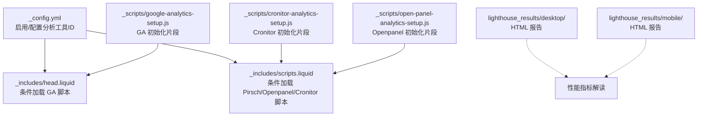
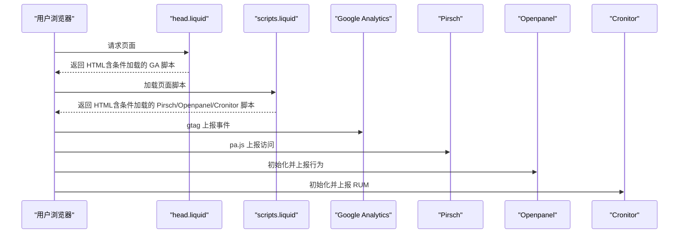
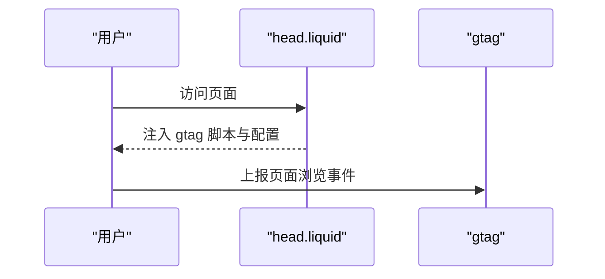
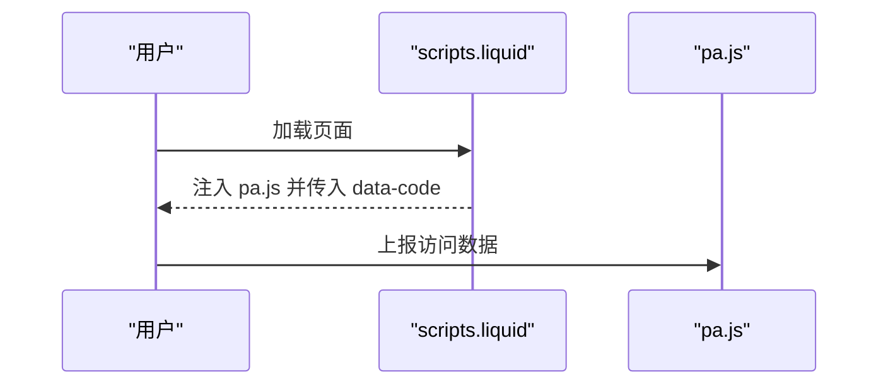
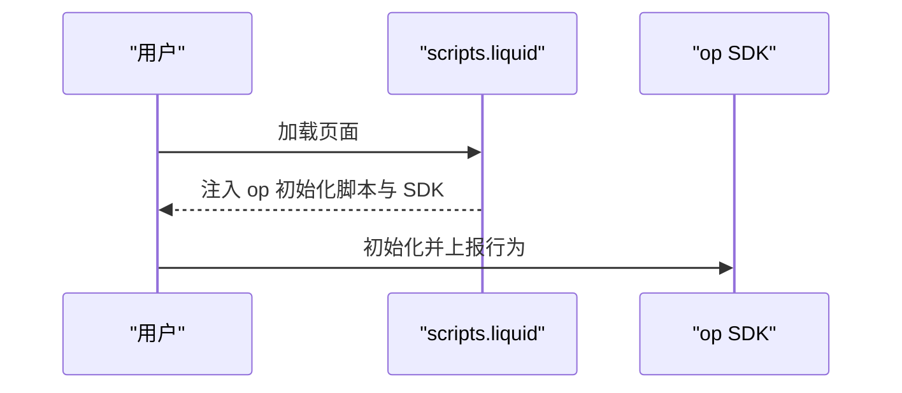
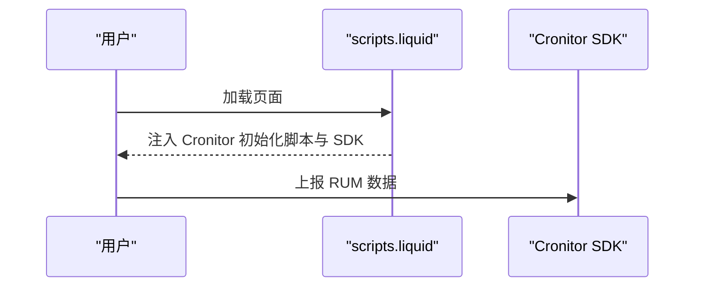
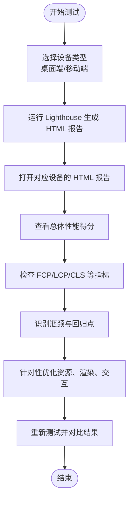
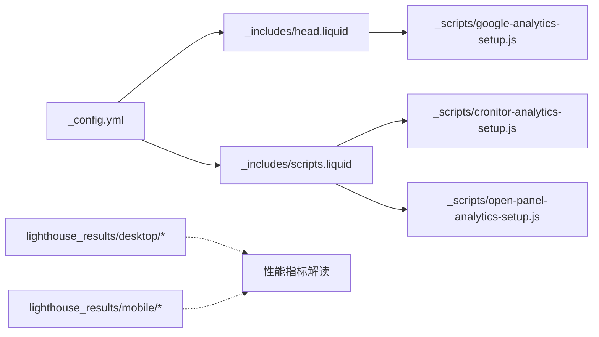

# 性能监控和分析

<cite>
**本文引用的文件**
- [_config.yml](file://_config.yml)
- [README.md](file://README.md)
- [_includes/head.liquid](file://_includes/head.liquid)
- [_includes/scripts.liquid](file://_includes/scripts.liquid)
- [_includes/metadata.liquid](file://_includes/metadata.liquid)
- [_scripts/google-analytics-setup.js](file://_scripts/google-analytics-setup.js)
- [_scripts/cronitor-analytics-setup.js](file://_scripts/cronitor-analytics-setup.js)
- [_scripts/open-panel-analytics-setup.js](file://_scripts/open-panel-analytics-setup.js)
- [lighthouse_results/desktop/alshedivat_github_io_al_folio_.html](file://lighthouse_results/desktop/alshedivat_github_io_al_folio_.html)
- [lighthouse_results/mobile/alshedivat_github_io_al_folio_.html](file://lighthouse_results/mobile/alshedivat_github_io_al_folio_.html)
</cite>

## 目录
1. [简介](#简介)
2. [项目结构](#项目结构)
3. [核心组件](#核心组件)
4. [架构总览](#架构总览)
5. [详细组件分析](#详细组件分析)
6. [依赖关系分析](#依赖关系分析)
7. [性能考虑](#性能考虑)
8. [故障排查指南](#故障排查指南)
9. [结论](#结论)
10. [附录](#附录)

## 简介
本文件面向 al-folio 主题的性能监控与分析，系统性说明以下内容：
- Google Analytics、Pirsch、Openpanel、Cronitor 等分析工具在站点中的集成与配置要点
- Lighthouse 在桌面端与移动端的测试结果解读与对比
- 页面加载性能指标（FCP、LCP、CLS 等 Core Web Vitals）的监控与追踪建议
- 基准测试方法与工具链（PageSpeed Insights、GTmetrix 等）
- 实时性能监控与告警机制的落地思路
- 性能优化前后效果的跟踪与评估方法

## 项目结构
围绕性能监控与分析的关键文件分布如下：
- 配置层：通过站点配置启用/禁用各分析工具，并注入 ID
- 模板层：在页面头部与脚本区按条件加载分析脚本
- 脚本层：提供各分析平台的初始化脚本片段
- 测试报告：Lighthouse 输出的桌面端与移动端 HTML 报告

**图表来源**
- [_config.yml](file://_config.yml)
- [_includes/head.liquid](file://_includes/head.liquid)
- [_includes/scripts.liquid](file://_includes/scripts.liquid)
- [_scripts/google-analytics-setup.js](file://_scripts/google-analytics-setup.js)
- [_scripts/cronitor-analytics-setup.js](file://_scripts/cronitor-analytics-setup.js)
- [_scripts/open-panel-analytics-setup.js](file://_scripts/open-panel-analytics-setup.js)
- [lighthouse_results/desktop/alshedivat_github_io_al_folio_.html](file://lighthouse_results/desktop/alshedivat_github_io_al_folio_.html)
- [lighthouse_results/mobile/alshedivat_github_io_al_folio_.html](file://lighthouse_results/mobile/alshedivat_github_io_al_folio_.html)

**章节来源**
- [_config.yml](file://_config.yml)
- [_includes/head.liquid](file://_includes/head.liquid)
- [_includes/scripts.liquid](file://_includes/scripts.liquid)

## 核心组件
- 站点配置与开关
  - 启用/禁用 Google Analytics、Pirsch、Openpanel、Cronitor 等分析工具
  - 注入各平台的 Site ID 或 Client ID
- 头部与脚本模板
  - 条件性引入分析脚本，避免未启用时的资源浪费
  - 通过 Liquid 变量注入 ID，确保一致性
- 分析脚本片段
  - 提供 GA、Cronitor、Openpanel 的最小化初始化逻辑
- Lighthouse 报告
  - 桌面端与移动端 HTML 报告，用于对比不同设备下的性能表现

**章节来源**
- [_config.yml](file://_config.yml)
- [_includes/head.liquid](file://_includes/head.liquid)
- [_includes/scripts.liquid](file://_includes/scripts.liquid)
- [_scripts/google-analytics-setup.js](file://_scripts/google-analytics-setup.js)
- [_scripts/cronitor-analytics-setup.js](file://_scripts/cronitor-analytics-setup.js)
- [_scripts/open-panel-analytics-setup.js](file://_scripts/open-panel-analytics-setup.js)
- [lighthouse_results/desktop/alshedivat_github_io_al_folio_.html](file://lighthouse_results/desktop/alshedivat_github_io_al_folio_.html)
- [lighthouse_results/mobile/alshedivat_github_io_al_folio_.html](file://lighthouse_results/mobile/alshedivat_github_io_al_folio_.html)

## 架构总览
下图展示了“配置 → 模板注入 → 脚本执行 → 数据上报”的端到端流程。

**图表来源**
- [_includes/head.liquid](file://_includes/head.liquid)
- [_includes/scripts.liquid](file://_includes/scripts.liquid)
- [_scripts/google-analytics-setup.js](file://_scripts/google-analytics-setup.js)
- [_scripts/cronitor-analytics-setup.js](file://_scripts/cronitor-analytics-setup.js)
- [_scripts/open-panel-analytics-setup.js](file://_scripts/open-panel-analytics-setup.js)

## 详细组件分析

### Google Analytics 集成
- 配置项
  - 在站点配置中设置 Measurement ID，并开启 GA 开关
- 模板注入
  - 头部模板条件性加载 GA 脚本与初始化代码
  - 脚本片段提供最小化初始化逻辑
- 使用建议
  - 仅在需要时启用，避免不必要的网络请求
  - 通过仪表盘关注页面浏览量、用户地域分布等指标

**图表来源**
- [_includes/head.liquid](file://_includes/head.liquid)
- [_scripts/google-analytics-setup.js](file://_scripts/google-analytics-setup.js)

**章节来源**
- [_config.yml](file://_config.yml)
- [_includes/head.liquid](file://_includes/head.liquid)
- [_scripts/google-analytics-setup.js](file://_scripts/google-analytics-setup.js)
- [README.md](file://README.md)

### Pirsch 集成
- 配置项
  - 在站点配置中设置 Pirsch Site ID，并开启 Pirsch 开关
- 模板注入
  - 脚本模板条件性加载 Pirsch 脚本，并通过 data-code 注入 Site ID
- 使用建议
  - 关注页面浏览量、来源渠道、语言与国家等维度
  - 与 GA 数据交叉验证，识别异常波动

**图表来源**
- [_includes/scripts.liquid](file://_includes/scripts.liquid)

**章节来源**
- [_config.yml](file://_config.yml)
- [_includes/scripts.liquid](file://_includes/scripts.liquid)

### Openpanel 集成
- 配置项
  - 在站点配置中设置 Openpanel Client ID，并开启 Openpanel 开关
- 模板注入
  - 脚本模板条件性加载初始化脚本与远程 SDK
- 使用建议
  - 利用其属性追踪与屏幕视图追踪能力，结合业务事件进行埋点

**图表来源**
- [_includes/scripts.liquid](file://_includes/scripts.liquid)
- [_scripts/open-panel-analytics-setup.js](file://_scripts/open-panel-analytics-setup.js)

**章节来源**
- [_config.yml](file://_config.yml)
- [_includes/scripts.liquid](file://_includes/scripts.liquid)
- [_scripts/open-panel-analytics-setup.js](file://_scripts/open-panel-analytics-setup.js)

### Cronitor 集成
- 配置项
  - 在站点配置中设置 Cronitor Client Key，并开启 Cronitor 开关
- 模板注入
  - 脚本模板条件性加载初始化脚本与远程 RUM SDK
- 使用建议
  - 通过 RUM 数据观测真实用户性能与错误率

**图表来源**
- [_includes/scripts.liquid](file://_includes/scripts.liquid)
- [_scripts/cronitor-analytics-setup.js](file://_scripts/cronitor-analytics-setup.js)

**章节来源**
- [_config.yml](file://_config.yml)
- [_includes/scripts.liquid](file://_includes/scripts.liquid)
- [_scripts/cronitor-analytics-setup.js](file://_scripts/cronitor-analytics-setup.js)

### Lighthouse 性能测试
- 测试范围
  - 桌面端与移动端两套 HTML 报告
- 使用方法
  - 打开对应设备目录下的 HTML 报告，查看总体得分与各项指标详情
  - 对比桌面端与移动端差异，定位设备特定问题（如图片尺寸、字体加载策略）
- 指标解读
  - FCP（首次内容绘制）、LCP（最大内容绘制）、CLS（累积布局偏移）等 Core Web Vitals
  - 重点关注性能得分变化趋势与回归

**图表来源**
- [lighthouse_results/desktop/alshedivat_github_io_al_folio_.html](file://lighthouse_results/desktop/alshedivat_github_io_al_folio_.html)
- [lighthouse_results/mobile/alshedivat_github_io_al_folio_.html](file://lighthouse_results/mobile/alshedivat_github_io_al_folio_.html)

**章节来源**
- [lighthouse_results/desktop/alshedivat_github_io_al_folio_.html](file://lighthouse_results/desktop/alshedivat_github_io_al_folio_.html)
- [lighthouse_results/mobile/alshedivat_github_io_al_folio_.html](file://lighthouse_results/mobile/alshedivat_github_io_al_folio_.html)

### 基准测试与外部工具
- PageSpeed Insights
  - 提供桌面端与移动端评分，给出具体优化建议
- GTmetrix
  - 展示瀑布图、性能评分与建议清单
- 建议流程
  - 固定测试环境（网络、设备、浏览器版本）
  - 定期对比基线与优化后版本，记录关键指标变化
  - 将 Lighthouse 与第三方工具结果交叉验证

[本节为通用实践说明，不直接分析具体文件，故无“章节来源”]

## 依赖关系分析
- 配置与模板耦合
  - 站点配置决定是否在模板中注入相应脚本
  - 模板通过 Liquid 变量读取配置值，形成低耦合的可插拔设计
- 脚本片段独立性
  - 各分析平台脚本片段相互独立，便于按需启用
- 外部报告依赖
  - Lighthouse 报告作为离线产物，不依赖运行时环境

**图表来源**
- [_config.yml](file://_config.yml)
- [_includes/head.liquid](file://_includes/head.liquid)
- [_includes/scripts.liquid](file://_includes/scripts.liquid)
- [_scripts/google-analytics-setup.js](file://_scripts/google-analytics-setup.js)
- [_scripts/cronitor-analytics-setup.js](file://_scripts/cronitor-analytics-setup.js)
- [_scripts/open-panel-analytics-setup.js](file://_scripts/open-panel-analytics-setup.js)
- [lighthouse_results/desktop/alshedivat_github_io_al_folio_.html](file://lighthouse_results/desktop/alshedivat_github_io_al_folio_.html)
- [lighthouse_results/mobile/alshedivat_github_io_al_folio_.html](file://lighthouse_results/mobile/alshedivat_github_io_al_folio_.html)

**章节来源**
- [_config.yml](file://_config.yml)
- [_includes/head.liquid](file://_includes/head.liquid)
- [_includes/scripts.liquid](file://_includes/scripts.liquid)

## 性能考虑
- 资源加载策略
  - 使用 defer 等属性控制非关键脚本的加载时机，避免阻塞渲染
  - 图片懒加载与响应式图片可显著降低首屏压力
- 分析脚本的按需加载
  - 仅在启用相关功能时注入脚本，减少初始包体
- 指标监控建议
  - 持续追踪 FCP、LCP、CLS 等指标，建立基线与阈值
  - 对比桌面端与移动端差异，识别设备特定优化机会

[本节为通用性能建议，不直接分析具体文件，故无“章节来源”]

## 故障排查指南
- 工具未生效
  - 检查站点配置中对应开关是否开启，ID 是否正确填写
  - 确认模板中条件判断逻辑已正确注入脚本
- 数据异常或缺失
  - 核对初始化脚本片段是否与平台最新 SDK 兼容
  - 在浏览器开发者工具 Network 面板确认脚本加载状态
- Lighthouse 报告偏差
  - 确保测试环境一致（缓存、网络、浏览器版本）
  - 对比多轮测试结果，排除偶发性波动

**章节来源**
- [_config.yml](file://_config.yml)
- [_includes/head.liquid](file://_includes/head.liquid)
- [_includes/scripts.liquid](file://_includes/scripts.liquid)

## 结论
通过在站点配置中统一管理分析工具开关与 ID，并在模板层按需注入脚本，al-folio 实现了灵活且低侵入的性能监控方案。配合 Lighthouse 与第三方基准工具，可形成从离线测试到线上观测的闭环，持续跟踪并优化页面加载性能与用户体验。

[本节为总结性内容，不直接分析具体文件，故无“章节来源”]

## 附录
- 快速对照表
  - Google Analytics：在站点配置中设置 Measurement ID 并开启开关；模板注入 gtag 脚本
  - Pirsch：在站点配置中设置 Site ID 并开启开关；模板注入 pa.js
  - Openpanel：在站点配置中设置 Client ID 并开启开关；模板注入初始化脚本与 SDK
  - Cronitor：在站点配置中设置 Client Key 并开启开关；模板注入初始化脚本与 SDK
  - Lighthouse：分别保存桌面端与移动端 HTML 报告，定期对比指标变化

[本节为辅助信息，不直接分析具体文件，故无“章节来源”]